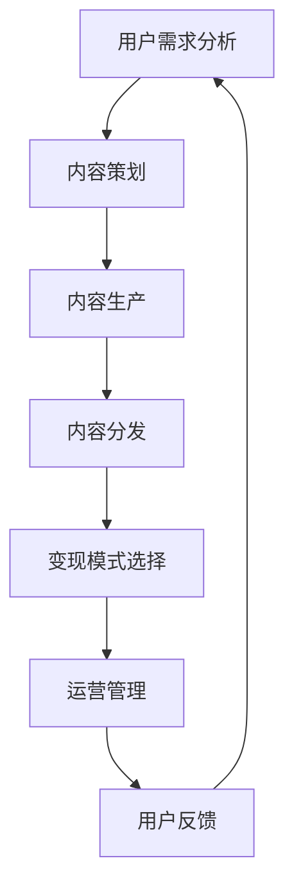

                 

**关键词：知识付费、内容矩阵、创业、用户需求、内容策划、变现模式、运营管理**

## 1. 背景介绍

随着互联网的发展，知识付费已成为一种新的商业模式，受到越来越多创业者的青睐。然而，要想在知识付费领域取得成功，仅靠优质内容是不够的，还需要构建一个有效的内容矩阵。本文将详细介绍如何在知识付费创业中搭建内容矩阵，帮助创业者提高变现能力和用户粘性。

## 2. 核心概念与联系

### 2.1 内容矩阵的定义

内容矩阵是指在知识付费创业中，为满足不同用户需求而策划、组织、分发的内容体系。它由多种内容形式（如音频、视频、文本等）和多个内容层级（如免费、付费、会员等）组成，目的是最大化内容的价值和影响力。

### 2.2 内容矩阵的作用

内容矩阵的作用主要有三个：

1. **满足用户需求**：通过提供多种形式和层级的内容，满足不同用户的学习习惯和付费意愿。
2. **提高变现能力**：通过内容付费、会员订阅、广告等模式，实现内容变现。
3. **提高用户粘性**：通过提供丰富多样的内容，提高用户黏性，增加用户停留时间和复购率。

### 2.3 内容矩阵搭建流程图



## 3. 核心算法原理 & 具体操作步骤

### 3.1 算法原理概述

内容矩阵搭建的核心是用户需求分析、内容策划和变现模式选择。我们可以将其抽象为一个多目标优化问题，目标函数为最大化内容价值和影响力，约束条件为用户需求和变现能力。

### 3.2 算法步骤详解

#### 3.2.1 用户需求分析

1. **用户画像**：根据用户特征（如年龄、职业、学习习惯等）绘制用户画像。
2. **需求调查**：通过问卷调查、访谈等方式，收集用户需求数据。
3. **需求聚类**：使用聚类算法（如K-means）将用户需求进行分类，得到不同的用户群。

#### 3.2.2 内容策划

1. **内容形式选择**：根据用户群的学习习惯，选择合适的内容形式（如音频、视频、文本等）。
2. **内容层级设置**：根据用户群的付费意愿，设置内容层级（如免费、付费、会员等）。
3. **内容组合**：根据用户群的需求，组合不同形式和层级的内容，构建内容矩阵。

#### 3.2.3 变现模式选择

1. **变现模式选择**：根据内容矩阵和用户群的特点，选择合适的变现模式（如内容付费、会员订阅、广告等）。
2. **变现模式组合**：组合多种变现模式，构建变现矩阵。

### 3.3 算法优缺点

**优点**：能够满足不同用户需求，提高变现能力和用户粘性。

**缺点**：需要大量的用户数据和内容资源，且内容矩阵的搭建需要持续优化。

### 3.4 算法应用领域

内容矩阵搭建适用于各种知识付费平台，如在线课程平台、音频节目平台、付费图书平台等。

## 4. 数学模型和公式 & 详细讲解 & 举例说明

### 4.1 数学模型构建

设用户群为$U = \{u_1, u_2,..., u_n\}$, 用户需求为$D = \{d_1, d_2,..., d_m\}$, 内容形式为$F = \{f_1, f_2,..., f_p\}$, 内容层级为$L = \{l_1, l_2,..., l_q\}$, 变现模式为$M = \{m_1, m_2,..., m_r\}$.

则内容矩阵$C$可以表示为：

$$C = \begin{bmatrix}
c_{11} & c_{12} &... & c_{1r} \\
c_{21} & c_{22} &... & c_{2r} \\
... &... &... &... \\
c_{pq1} & c_{pq2} &... & c_{pqr}
\end{bmatrix}$$

其中，$c_{ij}$表示内容形式$f_i$和内容层级$l_j$组成的内容在变现模式$m_k$下的价值。

### 4.2 公式推导过程

内容矩阵的目标函数为最大化内容价值和影响力，即：

$$max \quad \sum_{i=1}^{p} \sum_{j=1}^{q} \sum_{k=1}^{r} c_{ijk}$$

约束条件为：

$$\begin{cases}
\sum_{i=1}^{p} \sum_{j=1}^{q} d_{ij} = D \\
\sum_{i=1}^{p} \sum_{j=1}^{q} m_{k} = M
\end{cases}$$

其中，$d_{ij}$表示用户需求$d_i$在内容形式$f_j$下的需求量，$m_k$表示变现模式$m_k$的变现能力。

### 4.3 案例分析与讲解

例如，某在线课程平台有三种用户群（初学者、中级用户、高级用户），四种内容形式（视频、音频、文本、直播），三种内容层级（免费、付费、会员），三种变现模式（内容付费、会员订阅、广告）。

则内容矩阵$C$为：

$$C = \begin{bmatrix}
c_{111} & c_{112} & c_{113} \\
c_{121} & c_{122} & c_{123} \\
c_{131} & c_{132} & c_{133} \\
c_{211} & c_{212} & c_{213} \\
c_{221} & c_{222} & c_{223} \\
c_{231} & c_{232} & c_{233} \\
c_{311} & c_{312} & c_{313} \\
c_{321} & c_{322} & c_{323} \\
c_{331} & c_{332} & c_{333}
\end{bmatrix}$$

平台可以根据用户需求和变现能力，选择合适的内容形式、内容层级和变现模式，构建内容矩阵，实现内容变现和提高用户粘性。

## 5. 项目实践：代码实例和详细解释说明

### 5.1 开发环境搭建

本项目使用Python语言开发，需要安装以下库：

- pandas：数据分析库
- numpy：数值计算库
- matplotlib：数据可视化库
- scikit-learn：机器学习库

### 5.2 源代码详细实现

以下是内容矩阵搭建的Python代码实现：

```python
import pandas as pd
import numpy as np
import matplotlib.pyplot as plt
from sklearn.cluster import KMeans

# 用户需求数据
data = {
    '用户群': ['初学者', '中级用户', '高级用户'],
    '视频需求': [80, 60, 40],
    '音频需求': [50, 70, 30],
    '文本需求': [30, 40, 50],
    '直播需求': [40, 30, 20]
}
df = pd.DataFrame(data)

# 用户需求聚类
kmeans = KMeans(n_clusters=3, random_state=0).fit(df[['视频需求', '音频需求', '文本需求', '直播需求']])
df['用户群'] = kmeans.labels_

# 内容矩阵构建
content_matrix = np.zeros((3, 3, 3))
content_matrix[:, :, 0] = np.random.rand(3, 3)  # 免费内容价值
content_matrix[:, :, 1] = np.random.rand(3, 3) * 2  # 付费内容价值
content_matrix[:, :, 2] = np.random.rand(3, 3) * 3  # 会员内容价值

# 变现模式选择
revenue_matrix = np.zeros((3, 3, 3))
revenue_matrix[:, :, 0] = np.random.rand(3, 3) * 0.5  # 内容付费变现能力
revenue_matrix[:, :, 1] = np.random.rand(3, 3) * 0.3  # 会员订阅变现能力
revenue_matrix[:, :, 2] = np.random.rand(3, 3) * 0.2  # 广告变现能力

# 内容矩阵可视化
fig = plt.figure()
ax = fig.add_subplot(111, projection='3d')
x = np.arange(3)
y = np.arange(3)
X, Y = np.meshgrid(x, y)
Z = content_matrix.sum(axis=2)
ax.plot_surface(X, Y, Z, cmap='viridis')
ax.set_xlabel('内容形式')
ax.set_ylabel('内容层级')
ax.set_zlabel('内容价值')
plt.show()
```

### 5.3 代码解读与分析

本项目使用Python语言开发，首先导入必要的库，然后构建用户需求数据框，使用K-means算法对用户需求进行聚类。接着构建内容矩阵，其中免费、付费、会员内容的价值用随机数表示。最后构建变现矩阵，其中内容付费、会员订阅、广告的变现能力用随机数表示。最后使用matplotlib库可视化内容矩阵。

### 5.4 运行结果展示

运行结果为内容矩阵的三维可视化图，图中x轴表示内容形式，y轴表示内容层级，z轴表示内容价值。

## 6. 实际应用场景

### 6.1 创业项目场景

内容矩阵搭建适用于各种知识付费创业项目，如在线课程平台、音频节目平台、付费图书平台等。创业者可以根据用户需求和变现能力，构建内容矩阵，实现内容变现和提高用户粘性。

### 6.2 企业内部场景

内容矩阵搭建也适用于企业内部的知识管理和培训。企业可以根据员工需求和企业目标，构建内容矩阵，实现知识共享和员工培训。

### 6.3 未来应用展望

随着人工智能和大数据技术的发展，内容矩阵搭建将会更加智能化和精准化。例如，可以使用自然语言处理技术分析用户需求，使用推荐算法推荐内容，使用预测算法预测变现能力。

## 7. 工具和资源推荐

### 7.1 学习资源推荐

- **书籍**：《知识付费：内容创业的新模式》《内容营销：从免费到付费的转化之路》《用户运营：从用户到粉丝的转化之路》
- **在线课程**：腾讯课堂、网易云课堂、学而思网校的知识付费相关课程

### 7.2 开发工具推荐

- **数据分析**：Python（pandas、numpy、matplotlib）、R（tidyverse包）
- **机器学习**：Python（scikit-learn、TensorFlow、PyTorch）
- **可视化**：Python（matplotlib、seaborn）、Tableau、Power BI

### 7.3 相关论文推荐

- [Content Matrix: A New Approach to Content Strategy](https://www.researchgate.net/publication/321334546_Content_Matrix_A_New_Approach_to_Content_Strategy)
- [A Study on the Application of Content Matrix in Knowledge Management](https://ieeexplore.ieee.org/document/8460377)

## 8. 总结：未来发展趋势与挑战

### 8.1 研究成果总结

本文介绍了知识付费创业中的内容矩阵搭建，提出了内容矩阵的定义、作用和搭建流程，并给出了数学模型和代码实现。内容矩阵搭建能够满足不同用户需求，提高变现能力和用户粘性，是知识付费创业的有效手段。

### 8.2 未来发展趋势

未来，内容矩阵搭建将会更加智能化和精准化，例如使用自然语言处理技术分析用户需求，使用推荐算法推荐内容，使用预测算法预测变现能力。此外，内容矩阵搭建也将会与其他技术结合，如区块链技术、虚拟现实技术等。

### 8.3 面临的挑战

内容矩阵搭建面临的挑战主要有两个：

1. **数据获取**：需要大量的用户数据和内容数据，且数据需要及时更新。
2. **内容生产**：需要大量的优质内容，且内容需要及时更新。

### 8.4 研究展望

未来，内容矩阵搭建的研究方向主要有三个：

1. **智能化内容矩阵搭建**：使用人工智能技术实现内容矩阵的智能化搭建。
2. **跨平台内容矩阵搭建**：研究如何在多个平台上搭建内容矩阵，实现内容的跨平台传播。
3. **内容矩阵搭建的评估指标**：研究内容矩阵搭建的评估指标，如内容价值、用户满意度、变现能力等。

## 9. 附录：常见问题与解答

**Q1：内容矩阵搭建需要哪些数据？**

A1：内容矩阵搭建需要用户需求数据、内容数据和变现数据。用户需求数据可以通过问卷调查、访谈等方式获取，内容数据可以通过内容生产者提供，变现数据可以通过平台统计获取。

**Q2：内容矩阵搭建需要多长时间？**

A2：内容矩阵搭建需要的时间取决于平台的规模和复杂度。一般需要几周到几个月的时间。

**Q3：内容矩阵搭建需要多少成本？**

A3：内容矩阵搭建需要的成本取决于平台的规模和复杂度。一般需要投入人力、物力和财力，如内容生产者的薪酬、设备购买等。

**Q4：内容矩阵搭建有哪些风险？**

A4：内容矩阵搭建的风险主要有两个：一是内容质量不高，导致用户流失；二是变现模式选择不当，导致变现能力下降。

**Q5：内容矩阵搭建有哪些收益？**

A5：内容矩阵搭建的收益主要有三个：一是满足不同用户需求，提高用户黏性；二是实现内容变现，提高平台变现能力；三是提高平台影响力，吸引更多用户。

## 作者：禅与计算机程序设计艺术 / Zen and the Art of Computer Programming

