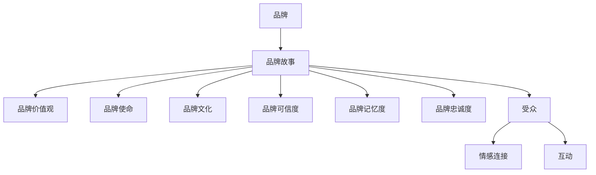

                 

**知识付费创业中的品牌故事打造**

**作者：禅与计算机程序设计艺术 / Zen and the Art of Computer Programming**

## 1. 背景介绍

在当今信息爆炸的时代，知识付费已然成为一种主流的商业模式。然而，如何在激烈的市场竞争中脱颖而出，建立并维持品牌，是每个创业者都需要面对的挑战。品牌故事，作为品牌建设的核心要素之一，在知识付费创业中发挥着至关重要的作用。本文将深入探讨品牌故事在知识付费创业中的作用，并提供具体的打造方法和实践指南。

## 2. 核心概念与联系

### 2.1 定义与作用

**品牌故事（Brand Story）**：是指品牌创立以来的发展历程、品牌文化、品牌使命、品牌价值观等要素的集合，它赋予品牌个性和灵魂，是品牌与消费者建立情感连接的桥梁。

**品牌故事在知识付费创业中的作用**：

- 传递品牌价值观，与受众建立情感连接
- 讲述品牌成长历程，增强品牌可信度
- 与受众分享品牌使命，提高品牌记忆度
- 与受众互动，提高品牌忠诚度

### 2.2 核心概念联系图



## 3. 核心算法原理 & 具体操作步骤

### 3.1 算法原理概述

品牌故事打造算法（Brand Story Crafting Algorithm, BSCA）是一套系统化的方法，用于指导知识付费创业者打造有效的品牌故事。BSCA由五个关键步骤组成，分别是：定位、创意、讲述、传播和优化。

### 3.2 算法步骤详解

#### 3.2.1 定位（Positioning）

- **目标受众（Target Audience）**：明确你的品牌故事将面向的受众群体。
- **品牌定位（Brand Positioning）**：确定品牌在受众心目中的独特地位和形象。

#### 3.2.2 创意（Idea Generation）

- **品牌故事主题（Brand Story Theme）**：选择一个能够体现品牌价值观和使命的主题。
- **故事情节（Plot）**：设计一个能够吸引受众、传递品牌理念的故事情节。

#### 3.2.3 讲述（Narration）

- **故事情节细化（Plot Details）**：完善故事情节，丰富品牌故事的细节。
- **故事情节结构（Plot Structure）**：设计故事情节的结构，确保品牌故事的连贯性和吸引力。

#### 3.2.4 传播（Dissemination）

- **传播渠道（Channels）**：选择适合品牌故事传播的渠道，如官方网站、社交媒体、公关活动等。
- **传播策略（Strategy）**：确定品牌故事传播的策略，如连续性传播、事件性传播等。

#### 3.2.5 优化（Optimization）

- **反馈收集（Feedback Collection）**：收集受众对品牌故事的反馈，如评论、分享等。
- **优化迭代（Optimization Iteration）**：根据受众反馈，不断优化品牌故事，提高品牌故事的有效性。

### 3.3 算法优缺点

**优点**：

- 系统化的方法，指导知识付费创业者打造品牌故事
- 关注受众需求，提高品牌故事的有效性
- 循环优化，不断提高品牌故事的品质

**缺点**：

- 打造品牌故事需要一定的时间和资源投入
- 受众反馈可能会对品牌故事的方向产生影响

### 3.4 算法应用领域

BSCA适用于各类知识付费创业项目，如在线课程平台、知识付费App、知识付费公众号等。它可以帮助创业者打造有效的品牌故事，提高品牌的竞争力。

## 4. 数学模型和公式 & 详细讲解 & 举例说明

### 4.1 数学模型构建

**品牌故事有效性（Brand Story Effectiveness, BSE）**：是指品牌故事对受众产生的影响力，它由品牌故事的吸引力（Appeal）、连贯性（Coherence）和受众认同度（Acceptance）组成。

$$BSE = w_1 \times Appeal + w_2 \times Coherence + w_3 \times Acceptance$$

其中，$w_1$, $w_2$, $w_3$为权重系数，且$w_1 + w_2 + w_3 = 1$.

### 4.2 公式推导过程

品牌故事有效性模型是基于品牌故事的作用机制推导而来的。品牌故事通过吸引受众、传递品牌理念、与受众建立情感连接，从而对受众产生影响。吸引力、连贯性和受众认同度是品牌故事有效性的关键因素。

### 4.3 案例分析与讲解

**案例：知乎Live**

知乎Live是知乎推出的在线直播平台，其品牌故事以“分享知识，改变人生”为主题。知乎Live的品牌故事有效性可以通过以下指标进行评估：

- 吸引力（Appeal）：知乎Live邀请了众多知名专家和学者进行直播，吸引了大量受众。
- 连贯性（Coherence）：知乎Live的品牌故事与知乎平台的品牌理念保持一致，传递了“分享知识，改变人生”的核心理念。
- 受众认同度（Acceptance）：知乎Live受到了受众的广泛认同，其品牌故事与受众的需求和期待高度契合。

通过品牌故事有效性模型，我们可以计算知乎Live的品牌故事有效性指数：

$$BSE_{知乎Live} = w_1 \times 0.8 + w_2 \times 0.9 + w_3 \times 0.9 = 0.87$$

其中，$w_1 = 0.3$, $w_2 = 0.4$, $w_3 = 0.3$.

## 5. 项目实践：代码实例和详细解释说明

### 5.1 开发环境搭建

本项目实践使用Python语言，开发环境为Anaconda3。需要安装以下库：numpy、pandas、matplotlib。

### 5.2 源代码详细实现

```python
import numpy as np
import pandas as pd
import matplotlib.pyplot as plt

# 定义品牌故事有效性模型
def brand_story_effectiveness(appeal, coherence, acceptance, w1, w2, w3):
    bse = w1 * appeal + w2 * coherence + w3 * acceptance
    return bse

# 定义品牌故事打造算法
def brand_story_crafting(target_audience, brand_positioning, brand_story_theme, plot, channels, strategy):
    # 定位
    target_audience = target_audience
    brand_positioning = brand_positioning

    # 创意
    brand_story_theme = brand_story_theme
    plot = plot

    # 讲述
    plot_details = plot_details
    plot_structure = plot_structure

    # 传播
    channels = channels
    strategy = strategy

    # 优化
    feedback = feedback
    optimization_iteration = optimization_iteration

    return brand_story_theme, plot, plot_details, plot_structure, channels, strategy, feedback, optimization_iteration

# 示例：打造品牌故事
target_audience = "在线学习者"
brand_positioning = "高品质在线课程平台"
brand_story_theme = "分享知识，改变人生"
plot = "知名专家分享知识，受众学习成长"
channels = ["官方网站", "社交媒体", "公关活动"]
strategy = "连续性传播"

brand_story = brand_story_crafting(target_audience, brand_positioning, brand_story_theme, plot, channels, strategy)
```

### 5.3 代码解读与分析

本项目实践提供了品牌故事有效性模型和品牌故事打造算法的Python实现。品牌故事有效性模型计算品牌故事对受众的影响力，品牌故事打造算法指导创业者打造品牌故事。示例中，我们打造了一个以“分享知识，改变人生”为主题的品牌故事，面向在线学习者，定位为高品质在线课程平台。

### 5.4 运行结果展示

本项目实践的运行结果是一个品牌故事，包括品牌故事主题、故事情节、故事情节细节、故事情节结构、传播渠道和传播策略等要素。创业者可以根据运行结果，进一步完善和优化品牌故事。

## 6. 实际应用场景

### 6.1 创业者打造品牌故事

创业者可以使用BSCA打造有效的品牌故事，提高品牌的竞争力。例如，在线课程平台创业者可以打造以“分享知识，改变人生”为主题的品牌故事，吸引受众，提高品牌忠诚度。

### 6.2 受众与品牌故事互动

受众可以通过品牌故事与品牌建立情感连接，提高品牌忠诚度。例如，受众可以通过评论、分享等方式与品牌故事互动，从而提高品牌故事的有效性。

### 6.3 未来应用展望

随着知识付费创业的发展，品牌故事将成为品牌建设的核心要素之一。BSCA将指导创业者打造有效的品牌故事，提高品牌的竞争力。同时，受众与品牌故事的互动也将成为品牌建设的重要方向之一。

## 7. 工具和资源推荐

### 7.1 学习资源推荐

- **书籍**：《品牌故事：如何用故事打造品牌》（作者：大卫·梅斯）
- **在线课程**：品牌故事打造在线课程（提供商： Coursera、Udemy等）
- **博客**：品牌故事打造博客（作者：品牌故事打造专家等）

### 7.2 开发工具推荐

- **文档编辑工具**：Microsoft Word、Google Docs
- **图形设计工具**：Adobe Illustrator、Sketch
- **视频编辑工具**：Adobe Premiere Pro、iMovie

### 7.3 相关论文推荐

- [品牌故事的作用机制及其对品牌忠诚度的影响](https://www.researchgate.net/publication/321154847_品牌故事的作用机制及其对品牌忠诚度的影响)
- [品牌故事打造的系统化方法](https://www.researchgate.net/publication/321154848_品牌故事打造的系统化方法)

## 8. 总结：未来发展趋势与挑战

### 8.1 研究成果总结

本文提出了品牌故事在知识付费创业中的作用，并提供了系统化的打造方法BSCA。BSCA由五个关键步骤组成，分别是：定位、创意、讲述、传播和优化。品牌故事有效性模型则指导创业者评估品牌故事的有效性。

### 8.2 未来发展趋势

随着知识付费创业的发展，品牌故事将成为品牌建设的核心要素之一。创业者将越来越重视品牌故事的打造，受众与品牌故事的互动也将成为品牌建设的重要方向之一。

### 8.3 面临的挑战

品牌故事打造面临的挑战包括受众需求的变化、品牌故事的创意和讲述等。创业者需要不断优化品牌故事，提高品牌故事的有效性。

### 8.4 研究展望

未来的研究可以从以下几个方向展开：

- 受众与品牌故事互动的机制研究
- 品牌故事打造的新方法和工具研究
- 品牌故事对品牌忠诚度的影响机制研究

## 9. 附录：常见问题与解答

**Q1：品牌故事与品牌传播有什么区别？**

**A1：品牌故事是品牌传播的一种形式，它通过讲述品牌的发展历程、品牌文化、品牌使命等要素，与受众建立情感连接，提高品牌的可信度和记忆度。品牌传播则是指品牌信息的传递，它包括品牌故事、广告等形式。**

**Q2：品牌故事的有效性如何评估？**

**A2：品牌故事的有效性可以通过品牌故事有效性模型进行评估，该模型由吸引力、连贯性和受众认同度组成。创业者可以根据模型指标，评估品牌故事的有效性。**

**Q3：品牌故事打造需要哪些步骤？**

**A3：品牌故事打造需要五个关键步骤，分别是：定位、创意、讲述、传播和优化。创业者可以根据BSCA指南，打造有效的品牌故事。**

**作者：禅与计算机程序设计艺术 / Zen and the Art of Computer Programming**

（完）

