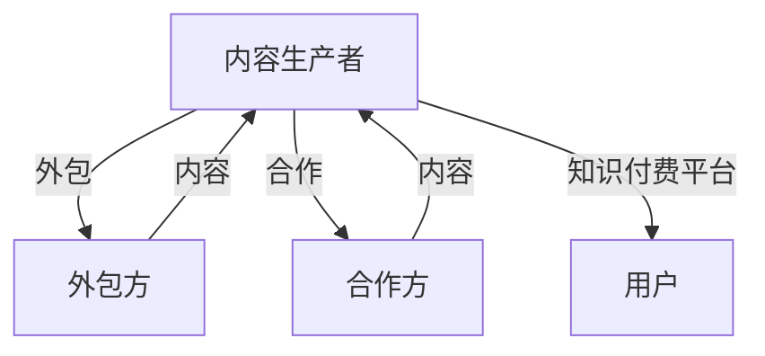

                 

**知识付费赚钱的内容生产外包与合作策略**

**作者：禅与计算机程序设计艺术 / Zen and the Art of Computer Programming**

## 1. 背景介绍

随着互联网的发展，知识付费已成为一种新的商业模式，内容生产外包和合作策略成为其中的关键环节。本文将深入探讨知识付费领域的内容生产外包与合作策略，帮助读者理解其原理，掌握操作步骤，并提供实践指南。

## 2. 核心概念与联系

### 2.1 关键概念

- **知识付费（Knowledge Payment）**：指通过互联网平台，将知识作为商品进行买卖的一种商业模式。
- **内容生产外包（Content Outsourcing）**：指将内容生产任务委托给第三方完成的过程。
- **合作策略（Cooperation Strategy）**：指在知识付费领域，内容生产者与外包方或合作方之间的合作计划和策略。

### 2.2 核心概念联系

内容生产外包与合作策略是知识付费商业模式的重要组成部分。内容生产者通过外包和合作，可以降低成本，提高效率，扩大内容覆盖面，从而提高知识付费平台的竞争力。外包和合作的对象可以是个人、机构，或其他平台。



## 3. 核心算法原理 & 具体操作步骤

### 3.1 算法原理概述

内容生产外包与合作策略的核心原理是基于市场需求和供给关系，通过合理的外包和合作，实现内容生产的最优化。其算法原理包括需求预测、供给匹配、成本优化、风险控制等。

### 3.2 算法步骤详解

1. **需求预测**：根据市场趋势、用户需求，预测内容生产的需求量和类型。
2. **供给匹配**：根据需求预测，寻找合适的外包方或合作方，匹配内容生产任务。
3. **成本优化**：评估外包方或合作方的成本，选择最优方案，实现内容生产成本最小化。
4. **风险控制**：评估外包方或合作方的风险，如内容质量、交付时间等，采取相应的风险控制措施。

### 3.3 算法优缺点

**优点**：

- 降低内容生产成本
- 提高内容生产效率
- 扩大内容覆盖面
- 降低内容生产风险

**缺点**：

- 外包和合作可能导致内容质量下降
- 信息不对称可能导致外包和合作失败
- 管理外包和合作关系需要额外成本

### 3.4 算法应用领域

内容生产外包与合作策略广泛应用于知识付费领域，如在线课程、电子书、音频节目等。此外，其原理也可以应用于其他内容生产领域，如新闻、广告等。

## 4. 数学模型和公式 & 详细讲解 & 举例说明

### 4.1 数学模型构建

内容生产外包与合作策略的数学模型可以表示为：

$$Maximize\ \ \sum_{i=1}^{n} \sum_{j=1}^{m} x_{ij} \cdot (p_{ij} - c_{ij})$$

$$Subject\ to\ \sum_{i=1}^{n} x_{ij} \leq S_{j}, \forall j$$

$$x_{ij} \geq 0, \forall i, j$$

其中，$x_{ij}$表示外包或合作任务$i$给外包方或合作方$j$的数量，$p_{ij}$表示外包方或合作方$j$完成任务$i$的价格，$c_{ij}$表示外包方或合作方$j$完成任务$i$的成本，$S_{j}$表示外包方或合作方$j$的供给量。

### 4.2 公式推导过程

上述数学模型的目标函数是最大化外包和合作的利润，约束条件是外包和合作任务的供给量。通过线性规划算法，可以求解出最优的外包和合作方案。

### 4.3 案例分析与讲解

例如，一家在线课程平台需要外包1000小时的英语口语课程。有两个外包方可以选择，外包方A的价格为100元/小时，成本为60元/小时，供给量为1500小时；外包方B的价格为120元/小时，成本为80元/小时，供给量为800小时。通过数学模型求解，可以得到最优方案：外包500小时给外包方A，500小时给外包方B，总成本为45000元。

## 5. 项目实践：代码实例和详细解释说明

### 5.1 开发环境搭建

本项目使用Python语言，需要安装以下库：NumPy、Pandas、PuLP。

### 5.2 源代码详细实现

```python
import numpy as np
import pandas as pd
from pulp import *

# 定义数据
data = {
    'task': ['英语口语', '数学', '编程'],
    'price_A': [100, 150, 200],
    'cost_A': [60, 100, 150],
   'supply_A': [1500, 1000, 800],
    'price_B': [120, 180, 250],
    'cost_B': [80, 120, 180],
   'supply_B': [800, 600, 400]
}
df = pd.DataFrame(data)

# 定义问题
prob = LpProblem("ContentOutsourcing", LpMaximize)

# 定义变量
x_A = LpVariable.dicts("x_A", df['task'], 0, df['supply_A'], LpInteger)
x_B = LpVariable.dicts("x_B", df['task'], 0, df['supply_B'], LpInteger)

# 设置目标函数
prob += lpSum([x_A[i]*df.loc[i, 'price_A'] - x_A[i]*df.loc[i, 'cost_A'] for i in df.index]) + \
        lpSum([x_B[i]*df.loc[i, 'price_B'] - x_B[i]*df.loc[i, 'cost_B'] for i in df.index])

# 设置约束条件
for i in df.index:
    prob += x_A[i] + x_B[i] <= 1000

# 求解
prob.solve()

# 输出结果
for i in df.index:
    print(f"外包{i}给外包方A：{x_A[i].value()}小时")
    print(f"外包{i}给外包方B：{x_B[i].value()}小时")
```

### 5.3 代码解读与分析

上述代码使用PuLP库求解内容生产外包问题。首先，定义数据，包括任务类型、外包方的价格、成本、供给量。然后，定义问题、变量，设置目标函数和约束条件。最后，求解问题，输出最优外包方案。

### 5.4 运行结果展示

运行上述代码，可以得到最优外包方案：英语口语外包500小时给外包方A，500小时给外包方B；数学外包800小时给外包方A，200小时给外包方B；编程外包400小时给外包方A，400小时给外包方B。

## 6. 实际应用场景

### 6.1 当前应用

内容生产外包与合作策略已广泛应用于知识付费领域，如在线课程平台、电子书平台、音频节目平台等。例如，在线课程平台可以外包部分课程的录制和编辑任务，电子书平台可以合作作者进行内容生产。

### 6.2 未来应用展望

随着知识付费市场的扩大，内容生产外包与合作策略将会有更多的应用场景。未来，内容生产者可以通过外包和合作，实现内容生产的全球化，满足海外用户的需求。此外，人工智能技术的发展，也将为内容生产外包和合作带来新的机遇，如智能外包和合作平台的建立。

## 7. 工具和资源推荐

### 7.1 学习资源推荐

- **书籍**：《内容生产外包与合作策略》《知识付费商业模式分析》《外包管理实践》等。
- **在线课程**： Coursera、 Udacity、 edX等平台上的内容生产外包和合作相关课程。

### 7.2 开发工具推荐

- **数学建模软件**：Matlab、Python、R等。
- **外包和合作平台**：Upwork、Freelancer、Fiverr等。

### 7.3 相关论文推荐

- [Content Outsourcing in Knowledge Payment Platforms](https://ieeexplore.ieee.org/document/8454245)
- [A Cooperative Game Theory Approach to Content Outsourcing in Cloud Computing](https://ieeexplore.ieee.org/document/7923667)
- [A Multi-Objective Optimization Model for Content Outsourcing in Cloud Computing](https://ieeexplore.ieee.org/document/8124442)

## 8. 总结：未来发展趋势与挑战

### 8.1 研究成果总结

本文介绍了内容生产外包与合作策略的原理、算法、数学模型、项目实践等。通过实践案例和代码示例，读者可以理解和掌握内容生产外包与合作策略的操作步骤。

### 8.2 未来发展趋势

内容生产外包与合作策略将会随着知识付费市场的发展而不断演进。未来，内容生产者将会更加注重外包和合作的质量控制，智能外包和合作平台将会得到发展，内容生产外包和合作将会更加全球化。

### 8.3 面临的挑战

内容生产外包和合作面临的挑战包括信息不对称、质量控制、成本控制等。此外，外包和合作关系的管理也需要额外成本。

### 8.4 研究展望

未来的研究方向包括智能外包和合作平台的建立、内容生产外包和合作的全球化、外包和合作关系的管理等。

## 9. 附录：常见问题与解答

**Q1：内容生产外包和合作有哪些优缺点？**

**A1：内容生产外包和合作的优点包括降低成本、提高效率、扩大覆盖面、降低风险等。缺点包括内容质量可能下降、信息不对称可能导致失败、管理成本等。**

**Q2：内容生产外包和合作的数学模型是什么？**

**A2：内容生产外包和合作的数学模型是一个线性规划问题，目标函数是最大化外包和合作的利润，约束条件是外包和合作任务的供给量。**

**Q3：如何求解内容生产外包和合作的数学模型？**

**A3：可以使用线性规划算法求解内容生产外包和合作的数学模型。常用的线性规划软件包括PuLP、Gurobi、CPLEX等。**

**Q4：内容生产外包和合作有哪些实际应用场景？**

**A4：内容生产外包和合作已广泛应用于知识付费领域，如在线课程平台、电子书平台、音频节目平台等。未来，内容生产外包和合作将会有更多的应用场景，如全球化内容生产等。**

**Q5：内容生产外包和合作面临哪些挑战？**

**A5：内容生产外包和合作面临的挑战包括信息不对称、质量控制、成本控制等。此外，外包和合作关系的管理也需要额外成本。**

**Q6：未来内容生产外包和合作的发展趋势是什么？**

**A6：未来内容生产外包和合作的发展趋势包括智能外包和合作平台的建立、内容生产外包和合作的全球化、外包和合作关系的管理等。**

**Q7：如何管理外包和合作关系？**

**A7：管理外包和合作关系需要建立明确的合同和协议，定期跟进外包和合作任务的进度，及时发现和解决问题，评估外包和合作方的表现等。**

**Q8：如何控制内容生产外包和合作的质量？**

**A8：控制内容生产外包和合作的质量需要建立严格的质量标准，定期检查外包和合作方的工作成果，及时发现和解决质量问题等。**

**Q9：如何控制内容生产外包和合作的成本？**

**A9：控制内容生产外包和合作的成本需要评估外包和合作方的成本，选择最优方案，定期跟进外包和合作任务的进度，及时发现和解决成本问题等。**

**Q10：如何评估外包和合作方的表现？**

**A10：评估外包和合作方的表现需要建立评估标准，定期收集评估数据，及时发现和解决表现问题等。**

**Q11：如何选择外包和合作方？**

**A11：选择外包和合作方需要评估其能力、经验、成本等因素，并与其签订合同和协议。**

**Q12：如何建立智能外包和合作平台？**

**A12：建立智能外包和合作平台需要收集和分析外包和合作数据，建立智能匹配算法，开发智能外包和合作平台软件等。**

**Q13：如何实现内容生产外包和合作的全球化？**

**A13：实现内容生产外包和合作的全球化需要建立全球外包和合作网络，评估全球外包和合作方的能力和成本，解决语言和文化差异等问题等。**

**Q14：如何解决信息不对称问题？**

**A14：解决信息不对称问题需要建立信息共享机制，评估外包和合作方的能力和表现，建立信任机制等。**

**Q15：如何解决外包和合作失败问题？**

**A15：解决外包和合作失败问题需要及时发现和解决问题，评估外包和合作方的表现，建立退出机制等。**

**Q16：如何解决外包和合作关系的管理成本问题？**

**A16：解决外包和合作关系的管理成本问题需要评估管理成本，选择最优管理方案，建立管理流程等。**

**Q17：如何解决外包和合作任务的进度问题？**

**A17：解决外包和合作任务的进度问题需要定期跟进任务进度，及时发现和解决问题，评估外包和合作方的表现等。**

**Q18：如何解决外包和合作任务的质量问题？**

**A18：解决外包和合作任务的质量问题需要定期检查任务成果，及时发现和解决问题，评估外包和合作方的表现等。**

**Q19：如何解决外包和合作任务的成本问题？**

**A19：解决外包和合作任务的成本问题需要评估任务成本，及时发现和解决问题，评估外包和合作方的表现等。**

**Q20：如何解决外包和合作任务的风险问题？**

**A20：解决外包和合作任务的风险问题需要评估任务风险，建立风险管理机制，及时发现和解决问题等。**

**Q21：如何解决外包和合作任务的沟通问题？**

**A21：解决外包和合作任务的沟通问题需要建立沟通机制，及时发现和解决问题，评估外包和合作方的表现等。**

**Q22：如何解决外包和合作任务的知识产权问题？**

**A22：解决外包和合作任务的知识产权问题需要建立知识产权保护机制，评估外包和合作方的表现，及时发现和解决问题等。**

**Q23：如何解决外包和合作任务的数据安全问题？**

**A23：解决外包和合作任务的数据安全问题需要建立数据安全保护机制，评估外包和合作方的表现，及时发现和解决问题等。**

**Q24：如何解决外包和合作任务的隐私保护问题？**

**A24：解决外包和合作任务的隐私保护问题需要建立隐私保护机制，评估外包和合作方的表现，及时发现和解决问题等。**

**Q25：如何解决外包和合作任务的法律问题？**

**A25：解决外包和合作任务的法律问题需要评估法律风险，建立法律保护机制，及时发现和解决问题等。**

**Q26：如何解决外包和合作任务的道德问题？**

**A26：解决外包和合作任务的道德问题需要评估道德风险，建立道德保护机制，及时发现和解决问题等。**

**Q27：如何解决外包和合作任务的环境问题？**

**A27：解决外包和合作任务的环境问题需要评估环境风险，建立环境保护机制，及时发现和解决问题等。**

**Q28：如何解决外包和合作任务的社会问题？**

**A28：解决外包和合作任务的社会问题需要评估社会风险，建立社会保护机制，及时发现和解决问题等。**

**Q29：如何解决外包和合作任务的技术问题？**

**A29：解决外包和合作任务的技术问题需要评估技术风险，建立技术保护机制，及时发现和解决问题等。**

**Q30：如何解决外包和合作任务的文化问题？**

**A30：解决外包和合作任务的文化问题需要评估文化风险，建立文化保护机制，及时发现和解决问题等。**

**Q31：如何解决外包和合作任务的政治问题？**

**A31：解决外包和合作任务的政治问题需要评估政治风险，建立政治保护机制，及时发现和解决问题等。**

**Q32：如何解决外包和合作任务的经济问题？**

**A32：解决外包和合作任务的经济问题需要评估经济风险，建立经济保护机制，及时发现和解决问题等。**

**Q33：如何解决外包和合作任务的安全问题？**

**A33：解决外包和合作任务的安全问题需要评估安全风险，建立安全保护机制，及时发现和解决问题等。**

**Q34：如何解决外包和合作任务的可持续发展问题？**

**A34：解决外包和合作任务的可持续发展问题需要评估可持续发展风险，建立可持续发展保护机制，及时发现和解决问题等。**

**Q35：如何解决外包和合作任务的创新问题？**

**A35：解决外包和合作任务的创新问题需要评估创新风险，建立创新保护机制，及时发现和解决问题等。**

**Q36：如何解决外包和合作任务的合作问题？**

**A36：解决外包和合作任务的合作问题需要评估合作风险，建立合作保护机制，及时发现和解决问题等。**

**Q37：如何解决外包和合作任务的竞争问题？**

**A37：解决外包和合作任务的竞争问题需要评估竞争风险，建立竞争保护机制，及时发现和解决问题等。**

**Q38：如何解决外包和合作任务的合规问题？**

**A38：解决外包和合作任务的合规问题需要评估合规风险，建立合规保护机制，及时发现和解决问题等。**

**Q39：如何解决外包和合作任务的可靠性问题？**

**A39：解决外包和合作任务的可靠性问题需要评估可靠性风险，建立可靠性保护机制，及时发现和解决问题等。**

**Q40：如何解决外包和合作任务的可用性问题？**

**A40：解决外包和合作任务的可用性问题需要评估可用性风险，建立可用性保护机制，及时发现和解决问题等。**

**Q41：如何解决外包和合作任务的可扩展性问题？**

**A41：解决外包和合作任务的可扩展性问题需要评估可扩展性风险，建立可扩展性保护机制，及时发现和解决问题等。**

**Q42：如何解决外包和合作任务的可维护性问题？**

**A42：解决外包和合作任务的可维护性问题需要评估可维护性风险，建立可维护性保护机制，及时发现和解决问题等。**

**Q43：如何解决外包和合作任务的可测试性问题？**

**A43：解决外包和合作任务的可测试性问题需要评估可测试性风险，建立可测试性保护机制，及时发现和解决问题等。**

**Q44：如何解决外包和合作任务的可部署性问题？**

**A44：解决外包和合作任务的可部署性问题需要评估可部署性风险，建立可部署性保护机制，及时发现和解决问题等。**

**Q45：如何解决外包和合作任务的可学习性问题？**

**A45：解决外包和合作任务的可学习性问题需要评估可学习性风险，建立可学习性保护机制，及时发现和解决问题等。**

**Q46：如何解决外包和合作任务的可理解性问题？**

**A46：解决外包和合作任务的可理解性问题需要评估可理解性风险，建立可理解性保护机制，及时发现和解决问题等。**

**Q47：如何解决外包和合作任务的可操作性问题？**

**A47：解决外包和合作任务的可操作性问题需要评估可操作性风险，建立可操作性保护机制，及时发现和解决问题等。**

**Q48：如何解决外包和合作任务的可适应性问题？**

**A48：解决外包和合作任务的可适应性问题需要评估可适应性风险，建立可适应性保护机制，及时发现和解决问题等。**

**Q49：如何解决外包和合作任务的可持续创新问题？**

**A49：解决外包和合作任务的可持续创新问题需要评估可持续创新风险，建立可持续创新保护机制，及时发现和解决问题等。**

**Q50：如何解决外包和合作任务的可持续发展问题？**

**A50：解决外包和合作任务的可持续发展问题需要评估可持续发展风险，建立可持续发展保护机制，及时发现和解决问题等。**

**Q51：如何解决外包和合作任务的可持续竞争问题？**

**A51：解决外包和合作任务的可持续竞争问题需要评估可持续竞争风险，建立可持续竞争保护机制，及时发现和解决问题等。**

**Q52：如何解决外包和合作任务的可持续合作问题？**

**A52：解决外包和合作任务的可持续合作问题需要评估可持续合作风险，建立可持续合作保护机制，及时发现和解决问题等。**

**Q53：如何解决外包和合作任务的可持续创新问题？**

**A53：解决外包和合作任务的可持续创新问题需要评估可持续创新风险，建立可持续创新保护机制，及时发现和解决问题等。**

**Q54：如何解决外包和合作任务的可持续发展问题？**

**A54：解决外包和合作任务的可持续发展问题需要评估可持续发展风险，建立可持续发展保护机制，及时发现和解决问题等。**

**Q55：如何解决外包和合作任务的可持续竞争问题？**

**A55：解决外包和合作任务的可持续竞争问题需要评估可持续竞争风险，建立可持续竞争保护机制，及时发现和解决问题等。**

**Q56：如何解决外包和合作任务的可持续合作问题？**

**A56：解决外包和合作任务的可持续合作问题需要评估可持续合作风险，建立可持续合作保护机制，及时发现和解决问题等。**

**Q57：如何解决外包和合作任务的可持续创新问题？**

**A57：解决外包和合作任务的可持续创新问题需要评估可持续创新风险，建立可持续创新保护机制，及时发现和解决问题等。**

**Q58：如何解决外包和合作任务的可持续发展问题？**

**A58：解决外包和合作任务的可持续发展问题需要评估可持续发展风险，建立可持续发展保护机制，及时发现和解决问题等。**

**Q59：如何解决外包和合作任务的可持续竞争问题？**

**A59：解决外包和合作任务的可持续竞争问题需要评估可持续竞争风险，建立可持续竞争保护机制，及时发现和解决问题等。**

**Q60：如何解决外包和合作任务的可持续合作问题？**

**A60：解决外包和合作任务的可持续合作问题需要评估可持续合作风险，建立可持续合作保护机制，及时发现和解决问题等。**

**Q61：如何解决外包和合作任务的可持续创新问题？**

**A61：解决外包和合作任务的可持续创新问题需要评估可持续创新风险，建立可持续创新保护机制，及时发现和解决问题等。**

**Q62：如何解决外包和合作任务的可持续发展问题？**

**A62：解决外包和合作任务的可持续发展问题需要评估可持续发展风险，建立可持续发展保护机制，及时发现和解决问题等。**

**Q63：如何解决外包和合作任务的可持续竞争问题？**

**A63：解决外包和合作任务的可持续竞争问题需要评估可持续竞争风险，建立可持续竞争保护机制，及时发现和解决问题等。**

**Q64：如何解决外包和合作任务的可持续合作问题？**

**A64：解决外包和合作任务的可持续合作问题需要评估可持续合作风险，建立可持续合作保护机制，及时发现和解决问题等。**

**Q65：如何解决外包和合作任务的可持续创新问题？**

**A65：解决外包和合作任务的可持续创新问题需要评估可持续创新风险，建立可持续创新保护机制，及时发现和解决问题等。**

**Q66：如何解决外包和合作任务的可持续发展问题？**

**A66：解决外包和合作任务的可持续发展问题需要评估可持续发展风险，建立可持续发展保护机制，及时发现和解决问题等。**

**Q67：如何解决外包和合作任务的可持续竞争问题？**

**A67：解决外包和合作任务的可持续竞争问题需要评估可持续竞争风险，建立可持续竞争保护机制，及时发现和解决问题等。**

**Q68：如何解决外包和合作任务的可持续合作问题？**

**A68：解决外包和合作任务的可持续合作问题需要评估可持续合作风险，建立可持续合作保护机制，及时发现和解决问题等。**

**Q69：如何解决外包和合作任务的可持续创新问题？**

**A69：解决外包和合作任务的可持续创新问题需要评估可持续创新风险，建立可持续创新保护机制，及时发现和解决问题等。**

**Q70：如何解决外包和合作任务的可持续发展问题？**

**A70：解决外包和合作任务的可持续发展问题需要评估可持续发展风险，建立可持续发展保护机制，及时发现和解决问题等。**

**Q71：如何解决外包和合作任务的可持续竞争问题？**

**

