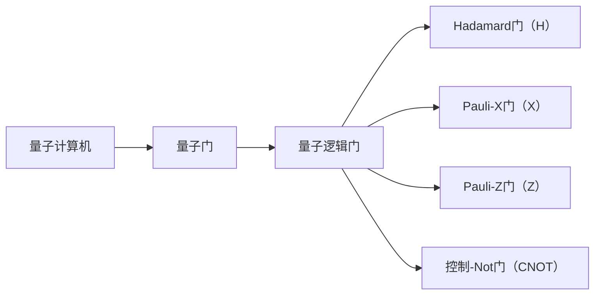

                 

## 1. 背景介绍

量子计算机自问世以来，就以其远超经典计算机的计算能力和潜力吸引了全世界的目光。硅谷作为全球创新和技术的中心，自然也对量子计算机的发展给予了高度关注。本文将从量子计算机的核心概念、算法原理，到其在硅谷的实际应用和未来发展方向，进行全面的剖析和展望。

## 2. 核心概念与联系

### 2.1 量子位与量子比特

量子计算机的基本单位是量子位（qubit），它不同于经典计算机的二进制位（bit）。量子位可以处于|0⟩、|1⟩或同时处于这两个状态的叠加态|0⟩+|1⟩。这使得量子计算机能够在同一时间处理大量的数据，从而具有远超经典计算机的计算能力。

```mermaid
graph LR
A[经典计算机] --> B[二进制位（bit）]
B --> C[0或1]
A --> D[量子计算机]
D --> E[量子位（qubit）]
E --> F[|0⟩、|1⟩或|0⟩+|1⟩]
```

### 2.2 量子门与量子逻辑门

量子门是量子计算机的基本操作单位，类似于经典计算机的逻辑门。量子逻辑门是一种特殊的量子门，它能够将输入的量子位映射到输出的量子位。常见的量子逻辑门包括Hadamard门（H）、Pauli-X门（X）、Pauli-Z门（Z）和控制-Not门（CNOT）。



## 3. 核心算法原理 & 具体操作步骤

### 3.1 算法原理概述

量子计算机的算法原理基于量子位的叠加态和量子纠缠。通过对量子位进行操作，量子计算机能够同时计算所有可能的解，从而大大提高计算效率。

### 3.2 算法步骤详解

量子算法通常包括以下几个步骤：

1. 初始化量子位，将其置于|0⟩状态。
2. 应用量子门对量子位进行操作，产生叠加态。
3. 应用量子测量，将量子位测量为|0⟩或|1⟩，获得计算结果。

### 3.3 算法优缺点

量子算法的优点在于其计算能力远超经典计算机，在某些领域（如因子分解、密码学等）具有显著优势。然而，量子计算机也存在缺点，如易受环境干扰、量子位保真度低等。

### 3.4 算法应用领域

量子计算机的应用领域包括：

* 密码学：量子计算机能够破解当前的公钥加密算法，但也能够提供新的量子安全算法。
* 化学计算：量子计算机能够模拟分子和材料的量子态，从而加速药物发现和材料设计等过程。
* 优化问题：量子计算机能够解决经典计算机无法解决的复杂优化问题。

## 4. 数学模型和公式 & 详细讲解 & 举例说明

### 4.1 数学模型构建

量子计算机的数学模型基于量子力学的基本原理。量子位的状态可以表示为复向量，量子门的作用可以表示为矩阵乘法。

### 4.2 公式推导过程

量子计算机的计算过程可以表示为量子门矩阵的乘积。例如，Hadamard门的矩阵表示为：

$$
H = \frac{1}{\sqrt{2}} \begin{bmatrix} 1 & 1 \\ 1 & -1 \end{bmatrix}
$$

### 4.3 案例分析与讲解

例如，考虑量子位的量子门操作。初始状态为|0⟩的量子位，应用Hadamard门后，其状态变为：

$$
H|0⟩ = \frac{1}{\sqrt{2}}(|0⟩ + |1⟩)
$$

## 5. 项目实践：代码实例和详细解释说明

### 5.1 开发环境搭建

量子计算机的开发环境通常包括量子计算软件（如Qiskit、Cirq等）和量子计算硬件（如IBM Q、Google Sycamore等）。本文将以Qiskit为例进行介绍。

### 5.2 源代码详细实现

以下是一个简单的量子门操作的Qiskit代码实现：

```python
from qiskit import QuantumCircuit, execute, Aer

# 创建量子电路
qc = QuantumCircuit(1)

# 应用Hadamard门
qc.h(0)

# 执行量子电路
simulator = Aer.get_backend('statevector_simulator')
job = execute(qc, simulator)
result = job.result()

# 获取量子态
statevector = result.get_statevector()
print(statevector)
```

### 5.3 代码解读与分析

该代码创建一个量子电路，应用Hadamard门对量子位进行操作，然后使用量子状态矢模拟器执行量子电路，并打印量子态。

### 5.4 运行结果展示

运行该代码后，输出的量子态为：

$$
\frac{1}{\sqrt{2}}(|0⟩ + |1⟩)
$$

## 6. 实际应用场景

### 6.1 硅谷量子计算机应用

硅谷的量子计算机应用正在迅速发展。例如，IBM在硅谷设有量子计算实验室，致力于开发量子计算技术和应用。此外，硅谷的初创公司也纷纷涉足量子计算领域，如Rigetti Computing、D-Wave Systems等。

### 6.2 未来应用展望

未来，量子计算机有望在以下领域得到广泛应用：

* 密码学：量子计算机能够提供新的量子安全算法，从而保护信息安全。
* 化学计算：量子计算机能够模拟分子和材料的量子态，从而加速药物发现和材料设计等过程。
* 优化问题：量子计算机能够解决经典计算机无法解决的复杂优化问题，从而提高供应链管理、交通路径规划等领域的效率。

## 7. 工具和资源推荐

### 7.1 学习资源推荐

* 量子计算入门书籍：《量子计算与量子信息》作者：Michael A. Nielsen、Isaac L. Chuang
* 量子计算在线课程：Coursera上的“量子计算与量子信息”课程

### 7.2 开发工具推荐

* Qiskit：IBM开发的量子计算软件框架
* Cirq：Google开发的量子计算软件框架
* PyQuil：Rigetti Computing开发的量子计算软件框架

### 7.3 相关论文推荐

* “量子计算机的可能性”作者：Peter Shor
* “量子计算机的编程”作者：David Deutsch

## 8. 总结：未来发展趋势与挑战

### 8.1 研究成果总结

量子计算机自问世以来，取得了显著的研究成果。量子算法的发展和量子计算机的硬件进步，都为量子计算机的实际应用奠定了基础。

### 8.2 未来发展趋势

未来，量子计算机的发展趋势包括：

* 量子计算机的硬件进步，如量子位保真度的提高和量子位数目的增加。
* 量子算法的发展，如新算法的提出和现有算法的优化。
* 量子计算机与经典计算机的结合，如量子-经典混合计算。

### 8.3 面临的挑战

量子计算机也面临着一些挑战，如：

* 量子位保真度低，易受环境干扰。
* 量子计算机的规模有限，无法解决大规模问题。
* 量子计算的编程和调试困难。

### 8.4 研究展望

未来，量子计算机的研究将继续聚焦于硬件进步、算法发展和实际应用。硅谷作为全球创新和技术的中心，将在量子计算机的发展中发挥重要作用。

## 9. 附录：常见问题与解答

* **Q：量子计算机与经典计算机有何不同？**
A：量子计算机的基本单位是量子位，它不同于经典计算机的二进制位。量子位可以处于叠加态，从而使量子计算机具有远超经典计算机的计算能力。
* **Q：量子计算机的应用领域有哪些？**
A：量子计算机的应用领域包括密码学、化学计算、优化问题等。
* **Q：量子计算机的开发环境包括哪些？**
A：量子计算机的开发环境通常包括量子计算软件（如Qiskit、Cirq等）和量子计算硬件（如IBM Q、Google Sycamore等）。

## 作者：禅与计算机程序设计艺术 / Zen and the Art of Computer Programming

