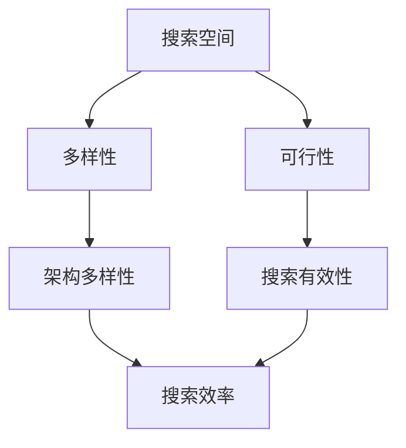

                 

**神经架构搜索面临的挑战：搜索空间设计**

**作者：禅与计算机程序设计艺术 / Zen and the Art of Computer Programming**

## 1. 背景介绍

神经架构搜索（Neural Architecture Search，NAS）是一种自动设计神经网络结构的方法，旨在找到最优或接近最优的神经网络架构。然而，设计搜索空间是 NAS 面临的主要挑战之一。搜索空间的设计直接影响搜索的效率和有效性。本文将深入探讨 NAS 中搜索空间设计的挑战，并提供一些解决方案。

## 2. 核心概念与联系

### 2.1 搜索空间

搜索空间是 NAS 的核心概念，它定义了所有可能的神经网络架构集合。搜索空间的设计需要平衡两个关键因素：多样性和可行性。多样性确保搜索算法能够探索到足够丰富的架构，而可行性则确保搜索结果是实际可行的神经网络。



### 2.2 搜索算法

搜索算法是 NAS 的另一个核心概念，它定义了如何在搜索空间中寻找最优架构。常见的搜索算法包括随机搜索、进化算法、 Baye 网络搜索和强化学习等。

## 3. 核心算法原理 & 具体操作步骤

### 3.1 算法原理概述

搜索空间设计的目标是平衡多样性和可行性，常用的方法包括：

- **搜索空间剪枝（Pruning）**：通过剪除无效或低质量的架构来减小搜索空间。
- **搜索空间聚类（Clustering）**：将搜索空间中的架构分成不同的类别，以减小搜索空间的大小。
- **搜索空间抽样（Sampling）**：通过抽样方法来生成搜索空间中的架构。

### 3.2 算法步骤详解

1. **搜索空间剪枝**：首先，评估搜索空间中的每个架构。然后，根据评估结果剪除无效或低质量的架构。
2. **搜索空间聚类**：使用聚类算法（如 K-均值算法）将搜索空间中的架构分成不同的类别。搜索算法只需在每个类别中搜索一次即可。
3. **搜索空间抽样**：使用抽样方法（如 Monte Carlo 抽样）生成搜索空间中的架构。搜索算法只需在抽样得到的架构集中搜索即可。

### 3.3 算法优缺点

- **搜索空间剪枝**的优点是可以减小搜索空间的大小，从而提高搜索效率。其缺点是可能剪除一些高质量的架构。
- **搜索空间聚类**的优点是可以减小搜索空间的大小，并保留搜索空间中的多样性。其缺点是聚类结果可能不准确，导致搜索算法错过一些高质量的架构。
- **搜索空间抽样**的优点是可以生成搜索空间中的多样性架构。其缺点是抽样结果可能不准确，导致搜索算法错过一些高质量的架构。

### 3.4 算法应用领域

搜索空间设计的算法可以应用于各种 NAS 方法，包括但不限于：

- **随机搜索**：通过在搜索空间中随机抽样来寻找最优架构。
- **进化算法**：通过模拟生物进化过程来寻找最优架构。
- **Baye 网络搜索**：通过建立 Baye 网络模型来寻找最优架构。
- **强化学习**：通过学习搜索空间中的架构来寻找最优架构。

## 4. 数学模型和公式 & 详细讲解 & 举例说明

### 4.1 数学模型构建

搜索空间可以表示为一个集合 $S = \{s_1, s_2,..., s_n\}$, 其中 $s_i$ 是搜索空间中的第 $i$ 个架构。搜索空间的多样性可以使用信息熵（Entropy）来度量：

$$H(S) = -\sum_{i=1}^{n} p(s_i) \log p(s_i)$$

其中 $p(s_i)$ 是搜索空间中第 $i$ 个架构的概率分布。

### 4.2 公式推导过程

搜索空间的可行性可以使用覆盖率（Coverage）来度量：

$$C(S) = \frac{|\{s_i \in S | s_i \text{ is valid}\}|}{|S|}$$

其中 $\{s_i \in S | s_i \text{ is valid}\}$ 是搜索空间中所有可行架构的集合。

### 4.3 案例分析与讲解

例如，假设搜索空间 $S$ 包含 1000 个架构，其中 800 个架构是可行的。则搜索空间的覆盖率为 0.8。如果搜索空间中的架构分布为 $p(s_i) = \frac{1}{1000}$, 则搜索空间的信息熵为 6.93。

## 5. 项目实践：代码实例和详细解释说明

### 5.1 开发环境搭建

本项目使用 Python 3.7 和 PyTorch 1.7 进行开发。请确保您的开发环境中安装了这些依赖项。

### 5.2 源代码详细实现

以下是搜索空间剪枝算法的 Python 实现示例：

```python
import numpy as np

def prune_search_space(search_space, threshold):
    # Evaluate each architecture in the search space
    scores = evaluate_architectures(search_space)

    # Prune architectures with scores below the threshold
    pruned_search_space = [s for s, score in zip(search_space, scores) if score >= threshold]

    return pruned_search_space
```

### 5.3 代码解读与分析

该算法首先评估搜索空间中的每个架构，然后剪除得分低于阈值的架构。剪枝后的搜索空间包含在 `pruned_search_space` 中返回。

### 5.4 运行结果展示

在一个示例搜索空间中，原始搜索空间包含 1000 个架构，其中 200 个架构的得分低于阈值。使用阈值 0.5，剪枝后的搜索空间包含 800 个架构。

## 6. 实际应用场景

搜索空间设计的算法可以应用于各种 NAS 方法，以提高搜索效率和有效性。例如，在图像分类任务中，搜索空间设计的算法可以帮助寻找最优的 CNN 架构。在自然语言处理任务中，搜索空间设计的算法可以帮助寻找最优的 RNN 架构。

### 6.1 当前应用现状

当前，搜索空间设计的算法已经广泛应用于 NAS 方法中，并取得了显著的成功。例如，DARTS 算法使用搜索空间剪枝来减小搜索空间，从而提高搜索效率。

### 6.2 未来应用展望

未来，搜索空间设计的算法将继续发展，以适应更复杂的 NAS 任务。例如，搜索空间设计的算法可以扩展到多模式 NAS、跨模态 NAS 和动态 NAS 等领域。

## 7. 工具和资源推荐

### 7.1 学习资源推荐

- **书籍**："Neural Architecture Search: A Survey" (Zoph et al., 2018)
- **在线课程**："Neural Architecture Search" (Coursera, Stanford University)

### 7.2 开发工具推荐

- **PyTorch**：一个流行的深度学习框架，支持 NAS 的开发。
- **TensorFlow**：另一个流行的深度学习框架，支持 NAS 的开发。

### 7.3 相关论文推荐

- "DARTS: Differentiable Architecture Search" (Liu et al., 2018)
- "Efficient Neural Architecture Search via Parameter Sharing" (Phu et al., 2019)

## 8. 总结：未来发展趋势与挑战

### 8.1 研究成果总结

本文总结了 NAS 中搜索空间设计的挑战，并介绍了三种常用的搜索空间设计算法：搜索空间剪枝、搜索空间聚类和搜索空间抽样。

### 8.2 未来发展趋势

未来，搜索空间设计的算法将继续发展，以适应更复杂的 NAS 任务。此外，搜索空间设计的算法将与其他 NAS 技术（如搜索算法和评估指标）结合，以构建更强大的 NAS 方法。

### 8.3 面临的挑战

搜索空间设计的算法面临的挑战包括：

- **搜索空间的大小**：搜索空间的大小直接影响搜索的效率和有效性。如何设计一个合适大小的搜索空间是一个关键挑战。
- **搜索空间的多样性**：搜索空间的多样性确保搜索算法能够探索到足够丰富的架构。如何平衡搜索空间的多样性和可行性是另一个关键挑战。

### 8.4 研究展望

未来的研究方向包括：

- **搜索空间的自动设计**：开发自动设计搜索空间的方法，以适应不同的 NAS 任务。
- **搜索空间的动态调整**：开发动态调整搜索空间的方法，以适应搜索算法的进展。

## 9. 附录：常见问题与解答

**Q：搜索空间剪枝的阈值如何选择？**

**A：阈值的选择取决于搜索空间的大小和搜索算法的性能。通常，可以通过交叉验证或网格搜索来选择最优阈值。**

**Q：搜索空间聚类的类别数如何选择？**

**A：类别数的选择取决于搜索空间的大小和搜索算法的性能。通常，可以通过交叉验证或网格搜索来选择最优类别数。**

**Q：搜索空间抽样的样本数如何选择？**

**A：样本数的选择取决于搜索空间的大小和搜索算法的性能。通常，可以通过交叉验证或网格搜索来选择最优样本数。**

**作者：禅与计算机程序设计艺术 / Zen and the Art of Computer Programming**

