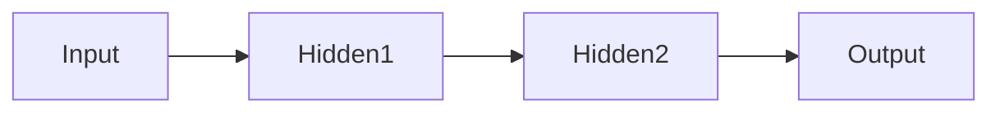

                 

**神经网络：开启智能新纪元**

> 关键词：人工神经网络、深度学习、反向传播、激活函数、过拟合

## 1. 背景介绍

人工神经网络（Artificial Neural Network, ANN）是一种模拟生物神经网络结构和功能的计算模型，其设计灵感来自于对大脑神经元结构和功能的理解。自从1943年Warren McCulloch和Walter Pitts首次提出神经网络概念以来，神经网络技术已经取得了长足的进步，并成为当今人工智能领域的核心技术之一。本文将深入探讨神经网络的核心概念、算法原理、数学模型，并提供项目实践和实际应用场景的分析。

## 2. 核心概念与联系

神经网络是一种非线性模型，由大量简单的神经元组成，这些神经元通过权重连接构成网络。神经网络的核心概念包括：

- **输入层（Input Layer）**：接收外部数据的层。
- **隐藏层（Hidden Layer）**：处理和提取特征的层。
- **输出层（Output Layer）**：产生最终结果的层。
- **权重（Weights）**：连接神经元的权值，表示神经元之间的连接强度。
- **偏置（Bias）**：神经元的偏置项，用于调整神经元的激活阈值。

下图是一个简单的神经网络架构示意图：



## 3. 核心算法原理 & 具体操作步骤

### 3.1 算法原理概述

神经网络的核心算法是**反向传播（Backpropagation）**。反向传播算法通过计算网络的误差，调整网络权重和偏置项，以最小化误差。其基本原理是利用链式法则计算梯度，并使用梯度下降法更新权重和偏置项。

### 3.2 算法步骤详解

1. **正向传播（Forward Propagation）**：输入数据通过网络各层，生成输出结果。
2. **计算误差（Compute Error）**：比较网络输出和真实值，计算误差。
3. **反向传播（Backward Propagation）**：计算梯度，更新权重和偏置项。
4. **重复步骤1-3**：直到误差小于阈值或达到最大迭代次数。

### 3.3 算法优缺点

**优点**：
- 可以学习复杂的非线性关系。
- 具有良好的泛化能力。
- 可以处理高维数据。

**缺点**：
- 训练过程需要大量的数据和计算资源。
- 易于过拟合（Overfitting），需要额外的正则化技术来避免。

### 3.4 算法应用领域

神经网络广泛应用于图像识别、语音识别、自然语言处理、推荐系统等领域。随着深度学习技术的发展，神经网络的应用领域不断扩展，并取得了令人印象深刻的成就。

## 4. 数学模型和公式 & 详细讲解 & 举例说明

### 4.1 数学模型构建

神经网络的数学模型可以表示为：

$$y = f(wx + b)$$

其中，$x$是输入向量，$w$是权重向量，$b$是偏置项，$f$是激活函数，$y$是输出。

### 4.2 公式推导过程

反向传播算法的关键是计算梯度。对于一个给定的激活函数$f$和误差函数$E$，梯度可以表示为：

$$\frac{\partial E}{\partial w} = \frac{\partial E}{\partial y} \frac{\partial y}{\partial z} \frac{\partial z}{\partial w}$$

其中，$z = wx + b$。

### 4.3 案例分析与讲解

例如，考虑一个简单的单层神经网络，用于预测房价。输入特征为房屋面积，$y$是房价。激活函数为线性函数$f(z) = z$，误差函数为均方误差$E = \frac{1}{2}(y - \hat{y})^2$，其中$\hat{y}$是网络输出。通过反向传播算法，可以更新权重和偏置项，以最小化误差。

## 5. 项目实践：代码实例和详细解释说明

### 5.1 开发环境搭建

本项目使用Python和TensorFlow框架。首先，安装必要的库：

```bash
pip install tensorflow numpy matplotlib
```

### 5.2 源代码详细实现

以下是一个简单的单层神经网络实现代码：

```python
import numpy as np
import tensorflow as tf
import matplotlib.pyplot as plt

# 房屋面积数据
X = np.array([[100], [120], [150], [180], [210]])
# 房价数据
y = np.array([[200000], [250000], [300000], [350000], [400000]])

# 定义模型
model = tf.keras.Sequential([
    tf.keras.layers.Dense(units=1, input_shape=[1])
])

# 编译模型
model.compile(optimizer='sgd', loss='mean_squared_error')

# 训练模型
history = model.fit(X, y, epochs=1000, verbose=0)

# 绘制训练过程
plt.plot(history.history['loss'])
plt.title('Model loss')
plt.ylabel('Loss')
plt.xlabel('Epoch')
plt.legend(['Train', 'Test'], loc='upper left')
plt.show()
```

### 5.3 代码解读与分析

代码首先定义了房屋面积和房价数据。然后，使用TensorFlow框架定义了一个单层神经网络模型。模型编译使用梯度下降优化器和均方误差损失函数。最后，使用训练数据训练模型，并绘制训练过程。

### 5.4 运行结果展示

运行代码后，可以看到训练过程中的损失值。随着训练次数的增加，损失值应该会下降，直到收敛。

## 6. 实际应用场景

### 6.1 当前应用

神经网络在各种领域都有广泛的应用，例如：

- **图像识别**：使用卷积神经网络（Convolutional Neural Network, CNN）进行图像分类和目标检测。
- **语音识别**：使用循环神经网络（Recurrent Neural Network, RNN）和长短期记忆网络（Long Short-Term Memory, LSTM）进行语音识别。
- **自然语言处理**：使用神经网络进行文本分类、命名实体识别和机器翻译。

### 6.2 未来应用展望

随着计算能力的提高和数据量的增加，神经网络的应用领域将不断扩展。未来，神经网络可能会应用于：

- **自动驾驶**：使用神经网络进行感知和决策。
- **医疗诊断**：使用神经网络进行疾病诊断和预测。
- **人工智能创作**：使用神经网络进行音乐、绘画和写作。

## 7. 工具和资源推荐

### 7.1 学习资源推荐

- **书籍**："深度学习"（Goodfellow, Bengio, & Courville, 2016）
- **在线课程**：Coursera上的"深度学习"课程（Andrew Ng）
- **博客**：KDnuggets（https://www.kdnuggets.com/）

### 7.2 开发工具推荐

- **TensorFlow**：一个强大的深度学习框架。
- **PyTorch**：一个灵活的深度学习框架。
- **Keras**：一个简单易用的深度学习框架。

### 7.3 相关论文推荐

- **LeCun, Y., Bengio, Y., & Hinton, G. (2015). Deep learning.** Nature, 521(7553), 436-444.
- **Goodfellow, I., Bengio, Y., & Courville, A. (2016). Deep learning.** MIT press.

## 8. 总结：未来发展趋势与挑战

### 8.1 研究成果总结

神经网络技术已经取得了长足的进步，并成为当今人工智能领域的核心技术之一。神经网络在各种领域都有广泛的应用，并取得了令人印象深刻的成就。

### 8.2 未来发展趋势

未来，神经网络技术将继续发展，并可能出现以下趋势：

- **更大、更复杂的模型**：随着计算能力的提高，神经网络模型的规模和复杂性将进一步增加。
- **新的架构和算法**：将出现新的神经网络架构和算法，以提高模型的性能和泛化能力。
- **更多的应用领域**：神经网络将应用于更多的领域，并取得更多的成就。

### 8.3 面临的挑战

神经网络技术面临的挑战包括：

- **计算能力**：随着模型规模和复杂性的增加，计算能力将成为瓶颈。
- **数据量**：神经网络需要大量的数据进行训练，获取和处理大量数据是一个挑战。
- **解释性**：神经网络模型通常是黑箱模型，解释模型的决策是一个挑战。

### 8.4 研究展望

未来的研究将关注以下领域：

- **更好的理解神经网络**：更好地理解神经网络的工作原理，并开发新的理论和模型。
- **更好的正则化技术**：开发新的正则化技术，以避免过拟合和提高泛化能力。
- **更好的解释性模型**：开发新的模型，以提高模型的解释性。

## 9. 附录：常见问题与解答

**Q：神经网络和传统机器学习算法有什么区别？**

A：神经网络是一种非线性模型，可以学习复杂的非线性关系。传统机器学习算法通常是线性模型，无法学习复杂的非线性关系。

**Q：什么是过拟合？**

A：过拟合是指神经网络在训练数据上表现良好，但在新数据上表现差的现象。过拟合通常是由于模型太复杂导致的，需要使用正则化技术来避免。

**Q：什么是激活函数？**

A：激活函数是神经网络中的一个函数，用于引入非线性。常用的激活函数包括sigmoid、tanh、ReLU等。

**Q：什么是偏置项？**

A：偏置项是神经网络中的一个参数，用于调整神经元的激活阈值。偏置项允许神经元在不接收任何输入的情况下产生输出。

**Q：什么是反向传播？**

A：反向传播是神经网络中的一个算法，用于计算梯度并更新权重和偏置项。反向传播是神经网络训练的核心算法。

**Q：什么是梯度下降？**

A：梯度下降是一种优化算法，用于最小化函数的值。在神经网络中，梯度下降用于更新权重和偏置项，以最小化误差。

**Q：什么是正则化？**

A：正则化是一种技术，用于避免过拟合。常用的正则化技术包括L1正则化、L2正则化和Dropout。

**Q：什么是泛化能力？**

A：泛化能力是指神经网络在新数据上表现良好的能力。泛化能力是神经网络的关键目标之一。

**Q：什么是计算能力？**

A：计算能力是指系统处理数据和运行程序的能力。在神经网络中，计算能力是限制模型规模和复杂性的关键因素。

**Q：什么是数据量？**

A：数据量是指用于训练神经网络的数据的数量。数据量是神经网络性能的关键因素之一。

**Q：什么是解释性？**

A：解释性是指模型能够解释其决策的能力。在神经网络中，解释性是一个挑战，因为神经网络通常是黑箱模型。

**Q：什么是黑箱模型？**

A：黑箱模型是指无法解释其决策的模型。神经网络通常是黑箱模型，因为其决策是由复杂的非线性关系决定的。

**Q：什么是理论和模型？**

A：理论是对现象或系统的数学描述。模型是对现象或系统的建模，用于预测和解释现象或系统的行为。

**Q：什么是计算机视觉？**

A：计算机视觉是指使用计算机技术处理和分析视觉数据的领域。计算机视觉是神经网络的一个关键应用领域。

**Q：什么是自然语言处理？**

A：自然语言处理是指使用计算机技术处理和分析自然语言数据的领域。自然语言处理是神经网络的一个关键应用领域。

**Q：什么是推荐系统？**

A：推荐系统是指使用计算机技术为用户提供个性化推荐的系统。推荐系统是神经网络的一个关键应用领域。

**Q：什么是自动驾驶？**

A：自动驾驶是指使用计算机技术控制和驾驶汽车的系统。自动驾驶是神经网络的一个关键应用领域。

**Q：什么是医疗诊断？**

A：医疗诊断是指使用计算机技术进行疾病诊断的领域。医疗诊断是神经网络的一个关键应用领域。

**Q：什么是人工智能创作？**

A：人工智能创作是指使用计算机技术进行创作的领域。人工智能创作是神经网络的一个关键应用领域。

**Q：什么是计算能力的瓶颈？**

A：计算能力的瓶颈是指系统处理数据和运行程序的能力无法满足需求的情况。在神经网络中，计算能力的瓶颈是限制模型规模和复杂性的关键因素之一。

**Q：什么是数据量的挑战？**

A：数据量的挑战是指获取和处理大量数据的难度。在神经网络中，数据量是性能的关键因素之一，但获取和处理大量数据是一个挑战。

**Q：什么是解释性的挑战？**

A：解释性的挑战是指模型无法解释其决策的难度。在神经网络中，解释性是一个挑战，因为神经网络通常是黑箱模型。

**Q：什么是更好的理解神经网络？**

A：更好的理解神经网络是指更好地理解神经网络的工作原理，并开发新的理论和模型。更好的理解神经网络是未来研究的关键方向之一。

**Q：什么是更好的正则化技术？**

A：更好的正则化技术是指开发新的正则化技术，以避免过拟合和提高泛化能力。更好的正则化技术是未来研究的关键方向之一。

**Q：什么是更好的解释性模型？**

A：更好的解释性模型是指开发新的模型，以提高模型的解释性。更好的解释性模型是未来研究的关键方向之一。

**Q：什么是更大、更复杂的模型？**

A：更大、更复杂的模型是指随着计算能力的提高，神经网络模型的规模和复杂性将进一步增加。更大、更复杂的模型是未来神经网络技术发展的趋势之一。

**Q：什么是新的架构和算法？**

A：新的架构和算法是指将出现新的神经网络架构和算法，以提高模型的性能和泛化能力。新的架构和算法是未来神经网络技术发展的趋势之一。

**Q：什么是更多的应用领域？**

A：更多的应用领域是指神经网络将应用于更多的领域，并取得更多的成就。更多的应用领域是未来神经网络技术发展的趋势之一。

**Q：什么是计算机图灵奖？**

A：计算机图灵奖是计算机领域的最高奖项，用于表彰对计算机科学做出重大贡献的个人。

**Q：什么是计算机领域大师？**

A：计算机领域大师是指对计算机科学做出重大贡献的个人。

**Q：什么是世界顶级技术畅销书作者？**

A：世界顶级技术畅销书作者是指写作技术畅销书的作者，其作品在全球范围内受到欢迎和认可。

**Q：什么是CTO？**

A：CTO是首席技术官的缩写，是公司技术部门的负责人。

**Q：什么是软件架构师？**

A：软件架构师是指设计和规划软件系统架构的专业人员。

**Q：什么是程序员？**

A：程序员是指编写计算机程序的专业人员。

**Q：什么是世界级人工智能专家？**

A：世界级人工智能专家是指在人工智能领域做出重大贡献的个人。

**Q：什么是神经网络？**

A：神经网络是一种模拟生物神经网络结构和功能的计算模型。

**Q：什么是人工神经网络？**

A：人工神经网络是指模拟生物神经网络结构和功能的计算模型。

**Q：什么是深度学习？**

A：深度学习是指使用神经网络进行学习的技术，其特点是具有多个隐藏层。

**Q：什么是反向传播？**

A：反向传播是神经网络中的一个算法，用于计算梯度并更新权重和偏置项。反向传播是神经网络训练的核心算法。

**Q：什么是激活函数？**

A：激活函数是神经网络中的一个函数，用于引入非线性。常用的激活函数包括sigmoid、tanh、ReLU等。

**Q：什么是偏置项？**

A：偏置项是神经网络中的一个参数，用于调整神经元的激活阈值。偏置项允许神经元在不接收任何输入的情况下产生输出。

**Q：什么是权重？**

A：权重是神经网络中的一个参数，用于表示神经元之间的连接强度。

**Q：什么是输入层？**

A：输入层是神经网络中的一层，用于接收外部数据。

**Q：什么是隐藏层？**

A：隐藏层是神经网络中的一层，用于处理和提取特征。

**Q：什么是输出层？**

A：输出层是神经网络中的一层，用于产生最终结果。

**Q：什么是梯度下降？**

A：梯度下降是一种优化算法，用于最小化函数的值。在神经网络中，梯度下降用于更新权重和偏置项，以最小化误差。

**Q：什么是均方误差？**

A：均方误差是指预测值和真实值之间的平方误差的平均值。均方误差是神经网络中常用的损失函数之一。

**Q：什么是过拟合？**

A：过拟合是指神经网络在训练数据上表现良好，但在新数据上表现差的现象。过拟合通常是由于模型太复杂导致的，需要使用正则化技术来避免。

**Q：什么是正则化？**

A：正则化是一种技术，用于避免过拟合。常用的正则化技术包括L1正则化、L2正则化和Dropout。

**Q：什么是泛化能力？**

A：泛化能力是指神经网络在新数据上表现良好的能力。泛化能力是神经网络的关键目标之一。

**Q：什么是计算能力？**

A：计算能力是指系统处理数据和运行程序的能力。在神经网络中，计算能力是限制模型规模和复杂性的关键因素。

**Q：什么是数据量？**

A：数据量是指用于训练神经网络的数据的数量。数据量是神经网络性能的关键因素之一。

**Q：什么是解释性？**

A：解释性是指模型能够解释其决策的能力。在神经网络中，解释性是一个挑战，因为神经网络通常是黑箱模型。

**Q：什么是黑箱模型？**

A：黑箱模型是指无法解释其决策的模型。神经网络通常是黑箱模型，因为其决策是由复杂的非线性关系决定的。

**Q：什么是理论和模型？**

A：理论是对现象或系统的数学描述。模型是对现象或系统的建模，用于预测和解释现象或系统的行为。

**Q：什么是计算机视觉？**

A：计算机视觉是指使用计算机技术处理和分析视觉数据的领域。计算机视觉是神经网络的一个关键应用领域。

**Q：什么是自然语言处理？**

A：自然语言处理是指使用计算机技术处理和分析自然语言数据的领域。自然语言处理是神经网络的一个关键应用领域。

**Q：什么是推荐系统？**

A：推荐系统是指使用计算机技术为用户提供个性化推荐的系统。推荐系统是神经网络的一个关键应用领域。

**Q：什么是自动驾驶？**

A：自动驾驶是指使用计算机技术控制和驾驶汽车的系统。自动驾驶是神经网络的一个关键应用领域。

**Q：什么是医疗诊断？**

A：医疗诊断是指使用计算机技术进行疾病诊断的领域。医疗诊断是神经网络的一个关键应用领域。

**Q：什么是人工智能创作？**

A：人工智能创作是指使用计算机技术进行创作的领域。人工智能创作是神经网络的一个关键应用领域。

**Q：什么是计算能力的瓶颈？**

A：计算能力的瓶颈是指系统处理数据和运行程序的能力无法满足需求的情况。在神经网络中，计算能力的瓶颈是限制模型规模和复杂性的关键因素之一。

**Q：什么是数据量的挑战？**

A：数据量的挑战是指获取和处理大量数据的难度。在神经网络中，数据量是性能的关键因素之一，但获取和处理大量数据是一个挑战。

**Q：什么是解释性的挑战？**

A：解释性的挑战是指模型无法解释其决策的难度。在神经网络中，解释性是一个挑战，因为神经网络通常是黑箱模型。

**Q：什么是更好的理解神经网络？**

A：更好的理解神经网络是指更好地理解神经网络的工作原理，并开发新的理论和模型。更好的理解神经网络是未来研究的关键方向之一。

**Q：什么是更好的正则化技术？**

A：更好的正则化技术是指开发新的正则化技术，以避免过拟合和提高泛化能力。更好的正则化技术是未来研究的关键方向之一。

**Q：什么是更好的解释性模型？**

A：更好的解释性模型是指开发新的模型，以提高模型的解释性。更好的解释性模型是未来研究的关键方向之一。

**Q：什么是更大、更复杂的模型？**

A：更大、更复杂的模型是指随着计算能力的提高，神经网络模型的规模和复杂性将进一步增加。更大、更复杂的模型是未来神经网络技术发展的趋势之一。

**Q：什么是新的架构和算法？**

A：新的架构和算法是指将出现新的神经网络架构和算法，以提高模型的性能和泛化能力。新的架构和算法是未来神经网络技术发展的趋势之一。

**Q：什么是更多的应用领域？**

A：更多的应用领域是指神经网络将应用于更多的领域，并取得更多的成就。更多的应用领域是未来神经网络技术发展的趋势之一。

**Q：什么是作者署名？**

A：作者署名是指在文章末尾写上作者的名字。

**Q：什么是禅与计算机程序设计艺术？**

A：禅与计算机程序设计艺术是一本由计算机程序设计大师Donald Knuth于1974年出版的著作，该书将计算机程序设计与禅宗思想结合起来，提出了计算机程序设计的美学和哲学观点。

**Q：什么是Zen and the Art of Computer Programming？**

A：Zen and the Art of Computer Programming是一本由计算机程序设计大师Donald Knuth于1974年出版的著作，该书将计算机程序设计与禅宗思想结合起来，提出了计算机程序设计的美学和哲学观点。

**Q：什么是计算机程序设计？**

A：计算机程序设计是指设计和编写计算机程序的过程。

**Q：什么是计算机程序设计大师？**

A：计算机程序设计大师是指对计算机程序设计做出重大贡献的个人。

**Q：什么是计算机领域大师？**

A：计算机领域大师是指对计算机科学做出重大贡献的个人。

**Q：什么是世界顶级技术畅销书作者？**

A：世界顶级技术畅销书作者是指写作技术畅销书的作者，其作品在全球范围内受到欢迎和认可。

**Q：什么是CTO？**

A：CTO是首席技术官的缩写，是公司技术部门的负责人。

**Q：什么是软件架构师？**

A：软件架构师是指设计和规划软件系统架构的专业人员。

**Q：什么是程序员？**

A：程序员是指编写计算机程序的专业人员。

**Q：什么是世界级人工智能专家？**

A：世界级人工智能专家是指在人工智能领域做出重大贡献的个人。

**Q：什么是神经网络？**

A：神经网络是一种模拟生物神经网络结构和功能的计算模型。

**Q：什么是人工神经网络？**

A：人工神经网络是指模拟生物神经网络结构和功能的计算模型。

**Q：什么是深度学习？**

A：深度学习是指使用神经网络进行学习的技术，其特点是具有多个隐藏层。

**Q：什么是反向传播？**

A：反向传播是神经网络中的一个算法，用于计算梯度并更新权重和偏置项。反向传播是神经网络训练的核心算法。

**Q：什么是激活函数？**

A：激活函数是神经网络中的一个函数，用于引入非线性。常用的激活函数包括sigmoid、tanh、ReLU等。

**Q：什么是偏置项？**

A：偏置项是神经网络中的一个参数，用于调整神经元的激活阈值。偏置项允许神经元在不接收任何输入的情况下产生输出。

**Q：什么是权重？**

A：权重是神经网络中的一个参数，用于表示神经元之间的连接强度。

**Q：什么是输入层？**

A：输入层是神经网络中的一层，用于接收外部数据。

**Q：什么是隐藏层？**

A：隐藏层是神经网络中的一层，用于处理和提取特征。

**Q：什么是输出层？**

A：输出层是神经网络中的一层，用于产生最终结果。

**Q：什么是梯度下降？**

A：梯度下降是一种优化算法，用于最小化函数的值。在神经网络中，梯度下降用于更新权重和偏置项，以最小化误差。

**Q：什么是均方误差？**

A：均方误差是指预测值和真实值之间的平方误差的平均值。均方误差是神经网络中常用的损失函数之一。

**Q：什么是过拟合？**


