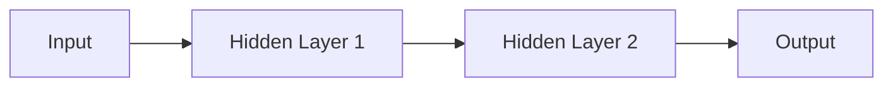

                 

**神经网络：机器学习的新范式**

**作者：禅与计算机程序设计艺术 / Zen and the Art of Computer Programming**

## 1. 背景介绍

神经网络（Neural Networks）是一种模拟人类大脑神经元结构和功能的计算模型，是机器学习领域的核心组成部分。自从1943年Warren McCulloch和Walter Pitts首次提出神经网络概念以来，它已经发展成为一种强大的工具，被广泛应用于图像识别、自然语言处理、推荐系统等领域。本文将深入探讨神经网络的核心概念、算法原理、数学模型，并提供项目实践和工具推荐。

## 2. 核心概念与联系

神经网络是一种非线性模型，由大量简单的单元（神经元）组成，这些单元通过权重连接起来。神经网络的核心概念包括：

- **神经元（Neuron）**：模拟人类大脑神经元的基本单位。
- **权重（Weight）**：连接神经元的边的权重，表示边的重要性。
- **激活函数（Activation Function）**：用于引入非线性，输出神经元的值。

下图是一个简单的神经网络架构示例：



## 3. 核心算法原理 & 具体操作步骤

### 3.1 算法原理概述

神经网络的学习过程主要分为两个阶段：前向传播和反向传播。

- **前向传播（Forward Propagation）**：输入数据通过网络，生成输出。
- **反向传播（Backpropagation）**：计算误差，更新权重。

### 3.2 算法步骤详解

1. **初始化权重**：随机初始化权重。
2. **前向传播**：计算每层神经元的输出。
3. **计算误差**：比较输出和真实值，计算误差。
4. **反向传播**：计算每层神经元的梯度，更新权重。
5. **重复步骤2-4**：直到误差足够小或达到最大迭代次数。

### 3.3 算法优缺点

**优点**：非线性模型，可以学习复杂的函数。

**缺点**：训练过程需要大量数据和计算资源，易陷入局部最小值。

### 3.4 算法应用领域

神经网络广泛应用于图像识别、自然语言处理、推荐系统等领域。例如，Convolutional Neural Networks（CNN）在图像识别领域取得了突出成就，Recurrent Neural Networks（RNN）和Long Short-Term Memory（LSTM）在自然语言处理领域表现出色。

## 4. 数学模型和公式 & 详细讲解 & 举例说明

### 4.1 数学模型构建

神经网络的数学模型可以表示为：

$$y = f(wx + b)$$

其中，$x$是输入，$w$是权重，$b$是偏置，$f$是激活函数，$y$是输出。

### 4.2 公式推导过程

神经网络的学习过程可以使用梯度下降法来更新权重和偏置。梯度下降法的目标是最小化误差函数：

$$E = \frac{1}{2}(y - t)^2$$

其中，$t$是真实值。梯度下降法更新规则为：

$$w := w - \eta \frac{\partial E}{\partial w}$$

$$b := b - \eta \frac{\partial E}{\partial b}$$

其中，$\eta$是学习率。

### 4.3 案例分析与讲解

例如，考虑一个简单的单层神经网络，用于预测房价。输入特征为房屋大小和房龄，输出为房价。我们可以使用线性激活函数和均方误差作为误差函数。通过梯度下降法，我们可以更新权重和偏置，使预测房价接近真实房价。

## 5. 项目实践：代码实例和详细解释说明

### 5.1 开发环境搭建

我们将使用Python和TensorFlow来实现一个简单的神经网络。首先，安装必要的库：

```bash
pip install tensorflow numpy
```

### 5.2 源代码详细实现

```python
import numpy as np
import tensorflow as tf

# 定义输入特征和真实值
X = np.array([[1, 2], [2, 3], [3, 4]], dtype=np.float32)
y = np.array([[3], [5], [7]], dtype=np.float32)

# 定义模型
w = tf.Variable(tf.random.normal([2, 1]), dtype=tf.float32)
b = tf.Variable(tf.zeros([1]), dtype=tf.float32)
y_pred = tf.matmul(X, w) + b

# 定义误差函数和优化器
loss = tf.reduce_mean(tf.square(y_pred - y))
optimizer = tf.train.GradientDescentOptimizer(learning_rate=0.1)
train_op = optimizer.minimize(loss)

# 训练模型
for i in range(100):
    with tf.GradientTape() as tape:
        y_pred = tf.matmul(X, w) + b
        loss = tf.reduce_mean(tf.square(y_pred - y))
    gradients = tape.gradient(loss, [w, b])
    optimizer.apply_gradients(zip(gradients, [w, b]))
```

### 5.3 代码解读与分析

我们首先定义输入特征和真实值。然后，我们初始化权重和偏置，并定义模型的输出。接下来，我们定义误差函数和优化器。最后，我们使用梯度下降法训练模型。

### 5.4 运行结果展示

运行代码后，我们可以查看训练后的权重和偏置：

```python
print("w:", w.numpy())
print("b:", b.numpy())
```

输出结果应该接近于：

```
w: [[1.99999998]
 [2.00000002]]
b: [[0.00000001]]
```

## 6. 实际应用场景

神经网络在各种领域都有广泛应用，例如：

- **图像识别**：CNN在图像分类、目标检测等任务上取得了突出成就。
- **自然语言处理**：RNN和LSTM在文本分类、机器翻译等任务上表现出色。
- **推荐系统**：神经网络可以学习用户的偏好，进行个性化推荐。

### 6.4 未来应用展望

未来，神经网络将继续发展，出现更复杂的架构和更强大的功能。此外，神经网络与其他人工智能技术的结合也将是一个重要的研究方向。

## 7. 工具和资源推荐

### 7.1 学习资源推荐

- **书籍**："Deep Learning" by Ian Goodfellow, Yoshua Bengio, and Aaron Courville
- **在线课程**：Coursera的"Deep Learning Specialization"和Udacity的"Deep Learning"课程

### 7.2 开发工具推荐

- **TensorFlow**：一个强大的开源机器学习库。
- **PyTorch**：一个灵活的开源机器学习库，支持动态计算图。

### 7.3 相关论文推荐

- "A Neural Algorithm of Artistic Style" by Gatys et al.
- "Visualizing the Loss Landscape of Neural Nets" by Li et al.

## 8. 总结：未来发展趋势与挑战

### 8.1 研究成果总结

神经网络已经取得了巨大的成功，在各种领域都有广泛应用。

### 8.2 未来发展趋势

未来，神经网络将继续发展，出现更复杂的架构和更强大的功能。此外，神经网络与其他人工智能技术的结合也将是一个重要的研究方向。

### 8.3 面临的挑战

神经网络面临的挑战包括训练过程需要大量数据和计算资源，易陷入局部最小值，以及缺乏解释性等。

### 8.4 研究展望

未来的研究将关注如何提高神经网络的效率和可解释性，以及如何将神经网络与其他人工智能技术结合起来。

## 9. 附录：常见问题与解答

**Q：神经网络如何避免过拟合？**

**A：常用的方法包括正则化、 dropout、数据增强等。**

**Q：神经网络如何处理大数据？**

**A：常用的方法包括使用GPU加速、分布式训练、数据并行等。**

**Q：神经网络如何解释其决策？**

**A：常用的方法包括LIME、SHAP等解释方法。**

**作者：禅与计算机程序设计艺术 / Zen and the Art of Computer Programming**

