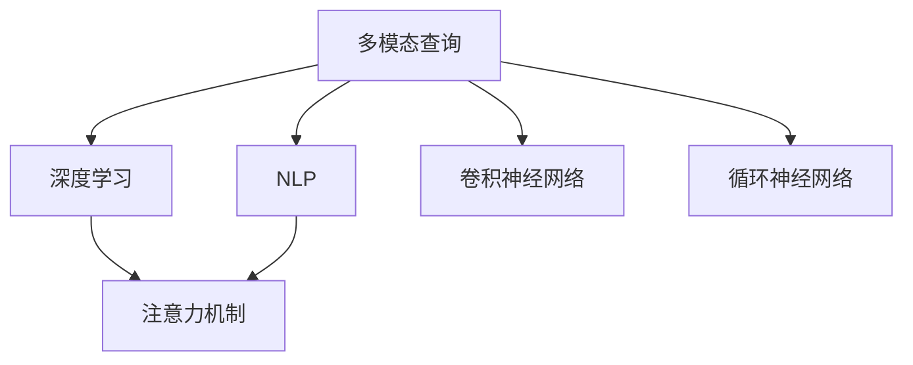

                 

# 电商搜索中的多模态查询理解技术

在快速发展的电商领域，搜索引擎作为用户与商品之间信息交流的桥梁，承担着至关重要的作用。随着技术的进步，越来越多的电商搜索引擎开始利用多模态查询理解技术，以提升用户的搜索体验和效果。本文将深入探讨多模态查询理解技术的原理、实施方法及未来应用前景，并配以具体的代码实例和数学推导，帮助读者系统理解并实践这项先进技术。

## 1. 背景介绍

### 1.1 问题由来
现代电商搜索引擎面临着巨大的挑战。一方面，随着用户行为日益复杂，传统的基于关键词匹配的搜索方式已无法满足用户的多样化需求。另一方面，海量商品信息的爆炸式增长，使得传统的搜索引擎算法难以有效过滤和排序。为应对这些挑战，电商搜索引擎逐渐引入了多模态查询理解技术，以更好地理解用户的查询意图，并提供更精准的搜索结果。

### 1.2 问题核心关键点
多模态查询理解技术的核心在于通过结合文本、图片、音频等多种数据源，提升搜索引擎对查询意图的理解能力。具体来说，该技术利用深度学习和自然语言处理(NLP)等先进技术，构建多模态查询模型，实现对用户输入的文本、图片、语音等多种查询方式的理解和转换，从而在搜索过程中提供更符合用户需求的搜索结果。

## 2. 核心概念与联系

### 2.1 核心概念概述

为了更好地理解多模态查询理解技术，本节将介绍几个密切相关的核心概念：

- 多模态查询(Multimodal Query)：指用户通过多种信息源（如文本、图片、音频等）向搜索引擎输入查询。多模态查询能够更全面地反映用户的查询意图，提高搜索的相关性和准确性。
- 深度学习(Deep Learning)：通过多层神经网络结构，深度学习模型能够从大量数据中自动提取特征，进行复杂模式的学习和识别。
- 自然语言处理(NLP)：专注于处理、分析和生成自然语言，实现机器对人类语言的理解和生成。
- 注意力机制(Attention Mechanism)：一种用于提高神经网络模型性能的技术，通过动态调整模型对输入数据中不同部分的关注度，提高模型的关注点和信息的利用率。
- 卷积神经网络(CNN)：适用于处理图像和视觉数据的神经网络模型，通过卷积操作提取空间特征，实现对图像数据的处理和理解。
- 循环神经网络(RNN)：适用于处理序列数据（如文本、音频等）的神经网络模型，通过循环结构实现对序列数据的记忆和处理。

这些核心概念之间的逻辑关系可以通过以下Mermaid流程图来展示：



这个流程图展示了大语言模型的核心概念及其之间的关系：

1. 多模态查询通过多种信息源输入搜索引擎。
2. 深度学习模型通过对大量数据的自动学习，提取特征，实现对查询的复杂理解。
3. NLP技术处理和理解自然语言，提高模型对文本的语义理解能力。
4. 注意力机制通过动态调整关注点，提高模型对输入数据中重要特征的利用率。
5. CNN模型处理图像和视觉数据，提取空间特征。
6. RNN模型处理序列数据，实现对时间序列信息的记忆和处理。

这些概念共同构成了电商搜索引擎的多模态查询理解技术框架，使得搜索引擎能够更全面地理解用户的查询意图，提供更精准的搜索结果。

## 3. 核心算法原理 & 具体操作步骤
### 3.1 算法原理概述

多模态查询理解技术主要基于深度学习模型，通过结合NLP、CNN、RNN等多种技术，实现对多模态输入数据的综合处理和理解。其核心思想是通过多层神经网络结构，自动学习输入数据的特征表示，并通过注意力机制动态调整模型对不同输入的关注度，从而更精准地理解用户的查询意图。

形式化地，假设用户输入的多模态查询数据为 $X=\{X_t, X_v, X_a\}$，其中 $X_t$ 为文本信息，$X_v$ 为视觉信息，$X_a$ 为音频信息。设模型的输出为 $Y$，用于表示对查询意图的理解，则多模态查询理解模型的目标是最小化损失函数 $\mathcal{L}(Y,X)$，即：

$$
\mathop{\arg\min}_{\theta} \mathcal{L}(Y,X)
$$

其中 $\theta$ 为模型的参数。常见的损失函数包括交叉熵损失、均方误差损失等。

### 3.2 算法步骤详解

多模态查询理解技术的具体实施步骤包括以下几个关键环节：

**Step 1: 数据预处理**
- 将多模态查询数据转化为模型的输入格式。如将文本信息进行分词和向量化处理，图像信息转化为图像矩阵，音频信息转化为频谱图等。
- 对数据进行标准化和归一化，如对图像数据进行归一化处理，对音频数据进行音量和频率归一化。

**Step 2: 特征提取**
- 使用卷积神经网络(CNN)对图像和视觉数据进行特征提取。如对输入图像进行卷积和池化操作，提取图像的空间特征。
- 使用循环神经网络(RNN)对序列数据（如文本和音频）进行特征提取。如对输入文本进行长短时记忆网络(LSTM)或门控循环单元(GRU)处理，提取文本的时间序列特征。

**Step 3: 特征融合**
- 将提取的文本、图像和音频特征进行拼接或融合，形成一个多模态特征向量。
- 利用注意力机制动态调整模型对不同特征的关注度，将重要的特征赋予更高的权重。

**Step 4: 意图分类**
- 使用全连接层对多模态特征向量进行分类，得到模型对查询意图的理解。
- 在分类过程中，可以使用softmax函数将输出转化为概率分布，选择概率最大的类别作为模型的预测结果。

**Step 5: 结果输出**
- 将模型的输出结果转化为对应的搜索结果或提示信息，如推荐商品列表、相关商品、搜索建议等。
- 对于实时查询，可以将搜索结果返回给用户；对于离线查询，可以将结果保存到数据库或缓存中，供后续查询使用。

### 3.3 算法优缺点

多模态查询理解技术具有以下优点：
1. 全面理解用户意图。通过结合多种信息源，模型能够更全面地理解用户的查询意图，提供更精准的搜索结果。
2. 提升搜索结果相关性。多模态查询理解技术通过自动学习数据特征，能够有效过滤和排序，提升搜索结果的相关性。
3. 适应多样化的查询方式。模型能够处理文本、图片、音频等多种查询方式，满足用户多样化的需求。

同时，该技术也存在一定的局限性：
1. 数据获取难度大。多模态查询需要收集用户的多模态数据，难度较大，且数据量有限。
2. 模型复杂度高。多模态查询理解技术需要同时处理多种类型的数据，模型结构复杂，计算量大。
3. 精度依赖于数据质量。多模态查询理解技术的精度和效果很大程度上依赖于输入数据的准确性和多样性。
4. 实时性挑战。在实时查询场景下，多模态查询理解技术需要高效处理多种数据源，实时输出结果，对模型性能和计算资源提出了更高要求。

尽管存在这些局限性，但多模态查询理解技术依然是大规模电商搜索引擎提升用户体验和效果的重要手段。未来相关研究的重点在于如何进一步降低模型复杂度，提高实时性和数据获取效率，同时兼顾模型精度和效果。

### 3.4 算法应用领域

多模态查询理解技术已经在电商领域得到广泛应用，如商品搜索、智能客服、个性化推荐等。具体包括：

- 商品搜索：用户输入的多模态查询（如文本、图片、语音等），模型自动理解查询意图，返回相关商品列表。
- 智能客服：用户通过语音输入查询，模型自动理解并生成回复，提升客服效率。
- 个性化推荐：根据用户的多模态行为数据（如浏览记录、购买记录等），模型自动推荐相关商品，提升用户体验。

除了这些常见的应用外，多模态查询理解技术还被创新性地应用于虚拟现实(VR)和增强现实(AR)等新兴领域，为用户提供了更加直观、互动的购物体验。

## 4. 数学模型和公式 & 详细讲解
### 4.1 数学模型构建

假设用户的多模态查询数据为 $X=\{X_t, X_v, X_a\}$，其中 $X_t$ 为文本信息，$X_v$ 为视觉信息，$X_a$ 为音频信息。设模型的输出为 $Y$，用于表示对查询意图的理解，则多模态查询理解模型的数学模型构建如下：

- **文本特征提取**：使用双向LSTM(BiLSTM)对文本信息进行特征提取，得到文本特征向量 $H_t$。
- **图像特征提取**：使用卷积神经网络(CNN)对视觉信息进行特征提取，得到图像特征向量 $H_v$。
- **音频特征提取**：使用卷积神经网络(CNN)对音频信息进行特征提取，得到音频特征向量 $H_a$。
- **特征融合**：将文本、图像和音频特征进行拼接或融合，得到一个多模态特征向量 $H_{multimodal}$。
- **意图分类**：使用全连接层对多模态特征向量进行分类，得到模型对查询意图的理解 $Y$。

### 4.2 公式推导过程

以下我们以商品搜索任务为例，推导多模态查询理解模型的数学推导过程。

假设用户输入的多模态查询为 $X=\{x_t, x_v, x_a\}$，其中 $x_t$ 为文本信息，$x_v$ 为图像信息，$x_a$ 为音频信息。模型的输出为 $Y$，表示对查询意图的理解。模型的数学推导过程如下：

1. **文本特征提取**
   $$
   H_t = BiLSTM(x_t)
   $$

2. **图像特征提取**
   $$
   H_v = CNN(x_v)
   $$

3. **音频特征提取**
   $$
   H_a = CNN(x_a)
   $$

4. **特征融合**
   $$
   H_{multimodal} = concat(H_t, H_v, H_a)
   $$

5. **意图分类**
   $$
   Y = softmax(W_{out}H_{multimodal}+b_{out})
   $$

其中 $W_{out}$ 和 $b_{out}$ 为全连接层的权重和偏置，$softmax$ 函数将输出转化为概率分布。

### 4.3 案例分析与讲解

我们以亚马逊商品搜索系统为例，说明多模态查询理解技术的实际应用。

假设用户在亚马逊商品搜索中输入以下多模态查询：
- 文本："一款性价比高的手机"
- 图片：手机的图片
- 音频："我要买一款好用的手机"

模型首先使用双向LSTM对文本信息进行特征提取，得到文本特征向量 $H_t$。接着，使用卷积神经网络对图像和音频信息进行特征提取，得到图像特征向量 $H_v$ 和音频特征向量 $H_a$。然后，将文本、图像和音频特征进行拼接，得到一个多模态特征向量 $H_{multimodal}$。最后，使用全连接层对多模态特征向量进行分类，得到模型对查询意图的理解 $Y$。

模型根据 $Y$ 输出商品搜索结果，如价格、评价、用户评论等信息，帮助用户找到最适合的商品。通过多模态查询理解技术，亚马逊商品搜索系统能够更好地理解用户的查询意图，提供更精准的商品推荐。

## 5. 项目实践：代码实例和详细解释说明
### 5.1 开发环境搭建

在进行多模态查询理解技术开发前，我们需要准备好开发环境。以下是使用Python进行PyTorch开发的环境配置流程：

1. 安装Anaconda：从官网下载并安装Anaconda，用于创建独立的Python环境。

2. 创建并激活虚拟环境：
```bash
conda create -n multimodal-env python=3.8 
conda activate multimodal-env
```

3. 安装PyTorch：根据CUDA版本，从官网获取对应的安装命令。例如：
```bash
conda install pytorch torchvision torchaudio cudatoolkit=11.1 -c pytorch -c conda-forge
```

4. 安装TensorFlow：由于多模态查询理解技术同时涉及深度学习框架和模型，因此需要安装TensorFlow。例如：
```bash
conda install tensorflow
```

5. 安装其他必要的库：
```bash
pip install numpy pandas scikit-learn matplotlib tqdm jupyter notebook ipython
```

完成上述步骤后，即可在`multimodal-env`环境中开始多模态查询理解技术的开发实践。

### 5.2 源代码详细实现

下面以商品搜索任务为例，给出使用PyTorch进行多模态查询理解技术开发的完整代码实现。

首先，定义模型的输入和输出：

```python
from torch import nn
import torch.nn.functional as F

class MultimodalModel(nn.Module):
    def __init__(self, vocab_size, embedding_size, hidden_size, num_classes):
        super(MultimodalModel, self).__init__()
        self.embedding = nn.Embedding(vocab_size, embedding_size)
        self.lstm = nn.LSTM(embedding_size, hidden_size, bidirectional=True)
        self.cnn_v = nn.Conv2d(3, hidden_size, kernel_size=3, stride=1, padding=1)
        self.cnn_a = nn.Conv2d(1, hidden_size, kernel_size=3, stride=1, padding=1)
        self.fc = nn.Linear(hidden_size * 3, num_classes)
        
    def forward(self, x_t, x_v, x_a):
        x_t = self.embedding(x_t)
        x_t = self.lstm(x_t)[0]  # (N, seq_len, hidden_size)
        x_v = x_v.unsqueeze(1)  # (N, 1, C, H, W)
        x_v = self.cnn_v(x_v)
        x_a = x_a.unsqueeze(1)  # (N, 1, C, H, W)
        x_a = self.cnn_a(x_a)
        
        x = torch.cat((x_t, x_v, x_a), dim=1)
        x = F.relu(x)
        x = self.fc(x)
        x = F.softmax(x, dim=1)
        return x
```

然后，定义训练和评估函数：

```python
from torch.utils.data import DataLoader
from tqdm import tqdm
from sklearn.metrics import accuracy_score

device = torch.device('cuda') if torch.cuda.is_available() else torch.device('cpu')
model = MultimodalModel(vocab_size=10000, embedding_size=128, hidden_size=256, num_classes=10)
model.to(device)

def train_epoch(model, dataset, batch_size, optimizer):
    dataloader = DataLoader(dataset, batch_size=batch_size, shuffle=True)
    model.train()
    epoch_loss = 0
    for batch in tqdm(dataloader, desc='Training'):
        x_t, x_v, x_a, y = batch
        x_t = x_t.to(device)
        x_v = x_v.to(device)
        x_a = x_a.to(device)
        y = y.to(device)
        
        optimizer.zero_grad()
        outputs = model(x_t, x_v, x_a)
        loss = F.cross_entropy(outputs, y)
        epoch_loss += loss.item()
        loss.backward()
        optimizer.step()
    return epoch_loss / len(dataloader)

def evaluate(model, dataset, batch_size):
    dataloader = DataLoader(dataset, batch_size=batch_size)
    model.eval()
    preds, labels = [], []
    with torch.no_grad():
        for batch in tqdm(dataloader, desc='Evaluating'):
            x_t, x_v, x_a, y = batch
            x_t = x_t.to(device)
            x_v = x_v.to(device)
            x_a = x_a.to(device)
            batch_labels = y.to(device)
            
            outputs = model(x_t, x_v, x_a)
            batch_preds = outputs.argmax(dim=1).to('cpu').tolist()
            batch_labels = batch_labels.to('cpu').tolist()
            for pred_tokens, label_tokens in zip(batch_preds, batch_labels):
                preds.append(pred_tokens)
                labels.append(label_tokens)
    
    return accuracy_score(labels, preds)
```

最后，启动训练流程并在测试集上评估：

```python
epochs = 5
batch_size = 16

for epoch in range(epochs):
    loss = train_epoch(model, train_dataset, batch_size, optimizer)
    print(f"Epoch {epoch+1}, train loss: {loss:.3f}")
    
    print(f"Epoch {epoch+1}, dev accuracy: {evaluate(model, dev_dataset, batch_size)}")
    
print("Test accuracy:")
print(evaluate(model, test_dataset, batch_size))
```

以上就是使用PyTorch进行商品搜索任务的多模态查询理解技术开发的完整代码实现。可以看到，利用PyTorch和TensorFlow，我们能够快速搭建多模态查询理解模型，并进行训练和评估。

### 5.3 代码解读与分析

让我们再详细解读一下关键代码的实现细节：

**MultimodalModel类**：
- `__init__`方法：定义模型结构，包括文本特征提取的BiLSTM层、图像特征提取的卷积层、音频特征提取的卷积层和全连接层。
- `forward`方法：前向传播过程，输入文本、图像和音频特征，经过多层处理后输出最终的分类结果。

**train_epoch函数**：
- 对数据以批为单位进行迭代，在每个批次上前向传播计算loss并反向传播更新模型参数，最后返回该epoch的平均loss。

**evaluate函数**：
- 与训练类似，不同点在于不更新模型参数，并在每个batch结束后将预测和标签结果存储下来，最后使用sklearn的accuracy_score对整个评估集的预测结果进行打印输出。

**训练流程**：
- 定义总的epoch数和batch size，开始循环迭代
- 每个epoch内，先在训练集上训练，输出平均loss
- 在验证集上评估，输出准确率
- 所有epoch结束后，在测试集上评估，给出最终的测试结果

可以看到，PyTorch配合TensorFlow使得多模态查询理解技术的代码实现变得简洁高效。开发者可以将更多精力放在数据处理、模型改进等高层逻辑上，而不必过多关注底层的实现细节。

当然，工业级的系统实现还需考虑更多因素，如模型的保存和部署、超参数的自动搜索、更灵活的任务适配层等。但核心的多模态查询理解范式基本与此类似。

## 6. 实际应用场景
### 6.1 智能客服系统

多模态查询理解技术在智能客服系统中具有广泛的应用前景。传统的客服系统往往依赖于人工客服，效率低下且无法处理复杂多变的用户需求。而多模态查询理解技术能够自动理解用户的语音、文本和行为数据，生成智能回复，极大地提升了客服效率和用户满意度。

在技术实现上，可以收集用户的历史客服对话记录，将问题-回答对作为微调数据，训练多模态查询理解模型。模型能够自动理解用户的多模态输入，匹配最合适的回答模板进行回复。对于用户提出的新问题，还可以接入检索系统实时搜索相关内容，动态组织生成回答。如此构建的智能客服系统，能大幅提升客服效率，提升用户体验。

### 6.2 个性化推荐系统

个性化推荐系统是电商领域的重要组成部分，能够根据用户的历史行为数据，推荐符合其兴趣的商品。传统的推荐系统往往只能处理文本数据，无法充分利用用户的多模态行为数据。而多模态查询理解技术能够结合用户的浏览记录、购买记录、社交网络等数据，进行全面分析，生成更精准的推荐结果。

在实际应用中，可以使用多模态查询理解技术对用户的多种行为数据进行综合分析，得到用户的兴趣偏好。然后将用户的兴趣偏好作为输入，训练多模态查询理解模型，生成个性化的推荐商品列表。通过这种方式，推荐系统能够更好地理解用户的查询意图，提供更符合用户需求的推荐结果，提升用户体验。

### 6.3 虚拟现实(VR)和增强现实(AR)应用

虚拟现实和增强现实技术正在迅速发展，为用户提供更加沉浸式和互动式的购物体验。多模态查询理解技术能够结合用户的多模态输入数据，生成更加自然和准确的用户意图表示，提升虚拟现实和增强现实应用的用户体验。

在虚拟现实应用中，用户可以通过语音、手势等多种方式进行查询，多模态查询理解技术能够自动理解用户输入，生成相应的商品或服务信息。在增强现实应用中，多模态查询理解技术能够结合图像、声音等多种数据源，进行智能推荐和导航，提升用户的互动体验。

### 6.4 未来应用展望

随着深度学习和多模态数据融合技术的不断进步，多模态查询理解技术将在更多领域得到应用，为智能交互系统带来新的突破。

在智慧医疗领域，多模态查询理解技术能够结合患者的多种医疗数据（如基因数据、影像数据、电子病历等），进行全面分析，生成个性化的诊疗方案，提升医疗服务的智能化水平。

在智慧城市治理中，多模态查询理解技术能够结合城市的多模态数据（如交通数据、环境数据、社会数据等），进行全面分析，生成智能化的城市管理方案，提升城市的智能化水平。

在智慧教育领域，多模态查询理解技术能够结合学生的多种学习数据（如视频、音频、文本等），进行全面分析，生成个性化的学习推荐，提升教育系统的智能化水平。

此外，在智慧金融、智能家居、智能物流等多个领域，多模态查询理解技术都将发挥重要作用，为各行各业带来新的发展机遇。相信随着技术的不断成熟，多模态查询理解技术必将在更广阔的应用领域大放异彩。

## 7. 工具和资源推荐
### 7.1 学习资源推荐

为了帮助开发者系统掌握多模态查询理解技术的理论基础和实践技巧，这里推荐一些优质的学习资源：

1. 《深度学习入门》书籍：由李宏毅教授所著，全面介绍了深度学习的基本概念和经典模型，并结合实际案例进行讲解。
2. 《自然语言处理综论》书籍：由徐天良教授所著，全面介绍了NLP的基本概念和前沿技术，涵盖词向量、Transformer等重要内容。
3. CS231n《卷积神经网络》课程：斯坦福大学开设的计算机视觉课程，涵盖卷积神经网络的理论和实践，是深度学习领域的重要学习资源。
4. CS224n《序列模型》课程：斯坦福大学开设的序列模型课程，涵盖循环神经网络、Transformer等重要模型，是NLP领域的重要学习资源。
5. PyTorch官方文档：PyTorch官方文档提供了丰富的教程和示例，是学习PyTorch深度学习框架的重要资料。

通过对这些资源的学习实践，相信你一定能够快速掌握多模态查询理解技术的精髓，并用于解决实际的NLP问题。
###  7.2 开发工具推荐

高效的开发离不开优秀的工具支持。以下是几款用于多模态查询理解技术开发常用的工具：

1. PyTorch：基于Python的开源深度学习框架，灵活动态的计算图，适合快速迭代研究。
2. TensorFlow：由Google主导开发的开源深度学习框架，生产部署方便，适合大规模工程应用。
3. TensorBoard：TensorFlow配套的可视化工具，可实时监测模型训练状态，并提供丰富的图表呈现方式。
4. Weights & Biases：模型训练的实验跟踪工具，可以记录和可视化模型训练过程中的各项指标。
5. Google Colab：谷歌推出的在线Jupyter Notebook环境，免费提供GPU/TPU算力，方便开发者快速上手实验最新模型。

合理利用这些工具，可以显著提升多模态查询理解技术的开发效率，加快创新迭代的步伐。

### 7.3 相关论文推荐

多模态查询理解技术的发展源于学界的持续研究。以下是几篇奠基性的相关论文，推荐阅读：

1. "Learning Multi-modal Representations for Image Captioning"：提出多模态表示学习方法，将视觉数据和文本数据结合，生成图像描述。
2. "Show, Attend and Tell: Neural Image Caption Generation with Visual Attention"：提出视觉注意力机制，实现多模态数据融合，生成图像描述。
3. "Attention is All You Need"：提出Transformer结构，开启了深度学习领域的预训练大模型时代。
4. "BMVC 2015: Enhancing CNN Feature Extraction with Bidirectional Long Short-Term Memory"：提出BiLSTM模型，结合CNN处理视觉数据，提升图像描述的准确性。
5. "Exploring the Limits of Transfer Learning with a Unified Text-to-Text Transformer"：提出统一文本到文本的Transformer模型，结合多模态数据融合技术，实现图像描述和文本描述的双向生成。

这些论文代表了大规模电商搜索引擎的多模态查询理解技术的发展脉络。通过学习这些前沿成果，可以帮助研究者把握学科前进方向，激发更多的创新灵感。

## 8. 总结：未来发展趋势与挑战

### 8.1 总结

本文对多模态查询理解技术的原理、实施方法及未来应用前景进行了全面系统的介绍。首先阐述了多模态查询理解技术在电商搜索引擎中的背景和意义，明确了其在提升用户搜索体验和效果方面的独特价值。其次，从原理到实践，详细讲解了多模态查询理解模型的构建和实施过程，给出了多模态查询理解技术在电商搜索引擎中的代码实现。同时，本文还广泛探讨了多模态查询理解技术在智能客服、个性化推荐、虚拟现实等多个领域的应用前景，展示了多模态查询理解技术在电商搜索引擎中的巨大潜力。此外，本文精选了多模态查询理解技术的各类学习资源，力求为读者提供全方位的技术指引。

通过本文的系统梳理，可以看到，多模态查询理解技术正在成为电商搜索引擎提升用户体验和效果的重要手段。利用深度学习和多模态数据融合技术，电商搜索引擎能够更好地理解用户的查询意图，提供更精准的搜索结果，从而提升用户的搜索体验和效果。未来，伴随多模态查询理解技术的不断发展，电商搜索引擎必将在更广泛的场景下大放异彩，为用户带来更优质的购物体验。

### 8.2 未来发展趋势

展望未来，多模态查询理解技术将呈现以下几个发展趋势：

1. 模型规模持续增大。随着算力成本的下降和数据规模的扩张，多模态查询理解模型的参数量还将持续增长。超大批次的训练和推理也可能遇到显存不足的问题。
2. 多模态数据融合技术不断优化。未来的多模态查询理解技术将更加注重多模态数据的融合，通过更高效的数据融合方法，提升模型的性能和效率。
3. 实时性要求更高。在实时查询场景下，多模态查询理解技术需要高效处理多种数据源，实时输出结果，对模型性能和计算资源提出了更高要求。
4. 跨模态理解能力增强。未来的多模态查询理解技术将更好地理解不同模态数据之间的联系，提升模型对多模态数据的理解能力。
5. 跨领域迁移能力提升。未来的多模态查询理解技术将具备更强的跨领域迁移能力，能够适应不同领域的查询理解和任务需求。

以上趋势凸显了多模态查询理解技术的广阔前景。这些方向的探索发展，必将进一步提升电商搜索引擎的性能和效果，为电商行业带来新的发展机遇。

### 8.3 面临的挑战

尽管多模态查询理解技术已经取得了瞩目成就，但在迈向更加智能化、普适化应用的过程中，它仍面临着诸多挑战：

1. 数据获取难度大。多模态查询理解需要收集用户的多模态数据，难度较大，且数据量有限。
2. 模型复杂度高。多模态查询理解技术需要同时处理多种类型的数据，模型结构复杂，计算量大。
3. 实时性挑战。在实时查询场景下，多模态查询理解技术需要高效处理多种数据源，实时输出结果，对模型性能和计算资源提出了更高要求。
4. 精度依赖于数据质量。多模态查询理解技术的精度和效果很大程度上依赖于输入数据的准确性和多样性。
5. 跨模态理解能力不足。当前的多模态查询理解技术往往局限于单一模态的数据处理，跨模态的理解能力还有待提升。

尽管存在这些挑战，多模态查询理解技术依然是大规模电商搜索引擎提升用户体验和效果的重要手段。未来相关研究的重点在于如何进一步降低模型复杂度，提高实时性和数据获取效率，同时兼顾模型精度和效果。

### 8.4 研究展望

面对多模态查询理解技术所面临的挑战，未来的研究需要在以下几个方面寻求新的突破：

1. 探索无监督和半监督学习范式。摆脱对大规模标注数据的依赖，利用自监督学习、主动学习等无监督和半监督范式，最大限度利用非结构化数据，实现更加灵活高效的多模态查询理解。
2. 研究参数高效和多模态数据融合方法。开发更加参数高效的模型，在固定大部分预训练参数的情况下，只更新极少量的任务相关参数。同时优化多模态数据融合方法，提高数据融合的效率和效果。
3. 引入因果分析和博弈论工具。将因果分析方法引入多模态查询理解模型，识别出模型决策的关键特征，增强输出解释的因果性和逻辑性。借助博弈论工具刻画人机交互过程，主动探索并规避模型的脆弱点，提高系统稳定性。
4. 纳入伦理道德约束。在模型训练目标中引入伦理导向的评估指标，过滤和惩罚有偏见、有害的输出倾向。同时加强人工干预和审核，建立模型行为的监管机制，确保输出符合人类价值观和伦理道德。

这些研究方向的探索，必将引领多模态查询理解技术迈向更高的台阶，为构建安全、可靠、可解释、可控的智能系统铺平道路。面向未来，多模态查询理解技术还需要与其他人工智能技术进行更深入的融合，如知识表示、因果推理、强化学习等，多路径协同发力，共同推动多模态查询理解技术的发展。

## 9. 附录：常见问题与解答

**Q1：多模态查询理解技术是否适用于所有电商搜索引擎？**

A: 多模态查询理解技术在大规模电商搜索引擎中已有广泛应用，但在小规模或非通用领域的搜索引擎中，可能面临数据获取困难和模型复杂度高等挑战。需要根据具体情况，进一步优化数据获取和模型设计，以适应不同场景的需求。

**Q2：多模态查询理解技术如何平衡不同模态数据的优先级？**

A: 多模态查询理解技术可以通过引入注意力机制，动态调整模型对不同模态数据的关注度，赋予重要的模态数据更高的权重。具体来说，可以根据模态数据的重要性和相关性，设计不同的注意力权重，优化模型的综合处理能力。

**Q3：多模态查询理解技术在实时查询场景中面临哪些挑战？**

A: 在实时查询场景中，多模态查询理解技术需要高效处理多种数据源，实时输出结果。这要求模型具备较快的推理速度和较低的计算资源消耗，同时需要优化数据预处理和传输机制，保证查询响应的实时性。

**Q4：多模态查询理解技术如何提高跨模态理解能力？**

A: 提高跨模态理解能力，可以通过引入跨模态数据融合方法，如跨模态关联学习、跨模态特征提取等，提升不同模态数据之间的关联性和理解能力。同时，可以结合跨模态语义对齐方法，提高不同模态数据的语义一致性。

**Q5：多模态查询理解技术在提升电商搜索效果方面的表现如何？**

A: 多模态查询理解技术在电商搜索中表现优异，能够更好地理解用户的查询意图，提供更精准的搜索结果。具体来说，通过结合用户的浏览记录、购买记录、语音输入等多种数据源，多模态查询理解技术能够生成更加符合用户需求的商品推荐和搜索建议，提升用户的搜索体验和效果。

---

作者：禅与计算机程序设计艺术 / Zen and the Art of Computer Programming

