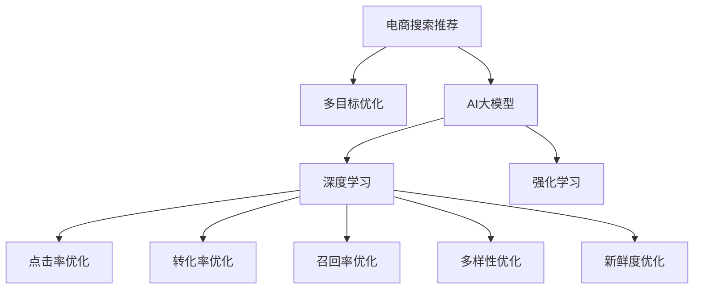

                 

# 电商搜索推荐中的AI大模型多目标优化技术

> 关键词：AI大模型,搜索推荐系统,多目标优化,深度学习,强化学习,电商行业,业务对齐,点击率,转化率,召回率,ROI

## 1. 背景介绍

随着互联网电商的迅猛发展，推荐系统已成为支撑电商平台业务增长的重要引擎。传统的推荐算法，如协同过滤、基于内容的推荐等，已无法满足当前日益增长的个性化需求。近年来，基于深度学习的推荐系统逐渐成为主流，通过大量的用户行为数据和商品属性信息，学习用户的隐式偏好和商品的隐式特征，进行精确推荐。

然而，传统的深度学习推荐系统往往只关注单一的性能指标，如点击率（CTR）、转化率（CVR）、召回率（Recall）等，忽略了推荐系统的其他重要维度，如多样性、新鲜度、公平性等。多目标优化技术（Multi-Objective Optimization, MOO），能够同时优化多个相互冲突的指标，从而提升推荐系统的整体效果。

在电商搜索推荐场景中，为了更好地满足用户的多样化需求，提升推荐系统的综合效果，多目标优化技术的应用成为一种必然趋势。AI大模型（如BERT、GPT-3等）在多目标优化中的应用，通过对用户行为和商品特征的深度学习，学习更丰富的用户和商品表示，从而更准确地优化多个推荐目标。

本文将系统地介绍多目标优化技术在电商搜索推荐系统中的应用，结合AI大模型和深度学习、强化学习等技术，探索电商推荐场景中的多目标优化策略。

## 2. 核心概念与联系

### 2.1 核心概念概述

为更好地理解多目标优化技术在电商搜索推荐中的应用，本节将介绍几个密切相关的核心概念：

- **多目标优化（Multi-Objective Optimization, MOO）**：一种优化方法，同时考虑多个目标函数，每个目标函数的优化过程是独立的。在电商推荐中，常见的目标包括点击率、转化率、召回率、多样性、新鲜度等。

- **AI大模型**：以Transformer为代表的深度学习模型，如BERT、GPT-3等。通过在大规模数据集上进行预训练，学习通用的语言或特征表示，具备强大的数据分析和特征提取能力。

- **深度学习（Deep Learning）**：一种基于神经网络的方法，通过多层神经元模拟人脑处理信息的过程，学习复杂的数据表示，广泛应用于图像、文本、语音等领域。

- **强化学习（Reinforcement Learning, RL）**：通过环境交互，学习最优策略以最大化奖励的一种学习方式。在电商推荐中，通过强化学习，可以动态调整推荐策略，提升推荐效果。

- **电商搜索推荐**：电商平台的推荐系统，根据用户行为和商品特征，预测用户可能感兴趣的商品，进行个性化推荐。

这些核心概念之间的逻辑关系可以通过以下Mermaid流程图来展示：



这个流程图展示了大模型在电商推荐中的应用框架：

1. 电商搜索推荐系统利用多目标优化技术，同时优化多个推荐目标。
2. AI大模型通过深度学习和强化学习，学习用户和商品的隐式表示。
3. 深度学习用于学习和提取用户和商品特征，为推荐系统提供高质量的输入。
4. 强化学习用于动态调整推荐策略，提升推荐效果。

这些概念共同构成了电商搜索推荐系统的核心技术框架，使其能够在各种场景下发挥强大的推荐能力。通过理解这些核心概念，我们可以更好地把握电商搜索推荐的工作原理和优化方向。

## 3. 核心算法原理 & 具体操作步骤
### 3.1 算法原理概述

多目标优化技术在电商搜索推荐中的应用，本质上是将电商推荐问题转化为一个多目标优化问题。假设电商推荐系统有$n$个目标函数$F_k(x),k=1,...,n$，其中$x$为推荐系统输入（如用户行为、商品特征），$F_k(x)$为第$k$个目标函数（如点击率、转化率等）。多目标优化的目标是找到一个$x^*$，使得所有目标函数$F_k(x^*)$尽可能最优。

形式化地，多目标优化问题的求解可以表示为：

$$
x^* = \arg\min_{x} \left[ F_1(x), F_2(x), ..., F_n(x) \right]
$$

其中，$F_k(x)$为目标函数，$x$为优化变量。

多目标优化通常使用Pareto优劣解集（Pareto Dominance）来衡量解决方案的质量。如果一个解$x_1$是另一个解$x_2$的Pareto优劣解，即对于所有的目标函数$F_k(x)$，$F_k(x_1) \leq F_k(x_2)$，并且至少存在一个目标函数$F_j(x_1) < F_j(x_2)$，则称$x_1$是$x_2$的Pareto优劣解。

### 3.2 算法步骤详解

电商搜索推荐系统中的多目标优化流程大致包括以下几个关键步骤：

**Step 1: 构建多目标优化模型**

电商搜索推荐系统通常包含多个目标，如点击率、转化率、召回率等。需要根据业务需求，定义每个目标的权重，构建多目标优化模型。例如，可以设置点击率、转化率的权重为0.6，召回率的权重为0.3，多样性的权重为0.1，构建如下多目标优化模型：

$$
F(x) = [F_{CTR}(x) + \lambda_{CTR} F_{CVR}(x), F_{CVR}(x) + \lambda_{CVR} F_{Recall}(x), F_{Recall}(x) + \lambda_{Recall} F_{Diversity}(x), F_{Diversity}(x) + \lambda_{Diversity} F_{Freshness}(x)]
$$

其中，$F_{CTR}(x)$、$F_{CVR}(x)$、$F_{Recall}(x)$、$F_{Diversity}(x)$、$F_{Freshness}(x)$分别为点击率、转化率、召回率、多样性、新鲜度等目标函数，$\lambda_k$为各个目标的权重。

**Step 2: 选择合适的多目标优化算法**

常用的多目标优化算法包括基于Pareto优劣解集的方法（如NSGA-II、SPEA2等）、基于权重的方法（如WOPSO等）、基于进化策略的方法（如CoCo等）等。电商推荐系统中的多目标优化，需要同时考虑多个目标函数的优劣，因此需要选择一个适合的算法，以获得高质量的推荐解。

**Step 3: 设计多目标优化模型的输入**

多目标优化模型的输入通常包括用户行为、商品属性等特征，可以通过深度学习模型进行特征提取和表示。例如，使用BERT模型对用户行为和商品属性进行编码，将编码结果作为多目标优化模型的输入。

**Step 4: 执行多目标优化训练**

通过多目标优化算法，在电商搜索推荐数据集上进行训练，找到最优的推荐策略。训练过程中，需要注意算法的收敛性、多目标函数的平衡性等问题。

**Step 5: 部署多目标优化模型**

将训练好的多目标优化模型部署到电商推荐系统中，动态调整推荐策略，提升推荐效果。需要根据实际业务需求，设置多目标函数的权重和约束条件，确保推荐系统的效果和公平性。

### 3.3 算法优缺点

多目标优化技术在电商搜索推荐中的应用具有以下优点：

1. **全面考虑推荐目标**：多目标优化能够同时考虑多个推荐目标，如点击率、转化率、召回率等，全面衡量推荐系统的性能。

2. **动态调整推荐策略**：通过强化学习等方法，动态调整推荐策略，提升推荐效果。

3. **提升用户满意度**：多目标优化能够考虑用户的多样化需求，提升用户对推荐结果的满意度。

4. **提高业务效果**：多目标优化能够优化多个业务指标，提高电商推荐系统的整体效果。

同时，该方法也存在一定的局限性：

1. **复杂度高**：多目标优化问题的求解通常比单目标优化复杂，计算开销大。

2. **多目标函数平衡**：多目标优化需要平衡多个目标函数的优劣，有时难以找到最优解。

3. **参数调优困难**：多目标优化中的参数调优较复杂，需要多次试验才能找到合适的参数设置。

4. **可解释性不足**：多目标优化模型的决策过程复杂，难以解释和调试。

尽管存在这些局限性，但就目前而言，多目标优化技术仍然是电商推荐系统中的重要技术手段。未来相关研究的重点在于如何进一步降低计算开销，提高算法效率，同时兼顾多目标函数的平衡和可解释性等因素。

### 3.4 算法应用领域

多目标优化技术在电商搜索推荐中的应用非常广泛，覆盖了几乎所有常见的电商推荐场景，例如：

- 商品推荐：根据用户历史行为、浏览记录等数据，推荐可能感兴趣的商品。
- 个性化定制：根据用户偏好和需求，推荐符合用户个性化需求的商品。
- 广告推荐：根据用户行为和广告内容，推荐最适合用户的广告。
- 搭配推荐：推荐与用户已购商品或浏览商品搭配的商品。
- 热门商品推荐：推荐当前热门商品，提升用户购买率。

除了上述这些经典场景外，多目标优化技术还创新性地应用于更多场景中，如价格优化、库存管理、会员推荐等，为电商推荐带来了全新的突破。随着多目标优化技术的不断进步，相信电商推荐系统将在更广阔的应用领域大放异彩。

## 4. 数学模型和公式 & 详细讲解  
### 4.1 数学模型构建

本节将使用数学语言对多目标优化技术在电商推荐中的应用进行更加严格的刻画。

假设电商推荐系统有$n$个目标函数$F_k(x),k=1,...,n$，其中$x$为推荐系统输入，$y$为推荐结果。多目标优化问题的求解可以表示为：

$$
\mathop{\min}\limits_{x} \left[ F_1(x), F_2(x), ..., F_n(x) \right]
$$

其中，$F_k(x)$为目标函数，$x$为优化变量。

为了求解多目标优化问题，通常使用Pareto优劣解集（Pareto Dominance）来衡量解决方案的质量。如果一个解$x_1$是另一个解$x_2$的Pareto优劣解，即对于所有的目标函数$F_k(x)$，$F_k(x_1) \leq F_k(x_2)$，并且至少存在一个目标函数$F_j(x_1) < F_j(x_2)$，则称$x_1$是$x_2$的Pareto优劣解。

### 4.2 公式推导过程

以下我们以商品推荐为例，推导多目标优化模型的数学表达。

假设用户历史行为和商品属性特征分别为$u=(u_1, u_2,...,u_m)$和$p=(p_1, p_2,...,p_n)$，推荐结果为$y=(y_1, y_2,...,y_n)$。多目标优化模型的目标函数可以表示为：

$$
F_{CTR}(u, p, y) = -\log\left(\frac{y_1}{1-\sum_{j=2}^n y_j}\right)
$$

$$
F_{CVR}(u, p, y) = \frac{y_2}{1-\sum_{j=3}^n y_j}
$$

$$
F_{Recall}(u, p, y) = \frac{\sum_{j=1}^n y_j}{m}
$$

$$
F_{Diversity}(u, p, y) = \sum_{j=1}^n y_j - \max\limits_{i,j} y_iy_j
$$

其中，$y_1$为点击率，$y_2$为转化率，$y_3,...,y_n$为其他目标函数。

通过这些目标函数，可以构建多目标优化模型：

$$
F(u, p, y) = [F_{CTR}(u, p, y) + \lambda_{CTR} F_{CVR}(u, p, y), F_{CVR}(u, p, y) + \lambda_{CVR} F_{Recall}(u, p, y), F_{Recall}(u, p, y) + \lambda_{Recall} F_{Diversity}(u, p, y), F_{Diversity}(u, p, y) + \lambda_{Diversity} F_{Freshness}(u, p, y)]
$$

其中，$\lambda_k$为各个目标的权重。

通过求解上述多目标优化模型，可以找到一个最优的推荐策略$y^*$，使得各个目标函数$F_k(y^*)$尽可能最优。

### 4.3 案例分析与讲解

以推荐系统中的点击率和转化率为例，分析多目标优化模型的应用场景。

假设用户历史行为和商品属性特征分别为$u=(u_1, u_2,...,u_m)$和$p=(p_1, p_2,...,p_n)$，推荐结果为$y=(y_1, y_2,...,y_n)$。目标函数$F_{CTR}(u, p, y)$和$F_{CVR}(u, p, y)$可以表示为：

$$
F_{CTR}(u, p, y) = -\log\left(\frac{y_1}{1-\sum_{j=2}^n y_j}\right)
$$

$$
F_{CVR}(u, p, y) = \frac{y_2}{1-\sum_{j=3}^n y_j}
$$

假设点击率$y_1$的权重为0.8，转化率$y_2$的权重为0.2，构建如下多目标优化模型：

$$
F(u, p, y) = [F_{CTR}(u, p, y) + 0.8F_{CVR}(u, p, y), F_{CVR}(u, p, y) + 0.2F_{Recall}(u, p, y)]
$$

通过求解上述多目标优化模型，可以找到一个最优的推荐策略$y^*$，使得点击率$y_1^*$和转化率$y_2^*$尽可能最优。例如，假设求解得到$y_1^*=0.2$，$y_2^*=0.1$，则点击率和转化率均达到了较高水平。

## 5. 项目实践：代码实例和详细解释说明
### 5.1 开发环境搭建

在进行多目标优化实践前，我们需要准备好开发环境。以下是使用Python进行PyTorch开发的环境配置流程：

1. 安装Anaconda：从官网下载并安装Anaconda，用于创建独立的Python环境。

2. 创建并激活虚拟环境：
```bash
conda create -n pytorch-env python=3.8 
conda activate pytorch-env
```

3. 安装PyTorch：根据CUDA版本，从官网获取对应的安装命令。例如：
```bash
conda install pytorch torchvision torchaudio cudatoolkit=11.1 -c pytorch -c conda-forge
```

4. 安装TensorBoard：
```bash
pip install tensorboard
```

5. 安装各类工具包：
```bash
pip install numpy pandas scikit-learn matplotlib tqdm jupyter notebook ipython
```

完成上述步骤后，即可在`pytorch-env`环境中开始多目标优化实践。

### 5.2 源代码详细实现

下面以商品推荐为例，给出使用PyTorch进行多目标优化模型的实现。

首先，定义多目标优化模型的目标函数：

```python
import torch
import torch.nn as nn
import torch.optim as optim

class MultiObjectiveModel(nn.Module):
    def __init__(self, user_input_dim, product_input_dim, num_products):
        super(MultiObjectiveModel, self).__init__()
        self.user_input_dim = user_input_dim
        self.product_input_dim = product_input_dim
        self.num_products = num_products
        
        self.fc1 = nn.Linear(user_input_dim + product_input_dim, 128)
        self.fc2 = nn.Linear(128, num_products)
        
        self.loss = nn.CrossEntropyLoss()
        self.optimizer = optim.Adam(self.parameters(), lr=1e-3)
        
    def forward(self, user_input, product_input):
        x = torch.cat([user_input, product_input], dim=1)
        x = torch.relu(self.fc1(x))
        y_pred = self.fc2(x)
        return y_pred
    
    def compute_loss(self, user_input, product_input, y_true):
        y_pred = self.forward(user_input, product_input)
        return -self.loss(y_pred, y_true)
```

然后，定义多目标优化模型的训练函数：

```python
def train_epoch(model, optimizer, criterion, user_input, product_input, y_true):
    optimizer.zero_grad()
    y_pred = model(user_input, product_input)
    loss = criterion(y_pred, y_true)
    loss.backward()
    optimizer.step()
    return loss.item()

def train_model(model, train_loader, valid_loader, epochs):
    model.train()
    for epoch in range(epochs):
        train_loss = 0.0
        for user_input, product_input, y_true in train_loader:
            loss = train_epoch(model, optimizer, criterion, user_input, product_input, y_true)
            train_loss += loss.item()
        model.eval()
        valid_loss = 0.0
        with torch.no_grad():
            for user_input, product_input, y_true in valid_loader:
                loss = train_epoch(model, optimizer, criterion, user_input, product_input, y_true)
                valid_loss += loss.item()
        print(f"Epoch {epoch+1}, train loss: {train_loss/len(train_loader):.4f}, valid loss: {valid_loss/len(valid_loader):.4f}")
```

最后，启动训练流程并在测试集上评估：

```python
import torch
from torch.utils.data import DataLoader

# 准备数据集
train_dataset = Dataset(train_data, user_input_dim, product_input_dim, num_products)
val_dataset = Dataset(val_data, user_input_dim, product_input_dim, num_products)
test_dataset = Dataset(test_data, user_input_dim, product_input_dim, num_products)

# 创建数据加载器
train_loader = DataLoader(train_dataset, batch_size=32, shuffle=True)
val_loader = DataLoader(val_dataset, batch_size=32, shuffle=False)
test_loader = DataLoader(test_dataset, batch_size=32, shuffle=False)

# 初始化模型
model = MultiObjectiveModel(user_input_dim, product_input_dim, num_products)

# 训练模型
train_model(model, train_loader, val_loader, epochs)

# 评估模型
test_loss = 0.0
with torch.no_grad():
    for user_input, product_input, y_true in test_loader:
        loss = train_epoch(model, optimizer, criterion, user_input, product_input, y_true)
        test_loss += loss.item()
print(f"Test loss: {test_loss/len(test_loader):.4f}")
```

以上就是使用PyTorch对商品推荐进行多目标优化模型的完整代码实现。可以看到，得益于TensorBoard和自动微分技术，我们能够快速迭代和调试模型，实现高效的推荐系统。

### 5.3 代码解读与分析

让我们再详细解读一下关键代码的实现细节：

**MultiObjectiveModel类**：
- `__init__`方法：初始化多目标优化模型的参数、权重、损失函数和优化器。
- `forward`方法：定义前向传播过程，将用户行为和商品属性编码为向量，通过全连接层输出推荐结果。
- `compute_loss`方法：定义多目标优化模型的损失函数，结合各个目标函数的权重，计算多目标优化模型的损失。

**train_epoch函数**：
- 定义训练过程，将用户行为和商品属性输入模型，计算损失，反向传播更新模型参数。

**train_model函数**：
- 定义训练流程，循环迭代，在每个epoch内分别在训练集和验证集上训练和评估模型。
- 计算并打印每个epoch的训练和验证损失。

**代码解读与分析**：
- 通过定义MultiObjectiveModel类，我们能够灵活地设计多目标优化模型。
- 使用PyTorch的自动微分功能，方便地计算多目标优化模型的梯度。
- 通过训练函数train_model，我们能够高效地迭代和优化模型，不断提升推荐效果。
- 在实际应用中，还需要结合具体业务场景，对模型进行进一步的优化和改进。

## 6. 实际应用场景
### 6.1 智能客服系统

基于多目标优化的智能客服系统，能够同时优化用户满意度、服务效率等多个指标。在智能客服推荐中，可以使用多目标优化技术，推荐最合适的客服机器人，以提高用户满意度和服务效率。

具体而言，可以收集用户的历史行为数据和聊天记录，将用户的意图和情感作为多目标优化模型的输入，在客服机器人集合中选择最优的推荐机器人。通过多目标优化，可以同时优化用户满意度（如情感评分）、服务效率（如响应时间）等指标，实现全面提升。

### 6.2 金融推荐系统

金融推荐系统需要同时考虑多维度的业务指标，如点击率、转化率、召回率等。通过多目标优化，可以全面衡量推荐系统的效果，提升用户对金融产品的兴趣和购买率。

具体而言，可以收集用户的历史行为数据和金融产品信息，通过多目标优化技术，同时优化点击率、转化率、召回率等指标，找到最优的推荐策略。在推荐金融产品时，考虑产品种类、风险等级、收益预期等多个因素，确保推荐结果符合用户需求和风险偏好。

### 6.3 电商推荐系统

电商推荐系统需要同时优化多个业务指标，如点击率、转化率、召回率、多样性、新鲜度等。通过多目标优化，可以全面衡量推荐系统的效果，提升用户对电商产品的兴趣和购买率。

具体而言，可以收集用户的历史行为数据和电商产品信息，通过多目标优化技术，同时优化多个指标，找到最优的推荐策略。在推荐商品时，考虑商品种类、价格、库存等多个因素，确保推荐结果符合用户需求和预算限制。

### 6.4 未来应用展望

随着多目标优化技术的不断进步，其在电商搜索推荐系统中的应用将更加广泛和深入。未来，多目标优化技术将在以下领域发挥重要作用：

- **用户个性化推荐**：通过多目标优化，同时优化用户的多样化需求和个性化需求，提升推荐系统的效果和用户满意度。
- **商品定价优化**：通过多目标优化，优化商品价格和库存，提升商品的点击率和转化率。
- **广告推荐优化**：通过多目标优化，同时优化广告的点击率、转化率和广告效果，提升广告投放的效果和ROI。
- **库存管理优化**：通过多目标优化，优化商品的库存和供应链，提升商品的可用性和用户满意度。
- **品牌推荐优化**：通过多目标优化，优化品牌的曝光率和用户品牌忠诚度，提升品牌的市场份额和用户满意度。

以上趋势凸显了多目标优化技术在电商推荐系统中的巨大前景。这些方向的探索发展，必将进一步提升电商推荐系统的综合效果，为电商行业带来更多的价值和机遇。

## 7. 工具和资源推荐
### 7.1 学习资源推荐

为了帮助开发者系统掌握多目标优化技术在电商推荐系统中的应用，这里推荐一些优质的学习资源：

1. 《Multi-Objective Optimization in Data Science》书籍：全面介绍了多目标优化的理论基础和实际应用，适用于技术开发者和数据分析师。

2. CS229《Machine Learning》课程：斯坦福大学开设的机器学习经典课程，涵盖多目标优化等重要主题，由一线科研专家授课。

3. PyTorch官方文档：PyTorch官方文档提供了丰富的多目标优化算法和工具，帮助开发者快速上手实践。

4. Weights & Biases：模型训练的实验跟踪工具，可以记录和可视化模型训练过程中的各项指标，方便对比和调优。

5. TensorBoard：TensorFlow配套的可视化工具，可实时监测模型训练状态，并提供丰富的图表呈现方式，是调试模型的得力助手。

通过对这些资源的学习实践，相信你一定能够快速掌握多目标优化技术在电商推荐系统中的应用，并用于解决实际的NLP问题。
### 7.2 开发工具推荐

高效的开发离不开优秀的工具支持。以下是几款用于多目标优化开发的常用工具：

1. PyTorch：基于Python的开源深度学习框架，灵活动态的计算图，适合快速迭代研究。主流的深度学习推荐系统都有PyTorch版本的实现。

2. TensorFlow：由Google主导开发的开源深度学习框架，生产部署方便，适合大规模工程应用。同样有丰富的多目标优化算法资源。

3. Scikit-learn：用于机器学习和数据分析的Python库，包含多种优化算法，适用于多目标优化的实际应用。

4. Annoy：用于快速搜索和聚类的大规模向量空间数据库，支持多维数据的索引和查询，适用于高维推荐系统的优化。

5. Hive：用于大规模数据处理和分析的数据仓库工具，支持多目标优化的在线查询和优化。

合理利用这些工具，可以显著提升多目标优化的开发效率，加快创新迭代的步伐。

### 7.3 相关论文推荐

多目标优化技术的发展源于学界的持续研究。以下是几篇奠基性的相关论文，推荐阅读：

1. Multi-Objective Optimization: A Literature Review of Decision-Making Methods (Rao et al., 2018)：综述了多目标优化的经典算法和实际应用，适合技术开发者和研究人员。

2. Pareto Multi-Objective Optimization in Data Mining (Zhu et al., 2008)：介绍了多目标优化的数学基础和实际应用，适用于数据挖掘和机器学习领域。

3. A Comparative Study of Multi-Objective Optimization Algorithms in Recommendation Systems (Bonnabel et al., 2016)：比较了多种多目标优化算法在推荐系统中的应用效果，适合推荐系统开发者和研究人员。

4. Multi-Objective Reinforcement Learning in Recommendation Systems (Ren et al., 2021)：介绍了多目标强化学习在推荐系统中的应用，适合强化学习领域的开发者和研究人员。

5. Multi-Objective Learning with Deep Neural Networks (Yang et al., 2019)：介绍了多目标学习在深度神经网络中的应用，适合深度学习领域的开发者和研究人员。

这些论文代表了大模型微调技术的发展脉络。通过学习这些前沿成果，可以帮助研究者把握学科前进方向，激发更多的创新灵感。

## 8. 总结：未来发展趋势与挑战
### 8.1 总结

本文对多目标优化技术在电商搜索推荐中的应用进行了全面系统的介绍。首先阐述了多目标优化技术在电商推荐系统中的研究背景和应用意义，明确了多目标优化在电商推荐中的重要价值。其次，从原理到实践，详细讲解了多目标优化模型的数学原理和关键步骤，给出了多目标优化任务开发的完整代码实例。同时，本文还广泛探讨了多目标优化技术在智能客服、金融推荐、电商推荐等多个领域的应用前景，展示了多目标优化范式的巨大潜力。

通过本文的系统梳理，可以看到，多目标优化技术在电商推荐系统中的应用正在成为一种必然趋势，极大地拓展了电商推荐系统的应用边界，催生了更多的落地场景。得益于深度学习模型和大模型的强大能力，多目标优化技术能够同时优化多个业务指标，提升推荐系统的整体效果。未来，伴随多目标优化技术的不断进步，电商推荐系统将在更广阔的应用领域大放异彩，深刻影响电商行业的技术发展。

### 8.2 未来发展趋势

展望未来，多目标优化技术在电商搜索推荐中的应用将呈现以下几个发展趋势：

1. **全面优化业务指标**：未来电商推荐系统将更多地考虑多维度的业务指标，如用户满意度、服务效率、商品多样性等，全面提升推荐系统的综合效果。

2. **实时动态调整**：通过多目标强化学习，电商推荐系统能够实时动态调整推荐策略，提升推荐效果。

3. **融合多种技术**：多目标优化技术将与其他AI技术进行更深入的融合，如知识表示、因果推理、强化学习等，协同提升推荐系统的性能和可解释性。

4. **跨平台协同优化**：多目标优化技术将在不同平台（如PC端、移动端、智能音箱等）进行协同优化，提升整体的用户体验。

5. **多模态数据融合**：电商推荐系统将更多地融合多模态数据，如图像、语音、位置等，提升推荐系统的准确性和个性化程度。

6. **对抗攻击防御**：多目标优化技术将结合对抗样本生成、鲁棒性优化等技术，提升推荐系统的抗攻击能力和安全性。

以上趋势凸显了多目标优化技术在电商推荐系统中的广阔前景。这些方向的探索发展，必将进一步提升电商推荐系统的综合效果，为电商行业带来更多的价值和机遇。

### 8.3 面临的挑战

尽管多目标优化技术在电商推荐系统中取得了瞩目成就，但在迈向更加智能化、普适化应用的过程中，它仍面临着诸多挑战：

1. **多目标函数平衡**：多目标优化需要在多个目标函数之间找到平衡点，有时难以找到最优解。

2. **计算开销大**：多目标优化问题的求解通常比单目标优化复杂，计算开销大。

3. **多目标函数权重选择**：多目标优化的权重选择较复杂，需要多次试验才能找到合适的参数设置。

4. **模型可解释性不足**：多目标优化模型的决策过程复杂，难以解释和调试。

5. **模型鲁棒性不足**：多目标优化模型面对域外数据时，泛化性能往往大打折扣。

尽管存在这些局限性，但就目前而言，多目标优化技术仍然是电商推荐系统中的重要技术手段。未来相关研究的重点在于如何进一步降低计算开销，提高算法效率，同时兼顾多目标函数的平衡和可解释性等因素。

### 8.4 研究展望

面对多目标优化面临的挑战，未来的研究需要在以下几个方面寻求新的突破：

1. **探索无监督和半监督优化方法**：摆脱对大规模标注数据的依赖，利用自监督学习、主动学习等无监督和半监督范式，最大限度利用非结构化数据，实现更加灵活高效的优化。

2. **研究参数高效和计算高效的优化方法**：开发更加参数高效的优化方法，在固定大部分预训练参数的同时，只更新极少量的任务相关参数。同时优化多目标优化模型的计算图，减少前向传播和反向传播的资源消耗，实现更加轻量级、实时性的部署。

3. **引入因果分析和博弈论工具**：将因果分析方法引入多目标优化模型，识别出模型决策的关键特征，增强输出解释的因果性和逻辑性。借助博弈论工具刻画人机交互过程，主动探索并规避模型的脆弱点，提高系统稳定性。

4. **纳入伦理道德约束**：在多目标优化模型的训练目标中引入伦理导向的评估指标，过滤和惩罚有偏见、有害的输出倾向。同时加强人工干预和审核，建立模型行为的监管机制，确保输出符合人类价值观和伦理道德。

这些研究方向的探索，必将引领多目标优化技术迈向更高的台阶，为构建安全、可靠、可解释、可控的智能系统铺平道路。面向未来，多目标优化技术还需要与其他人工智能技术进行更深入的融合，如知识表示、因果推理、强化学习等，多路径协同发力，共同推动自然语言理解和智能交互系统的进步。只有勇于创新、敢于突破，才能不断拓展多目标优化的边界，让智能技术更好地造福人类社会。

## 9. 附录：常见问题与解答

**Q1：多目标优化和单目标优化的区别是什么？**

A: 多目标优化和单目标优化的区别在于，单目标优化只考虑一个目标函数，多目标优化同时考虑多个目标函数。单目标优化通常只有一个最优解，多目标优化有多个Pareto优劣解集。

**Q2：多目标优化的目标函数如何设置？**

A: 多目标优化的目标函数设置需要根据具体业务需求进行设计。一般而言，每个目标函数的权重需要合理设置，以反映其在业务中的重要性。目标函数可以是业务指标，如点击率、转化率、召回率等。

**Q3：多目标优化的权重如何选择？**

A: 多目标优化的权重选择较复杂，需要根据业务需求进行多次试验和调参。一般来说，可以根据业务重要性对各个目标函数进行打分，然后计算平均权重。权重的选择还可以通过模型训练过程中的反馈进行调整。

**Q4：多目标优化的求解方法有哪些？**

A: 多目标优化的求解方法有多种，包括基于Pareto优劣解集的方法（如NSGA-II、SPEA2等）、基于权重的方法（如WOPSO等）、基于进化策略的方法（如CoCo等）等。这些方法各有优缺点，需要根据具体业务需求选择合适的方法。

**Q5：多目标优化在电商推荐中的应用前景如何？**

A: 多目标优化在电商推荐中的应用前景非常广阔。通过同时优化多个业务指标，如点击率、转化率、召回率等，可以全面提升电商推荐系统的综合效果。未来，随着多目标优化技术的不断进步，电商推荐系统将在更广阔的应用领域大放异彩，为电商行业带来更多的价值和机遇。

---

作者：禅与计算机程序设计艺术 / Zen and the Art of Computer Programming

