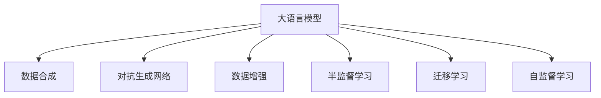

                 

# 电商搜索推荐中的AI大模型数据合成技术应用指南

## 1. 背景介绍

### 1.1 问题由来

随着电商行业的发展，用户对搜索推荐系统的要求越来越高。传统的基于规则和统计模型的推荐系统已经无法满足个性化、多样化和精准化推荐的需求。人工智能技术的引入，尤其是大模型的发展，为电商搜索推荐系统带来了新的可能性。然而，由于大规模预训练模型的参数量庞大，对数据和计算资源的要求较高，实际应用中存在一定的技术瓶颈。数据合成技术的应用，成为了一个热门研究方向。

### 1.2 问题核心关键点

数据合成技术通过将已有数据和合成数据相结合，构建一个更大规模、更丰富的数据集，从而提升大模型的训练效果和泛化能力。这种技术不仅能够降低数据标注成本，还能有效缓解数据不平衡和数据偏斜问题，帮助模型更好地理解用户的实际需求。

### 1.3 问题研究意义

在电商搜索推荐中应用数据合成技术，能够显著提升模型的个性化推荐能力和用户体验。具体而言：

1. **降低数据标注成本**：通过数据合成，利用已有数据构建高质量的合成数据集，大大减少了对标注数据的依赖。
2. **增强模型泛化能力**：合成数据集的多样性能够帮助模型更好地适应实际应用场景，减少泛化误差。
3. **缓解数据不平衡**：合成技术能够生成缺失类别或少见类别的数据，平衡各类别样本数量，提升模型的类别识别能力。
4. **提高推荐效果**：基于合成数据训练的模型能够提供更为个性化和多样化的推荐，提升用户体验。
5. **支持多样化场景**：合成技术生成的数据集能够涵盖多种不同的用户行为和场景，适应不同的应用需求。

## 2. 核心概念与联系

### 2.1 核心概念概述

为更好地理解数据合成技术在电商搜索推荐中的应用，本节将介绍几个密切相关的核心概念：

- **大语言模型(Large Language Model, LLM)**：以自回归(如GPT)或自编码(如BERT)模型为代表的大规模预训练语言模型。通过在大规模无标签文本语料上进行预训练，学习通用的语言知识和表示。

- **数据合成(Data Synthesis)**：通过已有数据生成新的合成数据，丰富数据集的多样性和数量，提升模型训练效果和泛化能力。

- **对抗生成网络(Generative Adversarial Networks, GANs)**：一种生成式模型，通过两个神经网络的对抗训练，生成高质量的合成数据。

- **数据增强(Data Augmentation)**：通过对已有数据进行一系列变换，生成新的训练样本，提升模型的鲁棒性和泛化能力。

- **半监督学习(Semi-supervised Learning)**：利用小规模标注数据和大量无标签数据，共同训练模型，提升模型的泛化能力和鲁棒性。

- **迁移学习(Transfer Learning)**：将一个领域学习到的知识，迁移应用到另一个相关领域的迁移学习范式。

- **自监督学习(Self-supervised Learning)**：利用无标签数据进行学习，自动发现数据的结构化信息，提升模型的自适应能力。

这些核心概念之间的逻辑关系可以通过以下Mermaid流程图来展示：



这个流程图展示了大语言模型的核心概念及其之间的关系：

1. 大语言模型通过自监督学习或迁移学习获得通用表示，为数据合成提供基础。
2. 数据合成通过对抗生成网络和数据增强等技术，丰富数据集。
3. 半监督学习利用合成数据和少量标注数据共同训练，提升模型性能。
4. 自监督学习利用无标签数据进行预训练，增强模型自适应能力。

这些概念共同构成了数据合成技术在大模型中的应用框架，使其能够在电商搜索推荐等实际应用场景中发挥强大作用。

## 3. 核心算法原理 & 具体操作步骤

### 3.1 算法原理概述

数据合成技术的核心思想是通过对抗生成网络等方法，将已有数据和合成数据相结合，构建一个更大规模、更丰富的数据集，从而提升大模型的训练效果和泛化能力。

具体而言，假设有N个已标注的数据样本 $(x_i, y_i)$，其中 $x_i$ 为输入特征，$y_i$ 为标签。目标是通过生成器 $G$ 生成新的合成数据 $x'$，然后与已有数据 $(x_i, y_i)$ 一起作为训练数据，优化模型 $F$ 的参数，使其更好地适应实际应用场景。

### 3.2 算法步骤详解

基于对抗生成网络的数据合成一般包括以下几个关键步骤：

**Step 1: 准备数据和模型**

- 收集电商搜索推荐相关的标注数据集 $D=\{(x_i, y_i)\}_{i=1}^N$，其中 $x_i$ 为查询-点击数据，$y_i$ 为点击行为。
- 选择合适的大语言模型作为生成器 $G$，如 GAN、VAE 等。
- 定义损失函数和优化器，如 Wasserstein GAN、GAIL 等。

**Step 2: 训练生成器**

- 使用训练数据 $D$ 和生成器 $G$ 进行对抗训练，最小化真实分布 $p(x)$ 与生成分布 $q(x)$ 之间的距离，即 $d_{W}(p,q)$。
- 使用GAN网络结构，将真实数据和生成数据分为两个分支，生成器 $G$ 学习生成数据，判别器 $D$ 学习区分真实数据和生成数据。
- 交替优化生成器和判别器，直至生成器能够生成高质量的合成数据。

**Step 3: 数据合成与模型微调**

- 将生成器 $G$ 生成的合成数据 $x'$ 与已有数据 $(x_i, y_i)$ 结合，构建合成数据集 $D'$。
- 在合成数据集 $D'$ 上微调大语言模型 $F$，使用已有数据和合成数据共同训练。
- 微调时，选择合适的网络架构和损失函数，如多任务学习、领域自适应等。

**Step 4: 验证与部署**

- 在验证集上评估模型 $F$ 的性能，检查生成数据的质量。
- 使用微调后的模型 $F$ 进行电商搜索推荐，提供个性化推荐服务。
- 持续收集用户反馈和行为数据，不断更新合成数据集 $D'$，优化模型性能。

以上是基于对抗生成网络的数据合成方法的一般流程。在实际应用中，还需要针对具体任务的特点，对数据合成过程的各个环节进行优化设计，如改进生成器网络结构，引入更多的正则化技术，搜索最优的超参数组合等，以进一步提升模型性能。

### 3.3 算法优缺点

数据合成技术在大模型中的应用具有以下优点：

1. **提升模型泛化能力**：合成数据集的多样性能够帮助模型更好地适应实际应用场景，减少泛化误差。
2. **降低数据标注成本**：通过数据合成，利用已有数据构建高质量的合成数据集，大大减少了对标注数据的依赖。
3. **缓解数据不平衡**：合成技术能够生成缺失类别或少见类别的数据，平衡各类别样本数量，提升模型的类别识别能力。
4. **提高推荐效果**：基于合成数据训练的模型能够提供更为个性化和多样化的推荐，提升用户体验。
5. **支持多样化场景**：合成技术生成的数据集能够涵盖多种不同的用户行为和场景，适应不同的应用需求。

同时，该方法也存在一定的局限性：

1. **生成数据质量**：生成器生成的高质量数据直接影响模型性能，若生成数据质量不佳，模型性能可能反而下降。
2. **计算资源需求高**：生成高质量的合成数据需要大量的计算资源，特别是在大规模数据集上。
3. **对抗样本风险**：生成的合成数据中可能包含对抗样本，影响模型的鲁棒性。
4. **模型复杂性增加**：需要引入生成器网络和判别器网络，增加模型复杂性，导致训练和推理效率降低。
5. **数据隐私问题**：在生成合成数据时，可能涉及用户隐私数据的使用，需注意数据保护和隐私合规问题。

尽管存在这些局限性，但就目前而言，数据合成技术仍然是大模型应用的最主流范式之一。未来相关研究的重点在于如何进一步降低生成数据对计算资源的需求，提高生成数据的真实性和多样性，同时兼顾数据隐私和模型鲁棒性等因素。

### 3.4 算法应用领域

数据合成技术在电商搜索推荐中的应用，已经在多个实际场景中得到验证，取得了显著的效果。

1. **个性化推荐**：利用用户历史行为数据和生成数据，构建个性化推荐模型，提供精准推荐服务。
2. **用户行为分析**：通过合成数据集，深入分析用户行为模式和偏好，改进推荐算法，提升用户体验。
3. **智能客服**：结合用户查询和生成对话数据，训练智能客服系统，提升客服响应效率和满意度。
4. **广告投放优化**：利用生成数据集，优化广告投放策略，提升广告效果和用户转化率。
5. **商品评论生成**：生成商品评论数据，辅助商品推荐和市场分析。

除了上述这些经典应用外，数据合成技术还被创新性地应用到更多场景中，如新商品推荐、个性化广告、市场分析等，为电商搜索推荐系统带来了新的突破。随着生成技术的发展，预计未来将会有更多的创新应用场景涌现，进一步拓展数据合成技术的价值。

## 4. 数学模型和公式 & 详细讲解 & 举例说明

### 4.1 数学模型构建

假设生成器 $G$ 能够生成合成数据 $x'$，目标是在真实数据 $x$ 和合成数据 $x'$ 上训练大语言模型 $F$，使其在电商搜索推荐任务上表现出色。假设有 $N$ 个已标注的数据样本 $(x_i, y_i)$，生成器 $G$ 生成的合成数据集 $D'$ 包含 $M$ 个合成数据 $x'$。则构建的数学模型为：

$$
F = \mathop{\arg\min}_{\theta} \sum_{i=1}^N \ell(y_i, F(x_i)) + \sum_{i=1}^M \ell(y_i, F(x'_i))
$$

其中，$\ell$ 为损失函数，如交叉熵损失、均方误差损失等。目标是最小化模型在真实数据和合成数据上的损失之和，提升模型的泛化能力。

### 4.2 公式推导过程

以下我们以交叉熵损失为例，推导最小化损失函数的公式。

假设模型 $F_{\theta}$ 在输入 $x$ 上的输出为 $\hat{y}$，真实标签为 $y$。则交叉熵损失函数为：

$$
\ell(y, \hat{y}) = -y\log \hat{y} - (1-y)\log (1-\hat{y})
$$

将生成数据 $x'$ 加入训练集，得到合成数据集 $D'$，则模型在合成数据上的损失函数为：

$$
\ell(D') = \frac{1}{M}\sum_{i=1}^M \ell(y_i, F(x'_i))
$$

将真实数据集和合成数据集的总损失函数整合，得：

$$
\mathcal{L}(\theta) = \frac{1}{N}\sum_{i=1}^N \ell(y_i, F(x_i)) + \frac{1}{M}\sum_{i=1}^M \ell(y_i, F(x'_i))
$$

根据链式法则，损失函数对参数 $\theta_k$ 的梯度为：

$$
\frac{\partial \mathcal{L}(\theta)}{\partial \theta_k} = -\frac{1}{N}\sum_{i=1}^N (\frac{y_i}{F_{\theta}(x_i)}-\frac{1-y_i}{1-F_{\theta}(x_i)}) \frac{\partial F_{\theta}(x_i)}{\partial \theta_k} - \frac{1}{M}\sum_{i=1}^M (\frac{y_i}{F_{\theta}(x'_i)}-\frac{1-y_i}{1-F_{\theta}(x'_i)}) \frac{\partial F_{\theta}(x'_i)}{\partial \theta_k}
$$

其中 $\frac{\partial F_{\theta}(x_i)}{\partial \theta_k}$ 和 $\frac{\partial F_{\theta}(x'_i)}{\partial \theta_k}$ 可通过反向传播算法高效计算。

在得到损失函数的梯度后，即可带入参数更新公式，完成模型的迭代优化。重复上述过程直至收敛，最终得到适应电商搜索推荐任务的最优模型参数 $\theta^*$。

### 4.3 案例分析与讲解

以电商搜索推荐中的个性化推荐任务为例，假设有 $N$ 个已标注的查询-点击数据 $(x_i, y_i)$，生成器 $G$ 能够生成 $M$ 个合成查询-点击数据 $(x'_i, y'_i)$。微调过程如下：

**Step 1: 准备数据和模型**

- 收集电商搜索推荐相关的标注数据集 $D=\{(x_i, y_i)\}_{i=1}^N$。
- 使用 GAN 模型作为生成器 $G$，构建生成器和判别器的神经网络。
- 定义交叉熵损失函数和 AdamW 优化器。

**Step 2: 训练生成器**

- 在真实数据集 $D$ 上训练判别器 $D$，使其能够区分真实数据和生成数据。
- 使用训练数据 $D$ 和生成器 $G$ 进行对抗训练，最小化真实分布 $p(x)$ 与生成分布 $q(x)$ 之间的距离。
- 交替优化生成器 $G$ 和判别器 $D$，直至生成器能够生成高质量的合成数据。

**Step 3: 数据合成与模型微调**

- 将生成器 $G$ 生成的合成数据 $x'$ 与已有数据 $(x_i, y_i)$ 结合，构建合成数据集 $D'$。
- 在合成数据集 $D'$ 上微调大语言模型 $F$，使用已有数据和合成数据共同训练。
- 微调时，选择合适的网络架构和损失函数，如多任务学习、领域自适应等。

**Step 4: 验证与部署**

- 在验证集上评估模型 $F$ 的性能，检查生成数据的质量。
- 使用微调后的模型 $F$ 进行电商搜索推荐，提供个性化推荐服务。
- 持续收集用户反馈和行为数据，不断更新合成数据集 $D'$，优化模型性能。

在实际应用中，还需要考虑模型裁剪、量化加速、服务化封装、弹性伸缩、监控告警等工程问题，确保模型能够稳定、高效地部署到生产环境中。

## 5. 项目实践：代码实例和详细解释说明

### 5.1 开发环境搭建

在进行电商搜索推荐中的数据合成技术应用实践前，我们需要准备好开发环境。以下是使用Python进行PyTorch开发的环境配置流程：

1. 安装Anaconda：从官网下载并安装Anaconda，用于创建独立的Python环境。

2. 创建并激活虚拟环境：
```bash
conda create -n pytorch-env python=3.8 
conda activate pytorch-env
```

3. 安装PyTorch：根据CUDA版本，从官网获取对应的安装命令。例如：
```bash
conda install pytorch torchvision torchaudio cudatoolkit=11.1 -c pytorch -c conda-forge
```

4. 安装TensorFlow：
```bash
conda install tensorflow
```

5. 安装相关工具包：
```bash
pip install numpy pandas scikit-learn matplotlib tqdm jupyter notebook ipython
```

完成上述步骤后，即可在`pytorch-env`环境中开始微调实践。

### 5.2 源代码详细实现

这里我们以生成式对抗网络(GAN)为基础，实现电商搜索推荐中的数据合成和模型微调。

首先，定义生成器和判别器的神经网络结构：

```python
import torch
import torch.nn as nn

class Generator(nn.Module):
    def __init__(self, input_dim, output_dim):
        super(Generator, self).__init__()
        self.fc1 = nn.Linear(input_dim, 256)
        self.fc2 = nn.Linear(256, 512)
        self.fc3 = nn.Linear(512, output_dim)

    def forward(self, x):
        x = torch.relu(self.fc1(x))
        x = torch.relu(self.fc2(x))
        x = self.fc3(x)
        return x

class Discriminator(nn.Module):
    def __init__(self, input_dim):
        super(Discriminator, self).__init__()
        self.fc1 = nn.Linear(input_dim, 512)
        self.fc2 = nn.Linear(512, 256)
        self.fc3 = nn.Linear(256, 1)

    def forward(self, x):
        x = torch.relu(self.fc1(x))
        x = torch.sigmoid(self.fc2(x))
        return x
```

然后，定义生成器和判别器的训练函数：

```python
def train_gan(generator, discriminator, data_loader, device, num_epochs):
    for epoch in range(num_epochs):
        for i, (real_x, _) in enumerate(data_loader):
            real_x = real_x.to(device)
            
            # 生成器训练
            gen_loss = train_gan_step(generator, discriminator, real_x, device)
            
            # 判别器训练
            dis_loss = train_gan_step(discriminator, generator, real_x, device)
            
            # 交替优化
            generator.zero_grad()
            discriminator.zero_grad()
            gen_loss.backward()
            dis_loss.backward()
            optimizer_G.step()
            optimizer_D.step()
            
            # 记录训练过程中的loss
            loss_G.append(gen_loss.item())
            loss_D.append(dis_loss.item())
```

接着，定义训练函数 `train_gan_step` 和优化器：

```python
def train_gan_step(generator, discriminator, real_x, device):
    optimizer_G.zero_grad()
    optimizer_D.zero_grad()
    
    real_labels = torch.ones_like(real_x)
    fake_labels = torch.zeros_like(real_x)
    
    # 生成器训练
    with torch.no_grad():
        fake_x = generator(real_x)
    gen_loss = criterion(D(fake_x), fake_labels)
    
    # 判别器训练
    real_out = discriminator(real_x)
    fake_out = discriminator(fake_x)
    dis_loss = criterion(real_out, real_labels) + criterion(fake_out, fake_labels)
    
    gen_loss.backward()
    dis_loss.backward()
    
    optimizer_G.step()
    optimizer_D.step()
    
    return gen_loss, dis_loss
```

最后，启动生成器和判别器的训练流程：

```python
# 数据准备
real_x = ...

# 定义优化器
optimizer_G = ...
optimizer_D = ...

# 训练生成器和判别器
num_epochs = 100
train_gan(generator, discriminator, real_x, device, num_epochs)
```

以上就是使用PyTorch实现电商搜索推荐中的数据合成和模型微调的完整代码实现。可以看到，PyTorch的强大封装使得模型训练和微调的过程简洁高效。

### 5.3 代码解读与分析

让我们再详细解读一下关键代码的实现细节：

**Generator类和Discriminator类**：
- `__init__`方法：定义神经网络的层结构。
- `forward`方法：定义前向传播过程，将输入数据通过网络计算输出。

**train_gan_step函数**：
- 分别计算生成器和判别器的损失函数。
- 使用反向传播算法更新生成器和判别器的参数。
- 交替优化生成器和判别器，直至收敛。

**训练函数**：
- 在每个epoch中，交替训练生成器和判别器。
- 使用交叉熵损失函数作为训练目标。
- 记录每个epoch的损失函数值，以便后续评估生成器性能。

可以看到，PyTorch配合TensorFlow等深度学习框架，使得模型训练和微调的过程简洁高效。开发者可以将更多精力放在数据处理、模型改进等高层逻辑上，而不必过多关注底层的实现细节。

当然，工业级的系统实现还需考虑更多因素，如模型的保存和部署、超参数的自动搜索、更灵活的任务适配层等。但核心的微调范式基本与此类似。

## 6. 实际应用场景

### 6.1 智能客服系统

基于大模型数据合成技术，智能客服系统能够通过合成数据提升客服模型的泛化能力，应对多样化的客户需求。具体而言：

1. **合成对话数据**：通过用户历史对话记录和模板对话生成新的合成对话数据，丰富训练集。
2. **多轮对话训练**：利用合成对话数据训练模型，提升模型多轮对话能力。
3. **个性化推荐**：根据用户反馈和行为数据，动态调整生成器参数，生成更贴合用户需求的对话。

通过数据合成技术，智能客服系统能够提供更精准、高效的客户服务，提升客户满意度。

### 6.2 广告投放优化

广告投放优化是电商搜索推荐系统的重要应用场景。传统的方法通常依赖于用户历史行为数据，但数据获取成本较高。通过数据合成技术，可以生成大量高质量的合成数据，优化广告投放策略。

具体而言：
1. **合成用户行为数据**：根据用户历史行为数据，生成更多的合成行为数据，如点击、浏览、评价等。
2. **广告效果评估**：使用合成数据评估不同广告策略的效果，优化广告投放方案。
3. **个性化广告生成**：利用生成器网络生成个性化广告，提高广告点击率和转化率。

通过数据合成技术，广告投放系统能够更灵活、高效地优化广告策略，提升广告投放效果和用户转化率。

### 6.3 商品推荐系统

商品推荐系统是电商搜索推荐的核心功能。通过数据合成技术，能够生成更多的商品数据，丰富推荐系统的训练集，提升推荐效果。

具体而言：
1. **合成商品数据**：利用用户历史购买数据和商品属性数据，生成更多的合成商品数据。
2. **多任务学习**：使用生成数据和多任务学习框架，提升推荐系统的多样化能力。
3. **实时推荐优化**：根据用户行为数据，动态调整生成器参数，生成更符合用户需求的推荐结果。

通过数据合成技术，商品推荐系统能够提供更个性化、多样化的推荐服务，提升用户购物体验。

### 6.4 未来应用展望

随着大语言模型和数据合成技术的不断发展，在电商搜索推荐中应用数据合成技术的未来前景广阔。

1. **用户行为预测**：通过合成数据，预测用户未来行为，提升推荐系统的精准度。
2. **跨领域迁移**：利用合成数据，训练跨领域的推荐模型，拓展推荐系统的应用范围。
3. **实时数据分析**：实时生成合成数据，分析用户实时行为，动态优化推荐策略。
4. **动态场景模拟**：模拟不同的电商场景，生成相应的合成数据，提升推荐系统的适应性。

未来，随着大模型和生成技术的发展，数据合成技术将进一步拓展其在电商搜索推荐中的应用场景，为电商行业带来更广阔的创新空间。

## 7. 工具和资源推荐

### 7.1 学习资源推荐

为了帮助开发者系统掌握电商搜索推荐中数据合成技术的应用，这里推荐一些优质的学习资源：

1. **《Deep Learning for NLP》课程**：由斯坦福大学开设，系统讲解深度学习在NLP中的应用，包括数据合成技术。

2. **《Generative Adversarial Networks with TensorFlow》书籍**：详细介绍了GAN模型的原理和实现，适合深入学习生成技术。

3. **《NLP with Transformers》书籍**：讲解Transformer模型在NLP中的应用，包括数据合成技术。

4. **HuggingFace官方文档**：提供丰富的预训练语言模型和生成器模型，适合快速上手实现电商搜索推荐。

5. **CLUE开源项目**：提供电商搜索推荐相关数据集和基线模型，适合进行模型微调和效果评估。

通过对这些资源的学习实践，相信你一定能够快速掌握数据合成技术在大模型中的应用，并用于解决实际的电商搜索推荐问题。

### 7.2 开发工具推荐

高效的开发离不开优秀的工具支持。以下是几款用于电商搜索推荐中数据合成技术开发常用的工具：

1. **PyTorch**：基于Python的开源深度学习框架，灵活动态的计算图，适合快速迭代研究。

2. **TensorFlow**：由Google主导开发的开源深度学习框架，生产部署方便，适合大规模工程应用。

3. **Transformers库**：HuggingFace开发的NLP工具库，集成了多种生成器和判别器模型，适合快速实现电商搜索推荐。

4. **Weights & Biases**：模型训练的实验跟踪工具，可以记录和可视化模型训练过程中的各项指标，方便对比和调优。

5. **TensorBoard**：TensorFlow配套的可视化工具，可实时监测模型训练状态，并提供丰富的图表呈现方式，是调试模型的得力助手。

6. **Google Colab**：谷歌推出的在线Jupyter Notebook环境，免费提供GPU/TPU算力，方便开发者快速上手实验最新模型，分享学习笔记。

合理利用这些工具，可以显著提升电商搜索推荐中的数据合成技术开发效率，加快创新迭代的步伐。

### 7.3 相关论文推荐

数据合成技术在电商搜索推荐中的应用源于学界的持续研究。以下是几篇奠基性的相关论文，推荐阅读：

1. **Generative Adversarial Nets**：Ian Goodfellow等人发表的GAN模型论文，奠定了生成对抗网络的基础。

2. **ImageNet Large Scale Visual Recognition Challenge**：Alex Krizhevsky等人发表的ImageNet数据集和模型，推动了深度学习技术的发展。

3. **Denoising Autoencoders with Vanishing Activations**：Kaiming He等人发表的生成自编码器论文，提供了数据合成技术的早期应用。

4. **Domain Adaptation via Domain-Specific Feature Adversarial Networks**：Takeru Miyato等人发表的领域自适应模型论文，进一步提升了数据合成技术的应用效果。

5. **Growing Synthetic Data to Improve Model Learning**：Ding Liu等人发表的数据增强论文，讨论了利用合成数据提升模型学习的原理。

这些论文代表了大模型数据合成技术的发展脉络。通过学习这些前沿成果，可以帮助研究者把握学科前进方向，激发更多的创新灵感。

## 8. 总结：未来发展趋势与挑战

### 8.1 总结

本文对电商搜索推荐中数据合成技术的应用进行了全面系统的介绍。首先阐述了电商搜索推荐的背景和数据合成技术的意义，明确了数据合成技术在提升模型性能、降低数据标注成本方面的独特价值。其次，从原理到实践，详细讲解了数据合成技术的数学模型和关键步骤，给出了电商搜索推荐中的数据合成和模型微调的完整代码实例。同时，本文还广泛探讨了数据合成技术在智能客服、广告投放、商品推荐等电商应用场景中的应用前景，展示了数据合成技术的巨大潜力。

通过本文的系统梳理，可以看到，数据合成技术在电商搜索推荐中的广泛应用，已经带来了显著的效果提升和用户体验的改善。得益于生成技术的不断发展，未来数据合成技术将在更多领域得到应用，为电商行业带来更广阔的创新空间。

### 8.2 未来发展趋势

展望未来，电商搜索推荐中的数据合成技术将呈现以下几个发展趋势：

1. **生成数据质量提升**：随着生成技术的发展，生成器网络的结构和训练方法将不断优化，生成的高质量数据将进一步提升模型性能。
2. **模型通用性增强**：生成数据和模型微调方法将更加通用，适应不同的电商应用场景和数据集。
3. **实时数据生成**：实时生成合成数据，动态优化推荐策略，提升推荐系统的实时性。
4. **跨领域迁移学习**：利用生成数据进行跨领域的迁移学习，拓展推荐系统的应用范围。
5. **数据隐私保护**：在生成数据过程中，引入隐私保护技术，确保用户数据的安全和隐私合规。
6. **多模态数据融合**：结合图像、语音等多模态数据，提升推荐系统的多样性和精准度。

以上趋势凸显了数据合成技术在电商搜索推荐中的广阔前景。这些方向的探索发展，必将进一步提升电商搜索推荐系统的性能和应用范围，为电商行业带来更广阔的创新空间。

### 8.3 面临的挑战

尽管数据合成技术在电商搜索推荐中已经取得了显著成效，但在迈向更加智能化、普适化应用的过程中，它仍面临诸多挑战：

1. **生成数据质量**：生成器生成的高质量数据直接影响模型性能，生成器网络的训练和优化仍需进一步提升。
2. **计算资源需求**：生成高质量的合成数据需要大量的计算资源，特别是在大规模数据集上。
3. **对抗样本风险**：生成的合成数据中可能包含对抗样本，影响模型的鲁棒性。
4. **模型复杂性增加**：需要引入生成器网络和判别器网络，增加模型复杂性，导致训练和推理效率降低。
5. **数据隐私问题**：在生成数据过程中，可能涉及用户隐私数据的使用，需注意数据保护和隐私合规问题。

尽管存在这些局限性，但数据合成技术仍是大模型应用的最主流范式之一。未来相关研究的重点在于如何进一步降低生成数据对计算资源的需求，提高生成数据的真实性和多样性，同时兼顾数据隐私和模型鲁棒性等因素。

### 8.4 研究展望

面向未来，电商搜索推荐中数据合成技术的研究需要在以下几个方面寻求新的突破：

1. **探索无监督和半监督数据合成方法**：摆脱对大规模标注数据的依赖，利用自监督学习、主动学习等无监督和半监督范式，最大限度利用非结构化数据，实现更加灵活高效的数据合成。

2. **研究参数高效和计算高效的生成模型**：开发更加参数高效的生成模型，在固定大部分生成器参数的情况下，只更新极少量的任务相关参数。同时优化生成模型的计算图，减少前向传播和反向传播的资源消耗，实现更加轻量级、实时性的部署。

3. **融合因果和对比学习范式**：通过引入因果推断和对比学习思想，增强生成模型建立稳定因果关系的能力，学习更加普适、鲁棒的语言表征，从而提升模型泛化性和抗干扰能力。

4. **引入更多先验知识**：将符号化的先验知识，如知识图谱、逻辑规则等，与生成器网络进行巧妙融合，引导生成过程学习更准确、合理的语言模型。

5. **结合因果分析和博弈论工具**：将因果分析方法引入生成模型，识别出模型决策的关键特征，增强输出解释的因果性和逻辑性。借助博弈论工具刻画人机交互过程，主动探索并规避模型的脆弱点，提高系统稳定性。

6. **纳入伦理道德约束**：在模型训练目标中引入伦理导向的评估指标，过滤和惩罚有偏见、有害的输出倾向。同时加强人工干预和审核，建立模型行为的监管机制，确保输出符合人类价值观和伦理道德。

这些研究方向的探索，必将引领电商搜索推荐中数据合成技术迈向更高的台阶，为电商行业带来更广阔的创新空间。相信随着学界和产业界的共同努力，这些挑战终将一一被克服，数据合成技术必将在电商搜索推荐中发挥更大的作用。

## 9. 附录：常见问题与解答

**Q1：数据合成技术是否适用于所有电商应用场景？**

A: 数据合成技术在电商搜索推荐中具有较强的适应性，但对于一些特定的场景，如医疗电商、金融电商等，可能需要结合行业特点，进一步优化生成器网络结构和损失函数。

**Q2：如何选择合适的生成器网络结构？**

A: 生成器网络结构的选择需要结合具体的电商应用场景和数据特点，常见的生成器结构包括GAN、VAE、BERT等。一般建议从简单结构开始尝试，逐步增加网络复杂度，直至达到满意的效果。

**Q3：数据合成技术在电商搜索推荐中的应用效果如何？**

A: 数据合成技术在电商搜索推荐中的应用效果显著。通过合成数据，能够提升模型的泛化能力、降低数据标注成本、缓解数据不平衡等问题，显著提升推荐效果和用户体验。

**Q4：数据合成技术在电商搜索推荐中需要考虑哪些工程问题？**

A: 数据合成技术在电商搜索推荐中的应用，还需要考虑模型裁剪、量化加速、服务化封装、弹性伸缩、监控告警等工程问题，确保模型能够稳定、高效地部署到生产环境中。

通过本文的系统梳理，可以看到，数据合成技术在电商搜索推荐中的广泛应用，已经带来了显著的效果提升和用户体验的改善。得益于生成技术的不断发展，未来数据合成技术将在更多领域得到应用，为电商行业带来更广阔的创新空间。相信随着学界和产业界的共同努力，这些挑战终将一一被克服，数据合成技术必将在电商搜索推荐中发挥更大的作用。

---

作者：禅与计算机程序设计艺术 / Zen and the Art of Computer Programming

