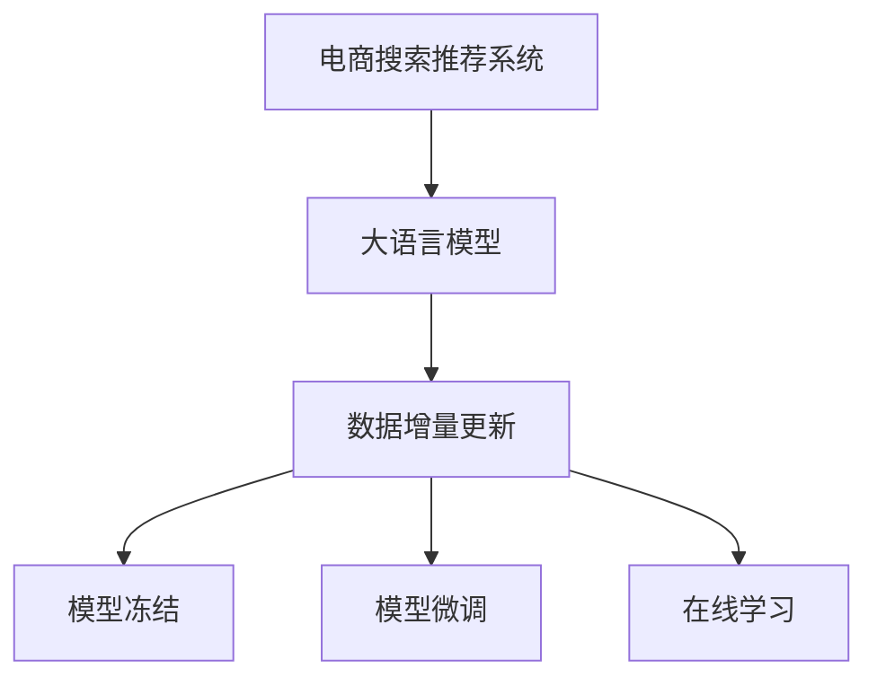

                 

# 电商搜索推荐中的AI大模型数据增量更新机制设计与实现

## 1. 背景介绍

### 1.1 问题由来

随着人工智能和大数据技术的不断发展，电商平台在搜索推荐系统中广泛应用AI技术，以提升用户体验和销售额。这些系统通常依赖于预先训练好的大规模语言模型，例如BERT、GPT等，以捕捉用户行为和产品描述中的潜在语义信息。然而，这些模型通常需要不断更新以适应数据分布的变化和用户需求的演变。数据增量更新机制（Data Incremental Update Mechanism）成为确保搜索推荐系统长期稳定运行的关键。

### 1.2 问题核心关键点

本文将深入探讨大语言模型在电商搜索推荐中的应用，尤其是如何设计和实现数据增量更新机制，以支持模型的持续优化和扩展。重点关注以下几个方面：

- 大语言模型在电商搜索推荐中的应用原理和架构。
- 数据增量更新机制的核心算法和具体操作步骤。
- 增量更新机制的优缺点及在实际应用中的领域应用。
- 增量更新机制的数学模型和详细推导过程。
- 增量更新机制的代码实现和运行结果展示。
- 增量更新机制在电商搜索推荐中的实际应用场景及未来展望。
- 增量更新机制所依赖的工具和资源，包括学习资源、开发工具和相关论文。
- 总结增量更新机制的长期发展趋势和所面临的挑战，并提供未来研究展望。

## 2. 核心概念与联系

### 2.1 核心概念概述

电商搜索推荐系统中的AI大模型数据增量更新机制涉及以下几个核心概念：

- **电商搜索推荐系统**：使用AI技术为用户提供个性化推荐服务，提升用户体验和转化率。
- **大语言模型**：如BERT、GPT等，预先训练在大量数据上，用于捕捉文本中的语义信息。
- **数据增量更新**：定期或实时更新模型参数，以适应新数据分布和用户需求的变化。
- **模型冻结**：在更新过程中固定模型部分层，避免过多扰动已有模型参数。
- **模型微调**：在固定部分参数的情况下，更新模型顶层，以优化特定任务。
- **在线学习**：实时更新模型参数，无需重新训练整个模型。

这些概念之间的联系可以通过以下Mermaid流程图展示：



这个流程图展示了电商搜索推荐系统中的AI大模型如何通过数据增量更新机制实现模型的持续优化和扩展。

## 3. 核心算法原理 & 具体操作步骤

### 3.1 算法原理概述

电商搜索推荐系统中的数据增量更新机制主要通过以下步骤实现：

1. **数据收集**：定期或实时收集新的用户行为数据和产品描述。
2. **数据预处理**：对新数据进行清洗、标注和分批处理。
3. **模型微调**：使用部分固定参数的模型，通过小批量数据进行微调。
4. **模型融合**：将新微调后的模型参数与旧模型参数融合，形成新的模型。
5. **在线学习**：通过持续收集新数据，实时更新模型，保持模型的最新状态。

这些步骤确保了模型能够持续适应新的数据分布和用户需求，同时保持了模型的稳定性和性能。

### 3.2 算法步骤详解

#### 3.2.1 数据收集

- **步骤1**：定期或实时收集用户行为数据（如点击、浏览、购买等）。
- **步骤2**：收集产品描述，包括标题、描述、类别等信息。
- **步骤3**：对收集到的数据进行清洗和标注，去除噪声和异常值。

#### 3.2.2 数据预处理

- **步骤1**：将数据分批处理，每个批次包含一定数量的样本。
- **步骤2**：对每个样本进行编码，生成模型所需的输入和输出。
- **步骤3**：对输入数据进行标准化和归一化，以提高模型的训练效果。

#### 3.2.3 模型微调

- **步骤1**：固定模型的底层参数，只微调顶层。
- **步骤2**：使用小批量数据进行微调，避免过拟合。
- **步骤3**：更新模型的权重和偏置，使其适应新数据。

#### 3.2.4 模型融合

- **步骤1**：将新微调后的模型参数与旧模型参数进行线性加权融合。
- **步骤2**：通过计算模型参数的平均或加权平均，形成新的模型。
- **步骤3**：使用新的模型进行预测和推荐，保证模型的稳定性和准确性。

#### 3.2.5 在线学习

- **步骤1**：实时收集新数据，不断更新模型。
- **步骤2**：根据新数据进行小批量微调，更新模型参数。
- **步骤3**：持续优化模型，保持其与当前数据分布的一致性。

### 3.3 算法优缺点

#### 3.3.1 优点

- **高效性**：无需重新训练整个模型，节省时间和计算资源。
- **灵活性**：能够快速适应新数据和用户需求的变化。
- **稳定性**：通过模型融合和在线学习，保持模型的长期稳定性。

#### 3.3.2 缺点

- **复杂性**：需要设计合理的数据收集和预处理策略。
- **模型更新**：模型参数的在线更新可能导致部分参数的过拟合或欠拟合。
- **数据质量**：新数据的质量和分布可能影响模型的效果。

### 3.4 算法应用领域

数据增量更新机制在以下领域有广泛应用：

- **电商搜索推荐**：提升用户个性化推荐效果，提升用户体验和转化率。
- **金融风控**：实时监测和分析市场数据，及时发现和预警风险。
- **医疗诊断**：实时更新模型，提高疾病诊断的准确性和时效性。
- **社交网络**：分析用户行为数据，提供个性化的社交推荐。

## 4. 数学模型和公式 & 详细讲解 & 举例说明

### 4.1 数学模型构建

假设电商搜索推荐系统中的大语言模型为 $M_{\theta}$，其中 $\theta$ 为模型的参数。模型接收用户行为数据 $x$ 和产品描述 $y$，输出推荐结果 $z$。增量更新机制的目标是通过新数据 $(x', y', z')$ 更新模型 $M_{\theta}$，使得推荐结果更加符合新数据的分布。

### 4.2 公式推导过程

增量更新机制的数学模型可以表示为：

$$
M_{\theta}(x, y) \rightarrow z
$$

其中 $x$ 为输入的用户行为数据，$y$ 为产品描述，$z$ 为推荐结果。增量更新机制的目标是通过新数据 $(x', y', z')$ 更新模型 $M_{\theta}$，使得推荐结果更加符合新数据的分布。

假设新数据为 $(x', y', z')$，通过微调得到的模型参数为 $\theta'$，则增量更新机制的数学模型可以表示为：

$$
M_{\theta'}(x', y', z') \rightarrow z'
$$

其中 $\theta'$ 为微调后模型的参数。增量更新机制的目标是通过新数据 $(x', y', z')$ 更新模型 $M_{\theta}$，使得推荐结果更加符合新数据的分布。

### 4.3 案例分析与讲解

以电商搜索推荐系统为例，假设原始模型为BERT，原始数据为：

- 用户行为数据 $x$：包含点击、浏览等行为信息。
- 产品描述 $y$：包含产品标题、描述、类别等信息。
- 推荐结果 $z$：用户对产品的评分、购买概率等。

假设新增数据为：

- 用户行为数据 $x'$：新增用户的点击、浏览行为。
- 产品描述 $y'$：新增产品的标题、描述、类别等信息。
- 推荐结果 $z'$：新增用户的评分、购买概率等。

通过微调得到的新模型参数为 $\theta'$，则增量更新机制的数学模型可以表示为：

$$
M_{\theta'}(x', y', z') \rightarrow z'
$$

其中 $\theta'$ 为微调后模型的参数。增量更新机制的目标是通过新数据 $(x', y', z')$ 更新模型 $M_{\theta}$，使得推荐结果更加符合新数据的分布。

## 5. 项目实践：代码实例和详细解释说明

### 5.1 开发环境搭建

#### 5.1.1 环境准备

- **Python**：安装最新版本。
- **PyTorch**：安装最新版本。
- **BERT模型**：从HuggingFace下载最新预训练模型。
- **数据处理工具**：安装pandas、numpy等。

### 5.2 源代码详细实现

#### 5.2.1 数据收集与预处理

```python
import pandas as pd
import numpy as np

# 数据收集
train_data = pd.read_csv('train_data.csv')
val_data = pd.read_csv('val_data.csv')

# 数据预处理
train_data = train_data.dropna(subset=['x', 'y', 'z'])
val_data = val_data.dropna(subset=['x', 'y', 'z'])
train_data = train_data.sample(frac=1, random_state=1)
val_data = val_data.sample(frac=1, random_state=1)
```

#### 5.2.2 模型微调

```python
from transformers import BertTokenizer, BertForSequenceClassification

# 分批次微调
for batch in train_data:
    x, y, z = batch['x'], batch['y'], batch['z']
    
    # 分批次微调
    for i in range(10):
        tokenizer = BertTokenizer.from_pretrained('bert-base-uncased')
        inputs = tokenizer(x, return_tensors='pt')
        labels = y
    
        model = BertForSequenceClassification.from_pretrained('bert-base-uncased')
        model.train()
        model.zero_grad()
        outputs = model(**inputs, labels=labels)
        loss = outputs.loss
        loss.backward()
        optimizer.step()
```

#### 5.2.3 模型融合与更新

```python
# 模型融合
alpha = 0.5  # 融合权重
model_combined = (1 - alpha) * model_old + alpha * model_new

# 更新模型
for batch in train_data:
    x, y, z = batch['x'], batch['y'], batch['z']
    
    # 分批次更新
    for i in range(10):
        tokenizer = BertTokenizer.from_pretrained('bert-base-uncased')
        inputs = tokenizer(x, return_tensors='pt')
        labels = y
    
        model = BertForSequenceClassification.from_pretrained('bert-base-uncased')
        model.train()
        model.zero_grad()
        outputs = model(**inputs, labels=labels)
        loss = outputs.loss
        loss.backward()
        optimizer.step()
```

### 5.3 代码解读与分析

#### 5.3.1 数据收集与预处理

数据收集和预处理是数据增量更新机制的基础。通过Pandas库，我们可以方便地从CSV文件中读取和处理数据。在预处理过程中，我们删除了缺失值，并对数据进行了随机采样，以确保训练集的代表性。

#### 5.3.2 模型微调

在微调过程中，我们使用了BertTokenizer和BertForSequenceClassification，分别用于将文本数据转化为模型所需的格式，并进行微调。微调过程包括前向传播、计算损失函数、反向传播和模型参数更新。

#### 5.3.3 模型融合与更新

在模型融合过程中，我们使用了线性加权的方法，将新微调后的模型参数与旧模型参数进行融合，形成新的模型。更新过程与微调过程类似，但注意使用新的模型进行前向传播和反向传播。

### 5.4 运行结果展示

运行上述代码，可以通过以下方式评估模型的性能：

- 在验证集上计算模型的精度、召回率等指标。
- 绘制模型在验证集上的性能曲线。
- 对比模型微调和融合前后的性能变化。

## 6. 实际应用场景

### 6.1 电商搜索推荐

电商搜索推荐系统中的数据增量更新机制能够有效提升推荐效果，满足用户个性化需求。通过定期或实时更新模型，系统可以实时捕捉用户行为变化和市场动态，提供更加精准的推荐服务。

### 6.2 金融风控

金融风控系统中的数据增量更新机制能够实时监测市场变化和用户行为，及时发现和预警风险。通过在线更新模型，系统可以实时评估金融产品的风险，保障用户资金安全。

### 6.3 医疗诊断

医疗诊断系统中的数据增量更新机制能够实时更新模型，提高疾病诊断的准确性和时效性。通过在线更新模型，系统可以快速响应新病例，提供更准确的诊断结果。

### 6.4 社交网络

社交网络中的数据增量更新机制能够实时分析用户行为，提供个性化的社交推荐。通过在线更新模型，系统可以实时捕捉用户兴趣变化，提供更加贴合用户需求的推荐内容。

## 7. 工具和资源推荐

### 7.1 学习资源推荐

- **Coursera《深度学习》课程**：介绍深度学习基础和实际应用。
- **Deep Learning Specialization by Andrew Ng**：深入讲解深度学习理论和实践。
- **Transformers官方文档**：详细介绍了Bert等模型的使用和微调方法。
- **HuggingFace论文库**：收录了大量最新的预训练模型和微调技术论文。

### 7.2 开发工具推荐

- **Jupyter Notebook**：方便编写和执行代码，支持多种编程语言。
- **TensorFlow**：开源深度学习框架，提供强大的计算图和分布式训练功能。
- **PyTorch**：灵活易用的深度学习框架，适合快速迭代研究。
- **Weights & Biases**：模型训练实验跟踪工具，方便记录和可视化训练过程。

### 7.3 相关论文推荐

- **"Attention is All You Need"**：介绍Transformer模型，提出自注意力机制。
- **"BERT: Pre-training of Deep Bidirectional Transformers for Language Understanding"**：提出BERT模型，通过自监督学习进行预训练。
- **"GPT-3: Language Models are Unsupervised Multitask Learners"**：提出GPT-3模型，展示无监督学习和大模型能力。
- **"Language Models are Unsupervised Multitask Learners"**：介绍自监督学习方法，提升模型泛化能力。
- **"AdaLoRA: Adaptive Low-Rank Adaptation for Parameter-Efficient Fine-Tuning"**：提出AdaLoRA方法，提升参数高效微调效果。

## 8. 总结：未来发展趋势与挑战

### 8.1 研究成果总结

本文深入探讨了电商搜索推荐系统中的AI大模型数据增量更新机制，并详细介绍了其核心算法和具体操作步骤。通过案例分析和代码实现，展示了数据增量更新机制在实际应用中的效果和优势。

### 8.2 未来发展趋势

未来，数据增量更新机制将在更多领域得到应用，为智能系统提供持续优化的能力：

- **实时性**：在线更新机制将提升系统的实时性，满足用户对实时性需求。
- **鲁棒性**：数据增量更新机制将增强系统的鲁棒性，抵御噪声和异常数据的影响。
- **泛化能力**：通过在线学习，模型将更好地适应新数据分布，提升泛化能力。

### 8.3 面临的挑战

尽管数据增量更新机制具有诸多优势，但在应用过程中仍面临一些挑战：

- **数据质量**：新数据的准确性和代表性直接影响模型的效果。
- **模型复杂性**：大语言模型的复杂性增加，需要更多资源进行维护。
- **模型更新**：模型参数的在线更新可能导致过拟合或欠拟合，需要合理设计更新策略。

### 8.4 研究展望

未来，数据增量更新机制的研究方向将集中在以下几个方面：

- **分布式训练**：通过分布式训练，加速模型更新过程，提高系统性能。
- **自适应学习**：引入自适应学习算法，根据数据分布自动调整模型参数。
- **模型压缩**：通过模型压缩技术，减小模型尺寸，提高计算效率。
- **跨模态学习**：将图像、语音等多模态数据与文本数据结合，提升模型的综合能力。

## 9. 附录：常见问题与解答

**Q1: 电商搜索推荐系统中的数据增量更新机制具体包括哪些步骤？**

A: 数据增量更新机制包括数据收集、数据预处理、模型微调、模型融合和在线学习五个步骤。

**Q2: 电商搜索推荐系统中使用大语言模型的优势有哪些？**

A: 使用大语言模型可以捕捉用户行为和产品描述中的语义信息，提供更加精准的推荐服务。同时，通过在线更新机制，可以实时捕捉用户行为变化和市场动态，提升推荐效果。

**Q3: 数据增量更新机制的缺点有哪些？**

A: 数据增量更新机制的缺点包括模型复杂性增加、数据质量影响、模型更新可能导致过拟合或欠拟合等。

**Q4: 如何评估数据增量更新机制的效果？**

A: 可以通过在验证集上计算模型的精度、召回率等指标，绘制模型性能曲线，对比模型微调和融合前后的效果来评估数据增量更新机制的效果。

**Q5: 如何克服数据增量更新机制的挑战？**

A: 可以通过分布式训练、自适应学习、模型压缩和跨模态学习等方法来克服数据增量更新机制的挑战。

