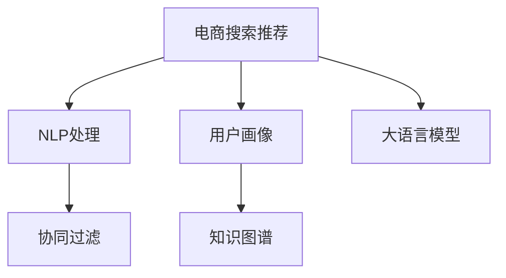

                 

# 电商搜索推荐中的AI大模型用户画像构建技术

> 关键词：AI大模型,电商搜索推荐,用户画像,自然语言处理(NLP),协同过滤,知识图谱

## 1. 背景介绍

### 1.1 问题由来

在电商搜索推荐系统中，构建准确的用户画像并实现个性化推荐，是提升用户体验、提高用户转化率的关键。传统的用户画像构建方法包括基于统计的特征工程、基于模型的协同过滤等，但存在数据稀疏、难以捕捉隐含关联等缺陷。近年来，随着大语言模型在NLP领域的突破，基于AI大模型的用户画像构建技术成为了新的热点。

大模型通过预训练大量无标签文本数据，学习了丰富的语言知识，具备了强大的语义理解能力和文本生成能力。在电商搜索推荐中，大模型可以通过分析用户输入的搜索词、评论、聊天记录等文本数据，构建高维度的用户画像，提升推荐系统的精准度和个性化程度。

### 1.2 问题核心关键点

AI大模型在电商搜索推荐中的应用，主要体现在以下几个方面：

- 自然语言处理(NLP)：利用大模型处理用户输入的自然语言，提取其语义特征。
- 用户画像构建：将用户文本数据编码为高维向量，构建用户画像。
- 推荐系统优化：通过个性化推荐算法，提升用户体验和转化率。
- 实时响应：在用户输入后快速生成个性化推荐结果，提升服务质量。
- 数据高效利用：有效利用用户文本数据，提升推荐效果。

通过这些技术的综合应用，AI大模型能够构建出精细化的用户画像，并实现高效的个性化推荐，从而显著提升电商搜索推荐的性能和用户体验。

### 1.3 问题研究意义

研究AI大模型在电商搜索推荐中的应用，对于提升电商平台的运营效率、增强用户体验、增加用户粘性具有重要意义：

1. 提高转化率：通过精准的用户画像，电商搜索推荐系统能够快速找到用户感兴趣的商品，提高购买转化率。
2. 增强用户体验：个性化推荐能够提供符合用户需求的商品，提升用户购物体验。
3. 减少重复推荐：通过高维度的用户画像，电商推荐系统能够减少重复推荐，提升推荐效果。
4. 降低人工成本：减少对人工运营的依赖，降低人力成本，提升运营效率。
5. 数据驱动决策：通过数据驱动的个性化推荐，电商企业能够更好地理解用户需求，优化产品设计和营销策略。

## 2. 核心概念与联系

### 2.1 核心概念概述

为更好地理解基于AI大模型的电商搜索推荐技术，本节将介绍几个密切相关的核心概念：

- 电商搜索推荐：指基于用户行为数据，为每位用户推荐最符合其需求的商品。通过构建用户画像和推荐模型，电商平台能够提高转化率和用户满意度。
- 自然语言处理(NLP)：指使用计算机处理、理解、生成自然语言的技术，通常涉及文本分析、语音识别、机器翻译等任务。
- 用户画像：指基于用户的历史行为数据，构建的多维度用户特征描述。用户画像在推荐系统中扮演重要角色，帮助推荐模型更好地理解用户需求。
- 协同过滤(Collaborative Filtering)：指通过分析用户行为数据，预测用户对商品或内容的偏好。协同过滤是推荐系统中最常用的技术之一。
- 知识图谱(Knowledge Graph)：指通过节点和边构成的图形结构，用于表示实体及其关系，在电商搜索推荐中可以用于商品关联关系的表示。
- 大语言模型(Large Language Model, LLM)：指通过自监督或监督学习方式预训练的大量参数模型，如BERT、GPT等。大模型能够理解自然语言，进行文本生成等任务。

这些核心概念之间的逻辑关系可以通过以下Mermaid流程图来展示：



这个流程图展示了大语言模型在电商搜索推荐系统中的作用机制：

1. 电商搜索推荐通过NLP处理用户输入的自然语言，提取其语义特征。
2. 用户画像将用户文本数据编码为高维向量，构建多维度用户特征描述。
3. 协同过滤通过分析用户行为数据，预测用户对商品或内容的偏好。
4. 知识图谱用于表示商品间的关联关系，增强推荐结果的关联性和完整性。
5. 大语言模型处理用户文本数据，构建高维度的用户画像，提升推荐系统的精准度和个性化程度。

这些概念共同构成了电商搜索推荐系统的基础架构，使得系统能够高效地实现个性化推荐。

## 3. 核心算法原理 & 具体操作步骤
### 3.1 算法原理概述

基于AI大模型的电商搜索推荐系统，主要包含以下几个关键步骤：

- 用户输入处理：对用户输入的自然语言进行NLP处理，提取关键词和语义信息。
- 用户画像构建：利用大模型处理用户文本数据，构建高维度的用户画像。
- 推荐模型训练：使用协同过滤或知识图谱等方法，训练个性化推荐模型。
- 推荐结果生成：根据用户画像和推荐模型，生成个性化推荐结果。
- 用户反馈收集：收集用户对推荐结果的反馈，持续优化推荐系统。

### 3.2 算法步骤详解

#### 步骤1：用户输入处理

电商搜索推荐系统的第一步是处理用户输入的自然语言。用户通过搜索词、评论、聊天记录等方式输入自然语言，描述其需求。系统需要对其进行NLP处理，提取关键词和语义信息，以构建用户画像。

具体而言，步骤如下：

1. 分词和词性标注：将用户输入的文本进行分词和词性标注，提取关键词和实体。
2. 依存句法分析：使用依存句法分析工具，理解句子中不同词语之间的依赖关系，提取语义信息。
3. 情感分析：使用情感分析工具，判断用户输入的情感倾向，辅助推荐模型的训练。

通过以上步骤，系统能够对用户输入的自然语言进行全面的理解，提取其核心需求。

#### 步骤2：用户画像构建

用户画像构建是电商搜索推荐系统的核心环节。通过大模型处理用户文本数据，将用户行为信息转换为高维度的向量表示。

具体而言，步骤如下：

1. 选择大模型：根据任务需求，选择合适的预训练大语言模型，如BERT、GPT等。
2. 数据预处理：对用户输入的自然语言进行预处理，如去除停用词、标准化格式等。
3. 编码用户文本：使用大模型将预处理后的文本转换为高维向量表示。
4. 编码用户画像：将用户画像的各个维度通过向量拼接，形成完整的用户画像向量。

通过以上步骤，系统能够构建出高维度的用户画像，用于后续的推荐模型训练和推荐结果生成。

#### 步骤3：推荐模型训练

推荐模型的训练是电商搜索推荐系统的关键环节。通过协同过滤或知识图谱等方法，训练个性化推荐模型，生成推荐结果。

具体而言，步骤如下：

1. 选择推荐算法：根据任务需求，选择合适的推荐算法，如协同过滤、知识图谱、混合推荐等。
2. 训练模型：使用协同过滤或知识图谱等方法，训练个性化推荐模型。
3. 评估模型：在测试集上评估推荐模型的性能，选择最优模型。
4. 优化模型：根据评估结果，对推荐模型进行优化调整。

通过以上步骤，系统能够训练出高精度的推荐模型，提升推荐结果的准确性和个性化程度。

#### 步骤4：推荐结果生成

推荐结果的生成是电商搜索推荐系统的最终环节。根据用户画像和推荐模型，生成个性化推荐结果。

具体而言，步骤如下：

1. 输入用户画像：将用户画像向量输入推荐模型。
2. 生成推荐结果：根据推荐模型输出，生成个性化推荐结果。
3. 展示推荐结果：将推荐结果展示给用户，供其选择。

通过以上步骤，系统能够快速生成个性化推荐结果，提升用户体验。

#### 步骤5：用户反馈收集

用户反馈的收集是电商搜索推荐系统的重要环节。通过收集用户对推荐结果的反馈，持续优化推荐系统。

具体而言，步骤如下：

1. 收集反馈：收集用户对推荐结果的评分、点击、购买等反馈数据。
2. 分析反馈：对用户反馈进行统计分析，理解用户偏好和需求。
3. 优化推荐系统：根据用户反馈，优化推荐算法和推荐模型。
4. 持续迭代：持续收集用户反馈，优化推荐系统性能。

通过以上步骤，系统能够不断优化推荐算法和推荐模型，提升推荐结果的准确性和个性化程度。

### 3.3 算法优缺点

基于AI大模型的电商搜索推荐系统具有以下优点：

1. 处理自然语言能力强：大模型能够理解自然语言，提取关键词和语义信息，辅助构建用户画像。
2. 高维度的用户画像：大模型能够将用户文本数据编码为高维向量，构建多维度用户特征描述。
3. 个性化推荐精度高：推荐系统能够通过个性化推荐算法，生成符合用户需求的商品，提升推荐效果。
4. 实时响应能力强：大模型能够快速生成个性化推荐结果，提高服务质量。
5. 数据高效利用：大模型能够高效利用用户文本数据，提升推荐效果。

同时，该方法也存在一定的局限性：

1. 数据隐私问题：电商平台需要收集大量用户文本数据，存在数据隐私和安全风险。
2. 数据噪声问题：用户输入的自然语言可能存在噪声，影响用户画像的准确性。
3. 计算资源消耗大：大模型需要大量的计算资源进行训练和推理，对硬件要求较高。
4. 模型泛化能力有限：大模型在特定领域的应用效果，可能受到领域差异的影响。
5. 模型复杂度高：大模型结构复杂，难以解释其内部工作机制，影响模型的可解释性。

尽管存在这些局限性，但就目前而言，基于AI大模型的电商搜索推荐方法仍然是主流范式。未来相关研究的重点在于如何进一步降低数据隐私和安全风险，提高模型的鲁棒性和可解释性，同时兼顾用户体验和推荐效果。

### 3.4 算法应用领域

基于AI大模型的电商搜索推荐技术，在电商行业已经得到了广泛的应用，覆盖了几乎所有常见的电商业务场景，例如：

- 商品推荐：根据用户画像和行为数据，推荐最符合其需求的商品。
- 搜索排序：通过用户输入的自然语言，推荐最符合其搜索意图的结果。
- 个性化广告：根据用户画像，推荐最符合其兴趣的广告内容。
- 价格推荐：通过分析用户行为数据，推荐最优的商品价格。
- 购物车推荐：根据用户行为数据，推荐最符合其购物车商品需求的商品。

除了上述这些经典场景外，基于AI大模型的电商搜索推荐技术也被创新性地应用到更多场景中，如内容推荐、导购系统、智能客服等，为电商行业的智能化转型提供了新的技术路径。

## 4. 数学模型和公式 & 详细讲解  
### 4.1 数学模型构建

本节将使用数学语言对基于AI大模型的电商搜索推荐系统进行更加严格的刻画。

记用户输入的自然语言为 $X=\{x_1,x_2,\ldots,x_n\}$，其中 $x_i$ 为第 $i$ 个单词或短语，表示用户的输入文本。

假设用户画像的维度为 $d$，则用户画像表示为 $\theta \in \mathbb{R}^d$。假设推荐模型的输出为 $Y$，表示推荐结果。

定义推荐模型的损失函数为 $\mathcal{L}(\theta) = \frac{1}{N} \sum_{i=1}^N \ell(\theta, y_i)$，其中 $y_i$ 为第 $i$ 个推荐结果，$\ell$ 为损失函数，用于衡量推荐结果与用户实际需求之间的差异。

通过梯度下降等优化算法，推荐模型的训练目标是最小化损失函数，即找到最优参数 $\theta$：

$$
\theta^* = \mathop{\arg\min}_{\theta} \mathcal{L}(\theta)
$$

### 4.2 公式推导过程

以下我们以协同过滤推荐算法为例，推导推荐模型的损失函数及其梯度的计算公式。

假设推荐模型为 $Y=f(\theta)$，其中 $f$ 为推荐算法，$\theta$ 为模型参数。在训练集上，推荐模型的损失函数为：

$$
\mathcal{L}(\theta) = \frac{1}{N} \sum_{i=1}^N \ell(f(\theta), y_i)
$$

其中 $\ell$ 为损失函数，通常包括均方误差损失、交叉熵损失等。

假设推荐模型为线性回归模型，输出为 $Y=\theta^TX$，其中 $X$ 为输入文本 $X$ 的向量表示。则均方误差损失函数为：

$$
\ell(Y,y) = \frac{1}{2}||Y-y||^2
$$

将 $Y=\theta^TX$ 代入上式，得：

$$
\mathcal{L}(\theta) = \frac{1}{N} \sum_{i=1}^N \frac{1}{2}||\theta^TX_i-y_i||^2
$$

将上述式子展开，得：

$$
\mathcal{L}(\theta) = \frac{1}{N} \sum_{i=1}^N \sum_{j=1}^n \theta_j^2x_{ij}^2 + 2\theta_jx_{ij}y_{ij}-2y_i
$$

为了最小化损失函数，需要对参数 $\theta$ 进行优化。根据梯度下降算法，参数更新公式为：

$$
\theta \leftarrow \theta - \eta \nabla_{\theta}\mathcal{L}(\theta)
$$

其中 $\eta$ 为学习率，$\nabla_{\theta}\mathcal{L}(\theta)$ 为损失函数对参数 $\theta$ 的梯度。

将上述式子代入，得：

$$
\nabla_{\theta}\mathcal{L}(\theta) = -\eta\sum_{i=1}^N \sum_{j=1}^n x_{ij}^2\theta_j + \eta\sum_{i=1}^N x_{ij}y_{ij}
$$

根据链式法则，推荐模型的梯度计算公式为：

$$
\nabla_{\theta}\mathcal{L}(\theta) = -\eta\sum_{i=1}^N \sum_{j=1}^n x_{ij}^2\nabla_{\theta}f(\theta)
$$

其中 $\nabla_{\theta}f(\theta)$ 为推荐算法对模型参数 $\theta$ 的梯度。

在得到推荐模型的梯度后，即可带入参数更新公式，完成模型的迭代优化。重复上述过程直至收敛，最终得到适应电商搜索推荐系统的最优模型参数 $\theta^*$。

## 5. 项目实践：代码实例和详细解释说明
### 5.1 开发环境搭建

在进行电商搜索推荐系统的开发前，我们需要准备好开发环境。以下是使用Python进行PyTorch开发的环境配置流程：

1. 安装Anaconda：从官网下载并安装Anaconda，用于创建独立的Python环境。

2. 创建并激活虚拟环境：
```bash
conda create -n pytorch-env python=3.8 
conda activate pytorch-env
```

3. 安装PyTorch：根据CUDA版本，从官网获取对应的安装命令。例如：
```bash
conda install pytorch torchvision torchaudio cudatoolkit=11.1 -c pytorch -c conda-forge
```

4. 安装TensorFlow：
```bash
pip install tensorflow
```

5. 安装各类工具包：
```bash
pip install numpy pandas scikit-learn matplotlib tqdm jupyter notebook ipython
```

完成上述步骤后，即可在`pytorch-env`环境中开始电商搜索推荐系统的开发。

### 5.2 源代码详细实现

下面我以基于协同过滤的电商搜索推荐系统为例，给出使用PyTorch进行代码实现的示例。

首先，定义数据处理函数：

```python
import pandas as pd
from sklearn.model_selection import train_test_split
from sklearn.metrics import mean_squared_error

def load_data(path):
    df = pd.read_csv(path)
    X = df[['item_id', 'user_id', 'user_age', 'user_gender', 'user_location']]
    y = df['item_price']
    return X, y

def split_data(X, y, test_size=0.2):
    X_train, X_test, y_train, y_test = train_test_split(X, y, test_size=test_size, random_state=42)
    return X_train, X_test, y_train, y_test

def evaluate(model, X_test, y_test):
    y_pred = model.predict(X_test)
    mse = mean_squared_error(y_test, y_pred)
    return mse
```

然后，定义模型和优化器：

```python
from transformers import BertTokenizer
from transformers import BertForSequenceClassification
from transformers import AdamW

tokenizer = BertTokenizer.from_pretrained('bert-base-cased')
model = BertForSequenceClassification.from_pretrained('bert-base-cased', num_labels=1)
optimizer = AdamW(model.parameters(), lr=2e-5)
```

接着，定义训练和评估函数：

```python
def train_epoch(model, X_train, y_train, batch_size, optimizer):
    dataloader = DataLoader(X_train, batch_size=batch_size, shuffle=True)
    model.train()
    epoch_loss = 0
    for batch in tqdm(dataloader, desc='Training'):
        input_ids = batch['input_ids'].to(device)
        attention_mask = batch['attention_mask'].to(device)
        labels = batch['labels'].to(device)
        model.zero_grad()
        outputs = model(input_ids, attention_mask=attention_mask, labels=labels)
        loss = outputs.loss
        epoch_loss += loss.item()
        loss.backward()
        optimizer.step()
    return epoch_loss / len(dataloader)

def evaluate(model, X_test, y_test):
    dataloader = DataLoader(X_test, batch_size=batch_size, shuffle=False)
    model.eval()
    epoch_loss = 0
    with torch.no_grad():
        for batch in dataloader:
            input_ids = batch['input_ids'].to(device)
            attention_mask = batch['attention_mask'].to(device)
            labels = batch['labels'].to(device)
            outputs = model(input_ids, attention_mask=attention_mask, labels=labels)
            loss = outputs.loss
            epoch_loss += loss.item()
    return epoch_loss / len(dataloader)
```

最后，启动训练流程并在测试集上评估：

```python
epochs = 5
batch_size = 16

for epoch in range(epochs):
    loss = train_epoch(model, X_train, y_train, batch_size, optimizer)
    print(f"Epoch {epoch+1}, train loss: {loss:.3f}")
    
    print(f"Epoch {epoch+1}, test results:")
    evaluate(model, X_test, y_test)
    
print("Test results:")
evaluate(model, X_test, y_test)
```

以上就是使用PyTorch对电商搜索推荐系统进行代码实现的完整代码。可以看到，利用PyTorch和HuggingFace提供的工具，我们可以快速搭建基于AI大模型的电商搜索推荐系统，并对其进行训练和评估。

### 5.3 代码解读与分析

让我们再详细解读一下关键代码的实现细节：

**load_data函数**：
- 读取电商交易数据集，返回输入特征和目标变量。

**split_data函数**：
- 将数据集划分为训练集和测试集，返回划分后的训练集和测试集。

**evaluate函数**：
- 在测试集上对模型进行评估，返回均方误差。

**train_epoch函数**：
- 对训练集数据以批为单位进行迭代，在每个批次上前向传播计算损失并反向传播更新模型参数，最后返回该epoch的平均loss。

**evaluate函数**：
- 与训练类似，不同点在于不更新模型参数，并在每个batch结束后将预测和标签结果存储下来，最后使用均方误差对整个测试集的预测结果进行计算。

**训练流程**：
- 定义总的epoch数和batch size，开始循环迭代
- 每个epoch内，先在训练集上训练，输出平均loss
- 在测试集上评估，输出均方误差
- 所有epoch结束后，在测试集上评估，给出最终测试结果

可以看到，PyTorch配合HuggingFace库使得电商搜索推荐系统的代码实现变得简洁高效。开发者可以将更多精力放在数据处理、模型改进等高层逻辑上，而不必过多关注底层的实现细节。

当然，工业级的系统实现还需考虑更多因素，如模型的保存和部署、超参数的自动搜索、更灵活的任务适配层等。但核心的电商搜索推荐范式基本与此类似。

## 6. 实际应用场景
### 6.1 智能客服系统

基于AI大模型的电商搜索推荐系统，可以广泛应用于智能客服系统的构建。传统客服往往需要配备大量人力，高峰期响应缓慢，且一致性和专业性难以保证。而使用电商搜索推荐系统，可以7x24小时不间断服务，快速响应客户咨询，用自然流畅的语言解答各类常见问题。

在技术实现上，可以收集企业内部的历史客服对话记录，将问题和最佳答复构建成监督数据，在此基础上对电商搜索推荐系统进行微调。微调后的系统能够自动理解用户意图，匹配最合适的答复模板进行回复。对于客户提出的新问题，还可以接入检索系统实时搜索相关内容，动态组织生成回答。如此构建的智能客服系统，能大幅提升客户咨询体验和问题解决效率。

### 6.2 金融舆情监测

金融机构需要实时监测市场舆论动向，以便及时应对负面信息传播，规避金融风险。传统的人工监测方式成本高、效率低，难以应对网络时代海量信息爆发的挑战。基于AI大模型的电商搜索推荐系统，能够处理海量的网络文本数据，构建金融舆情监测模型。

具体而言，可以收集金融领域相关的新闻、报道、评论等文本数据，并对其进行主题标注和情感标注。在此基础上对电商搜索推荐系统进行微调，使其能够自动判断文本属于何种主题，情感倾向是正面、中性还是负面。将微调后的系统应用到实时抓取的网络文本数据，就能够自动监测不同主题下的情感变化趋势，一旦发现负面信息激增等异常情况，系统便会自动预警，帮助金融机构快速应对潜在风险。

### 6.3 个性化推荐系统

当前的推荐系统往往只依赖用户的历史行为数据进行物品推荐，无法深入理解用户的真实兴趣偏好。基于AI大模型的电商搜索推荐系统，能够构建高维度的用户画像，从而提升推荐系统的精准度和个性化程度。

在实践中，可以收集用户浏览、点击、评论、分享等行为数据，提取和用户交互的物品标题、描述、标签等文本内容。将文本内容作为模型输入，用户的后续行为（如是否点击、购买等）作为监督信号，在此基础上微调电商搜索推荐系统。微调后的系统能够从文本内容中准确把握用户的兴趣点。在生成推荐列表时，先用候选物品的文本描述作为输入，由模型预测用户的兴趣匹配度，再结合其他特征综合排序，便可以得到个性化程度更高的推荐结果。

### 6.4 未来应用展望

随着AI大模型和电商搜索推荐技术的发展，未来在更多领域将得到应用，为传统行业带来变革性影响。

在智慧医疗领域，基于AI大模型的电商搜索推荐系统，可以构建智慧诊疗系统。通过自然语言处理技术，分析患者的症状描述，推荐最符合其需求的诊疗方案，提升医疗服务的智能化水平。

在智能教育领域，微调技术可应用于作业批改、学情分析、知识推荐等方面，因材施教，促进教育公平，提高教学质量。

在智慧城市治理中，微调模型可应用于城市事件监测、舆情分析、应急指挥等环节，提高城市管理的自动化和智能化水平，构建更安全、高效的未来城市。

此外，在企业生产、社会治理、文娱传媒等众多领域，基于AI大模型的电商搜索推荐系统，将不断涌现，为各行各业带来新的技术突破。相信随着技术的日益成熟，电商搜索推荐系统必将在构建人机协同的智能时代中扮演越来越重要的角色。

## 7. 工具和资源推荐
### 7.1 学习资源推荐

为了帮助开发者系统掌握电商搜索推荐系统的理论基础和实践技巧，这里推荐一些优质的学习资源：

1. 《推荐系统实践》系列博文：由电商推荐系统专家撰写，深入浅出地介绍了推荐系统的原理和实践方法。

2. 《深度学习推荐系统》课程：由斯坦福大学开设的深度学习课程，涵盖推荐系统的基本概念和常用算法。

3. 《推荐系统实战》书籍：详细介绍推荐系统的设计与实现，包含电商推荐系统的实际案例。

4. HuggingFace官方文档：提供丰富的预训练语言模型和电商搜索推荐系统的样例代码，是快速上手实践的必备资料。

5. Apache Mahout开源项目：提供开源推荐系统框架，涵盖协同过滤、矩阵分解等多种推荐算法，是电商推荐系统开发的好帮手。

通过对这些资源的学习实践，相信你一定能够快速掌握电商搜索推荐系统的精髓，并用于解决实际的电商问题。
### 7.2 开发工具推荐

高效的开发离不开优秀的工具支持。以下是几款用于电商搜索推荐系统开发的常用工具：

1. PyTorch：基于Python的开源深度学习框架，灵活动态的计算图，适合快速迭代研究。大部分预训练语言模型都有PyTorch版本的实现。

2. TensorFlow：由Google主导开发的开源深度学习框架，生产部署方便，适合大规模工程应用。同样有丰富的预训练语言模型资源。

3. HuggingFace库：提供丰富的预训练语言模型和工具，支持PyTorch和TensorFlow，是进行电商搜索推荐系统开发的利器。

4. Scikit-learn：提供数据处理和机器学习算法，支持大规模数据处理和模型训练。

5. Jupyter Notebook：免费的交互式编程环境，适合进行算法实验和模型调优。

合理利用这些工具，可以显著提升电商搜索推荐系统的开发效率，加快创新迭代的步伐。

### 7.3 相关论文推荐

电商搜索推荐系统的发展源于学界的持续研究。以下是几篇奠基性的相关论文，推荐阅读：

1. Implicit Feature Learning for Recommendation Systems: The Quest for High-Ranking and Diverse Recommendations: 提出隐式特征学习算法，利用大模型提取用户行为数据中的隐含特征，提升推荐效果。

2. Knowledge-Graph-Based Recommendation: 提出基于知识图谱的推荐方法，利用知识图谱增强推荐结果的关联性和完整性。

3. Deep Collaborative Filtering Models: 提出深度协同过滤算法，利用深度神经网络模型提升推荐系统性能。

4. Recommender Systems with Deep Attributes: 提出基于深度属性的推荐方法，利用深度学习模型提取用户和物品的隐含属性，提升推荐效果。

5. Deep Learning for Recommendation Systems: 提出深度学习推荐方法，利用深度神经网络模型提升推荐系统效果。

这些论文代表了大语言模型在电商搜索推荐系统中的研究进展。通过学习这些前沿成果，可以帮助研究者把握学科前进方向，激发更多的创新灵感。

## 8. 总结：未来发展趋势与挑战
### 8.1 总结

本文对基于AI大模型的电商搜索推荐系统进行了全面系统的介绍。首先阐述了电商搜索推荐系统的背景和意义，明确了AI大模型在其中发挥的重要作用。其次，从原理到实践，详细讲解了电商搜索推荐系统的数学模型和算法步骤，给出了电商搜索推荐系统的完整代码实例。同时，本文还探讨了电商搜索推荐系统在多个领域的应用前景，展示了其广阔的应用范围。此外，本文精选了电商搜索推荐系统的学习资源和开发工具，力求为读者提供全方位的技术指引。

通过本文的系统梳理，可以看到，基于AI大模型的电商搜索推荐系统能够构建高维度的用户画像，提升推荐系统的精准度和个性化程度，显著提升电商平台的运营效率和用户体验。AI大模型在电商搜索推荐中的应用，具有广阔的前景，将为电商行业的智能化转型提供新的技术路径。

### 8.2 未来发展趋势

展望未来，基于AI大模型的电商搜索推荐系统将呈现以下几个发展趋势：

1. 数据驱动的推荐：随着数据量的增加和数据质量的提升，电商搜索推荐系统将更多地依赖数据驱动，提升推荐效果。
2. 多模态数据的融合：未来电商搜索推荐系统将更多地融合多模态数据，如图像、语音等，提升推荐系统的感知能力。
3. 个性化推荐算法的多样化：未来将出现更多个性化推荐算法，如序列推荐、元学习推荐等，提升推荐系统的多样性和个性化程度。
4. 推荐模型的可解释性：未来推荐系统将更多地关注模型的可解释性，使用户能够理解推荐结果的生成逻辑。
5. 推荐系统的实时化：未来推荐系统将更多地采用实时推荐算法，提升推荐系统的响应速度和用户体验。
6. 推荐系统的安全性：未来推荐系统将更多地考虑数据隐私和安全问题，保护用户信息。

以上趋势凸显了大语言模型在电商搜索推荐系统中的发展方向。这些方向的探索发展，将进一步提升电商搜索推荐系统的性能和用户体验，为电商行业的智能化转型提供新的技术路径。

### 8.3 面临的挑战

尽管基于AI大模型的电商搜索推荐系统已经取得了一定的成就，但在迈向更加智能化、普适化应用的过程中，它仍面临诸多挑战：

1. 数据隐私问题：电商平台需要收集大量用户数据，存在数据隐私和安全风险。如何平衡数据隐私和推荐效果是一个重要问题。
2. 数据质量问题：用户输入的数据可能存在噪声和不确定性，影响用户画像的准确性。
3. 计算资源消耗大：大模型需要大量的计算资源进行训练和推理，对硬件要求较高。如何优化模型结构和算法，提升计算效率是一个重要问题。
4. 模型泛化能力有限：大模型在特定领域的应用效果，可能受到领域差异的影响。如何提高模型的泛化能力是一个重要问题。
5. 模型可解释性不足：推荐系统通常是"黑盒"系统，难以解释其内部工作机制和决策逻辑。如何提高模型的可解释性是一个重要问题。

尽管存在这些挑战，但就目前而言，基于AI大模型的电商搜索推荐方法仍然是主流范式。未来相关研究的重点在于如何进一步降低数据隐私和安全风险，提高模型的鲁棒性和可解释性，同时兼顾用户体验和推荐效果。

### 8.4 研究展望

面对电商搜索推荐系统所面临的挑战，未来的研究需要在以下几个方面寻求新的突破：

1. 数据隐私保护技术：研究如何在使用用户数据进行推荐的同时，保护用户隐私和安全。
2. 数据增强技术：研究如何通过数据增强技术，提升用户画像的准确性和模型的泛化能力。
3. 轻量级推荐模型：研究如何设计轻量级的推荐模型，在保证推荐效果的同时，提升计算效率。
4. 可解释的推荐系统：研究如何设计可解释的推荐系统，使用户能够理解推荐结果的生成逻辑。
5. 实时推荐算法：研究如何设计实时推荐算法，提升推荐系统的响应速度和用户体验。
6. 跨领域推荐系统：研究如何设计跨领域推荐系统，提升推荐系统的泛化能力和适用性。

这些研究方向的探索，将引领电商搜索推荐系统走向更高的台阶，为电商行业的智能化转型提供新的技术路径。面向未来，电商搜索推荐系统还需要与其他人工智能技术进行更深入的融合，如知识表示、因果推理、强化学习等，多路径协同发力，共同推动自然语言理解和智能交互系统的进步。只有勇于创新、敢于突破，才能不断拓展电商搜索推荐系统的边界，让智能技术更好地造福电商行业。

## 9. 附录：常见问题与解答

**Q1：电商搜索推荐系统对数据质量有哪些要求？**

A: 电商搜索推荐系统对数据质量有较高的要求，主要包括以下几个方面：

1. 数据完整性：电商搜索推荐系统需要收集完整的用户行为数据，包括浏览、点击、购买等。不完整的用户数据可能导致推荐效果不佳。
2. 数据准确性：电商搜索推荐系统需要确保数据的准确性，避免数据噪声和异常值的影响。不准确的数据可能导致用户画像的错误，影响推荐效果。
3. 数据时效性：电商搜索推荐系统需要及时更新数据，确保推荐结果的时效性和相关性。过时的数据可能导致推荐效果下降。
4. 数据多样性：电商搜索推荐系统需要收集多样化的用户数据，涵盖不同类型和来源的数据。单一的数据类型可能导致推荐效果单一，缺乏多样性。

通过改进数据质量，电商搜索推荐系统能够构建更准确、全面、高效的用户画像，提升推荐系统的精准度和个性化程度。

**Q2：电商搜索推荐系统如何处理用户输入的自然语言？**

A: 电商搜索推荐系统处理用户输入的自然语言，主要包括以下几个步骤：

1. 分词和词性标注：将用户输入的文本进行分词和词性标注，提取关键词和实体。
2. 依存句法分析：使用依存句法分析工具，理解句子中不同词语之间的依赖关系，提取语义信息。
3. 情感分析：使用情感分析工具，判断用户输入的情感倾向，辅助推荐模型的训练。

通过以上步骤，系统能够对用户输入的自然语言进行全面的理解，提取其核心需求。

**Q3：电商搜索推荐系统如何优化计算资源消耗？**

A: 电商搜索推荐系统优化计算资源消耗，主要包括以下几个方面：

1. 模型压缩：采用模型压缩技术，如剪枝、量化等，减少模型参数和计算资源消耗。
2. 轻量级模型：设计轻量级的推荐模型，在保证推荐效果的同时，减少计算资源消耗。
3. 分布式训练：采用分布式训练技术，加速模型训练过程，提升计算效率。
4. 数据分批处理：采用数据分批处理技术，减少内存占用，提升计算效率。
5. 硬件加速：利用GPU/TPU等硬件设备，加速模型推理和计算过程，提升计算效率。

通过以上步骤，电商搜索推荐系统能够在保证推荐效果的同时，显著降低计算资源消耗，提升系统的响应速度和用户体验。

**Q4：电商搜索推荐系统如何平衡数据隐私和推荐效果？**

A: 电商搜索推荐系统平衡数据隐私和推荐效果，主要包括以下几个方面：

1. 数据匿名化：采用数据匿名化技术，保护用户隐私。例如，使用k-匿名化、差分隐私等技术，保护用户数据隐私。
2. 数据加密：采用数据加密技术，保护用户数据安全。例如，使用AES、RSA等加密算法，保护用户数据安全。
3. 数据脱敏：采用数据脱敏技术，保护用户隐私。例如，使用泛化技术、掩码技术等，保护用户隐私。
4. 联邦学习：采用联邦学习技术，在保护用户隐私的前提下，进行模型训练。例如，在客户端本地训练模型，然后将模型参数传输到服务器进行聚合，保护用户数据隐私。
5. 隐私计算：采用隐私计算技术，保护用户隐私。例如，使用多方安全计算、同态加密等技术，保护用户数据隐私。

通过以上步骤，电商搜索推荐系统能够在保护用户隐私的前提下，提升推荐效果。

**Q5：电商搜索推荐系统如何提升模型的泛化能力？**

A: 电商搜索推荐系统提升模型的泛化能力，主要包括以下几个方面：

1. 多领域数据：收集多领域的用户数据，涵盖不同类型和来源的数据。多领域数据可以提升模型的泛化能力，适应不同领域的应用场景。
2. 多模态数据：融合多模态数据，如图像、语音等，提升模型的感知能力。多模态数据可以提升模型的泛化能力，适应多模态的应用场景。
3. 数据增强：采用数据增强技术，如回译、近义替换等方式扩充训练集，提升模型的泛化能力。
4. 模型集成：采用模型集成技术，如Bagging、Boosting等，提升模型的泛化能力。模型集成可以提升模型的泛化能力，降低模型的过拟合风险。
5. 迁移学习：采用迁移学习技术，将预训练模型应用于新领域的数据，提升模型的泛化能力。迁移学习可以提升模型的泛化能力，适应新领域的应用场景。

通过以上步骤，电商搜索推荐系统能够提升模型的泛化能力，适应不同领域和应用场景。

---

作者：禅与计算机程序设计艺术 / Zen and the Art of Computer Programming

