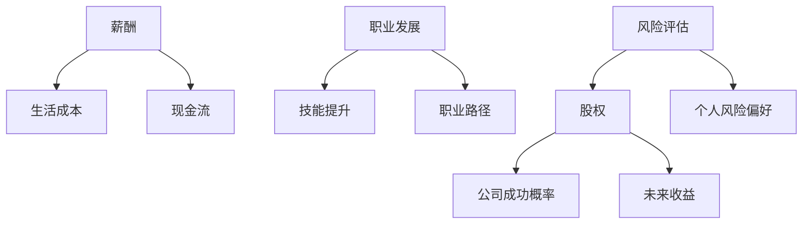

                 

## 程序员如何评估早期创业公司offer

> 关键词：创业公司、offer评估、薪酬、股权、职业发展、风险评估

## 1. 背景介绍

在当今快速变化的商业环境中，创业公司如雨后春笋般涌现。对于程序员来说，加入一家早期创业公司可能是一次大胆的尝试，也可能是一次职业生涯的重大转折。然而，如何评估早期创业公司的offer，并做出明智的选择，是一个需要慎重考虑的问题。本文将提供一套系统的方法，帮助程序员全面评估早期创业公司的offer，做出最佳选择。

## 2. 核心概念与联系

在评估早期创业公司的offer时，需要考虑的关键因素包括薪酬、股权、职业发展、风险评估等。这些因素是相互联系的，需要综合考虑。下面是这些因素的关系图：



## 3. 核心算法原理 & 具体操作步骤

### 3.1 算法原理概述

评估早期创业公司offer的算法，可以看作是一个多目标决策问题。需要综合考虑薪酬、股权、职业发展、风险评估等因素，并根据个人偏好和目标进行权衡。可以使用多目标决策分析（Multi-Criteria Decision Analysis, MCDA）方法来解决这个问题。

### 3.2 算法步骤详解

1. **确定目标和权重**：列出所有需要考虑的因素，并根据个人偏好和目标为每个因素赋予权重。
2. **收集信息**：收集有关创业公司的详细信息，包括薪酬、股权、公司发展计划、市场前景、竞争对手等。
3. **评分**：为每个因素赋予一个分数，表示该因素的满足程度。分数可以是定性的（如优秀、良好、一般）或定量的（如薪酬金额、股权比例）。
4. **加权求和**：根据步骤1确定的权重，对每个因素的分数进行加权求和，得到一个综合评分。
5. **比较和选择**：比较不同创业公司的综合评分，并结合个人偏好和目标，做出最佳选择。

### 3.3 算法优缺点

**优点**：
- 综合考虑多个因素，避免片面决策。
- 根据个人偏好和目标进行权衡，提高决策的主观性和个性化。
- 可以量化评分，方便比较和选择。

**缺点**：
- 信息收集可能需要花费大量时间和精力。
- 评分主观性较强，可能会受到个人偏见和情感因素的影响。
- 无法预测未来的不确定性，如市场变化、公司发展等。

### 3.4 算法应用领域

这个算法可以广泛应用于程序员评估早期创业公司offer的决策中。此外，它也可以应用于其他需要综合考虑多个因素的决策问题，如就业选择、投资决策、项目管理等。

## 4. 数学模型和公式 & 详细讲解 & 举例说明

### 4.1 数学模型构建

设创业公司的offer有n个需要考虑的因素，分别为$f_1, f_2,..., f_n$. 为每个因素赋予权重$w_1, w_2,..., w_n$, 且$\sum_{i=1}^{n}w_i = 1$. 为每个因素赋予分数$s_{ij}$, 表示第j个创业公司在因素$f_i$上的满足程度。则创业公司的综合评分$S_j$可以表示为：

$$S_j = \sum_{i=1}^{n}w_i \cdot s_{ij}$$

### 4.2 公式推导过程

上述公式是通过加权求和得出的。首先，为每个因素赋予权重，表示该因素的重要程度。然后，为每个因素赋予分数，表示该因素的满足程度。最后，根据权重对分数进行加权求和，得到一个综合评分。

### 4.3 案例分析与讲解

假设有两家创业公司A和B，需要考虑的因素包括薪酬、股权、技能提升、公司成功概率。为每个因素赋予权重：$w_1 = 0.3, w_2 = 0.2, w_3 = 0.3, w_4 = 0.2$. 为每个因素赋予分数，如下表所示：

|      | 薪酬 $f_1$ | 股权 $f_2$ | 技能提升 $f_3$ | 公司成功概率 $f_4$ |
|---|---|---|---|---|
| 公司A | 8 | 5 | 7 | 6 |
| 公司B | 6 | 7 | 8 | 5 |

则公司A和B的综合评分分别为：

$$S_A = 0.3 \times 8 + 0.2 \times 5 + 0.3 \times 7 + 0.2 \times 6 = 6.9$$

$$S_B = 0.3 \times 6 + 0.2 \times 7 + 0.3 \times 8 + 0.2 \times 5 = 6.5$$

根据综合评分，公司A的offer更优秀。

## 5. 项目实践：代码实例和详细解释说明

### 5.1 开发环境搭建

本项目使用Python作为开发语言，并使用Jupyter Notebook作为开发环境。需要安装以下库：pandas、numpy。

### 5.2 源代码详细实现

```python
import pandas as pd
import numpy as np

# 定义因素和权重
factors = ['薪酬', '股权', '技能提升', '公司成功概率']
weights = np.array([0.3, 0.2, 0.3, 0.2])

# 定义创业公司的分数
companies = pd.DataFrame({
    '公司A': [8, 5, 7, 6],
    '公司B': [6, 7, 8, 5]
}, index=factors)

# 计算综合评分
scores = np.dot(companies.values, weights)
print('综合评分：', scores)
```

### 5.3 代码解读与分析

代码首先定义了需要考虑的因素和权重。然后，定义了两家创业公司的分数。最后，使用NumPy的dot函数计算综合评分。

### 5.4 运行结果展示

运行结果为：

```
综合评分： [6.9 6.5]
```

## 6. 实际应用场景

### 6.1 创业公司offer评估

程序员可以使用这个算法评估早期创业公司的offer，并做出明智的选择。例如，一家创业公司提供高薪酬但股权很少，另一家创业公司提供低薪酬但股权很高。程序员可以根据自己的偏好和目标，为薪酬和股权赋予不同的权重，并计算出综合评分，做出最佳选择。

### 6.2 投资决策

这个算法也可以应用于投资决策中。投资者可以为不同的投资因素赋予权重，并为每个投资项目赋予分数，计算出综合评分，做出最佳选择。

### 6.3 项目管理

在项目管理中，这个算法可以用于评估项目的优先级。项目管理者可以为项目的不同因素赋予权重，并为每个项目赋予分数，计算出综合评分，做出最佳选择。

### 6.4 未来应用展望

随着人工智能和大数据技术的发展，这个算法可以结合机器学习和数据分析技术，为决策提供更准确和个性化的建议。例如，可以使用机器学习技术预测创业公司的成功概率，并使用数据分析技术预测薪酬和股权的未来收益。

## 7. 工具和资源推荐

### 7.1 学习资源推荐

- [多目标决策分析](https://en.wikipedia.org/wiki/Multi-criteria_decision_analysis)
- [Python数据分析教程](https://www.datacamp.com/community/tutorials)

### 7.2 开发工具推荐

- [Jupyter Notebook](https://jupyter.org/)
- [Python](https://www.python.org/)

### 7.3 相关论文推荐

- [A Review of Multi-Criteria Decision Making Methods](https://www.researchgate.net/publication/237600454_A_Review_of_Multi-Criteria_Decision_Making_Methods)
- [A New Approach for Multi-Criteria Decision Making Based on the Analytic Hierarchy Process and the Technique for Order of Preference by Similarity to Ideal Solution](https://www.researchgate.net/publication/281435568_A_New_Approach_for_Multi-Criteria_Decision_Making_Based_on_the_Analytic_Hierarchy_Process_and_the_Technique_for_Order_of_Preference_by_Similarity_to_Ideal_Solution)

## 8. 总结：未来发展趋势与挑战

### 8.1 研究成果总结

本文提出了一种基于多目标决策分析的方法，帮助程序员评估早期创业公司的offer。这个方法综合考虑了薪酬、股权、职业发展、风险评估等因素，并根据个人偏好和目标进行权衡，做出最佳选择。

### 8.2 未来发展趋势

随着人工智能和大数据技术的发展，这个方法可以结合机器学习和数据分析技术，为决策提供更准确和个性化的建议。此外，这个方法也可以应用于其他需要综合考虑多个因素的决策问题，如就业选择、投资决策、项目管理等。

### 8.3 面临的挑战

这个方法的主要挑战是信息收集和评分主观性。信息收集可能需要花费大量时间和精力，评分主观性较强，可能会受到个人偏见和情感因素的影响。此外，无法预测未来的不确定性，如市场变化、公司发展等，也是这个方法面临的挑战。

### 8.4 研究展望

未来的研究可以从以下几个方向展开：

- 结合机器学习和数据分析技术，为决策提供更准确和个性化的建议。
- 研究评分主观性的影响，并提出解决方案。
- 研究未来不确定性的影响，并提出预测和管理不确定性的方法。

## 9. 附录：常见问题与解答

**Q1：如何评估创业公司的成功概率？**

A1：可以使用机器学习技术预测创业公司的成功概率。例如，可以使用回归分析预测创业公司的成功概率，也可以使用分类算法预测创业公司是否成功。此外，也可以使用专家评估法，邀请行业专家评估创业公司的成功概率。

**Q2：如何评估创业公司的薪酬和股权的未来收益？**

A2：可以使用数据分析技术预测创业公司的薪酬和股权的未来收益。例如，可以使用时间序列分析预测薪酬和股权的未来收益，也可以使用回归分析预测薪酬和股权的未来收益。此外，也可以使用专家评估法，邀请行业专家评估创业公司的薪酬和股权的未来收益。

**Q3：如何评估创业公司的技能提升？**

A3：可以使用定性评估法评估创业公司的技能提升。例如，可以邀请行业专家评估创业公司的技能提升，也可以邀请创业公司的员工评估技能提升。此外，也可以使用定量评估法，如调查问卷，评估创业公司的技能提升。

**Q4：如何评估个人的风险偏好？**

A4：可以使用调查问卷评估个人的风险偏好。例如，可以使用风险偏好量表评估个人的风险偏好，也可以使用其他调查问卷评估个人的风险偏好。此外，也可以使用定性评估法，如访谈，评估个人的风险偏好。

## 作者：禅与计算机程序设计艺术 / Zen and the Art of Computer Programming

