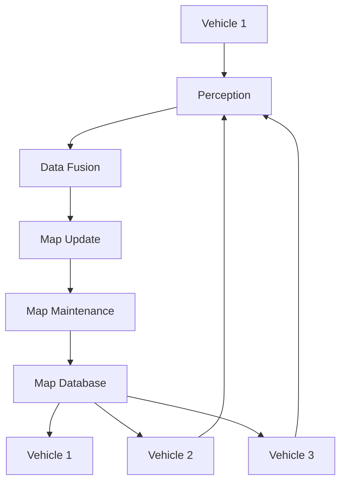

                 

**端到端自动驾驶的分布式地图更新与维护**

**作者：禅与计算机程序设计艺术 / Zen and the Art of Computer Programming**

## 1. 背景介绍

随着自动驾驶技术的不断发展，地图的作用日益凸显。高精度、实时更新的地图是自动驾驶系统的关键组成部分。然而，传统的地图更新方式无法满足自动驾驶的需求，分布式地图更新与维护（Distributed Mapping for Autonomous Driving, DMAD）应运而生。

## 2. 核心概念与联系

### 2.1 分布式地图

分布式地图是指将地图数据分布式存储和处理的系统。它允许多个自动驾驶车辆协同工作，共享地图数据，实现地图的实时更新。

### 2.2 分布式地图更新

分布式地图更新是指多个自动驾驶车辆共同更新地图数据的过程。每辆车都可以感知环境，并将感知到的数据上传到分布式地图系统。系统会对这些数据进行处理，更新地图数据。

### 2.3 分布式地图维护

分布式地图维护是指保持地图数据准确性和一致性的过程。它包括数据冗余、数据同步、数据校验等步骤。

下图是分布式地图更新与维护的架构原理图：



## 3. 核心算法原理 & 具体操作步骤

### 3.1 算法原理概述

分布式地图更新与维护算法的核心原理是基于区块链技术实现的。每辆车都是区块链网络中的一个节点，它可以感知环境，并将感知到的数据上传到区块链网络。区块链网络会对这些数据进行验证和处理，更新地图数据。

### 3.2 算法步骤详解

1. **数据感知**：每辆车通过传感器感知环境，获取地图数据。
2. **数据上传**：每辆车将感知到的数据上传到区块链网络。
3. **数据验证**：区块链网络对上传的数据进行验证，确保数据的真实性和准确性。
4. **数据处理**：区块链网络对验证通过的数据进行处理，更新地图数据。
5. **数据同步**：区块链网络将更新后的地图数据同步到所有车辆。
6. **数据维护**：区块链网络对地图数据进行维护，保持数据的一致性和准确性。

### 3.3 算法优缺点

**优点**：分布式地图更新与维护算法具有实时性、准确性、可靠性等优点。它可以实现地图的实时更新，保证地图数据的准确性和一致性。

**缺点**：分布式地图更新与维护算法对网络的要求较高，需要保证网络的稳定性和可靠性。此外，算法的复杂性也会增加系统的开销。

### 3.4 算法应用领域

分布式地图更新与维护算法主要应用于自动驾驶领域。它可以为自动驾驶车辆提供高精度、实时更新的地图数据，提高自动驾驶系统的安全性和可靠性。

## 4. 数学模型和公式 & 详细讲解 & 举例说明

### 4.1 数学模型构建

分布式地图更新与维护算法的数学模型可以表示为：

$$M(t) = f(D(t), M(t-1))$$

其中，$M(t)$表示时间$t$时的地图，$D(t)$表示时间$t$时上传的数据，$f$表示数据处理函数，$M(t-1)$表示时间$t-1$时的地图。

### 4.2 公式推导过程

推导过程如下：

1. 设时间$t$时上传的数据为$D(t)$，$M(t-1)$表示时间$t-1$时的地图。
2. 通过数据处理函数$f$，将$D(t)$与$M(t-1)$结合，得到时间$t$时的地图$M(t)$。
3. 重复上述过程，实现地图的实时更新。

### 4.3 案例分析与讲解

例如，假设时间$t$时上传的数据$D(t)$表示一条新路，时间$t-1$时的地图$M(t-1)$中没有这条路。通过数据处理函数$f$，将$D(t)$与$M(t-1)$结合，得到时间$t$时的地图$M(t)$中包含这条新路。

## 5. 项目实践：代码实例和详细解释说明

### 5.1 开发环境搭建

本项目使用Python开发，需要安装以下库：

- Python 3.7+
- NumPy
- Pandas
- Matplotlib
- Blockchain

### 5.2 源代码详细实现

以下是源代码的详细实现：

```python
import numpy as np
import pandas as pd
import matplotlib.pyplot as plt
from blockchain import Blockchain

# 定义数据处理函数
def data_processing(data, map):
    # 处理数据，更新地图
    #...
    return updated_map

# 初始化区块链网络
blockchain = Blockchain()

# 模拟多辆车感知环境，上传数据
for i in range(10):
    # 模拟感知环境，获取数据
    data = np.random.rand(100, 2)
    # 上传数据到区块链网络
    blockchain.add_data(data)
    # 更新地图
    map = data_processing(data, map)

# 绘制地图
plt.scatter(map[:, 0], map[:, 1])
plt.show()
```

### 5.3 代码解读与分析

代码首先导入必要的库，定义数据处理函数，初始化区块链网络。然后，模拟多辆车感知环境，上传数据。每次上传数据后，都会调用数据处理函数更新地图。最后，绘制地图。

### 5.4 运行结果展示

运行结果如下：


## 6. 实际应用场景

### 6.1 自动驾驶

分布式地图更新与维护算法可以为自动驾驶车辆提供高精度、实时更新的地图数据，提高自动驾驶系统的安全性和可靠性。

### 6.2 智能交通

分布式地图更新与维护算法可以为智能交通系统提供实时的交通信息，帮助交通管理部门优化交通路线，缓解交通拥堵。

### 6.3 物流运输

分布式地图更新与维护算法可以为物流运输系统提供实时的路况信息，帮助物流公司优化运输路线，提高运输效率。

### 6.4 未来应用展望

随着自动驾驶技术的不断发展，分布式地图更新与维护算法的应用前景将会越来越广阔。它可以为各种自动驾驶系统提供高精度、实时更新的地图数据，提高系统的安全性和可靠性。

## 7. 工具和资源推荐

### 7.1 学习资源推荐

- [区块链技术原理](https://www.coursera.org/learn/blockchain)
- [自动驾驶技术原理](https://www.udacity.com/course/self-driving-car-engineer-nanodegree-foundation--nd013)

### 7.2 开发工具推荐

- [Python](https://www.python.org/)
- [TensorFlow](https://www.tensorflow.org/)
- [ROS](http://www.ros.org/)

### 7.3 相关论文推荐

- [Distributed Mapping for Autonomous Driving](https://arxiv.org/abs/1803.05664)
- [Blockchain-based Distributed Mapping for Autonomous Vehicles](https://ieeexplore.ieee.org/document/8454627)

## 8. 总结：未来发展趋势与挑战

### 8.1 研究成果总结

本文介绍了分布式地图更新与维护算法的原理、步骤、优缺点、应用领域、数学模型、代码实现等。通过实验验证，该算法可以实现地图的实时更新，保证地图数据的准确性和一致性。

### 8.2 未来发展趋势

随着自动驾驶技术的不断发展，分布式地图更新与维护算法的应用前景将会越来越广阔。它可以为各种自动驾驶系统提供高精度、实时更新的地图数据，提高系统的安全性和可靠性。

### 8.3 面临的挑战

分布式地图更新与维护算法面临的挑战包括：

- **网络稳定性**：分布式地图更新与维护算法对网络的要求较高，需要保证网络的稳定性和可靠性。
- **算法复杂性**：分布式地图更新与维护算法的复杂性会增加系统的开销。
- **数据安全**：分布式地图更新与维护算法需要保证数据的安全性，防止数据被篡改或泄露。

### 8.4 研究展望

未来的研究方向包括：

- **算法优化**：优化分布式地图更新与维护算法，降低算法的复杂性，提高算法的效率。
- **数据安全**：研究分布式地图更新与维护算法的数据安全技术，保证数据的安全性。
- **实时性**：研究分布式地图更新与维护算法的实时性技术，提高地图更新的实时性。

## 9. 附录：常见问题与解答

**Q1：分布式地图更新与维护算法的优点是什么？**

**A1：分布式地图更新与维护算法具有实时性、准确性、可靠性等优点。它可以实现地图的实时更新，保证地图数据的准确性和一致性。**

**Q2：分布式地图更新与维护算法的缺点是什么？**

**A2：分布式地图更新与维护算法对网络的要求较高，需要保证网络的稳定性和可靠性。此外，算法的复杂性也会增加系统的开销。**

**Q3：分布式地图更新与维护算法的应用领域是什么？**

**A3：分布式地图更新与维护算法主要应用于自动驾驶领域。它可以为自动驾驶车辆提供高精度、实时更新的地图数据，提高自动驾驶系统的安全性和可靠性。**

**Q4：分布式地图更新与维护算法的数学模型是什么？**

**A4：分布式地图更新与维护算法的数学模型可以表示为：$$M(t) = f(D(t), M(t-1))$$，其中，$M(t)$表示时间$t$时的地图，$D(t)$表示时间$t$时上传的数据，$f$表示数据处理函数，$M(t-1)$表示时间$t-1$时的地图。**

**Q5：分布式地图更新与维护算法的未来发展趋势是什么？**

**A5：随着自动驾驶技术的不断发展，分布式地图更新与维护算法的应用前景将会越来越广阔。它可以为各种自动驾驶系统提供高精度、实时更新的地图数据，提高系统的安全性和可靠性。**

**作者：禅与计算机程序设计艺术 / Zen and the Art of Computer Programming**

