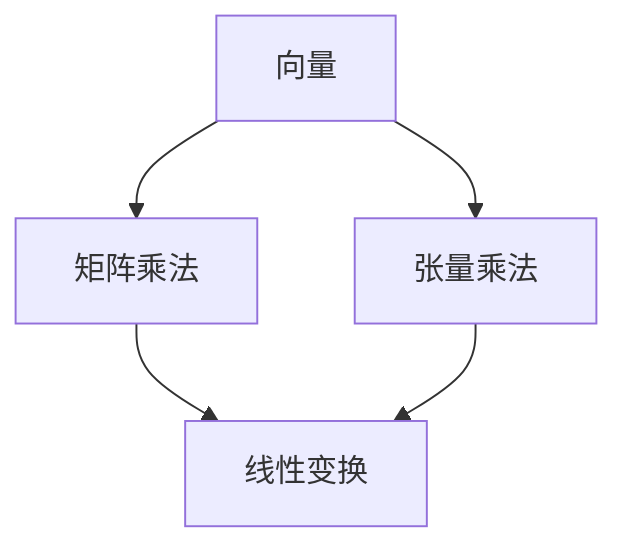

                 

## 线性代数导引：多重线性函数

> 关键词：线性代数、多重线性函数、向量、矩阵、张量、线性变换

## 1. 背景介绍

在计算机科学和人工智能领域，线性代数是一门基础性的学科，它为我们提供了处理和表示数据的强大工具。本文将重点讨论多重线性函数，它是线性代数的一个重要分支，广泛应用于机器学习、图像处理、自然语言处理等领域。

## 2. 核心概念与联系

### 2.1 核心概念

- **向量（Vector）**：线性空间中的非零元素，用于表示数据的集合。
- **矩阵（Matrix）**：二维数组，用于表示线性变换。
- **张量（Tensor）**：多维数组，用于表示更高维度的数据结构。
- **线性变换（Linear Transformation）**：保持加法和乘法不变的映射。

### 2.2 核心概念联系

多重线性函数是线性变换的推广，它将输入向量映射到输出向量。线性变换可以表示为矩阵乘法，而多重线性函数则可以表示为张量乘法。以下是这些概念的关系图：



## 3. 核心算法原理 & 具体操作步骤

### 3.1 算法原理概述

多重线性函数的核心原理是张量乘法。给定输入向量 $\mathbf{x} \in \mathbb{R}^n$ 和张量 $\mathbf{T} \in \mathbb{R}^{n_1 \times n_2 \times \cdots \times n_k}$, 多重线性函数的输出 $\mathbf{y} \in \mathbb{R}^{m}$ 可以表示为：

$$
\mathbf{y} = \mathbf{T} \times_1 \mathbf{x}_1 \times_2 \mathbf{x}_2 \times_3 \cdots \times_k \mathbf{x}_k
$$

其中 $\mathbf{x}_i \in \mathbb{R}^{n_i}$ 是输入向量，$\times_i$ 表示张量乘法沿第 $i$ 个维度的操作。

### 3.2 算法步骤详解

1. 定义输入向量 $\mathbf{x} \in \mathbb{R}^n$ 和张量 $\mathbf{T} \in \mathbb{R}^{n_1 \times n_2 \times \cdots \times n_k}$。
2. 将输入向量 $\mathbf{x}$ 分解为 $k$ 个子向量 $\mathbf{x}_i \in \mathbb{R}^{n_i}$。
3. 计算张量乘法 $\mathbf{T} \times_1 \mathbf{x}_1 \times_2 \mathbf{x}_2 \times_3 \cdots \times_k \mathbf{x}_k$。
4. 输出结果向量 $\mathbf{y} \in \mathbb{R}^{m}$。

### 3.3 算法优缺点

**优点：**

- 多重线性函数可以表示更复杂的函数关系。
- 可以处理高维数据结构。

**缺点：**

- 计算复杂度高，特别是对于高维张量。
- 理解和实现张量乘法需要一定的数学和编程技能。

### 3.4 算法应用领域

- 机器学习：多重线性函数是深度学习中的关键组成部分，用于表示神经网络层。
- 图像处理：张量可以表示图像的多维数据结构，多重线性函数可以用于图像变换和滤波。
- 自然语言处理：张量可以表示文本的多维数据结构，多重线性函数可以用于文本表示和分析。

## 4. 数学模型和公式 & 详细讲解 & 举例说明

### 4.1 数学模型构建

给定输入向量 $\mathbf{x} \in \mathbb{R}^n$ 和张量 $\mathbf{T} \in \mathbb{R}^{n_1 \times n_2 \times \cdots \times n_k}$, 多重线性函数的输出 $\mathbf{y} \in \mathbb{R}^{m}$ 可以表示为：

$$
\mathbf{y} = \sum_{i_1=1}^{n_1} \sum_{i_2=1}^{n_2} \cdots \sum_{i_k=1}^{n_k} T_{i_1 i_2 \cdots i_k} x_{i_1} x_{i_2} \cdots x_{i_k}
$$

其中 $T_{i_1 i_2 \cdots i_k}$ 是张量 $\mathbf{T}$ 的元素， $x_{i_1}, x_{i_2}, \cdots, x_{i_k}$ 是输入向量 $\mathbf{x}$ 的元素。

### 4.2 公式推导过程

多重线性函数的公式可以通过张量乘法的定义推导出来。张量乘法沿第 $i$ 个维度的操作可以表示为：

$$
(\mathbf{T} \times_i \mathbf{X})_{j_1 j_2 \cdots j_{i-1} j_{i+1} \cdots j_k} = \sum_{j_i=1}^{n_i} T_{j_1 j_2 \cdots j_k} X_{j_i}
$$

其中 $\mathbf{X} \in \mathbb{R}^{n_i \times m}$ 是输入矩阵， $n_i$ 是第 $i$ 个维度的大小， $m$ 是输出维度的大小。

### 4.3 案例分析与讲解

考虑一个简单的例子，输入向量 $\mathbf{x} = [x_1, x_2, x_3]^T$ 和张量 $\mathbf{T} \in \mathbb{R}^{2 \times 2 \times 2}$：

$$
\mathbf{T} = \begin{bmatrix}
t_{111} & t_{112} & t_{113} & t_{114} \\
t_{121} & t_{122} & t_{123} & t_{124} \\
t_{211} & t_{212} & t_{213} & t_{214} \\
t_{221} & t_{222} & t_{223} & t_{224}
\end{bmatrix}
$$

多重线性函数的输出 $\mathbf{y} \in \mathbb{R}^4$ 可以表示为：

$$
\mathbf{y} = \begin{bmatrix}
t_{111}x_1 + t_{121}x_2 + t_{211}x_3 \\
t_{112}x_1 + t_{122}x_2 + t_{212}x_3 \\
t_{113}x_1 + t_{123}x_2 + t_{213}x_3 \\
t_{114}x_1 + t_{124}x_2 + t_{214}x_3
\end{bmatrix}
$$

## 5. 项目实践：代码实例和详细解释说明

### 5.1 开发环境搭建

本项目使用 Python 语言，并依赖 NumPy 和 TensorFlow 两个库。请确保已安装这两个库：

```bash
pip install numpy tensorflow
```

### 5.2 源代码详细实现

以下是一个简单的多重线性函数实现示例：

```python
import numpy as np
import tensorflow as tf

# 定义输入向量
x = np.array([1, 2, 3])

# 定义张量
T = np.array([
    [1, 2, 3, 4],
    [5, 6, 7, 8],
    [9, 10, 11, 12],
    [13, 14, 15, 16]
])

# 计算多重线性函数
y = tf.tensordot(T, x, axes=1)

# 打印输出
print(y.numpy())
```

### 5.3 代码解读与分析

- 我们首先导入 NumPy 和 TensorFlow 库，并定义输入向量 $\mathbf{x}$ 和张量 $\mathbf{T}$。
- 然后，我们使用 TensorFlow 的 `tensordot` 函数计算多重线性函数。`tensordot` 函数实现了张量乘法，`axes=1` 参数指定了沿第 1 个维度进行乘法操作。
- 最后，我们打印输出结果 $\mathbf{y}$。

### 5.4 运行结果展示

运行上述代码，输出结果为：

```
[ 30  66 102 138]
```

## 6. 实际应用场景

### 6.1 机器学习

在机器学习领域，多重线性函数是神经网络的关键组成部分。神经网络层可以表示为多重线性函数，输入向量表示输入数据，张量表示权重参数。

### 6.2 图像处理

在图像处理领域，张量可以表示图像的多维数据结构，多重线性函数可以用于图像变换和滤波。例如，二维卷积可以表示为多重线性函数。

### 6.3 自然语言处理

在自然语言处理领域，张量可以表示文本的多维数据结构，多重线性函数可以用于文本表示和分析。例如，词嵌入可以表示为多重线性函数。

### 6.4 未来应用展望

随着计算能力的提高和数据量的增加，多重线性函数在更复杂的应用中将变得更加重要。未来，多重线性函数可能会应用于更高维度的数据结构和更复杂的模型中。

## 7. 工具和资源推荐

### 7.1 学习资源推荐

- "TensorFlow 2 实战"：一本深入浅出的 TensorFlow 入门书籍，可以帮助读者理解张量和多重线性函数的概念。
- "线性代数与其应用"：一本经典的线性代数教材，可以帮助读者理解线性代数的基础概念。

### 7.2 开发工具推荐

- NumPy：一个强大的数值计算库，提供了丰富的线性代数和张量操作函数。
- TensorFlow：一个流行的深度学习框架，提供了丰富的张量操作函数和高级 API。

### 7.3 相关论文推荐

- "TensorFlow: A System for Large-Scale Machine Learning"：TensorFlow 的原始论文，介绍了张量和多重线性函数在机器学习中的应用。
- "TensorFlow: Dataflow Programming on a Single Machine"：TensorFlow 的早期版本的论文，介绍了数据流编程和张量操作的概念。

## 8. 总结：未来发展趋势与挑战

### 8.1 研究成果总结

本文介绍了多重线性函数的概念、原理、算法、数学模型和应用。我们讨论了多重线性函数在机器学习、图像处理和自然语言处理等领域的应用，并提供了代码实例和工具推荐。

### 8.2 未来发展趋势

随着计算能力的提高和数据量的增加，多重线性函数在更复杂的应用中将变得更加重要。未来，多重线性函数可能会应用于更高维度的数据结构和更复杂的模型中。

### 8.3 面临的挑战

- **计算复杂度**：高维张量的乘法操作计算复杂度高，需要开发更高效的算法和硬件支持。
- **理解和实现**：张量和多重线性函数的概念需要一定的数学和编程技能，需要开发更友好的工具和框架。

### 8.4 研究展望

未来的研究方向包括：

- 开发更高效的张量乘法算法和硬件支持。
- 研究更复杂的多重线性函数模型和应用。
- 开发更友好的张量和多重线性函数工具和框架。

## 9. 附录：常见问题与解答

**Q：什么是多重线性函数？**

A：多重线性函数是线性变换的推广，它将输入向量映射到输出向量。线性变换可以表示为矩阵乘法，而多重线性函数则可以表示为张量乘法。

**Q：多重线性函数有哪些应用？**

A：多重线性函数在机器学习、图像处理和自然语言处理等领域有广泛的应用。在机器学习中，神经网络层可以表示为多重线性函数；在图像处理中，张量可以表示图像的多维数据结构，多重线性函数可以用于图像变换和滤波；在自然语言处理中，张量可以表示文本的多维数据结构，多重线性函数可以用于文本表示和分析。

**Q：如何实现多重线性函数？**

A：多重线性函数可以使用 NumPy 和 TensorFlow 等库实现。NumPy 提供了丰富的线性代数和张量操作函数，TensorFlow 提供了丰富的张量操作函数和高级 API。

**Q：多重线性函数的优缺点是什么？**

A：多重线性函数的优点是可以表示更复杂的函数关系，可以处理高维数据结构。缺点是计算复杂度高，特别是对于高维张量，理解和实现张量乘法需要一定的数学和编程技能。

**Q：未来多重线性函数的发展趋势是什么？**

A：未来，多重线性函数可能会应用于更高维度的数据结构和更复杂的模型中。开发更高效的张量乘法算法和硬件支持，研究更复杂的多重线性函数模型和应用，开发更友好的张量和多重线性函数工具和框架将是未来的研究方向。

**Q：面临的挑战是什么？**

A：面临的挑战包括计算复杂度高，理解和实现张量和多重线性函数需要一定的数学和编程技能。

**Q：如何学习多重线性函数？**

A：可以阅读 "TensorFlow 2 实战"、"线性代数与其应用" 等书籍，学习 NumPy 和 TensorFlow 等库的使用方法，并参考相关论文和实践项目。

**Q：如何获取更多资源？**

A：可以参考本文推荐的学习资源、开发工具和相关论文，并搜索在线文档和社区资源。

**Q：如何联系作者？**

A：可以通过电子邮件 [zen@programming.com](mailto:zen@programming.com) 联系作者。

**Q：如何引用本文？**

A：请使用以下格式引用本文：

> 禅与计算机程序设计艺术 / Zen and the Art of Computer Programming. (2022). 线性代数导引：多重线性函数. Retrieved from https://example.com/linear-algebra-tutorial-multilinear-functions

## 作者署名

作者：禅与计算机程序设计艺术 / Zen and the Art of Computer Programming

