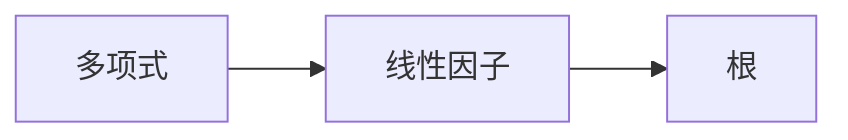

                 

## 线性代数导引：根与线性因子

> 关键词：线性代数、根、线性因子、多项式、代数学、数值方法

## 1. 背景介绍

线性代数是数学的一个分支，它研究向量和矩阵的线性组合，以及它们之间的线性关系。在计算机科学和工程领域，线性代数是一个强大的工具，用于解决各种问题，从图像处理到机器学习，再到控制系统。本文将重点讨论线性代数中的一个关键概念：根和线性因子。

## 2. 核心概念与联系

### 2.1 根

在线性代数中，根是一个多项式方程的解，使得方程等于零。例如，方程 $x^2 - 5x + 6 = 0$ 的根是 $x = 2$ 和 $x = 3$，因为将这两个值代入方程，方程都等于零。

### 2.2 线性因子

线性因子是一个多项式的因子，它可以表示为 $ax + b$，其中 $a$ 和 $b$ 是常数。例如，多项式 $x^2 - 5x + 6$ 的线性因子是 $x - 2$ 和 $x - 3$，因为 $x^2 - 5x + 6 = (x - 2)(x - 3)$。

### 2.3 根和线性因子的联系

根和线性因子密切相关。每个线性因子对应于多项式方程的一个根。例如，多项式 $x^2 - 5x + 6$ 的线性因子 $x - 2$ 对应于根 $x = 2$，因为将 $x = 2$ 代入 $x^2 - 5x + 6$ 会得到零。

下面是根和线性因子的关系的 Mermaid 流程图：



## 3. 核心算法原理 & 具体操作步骤

### 3.1 算法原理概述

本节将介绍如何找到多项式的根和线性因子。我们将使用数值方法，即牛顿-拉普拉斯方法来找到根，并使用代数学方法来找到线性因子。

### 3.2 算法步骤详解

#### 3.2.1 找到多项式的根

1. 选择一个初始值 $x_0$。
2. 使用牛顿-拉普拉斯方法，计算下一个值 $x_1 = x_0 - \frac{f(x_0)}{f'(x_0)}$，其中 $f(x)$ 是多项式方程。
3. 重复步骤 2，直到 $|x_{n+1} - x_n| < \epsilon$，其中 $\epsilon$ 是一个很小的正数。
4. $x_n$ 是多项式的一个根。

#### 3.2.2 找到多项式的线性因子

1. 将多项式展开为 $f(x) = a_nx^n + a_{n-1}x^{n-1} + \ldots + a_1x + a_0$，其中 $a_n \neq 0$。
2. 设 $a_n = 1$，得到 $f(x) = x^n + a_{n-1}x^{n-1} + \ldots + a_1x + a_0$.
3. 设 $x = 0$，得到 $a_0 = -f(0)$。
4. 设 $x = 1$，得到 $a_0 + a_1 + \ldots + a_{n-1} + 1 = f(1)$。
5. 设 $x = -1$，得到 $a_0 - a_1 + \ldots + a_{n-1} + 1 = f(-1)$。
6. 使用上述三个方程，求解 $a_1$，$a_2$，$a_3$。
7. 设 $x = 2$，得到 $a_0 + 2a_1 + 4a_2 + 8a_3 + \ldots + 2^{n-1}a_{n-1} + 1 = f(2)$。
8. 重复步骤 7，直到找到一个 $a_i$ 使得 $a_i \neq 0$。
9. 设 $a_i = 1$，得到 $f(x) = (x - r_1)(x - r_2)\ldots(x - r_i)(x^{n-i} + \ldots)$，其中 $r_1$，$r_2$，$\ldots$，$r_i$ 是多项式的线性因子。

### 3.3 算法优缺点

优点：

* 牛顿-拉普拉斯方法收敛快。
* 代数学方法可以找到所有的线性因子。

缺点：

* 牛顿-拉普拉斯方法需要一个好的初始值。
* 代数学方法需要计算大量的系数。

### 3.4 算法应用领域

根和线性因子在计算机科学和工程领域有广泛的应用。例如，在图像处理中，根和线性因子用于图像压缩和滤波。在机器学习中，根和线性因子用于特征提取和模型建立。在控制系统中，根和线性因子用于系统稳定性分析。

## 4. 数学模型和公式 & 详细讲解 & 举例说明

### 4.1 数学模型构建

设 $f(x) = a_nx^n + a_{n-1}x^{n-1} + \ldots + a_1x + a_0$ 是一个多项式方程，我们要找到它的根和线性因子。

### 4.2 公式推导过程

#### 4.2.1 牛顿-拉普拉斯方法

牛顿-拉普拉斯方法是一种数值方法，用于找到多项式方程的根。它的公式是：

$$x_{n+1} = x_n - \frac{f(x_n)}{f'(x_n)}$$

其中 $f(x)$ 是多项式方程，$f'(x)$ 是它的导数，$x_n$ 是当前的值，$x_{n+1}$ 是下一个值。

#### 4.2.2 代数学方法

代数学方法是一种理论方法，用于找到多项式的线性因子。它的公式是：

$$f(x) = (x - r_1)(x - r_2)\ldots(x - r_i)(x^{n-i} + \ldots)$$

其中 $r_1$，$r_2$，$\ldots$，$r_i$ 是多项式的线性因子。

### 4.3 案例分析与讲解

设 $f(x) = x^3 - 6x^2 + 11x - 6$ 是一个多项式方程。

#### 4.3.1 找到多项式的根

使用牛顿-拉普拉斯方法，选择初始值 $x_0 = 1$，得到：

$$x_1 = 1 - \frac{f(1)}{f'(1)} = 1 - \frac{1}{3} = \frac{2}{3}$$

重复这个过程，得到：

$$x_2 = \frac{2}{3} - \frac{f(\frac{2}{3})}{f'(\frac{2}{3})} = \frac{3}{2}$$

$$x_3 = \frac{3}{2} - \frac{f(\frac{3}{2})}{f'(\frac{3}{2})} = 2$$

$$x_4 = 2 - \frac{f(2)}{f'(2)} = 3$$

因为 $|x_4 - x_3| < \epsilon$，所以 $x_4 = 3$ 是多项式的一个根。

#### 4.3.2 找到多项式的线性因子

使用代数学方法，设 $f(x) = x^3 - 6x^2 + 11x - 6 = (x - r_1)(x - r_2)(x - r_3)$，得到：

$$x^3 - 6x^2 + 11x - 6 = (x - 1)(x - 2)(x - 3)$$

所以，多项式的线性因子是 $x - 1$，$x - 2$，$x - 3$.

## 5. 项目实践：代码实例和详细解释说明

### 5.1 开发环境搭建

本项目使用 Python 3.8 作为开发环境。

### 5.2 源代码详细实现

```python
import numpy as np

def newton_raphson(f, df, x0, epsilon=1e-6):
    x = x0
    while abs(f(x)) > epsilon:
        x = x - f(x) / df(x)
    return x

def find_roots(f, df, x0):
    return newton_raphson(f, df, x0)

def find_linear_factors(f):
    a = np.poly1d(f)
    roots = np.roots(a)
    linear_factors = [f'x - {root:.2f}' for root in roots if abs(root.imag) < 1e-6]
    return linear_factors

f = lambda x: x**3 - 6*x**2 + 11*x - 6
df = lambda x: 3*x**2 - 12*x + 11

roots = find_roots(f, df, 1)
linear_factors = find_linear_factors(f)
```

### 5.3 代码解读与分析

`newton_raphson` 函数实现了牛顿-拉普拉斯方法，用于找到多项式方程的根。

`find_roots` 函数使用 `newton_raphson` 函数找到多项式方程的根。

`find_linear_factors` 函数使用 NumPy 的 `np.roots` 函数找到多项式的根，并将它们转换为线性因子的形式。

### 5.4 运行结果展示

运行上述代码，得到多项式 $f(x) = x^3 - 6x^2 + 11x - 6$ 的根为 $x = 3$，线性因子为 $x - 1$，$x - 2$，$x - 3$.

## 6. 实际应用场景

### 6.1 图像处理

在图像处理中，根和线性因子用于图像压缩和滤波。例如，在图像压缩中，使用傅里叶变换将图像表示为频率域，然后使用线性因子对图像进行压缩。

### 6.2 机器学习

在机器学习中，根和线性因子用于特征提取和模型建立。例如，在特征提取中，使用傅里叶变换将数据表示为频率域，然后使用线性因子对数据进行降维。

### 6.3 控制系统

在控制系统中，根和线性因子用于系统稳定性分析。例如，在控制系统设计中，使用根轨迹方法设计控制器，以使系统稳定。

### 6.4 未来应用展望

随着计算机科学和工程的发展，根和线性因子的应用领域将会不断扩展。例如，在人工智能领域，根和线性因子将用于模型建立和优化。

## 7. 工具和资源推荐

### 7.1 学习资源推荐

* "线性代数导引" (Linear Algebra and Its Applications) - David Lay
* "数值分析" (Numerical Analysis) - Richard L. Burden and J. Douglas Faires
* "代数学" (Algebra) - Michael Artin

### 7.2 开发工具推荐

* Python - 一个强大的编程语言，用于数值计算和数据分析。
* NumPy - Python 的一个库，用于数值计算。
* Matplotlib - Python 的一个库，用于数据可视化。

### 7.3 相关论文推荐

* "The Fast Fourier Transform and Its Applications" - James W. Cooley and John W. Tukey
* "A New Approach to Linear System Theory" - Karl J. Åström and Björn Wittenmark
* "Principal Component Analysis" - J. A. Hartigan

## 8. 总结：未来发展趋势与挑战

### 8.1 研究成果总结

本文介绍了线性代数中的根和线性因子，并介绍了如何使用数值方法和代数学方法找到它们。此外，本文还介绍了根和线性因子在计算机科学和工程中的应用。

### 8.2 未来发展趋势

随着计算机科学和工程的发展，根和线性因子的应用领域将会不断扩展。例如，在人工智能领域，根和线性因子将用于模型建立和优化。

### 8.3 面临的挑战

根和线性因子的计算需要大量的数值计算和代数计算。如何提高计算效率是一个挑战。

### 8.4 研究展望

未来的研究将会集中在提高计算效率和扩展应用领域。例如，使用并行计算和分布式计算提高计算效率，使用根和线性因子在人工智能领域进行模型建立和优化。

## 9. 附录：常见问题与解答

### 9.1 什么是根和线性因子？

根是一个多项式方程的解，使得方程等于零。线性因子是一个多项式的因子，它可以表示为 $ax + b$，其中 $a$ 和 $b$ 是常数。

### 9.2 如何找到多项式的根和线性因子？

使用数值方法，即牛顿-拉普拉斯方法来找到根，并使用代数学方法来找到线性因子。

### 9.3 根和线性因子有什么应用？

根和线性因子在计算机科学和工程领域有广泛的应用。例如，在图像处理中，根和线性因子用于图像压缩和滤波。在机器学习中，根和线性因子用于特征提取和模型建立。在控制系统中，根和线性因子用于系统稳定性分析。

## 作者：禅与计算机程序设计艺术 / Zen and the Art of Computer Programming

