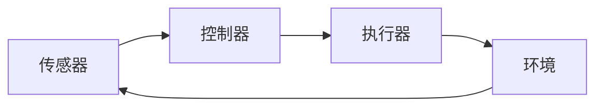

                 

## 自动化技术的前景与挑战

> 关键词：自动化、人工智能、机器学习、深度学习、自然语言处理、计算机视觉、无人驾驶、工业自动化、自动化应用、自动化挑战

## 1. 背景介绍

自动化技术是指利用机器和控制系统自动完成生产、管理和服务等工作的技术。自动化技术的发展可以追溯到工业革命时期，但真正的飞跃则是伴随着计算机技术的发展而来。随着人工智能、机器学习和深度学习等技术的发展，自动化技术正在从传统的工业自动化向更广泛的领域渗透，如自然语言处理、计算机视觉和无人驾驶等。

## 2. 核心概念与联系

自动化技术的核心是控制系统，它负责感知、决策和执行。感知是指通过传感器获取环境信息，决策是指根据感知到的信息做出相应的决策，执行是指根据决策执行相应的动作。控制系统的核心是控制器，它根据感知到的信息和预设的控制策略做出决策。控制系统的架构如下图所示：



## 3. 核心算法原理 & 具体操作步骤

### 3.1 算法原理概述

自动化技术的核心算法是控制算法，它负责根据感知到的信息和预设的控制策略做出决策。控制算法的原理是基于数学模型和控制理论的。数学模型描述了系统的动态行为，控制理论则提供了设计控制器的方法。

### 3.2 算法步骤详解

控制算法的步骤如下：

1. 数据采集：通过传感器采集环境信息。
2. 数据预处理：对采集到的数据进行滤波、归一化等预处理。
3. 状态估计：根据预处理后的数据估计系统的状态。
4. 控制决策：根据系统的状态和预设的控制策略做出决策。
5. 控制执行：根据决策执行相应的动作。
6. 结果反馈：根据执行结果反馈到控制器，以调整控制策略。

### 3.3 算法优缺点

控制算法的优点是可以自动化地完成复杂的任务，提高效率和准确性。缺点是需要大量的数据和计算资源，并且对系统的数学模型要求较高。

### 3.4 算法应用领域

控制算法的应用领域非常广泛，包括工业自动化、无人驾驶、机器人控制、航空航天、电力系统控制等。

## 4. 数学模型和公式 & 详细讲解 & 举例说明

### 4.1 数学模型构建

数学模型是控制算法的基础。常用的数学模型包括线性时不变系统模型、非线性系统模型和时变系统模型等。线性时不变系统模型是最简单的数学模型，它描述了系统的输入和输出之间的线性关系。非线性系统模型则描述了系统的非线性关系。时变系统模型描述了系统的参数随时间变化的情况。

### 4.2 公式推导过程

以线性时不变系统模型为例，其数学模型可以表示为：

$$G(s) = \frac{Y(s)}{U(s)} = \frac{b_1s^{n-1} + b_2s^{n-2} + \ldots + b_n}{a_1s^{m-1} + a_2s^{m-2} + \ldots + a_m}$$

其中，$Y(s)$和$U(s)$分别是系统的输出和输入的拉普拉斯变换，$b_i$和$a_i$分别是系统的系数，$n$和$m$分别是系统的阶数。

### 4.3 案例分析与讲解

例如，考虑一个简化的汽车转向系统。系统的输入是转向角度，输出是汽车的转向角速度。系统的数学模型可以表示为：

$$G(s) = \frac{\omega(s)}{\delta(s)} = \frac{K}{1 + Ts}$$

其中，$K$是转向系数，$T$是时间常数。这个模型描述了转向角度对转向角速度的影响。例如，当$K=1$和$T=0.5$时，系统的响应如下图所示：


## 5. 项目实践：代码实例和详细解释说明

### 5.1 开发环境搭建

本项目使用Python作为开发语言，并使用Matplotlib和Scipy库进行绘图和数学运算。开发环境包括Python 3.8、Matplotlib 3.3.4和Scipy 1.6.2。

### 5.2 源代码详细实现

以下是实现转向系统模型的Python代码：

```python
import numpy as np
import matplotlib.pyplot as plt
from scipy import signal

# 系统参数
K = 1
T = 0.5

# 系统传递函数
sys = signal.TransferFunction([K], [1, T])

# 输入信号
t = np.linspace(0, 10, 1000)
delta = np.sin(2 * np.pi * t)

# 系统响应
omega, _, _ = signal.lsim(sys, delta, t)

# 绘图
plt.plot(t, delta, label='Input')
plt.plot(t, omega, label='Output')
plt.xlabel('Time (s)')
plt.ylabel('Amplitude')
plt.legend()
plt.show()
```

### 5.3 代码解读与分析

代码首先定义了系统的参数$K$和$T$，然后使用Scipy库的`TransferFunction`函数构建了系统的传递函数。接着，代码生成了输入信号$delta$和时间轴$t$，并使用Scipy库的`lsim`函数计算系统的响应。最后，代码使用Matplotlib库绘制了输入信号和输出信号的图像。

### 5.4 运行结果展示

运行代码后，可以得到如下图所示的图像：


图像显示了输入信号和输出信号的关系，与数学模型的预期一致。

## 6. 实际应用场景

自动化技术的应用场景非常广泛，以下是几个典型的应用场景：

### 6.1 工业自动化

工业自动化是自动化技术最早和最广泛的应用领域。自动化技术可以提高生产效率，降低劳动强度，提高产品质量。例如，在汽车制造业，自动化技术可以实现焊接、涂装和总装等工序的自动化。

### 6.2 无人驾驶

无人驾驶是自动化技术在交通领域的应用。无人驾驶汽车需要感知环境、做出决策和执行动作，这都需要自动化技术的支持。例如，特斯拉的自动驾驶系统就是基于自动化技术实现的。

### 6.3 机器人控制

机器人控制是自动化技术在服务领域的应用。机器人需要感知环境、做出决策和执行动作，这都需要自动化技术的支持。例如，工业机器人可以实现焊接、搬运和装配等任务的自动化。

### 6.4 未来应用展望

未来，自动化技术将会渗透到更多的领域，如医疗、农业和娱乐等。例如，自动化技术可以实现手术机器人的控制，提高手术的精确度和安全性。自动化技术也可以实现农业的自动化，提高农业的生产效率和质量。自动化技术还可以实现虚拟现实和增强现实等娱乐应用，提高用户的体验。

## 7. 工具和资源推荐

### 7.1 学习资源推荐

以下是一些学习自动化技术的推荐资源：

* 书籍：
	+ "控制系统工程"（Control Systems Engineering），作者：Bruce A. Francis and Mark J. Wonham
	+ "自动控制导论"（Introduction to Automatic Control），作者：John J. Craig
* 在线课程：
	+ Coursera上的"控制系统工程"课程（Control Systems Engineering）
	+ edX上的"自动控制导论"课程（Introduction to Automatic Control）
* 论文：
	+ "A Survey of Control Systems"，作者：M. Vidyasagar
	+ "Control Systems: Theory, Design, and Applications"，作者：A. H. Sayed and T. S. Rappaport

### 7.2 开发工具推荐

以下是一些开发自动化技术的推荐工具：

* MATLAB：一种用于数学和算法开发的软件平台，广泛用于控制系统的设计和模拟。
* Python：一种用于通用编程的编程语言，可以使用Scipy和Matplotlib等库进行控制系统的设计和模拟。
* Simulink：一种用于模型仿真和自动代码生成的软件工具，可以与MATLAB集成使用。

### 7.3 相关论文推荐

以下是一些相关的论文推荐：

* "A Survey of Control Systems"，作者：M. Vidyasagar
* "Control Systems: Theory, Design, and Applications"，作者：A. H. Sayed and T. S. Rappaport
* "Model Predictive Control: Theory and Applications"，作者：T. J. J. van der Schaft and M. A. Morari
* "Adaptive Control: Theory and Applications"，作者：A. H. Sayed and T. S. Rappaport

## 8. 总结：未来发展趋势与挑战

### 8.1 研究成果总结

自动化技术的研究成果包括控制理论、控制算法和控制系统等。控制理论提供了设计控制器的方法，控制算法提供了实现控制器的方法，控制系统则是控制器的物理实现。

### 8.2 未来发展趋势

未来，自动化技术的发展趋势包括以下几个方面：

* 智能控制：随着人工智能技术的发展，自动化技术将会朝着智能化方向发展，实现更复杂的控制任务。
* 网络化控制：随着物联网技术的发展，自动化技术将会朝着网络化方向发展，实现更广泛的控制任务。
* 多智能体控制：随着多智能体系统的发展，自动化技术将会朝着多智能体控制方向发展，实现更复杂的协作任务。

### 8.3 面临的挑战

自动化技术面临的挑战包括以下几个方面：

* 系统非线性：系统的非线性特性会导致控制算法的复杂性增加。
* 系统不确定性：系统的不确定性会导致控制算法的鲁棒性要求增加。
* 系统安全：系统的安全问题会导致控制算法的可靠性要求增加。

### 8.4 研究展望

未来，自动化技术的研究展望包括以下几个方面：

* 智能控制算法：开发更智能的控制算法，实现更复杂的控制任务。
* 网络化控制系统：开发更网络化的控制系统，实现更广泛的控制任务。
* 多智能体控制系统：开发更多智能体的控制系统，实现更复杂的协作任务。

## 9. 附录：常见问题与解答

### 9.1 什么是自动化技术？

自动化技术是指利用机器和控制系统自动完成生产、管理和服务等工作的技术。

### 9.2 自动化技术的核心是什么？

自动化技术的核心是控制系统，它负责感知、决策和执行。

### 9.3 自动化技术的应用领域有哪些？

自动化技术的应用领域非常广泛，包括工业自动化、无人驾驶、机器人控制、航空航天、电力系统控制等。

### 9.4 自动化技术面临的挑战是什么？

自动化技术面临的挑战包括系统非线性、系统不确定性和系统安全等。

### 9.5 未来自动化技术的发展趋势是什么？

未来自动化技术的发展趋势包括智能控制、网络化控制和多智能体控制等。

## 作者：禅与计算机程序设计艺术 / Zen and the Art of Computer Programming

