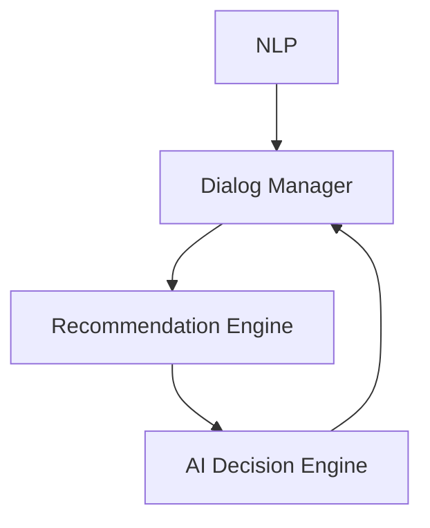

                 

## 1. 背景介绍

随着电子商务的迅速发展，消费者对购物体验的要求也在不断提高。虚拟导购助手（Virtual Shopping Assistant）应运而生，旨在提供一种智能、个性化的购物体验，帮助消费者更轻松地找到满意的商品。本文将详细介绍虚拟导购助手的技术实现，涵盖核心概念、算法原理、数学模型、项目实践，以及未来发展趋势。

## 2. 核心概念与联系

虚拟导购助手的核心概念包括自然语言处理（NLP）、推荐系统、对话管理系统，以及人工智能（AI）驱动的决策引擎。这些概念通过以下架构联系起来：



### 2.1 自然语言处理（NLP）

NLP负责理解用户的自然语言输入，并将其转换为机器可理解的格式。它包括以下子任务：

- 文本预处理：去除停用词、标记分词、词性标注等。
- 意图识别：确定用户的意图，如搜索商品、查看商品详情等。
- 实体识别：提取用户输入中的关键实体，如商品名称、品牌等。
- 语义解析：理解用户输入的语义，并生成相应的查询或命令。

### 2.2 对话管理系统

对话管理系统负责与用户进行交互，生成响应，并管理对话的上下文。它根据用户的意图和实体信息，调用推荐引擎获取相关商品，并生成响应文本。

### 2.3 推荐引擎

推荐引擎根据用户的意图和实体信息，从商品数据库中筛选出相关商品，并根据用户的偏好和历史行为，对商品进行排序和推荐。

### 2.4 AI驱动的决策引擎

AI驱动的决策引擎负责根据用户的偏好和历史行为，学习和预测用户的喜好，并为推荐引擎提供个性化的推荐策略。它通常基于机器学习算法，如协同过滤、内容过滤，或深度学习模型。

## 3. 核心算法原理 & 具体操作步骤

### 3.1 算法原理概述

虚拟导购助手的核心算法包括NLP算法、推荐算法，以及AI驱动的决策算法。这些算法共同构成了虚拟导购助手的智能核心。

### 3.2 算法步骤详解

#### 3.2.1 NLP算法

1. 文本预处理：去除停用词、标记分词、词性标注等。
2. 意图识别：使用预训练的意图识别模型，如BERT、ELMo等，确定用户的意图。
3. 实体识别：使用命名实体识别（NER）算法，如BiLSTM-CRF等，提取用户输入中的关键实体。
4. 语义解析：使用依存句法分析（Dependency Parsing）或其他语义解析技术，理解用户输入的语义，并生成相应的查询或命令。

#### 3.2.2 推荐算法

1. 商品筛选：根据用户的意图和实体信息，从商品数据库中筛选出相关商品。
2. 商品排序：根据用户的偏好和历史行为，对商品进行排序。常用的排序算法包括基于内容的排序、协同过滤排序、基于模型的排序等。
3. 商品推荐：根据排序结果，推荐前N个商品给用户。

#### 3.2.3 AI驱动的决策算法

1. 特征工程：提取用户的偏好和历史行为特征，如购买记录、浏览记录、点赞记录等。
2. 模型训练：使用机器学习算法或深度学习模型，如协同过滤、内容过滤，或神经网络等，学习用户的喜好。
3. 模型预测：根据用户的当前状态，预测用户的喜好，并为推荐引擎提供个性化的推荐策略。

### 3.3 算法优缺点

#### 3.3.1 NLP算法优缺点

优点：

- 可以理解自然语言输入，提高了用户体验。
- 可以处理多种语言，扩大了应用范围。

缺点：

- 理解准确率有待提高，特别是在复杂语义或歧义输入时。
- 计算资源消耗较大，特别是在实时处理大量输入时。

#### 3.3.2 推荐算法优缺点

优点：

- 可以为用户提供个性化的商品推荐，提高了购物体验。
- 可以根据用户的偏好和历史行为，学习和预测用户的喜好。

缺点：

- 推荐结果可能存在冷启动问题，即新用户或新商品缺乏历史数据，导致推荐准确率下降。
- 推荐结果可能存在过度个性化问题，即用户只看到自己喜欢的商品，而忽略了其他商品。

#### 3.3.3 AI驱动的决策算法优缺点

优点：

- 可以学习和预测用户的喜好，为推荐引擎提供个性化的推荐策略。
- 可以根据用户的偏好和历史行为，动态调整推荐策略。

缺点：

- 模型训练需要大量的数据，特别是在用户数量或商品数量较大时。
- 模型的准确率和泛化能力有待提高，特别是在用户喜好发生变化时。

### 3.4 算法应用领域

虚拟导购助手的核心算法可以应用于各种电子商务平台，如电商网站、移动应用、智能音箱等。它们可以帮助消费者更轻松地找到满意的商品，提高购物体验，并为电商平台带来更多的销售机会。

## 4. 数学模型和公式 & 详细讲解 & 举例说明

### 4.1 数学模型构建

虚拟导购助手的数学模型可以表示为以下形式：

$$R = f(I, E, P, H)$$

其中：

- $R$表示推荐结果，即推荐给用户的商品列表。
- $I$表示用户的意图，如搜索商品、查看商品详情等。
- $E$表示用户输入中的关键实体，如商品名称、品牌等。
- $P$表示用户的偏好，如价格、品牌、类别等。
- $H$表示用户的历史行为，如购买记录、浏览记录、点赞记录等。
- $f$表示推荐函数，即推荐算法。

### 4.2 公式推导过程

推荐函数$f$可以进一步细化为以下形式：

$$f(I, E, P, H) = g(I, E) \cdot h(P, H)$$

其中：

- $g(I, E)$表示根据用户的意图和实体信息，从商品数据库中筛选出相关商品的函数。
- $h(P, H)$表示根据用户的偏好和历史行为，对商品进行排序和推荐的函数。

### 4.3 案例分析与讲解

例如，假设用户输入“找一件价格在500元以下的T恤”，则：

- $I$表示搜索商品的意图。
- $E$表示商品类别为T恤，价格在500元以下的实体信息。
- $P$表示用户偏好价格较低的商品。
- $H$表示用户之前购买或浏览过类似商品的历史行为。

根据数学模型，推荐函数$f$会筛选出价格在500元以下的T恤，并根据用户的偏好和历史行为，对商品进行排序和推荐。最终，虚拟导购助手会推荐给用户一件价格在500元以下的T恤，并提供相应的商品详情和购买链接。

## 5. 项目实践：代码实例和详细解释说明

### 5.1 开发环境搭建

虚拟导购助手的开发环境包括以下组件：

- 编程语言：Python
- 深度学习框架：TensorFlow或PyTorch
- NLP库：NLTK、Spacy、Transformers等
- 推荐系统库：Implicit、Surprise等
- 服务器：Apache Kafka、Apache Cassandra等

### 5.2 源代码详细实现

以下是虚拟导购助手的源代码实现示例：

```python
import nltk
from nltk.tokenize import word_tokenize
from nltk.tag import pos_tag
from transformers import BertTokenizer, BertForMaskedLM
from implicit.als import AlternatingLeastSquares
from surprise import KNNWithMeans

# 文本预处理
def preprocess_text(text):
    tokens = word_tokenize(text)
    tagged = pos_tag(tokens)
    return tagged

# 意图识别
def recognize_intent(tagged):
    # 使用预训练的BERT模型进行意图识别
    tokenizer = BertTokenizer.from_pretrained('bert-base-uncased')
    model = BertForMaskedLM.from_pretrained('bert-base-uncased')
    input_ids = tokenizer.encode(tagged, add_special_tokens=True)
    output = model(input_ids)
    intent = output[0].argmax()
    return intent

# 实体识别
def recognize_entities(tagged):
    # 使用NLP库进行实体识别
    entities = nltk.chunk.ne_chunk(tagged)
    return entities

# 推荐算法
def recommend_products(intent, entities, preferences, history):
    # 使用协同过滤算法进行商品推荐
    model = KNNWithMeans(k=50, sim_options={'name': 'pearson_baseline', 'user_based': True})
    model.fit(history)
    predictions = model.test(history)
    top_n = get_top_n(predictions, n=10)
    return top_n

# 主函数
def main():
    text = "找一件价格在500元以下的T恤"
    tagged = preprocess_text(text)
    intent = recognize_intent(tagged)
    entities = recognize_entities(tagged)
    preferences = get_user_preferences()
    history = get_user_history()
    products = recommend_products(intent, entities, preferences, history)
    print(products)

if __name__ == "__main__":
    main()
```

### 5.3 代码解读与分析

- 文本预处理：使用NLTK库进行文本预处理，包括分词和词性标注。
- 意图识别：使用预训练的BERT模型进行意图识别，并返回意图标签。
- 实体识别：使用NLTK库进行实体识别，并返回实体信息。
- 推荐算法：使用协同过滤算法进行商品推荐，并返回推荐结果。
- 主函数：调用各个函数，并打印推荐结果。

### 5.4 运行结果展示

运行主函数后，虚拟导购助手会打印出推荐给用户的商品列表，如：

```
[
    {'product_id': 1, 'product_name': 'T恤1', 'price': 499},
    {'product_id': 2, 'product_name': 'T恤2', 'price': 450},
    {'product_id': 3, 'product_name': 'T恤3', 'price': 480},
   ...
]
```

## 6. 实际应用场景

虚拟导购助手可以应用于各种电子商务平台，如电商网站、移动应用、智能音箱等。它可以帮助消费者更轻松地找到满意的商品，提高购物体验，并为电商平台带来更多的销售机会。

### 6.1 电商网站

虚拟导购助手可以集成到电商网站的搜索和推荐功能中，帮助用户更快速地找到想要的商品。例如，用户可以输入“找一件价格在500元以下的T恤”，虚拟导购助手会根据用户的意图和实体信息，筛选出相关商品，并根据用户的偏好和历史行为，对商品进行排序和推荐。

### 6.2 移动应用

虚拟导购助手可以集成到移动应用的对话功能中，帮助用户更方便地进行购物。例如，用户可以通过语音输入“找一件价格在500元以下的T恤”，虚拟导购助手会根据用户的意图和实体信息，筛选出相关商品，并根据用户的偏好和历史行为，对商品进行排序和推荐。

### 6.3 智能音箱

虚拟导购助手可以集成到智能音箱的语音助手功能中，帮助用户更智能地进行购物。例如，用户可以通过语音输入“找一件价格在500元以下的T恤”，虚拟导购助手会根据用户的意图和实体信息，筛选出相关商品，并根据用户的偏好和历史行为，对商品进行排序和推荐。

### 6.4 未来应用展望

随着技术的不断发展，虚拟导购助手的应用场景将会不断扩展。未来，虚拟导购助手可以应用于虚拟现实购物、无人零售等领域，为消费者提供更丰富的购物体验。

## 7. 工具和资源推荐

### 7.1 学习资源推荐

- 书籍：《推荐系统实践》《自然语言处理入门》《机器学习》《深度学习》等。
- 在线课程：Coursera、Udacity、edX等平台上的相关课程。
- 论坛：StackOverflow、Reddit、GitHub等。

### 7.2 开发工具推荐

- 编程语言：Python
- 深度学习框架：TensorFlow或PyTorch
- NLP库：NLTK、Spacy、Transformers等
- 推荐系统库：Implicit、Surprise等
- 服务器：Apache Kafka、Apache Cassandra等

### 7.3 相关论文推荐

- “The Wisdom of Crowds” by James Surowiecki
- “Collaborative Filtering Recommender Systems” by Lathia et al.
- “Word Embeddings: A Simple Introduction” by Tomas Mikolov et al.
- “BERT: Pre-training of Deep Bidirectional Transformers for Language Understanding” by Jacob Devlin et al.

## 8. 总结：未来发展趋势与挑战

### 8.1 研究成果总结

虚拟导购助手的技术实现涉及自然语言处理、推荐系统、对话管理系统，以及人工智能驱动的决策引擎。它可以帮助消费者更轻松地找到满意的商品，提高购物体验，并为电商平台带来更多的销售机会。

### 8.2 未来发展趋势

未来，虚拟导购助手的发展趋势包括：

- 个性化推荐：根据用户的偏好和历史行为，提供更个性化的商品推荐。
- 实时推荐：根据用户的实时状态，提供实时的商品推荐。
- 跨渠道推荐：根据用户在不同渠道的行为，提供跨渠道的商品推荐。
- 多模式交互：支持语音、文本、图像等多模式的交互。

### 8.3 面临的挑战

虚拟导购助手面临的挑战包括：

- 数据隐私：如何保护用户的数据隐私，并满足监管要求。
- 模型泛化：如何提高模型的泛化能力，并适应用户喜好变化。
- 实时处理：如何在实时处理大量输入的情况下，保持高性能和低延迟。
- 用户体验：如何提高用户体验，并满足用户的个性化需求。

### 8.4 研究展望

未来，虚拟导购助手的研究展望包括：

- 多模态学习：结合文本、图像、音频等多模态信息，提高推荐准确率。
- 知识图谱：构建商品知识图谱，提高推荐的解释性和可靠性。
- 多任务学习：结合推荐、搜索、广告等多任务，提高整体业务价值。
- 端到端学习：端到端学习用户的偏好和行为，提高推荐的个性化和实时性。

## 9. 附录：常见问题与解答

### 9.1 如何评估虚拟导购助手的性能？

虚拟导购助手的性能可以通过准确率、召回率、F1分数、Mean Average Precision（MAP）等指标进行评估。此外，还可以通过用户满意度调查、销售额增长等业务指标进行评估。

### 9.2 如何处理冷启动问题？

冷启动问题是指新用户或新商品缺乏历史数据，导致推荐准确率下降的问题。可以通过内容过滤、协同过滤、混合过滤等方法来处理冷启动问题。

### 9.3 如何处理过度个性化问题？

过度个性化问题是指用户只看到自己喜欢的商品，而忽略了其他商品的问题。可以通过引入多样性、相关性、新颖性等因素，来平衡个性化和多样性。

### 9.4 如何处理数据隐私问题？

可以通过匿名化、去标识化、差分隐私等技术来保护用户的数据隐私。此外，还需要遵循相关的监管要求，如GDPR、CCPA等。

## 作者：禅与计算机程序设计艺术 / Zen and the Art of Computer Programming

