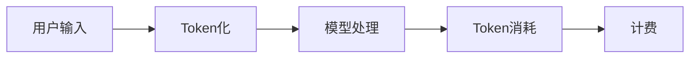

                 

**OpenAI Token 计费与计算**

## 1. 背景介绍

OpenAI 是一家致力于开发友好人工智能的研究机构，他们推出了多种模型，包括GPT-3.5、GPT-4，以及用于图像生成的DALL-E 2。这些模型的使用都基于OpenAI的token计费系统。本文将深入探讨OpenAI的token计费系统，其背后的原理，以及如何计算和优化token消耗。

## 2. 核心概念与联系

### 2.1 Token的定义

在OpenAI的模型中，token是最小的语言单位，类似于字或词。它用于计费，因为模型的计算成本取决于处理的token数量。

### 2.2 Token计费系统

OpenAI的token计费系统基于以下几点：

- **计费单位**：token
- **计费方式**：按token数量计费
- **计费价格**：根据模型和token数量而变化

下图是OpenAI token计费系统的简化架构图：



## 3. 核心算法原理 & 具体操作步骤

### 3.1 算法原理概述

OpenAI的token计费系统基于以下算法：

1. **Token化**：将用户输入转换为token序列。
2. **模型处理**：模型处理这些token，生成输出token序列。
3. **Token消耗计算**：计算模型处理过程中消耗的token数量。
4. **计费**：根据token数量和模型类型计算费用。

### 3.2 算法步骤详解

1. **Token化**：OpenAI的模型使用Byte-Level BPE（Byte Pair Encoding）算法将文本转换为token序列。该算法将文本分成子词，每个子词对应一个token。

2. **模型处理**：模型接收token序列，并生成输出token序列。例如，在GPT-3.5模型中，输入的token序列会触发模型生成相应的输出token序列。

3. **Token消耗计算**：消耗的token数量等于输入token数量加上输出token数量。OpenAI的API会返回消耗的token数量。

4. **计费**：费用根据模型类型和消耗的token数量计算。例如，GPT-3.5模型的费用为每千个token0.002美元，而GPT-4模型的费用为每千个token0.03美元。

### 3.3 算法优缺点

**优点**：

- **简单明确**：token计费系统简单易懂，用户可以清楚地知道他们将为模型使用付出多少成本。
- **灵活**：用户可以根据需要调整输入的token数量，从而控制成本。

**缺点**：

- **不适合长文本**：长文本的成本可能会很高，因为每个token都需要计费。
- **不适合实时应用**：计费单位是token，而不是时间，这可能不适合实时应用。

### 3.4 算法应用领域

OpenAI的token计费系统适用于各种需要使用OpenAI模型的应用，包括：

- **文本生成**：用户可以使用GPT-3.5或GPT-4模型生成文本，如文章、代码、诗歌等。
- **图像生成**：用户可以使用DALL-E 2模型生成图像，描述图像的文本也需要计费。
- **语言模型训练**：用户可以使用OpenAI的模型来训练自己的语言模型。

## 4. 数学模型和公式 & 详细讲解 & 举例说明

### 4.1 数学模型构建

OpenAI的token计费系统可以表示为以下数学模型：

- **输入token数量**：$T_{in}$
- **输出token数量**：$T_{out}$
- **消耗的token数量**：$T_{consume} = T_{in} + T_{out}$
- **费用**：$C = P \times T_{consume}$, 其中$P$是每千个token的价格。

### 4.2 公式推导过程

费用$C$可以通过以下公式推导：

1. **消耗的token数量**：$T_{consume} = T_{in} + T_{out}$
2. **费用**：$C = P \times T_{consume} = P \times (T_{in} + T_{out})$

### 4.3 案例分析与讲解

假设用户使用GPT-3.5模型生成一段文本，输入文本包含100个token，模型生成了200个token。那么：

- **消耗的token数量**：$T_{consume} = 100 + 200 = 300$个token
- **费用**：$C = 0.002 \times 300 = 0.6$美元

## 5. 项目实践：代码实例和详细解释说明

### 5.1 开发环境搭建

要使用OpenAI的模型，您需要设置Python环境，并安装OpenAI的官方库`openai`.

```bash
pip install openai
```

### 5.2 源代码详细实现

以下是一个简单的Python脚本，使用GPT-3.5模型生成文本：

```python
import os
from openai import OpenAI

# 设置OpenAI API密钥
os.environ["OPENAI_API_KEY"] = "your_api_key"

# 初始化OpenAI客户端
client = OpenAI()

# 定义模型和prompt
model = "gpt-3.5-turbo"
prompt = "Translate 'Hello, World!' to French."

# 调用模型生成文本
response = client.chat.completions.create(
    model=model,
    messages=[{"role": "user", "content": prompt}]
)

# 打印生成的文本
print(response.choices[0].message.content)
```

### 5.3 代码解读与分析

- **设置OpenAI API密钥**：您需要设置OpenAI API密钥，以便使用OpenAI的模型。
- **初始化OpenAI客户端**：使用`OpenAI`类初始化客户端。
- **定义模型和prompt**：指定要使用的模型和输入文本。
- **调用模型生成文本**：使用`chat.completions.create`方法调用模型，并传入模型和prompt。
- **打印生成的文本**：打印模型生成的文本。

### 5.4 运行结果展示

运行上述代码后，模型会生成文本，例如："Bonjour, monde！"

## 6. 实际应用场景

### 6.1 当前应用

OpenAI的token计费系统已广泛应用于各种应用，包括：

- **聊天机器人**：用户可以使用GPT-3.5或GPT-4模型构建聊天机器人。
- **文本摘要**：用户可以使用模型生成文本摘要。
- **代码生成**：用户可以使用模型生成代码。

### 6.2 未来应用展望

未来，OpenAI的token计费系统可能会应用于：

- **实时应用**：随着技术的发展，token计费系统可能会扩展到实时应用，如视频游戏或虚拟现实。
- **定制模型**：用户可能会使用OpenAI的模型训练自己的定制模型，并使用token计费系统。

## 7. 工具和资源推荐

### 7.1 学习资源推荐

- **OpenAI文档**：<https://platform.openai.com/docs>
- **OpenAI API参考**：<https://platform.openai.com/docs/api-reference>
- **OpenAI博客**：<https://openai.com/blog/>

### 7.2 开发工具推荐

- **OpenAI Playground**：<https://platform.openai.com/playground>
- **ChatGPT**：<https://chat.openai.com/>

### 7.3 相关论文推荐

- **Attention Is All You Need**：<https://arxiv.org/abs/1706.03762>
- **Language Models are Few-Shot Learners**：<https://arxiv.org/abs/2005.14165>

## 8. 总结：未来发展趋势与挑战

### 8.1 研究成果总结

OpenAI的token计费系统简单明确，用户可以清楚地知道他们将为模型使用付出多少成本。然而，它也有缺点，如不适合长文本和实时应用。

### 8.2 未来发展趋势

未来，OpenAI的token计费系统可能会扩展到实时应用，并应用于定制模型。此外，随着模型的发展，token计费系统也需要相应地发展。

### 8.3 面临的挑战

OpenAI面临的挑战包括：

- **成本控制**：用户需要控制成本，避免因为模型使用而产生高昂费用。
- **模型发展**：OpenAI需要不断发展模型，以满足用户的需求。

### 8.4 研究展望

未来的研究可能会集中在以下领域：

- **实时应用**：如何将token计费系统扩展到实时应用。
- **定制模型**：如何使用OpenAI的模型训练定制模型，并使用token计费系统。

## 9. 附录：常见问题与解答

**Q：什么是token？**

A：在OpenAI的模型中，token是最小的语言单位，类似于字或词。它用于计费，因为模型的计算成本取决于处理的token数量。

**Q：如何计算消耗的token数量？**

A：消耗的token数量等于输入token数量加上输出token数量。

**Q：如何控制成本？**

A：您可以控制成本的方法是调整输入的token数量，从而控制模型生成的输出token数量。

**Q：OpenAI的token计费系统适合实时应用吗？**

A：不适合。OpenAI的token计费系统基于token数量，而不是时间，这可能不适合实时应用。

**Q：OpenAI的token计费系统适合长文本吗？**

A：不适合。长文本的成本可能会很高，因为每个token都需要计费。

**Q：未来OpenAI的token计费系统会有什么发展？**

A：未来，OpenAI的token计费系统可能会扩展到实时应用，并应用于定制模型。此外，随着模型的发展，token计费系统也需要相应地发展。

## 作者：禅与计算机程序设计艺术 / Zen and the Art of Computer Programming

