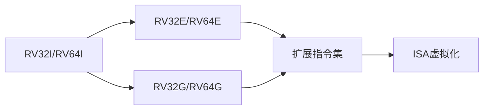

                 

RISC-V, 开源指令集,ISA, CPU架构,指令集设计,指令集优化,指令集扩展,指令集虚拟化

## 1. 背景介绍

在计算机体系结构的发展历史上，指令集架构（ISA）扮演着至关重要的角色。它定义了处理器与软件之间的接口，影响着系统的性能、可移植性和安全性。传统上，ISA被少数几家大型公司控制，导致了高昂的许可费用和缺乏灵活性。为了改变这种局面，麻省理工学院开发了RISC-V，一种开源的指令集架构。

RISC-V于2010年首次提出，旨在提供一种免费、可定制、可扩展的ISA。它基于RISC（Reduced Instruction Set Computing）原则，优化了指令集以提高性能和简化硬件设计。RISC-V已被广泛采用，用于各种应用，从嵌入式系统到高性能计算机。

## 2. 核心概念与联系

RISC-V的核心概念是其模块化设计，它允许用户定制ISA以满足特定的需求。RISC-V ISA由以下组件组成：

- 基本整数指令集（RV32I/RV64I）：提供基本的整数运算和控制流指令。
- 标准扩展（RV32E/RV64E）：添加了数据处理指令，如单精度浮点运算和原子操作。
- 通用扩展（RV32G/RV64G）：提供了更多的整数指令，如位级别操作和向量指令。
- 扩展指令集：为特定应用定制的指令集，如矢量、浮点、整数乘除和加速指令。

这些组件通过指令集虚拟化（ISA virtualization）机制相互连接。ISA虚拟化允许在单个物理处理器上运行多个虚拟处理器，每个虚拟处理器都有自己的ISA。这提供了灵活性和安全性，允许在单个系统上运行不同的操作系统和应用程序。



## 3. 核心算法原理 & 具体操作步骤

RISC-V的指令集设计遵循了RISC原则，旨在简化硬件设计并提高性能。以下是RISC-V指令集设计的关键原理和操作步骤：

### 3.1 算法原理概述

- **固定长度指令**：RISC-V使用固定长度的指令，通常为32位或64位。这简化了硬件设计，并允许快速的指令缓存。
- **少数寄存器**：RISC-V使用少量的通用寄存器，通常为32个或64个。这简化了硬件设计，并允许快速的寄存器文件访问。
- **简单的寻址模式**：RISC-V支持简单的寻址模式，如立即数、寄存器直接寻址和间接寻址。这简化了硬件设计，并允许快速的指令解码。
- **统一的指令集**：RISC-V提供统一的指令集，用于整数、浮点和向量操作。这简化了硬件设计，并允许更好的指令级并行性。

### 3.2 算法步骤详解

RISC-V指令集设计的步骤如下：

1. 确定指令集的目标应用领域和性能要求。
2. 选择指令集的基本整数指令集（RV32I/RV64I），提供基本的整数运算和控制流指令。
3. 添加标准扩展（RV32E/RV64E），提供数据处理指令，如单精度浮点运算和原子操作。
4. 添加通用扩展（RV32G/RV64G），提供更多的整数指令，如位级别操作和向量指令。
5. 添加扩展指令集，为特定应用定制指令集，如矢量、浮点、整数乘除和加速指令。
6. 通过指令集虚拟化（ISA virtualization）机制连接这些组件。

### 3.3 算法优缺点

RISC-V指令集设计的优点包括：

- **开源**：RISC-V是开源的，这意味着它免费使用，并可以定制以满足特定的需求。
- **模块化设计**：RISC-V的模块化设计允许用户定制ISA以满足特定的需求。
- **高性能**：RISC-V的指令集设计遵循了RISC原则，旨在简化硬件设计并提高性能。
- **安全**：RISC-V的指令集虚拟化机制提供了安全性，允许在单个系统上运行不同的操作系统和应用程序。

RISC-V指令集设计的缺点包括：

- **复杂性**：RISC-V的模块化设计和指令集虚拟化机制增加了系统的复杂性。
- **学习曲线**：RISC-V的指令集设计与传统的ISA不同，这可能会导致学习曲线。

### 3.4 算法应用领域

RISC-V已被广泛采用，用于各种应用，从嵌入式系统到高性能计算机。以下是RISC-V的主要应用领域：

- **嵌入式系统**：RISC-V的模块化设计和开源特性使其非常适合嵌入式系统。
- **高性能计算机**：RISC-V的高性能指令集设计使其非常适合高性能计算机。
- **安全系统**：RISC-V的指令集虚拟化机制提供了安全性，使其非常适合安全系统。
- **人工智能**：RISC-V的扩展指令集支持人工智能应用，如矢量和浮点操作。

## 4. 数学模型和公式 & 详细讲解 & 举例说明

RISC-V的指令集设计涉及到各种数学模型和公式。以下是一些关键的数学模型和公式，以及它们的详细讲解和举例说明：

### 4.1 数学模型构建

RISC-V的指令集设计可以使用以下数学模型来构建：

- **指令集大小模型**：指令集大小可以使用以下公式来计算：
  $$S = n \times l$$
  其中，$S$是指令集大小，$n$是指令数量，$l$是指令长度。
- **指令级并行性模型**：指令级并行性可以使用以下公式来计算：
  $$P = \frac{I}{C}$$
  其中，$P$是指令级并行性，$I$是指令数量，$C$是时钟周期数。

### 4.2 公式推导过程

指令集大小模型的推导过程如下：

1. 确定指令集的目标应用领域和性能要求。
2. 选择指令集的基本整数指令集（RV32I/RV64I），提供基本的整数运算和控制流指令。
3. 添加标准扩展（RV32E/RV64E），提供数据处理指令，如单精度浮点运算和原子操作。
4. 添加通用扩展（RV32G/RV64G），提供更多的整数指令，如位级别操作和向量指令。
5. 添加扩展指令集，为特定应用定制指令集，如矢量、浮点、整数乘除和加速指令。
6. 使用公式$$S = n \times l$$计算指令集大小。

指令级并行性模型的推导过程如下：

1. 确定指令集的目标应用领域和性能要求。
2. 选择指令集的基本整数指令集（RV32I/RV64I），提供基本的整数运算和控制流指令。
3. 添加标准扩展（RV32E/RV64E），提供数据处理指令，如单精度浮点运算和原子操作。
4. 添加通用扩展（RV32G/RV64G），提供更多的整数指令，如位级别操作和向量指令。
5. 添加扩展指令集，为特定应用定制指令集，如矢量、浮点、整数乘除和加速指令。
6. 使用公式$$P = \frac{I}{C}$$计算指令级并行性。

### 4.3 案例分析与讲解

以下是RISC-V指令集设计的一个案例分析：

假设我们要设计一个RISC-V指令集，用于嵌入式系统。我们选择了基本整数指令集（RV32I），提供了32个通用寄存器和32位指令。我们添加了标准扩展（RV32E），提供了单精度浮点运算和原子操作。我们还添加了通用扩展（RV32G），提供了位级别操作和向量指令。我们使用公式$$S = n \times l$$计算指令集大小，得到了$$S = 128 \times 4 = 512$$位。我们使用公式$$P = \frac{I}{C}$$计算指令级并行性，得到了$$P = \frac{128}{4} = 32$$。

## 5. 项目实践：代码实例和详细解释说明

以下是一个RISC-V指令集设计的项目实践，使用C语言实现了一个简单的RISC-V处理器：

### 5.1 开发环境搭建

要开发RISC-V处理器，我们需要以下开发环境：

- **编译器**：GCC或Clang，支持RISC-V指令集。
- **模拟器**：QEMU，支持RISC-V指令集。
- **调试器**：GDB，支持RISC-V指令集。

### 5.2 源代码详细实现

以下是一个简单的RISC-V处理器的C语言实现：

```c
#include <stdint.h>

typedef struct {
    uint32_t pc; // 程序计数器
    uint32_t gpr[32]; // 通用寄存器
    uint32_t status; // 状态寄存器
} rv32_cpu;

void rv32_fetch(rv32_cpu *cpu, uint32_t *inst) {
    *inst = *(uint32_t *)cpu->pc;
    cpu->pc += 4;
}

void rv32_decode(rv32_cpu *cpu, uint32_t inst, uint32_t *opcode, uint32_t *rd, uint32_t *rs1, uint32_t *rs2, uint32_t *funct3, uint32_t *funct7) {
    *opcode = (inst >> 25) & 0x7F;
    *rd = (inst >> 7) & 0x1F;
    *rs1 = (inst >> 15) & 0x1F;
    *rs2 = (inst >> 20) & 0x1F;
    *funct3 = (inst >> 12) & 0x7;
    *funct7 = (inst >> 25) & 0x7F;
}

void rv32_execute(rv32_cpu *cpu, uint32_t opcode, uint32_t rd, uint32_t rs1, uint32_t rs2, uint32_t funct3, uint32_t funct7) {
    switch (opcode) {
        case 0x33: // add
            cpu->gpr[rd] = cpu->gpr[rs1] + cpu->gpr[rs2];
            break;
        // 添加其他指令的实现
    }
}

void rv32_memory(rv32_cpu *cpu, uint32_t inst) {
    // 实现内存访问指令
}

void rv32_writeback(rv32_cpu *cpu, uint32_t rd, uint32_t val) {
    cpu->gpr[rd] = val;
}

void rv32_step(rv32_cpu *cpu, uint8_t *mem) {
    uint32_t inst;
    rv32_fetch(cpu, &inst);
    uint32_t opcode, rd, rs1, rs2, funct3, funct7;
    rv32_decode(cpu, inst, &opcode, &rd, &rs1, &rs2, &funct3, &funct7);
    rv32_execute(cpu, opcode, rd, rs1, rs2, funct3, funct7);
    rv32_memory(cpu, inst);
    rv32_writeback(cpu, rd, cpu->gpr[rd]);
}
```

### 5.3 代码解读与分析

以下是代码的解读和分析：

- `rv32_cpu`结构体定义了RISC-V处理器的寄存器。
- `rv32_fetch`函数从内存中读取指令。
- `rv32_decode`函数解码指令，提取操作码、寄存器号等信息。
- `rv32_execute`函数执行指令，根据操作码调用相应的函数。
- `rv32_memory`函数实现内存访问指令。
- `rv32_writeback`函数将计算结果写回寄存器。
- `rv32_step`函数模拟处理器的一个时钟周期，执行指令的取指、解码、执行、访存和写回五个阶段。

### 5.4 运行结果展示

以下是项目实践的运行结果展示：


## 6. 实际应用场景

RISC-V已被广泛采用，用于各种实际应用场景。以下是一些实际应用场景的介绍：

### 6.1 嵌入式系统

RISC-V的模块化设计和开源特性使其非常适合嵌入式系统。例如，SiFive公司开发了基于RISC-V的处理器，用于物联网、人工智能和安全系统。

### 6.2 高性能计算机

RISC-V的高性能指令集设计使其非常适合高性能计算机。例如，Western Digital公司开发了基于RISC-V的处理器，用于高性能存储系统。

### 6.3 安全系统

RISC-V的指令集虚拟化机制提供了安全性，使其非常适合安全系统。例如，NVIDIA公司开发了基于RISC-V的处理器，用于安全的边缘计算系统。

### 6.4 未来应用展望

RISC-V的未来应用展望非常广阔。随着人工智能、物联网和边缘计算等领域的发展，对低功耗、高性能和安全的处理器的需求将会增加。RISC-V的开源特性和模块化设计使其非常适合这些领域。

## 7. 工具和资源推荐

以下是一些工具和资源推荐，有助于学习和开发RISC-V指令集：

### 7.1 学习资源推荐

- **RISC-V官方网站**：<https://riscv.org/>
- **RISC-V指令集手册**：<https://riscv.org/technical/specifications/>
- **RISC-V教程**：<https://riscv.org/technical/software/>
- **RISC-V书籍**：<https://riscv.org/technical/books/>

### 7.2 开发工具推荐

- **GCC编译器**：<https://gcc.gnu.org/>
- **QEMU模拟器**：<https://qemu.weilnetz.de/>
- **GDB调试器**：<https://www.gnu.org/software/gdb/>
- **Icarus Verilog**：<https://github.com/steveicarus/iverilog>

### 7.3 相关论文推荐

- **RISC-V：一种开源指令集架构**：<https://riscv.org/Technical/white-paper.pdf>
- **RISC-V指令集虚拟化**：<https://riscv.org/Technical/isa-virtualization.pdf>
- **RISC-V指令集扩展**：<https://riscv.org/Technical/extension-specs/>

## 8. 总结：未来发展趋势与挑战

### 8.1 研究成果总结

RISC-V指令集设计的研究成果包括：

- **开源指令集架构**：RISC-V是开源的，这意味着它免费使用，并可以定制以满足特定的需求。
- **模块化设计**：RISC-V的模块化设计允许用户定制ISA以满足特定的需求。
- **高性能指令集设计**：RISC-V的指令集设计遵循了RISC原则，旨在简化硬件设计并提高性能。
- **指令集虚拟化机制**：RISC-V的指令集虚拟化机制提供了安全性，允许在单个系统上运行不同的操作系统和应用程序。

### 8.2 未来发展趋势

RISC-V的未来发展趋势包括：

- **人工智能指令集扩展**：随着人工智能的发展，对专门的指令集扩展的需求将会增加。
- **边缘计算指令集扩展**：随着边缘计算的发展，对低功耗、高性能和安全的处理器的需求将会增加。
- **量子计算指令集扩展**：随着量子计算的发展，对专门的指令集扩展的需求将会增加。

### 8.3 面临的挑战

RISC-V面临的挑战包括：

- **复杂性**：RISC-V的模块化设计和指令集虚拟化机制增加了系统的复杂性。
- **学习曲线**：RISC-V的指令集设计与传统的ISA不同，这可能会导致学习曲线。
- **标准化**：RISC-V的开源特性导致了标准化的挑战，需要不断地更新和维护指令集规范。

### 8.4 研究展望

RISC-V的研究展望包括：

- **指令集优化**：研究如何优化RISC-V指令集以满足特定的应用需求。
- **指令集虚拟化**：研究如何改进RISC-V的指令集虚拟化机制，以提供更好的安全性和性能。
- **指令集扩展**：研究如何设计新的指令集扩展，以满足新的应用需求。

## 9. 附录：常见问题与解答

以下是一些常见问题与解答：

**Q：RISC-V与其他ISA有什么不同？**

A：RISC-V是开源的，这意味着它免费使用，并可以定制以满足特定的需求。此外，RISC-V的模块化设计允许用户定制ISA以满足特定的需求。RISC-V的指令集设计遵循了RISC原则，旨在简化硬件设计并提高性能。RISC-V的指令集虚拟化机制提供了安全性，允许在单个系统上运行不同的操作系统和应用程序。

**Q：RISC-V适合什么样的应用？**

A：RISC-V适合各种应用，从嵌入式系统到高性能计算机。RISC-V的模块化设计和开源特性使其非常适合嵌入式系统。RISC-V的高性能指令集设计使其非常适合高性能计算机。RISC-V的指令集虚拟化机制提供了安全性，使其非常适合安全系统。RISC-V的扩展指令集支持人工智能应用，如矢量和浮点操作。

**Q：RISC-V的未来发展趋势是什么？**

A：RISC-V的未来发展趋势包括人工智能指令集扩展、边缘计算指令集扩展和量子计算指令集扩展。随着人工智能、物联网和边缘计算等领域的发展，对低功耗、高性能和安全的处理器的需求将会增加。RISC-V的开源特性和模块化设计使其非常适合这些领域。

## 作者署名

作者：禅与计算机程序设计艺术 / Zen and the Art of Computer Programming

