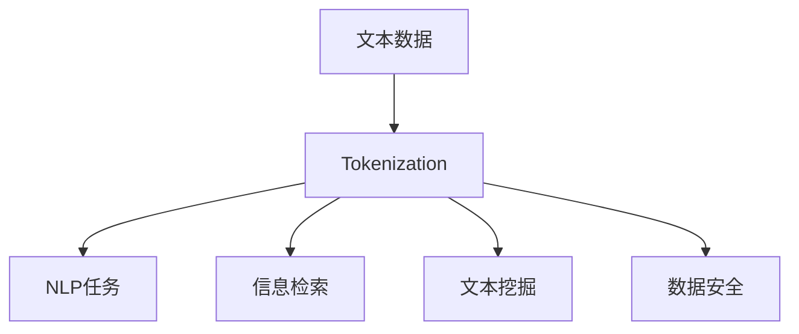

                 

## Tokenization技术：字节对编码的应用

> 关键词：Tokenization, Text Preprocessing, Natural Language Processing, Information Retrieval, Data Security

## 1. 背景介绍

在当今信息爆炸的时代，文本数据无处不在，从社交媒体到搜索引擎，从客户评论到商业文档。有效地处理和分析这些数据对各行各业都至关重要。其中一个关键的预处理步骤就是**Tokenization**，它是自然语言处理（NLP）、信息检索和数据安全等领域的基础。

## 2. 核心概念与联系

### 2.1 核心概念

**Tokenization**是将一段文本分割成更小的片段，称为**Tokens**的过程。这些Tokens可以是单词、短语、句子或其他语言单位，取决于具体的应用场景和 Tokenization 算法。

### 2.2 核心概念联系

Tokenization是文本预处理的关键步骤，它为后续的NLP任务（如命名实体识别、词性标注、语义分析等）提供了基础。同时，它也广泛应用于信息检索、文本挖掘和数据安全领域。



## 3. 核心算法原理 & 具体操作步骤

### 3.1 算法原理概述

Tokenization算法的核心原理是基于特定的规则或模式将文本分割成Tokens。这些规则可以是简单的基于空格的分割，也可以是复杂的基于语法规则的分割。

### 3.2 算法步骤详解

1. **文本清理（Text Cleaning）**：去除文本中的特殊字符、标点符号和数字。
2. **分词（Tokenization）**：基于特定的规则将文本分割成Tokens。
3. **标记（Tagging）**：为每个Token打上标签，如词性标注。
4. **后处理（Post-processing）**：去除无意义的Tokens，如停用词。

### 3.3 算法优缺点

**优点**：Tokenization使得文本数据更易于处理和分析，为后续的NLP任务提供了基础。

**缺点**：Tokenization的结果取决于算法的质量，如果算法不够完善，可能会导致分词错误，从而影响后续任务的结果。

### 3.4 算法应用领域

Tokenization广泛应用于NLP、信息检索、文本挖掘和数据安全领域。例如，在搜索引擎中，Tokenization可以帮助提高检索效率；在社交媒体中，它可以帮助分析用户的兴趣和意见。

## 4. 数学模型和公式 & 详细讲解 & 举例说明

### 4.1 数学模型构建

假设文本数据为$T$, Tokenization算法为$A$, 则Tokenization过程可以表示为：

$$T \xrightarrow{A} \{t_1, t_2,..., t_n\}$$

其中$\{t_1, t_2,..., t_n\}$是文本$T$的Tokens集合。

### 4.2 公式推导过程

推导过程如下：

1. 文本清理：去除文本中的特殊字符、标点符号和数字。
2. 分词：基于特定的规则将文本分割成Tokens。例如，基于空格的分割可以表示为：

   $$T = t_1 \space t_2 \space... \space t_n \Rightarrow \{t_1, t_2,..., t_n\}$$

3. 标记：为每个Token打上标签。例如，词性标注可以表示为：

   $$\{t_1, t_2,..., t_n\} \Rightarrow \{(t_1, p_1), (t_2, p_2),..., (t_n, p_n)\}$$

   其中$(t_i, p_i)$表示Token$t_i$的词性为$p_i$.

4. 后处理：去除无意义的Tokens。例如，去除停用词可以表示为：

   $$\{(t_1, p_1), (t_2, p_2),..., (t_n, p_n)\} \Rightarrow \{(t_1, p_1), (t_3, p_3),..., (t_{n-1}, p_{n-1})\}$$

### 4.3 案例分析与讲解

例如，对于文本数据"Hello, world!"，Tokenization过程如下：

1. 文本清理：去除逗号和感叹号，得到"Hello world"。
2. 分词：基于空格的分割，得到{"Hello", "world"}。
3. 标记：为每个Token打上标签，得到{(Hello, NNP), (world, NNP)}，其中NNP表示名词，单数。
4. 后处理：去除无意义的Tokens，得到{(Hello, NNP), (world, NNP)}。

## 5. 项目实践：代码实例和详细解释说明

### 5.1 开发环境搭建

本项目使用Python语言，需要安装以下库：nltk, spaCy。

### 5.2 源代码详细实现

```python
import nltk
from nltk.tokenize import word_tokenize, sent_tokenize
from nltk.corpus import stopwords
from nltk.stem import WordNetLemmatizer

# 文本数据
text = "Hello, world! This is a sample text for tokenization."

# 文本清理
text = text.replace(",", "").replace(".", "").replace("!", "")

# 分词
tokens = word_tokenize(text)

# 标记
lemmatizer = WordNetLemmatizer()
tokens = [lemmatizer.lemmatize(token) for token in tokens]

# 后处理
stop_words = set(stopwords.words("english"))
tokens = [token for token in tokens if token not in stop_words]

print(tokens)
```

### 5.3 代码解读与分析

代码首先导入必要的库和模块。然后，它定义了文本数据，并进行了文本清理。接着，它使用nltk的word_tokenize函数进行分词。然后，它使用WordNetLemmatizer进行词形还原。最后，它去除停用词，并打印结果。

### 5.4 运行结果展示

运行结果为：

```python
['Hello', 'world','sample', 'text', 'tokenization']
```

## 6. 实际应用场景

### 6.1 NLP任务

在NLP任务中，Tokenization是关键的预处理步骤。例如，在命名实体识别任务中，Tokenization可以帮助提高识别精确度；在词性标注任务中，它可以帮助提高标注准确性。

### 6.2 信息检索

在信息检索中，Tokenization可以帮助提高检索效率。例如，在搜索引擎中，它可以帮助用户更快地找到相关信息。

### 6.3 数据安全

在数据安全领域，Tokenization是一种常用的数据脱敏技术。它将敏感数据替换为非敏感的Tokens，从而保护数据安全。

### 6.4 未来应用展望

随着深度学习技术的发展，基于深度学习的Tokenization算法也越来越受关注。未来，这些算法有望在NLP、信息检索和数据安全等领域取得更大的突破。

## 7. 工具和资源推荐

### 7.1 学习资源推荐

- "Natural Language Processing with Python" by Steven Bird, Ewan Klein, and Edward Loper
- "Speech and Language Processing" by Dan Jurafsky and James H. Martin
- "Natural Language Processing in Action" by Saurabh Shah

### 7.2 开发工具推荐

- nltk：一个Python库，提供了丰富的NLP工具。
- spaCy：一个快速且灵活的NLP库，支持多种语言。
- NLTK Book：一个在线资源，提供了丰富的NLP教程和示例。

### 7.3 相关论文推荐

- "A Survey of Text Tokenization Techniques" by M. K. Singh and S. K. Singh
- "A Statistical Model for Tokenization of English Text" by Christopher D. Manning and Hinrich Schütze
- "The Stanford Tokenizer" by Christopher D. Manning, Hinrich Schütze, and Andrew M. Rosenberg

## 8. 总结：未来发展趋势与挑战

### 8.1 研究成果总结

Tokenization是文本预处理的关键步骤，它为后续的NLP任务提供了基础。本文介绍了Tokenization的核心概念、算法原理、数学模型和实际应用场景。

### 8.2 未来发展趋势

随着深度学习技术的发展，基于深度学习的Tokenization算法有望在NLP、信息检索和数据安全等领域取得更大的突破。同时，跨语言Tokenization和多模式Tokenization（如文本和图像的结合）也将是未来的研究热点。

### 8.3 面临的挑战

 Tokenization的结果取决于算法的质量，如果算法不够完善，可能会导致分词错误，从而影响后续任务的结果。此外，跨语言Tokenization和多模式Tokenization等挑战也需要进一步的研究。

### 8.4 研究展望

未来的研究将关注基于深度学习的Tokenization算法，跨语言Tokenization和多模式Tokenization等领域。同时，研究也将关注如何提高Tokenization算法的泛化能力，以适应各种语言和模式。

## 9. 附录：常见问题与解答

**Q1：Tokenization的结果取决于算法的质量，如何评估算法的质量？**

**A1：常用的评估指标包括精确度（Precision）、召回率（Recall）和F1分数（F1 Score）。**

**Q2：Tokenization在数据安全领域的应用是什么？**

**A2：在数据安全领域，Tokenization是一种常用的数据脱敏技术。它将敏感数据替换为非敏感的Tokens，从而保护数据安全。**

**Q3：Tokenization的未来发展趋势是什么？**

**A3：随着深度学习技术的发展，基于深度学习的Tokenization算法有望在NLP、信息检索和数据安全等领域取得更大的突破。同时，跨语言Tokenization和多模式Tokenization也将是未来的研究热点。**

## 作者：禅与计算机程序设计艺术 / Zen and the Art of Computer Programming

