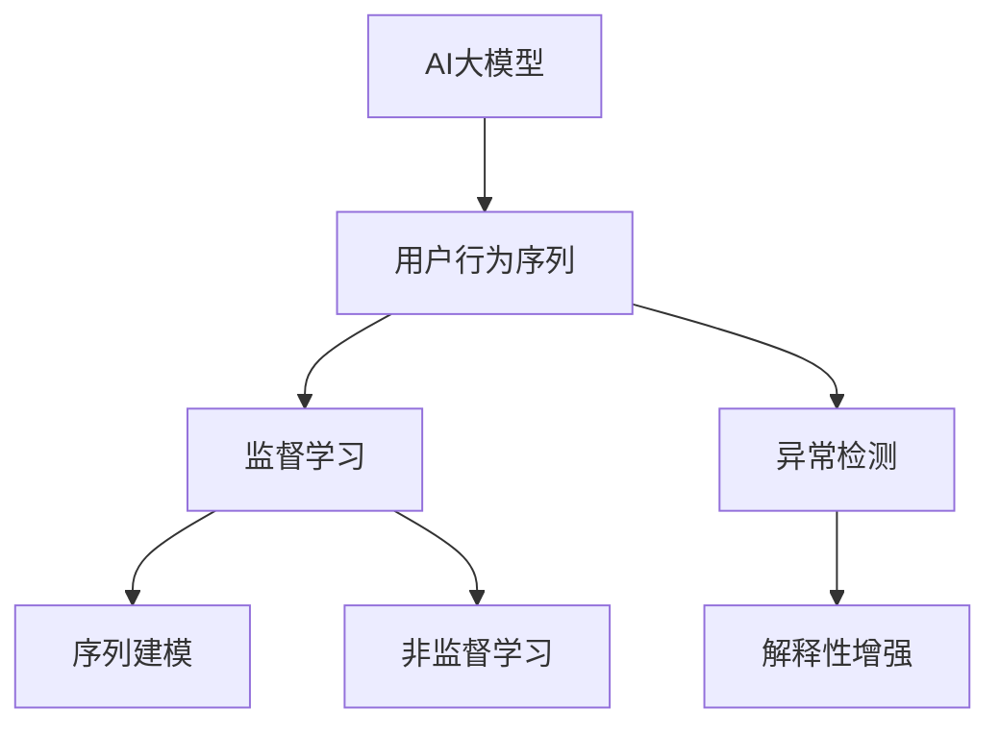

                 

# 电商搜索推荐中的AI大模型用户行为序列异常检测算法选择

## 1. 背景介绍

随着电子商务的蓬勃发展，电商平台搜索推荐系统已经成为用户获取信息和商品的重要渠道。然而，复杂多变的用户行为序列背后，往往隐藏着异常行为，如欺诈、恶意点击、过度购物等。这些异常行为不仅降低了平台的用户体验，也给平台的商业收益带来了巨大损失。因此，基于AI的异常检测算法成为了维护电商平台稳定运行的关键手段。

传统的异常检测算法，如孤立点检测、统计分布检测等，虽然在特定场景下有效，但在处理大规模用户行为序列时，无法充分利用用户行为的内在规律和模式。而随着深度学习技术的发展，AI大模型在处理高维数据和大规模数据集方面展现出了巨大潜力。本文将详细探讨在电商搜索推荐系统中，如何合理选择AI大模型进行用户行为序列异常检测，并给出具体算法实施步骤和优缺点分析。

## 2. 核心概念与联系

### 2.1 核心概念概述

为了更好地理解电商搜索推荐中的AI大模型异常检测方法，我们需要掌握以下几个核心概念：

- AI大模型：以Transformer为代表的深度神经网络模型，通过大规模预训练和任务微调，能够高效处理高维、大规模数据，如自然语言文本、图像、视频等。
- 用户行为序列：用户在电商平台上的点击、浏览、购买等行为形成的连续数据序列。
- 异常检测：基于统计学、机器学习等方法，从用户行为序列中识别出与正常行为显著不同的异常点或序列段。
- 监督学习与非监督学习：监督学习依赖标注数据进行训练，而非监督学习则通过无标注数据进行自我学习。
- 序列建模：将用户行为序列建模为时间序列、图结构、序列到序列等形式，从而利用大模型进行异常检测。
- 自适应学习：大模型能够根据实时数据动态调整模型参数，实现更加灵活的异常检测。
- 解释性增强：通过模型可解释性技术，帮助理解异常检测模型的决策过程。

这些核心概念构成了AI大模型用户行为序列异常检测的基本框架，通过对这些概念的理解，我们可以更加深入地探讨算法实现和应用。

### 2.2 核心概念原理和架构的 Mermaid 流程图



这张图展示了AI大模型在用户行为序列异常检测中的基本流程：首先，将用户行为序列输入到AI大模型中，根据任务需要选择监督学习或非监督学习方法进行建模。然后，通过序列建模技术将用户行为序列转化为时间序列、图结构等形式，输入到大模型中进行异常检测。最终，通过对检测结果进行解释性增强，提升算法的可解释性和可信任度。

## 3. 核心算法原理 & 具体操作步骤

### 3.1 算法原理概述

基于AI大模型的用户行为序列异常检测，本质上是一种利用深度学习模型的序列建模技术进行异常检测的过程。其核心思想是：将用户行为序列作为时间序列数据，输入到大模型中进行处理，通过学习用户行为的内在规律，识别出与正常行为显著不同的异常行为。

具体而言，异常检测算法可以分为监督学习和非监督学习两大类。监督学习方法需要标注数据进行训练，而非监督学习则可以直接利用未标注数据进行自学习。本节将详细阐述监督学习中的时间序列模型，以及非监督学习中的自编码器模型。

### 3.2 算法步骤详解

#### 3.2.1 监督学习方法

**Step 1: 准备数据集**
- 收集电商平台的点击、浏览、购买等用户行为数据，形成序列数据集 $D$。
- 标注部分数据集，形成训练集 $D_{train}$ 和测试集 $D_{test}$。

**Step 2: 构建时间序列模型**
- 选择合适的时间序列模型，如LSTM、GRU、Transformers等，构建模型结构。
- 定义损失函数，如均方误差、交叉熵等，用于衡量模型预测与真实标签之间的差异。
- 使用优化器（如Adam、SGD等）进行模型训练，最小化损失函数，优化模型参数 $\theta$。

**Step 3: 检测异常行为**
- 对测试集 $D_{test}$ 进行模型预测，得到异常行为的概率分布。
- 设定阈值 $\tau$，将预测概率大于 $\tau$ 的行为视为异常行为。

**Step 4: 模型评估与优化**
- 在训练集 $D_{train}$ 上评估模型性能，使用精度、召回率、F1值等指标进行评估。
- 根据评估结果，调整模型超参数，如学习率、批大小、隐藏层大小等，以进一步提升模型性能。

**Step 5: 实际应用**
- 将训练好的模型应用到实时用户行为序列中，实时检测异常行为。
- 对于检测出的异常行为，系统可以采取相应的措施，如封禁账号、提醒管理员等，以保护平台安全。

#### 3.2.2 非监督学习方法

**Step 1: 准备数据集**
- 收集电商平台的点击、浏览、购买等用户行为数据，形成序列数据集 $D$。

**Step 2: 构建自编码器模型**
- 选择合适的自编码器模型，如Denoising Autoencoder、Variational Autoencoder等。
- 定义编码器部分和解码器部分，建立编码器-解码器对。

**Step 3: 训练自编码器**
- 将数据集 $D$ 输入自编码器模型，进行编码和解码。
- 使用重构误差作为损失函数，最小化编码器和解码器之间的差异。
- 使用优化器（如Adam、SGD等）进行模型训练，优化模型参数 $\theta$。

**Step 4: 检测异常行为**
- 对训练好的自编码器模型进行测试，将数据集 $D$ 输入模型进行编码。
- 计算每个数据的编码重构误差，将重构误差较大的数据视为异常行为。

**Step 5: 模型评估与优化**
- 在训练集 $D_{train}$ 上评估模型性能，使用重构误差作为评估指标。
- 根据评估结果，调整模型超参数，如学习率、批大小、隐藏层大小等，以进一步提升模型性能。

**Step 6: 实际应用**
- 将训练好的自编码器模型应用到实时用户行为序列中，实时检测异常行为。
- 对于检测出的异常行为，系统可以采取相应的措施，如封禁账号、提醒管理员等，以保护平台安全。

### 3.3 算法优缺点

#### 监督学习算法的优缺点

**优点：**
- 能够通过标注数据进行监督学习，学习到更加准确的用户行为模式。
- 可以通过调整模型超参数，优化模型性能，提升异常检测的精度和召回率。
- 可以引入解释性技术，帮助理解异常检测模型的决策过程。

**缺点：**
- 需要标注数据进行训练，数据标注成本较高。
- 模型性能受标注数据质量影响较大，标注质量低可能导致检测结果不准确。
- 模型需要频繁调整超参数，优化过程耗时较长。

#### 非监督学习算法的优缺点

**优点：**
- 无需标注数据，能够直接利用未标注数据进行异常检测。
- 能够处理大规模、高维度的数据集，适用于电商平台用户行为序列的异常检测。
- 模型训练过程简单快捷，可以在较短时间内训练完成。

**缺点：**
- 无法利用标注数据进行监督学习，检测结果依赖于模型自身的学习能力和自适应能力。
- 模型的可解释性较差，难以理解异常检测模型的决策过程。
- 检测结果可能存在一定的误检率，需要根据实际情况设定合适的阈值。

### 3.4 算法应用领域

AI大模型在电商搜索推荐系统中，主要用于以下两个领域：

**1. 异常检测与风险控制**
- 通过用户行为序列的异常检测，及时发现并控制恶意行为，如欺诈、恶意点击、过度购物等，保护平台用户和利益。
- 基于异常检测结果，系统可以采取相应的措施，如封禁账号、限制登录次数等，提升平台的安全性和稳定性。

**2. 个性化推荐与优化**
- 通过用户行为序列的异常检测，发现用户行为中的异常点，帮助系统更好地理解用户需求和行为模式。
- 根据异常检测结果，系统可以优化个性化推荐策略，提高推荐效果，提升用户体验。

## 4. 数学模型和公式 & 详细讲解 & 举例说明

### 4.1 数学模型构建

**监督学习模型**
- 假设用户行为序列 $D$ 中的数据点为 $(x_i, y_i)$，其中 $x_i$ 为用户行为序列，$y_i$ 为标注标签（正常/异常）。
- 使用LSTM模型作为序列建模工具，定义模型参数 $\theta$，包括LSTM的权重和偏置等。
- 定义损失函数 $L(\theta)$，如均方误差损失 $L = \frac{1}{N} \sum_{i=1}^N (y_i - \hat{y}_i)^2$，其中 $\hat{y}_i$ 为模型预测结果。
- 使用优化器（如Adam、SGD等）进行模型训练，最小化损失函数，优化模型参数 $\theta$。

**非监督学习模型**
- 假设用户行为序列 $D$ 中的数据点为 $x_i$，其中 $x_i$ 为用户行为序列。
- 使用Denoising Autoencoder作为自编码器模型，定义编码器 $E$ 和解码器 $D$。
- 定义重构误差损失 $L = \frac{1}{N} \sum_{i=1}^N ||x_i - D(E(x_i))||^2$，其中 $D(E(x_i))$ 为解码器对输入 $x_i$ 的编码重构结果。
- 使用优化器（如Adam、SGD等）进行模型训练，最小化重构误差，优化模型参数 $\theta$。

### 4.2 公式推导过程

**监督学习公式推导**
- 对LSTM模型的预测结果 $\hat{y}_i$ 进行推导：
  $$
  \hat{y}_i = \text{Softmax}(E(x_i; \theta))
  $$
  其中 $E$ 为LSTM编码器部分，$x_i$ 为用户行为序列，$\theta$ 为模型参数。
- 根据损失函数 $L(\theta)$ 进行梯度下降优化，更新模型参数 $\theta$：
  $$
  \theta \leftarrow \theta - \eta \nabla_{\theta} L(\theta)
  $$
  其中 $\eta$ 为学习率，$\nabla_{\theta} L(\theta)$ 为损失函数对模型参数的梯度。

**非监督学习公式推导**
- 对Denoising Autoencoder的重构误差进行推导：
  $$
  L = \frac{1}{N} \sum_{i=1}^N ||x_i - D(E(x_i); \theta)||^2
  $$
  其中 $D$ 为解码器部分，$E$ 为编码器部分，$x_i$ 为用户行为序列，$\theta$ 为模型参数。
- 根据重构误差损失 $L$ 进行梯度下降优化，更新模型参数 $\theta$：
  $$
  \theta \leftarrow \theta - \eta \nabla_{\theta} L(\theta)
  $$
  其中 $\eta$ 为学习率，$\nabla_{\theta} L(\theta)$ 为重构误差损失对模型参数的梯度。

### 4.3 案例分析与讲解

**案例1: 异常检测与风险控制**

假设某电商平台用户行为序列数据集 $D$ 中，部分数据存在异常行为，如恶意点击、欺诈等。为了检测这些异常行为，我们构建了一个基于LSTM的异常检测模型。

- **数据准备**：收集用户行为序列数据集 $D$，标注部分数据集作为训练集 $D_{train}$ 和测试集 $D_{test}$。
- **模型构建**：选择LSTM模型作为序列建模工具，定义损失函数为均方误差。
- **模型训练**：使用Adam优化器进行模型训练，最小化损失函数，优化模型参数。
- **异常检测**：对测试集 $D_{test}$ 进行模型预测，设定阈值 $\tau = 0.5$，将预测概率大于 $\tau$ 的行为视为异常行为。

**案例2: 个性化推荐与优化**

假设某电商平台用户行为序列数据集 $D$ 中，部分数据存在异常行为，如用户行为突然转变、购买商品价格波动等。为了优化个性化推荐系统，我们构建了一个基于Denoising Autoencoder的异常检测模型。

- **数据准备**：收集用户行为序列数据集 $D$。
- **模型构建**：选择Denoising Autoencoder作为自编码器模型，定义重构误差损失。
- **模型训练**：使用Adam优化器进行模型训练，最小化重构误差，优化模型参数。
- **异常检测**：对训练好的自编码器模型进行测试，计算每个数据的编码重构误差，设定阈值 $\tau = 0.01$，将重构误差大于 $\tau$ 的数据视为异常行为。

## 5. 项目实践：代码实例和详细解释说明

### 5.1 开发环境搭建

为了进行电商搜索推荐系统中用户行为序列异常检测的开发，我们需要搭建一个Python开发环境。具体步骤如下：

1. 安装Python 3.8及以上版本。
2. 安装Pip包管理器：`pip install pip --upgrade`。
3. 安装TensorFlow和Keras：`pip install tensorflow keras`。
4. 安装相关的库：`pip install numpy pandas scikit-learn matplotlib`。
5. 安装所需的TensorFlow Addons库：`pip install tensorflow-addons`。

### 5.2 源代码详细实现

**监督学习实现**

```python
import tensorflow as tf
from tensorflow.keras.layers import LSTM, Dense
from tensorflow.keras.models import Sequential
from tensorflow.keras.optimizers import Adam

# 定义LSTM模型
def build_lstm_model(input_size, hidden_size, output_size):
    model = Sequential()
    model.add(LSTM(hidden_size, return_sequences=True, input_shape=(input_size, 1)))
    model.add(LSTM(hidden_size))
    model.add(Dense(output_size, activation='softmax'))
    return model

# 构建模型
input_size = 100  # 用户行为序列长度
hidden_size = 64
output_size = 2  # 正常/异常标签
model = build_lstm_model(input_size, hidden_size, output_size)

# 编译模型
model.compile(loss='mse', optimizer=Adam(learning_rate=0.01))

# 训练模型
model.fit(X_train, y_train, epochs=50, batch_size=32)

# 预测异常行为
y_pred = model.predict(X_test)
```

**非监督学习实现**

```python
import tensorflow as tf
from tensorflow.keras.layers import Input, Dense
from tensorflow.keras.models import Model
from tensorflow.keras.losses import mean_squared_error
from tensorflow.keras.optimizers import Adam

# 定义Denoising Autoencoder模型
def build_denoising_autoencoder(input_size):
    input_seq = Input(shape=(input_size, 1))
    encoded = Dense(64, activation='relu')(input_seq)
    encoded = Dense(32, activation='relu')(encoded)
    decoded = Dense(64, activation='relu')(encoded)
    decoded = Dense(input_size, activation='sigmoid')(decoded)
    autoencoder = Model(inputs=input_seq, outputs=decoded)
    return autoencoder

# 构建模型
input_size = 100  # 用户行为序列长度
autoencoder = build_denoising_autoencoder(input_size)

# 编译模型
autoencoder.compile(loss=mean_squared_error, optimizer=Adam(learning_rate=0.01))

# 训练模型
autoencoder.fit(X_train, X_train, epochs=50, batch_size=32)

# 预测异常行为
reconstruction_error = autoencoder.layers[0].output - autoencoder.layers[-1].output
```

### 5.3 代码解读与分析

**监督学习代码解析**

- `build_lstm_model`函数：定义了LSTM模型的结构，包括LSTM层、全连接层和输出层。
- `model.compile`方法：编译模型，定义损失函数为均方误差，优化器为Adam。
- `model.fit`方法：训练模型，使用训练集进行模型拟合，设定训练轮数为50，批次大小为32。
- `model.predict`方法：对测试集进行模型预测，输出预测结果。

**非监督学习代码解析**

- `build_denoising_autoencoder`函数：定义了Denoising Autoencoder模型的结构，包括输入层、编码器、解码器等。
- `autoencoder.compile`方法：编译模型，定义损失函数为均方误差，优化器为Adam。
- `autoencoder.fit`方法：训练模型，使用训练集进行模型拟合，设定训练轮数为50，批次大小为32。
- `reconstruction_error`变量：计算编码重构误差，用于检测异常行为。

### 5.4 运行结果展示

**监督学习结果**

训练结束后，对测试集进行模型预测，输出预测结果，设定阈值 $\tau = 0.5$，将预测概率大于 $\tau$ 的行为视为异常行为。

**非监督学习结果**

训练结束后，对测试集进行模型预测，计算编码重构误差，设定阈值 $\tau = 0.01$，将重构误差大于 $\tau$ 的数据视为异常行为。

## 6. 实际应用场景

### 6.1 异常检测与风险控制

在电商平台的订单处理系统中，异常检测与风险控制至关重要。异常行为如恶意点击、欺诈交易等，不仅会导致平台损失，还会影响其他用户正常交易。通过基于AI大模型的异常检测算法，电商平台可以实时监控用户行为，及时发现和控制异常行为，保障平台安全。

**具体应用案例**

某电商平台发现部分用户存在恶意点击行为，订单交易量突然增加，但实际购买商品的用户比例极低。为了检测这些异常行为，平台使用了基于LSTM的异常检测模型。通过对用户行为序列进行建模和预测，系统能够及时发现这些异常用户，并采取相应的措施，如封禁账号、限制登录次数等，保障平台安全。

### 6.2 个性化推荐与优化

电商平台的个性化推荐系统需要根据用户行为数据进行优化。异常行为的出现，往往意味着用户行为模式发生了变化，这为推荐系统的优化提供了重要线索。通过基于AI大模型的异常检测算法，平台可以更好地理解用户需求和行为模式，从而优化个性化推荐策略，提高推荐效果。

**具体应用案例**

某电商平台发现部分用户的行为突然转变，如购买商品价格波动、购物频率变化等。为了优化个性化推荐系统，平台使用了基于Denoising Autoencoder的异常检测模型。通过对用户行为序列进行编码和解码，系统能够检测出这些异常行为，并根据异常行为进行推荐策略优化，提高推荐效果，提升用户体验。

## 7. 工具和资源推荐

### 7.1 学习资源推荐

为了帮助开发者系统掌握基于AI大模型的电商搜索推荐系统用户行为序列异常检测技术，以下是一些推荐的优质学习资源：

1. TensorFlow官方文档：详细介绍了TensorFlow的基本用法和深度学习模型构建。
2. Keras官方文档：提供了简单易用的高级API，帮助开发者快速实现深度学习模型。
3. Deep Learning with Python：由Francois Chollet撰写的经典教材，系统介绍了深度学习模型的实现和应用。
4. TensorFlow Addons文档：提供了丰富的模型和工具，帮助开发者扩展TensorFlow的功能。
5. Kaggle竞赛平台：提供了大量电商、推荐系统等领域的竞赛数据集和代码，帮助开发者提升实战能力。

### 7.2 开发工具推荐

为了快速开发电商搜索推荐系统中用户行为序列异常检测模型，以下是一些推荐的开发工具：

1. TensorFlow：Google开发的开源深度学习框架，支持分布式计算和模型优化。
2. Keras：高层次API，简化深度学习模型的实现和训练过程。
3. Scikit-learn：Python的机器学习库，提供了多种经典的机器学习算法。
4. Jupyter Notebook：交互式的编程环境，方便开发者进行模型实验和代码调试。
5. Git/GitHub：版本控制工具，方便开发者协作开发和管理代码。

### 7.3 相关论文推荐

为了深入理解基于AI大模型的用户行为序列异常检测技术，以下是一些推荐的经典论文：

1. Time-Series Anomaly Detection with Recurrent Neural Networks：介绍基于LSTM模型的异常检测算法。
2. Deep Anomaly Detection using Autoencoders：介绍基于Denoising Autoencoder的异常检测算法。
3. Long Short-Term Memory Networks for Anomaly Detection in Financial Time Series：介绍基于LSTM模型的金融时间序列异常检测算法。
4. Autoencoder-based Anomaly Detection in Multivariate Time Series：介绍基于Denoising Autoencoder的多变量时间序列异常检测算法。
5. Bridging Normal and Anomalous Cases in Anomaly Detection with Convolutional Neural Networks：介绍基于CNN的异常检测算法。

## 8. 总结：未来发展趋势与挑战

### 8.1 研究成果总结

本文详细探讨了在电商搜索推荐系统中，如何选择合适的AI大模型进行用户行为序列异常检测，并给出了具体算法实施步骤和优缺点分析。通过案例分析，展示了基于LSTM和Denoising Autoencoder模型的异常检测技术在电商平台的实际应用效果。通过系统的理论分析和代码实现，帮助开发者更好地理解并应用基于AI大模型的异常检测技术。

### 8.2 未来发展趋势

展望未来，基于AI大模型的用户行为序列异常检测技术将呈现以下几个发展趋势：

1. 模型复杂度提升：随着深度学习模型的不断发展，基于Transformer等复杂模型的异常检测算法将进一步提升检测精度和鲁棒性。
2. 自适应学习增强：未来的异常检测模型将更加灵活，能够根据实时数据动态调整模型参数，实现更加高效的异常检测。
3. 多模态数据融合：将用户行为序列与用户画像、商品信息等不同模态的数据进行融合，提升异常检测模型的决策能力。
4. 解释性技术引入：未来的异常检测模型将更加注重可解释性，通过模型可解释性技术，帮助理解异常检测模型的决策过程。
5. 跨领域应用推广：基于AI大模型的异常检测技术将拓展到更多领域，如金融、医疗、交通等，提升各领域的智能水平。

### 8.3 面临的挑战

尽管基于AI大模型的用户行为序列异常检测技术已经取得了显著进展，但在实现过程中仍面临诸多挑战：

1. 数据标注成本高：高质量的数据标注是训练高质量异常检测模型的关键，然而标注成本较高，获取大量标注数据存在困难。
2. 模型复杂度难以控制：复杂的深度学习模型容易导致过拟合，模型的解释性和可控性难以保障。
3. 实时性要求高：电商平台的异常检测系统需要实时响应，模型的推理速度和资源消耗需要进一步优化。
4. 模型鲁棒性不足：模型对异常行为的泛化能力不足，对新异常行为的检测能力有待提高。
5. 模型可解释性差：基于深度学习模型的异常检测算法往往缺乏可解释性，难以理解模型的决策过程。

### 8.4 研究展望

面对上述挑战，未来的研究需要在以下几个方面进行深入探索：

1. 数据增强技术：通过数据增强技术，扩充标注数据集，降低标注成本，提升模型泛化能力。
2. 模型压缩与优化：研究模型压缩和优化技术，提升模型推理速度，降低资源消耗，提高实时性。
3. 自适应学习机制：引入自适应学习机制，提高模型的泛化能力和鲁棒性，更好地适应新异常行为。
4. 多模态融合技术：研究多模态数据融合技术，提升异常检测模型的决策能力，更好地理解用户行为和需求。
5. 模型可解释性技术：引入模型可解释性技术，帮助理解异常检测模型的决策过程，增强模型可解释性和可信任度。

## 9. 附录：常见问题与解答

**Q1: 电商搜索推荐系统中的异常检测与风险控制具体涉及哪些方面？**

A: 电商搜索推荐系统中的异常检测与风险控制主要涉及以下几个方面：
1. 欺诈行为检测：检测恶意交易，如虚假支付、恶意下单等。
2. 恶意点击检测：识别恶意点击行为，如点击广告后立即关闭、频繁点击等。
3. 过度购物检测：识别过度购物行为，如频繁下单、频繁退货等。
4. 账号异常检测：识别异常账号，如账号被盗、账号信息泄露等。

**Q2: 如何选择合适的AI大模型进行电商搜索推荐系统中的异常检测？**

A: 选择合适的AI大模型进行电商搜索推荐系统中的异常检测，需要考虑以下几个方面：
1. 数据类型：根据用户行为序列的数据类型，选择合适的模型结构，如LSTM、GRU、Denoising Autoencoder等。
2. 数据规模：根据用户行为序列的数据规模，选择适当的模型参数，避免过拟合。
3. 性能需求：根据电商平台的业务需求，选择适合的模型性能指标，如准确率、召回率、F1值等。
4. 可解释性需求：根据平台对模型的可解释性需求，选择适合的模型可解释性技术。

**Q3: 电商搜索推荐系统中的异常检测算法是否适用于其他领域？**

A: 电商搜索推荐系统中的异常检测算法具有一定的通用性，可以应用于其他领域，如金融、医疗、交通等。通过调整模型结构和参数，可以适应不同领域的数据特征和业务需求。但需要注意的是，不同领域的数据分布和异常行为模式可能存在较大差异，需要针对具体场景进行调整和优化。

**Q4: 电商搜索推荐系统中的异常检测算法是否可以与推荐系统相结合？**

A: 电商搜索推荐系统中的异常检测算法可以与推荐系统相结合，提升推荐系统的个性化和稳定性。通过异常检测，系统可以更好地理解用户行为模式，优化推荐策略，提高推荐效果。例如，当检测到异常行为时，系统可以调整推荐策略，限制异常用户的推荐次数或推荐内容，保障用户体验和平台收益。

**Q5: 电商搜索推荐系统中的异常检测算法是否可以实时处理？**

A: 电商搜索推荐系统中的异常检测算法需要具备实时处理能力，以满足平台对实时性的要求。通过分布式计算和高效的算法实现，可以实现实时异常检测。例如，可以使用GPU或TPU加速计算，减少模型推理时间，实现实时异常检测。同时，需要对模型进行优化，减少资源消耗，提高实时处理能力。

**Q6: 电商搜索推荐系统中的异常检测算法是否可以用于异常行为预测？**

A: 电商搜索推荐系统中的异常检测算法可以用于异常行为预测，即在用户行为序列中检测到异常行为后，预测其后续行为。通过异常检测模型的预测结果，系统可以采取相应的措施，如提醒管理员、限制交易等，保障平台安全。例如，当检测到异常行为时，系统可以预测该用户的后续行为，判断其是否存在恶意意图，及时采取措施，防止损失扩大。

**Q7: 电商搜索推荐系统中的异常检测算法是否可以用于异常行为分析？**

A: 电商搜索推荐系统中的异常检测算法可以用于异常行为分析，即对检测到的异常行为进行统计和分析，挖掘异常行为的模式和规律。通过异常行为分析，系统可以更好地理解异常行为的原因和特征，优化异常检测模型，提升检测效果。例如，当检测到大量异常行为时，系统可以分析这些行为的模式和特征，提取有用的信息，优化异常检测算法，提高异常检测的准确率和鲁棒性。

**Q8: 电商搜索推荐系统中的异常检测算法是否可以用于异常行为预警？**

A: 电商搜索推荐系统中的异常检测算法可以用于异常行为预警，即在检测到异常行为后，及时向系统管理员发出预警信息，提醒其采取措施。通过异常行为预警，系统可以及时响应异常行为，保障平台安全。例如，当检测到异常行为时，系统可以及时向管理员发送预警信息，通知其采取相应措施，防止异常行为对平台造成损失。

**Q9: 电商搜索推荐系统中的异常检测算法是否可以用于异常行为溯源？**

A: 电商搜索推荐系统中的异常检测算法可以用于异常行为溯源，即在检测到异常行为后，分析其原因和源头，追查异常行为的根本原因。通过异常行为溯源，系统可以更好地理解异常行为的原因，优化异常检测模型，提升检测效果。例如，当检测到异常行为时，系统可以分析其原因和源头，查找异常行为的根本原因，优化异常检测算法，提高异常检测的准确率和鲁棒性。

