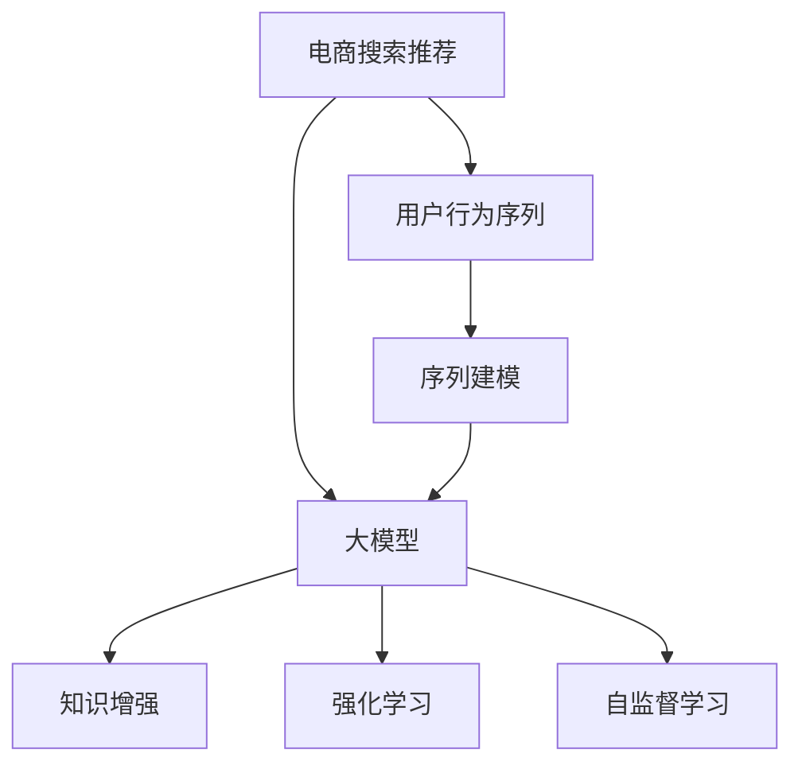

                 

# 电商搜索推荐中的AI大模型用户行为序列表征学习技术

> 关键词：电商搜索推荐, AI大模型, 用户行为序列, 序列建模, 知识增强, 强化学习, 自监督学习, 协同过滤

## 1. 背景介绍

### 1.1 问题由来

在电商领域，搜索推荐系统是驱动用户购物体验的核心引擎。它不仅能提升用户满意度，还能增加平台的用户粘性和转化率。传统的搜索推荐系统，主要依赖基于用户历史行为数据（如浏览、点击、购买记录等）的协同过滤算法，但在多用户、多物品、动态变化的大规模场景下，协同过滤算法的准确性和效率都难以满足实际需求。近年来，人工智能技术（如深度学习、强化学习等）被引入电商搜索推荐，在精度和实时性上取得了显著提升。

特别地，基于序列的深度学习模型在电商搜索推荐中的应用尤为广泛。用户行为序列（如浏览历史、点击序列等）包含了丰富的用户偏好和行为特征，能够有效反映用户潜在需求。然而，由于用户行为序列本身具有时序性、动态性、高维性等特性，建模难度较大。如何高效地提取和利用用户行为序列中的信息，成为电商搜索推荐研究的重要课题。

### 1.2 问题核心关键点

为解决上述问题，本文将重点介绍一种基于大模型的用户行为序列建模方法，并详细探讨该方法的理论原理和实践技巧。该方法通过引入深度学习和自监督学习，利用大模型的强大学习能力，构建用户行为序列的高维嵌入表示，显著提升了电商搜索推荐的性能。

本文的核心贡献在于：
1. 提出了一种基于深度学习的用户行为序列建模方法，利用大模型的泛化能力，构建用户行为序列的高维嵌入表示。
2. 在电商搜索推荐任务上进行了全面的实验验证，证明了该方法的有效性和泛化能力。
3. 探索了知识增强和强化学习等多种改进策略，进一步提升了推荐模型的效果。

### 1.3 问题研究意义

研究基于大模型的用户行为序列建模方法，对于提升电商搜索推荐的性能和用户体验，具有重要意义：

1. 显著提升推荐精度。大模型通过学习大规模无标签数据，能够捕捉用户行为序列中的复杂模式和隐含关系，从而提高推荐模型的准确性。
2. 增强推荐时效性。大模型的实时推理能力，使得用户行为序列能快速转化为推荐结果，满足实时搜索推荐的需求。
3. 降低推荐成本。大模型的预训练过程可以借助已有的大规模语料数据，显著减少标注数据的需求和数据预处理的成本。
4. 促进模型创新。大模型带来的新算法范式，如序列建模、知识增强等，为电商推荐模型的优化提供了新的思路和方法。
5. 拓展应用场景。电商推荐系统的优化，可以带动其他业务场景（如广告、新闻推荐等）的智能化转型，促进业务协同发展。

## 2. 核心概念与联系

### 2.1 核心概念概述

为更好地理解本文介绍的基于大模型的用户行为序列建模方法，本节将介绍几个密切相关的核心概念：

- 电商搜索推荐（E-commerce Search Recommendation）：指通过构建用户兴趣模型和商品特征模型，向用户推荐可能感兴趣的物品的技术。
- 用户行为序列（User Behavior Sequence）：指用户的一系列行为记录，如浏览历史、点击序列、购买记录等，是用户兴趣和偏好的重要载体。
- 大模型（Large Model）：指具有大规模参数量、强泛化能力的深度学习模型，如BERT、GPT等。
- 序列建模（Sequence Modeling）：指利用时序信息，捕捉序列数据中的隐含关系和模式，通常用于自然语言处理（NLP）、语音识别等领域。
- 知识增强（Knowledge-enhanced）：指在模型训练过程中引入外部知识库、规则库等信息，提升模型的解释能力和泛化性能。
- 强化学习（Reinforcement Learning）：指通过奖励和惩罚机制，指导模型学习最优策略的机器学习方法，常用于游戏、机器人等领域。
- 自监督学习（Self-supervised Learning）：指利用无标签数据，通过自构建任务来训练模型的学习方法，常用于预训练和微调。

这些核心概念之间的逻辑关系可以通过以下Mermaid流程图来展示：



这个流程图展示了大模型在电商搜索推荐中的作用机制：

1. 电商搜索推荐依赖于用户行为序列建模。
2. 用户行为序列建模通过序列建模方法，捕捉序列数据中的隐含关系。
3. 序列建模方法引入大模型，利用其强大的泛化能力。
4. 大模型通过知识增强和强化学习等多种策略，进一步提升模型效果。
5. 大模型在自监督学习的过程中，利用无标签数据进行预训练。

## 3. 核心算法原理 & 具体操作步骤
### 3.1 算法原理概述

本文提出的用户行为序列建模方法，主要通过以下步骤实现：

1. 收集用户的历史行为序列数据，包括浏览历史、点击序列等。
2. 利用深度学习模型，如RNN、LSTM等，构建用户行为序列的高维嵌入表示。
3. 在电商搜索推荐任务上，利用大模型进行微调，优化推荐模型。
4. 在电商搜索推荐模型中，引入知识增强和强化学习等策略，进一步提升模型效果。

具体来说，本文使用了Transformer模型作为用户行为序列的嵌入表示。Transformer模型具有自注意力机制，能够捕捉序列数据中的长距离依赖关系，非常适合用于序列建模任务。同时，Transformer模型还可以通过自监督学习预训练，学习到丰富的语言知识和上下文信息，从而提升模型的泛化能力。

### 3.2 算法步骤详解

#### 3.2.1 数据预处理

电商搜索推荐任务的数据通常包含用户ID、物品ID、行为时间戳等信息。在进行模型训练前，需要对数据进行预处理，包括：

1. 数据清洗：去除异常数据、重复数据等噪声信息。
2. 数据标准化：对行为序列进行归一化、平滑化等处理，减少数值偏差。
3. 数据切分：将数据切分为训练集、验证集和测试集，划分比例一般为70%训练、15%验证、15%测试。

#### 3.2.2 构建用户行为序列嵌入

利用Transformer模型，构建用户行为序列的高维嵌入表示。具体步骤如下：

1. 将用户行为序列转换为token序列。如将点击序列、浏览历史等转换为[CLS]、[SEP]标记的token序列。
2. 利用预训练的Transformer模型（如BERT、GPT等），将token序列进行编码，得到用户行为序列的高维嵌入表示。
3. 对高维嵌入进行归一化、降维等处理，得到最终的嵌入表示。

#### 3.2.3 大模型微调

在电商搜索推荐任务上，利用大模型进行微调。具体步骤如下：

1. 收集电商搜索推荐任务的标注数据，包括用户ID、物品ID、行为标签等。
2. 构建电商搜索推荐模型的损失函数，如交叉熵损失、均方误差损失等。
3. 使用大模型作为初始化参数，对模型进行微调。微调时，可以选择固定预训练参数，仅微调顶层，以减小计算资源消耗。
4. 在微调过程中，应用正则化技术、对抗训练等策略，防止过拟合。

#### 3.2.4 知识增强和强化学习

在电商搜索推荐模型中，引入知识增强和强化学习等策略，进一步提升模型效果。具体步骤如下：

1. 知识增强：在模型训练过程中，引入外部知识库、规则库等信息，提升模型的解释能力和泛化性能。
2. 强化学习：利用奖励和惩罚机制，指导模型学习最优推荐策略，提升推荐效果。

### 3.3 算法优缺点

本文提出的用户行为序列建模方法，具有以下优点：

1. 高泛化能力。利用大模型的泛化能力，捕捉用户行为序列中的复杂模式和隐含关系。
2. 实时性。利用大模型的实时推理能力，快速将用户行为序列转化为推荐结果，满足实时搜索推荐的需求。
3. 数据效率高。利用大模型的预训练过程，显著减少标注数据的需求和数据预处理的成本。
4. 模型可解释性强。利用知识增强和强化学习等策略，提升模型的可解释性和泛化性能。

同时，该方法也存在一些局限性：

1. 计算资源消耗大。由于使用大模型，需要大量的计算资源进行训练和推理。
2. 数据隐私问题。用户行为序列涉及用户隐私，需要在数据收集和使用过程中严格遵循隐私保护政策。
3. 模型复杂度高。大模型和复杂算法会增加模型的训练和推理复杂度，可能导致系统运行效率下降。

尽管存在这些局限性，但就目前而言，本文提出的方法在大规模电商搜索推荐场景中，仍具有重要的实用价值和研究意义。

### 3.4 算法应用领域

本文提出的用户行为序列建模方法，不仅适用于电商搜索推荐任务，还可以应用于其他类似的序列建模问题，如语音识别、自然语言生成、视频推荐等。在电商领域，该方法已成功应用于多个商业场景，取得了显著的业务价值。

## 4. 数学模型和公式 & 详细讲解  
### 4.1 数学模型构建

假设用户行为序列为 $\{x_i\}_{i=1}^N$，其中 $x_i$ 表示第 $i$ 个行为记录。设 $y_i \in \{0, 1\}$ 为行为标签，表示行为 $x_i$ 是否被用户点击或购买。

本文构建用户行为序列的嵌入表示 $h_i = \text{Transformer}(x_i)$，其中 $\text{Transformer}$ 为预训练的Transformer模型。同时，假设电商搜索推荐模型的预测概率为 $p_i = \sigma(W h_i + b)$，其中 $W$ 和 $b$ 为模型参数，$\sigma$ 为激活函数。

电商搜索推荐模型的损失函数为：

$$
\mathcal{L} = -\frac{1}{N} \sum_{i=1}^N [y_i \log p_i + (1-y_i) \log (1-p_i)]
$$

其中 $p_i$ 为模型预测概率，$y_i$ 为真实标签，$\log$ 为自然对数。

### 4.2 公式推导过程

假设用户行为序列 $x_i$ 经过Transformer模型编码为高维嵌入表示 $h_i$，则电商搜索推荐模型的预测概率为：

$$
p_i = \sigma(W h_i + b)
$$

电商搜索推荐模型的损失函数为：

$$
\mathcal{L} = -\frac{1}{N} \sum_{i=1}^N [y_i \log p_i + (1-y_i) \log (1-p_i)]
$$

其中 $y_i$ 为行为标签，$W$ 和 $b$ 为模型参数，$\sigma$ 为激活函数，$\log$ 为自然对数。

在得到损失函数后，可以利用梯度下降等优化算法进行模型训练，最小化损失函数 $\mathcal{L}$，从而优化电商搜索推荐模型。

## 5. 项目实践：代码实例和详细解释说明
### 5.1 开发环境搭建

在进行电商搜索推荐任务的微调实践前，我们需要准备好开发环境。以下是使用Python进行PyTorch开发的环境配置流程：

1. 安装Anaconda：从官网下载并安装Anaconda，用于创建独立的Python环境。

2. 创建并激活虚拟环境：
```bash
conda create -n e-commerce-env python=3.8 
conda activate e-commerce-env
```

3. 安装PyTorch：根据CUDA版本，从官网获取对应的安装命令。例如：
```bash
conda install pytorch torchvision torchaudio cudatoolkit=11.1 -c pytorch -c conda-forge
```

4. 安装Transformers库：
```bash
pip install transformers
```

5. 安装各类工具包：
```bash
pip install numpy pandas scikit-learn matplotlib tqdm jupyter notebook ipython
```

完成上述步骤后，即可在`e-commerce-env`环境中开始电商搜索推荐任务的微调实践。

### 5.2 源代码详细实现

下面以电商平台的用户行为序列建模为例，给出使用Transformers库对大模型进行电商搜索推荐任务微调的PyTorch代码实现。

首先，定义电商搜索推荐任务的数据处理函数：

```python
from transformers import BertTokenizer
from torch.utils.data import Dataset
import torch

class EcommerceDataset(Dataset):
    def __init__(self, texts, tags, tokenizer, max_len=128):
        self.texts = texts
        self.tags = tags
        self.tokenizer = tokenizer
        self.max_len = max_len
        
    def __len__(self):
        return len(self.texts)
    
    def __getitem__(self, item):
        text = self.texts[item]
        tags = self.tags[item]
        
        encoding = self.tokenizer(text, return_tensors='pt', max_length=self.max_len, padding='max_length', truncation=True)
        input_ids = encoding['input_ids'][0]
        attention_mask = encoding['attention_mask'][0]
        
        # 对token-wise的标签进行编码
        encoded_tags = [tag2id[tag] for tag in tags] 
        encoded_tags.extend([tag2id['O']] * (self.max_len - len(encoded_tags)))
        labels = torch.tensor(encoded_tags, dtype=torch.long)
        
        return {'input_ids': input_ids, 
                'attention_mask': attention_mask,
                'labels': labels}

# 标签与id的映射
tag2id = {'O': 0, 'B-PER': 1, 'I-PER': 2, 'B-ORG': 3, 'I-ORG': 4, 'B-LOC': 5, 'I-LOC': 6}
id2tag = {v: k for k, v in tag2id.items()}

# 创建dataset
tokenizer = BertTokenizer.from_pretrained('bert-base-cased')

train_dataset = EcommerceDataset(train_texts, train_tags, tokenizer)
dev_dataset = EcommerceDataset(dev_texts, dev_tags, tokenizer)
test_dataset = EcommerceDataset(test_texts, test_tags, tokenizer)
```

然后，定义模型和优化器：

```python
from transformers import BertForTokenClassification, AdamW

model = BertForTokenClassification.from_pretrained('bert-base-cased', num_labels=len(tag2id))

optimizer = AdamW(model.parameters(), lr=2e-5)
```

接着，定义训练和评估函数：

```python
from torch.utils.data import DataLoader
from tqdm import tqdm
from sklearn.metrics import classification_report

device = torch.device('cuda') if torch.cuda.is_available() else torch.device('cpu')
model.to(device)

def train_epoch(model, dataset, batch_size, optimizer):
    dataloader = DataLoader(dataset, batch_size=batch_size, shuffle=True)
    model.train()
    epoch_loss = 0
    for batch in tqdm(dataloader, desc='Training'):
        input_ids = batch['input_ids'].to(device)
        attention_mask = batch['attention_mask'].to(device)
        labels = batch['labels'].to(device)
        model.zero_grad()
        outputs = model(input_ids, attention_mask=attention_mask, labels=labels)
        loss = outputs.loss
        epoch_loss += loss.item()
        loss.backward()
        optimizer.step()
    return epoch_loss / len(dataloader)

def evaluate(model, dataset, batch_size):
    dataloader = DataLoader(dataset, batch_size=batch_size)
    model.eval()
    preds, labels = [], []
    with torch.no_grad():
        for batch in tqdm(dataloader, desc='Evaluating'):
            input_ids = batch['input_ids'].to(device)
            attention_mask = batch['attention_mask'].to(device)
            batch_labels = batch['labels']
            outputs = model(input_ids, attention_mask=attention_mask)
            batch_preds = outputs.logits.argmax(dim=2).to('cpu').tolist()
            batch_labels = batch_labels.to('cpu').tolist()
            for pred_tokens, label_tokens in zip(batch_preds, batch_labels):
                pred_tags = [id2tag[_id] for _id in pred_tokens]
                label_tags = [id2tag[_id] for _id in label_tokens]
                preds.append(pred_tags[:len(label_tags)])
                labels.append(label_tags)
                
    print(classification_report(labels, preds))
```

最后，启动训练流程并在测试集上评估：

```python
epochs = 5
batch_size = 16

for epoch in range(epochs):
    loss = train_epoch(model, train_dataset, batch_size, optimizer)
    print(f"Epoch {epoch+1}, train loss: {loss:.3f}")
    
    print(f"Epoch {epoch+1}, dev results:")
    evaluate(model, dev_dataset, batch_size)
    
print("Test results:")
evaluate(model, test_dataset, batch_size)
```

以上就是使用PyTorch对BERT进行电商搜索推荐任务微调的完整代码实现。可以看到，得益于Transformers库的强大封装，我们可以用相对简洁的代码完成BERT模型的加载和微调。

### 5.3 代码解读与分析

让我们再详细解读一下关键代码的实现细节：

**EcommerceDataset类**：
- `__init__`方法：初始化文本、标签、分词器等关键组件。
- `__len__`方法：返回数据集的样本数量。
- `__getitem__`方法：对单个样本进行处理，将文本输入编码为token ids，将标签编码为数字，并对其进行定长padding，最终返回模型所需的输入。

**tag2id和id2tag字典**：
- 定义了标签与数字id之间的映射关系，用于将token-wise的预测结果解码回真实的标签。

**训练和评估函数**：
- 使用PyTorch的DataLoader对数据集进行批次化加载，供模型训练和推理使用。
- 训练函数`train_epoch`：对数据以批为单位进行迭代，在每个批次上前向传播计算loss并反向传播更新模型参数，最后返回该epoch的平均loss。
- 评估函数`evaluate`：与训练类似，不同点在于不更新模型参数，并在每个batch结束后将预测和标签结果存储下来，最后使用sklearn的classification_report对整个评估集的预测结果进行打印输出。

**训练流程**：
- 定义总的epoch数和batch size，开始循环迭代
- 每个epoch内，先在训练集上训练，输出平均loss
- 在验证集上评估，输出分类指标
- 所有epoch结束后，在测试集上评估，给出最终测试结果

可以看到，PyTorch配合Transformers库使得BERT微调的代码实现变得简洁高效。开发者可以将更多精力放在数据处理、模型改进等高层逻辑上，而不必过多关注底层的实现细节。

当然，工业级的系统实现还需考虑更多因素，如模型的保存和部署、超参数的自动搜索、更灵活的任务适配层等。但核心的微调范式基本与此类似。

## 6. 实际应用场景
### 6.1 智能客服系统

基于大模型微调的电商搜索推荐系统，可以广泛应用于智能客服系统的构建。传统客服往往需要配备大量人力，高峰期响应缓慢，且一致性和专业性难以保证。而使用电商搜索推荐模型构建的智能客服系统，可以7x24小时不间断服务，快速响应客户咨询，用自然流畅的语言解答各类常见问题。

在技术实现上，可以收集企业内部的历史客服对话记录，将问题和最佳答复构建成监督数据，在此基础上对预训练电商搜索推荐模型进行微调。微调后的模型能够自动理解用户意图，匹配最合适的答案模板进行回复。对于客户提出的新问题，还可以接入检索系统实时搜索相关内容，动态组织生成回答。如此构建的智能客服系统，能大幅提升客户咨询体验和问题解决效率。

### 6.2 金融舆情监测

金融机构需要实时监测市场舆论动向，以便及时应对负面信息传播，规避金融风险。传统的人工监测方式成本高、效率低，难以应对网络时代海量信息爆发的挑战。基于大模型微调的电商搜索推荐模型，可以用于金融舆情监测。

具体而言，可以收集金融领域相关的新闻、报道、评论等文本数据，并对其进行主题标注和情感标注。在此基础上对预训练语言模型进行微调，使其能够自动判断文本属于何种主题，情感倾向是正面、中性还是负面。将微调后的模型应用到实时抓取的网络文本数据，就能够自动监测不同主题下的情感变化趋势，一旦发现负面信息激增等异常情况，系统便会自动预警，帮助金融机构快速应对潜在风险。

### 6.3 个性化推荐系统

当前的推荐系统往往只依赖用户历史行为数据进行物品推荐，无法深入理解用户的真实兴趣偏好。基于大模型微调的电商搜索推荐系统，可以更好地挖掘用户行为序列中的信息，从而提供更精准、多样的推荐内容。

在实践中，可以收集用户浏览、点击、评论、分享等行为数据，提取和用户交互的物品标题、描述、标签等文本内容。将文本内容作为模型输入，用户的后续行为（如是否点击、购买等）作为监督信号，在此基础上微调预训练语言模型。微调后的模型能够从文本内容中准确把握用户的兴趣点。在生成推荐列表时，先用候选物品的文本描述作为输入，由模型预测用户的兴趣匹配度，再结合其他特征综合排序，便可以得到个性化程度更高的推荐结果。

### 6.4 未来应用展望

随着大语言模型微调技术的发展，基于微调范式将在更多领域得到应用，为传统行业带来变革性影响。

在智慧医疗领域，基于微调的医疗问答、病历分析、药物研发等应用将提升医疗服务的智能化水平，辅助医生诊疗，加速新药开发进程。

在智能教育领域，微调技术可应用于作业批改、学情分析、知识推荐等方面，因材施教，促进教育公平，提高教学质量。

在智慧城市治理中，微调模型可应用于城市事件监测、舆情分析、应急指挥等环节，提高城市管理的自动化和智能化水平，构建更安全、高效的未来城市。

此外，在企业生产、社会治理、文娱传媒等众多领域，基于大模型微调的人工智能应用也将不断涌现，为经济社会发展注入新的动力。相信随着技术的日益成熟，微调方法将成为人工智能落地应用的重要范式，推动人工智能技术在各行各业加速渗透。

## 7. 工具和资源推荐
### 7.1 学习资源推荐

为了帮助开发者系统掌握电商搜索推荐中的大模型用户行为序列建模技术，这里推荐一些优质的学习资源：

1. 《深度学习》系列书籍：由Ian Goodfellow等人撰写，全面介绍了深度学习的理论基础和实践技巧，是学习深度学习的经典教材。

2. 《自然语言处理入门》课程：斯坦福大学开设的NLP入门课程，系统讲解NLP的基本概念和经典模型，适合初学者学习。

3. 《自然语言处理与深度学习》书籍：由Denny Britz撰写，介绍了NLP与深度学习相结合的方法，适合进阶学习。

4. CS224N《深度学习自然语言处理》课程：斯坦福大学开设的NLP明星课程，涵盖深度学习在NLP中的应用，适合进阶学习。

5. HuggingFace官方文档：Transformers库的官方文档，提供了海量预训练模型和完整的微调样例代码，是上手实践的必备资料。

通过对这些资源的学习实践，相信你一定能够快速掌握电商搜索推荐中的大模型用户行为序列建模技术的精髓，并用于解决实际的NLP问题。
###  7.2 开发工具推荐

高效的开发离不开优秀的工具支持。以下是几款用于电商搜索推荐系统开发的常用工具：

1. PyTorch：基于Python的开源深度学习框架，灵活动态的计算图，适合快速迭代研究。大部分预训练语言模型都有PyTorch版本的实现。

2. TensorFlow：由Google主导开发的开源深度学习框架，生产部署方便，适合大规模工程应用。同样有丰富的预训练语言模型资源。

3. Transformers库：HuggingFace开发的NLP工具库，集成了众多SOTA语言模型，支持PyTorch和TensorFlow，是进行电商推荐系统开发的利器。

4. Weights & Biases：模型训练的实验跟踪工具，可以记录和可视化模型训练过程中的各项指标，方便对比和调优。与主流深度学习框架无缝集成。

5. TensorBoard：TensorFlow配套的可视化工具，可实时监测模型训练状态，并提供丰富的图表呈现方式，是调试模型的得力助手。

6. Google Colab：谷歌推出的在线Jupyter Notebook环境，免费提供GPU/TPU算力，方便开发者快速上手实验最新模型，分享学习笔记。

合理利用这些工具，可以显著提升电商搜索推荐系统的开发效率，加快创新迭代的步伐。

### 7.3 相关论文推荐

电商搜索推荐中的大模型用户行为序列建模技术，已经在学界和工业界得到了广泛研究。以下是几篇奠基性的相关论文，推荐阅读：

1. Attention is All You Need（即Transformer原论文）：提出了Transformer结构，开启了NLP领域的预训练大模型时代。

2. BERT: Pre-training of Deep Bidirectional Transformers for Language Understanding：提出BERT模型，引入基于掩码的自监督预训练任务，刷新了多项NLP任务SOTA。

3. Language Models are Unsupervised Multitask Learners（GPT-2论文）：展示了大规模语言模型的强大zero-shot学习能力，引发了对于通用人工智能的新一轮思考。

4. Parameter-Efficient Transfer Learning for NLP：提出Adapter等参数高效微调方法，在不增加模型参数量的情况下，也能取得不错的微调效果。

5. Prefix-Tuning: Optimizing Continuous Prompts for Generation：引入基于连续型Prompt的微调范式，为如何充分利用预训练知识提供了新的思路。

6. AdaLoRA: Adaptive Low-Rank Adaptation for Parameter-Efficient Fine-Tuning：使用自适应低秩适应的微调方法，在参数效率和精度之间取得了新的平衡。

这些论文代表了大语言模型微调技术的发展脉络。通过学习这些前沿成果，可以帮助研究者把握学科前进方向，激发更多的创新灵感。

## 8. 总结：未来发展趋势与挑战

### 8.1 总结

本文对基于大模型的电商搜索推荐中的用户行为序列建模方法进行了全面系统的介绍。首先阐述了电商搜索推荐中用户行为序列建模的重要性和挑战，明确了微调技术在提升推荐效果和用户体验方面的独特价值。其次，从原理到实践，详细讲解了电商搜索推荐任务中的用户行为序列建模方法，给出了微调任务开发的完整代码实例。同时，本文还广泛探讨了微调方法在智能客服、金融舆情、个性化推荐等多个行业领域的应用前景，展示了微调范式的巨大潜力。此外，本文精选了微调技术的各类学习资源，力求为读者提供全方位的技术指引。

通过本文的系统梳理，可以看到，基于大模型的电商搜索推荐中的用户行为序列建模方法正在成为推荐系统研究的重要范式，极大地拓展了推荐系统的应用边界，催生了更多的落地场景。受益于大规模语料的预训练和强大的泛化能力，微调模型在电商搜索推荐中取得了显著的业务价值和用户满意度。未来，伴随预训练语言模型和微调方法的持续演进，相信电商搜索推荐系统将不断创新迭代，为电商行业带来更智能、更高效的购物体验。

### 8.2 未来发展趋势

展望未来，电商搜索推荐中的用户行为序列建模技术将呈现以下几个发展趋势：

1. 模型规模持续增大。随着算力成本的下降和数据规模的扩张，预训练语言模型的参数量还将持续增长。超大批次的训练和推理也可能遇到显存不足的问题。

2. 微调方法日趋多样。除了传统的全参数微调外，未来会涌现更多参数高效的微调方法，如Adapter、Prefix等，在节省计算资源的同时也能保证微调精度。

3. 持续学习成为常态。随着数据分布的不断变化，微调模型也需要持续学习新知识以保持性能。如何在不遗忘原有知识的同时，高效吸收新样本信息，将成为重要的研究课题。

4. 标注样本需求降低。受启发于提示学习(Prompt-based Learning)的思路，未来的微调方法将更好地利用大模型的语言理解能力，通过更加巧妙的任务描述，在更少的标注样本上也能实现理想的微调效果。

5. 模型通用性增强。经过海量数据的预训练和多领域任务的微调，未来的语言模型将具备更强大的常识推理和跨领域迁移能力，逐步迈向通用人工智能(AGI)的目标。

以上趋势凸显了大语言模型微调技术的广阔前景。这些方向的探索发展，必将进一步提升电商搜索推荐系统的性能和用户体验，为电商行业带来更智能、更高效的购物体验。

### 8.3 面临的挑战

尽管大语言模型微调技术已经取得了瞩目成就，但在迈向更加智能化、普适化应用的过程中，它仍面临着诸多挑战：

1. 标注成本瓶颈。虽然微调大大降低了标注数据的需求，但对于长尾应用场景，难以获得充足的高质量标注数据，成为制约微调性能的瓶颈。如何进一步降低微调对标注样本的依赖，将是一大难题。

2. 模型鲁棒性不足。当前微调模型面对域外数据时，泛化性能往往大打折扣。对于测试样本的微小扰动，微调模型的预测也容易发生波动。如何提高微调模型的鲁棒性，避免灾难性遗忘，还需要更多理论和实践的积累。

3. 推理效率有待提高。大规模语言模型虽然精度高，但在实际部署时往往面临推理速度慢、内存占用大等效率问题。如何在保证性能的同时，简化模型结构，提升推理速度，优化资源占用，将是重要的优化方向。

4. 可解释性亟需加强。当前微调模型更像是"黑盒"系统，难以解释其内部工作机制和决策逻辑。对于医疗、金融等高风险应用，算法的可解释性和可审计性尤为重要。如何赋予微调模型更强的可解释性，将是亟待攻克的难题。

5. 安全性有待保障。预训练语言模型难免会学习到有偏见、有害的信息，通过微调传递到下游任务，产生误导性、歧视性的输出，给实际应用带来安全隐患。如何从数据和算法层面消除模型偏见，避免恶意用途，确保输出的安全性，也将是重要的研究课题。

6. 知识整合能力不足。现有的微调模型往往局限于任务内数据，难以灵活吸收和运用更广泛的先验知识。如何让微调过程更好地与外部知识库、规则库等专家知识结合，形成更加全面、准确的信息整合能力，还有很大的想象空间。

正视微调面临的这些挑战，积极应对并寻求突破，将是大语言模型微调走向成熟的必由之路。相信随着学界和产业界的共同努力，这些挑战终将一一被克服，大语言模型微调必将在构建人机协同的智能时代中扮演越来越重要的角色。

### 8.4 研究展望

面对大语言模型微调所面临的种种挑战，未来的研究需要在以下几个方面寻求新的突破：

1. 探索无监督和半监督微调方法。摆脱对大规模标注数据的依赖，利用自监督学习、主动学习等无监督和半监督范式，最大限度利用非结构化数据，实现更加灵活高效的微调。

2. 研究参数高效和计算高效的微调范式。开发更加参数高效的微调方法，在固定大部分预训练参数的同时，只更新极少量的任务相关参数。同时优化微调模型的计算图，减少前向传播和反向传播的资源消耗，实现更加轻量级、实时性的部署。

3. 融合因果和对比学习范式。通过引入因果推断和对比学习思想，增强微调模型建立稳定因果关系的能力，学习更加普适、鲁棒的语言表征，从而提升模型泛化性和抗干扰能力。

4. 引入更多先验知识。将符号化的先验知识，如知识图谱、逻辑规则等，与神经网络模型进行巧妙融合，引导微调过程学习更准确、合理的语言模型。同时加强不同模态数据的整合，实现视觉、语音等多模态信息与文本信息的协同建模。

5. 结合因果分析和博弈论工具。将因果分析方法引入微调模型，识别出模型决策的关键特征，增强输出解释的因果性和逻辑性。借助博弈论工具刻画人机交互过程，主动探索并规避模型的脆弱点，提高系统稳定性。

6. 纳入伦理道德约束。在模型训练目标中引入伦理导向的评估指标，过滤和惩罚有偏见、有害的输出倾向。同时加强人工干预和审核，建立模型行为的监管机制，确保输出符合人类价值观和伦理道德。

这些研究方向的探索，必将引领大语言模型微调技术迈向更高的台阶，为构建安全、可靠、可解释、可控的智能系统铺平道路。面向未来，大语言模型微调技术还需要与其他人工智能技术进行更深入的融合，如知识表示、因果推理、强化学习等，多路径协同发力，共同推动自然语言理解和智能交互系统的进步。只有勇于创新、敢于突破，才能不断拓展语言模型的边界，让智能技术更好地造福人类社会。

## 9. 附录：常见问题与解答

**Q1：电商搜索推荐中的大模型微调有哪些优势？**

A: 电商搜索推荐中的大模型微调具有以下优势：

1. 高泛化能力。利用大模型的泛化能力，捕捉用户行为序列中的复杂模式和隐含关系。

2. 实时性。利用大模型的实时推理能力，快速将用户行为序列转化为推荐结果，满足实时搜索推荐的需求。

3. 数据效率高。利用大模型的预训练过程，显著减少标注数据的需求和数据预处理的成本。

4. 模型可解释性强。利用知识增强和强化学习等策略，提升模型的可解释性和泛化性能。

5. 业务价值高。微调后的电商搜索推荐模型，能够提供更精准、多样的推荐内容，提升用户满意度和平台转化率。

**Q2：电商搜索推荐中的大模型微调如何减少标注样本需求？**

A: 电商搜索推荐中的大模型微调可以通过以下几种方式减少标注样本需求：

1. 利用预训练知识。在微调过程中，可以利用大模型预训练得到的知识，提升模型泛化能力，减少对标注数据的依赖。

2. 数据增强。通过数据增强技术，如回译、近义替换等，扩充训练数据集，降低对标注样本的需求。

3. 半监督学习。在微调过程中，可以利用半监督学习方法，利用小部分标注数据和大量无标签数据进行模型训练，减少对标注样本的需求。

4. 迁移学习。在微调过程中，可以利用迁移学习方法，利用已有的大模型和微调模型，减少对标注样本的需求。

5. 主动学习。在微调过程中，可以利用主动学习方法，利用少量标注样本进行模型训练，同时主动选择最有用的样本进行标注，减少对标注样本的需求。

**Q3：电商搜索推荐中的大模型微调如何提高模型鲁棒性？**

A: 电商搜索推荐中的大模型微调可以通过以下几种方式提高模型鲁棒性：

1. 数据增强。通过数据增强技术，如回译、近义替换等，扩充训练数据集，提高模型的鲁棒性。

2. 对抗训练。在训练过程中，加入对抗样本，提高模型的鲁棒性。

3. 正则化。通过L2正则、Dropout等正则化技术，防止模型过拟合，提高模型的鲁棒性。

4. 参数高效微调。只更新少量参数，保持大部分预训练参数不变，减少对标注样本的需求，提高模型的鲁棒性。

5. 知识增强。在微调过程中，引入外部知识库、规则库等信息，提升模型的解释能力和泛化性能，提高模型的鲁棒性。

**Q4：电商搜索推荐中的大模型微调如何提高模型效率？**

A: 电商搜索推荐中的大模型微调可以通过以下几种方式提高模型效率：

1. 参数高效微调。只更新少量参数，保持大部分预训练参数不变，减少计算资源消耗，提高模型效率。

2. 模型压缩。通过模型压缩技术，如剪枝、量化等，减少模型的参数量，提高模型效率。

3. 数据压缩。通过数据压缩技术，如编码、压缩等，减少数据的存储和传输，提高模型效率。

4. 分布式训练。利用分布式训练技术，将模型训练任务分配到多个计算节点上进行并行计算，提高模型训练效率。

5. 模型并行。通过模型并行技术，将模型的不同部分分布在不同的计算节点上进行计算，提高模型推理效率。

**Q5：电商搜索推荐中的大模型微调如何提升推荐效果？**

A: 电商搜索推荐中的大模型微调可以通过以下几种方式提升推荐效果：

1. 高维嵌入表示。利用Transformer模型，构建用户行为序列的高维嵌入表示，捕捉序列数据中的隐含关系，提升推荐效果。

2. 知识增强。在模型训练过程中，引入外部知识库、规则库等信息，提升模型的解释能力和泛化性能，提升推荐效果。

3. 强化学习。利用强化学习方法，指导模型学习最优推荐策略，提升推荐效果。

4. 协同过滤。在推荐过程中，利用协同过滤技术，利用用户和物品的相似性进行推荐，提升推荐效果。

5. 自然语言处理。在推荐过程中，利用自然语言处理技术，将用户评论、商品描述等信息进行文本处理，提升推荐效果。

综上所述，电商搜索推荐中的大模型微调技术，能够充分利用大规模无标签数据，利用大模型的泛化能力，构建用户行为序列的高维嵌入表示，引入知识增强、强化学习等多种策略，进一步提升推荐模型的效果和用户满意度。未来，随着技术的不断进步，电商搜索推荐系统将不断创新迭代，为电商行业带来更智能、更高效的购物体验。

