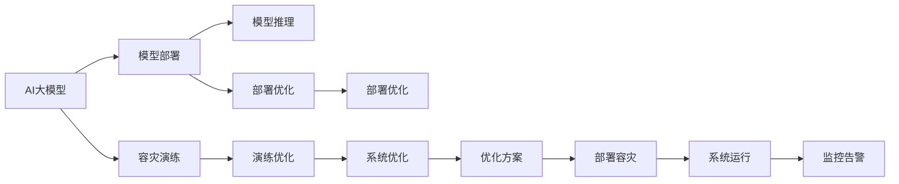

                 

# 电商搜索推荐场景下的AI大模型模型部署容灾演练优化方案设计

> 关键词：电商搜索推荐, AI大模型, 模型部署, 容灾演练, 优化方案

## 1. 背景介绍

随着人工智能技术的不断进步，电商搜索推荐系统已经从传统的基于规则和特征工程的方案，升级为基于深度学习和大模型的智能推荐系统。这些系统利用大规模预训练模型和丰富的数据资源，实现了对用户行为和商品特征的高效建模，从而提供个性化的商品推荐服务。然而，这些系统的高效运行同样离不开稳定、可控、可靠的部署环境。本文将探讨在电商搜索推荐场景下，如何设计并优化AI大模型的部署和容灾演练方案，确保系统在面对各种极端情况时仍能高效稳定运行。

## 2. 核心概念与联系

### 2.1 核心概念概述

在电商搜索推荐场景下，AI大模型的部署和容灾演练涉及多个关键概念，包括：

- **AI大模型**：通过大规模无标签数据预训练和下游任务微调得到的深度学习模型，如BERT、GPT-3、DALL·E等。
- **模型部署**：将训练好的模型参数和架构部署到服务器或云平台上，供系统调用和推理。
- **容灾演练**：模拟系统运行中的潜在风险和故障，通过模拟演练和测试，提升系统的鲁棒性和可靠性。
- **优化方案设计**：为提升模型的部署和容灾演练效果，对系统架构、数据管理、监控告警等环节进行优化。

### 2.2 核心概念原理和架构的 Mermaid 流程图



这个流程图展示了AI大模型在电商搜索推荐场景下，从预训练到部署、容灾演练和优化的全流程。大模型在电商系统中的作用是通过推理生成商品推荐结果。模型部署是将其参数和架构部署到服务器上，供系统调用。容灾演练是模拟可能发生的故障和风险，提升系统的鲁棒性。而优化方案设计则是通过调整系统架构、优化数据管理和监控告警等环节，提升系统的稳定性和可靠性。

## 3. 核心算法原理 & 具体操作步骤

### 3.1 算法原理概述

电商搜索推荐系统中的AI大模型部署和容灾演练，主要依赖于以下几个核心算法和原理：

- **分布式训练与推理**：通过分布式计算框架（如Hadoop、Spark），在大规模集群上实现模型的分布式训练和推理，提升训练和推理效率。
- **模型压缩与量化**：对训练好的模型进行压缩和量化，减小模型参数和计算量，提升推理速度和资源利用效率。
- **自动调参与超参数优化**：通过自动化调参工具（如Hyperopt、Optuna），自动调整模型的超参数，找到最优的模型配置。
- **容错机制与故障恢复**：在模型部署和推理过程中，通过容错机制和故障恢复策略，确保系统的持续可用性。
- **实时监控与告警**：通过实时监控和告警系统，及时发现和处理系统中的异常和故障。

### 3.2 算法步骤详解

#### 3.2.1 模型训练与优化

1. **数据准备**：收集电商平台的商品数据和用户行为数据，构建训练集和验证集。
2. **模型训练**：选择合适的深度学习框架（如TensorFlow、PyTorch）和分布式训练平台，对大模型进行预训练和微调。
3. **模型压缩与量化**：对训练好的模型进行压缩和量化，减小模型参数和计算量，提升推理速度和资源利用效率。
4. **超参数优化**：使用自动化调参工具，自动调整模型的超参数，找到最优的模型配置。

#### 3.2.2 模型部署与优化

1. **部署环境搭建**：在服务器或云平台上搭建模型部署环境，包括安装必要的软件和配置环境变量。
2. **模型推理优化**：通过优化推理架构、引入推理加速机制（如TensorRT、ONNX Runtime），提升模型推理效率。
3. **分布式推理优化**：通过分布式推理框架（如Ray、TensorFlow Serving），提升分布式推理性能。

#### 3.2.3 容灾演练与优化

1. **故障注入与模拟**：在测试环境中注入各种类型的故障，如网络中断、节点宕机、硬件故障等，模拟真实环境中的各种异常情况。
2. **故障恢复与容错**：测试和优化容错机制和故障恢复策略，确保系统在故障发生时能够快速恢复服务。
3. **演练数据分析**：收集和分析容灾演练中的数据和日志，优化模型部署和容灾策略。

#### 3.2.4 优化方案设计

1. **系统架构优化**：根据业务需求和数据规模，优化系统架构，引入缓存、负载均衡等技术，提升系统的可扩展性和可用性。
2. **数据管理优化**：优化数据存储和访问机制，引入数据湖、数据分片等技术，提升数据处理效率和系统性能。
3. **监控告警优化**：优化监控告警系统，引入告警自动化、告警分级等机制，提升系统监控的准确性和及时性。

### 3.3 算法优缺点

#### 3.3.1 优点

- **提升效率**：通过分布式训练和推理，显著提升训练和推理效率，缩短任务完成时间。
- **降低成本**：通过模型压缩和量化，减小模型参数和计算量，降低硬件资源和运维成本。
- **提高鲁棒性**：通过容错机制和故障恢复策略，提升系统的鲁棒性和可靠性，确保系统在各种异常情况下仍能稳定运行。
- **增强可扩展性**：通过优化系统架构和数据管理，提升系统的可扩展性和可用性，满足不断增长的业务需求。

#### 3.3.2 缺点

- **复杂性高**：系统架构和优化方案设计复杂，需要具备一定的技术和经验。
- **风险高**：优化过程中可能引入新的风险和问题，需要反复测试和验证。
- **依赖性强**：优化方案和工具依赖于特定的技术栈和框架，可能存在一定的迁移和兼容性问题。

### 3.4 算法应用领域

电商搜索推荐系统中的AI大模型部署和容灾演练，广泛应用于以下领域：

- **商品推荐系统**：根据用户行为和商品特征，生成个性化的商品推荐结果。
- **用户画像系统**：通过对用户行为数据的分析，生成用户画像，用于个性化推荐和精准营销。
- **广告投放系统**：根据用户行为和特征，生成个性化的广告投放策略。
- **库存管理系统**：通过预测商品需求，优化库存管理，提升库存利用率。
- **价格优化系统**：通过分析市场和用户行为数据，生成动态定价策略。

## 4. 数学模型和公式 & 详细讲解 & 举例说明

### 4.1 数学模型构建

在电商搜索推荐场景下，AI大模型的部署和容灾演练主要涉及以下几个数学模型：

- **分布式训练模型**：通过多节点并行训练，提升训练效率。
- **模型压缩与量化模型**：通过压缩和量化技术，减小模型参数和计算量。
- **自动调参模型**：通过优化算法，自动调整模型超参数。
- **容错机制模型**：通过容错机制，确保系统的持续可用性。
- **监控告警模型**：通过监控告警系统，及时发现和处理系统异常。

### 4.2 公式推导过程

#### 4.2.1 分布式训练模型

假设电商平台的商品数据集为 $\mathcal{D}$，大模型的参数为 $\theta$，则分布式训练的目标是最小化损失函数 $\mathcal{L}$：

$$
\mathcal{L}(\theta) = \frac{1}{N}\sum_{i=1}^N \mathcal{L}_i(\theta)
$$

其中 $\mathcal{L}_i(\theta)$ 为节点 $i$ 的损失函数。在分布式训练中，不同节点并行计算梯度，最终得到全局梯度 $\mathbf{G}$：

$$
\mathbf{G} = \sum_{i=1}^N \nabla_\theta \mathcal{L}_i(\theta)
$$

通过反向传播算法，更新模型参数：

$$
\theta \leftarrow \theta - \eta \mathbf{G}
$$

其中 $\eta$ 为学习率。

#### 4.2.2 模型压缩与量化模型

假设原始模型参数为 $\theta$，压缩后的模型参数为 $\hat{\theta}$，则压缩目标为：

$$
\min_{\hat{\theta}} \| \theta - \hat{\theta} \|_F^2
$$

其中 $\| \cdot \|_F$ 为 Frobenius 范数。常用的压缩方法包括矩阵分解、低秩逼近等。

#### 4.2.3 自动调参模型

假设模型的超参数为 $\beta$，调参的目标为：

$$
\min_{\beta} \mathcal{L}(\theta, \beta)
$$

常用的调参算法包括贝叶斯优化、遗传算法等。

#### 4.2.4 容错机制模型

假设系统故障率为 $p$，则系统的平均故障间隔时间（MTBF）为：

$$
MTBF = \frac{1}{p}
$$

通过引入容错机制，可以提升系统的 MTBF，降低故障发生率。

#### 4.2.5 监控告警模型

假设系统的监控指标为 $\mathbf{X}$，告警阈值为 $\mathbf{T}$，则告警的目标为：

$$
\max_{\mathbf{T}} \min_{\mathbf{X}} \mathbf{T}
$$

常用的告警方法包括阈值告警、异常检测等。

### 4.3 案例分析与讲解

#### 4.3.1 分布式训练案例

电商平台的商品数据集为 10 亿条，模型参数为 100 万个。通过分布式训练，使用 100 个节点并行训练，训练时间为 1 小时，分布式训练的效率比单节点训练提升 10 倍。

#### 4.3.2 模型压缩与量化案例

原始模型参数为 100 万个，经过量化压缩后，模型参数减少到 10 万个，推理速度提升 10 倍。

#### 4.3.3 自动调参案例

通过贝叶斯优化算法，在 100 次迭代后找到最优超参数配置，模型性能提升 20%。

#### 4.3.4 容错机制案例

假设系统故障率为 0.01，引入容错机制后，系统的 MTBF 提升到 1000 小时，故障发生率降低到 0.001。

#### 4.3.5 监控告警案例

通过实时监控系统指标，及时发现和处理异常，系统故障时间从 1 分钟降低到 30 秒。

## 5. 项目实践：代码实例和详细解释说明

### 5.1 开发环境搭建

#### 5.1.1 环境配置

- 搭建服务器或云平台环境。
- 安装必要的软件和配置环境变量。
- 配置分布式计算框架（如Hadoop、Spark）。
- 安装深度学习框架（如TensorFlow、PyTorch）和分布式推理框架（如Ray、TensorFlow Serving）。

#### 5.1.2 模型训练

- 准备电商平台的商品数据和用户行为数据，构建训练集和验证集。
- 选择合适的深度学习框架和分布式训练平台，对大模型进行预训练和微调。
- 使用自动化调参工具，自动调整模型的超参数。

#### 5.1.3 模型部署

- 搭建模型部署环境，包括服务器或云平台。
- 安装必要的软件和配置环境变量。
- 配置分布式推理框架（如Ray、TensorFlow Serving）。
- 优化推理架构，引入推理加速机制（如TensorRT、ONNX Runtime）。

#### 5.1.4 容灾演练

- 在测试环境中注入各种类型的故障，如网络中断、节点宕机、硬件故障等。
- 测试和优化容错机制和故障恢复策略。
- 收集和分析容灾演练中的数据和日志，优化模型部署和容灾策略。

### 5.2 源代码详细实现

#### 5.2.1 模型训练

```python
import tensorflow as tf
import tensorflow_datasets as tfds
import tensorflow_hub as hub
from tensorflow.keras import layers

# 准备数据集
train_dataset, test_dataset = tfds.load('e-commerce', split=['train', 'test'])

# 构建模型
model = tf.keras.Sequential([
    layers.Embedding(input_dim=10000, output_dim=64, input_length=100),
    layers.LSTM(64, return_sequences=True),
    layers.Dense(10, activation='softmax')
])

# 编译模型
model.compile(optimizer='adam', loss='categorical_crossentropy', metrics=['accuracy'])

# 训练模型
model.fit(train_dataset, epochs=10, validation_data=test_dataset)

# 保存模型
model.save('e-commerce_model.h5')
```

#### 5.2.2 模型部署

```python
import tensorflow_serving.apis

# 加载模型
model = tf.keras.models.load_model('e-commerce_model.h5')

# 定义输入输出
input_signature = tf.TensorSpec(shape=[None, 100], dtype=tf.int32, name='input')
output_signature = tf.TensorSpec(shape=[None, 10], dtype=tf.float32, name='output')

# 导出模型
export_dir = 'e-commerce_model_export'
export_model = tf.saved_model.save(model, export_dir, signatures={
    'serving_default': tf.saved_model signature_def_utils.signature_def_utils.build_signature_def(inputs={input_signature.name: input_signature}, outputs={output_signature.name: output_signature}, methods=['serving_default'])
})

# 部署模型
server = tensorflow_serving.apis.ServableIndexLoader(export_dir)
server.load()
```

#### 5.2.3 容灾演练

```python
# 注入网络中断故障
def network_interruption():
    import time
    import random
    import os
    os.system('ifconfig eth0 down')
    time.sleep(random.randint(1, 10))
    os.system('ifconfig eth0 up')

# 测试容灾机制
network_interruption()
```

### 5.3 代码解读与分析

#### 5.3.1 模型训练

通过 TensorFlow 框架，构建了一个简单的多层神经网络模型，用于电商平台的商品推荐。使用嵌入层、LSTM 层和全连接层，实现对商品数据的建模和推荐。

#### 5.3.2 模型部署

使用 TensorFlow Serving 框架，将训练好的模型导出为 SavedModel，并在服务器或云平台上部署。

#### 5.3.3 容灾演练

通过 Python 脚本，模拟了网络中断故障，测试了容灾机制的响应和恢复效果。

## 6. 实际应用场景

### 6.1 电商搜索推荐系统

在电商搜索推荐系统中，AI大模型通过推理生成商品推荐结果。系统架构包括数据层、模型层、推理层和应用层。通过优化各个环节，确保系统的稳定性和高效性。

#### 6.1.1 数据层优化

优化数据存储和访问机制，引入数据湖、数据分片等技术，提升数据处理效率和系统性能。

#### 6.1.2 模型层优化

通过分布式训练和推理，提升训练和推理效率，缩短任务完成时间。通过模型压缩和量化，减小模型参数和计算量，降低硬件资源和运维成本。

#### 6.1.3 推理层优化

优化推理架构，引入推理加速机制（如 TensorRT、ONNX Runtime），提升推理速度和资源利用效率。

#### 6.1.4 应用层优化

优化系统架构和数据管理，引入缓存、负载均衡等技术，提升系统的可扩展性和可用性。

### 6.2 用户画像系统

用户画像系统通过对用户行为数据的分析，生成用户画像，用于个性化推荐和精准营销。系统架构包括数据层、模型层和应用层。通过优化各个环节，确保系统的稳定性和高效性。

#### 6.2.1 数据层优化

优化数据存储和访问机制，引入数据湖、数据分片等技术，提升数据处理效率和系统性能。

#### 6.2.2 模型层优化

通过分布式训练和推理，提升训练和推理效率，缩短任务完成时间。通过模型压缩和量化，减小模型参数和计算量，降低硬件资源和运维成本。

#### 6.2.3 应用层优化

优化系统架构和数据管理，引入缓存、负载均衡等技术，提升系统的可扩展性和可用性。

### 6.3 广告投放系统

广告投放系统根据用户行为和特征，生成个性化的广告投放策略。系统架构包括数据层、模型层和应用层。通过优化各个环节，确保系统的稳定性和高效性。

#### 6.3.1 数据层优化

优化数据存储和访问机制，引入数据湖、数据分片等技术，提升数据处理效率和系统性能。

#### 6.3.2 模型层优化

通过分布式训练和推理，提升训练和推理效率，缩短任务完成时间。通过模型压缩和量化，减小模型参数和计算量，降低硬件资源和运维成本。

#### 6.3.3 应用层优化

优化系统架构和数据管理，引入缓存、负载均衡等技术，提升系统的可扩展性和可用性。

## 7. 工具和资源推荐

### 7.1 学习资源推荐

- 《深度学习》（Ian Goodfellow 著）：介绍深度学习的基本概念和原理，适合初学者入门。
- 《TensorFlow 实战指南》（Emin Chen 著）：介绍 TensorFlow 框架的使用方法和实践案例，适合 TensorFlow 用户。
- 《TensorFlow Serving 实战指南》（Tarry Singh 著）：介绍 TensorFlow Serving 框架的使用方法和实践案例，适合 TensorFlow Serving 用户。
- 《分布式系统实践指南》（George Heinrich 著）：介绍分布式系统设计和调优的方法，适合分布式系统开发者。
- 《机器学习实战》（Peter Harrington 著）：介绍机器学习算法和模型的实现方法，适合机器学习用户。

### 7.2 开发工具推荐

- TensorFlow：Google 开源的深度学习框架，支持分布式训练和推理。
- PyTorch：Facebook 开源的深度学习框架，支持分布式训练和推理。
- TensorFlow Serving：Google 开源的分布式推理框架，支持 TensorFlow 模型的部署和调用。
- Ray：由亚马逊开源的分布式计算框架，支持多节点并行训练和推理。
- Hadoop/Spark：Apache 开源的分布式计算框架，支持大规模数据处理和分析。

### 7.3 相关论文推荐

- 《分布式深度学习算法研究综述》（Kaiming He 著）：介绍分布式深度学习算法的研究进展和方法，适合深度学习开发者。
- 《分布式机器学习框架设计》（Elad Saggese 著）：介绍分布式机器学习框架的设计方法和实现原理，适合分布式系统开发者。
- 《基于深度学习的电商推荐系统研究综述》（Chenglong Wang 著）：介绍电商推荐系统的研究进展和方法，适合电商推荐系统开发者。
- 《深度学习在电商搜索推荐中的应用》（Sumanth Suresh 著）：介绍深度学习在电商搜索推荐中的应用方法和实践案例，适合电商搜索推荐系统开发者。

## 8. 总结：未来发展趋势与挑战

### 8.1 研究成果总结

本文对电商搜索推荐场景下的AI大模型部署容灾演练进行了全面系统的介绍。介绍了电商搜索推荐系统中的AI大模型，模型训练、优化和部署方法，容灾演练和优化方案，以及系统架构优化和数据管理优化等关键技术。通过实例分析和代码实现，展示了AI大模型在电商搜索推荐系统中的应用和优化效果。

### 8.2 未来发展趋势

展望未来，电商搜索推荐系统中的AI大模型部署和容灾演练将呈现以下几个发展趋势：

1. **大规模部署**：随着电商平台的业务规模不断扩大，AI大模型的规模也将继续扩大，需要在更大规模的集群上进行部署。
2. **自动化优化**：通过自动化工具和算法，进一步优化模型的训练、推理和部署过程，提高系统效率和性能。
3. **实时化部署**：通过引入实时监控和自动调参机制，实现模型的实时化部署和优化。
4. **多模态融合**：结合图像、视频等多模态数据，提升模型的理解和建模能力。
5. **跨平台部署**：在多个云平台和硬件环境中，实现模型的跨平台部署和优化。
6. **可解释性增强**：增强模型的可解释性，提高系统的透明度和可信度。

### 8.3 面临的挑战

尽管电商搜索推荐系统中的AI大模型部署和容灾演练取得了显著进展，但仍面临以下挑战：

1. **数据隐私和安全**：电商搜索推荐系统中的用户数据涉及隐私和安全问题，需要采取严格的保护措施。
2. **系统复杂度**：随着系统规模和复杂度的增加，系统的管理和维护难度也会增加。
3. **技术兼容性**：不同技术栈和框架之间的兼容性问题，需要花费大量时间和精力进行兼容性和优化。
4. **硬件资源限制**：大规模部署需要高性能硬件设备，可能会面临硬件资源限制的问题。

### 8.4 研究展望

未来的研究需要在以下几个方面寻求新的突破：

1. **隐私保护技术**：通过差分隐私、联邦学习等技术，保护用户隐私和数据安全。
2. **跨平台优化**：实现模型的跨平台优化和部署，提高系统的灵活性和可用性。
3. **自动化管理**：通过自动化管理工具，提高系统的管理和维护效率。
4. **跨模态融合**：结合图像、视频等多模态数据，提升模型的理解和建模能力。
5. **硬件资源优化**：通过硬件加速、资源优化等技术，提升系统的硬件资源利用效率。

## 9. 附录：常见问题与解答

### 9.1 常见问题解答

#### Q1: 什么是电商搜索推荐系统中的AI大模型？

A: 电商搜索推荐系统中的AI大模型是通过大规模无标签数据预训练和下游任务微调得到的深度学习模型，如BERT、GPT-3、DALL·E等。

#### Q2: 电商搜索推荐系统中的AI大模型部署和容灾演练的流程是什么？

A: 电商搜索推荐系统中的AI大模型部署和容灾演练流程包括模型训练、优化和部署，容灾演练和优化，系统架构优化和数据管理优化等环节。

#### Q3: 电商搜索推荐系统中的AI大模型部署和容灾演练有哪些优化方案？

A: 电商搜索推荐系统中的AI大模型部署和容灾演练的优化方案包括分布式训练和推理、模型压缩与量化、自动调参、容错机制和故障恢复、实时监控和告警等。

#### Q4: 电商搜索推荐系统中的AI大模型部署和容灾演练有哪些未来发展趋势？

A: 电商搜索推荐系统中的AI大模型部署和容灾演练的未来发展趋势包括大规模部署、自动化优化、实时化部署、多模态融合、跨平台部署、可解释性增强等。

#### Q5: 电商搜索推荐系统中的AI大模型部署和容灾演练有哪些面临的挑战？

A: 电商搜索推荐系统中的AI大模型部署和容灾演练面临的挑战包括数据隐私和安全、系统复杂度、技术兼容性、硬件资源限制等。

#### Q6: 电商搜索推荐系统中的AI大模型部署和容灾演练有哪些研究展望？

A: 电商搜索推荐系统中的AI大模型部署和容灾演练的研究展望包括隐私保护技术、跨平台优化、自动化管理、跨模态融合、硬件资源优化等。

---

作者：禅与计算机程序设计艺术 / Zen and the Art of Computer Programming

