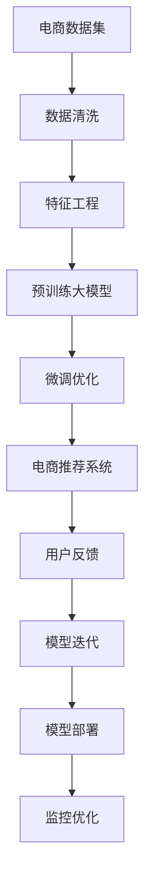

                 

# 电商搜索推荐场景下的AI大模型模型部署最佳实践

## 1. 背景介绍

随着互联网技术的飞速发展，电商搜索推荐系统已经成为现代电子商务不可或缺的一部分。传统的推荐系统依靠手工规则或简单的统计方法，难以满足用户复杂多变的搜索需求。而基于人工智能(AI)的大模型推荐系统，能够通过深度学习技术，从海量数据中挖掘用户兴趣，自动生成高质量的搜索结果，为用户带来更加个性化的购物体验。

本博文将深入探讨在大规模电商数据上训练和部署大模型推荐系统的最佳实践。包括选择适合的大模型架构、数据预处理与清洗、模型训练与微调、模型部署与监控等各个环节的详细操作和优化建议，帮助读者系统掌握大模型推荐系统的构建与部署技巧，加速其在电商搜索推荐场景中的应用落地。

## 2. 核心概念与联系

### 2.1 核心概念概述

为了更好地理解AI大模型在电商搜索推荐场景中的应用，本节将介绍几个关键概念及其之间的联系：

- **大模型 (Large Model)**：以自回归模型(如GPT-3)、自编码模型(如BERT)为代表的大规模预训练语言模型。通过在大规模无标签文本语料上进行预训练，学习到丰富的语言表示，具备强大的自然语言理解与生成能力。

- **预训练 (Pre-training)**：指在大规模无标签文本语料上，通过自监督学习任务训练通用语言模型的过程。常见的预训练任务包括掩码语言模型、自回归语言模型等，使模型学习到语言的基础规律和语义表示。

- **微调 (Fine-tuning)**：指在预训练模型的基础上，使用有标签的数据集，通过有监督地训练优化模型在特定任务上的性能。对于推荐系统，一般用于优化模型对电商数据的理解能力和推荐效果。

- **自监督学习 (Self-Supervised Learning)**：利用大规模无标签数据进行训练，无需人工标注，适用于预训练阶段的模型学习。

- **生成式预训练 (Generative Pre-training)**：指使用语言模型任务进行预训练，使模型具有更强的生成能力和上下文理解能力。

- **检索式推荐 (Retrieval-based Recommendation)**：指通过将用户查询与产品库中的所有商品进行相似度计算，选择最相关的商品推荐给用户。

- **协同过滤 (Collaborative Filtering)**：通过分析用户行为数据，推测用户对其他商品的兴趣，实现个性化推荐。

- **深度学习 (Deep Learning)**：基于神经网络模型，通过多层次的特征提取和关联学习，实现复杂模式的识别和预测。

这些概念共同构成了大模型推荐系统的核心框架，使得模型能够通过深度学习技术，高效处理和理解电商搜索推荐场景中的数据。

### 2.2 核心概念联系

将以上概念通过以下Mermaid流程图展示它们之间的联系：



这个流程图展示了从电商数据集到最终推荐的整个流程，主要步骤包括：

1. **数据清洗**：处理原始电商数据，去除噪声和无效数据，为后续分析打下基础。
2. **特征工程**：设计特征，提取有价值的信息，增强模型的学习能力。
3. **预训练大模型**：使用大规模语料进行预训练，学习通用的语言表示。
4. **微调优化**：使用电商数据集对模型进行微调，提高模型对电商场景的理解和推荐能力。
5. **电商推荐系统**：将微调后的模型应用于电商搜索推荐，实现个性化推荐。
6. **用户反馈**：收集用户反馈数据，用于模型迭代和优化。
7. **模型迭代**：通过不断的训练和优化，提升推荐系统效果。
8. **模型部署**：将模型部署到线上环境，服务用户。
9. **监控优化**：对模型性能进行实时监控，及时发现和解决问题，确保系统稳定运行。

通过理解这些关键概念及其联系，我们可以更好地把握AI大模型在电商搜索推荐场景中的作用和价值。

## 3. 核心算法原理 & 具体操作步骤

### 3.1 算法原理概述

基于AI大模型的电商搜索推荐系统，主要通过两个核心算法实现：生成式推荐和检索式推荐。以下是这两种算法的详细原理概述：

#### 生成式推荐 (Generative Recommendation)

生成式推荐算法利用预训练大模型对用户和商品的语义表示进行建模，基于模型生成的语义信息进行推荐。其核心在于通过自回归语言模型进行预训练，使模型学习到单词、短语、句子的概率分布，然后利用这些分布对电商数据进行预测。

具体步骤包括：
1. **语义建模**：将用户查询和商品描述转换为向量表示，输入到大模型中，得到语义表示。
2. **生成推荐**：基于得到的语义表示，生成商品列表，排序推荐给用户。

#### 检索式推荐 (Retrieval-based Recommendation)

检索式推荐算法主要通过计算用户查询与商品的相似度，筛选出最相关的商品推荐。其核心在于通过相似度计算，从产品库中检索出与用户查询最匹配的商品。

具体步骤包括：
1. **向量表示**：将用户查询和商品描述转换为向量表示，使用同一种向量表示方法，如词嵌入、句子表示等。
2. **相似度计算**：计算用户查询向量与商品向量之间的相似度，选择相似度最高的商品作为推荐结果。

### 3.2 算法步骤详解

以下将详细介绍生成式推荐和检索式推荐的详细步骤：

#### 生成式推荐

1. **语义建模**：使用预训练大模型(如GPT-3、BERT等)将用户查询和商品描述转换为向量表示。可以使用句子表示任务进行预训练，使模型学习到句子级别的语义表示。
2. **生成推荐**：基于得到的语义表示，生成商品列表。可以使用NLP技术生成文本描述，或通过推荐引擎算法进行排序和推荐。

#### 检索式推荐

1. **向量表示**：将用户查询和商品描述转换为向量表示。可以使用Word2Vec、GloVe等词嵌入方法，或使用预训练的语言模型进行转换。
2. **相似度计算**：计算用户查询向量与商品向量之间的余弦相似度、欧式距离等相似度指标，选择最匹配的商品进行推荐。

### 3.3 算法优缺点

生成式推荐和检索式推荐各有优缺点，具体如下：

#### 生成式推荐的优缺点

**优点**：
- 能够生成新的商品描述，增加商品多样性。
- 基于大模型的强大语义建模能力，推荐结果更加精准。

**缺点**：
- 计算成本高，模型生成商品描述需要大量的计算资源。
- 需要不断优化模型参数，确保生成质量。

#### 检索式推荐的优缺点

**优点**：
- 计算速度快，适合大规模实时推荐。
- 能够高效检索出与用户查询最匹配的商品，推荐效果稳定。

**缺点**：
- 商品向量表示的精度影响推荐效果。
- 无法处理未出现过的商品。

### 3.4 算法应用领域

生成式推荐和检索式推荐算法在大规模电商搜索推荐场景中得到了广泛应用，具体包括：

- 电商商品推荐：根据用户浏览历史、购买记录等行为数据，生成个性化的商品推荐列表。
- 用户意图识别：通过分析用户查询和行为数据，识别用户真正的购买意图，进行精准推荐。
- 热门商品推荐：利用热门商品的关键词进行检索，筛选出最热门的商品进行推荐。
- 促销活动推荐：根据用户的购物行为和偏好，推荐相关的促销活动，提高用户转化率。
- 个性化广告推荐：根据用户兴趣和行为，推荐个性化的广告内容，提升广告效果。

## 4. 数学模型和公式 & 详细讲解 & 举例说明

### 4.1 数学模型构建

本节将使用数学语言对生成式推荐和检索式推荐的核心模型进行严格刻画。

假设电商数据集为 $D=\{(x_i,y_i)\}_{i=1}^N$，其中 $x_i$ 表示商品描述，$y_i$ 表示商品类别标签。

#### 生成式推荐模型

假设模型为 $M_{\theta}$，参数 $\theta$ 表示模型的权重。模型的输入为商品描述 $x_i$，输出为推荐结果 $y_i$。模型的训练目标是最大化预测准确率 $P(y_i|x_i)$。

生成式推荐的数学模型为：

$$
P(y_i|x_i) = \prod_{j=1}^d P(y_i^j|x_i^j)
$$

其中 $d$ 为向量表示的维度，$x_i^j$ 和 $y_i^j$ 分别表示用户查询和商品描述的 $j$ 维向量。

#### 检索式推荐模型

假设模型为 $M_{\theta}$，参数 $\theta$ 表示模型的权重。模型的输入为商品描述 $x_i$ 和用户查询 $q_i$，输出为商品类别标签 $y_i$。模型的训练目标是最大化预测准确率 $P(y_i|q_i,x_i)$。

检索式推荐的数学模型为：

$$
P(y_i|q_i,x_i) = \frac{exp(sim(x_i,q_i))}{\sum_{j=1}^N exp(sim(j,q_i))}
$$

其中 $sim(x_i,q_i)$ 表示用户查询与商品描述的相似度。

### 4.2 公式推导过程

以下将详细推导生成式推荐和检索式推荐的公式：

#### 生成式推荐公式推导

生成式推荐的公式推导如下：

$$
P(y_i|x_i) = \prod_{j=1}^d P(y_i^j|x_i^j) = \prod_{j=1}^d \frac{exp(\theta^T\phi(x_i^j,y_i^j))}{\sum_{k=1}^K exp(\theta^T\phi(x_i^j,y_k^j))}
$$

其中 $\theta$ 表示模型的权重，$\phi$ 表示特征函数，$K$ 为类别数。

通过softmax函数归一化，生成式推荐模型的预测概率为：

$$
P(y_i|x_i) = \frac{exp(\sum_{j=1}^d \theta^T\phi(x_i^j,y_i^j))}{\sum_{k=1}^K exp(\sum_{j=1}^d \theta^T\phi(x_i^j,y_k^j))}
$$

#### 检索式推荐公式推导

检索式推荐的公式推导如下：

$$
P(y_i|q_i,x_i) = \frac{exp(sim(x_i,q_i))}{\sum_{j=1}^N exp(sim(j,q_i))}
$$

其中 $sim(x_i,q_i)$ 表示用户查询与商品描述的相似度。

### 4.3 案例分析与讲解

假设我们使用BERT模型进行电商搜索推荐，基于向量表示的方法，对用户查询和商品描述进行编码，然后计算相似度。具体实现步骤如下：

1. **向量表示**：使用BERT模型对用户查询和商品描述进行编码，得到向量表示。
2. **相似度计算**：计算用户查询向量与商品向量之间的余弦相似度，选择最匹配的商品进行推荐。

例如，对于以下用户查询和商品描述：

- 用户查询：“优质家居用品”
- 商品描述：“高端床垫，舒适耐用”

可以分别将用户查询和商品描述转换为向量表示，然后计算向量之间的余弦相似度，选择最匹配的商品进行推荐。

## 5. 项目实践：代码实例和详细解释说明

### 5.1 开发环境搭建

在进行电商搜索推荐系统开发前，需要准备好开发环境。以下是使用Python进行PyTorch和Transformers库开发的环境配置流程：

1. 安装Anaconda：从官网下载并安装Anaconda，用于创建独立的Python环境。

2. 创建并激活虚拟环境：
```bash
conda create -n ecommerce-env python=3.8 
conda activate ecommerce-env
```

3. 安装PyTorch：根据CUDA版本，从官网获取对应的安装命令。例如：
```bash
conda install pytorch torchvision torchaudio cudatoolkit=11.1 -c pytorch -c conda-forge
```

4. 安装Transformers库：
```bash
pip install transformers
```

5. 安装各类工具包：
```bash
pip install numpy pandas scikit-learn matplotlib tqdm jupyter notebook ipython
```

完成上述步骤后，即可在`ecommerce-env`环境中开始开发实践。

### 5.2 源代码详细实现

我们以生成式推荐为例，给出使用Transformers库对BERT模型进行电商搜索推荐系统微调的PyTorch代码实现。

首先，定义电商推荐任务的数据处理函数：

```python
from transformers import BertTokenizer
from torch.utils.data import Dataset
import torch

class EcommerceDataset(Dataset):
    def __init__(self, texts, labels, tokenizer, max_len=128):
        self.texts = texts
        self.labels = labels
        self.tokenizer = tokenizer
        self.max_len = max_len
        
    def __len__(self):
        return len(self.texts)
    
    def __getitem__(self, item):
        text = self.texts[item]
        label = self.labels[item]
        
        encoding = self.tokenizer(text, return_tensors='pt', max_length=self.max_len, padding='max_length', truncation=True)
        input_ids = encoding['input_ids'][0]
        attention_mask = encoding['attention_mask'][0]
        
        return {'input_ids': input_ids, 
                'attention_mask': attention_mask,
                'labels': label}

# 创建dataset
tokenizer = BertTokenizer.from_pretrained('bert-base-cased')

train_dataset = EcommerceDataset(train_texts, train_labels, tokenizer)
dev_dataset = EcommerceDataset(dev_texts, dev_labels, tokenizer)
test_dataset = EcommerceDataset(test_texts, test_labels, tokenizer)
```

然后，定义模型和优化器：

```python
from transformers import BertForTokenClassification, AdamW

model = BertForTokenClassification.from_pretrained('bert-base-cased', num_labels=len(tag2id))

optimizer = AdamW(model.parameters(), lr=2e-5)
```

接着，定义训练和评估函数：

```python
from torch.utils.data import DataLoader
from tqdm import tqdm
from sklearn.metrics import classification_report

device = torch.device('cuda') if torch.cuda.is_available() else torch.device('cpu')
model.to(device)

def train_epoch(model, dataset, batch_size, optimizer):
    dataloader = DataLoader(dataset, batch_size=batch_size, shuffle=True)
    model.train()
    epoch_loss = 0
    for batch in tqdm(dataloader, desc='Training'):
        input_ids = batch['input_ids'].to(device)
        attention_mask = batch['attention_mask'].to(device)
        labels = batch['labels'].to(device)
        model.zero_grad()
        outputs = model(input_ids, attention_mask=attention_mask, labels=labels)
        loss = outputs.loss
        epoch_loss += loss.item()
        loss.backward()
        optimizer.step()
    return epoch_loss / len(dataloader)

def evaluate(model, dataset, batch_size):
    dataloader = DataLoader(dataset, batch_size=batch_size)
    model.eval()
    preds, labels = [], []
    with torch.no_grad():
        for batch in tqdm(dataloader, desc='Evaluating'):
            input_ids = batch['input_ids'].to(device)
            attention_mask = batch['attention_mask'].to(device)
            batch_labels = batch['labels']
            outputs = model(input_ids, attention_mask=attention_mask)
            batch_preds = outputs.logits.argmax(dim=2).to('cpu').tolist()
            batch_labels = batch_labels.to('cpu').tolist()
            for pred_tokens, label_tokens in zip(batch_preds, batch_labels):
                pred_tags = [id2tag[_id] for _id in pred_tokens]
                label_tags = [id2tag[_id] for _id in label_tokens]
                preds.append(pred_tags[:len(label_tokens)])
                labels.append(label_tags)
                
    print(classification_report(labels, preds))
```

最后，启动训练流程并在测试集上评估：

```python
epochs = 5
batch_size = 16

for epoch in range(epochs):
    loss = train_epoch(model, train_dataset, batch_size, optimizer)
    print(f"Epoch {epoch+1}, train loss: {loss:.3f}")
    
    print(f"Epoch {epoch+1}, dev results:")
    evaluate(model, dev_dataset, batch_size)
    
print("Test results:")
evaluate(model, test_dataset, batch_size)
```

以上就是使用PyTorch对BERT进行电商搜索推荐系统微调的完整代码实现。可以看到，得益于Transformers库的强大封装，我们可以用相对简洁的代码完成BERT模型的加载和微调。

### 5.3 代码解读与分析

让我们再详细解读一下关键代码的实现细节：

**EcommerceDataset类**：
- `__init__`方法：初始化电商数据、标签、分词器等关键组件。
- `__len__`方法：返回数据集的样本数量。
- `__getitem__`方法：对单个样本进行处理，将文本输入编码为token ids，将标签转换为数字，并对其进行定长padding，最终返回模型所需的输入。

**tag2id和id2tag字典**：
- 定义了标签与数字id之间的映射关系，用于将token-wise的预测结果解码回真实的标签。

**训练和评估函数**：
- 使用PyTorch的DataLoader对数据集进行批次化加载，供模型训练和推理使用。
- 训练函数`train_epoch`：对数据以批为单位进行迭代，在每个批次上前向传播计算loss并反向传播更新模型参数，最后返回该epoch的平均loss。
- 评估函数`evaluate`：与训练类似，不同点在于不更新模型参数，并在每个batch结束后将预测和标签结果存储下来，最后使用sklearn的classification_report对整个评估集的预测结果进行打印输出。

**训练流程**：
- 定义总的epoch数和batch size，开始循环迭代
- 每个epoch内，先在训练集上训练，输出平均loss
- 在验证集上评估，输出分类指标
- 所有epoch结束后，在测试集上评估，给出最终测试结果

可以看到，PyTorch配合Transformers库使得BERT微调的代码实现变得简洁高效。开发者可以将更多精力放在数据处理、模型改进等高层逻辑上，而不必过多关注底层的实现细节。

当然，工业级的系统实现还需考虑更多因素，如模型的保存和部署、超参数的自动搜索、更灵活的任务适配层等。但核心的微调范式基本与此类似。

## 6. 实际应用场景

### 6.1 智能客服系统

基于大语言模型微调的电商搜索推荐系统，可以广泛应用于智能客服系统的构建。传统客服往往需要配备大量人力，高峰期响应缓慢，且一致性和专业性难以保证。而使用微调后的推荐系统，可以7x24小时不间断服务，快速响应客户查询，用推荐商品替代常见问题，提升客户咨询体验和满意度。

在技术实现上，可以收集客户浏览历史、购物记录、搜索行为等数据，将用户与商品关联，并训练模型预测用户可能感兴趣的商品，推荐给客户。对于客户的即时查询，还可以通过微调后的模型自动生成商品列表，减少人工干预。

### 6.2 个性化推荐系统

电商推荐系统不仅仅是推荐商品，还可以通过个性化推荐提升用户体验。基于大模型微调技术，推荐系统可以根据用户的行为数据、兴趣标签等信息，生成个性化的推荐内容，如优惠券、商品折扣等，吸引用户购买。

在具体实现上，可以使用用户行为数据训练大模型，预测用户对商品的态度和需求。根据预测结果，生成个性化的推荐内容，提高用户转化率。

### 6.3 实时广告投放

实时广告投放是电商平台的重要营收手段，通过精准推荐商品，增加点击率，提升广告效果。基于大模型微调技术，推荐系统可以实时分析用户的行为数据，预测用户对广告的兴趣，动态调整广告内容和形式，提高广告的点击率和转化率。

例如，通过分析用户的历史购买记录和搜索行为，生成个性化的广告推荐，优化广告投放策略。

### 6.4 未来应用展望

随着大模型和微调方法的不断发展，电商搜索推荐系统将在更多领域得到应用，为电商行业带来变革性影响。

在智慧物流领域，推荐系统可以优化物流配送路线，提高配送效率。例如，通过分析用户购买记录，推荐最热门的配送方式和时间，提升用户满意度。

在智能零售领域，推荐系统可以优化商品陈列，提高销售额。例如，通过分析用户浏览和购买历史，推荐热门商品组合，增加用户购买意愿。

在社交电商领域，推荐系统可以通过推荐相关商品和内容，增加用户互动和粘性，提升用户活跃度。

此外，在健康医疗、教育培训、金融理财等更多领域，基于大模型微调的人工智能应用也将不断涌现，为各行各业带来新的增长点。相信随着技术的日益成熟，微调方法将成为电商推荐系统的重要范式，推动人工智能技术在垂直行业的规模化落地。

## 7. 工具和资源推荐

### 7.1 学习资源推荐

为了帮助开发者系统掌握大模型推荐系统的理论基础和实践技巧，这里推荐一些优质的学习资源：

1. 《深度学习》系列博文：由深度学习领域专家撰写，深入浅出地介绍了深度学习的基本原理和算法，涵盖卷积神经网络、循环神经网络、深度强化学习等。

2. 《自然语言处理》课程：斯坦福大学开设的NLP明星课程，有Lecture视频和配套作业，带你入门NLP领域的基本概念和经典模型。

3. 《Generative Pre-training and Unsupervised Learning》书籍：Google深度学习小组著作，全面介绍了预训练语言模型和无监督学习的方法。

4. 《Reinforcement Learning with PyTorch》书籍：使用PyTorch实现强化学习的经典教材，涵盖基础理论和实际应用。

5. 《Machine Learning Mastery》网站：提供大量深度学习、机器学习的实战教程和资源，适合入门学习。

通过对这些资源的学习实践，相信你一定能够快速掌握大模型推荐系统的精髓，并用于解决实际的电商搜索推荐问题。

### 7.2 开发工具推荐

高效的开发离不开优秀的工具支持。以下是几款用于大模型推荐系统开发的常用工具：

1. PyTorch：基于Python的开源深度学习框架，灵活动态的计算图，适合快速迭代研究。大部分预训练语言模型都有PyTorch版本的实现。

2. TensorFlow：由Google主导开发的开源深度学习框架，生产部署方便，适合大规模工程应用。同样有丰富的预训练语言模型资源。

3. Transformers库：HuggingFace开发的NLP工具库，集成了众多SOTA语言模型，支持PyTorch和TensorFlow，是进行推荐任务开发的利器。

4. Weights & Biases：模型训练的实验跟踪工具，可以记录和可视化模型训练过程中的各项指标，方便对比和调优。与主流深度学习框架无缝集成。

5. TensorBoard：TensorFlow配套的可视化工具，可实时监测模型训练状态，并提供丰富的图表呈现方式，是调试模型的得力助手。

6. Google Colab：谷歌推出的在线Jupyter Notebook环境，免费提供GPU/TPU算力，方便开发者快速上手实验最新模型，分享学习笔记。

合理利用这些工具，可以显著提升大模型推荐系统的开发效率，加快创新迭代的步伐。

### 7.3 相关论文推荐

大语言模型和微调技术的发展源于学界的持续研究。以下是几篇奠基性的相关论文，推荐阅读：

1. Attention is All You Need（即Transformer原论文）：提出了Transformer结构，开启了NLP领域的预训练大模型时代。

2. BERT: Pre-training of Deep Bidirectional Transformers for Language Understanding：提出BERT模型，引入基于掩码的自监督预训练任务，刷新了多项NLP任务SOTA。

3. Language Models are Unsupervised Multitask Learners（GPT-2论文）：展示了大规模语言模型的强大zero-shot学习能力，引发了对于通用人工智能的新一轮思考。

4. Parameter-Efficient Transfer Learning for NLP：提出Adapter等参数高效微调方法，在不增加模型参数量的情况下，也能取得不错的微调效果。

5. Self-Supervised Learning with Masked Predictions（自监督学习）：提出了Masked Language Model（MLM）和Next Sentence Prediction（NSP）等自监督任务，显著提升了BERT等大模型的效果。

这些论文代表了大模型推荐系统的发展脉络。通过学习这些前沿成果，可以帮助研究者把握学科前进方向，激发更多的创新灵感。

## 8. 总结：未来发展趋势与挑战

### 8.1 总结

本文对基于AI大模型的电商搜索推荐系统进行了全面系统的介绍。首先阐述了电商推荐系统的背景和意义，明确了大模型推荐系统在提升用户体验、优化营销策略等方面的独特价值。其次，从原理到实践，详细讲解了生成式推荐和检索式推荐的数学模型和关键步骤，给出了微调任务开发的完整代码实例。同时，本文还广泛探讨了微调方法在智能客服、个性化推荐、实时广告投放等多个电商应用场景中的应用前景，展示了微调范式的巨大潜力。此外，本文精选了微调技术的各类学习资源，力求为读者提供全方位的技术指引。

通过本文的系统梳理，可以看到，基于AI大模型的推荐系统已经成为电商领域的重要工具，通过深度学习技术，大幅提升了电商推荐的效果和效率。未来，伴随预训练语言模型和微调方法的持续演进，基于大模型的电商推荐系统必将在更多领域得到应用，为电商行业带来变革性影响。

### 8.2 未来发展趋势

展望未来，大模型推荐系统将在更多领域得到应用，其发展趋势包括：

1. **模型规模持续增大**：随着算力成本的下降和数据规模的扩张，预训练语言模型的参数量还将持续增长。超大规模语言模型蕴含的丰富语言知识，有望支撑更加复杂多变的电商推荐任务。

2. **推荐多样化**：除了商品推荐，未来还将拓展到更广泛的内容推荐，如旅游、健康、教育等。大模型推荐系统将能够从更多维度为用户提供个性化的服务。

3. **实时化**：未来的电商推荐系统将更加注重实时性和动态调整能力，能够根据用户实时行为进行推荐，提高推荐效果。

4. **跨模态融合**：推荐系统将不仅仅关注电商数据，还将融合用户的行为数据、社交网络数据、地理位置数据等多种数据，提升推荐准确性。

5. **个性化增强**：通过更多的用户行为数据和交互数据，推荐系统将能够更加精准地了解用户兴趣，提供更加个性化的推荐。

6. **可解释性和透明度**：未来的推荐系统将更加注重推荐结果的可解释性和透明度，增强用户的信任感和满意度。

7. **道德和伦理约束**：推荐系统需要考虑数据隐私和伦理道德问题，避免歧视性推荐，保护用户隐私。

这些趋势凸显了大模型推荐系统的广阔前景。这些方向的探索发展，必将进一步提升电商推荐系统的效果和用户体验，为电商行业带来新的增长点。

### 8.3 面临的挑战

尽管大模型推荐系统已经取得了瞩目成就，但在迈向更加智能化、普适化应用的过程中，它仍面临着诸多挑战：

1. **计算资源瓶颈**：超大规模语言模型需要大量的计算资源进行训练和推理，GPU/TPU等高性能设备是必不可少的，但即便如此，超大批次的训练和推理也可能遇到显存不足的问题。

2. **数据隐私和安全**：电商推荐系统需要处理大量的用户行为数据和个人信息，如何保护用户隐私，确保数据安全，是一个重要的问题。

3. **模型鲁棒性**：模型在面对异常数据和噪声时，容易出现鲁棒性不足的问题，导致推荐结果不稳定。

4. **模型解释性**：推荐系统的输出结果往往是黑盒的，难以解释推荐逻辑和决策依据，影响用户信任度。

5. **数据分布变化**：电商数据和用户行为随着时间的推移，会发生变化，如何及时更新模型，保持推荐系统的效果，是一个重要的问题。

6. **跨领域迁移能力**：如何构建跨领域的推荐系统，使模型能够适应不同领域的电商推荐需求，是一个重要的问题。

### 8.4 研究展望

面对大模型推荐系统所面临的挑战，未来的研究需要在以下几个方面寻求新的突破：

1. **分布式训练和推理**：通过分布式训练和推理技术，减少单个设备资源压力，提高计算效率。

2. **隐私保护技术**：引入隐私保护技术，如差分隐私、联邦学习等，保护用户隐私。

3. **鲁棒性增强**：引入对抗训练、数据增强等方法，提高模型鲁棒性。

4. **可解释性增强**：引入可解释性技术，如Attention机制、LIME等，增强模型的可解释性。

5. **数据动态更新**：引入增量学习、在线学习等技术，及时更新模型，保持推荐效果。

6. **跨领域迁移能力提升**：引入跨领域迁移学习技术，提高模型在不同领域的迁移能力。

这些研究方向的探索，必将引领大模型推荐系统迈向更高的台阶，为电商推荐系统带来更多的技术突破。

## 9. 附录：常见问题与解答

**Q1：电商推荐系统中的模型应该如何选择？**

A: 电商推荐系统中的模型选择应综合考虑数据规模、计算资源、推荐目标等因素。常用的模型包括BERT、GPT-3、DNN、RNN等。其中，BERT和GPT-3因其强大的语义建模能力，适合生成式推荐；DNN和RNN适合检索式推荐。

**Q2：电商推荐系统中的数据应该如何处理？**

A: 电商推荐系统中的数据处理包括数据清洗、特征工程和数据增强等步骤。数据清洗应去除噪声和无效数据，特征工程应提取有价值的信息，数据增强应丰富训练集的多样性。

**Q3：电商推荐系统中的推荐算法应该如何设计？**

A: 电商推荐系统中的推荐算法应综合考虑推荐目标、数据特点和推荐场景。常用的推荐算法包括协同过滤、基于内容的推荐、混合推荐等。应根据具体任务和数据特点，选择适合的推荐算法。

**Q4：电商推荐系统中的模型应该如何微调？**

A: 电商推荐系统中的模型微调应综合考虑学习率、正则化、数据增强、对抗训练等因素。学习率应根据具体任务和数据特点进行调整，正则化应防止过拟合，数据增强应丰富训练集的多样性，对抗训练应提高模型鲁棒性。

**Q5：电商推荐系统中的模型应该如何部署？**

A: 电商推荐系统中的模型部署应综合考虑计算资源、服务架构和系统性能等因素。应使用GPU/TPU等高性能设备，选择适合的部署架构，优化模型性能，确保系统稳定运行。

以上是基于大模型微调的电商搜索推荐系统的详细介绍，通过本文的系统梳理，相信你一定能够快速掌握大模型推荐系统的精髓，并用于解决实际的电商搜索推荐问题。

---

作者：禅与计算机程序设计艺术 / Zen and the Art of Computer Programming

