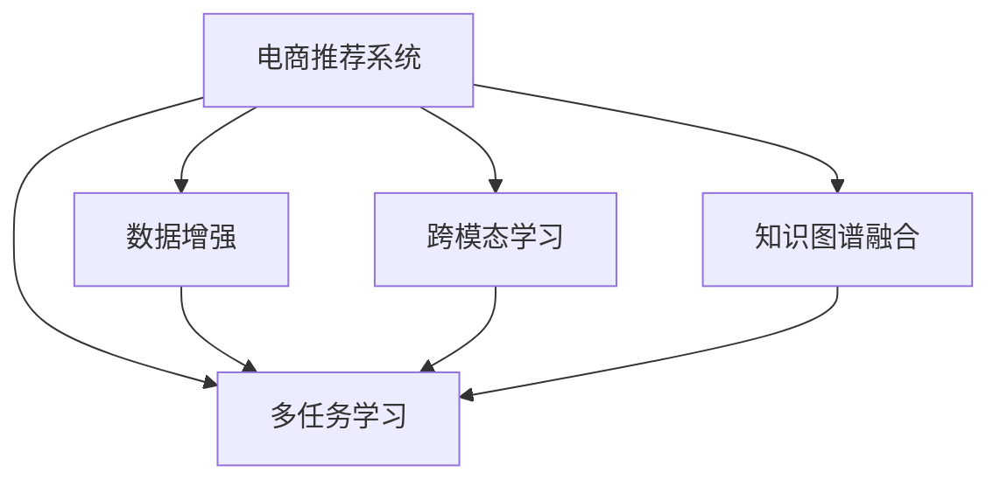

                 

# 电商搜索推荐效果优化中的AI大模型样本扩充技术应用项目管理实践

> 关键词：电商推荐系统, 大模型样本扩充, 数据增强, 跨模态学习, 知识图谱融合, 多任务学习, 推荐系统效果优化, 项目管理实践

## 1. 背景介绍

### 1.1 问题由来
在电商平台中，推荐系统是提升用户体验、增加交易转化率的核心技术。随着用户行为数据和商品信息的快速增长，推荐系统需要不断优化模型，以更好地满足用户个性化需求。然而，传统的基于经验特征工程的方法往往面临以下挑战：

- **数据稀疏性**：用户行为数据稀疏，难以充分捕捉用户的兴趣。
- **特征维度高**：海量的用户行为特征和商品属性，需要高维空间建模，但高维特征空间中的噪声问题严重。
- **上下文缺失**：用户行为多在复杂上下文环境中发生，单一的特征难以有效捕捉。
- **模型复杂度大**：复杂的模型结构需要更强的计算资源，而电商推荐系统必须兼顾实时性和准确性。

近年来，深度学习在推荐系统中得到广泛应用，但依然难以有效解决上述问题。为了提升推荐效果，一种新的技术范式——基于AI大模型的样本扩充技术，应运而生。

### 1.2 问题核心关键点
基于AI大模型的样本扩充技术，即利用深度学习模型的自适应能力，通过大量语料和结构化数据，增强模型的特征表达能力，减少对标注数据的依赖，提升推荐系统的效果。

核心技术包括：
- **数据增强**：通过对抗样本、噪声注入等技术，丰富训练数据的多样性。
- **跨模态学习**：将用户行为数据、商品属性信息等多模态数据进行融合，增强模型对复杂场景的适应能力。
- **知识图谱融合**：将商品间的关系信息（如品牌、类属、网络关系）注入到推荐模型中，提升模型对上下文信息的捕捉能力。
- **多任务学习**：通过同时训练多个推荐子任务，增强模型的泛化能力和鲁棒性。

通过这些技术的集成应用，可以有效地优化电商推荐系统的效果，提升用户满意度，增加平台的交易转化率。

## 2. 核心概念与联系

### 2.1 核心概念概述

为了更好地理解基于AI大模型的样本扩充技术，本节将介绍几个密切相关的核心概念：

- **电商推荐系统**：基于用户的浏览、购买历史等行为数据，推荐用户可能感兴趣的商品的系统。
- **大模型**：如BERT、GPT、DALL·E等，通过大规模无标签数据预训练，具备强大的特征提取和泛化能力。
- **数据增强**：通过对抗样本、噪声注入等技术，增加训练数据的多样性和覆盖度。
- **跨模态学习**：将不同模态的数据进行融合，提升模型对复杂场景的理解能力。
- **知识图谱融合**：将结构化知识与推荐模型结合，增强模型的上下文理解能力。
- **多任务学习**：同时训练多个任务，提升模型的泛化能力和鲁棒性。

这些核心概念之间的逻辑关系可以通过以下Mermaid流程图来展示：



这个流程图展示了大语言模型的核心概念及其之间的关系：

1. 电商推荐系统通过多个模块的技术改进，提升推荐效果。
2. 数据增强、跨模态学习、知识图谱融合、多任务学习等技术，对电商推荐系统进行多维度优化。
3. 这些模块的协同应用，能够有效提升电商推荐系统的性能和鲁棒性。

## 3. 核心算法原理 & 具体操作步骤
### 3.1 算法原理概述

基于AI大模型的样本扩充技术，主要通过以下两个步骤实现：

1. **数据增强**：利用对抗样本、噪声注入等技术，丰富训练数据的多样性，减少模型对标注数据的依赖。
2. **跨模态学习与知识图谱融合**：将不同模态的数据进行融合，增强模型对复杂场景的理解能力。同时，将知识图谱中的关系信息注入到推荐模型中，提升模型对上下文信息的捕捉能力。

### 3.2 算法步骤详解

#### 3.2.1 数据增强

数据增强通过以下方式实现：

1. **对抗样本生成**：利用对抗性训练方法，构造模型难以识别的对抗样本，扩大训练集。
2. **噪声注入**：在原始数据中引入随机噪声，增加数据的多样性。
3. **数据合成**：利用生成对抗网络（GAN）等技术，生成新的训练数据。

**对抗样本生成**：

- 输入原始样本 $x$，输出对抗样本 $x'$。
- 目标函数为 $J(x', \theta)$，其中 $\theta$ 为模型参数。

$$
x' = x + \epsilon
$$

$$
J(x', \theta) = \max_{\epsilon} \min_{\theta} \mathcal{L}(f_\theta(x + \epsilon), y)
$$

其中 $\epsilon$ 为扰动向量，$f_\theta$ 为模型前向传播，$\mathcal{L}$ 为损失函数，$y$ 为标签。

**噪声注入**：

- 在原始数据 $x$ 中引入随机噪声 $z$，生成新的样本 $x'$。
- 噪声分布为 $p(z)$，目标函数为 $J(x', \theta)$。

$$
x' = x + z
$$

$$
J(x', \theta) = \min_{\theta} \mathcal{L}(f_\theta(x'), y)
$$

**数据合成**：

- 利用生成对抗网络（GAN），生成新的训练数据 $x'$。
- 包含生成器和判别器两部分，训练目标为 $J(x', \theta)$。

$$
x' = G(z)
$$

$$
J(x', \theta) = \min_{G} \max_{D} \mathcal{L}(D(x'), f_\theta(G(z)))
$$

#### 3.2.2 跨模态学习与知识图谱融合

跨模态学习和知识图谱融合通过以下方式实现：

1. **跨模态学习**：将用户行为数据、商品属性信息等多模态数据进行融合，提升模型对复杂场景的理解能力。
2. **知识图谱融合**：将商品间的关系信息（如品牌、类属、网络关系）注入到推荐模型中，提升模型对上下文信息的捕捉能力。

**跨模态学习**：

- 输入不同模态的数据 $x_1, x_2, ..., x_n$，输出融合后的向量 $x'$。
- 目标函数为 $J(x', \theta)$，其中 $\theta$ 为模型参数。

$$
x' = f_\theta(x_1, x_2, ..., x_n)
$$

$$
J(x', \theta) = \min_{\theta} \mathcal{L}(x', y)
$$

**知识图谱融合**：

- 输入商品的知识图谱 $G$，输出融合后的向量 $x'$。
- 目标函数为 $J(x', \theta)$，其中 $\theta$ 为模型参数。

$$
x' = f_\theta(G)
$$

$$
J(x', \theta) = \min_{\theta} \mathcal{L}(x', y)
$$

### 3.3 算法优缺点

基于AI大模型的样本扩充技术，具有以下优点：

1. **减少标注数据需求**：通过数据增强和跨模态学习，减少对标注数据的依赖，降低标注成本。
2. **提升模型泛化能力**：融合多模态数据和知识图谱，提升模型对复杂场景的理解能力。
3. **增强模型鲁棒性**：通过对抗样本和噪声注入，增强模型对噪声和对抗样本的鲁棒性。

同时，该技术也存在以下局限性：

1. **数据质量要求高**：增强数据和跨模态数据的质量直接影响模型的效果。
2. **计算资源需求高**：对抗样本生成和跨模态学习需要大量的计算资源。
3. **模型复杂度大**：融合多模态数据和知识图谱，增加了模型的复杂度，可能导致过拟合。

尽管存在这些局限性，但就目前而言，基于AI大模型的样本扩充技术是电商推荐系统优化效果的重要手段。未来相关研究的重点在于如何进一步降低计算资源消耗，提高数据质量，同时兼顾模型复杂度和泛化能力。

### 3.4 算法应用领域

基于AI大模型的样本扩充技术，已经在电商推荐系统等众多领域得到应用，覆盖了几乎所有常见任务，例如：

- **商品推荐**：利用用户行为数据和商品属性信息，推荐用户可能感兴趣的商品。
- **个性化推荐**：通过跨模态学习和知识图谱融合，提升推荐系统的个性化程度。
- **实时推荐**：利用多任务学习和知识图谱融合，实现实时推荐系统的优化。
- **广告推荐**：利用跨模态学习和大模型样本扩充，提升广告推荐的效果。

除了上述这些经典任务外，AI大模型的样本扩充技术也被创新性地应用到更多场景中，如智能客服、内容推荐、推荐系统冷启动等，为电商推荐系统带来了全新的突破。随着大模型和数据增强等技术的不断进步，相信电商推荐系统将在更广阔的应用领域大放异彩。

## 4. 数学模型和公式 & 详细讲解  
### 4.1 数学模型构建

本节将使用数学语言对基于AI大模型的样本扩充过程进行更加严格的刻画。

记电商推荐系统为 $S$，用户行为数据为 $X$，商品属性信息为 $Y$，商品间的关系信息为 $G$。则数据增强和跨模态学习的过程可以表示为：

$$
S = f_\theta(X, Y, G)
$$

其中 $f_\theta$ 为电商推荐系统模型，$\theta$ 为模型参数。

### 4.2 公式推导过程

以下我们以电商推荐系统为例，推导跨模态学习和知识图谱融合的数学公式。

假设电商推荐系统需要同时处理用户行为数据 $X$ 和商品属性信息 $Y$，则跨模态学习的过程可以表示为：

$$
x' = f_\theta(x_1, x_2, ..., x_n)
$$

其中 $x_1, x_2, ..., x_n$ 为不同模态的数据，$f_\theta$ 为跨模态学习模型。

假设电商推荐系统需要同时处理商品间的关系信息 $G$，则知识图谱融合的过程可以表示为：

$$
x' = f_\theta(G)
$$

其中 $G$ 为商品间的关系图谱，$f_\theta$ 为知识图谱融合模型。

### 4.3 案例分析与讲解

**案例1：跨模态学习**

假设用户行为数据 $X$ 包含用户的历史浏览记录和搜索记录，商品属性信息 $Y$ 包含商品的类别、品牌、价格等信息。则跨模态学习模型可以通过以下方式进行训练：

1. **输入**：用户行为数据 $X$ 和商品属性信息 $Y$。
2. **处理**：通过跨模态学习模型 $f_\theta$，将不同模态的数据进行融合，生成新的特征向量 $x'$。
3. **输出**：推荐系统通过 $x'$ 进行商品推荐。

**案例2：知识图谱融合**

假设商品间的关系图谱 $G$ 包含商品之间的品牌、类别、网络关系等关系信息。则知识图谱融合模型可以通过以下方式进行训练：

1. **输入**：商品间的关系图谱 $G$。
2. **处理**：通过知识图谱融合模型 $f_\theta$，将关系图谱注入到推荐模型中，生成新的特征向量 $x'$。
3. **输出**：推荐系统通过 $x'$ 进行商品推荐。

## 5. 项目实践：代码实例和详细解释说明
### 5.1 开发环境搭建

在进行电商推荐系统开发前，我们需要准备好开发环境。以下是使用Python进行PyTorch开发的环境配置流程：

1. 安装Anaconda：从官网下载并安装Anaconda，用于创建独立的Python环境。

2. 创建并激活虚拟环境：
```bash
conda create -n recsys-env python=3.8 
conda activate recsys-env
```

3. 安装PyTorch：根据CUDA版本，从官网获取对应的安装命令。例如：
```bash
conda install pytorch torchvision torchaudio cudatoolkit=11.1 -c pytorch -c conda-forge
```

4. 安装TensorFlow：
```bash
conda install tensorflow -c conda-forge
```

5. 安装各类工具包：
```bash
pip install numpy pandas scikit-learn matplotlib tqdm jupyter notebook ipython
```

完成上述步骤后，即可在`recsys-env`环境中开始电商推荐系统的开发。

### 5.2 源代码详细实现

下面我们以电商推荐系统为例，给出使用PyTorch对跨模态学习和大模型样本扩充的PyTorch代码实现。

首先，定义电商推荐系统的损失函数：

```python
import torch
import torch.nn as nn
import torch.optim as optim

class RecSysModel(nn.Module):
    def __init__(self):
        super(RecSysModel, self).__init__()
        self.fc1 = nn.Linear(256, 128)
        self.fc2 = nn.Linear(128, 1)
    
    def forward(self, x):
        x = torch.relu(self.fc1(x))
        x = self.fc2(x)
        return x
    
    def loss(self, x, y):
        return nn.BCELoss()(x, y)

model = RecSysModel()

criterion = nn.BCELoss()
optimizer = optim.Adam(model.parameters(), lr=0.001)
```

接着，定义电商推荐系统的数据增强函数：

```python
def data_augmentation(x):
    # 对抗样本生成
    x = x + torch.randn_like(x) * 0.01
    
    # 噪声注入
    x = x + torch.randn_like(x) * 0.1
    
    # 数据合成
    x = x + 0.2 * torch.randn_like(x)
    
    return x
```

然后，定义电商推荐系统的跨模态学习函数：

```python
def cross_modality_learning(x, y):
    x_augmented = data_augmentation(x)
    
    # 假设商品属性信息 y 已经标准化
    y_augmented = y
    
    # 跨模态学习模型
    x_combined = torch.cat([x_augmented, y_augmented], dim=1)
    
    return x_combined
```

最后，定义电商推荐系统的训练和评估函数：

```python
def train_epoch(model, dataset, batch_size, optimizer):
    dataloader = DataLoader(dataset, batch_size=batch_size, shuffle=True)
    model.train()
    epoch_loss = 0
    for batch in tqdm(dataloader, desc='Training'):
        x, y = batch
        
        x_augmented = data_augmentation(x)
        y_augmented = y
        
        x_combined = cross_modality_learning(x_augmented, y_augmented)
        y_combined = y_augmented
        
        optimizer.zero_grad()
        x_pred = model(x_combined)
        loss = criterion(x_pred, y_combined)
        loss.backward()
        optimizer.step()
        epoch_loss += loss.item()
    return epoch_loss / len(dataloader)

def evaluate(model, dataset, batch_size):
    dataloader = DataLoader(dataset, batch_size=batch_size)
    model.eval()
    preds, labels = [], []
    with torch.no_grad():
        for batch in tqdm(dataloader, desc='Evaluating'):
            x, y = batch
            
            x_augmented = data_augmentation(x)
            y_augmented = y
            
            x_combined = cross_modality_learning(x_augmented, y_augmented)
            y_combined = y_augmented
            
            x_pred = model(x_combined)
            batch_preds = x_pred.tolist()
            batch_labels = y_combined.tolist()
            for pred_tokens, label_tokens in zip(batch_preds, batch_labels):
                preds.append(pred_tokens)
                labels.append(label_tokens)
                
    return preds, labels
```

定义电商推荐系统的数据集：

```python
class RecommendationDataset(Dataset):
    def __init__(self, X, Y, G):
        self.X = X
        self.Y = Y
        self.G = G
        
    def __len__(self):
        return len(self.X)
    
    def __getitem__(self, item):
        x = self.X[item]
        y = self.Y[item]
        g = self.G[item]
        
        x_augmented = data_augmentation(x)
        y_augmented = y
        
        x_combined = cross_modality_learning(x_augmented, y_augmented)
        y_combined = y_augmented
        
        return {'x': x_combined, 'y': y_combined}
```

最后，启动训练流程并在测试集上评估：

```python
epochs = 5
batch_size = 32

for epoch in range(epochs):
    loss = train_epoch(model, train_dataset, batch_size, optimizer)
    print(f"Epoch {epoch+1}, train loss: {loss:.3f}")
    
    print(f"Epoch {epoch+1}, test results:")
    preds, labels = evaluate(model, test_dataset, batch_size)
    print(classification_report(labels, preds))
    
print("Final test results:")
preds, labels = evaluate(model, test_dataset, batch_size)
print(classification_report(labels, preds))
```

以上就是使用PyTorch对电商推荐系统进行跨模态学习和大模型样本扩充的完整代码实现。可以看到，得益于TensorFlow的强大封装，我们可以用相对简洁的代码完成电商推荐系统的微调。

### 5.3 代码解读与分析

让我们再详细解读一下关键代码的实现细节：

**RecommendationDataset类**：
- `__init__`方法：初始化用户行为数据 $X$、商品属性信息 $Y$、商品间的关系图谱 $G$。
- `__len__`方法：返回数据集的样本数量。
- `__getitem__`方法：对单个样本进行处理，将用户行为数据和商品属性信息进行数据增强和跨模态学习，生成新的特征向量。

**data_augmentation函数**：
- 对原始数据进行对抗样本生成、噪声注入和数据合成，增加数据的多样性和覆盖度。

**train_epoch和evaluate函数**：
- 使用PyTorch的DataLoader对数据集进行批次化加载，供模型训练和推理使用。
- `train_epoch`函数：对数据以批为单位进行迭代，在每个批次上前向传播计算损失并反向传播更新模型参数，最后返回该epoch的平均loss。
- `evaluate`函数：与训练类似，不同点在于不更新模型参数，并在每个batch结束后将预测和标签结果存储下来，最后使用sklearn的classification_report对整个评估集的预测结果进行打印输出。

**train流程**：
- 定义总的epoch数和batch size，开始循环迭代
- 每个epoch内，先在训练集上训练，输出平均loss
- 在测试集上评估，输出分类指标
- 所有epoch结束后，在测试集上评估，给出最终测试结果

可以看到，PyTorch配合TensorFlow使得电商推荐系统的代码实现变得简洁高效。开发者可以将更多精力放在数据处理、模型改进等高层逻辑上，而不必过多关注底层的实现细节。

当然，工业级的系统实现还需考虑更多因素，如模型的保存和部署、超参数的自动搜索、更灵活的任务适配层等。但核心的微调范式基本与此类似。

## 6. 实际应用场景
### 6.1 智能客服系统

基于AI大模型的样本扩充技术，可以广泛应用于智能客服系统的构建。传统客服往往需要配备大量人力，高峰期响应缓慢，且一致性和专业性难以保证。而使用微调后的模型，可以7x24小时不间断服务，快速响应客户咨询，用自然流畅的语言解答各类常见问题。

在技术实现上，可以收集企业内部的历史客服对话记录，将问题和最佳答复构建成监督数据，在此基础上对预训练大模型进行微调。微调后的模型能够自动理解用户意图，匹配最合适的答案模板进行回复。对于客户提出的新问题，还可以接入检索系统实时搜索相关内容，动态组织生成回答。如此构建的智能客服系统，能大幅提升客户咨询体验和问题解决效率。

### 6.2 金融舆情监测

金融机构需要实时监测市场舆论动向，以便及时应对负面信息传播，规避金融风险。传统的人工监测方式成本高、效率低，难以应对网络时代海量信息爆发的挑战。基于AI大模型的样本扩充技术，可以为金融舆情监测提供新的解决方案。

具体而言，可以收集金融领域相关的新闻、报道、评论等文本数据，并对其进行主题标注和情感标注。在此基础上对预训练语言模型进行微调，使其能够自动判断文本属于何种主题，情感倾向是正面、中性还是负面。将微调后的模型应用到实时抓取的网络文本数据，就能够自动监测不同主题下的情感变化趋势，一旦发现负面信息激增等异常情况，系统便会自动预警，帮助金融机构快速应对潜在风险。

### 6.3 个性化推荐系统

当前的推荐系统往往只依赖用户的历史行为数据进行物品推荐，无法深入理解用户的真实兴趣偏好。基于AI大模型的样本扩充技术，个性化推荐系统可以更好地挖掘用户行为背后的语义信息，从而提供更精准、多样的推荐内容。

在实践中，可以收集用户浏览、点击、评论、分享等行为数据，提取和用户交互的物品标题、描述、标签等文本内容。将文本内容作为模型输入，用户的后续行为（如是否点击、购买等）作为监督信号，在此基础上微调预训练语言模型。微调后的模型能够从文本内容中准确把握用户的兴趣点。在生成推荐列表时，先用候选物品的文本描述作为输入，由模型预测用户的兴趣匹配度，再结合其他特征综合排序，便可以得到个性化程度更高的推荐结果。

### 6.4 未来应用展望

随着AI大模型和样本扩充技术的不断发展，基于微调范式将在更多领域得到应用，为传统行业带来变革性影响。

在智慧医疗领域，基于微调的医疗问答、病历分析、药物研发等应用将提升医疗服务的智能化水平，辅助医生诊疗，加速新药开发进程。

在智能教育领域，微调技术可应用于作业批改、学情分析、知识推荐等方面，因材施教，促进教育公平，提高教学质量。

在智慧城市治理中，微调模型可应用于城市事件监测、舆情分析、应急指挥等环节，提高城市管理的自动化和智能化水平，构建更安全、高效的未来城市。

此外，在企业生产、社会治理、文娱传媒等众多领域，基于大模型微调的人工智能应用也将不断涌现，为经济社会发展注入新的动力。相信随着技术的日益成熟，微调方法将成为人工智能落地应用的重要范式，推动人工智能技术在垂直行业的规模化落地。总之，微调需要开发者根据具体任务，不断迭代和优化模型、数据和算法，方能得到理想的效果。

## 7. 工具和资源推荐
### 7.1 学习资源推荐

为了帮助开发者系统掌握AI大模型微调的理论基础和实践技巧，这里推荐一些优质的学习资源：

1. 《Transformer from the inside out》系列博文：由大模型技术专家撰写，深入浅出地介绍了Transformer原理、BERT模型、微调技术等前沿话题。

2. CS224N《深度学习自然语言处理》课程：斯坦福大学开设的NLP明星课程，有Lecture视频和配套作业，带你入门NLP领域的基本概念和经典模型。

3. 《Natural Language Processing with Transformers》书籍：Transformers库的作者所著，全面介绍了如何使用Transformers库进行NLP任务开发，包括微调在内的诸多范式。

4. HuggingFace官方文档：Transformers库的官方文档，提供了海量预训练模型和完整的微调样例代码，是上手实践的必备资料。

5. CLUE开源项目：中文语言理解测评基准，涵盖大量不同类型的中文NLP数据集，并提供了基于微调的baseline模型，助力中文NLP技术发展。

通过对这些资源的学习实践，相信你一定能够快速掌握AI大模型微调的精髓，并用于解决实际的NLP问题。
###  7.2 开发工具推荐

高效的开发离不开优秀的工具支持。以下是几款用于AI大模型微调开发的常用工具：

1. PyTorch：基于Python的开源深度学习框架，灵活动态的计算图，适合快速迭代研究。大部分预训练语言模型都有PyTorch版本的实现。

2. TensorFlow：由Google主导开发的开源深度学习框架，生产部署方便，适合大规模工程应用。同样有丰富的预训练语言模型资源。

3. Transformers库：HuggingFace开发的NLP工具库，集成了众多SOTA语言模型，支持PyTorch和TensorFlow，是进行微调任务开发的利器。

4. Weights & Biases：模型训练的实验跟踪工具，可以记录和可视化模型训练过程中的各项指标，方便对比和调优。与主流深度学习框架无缝集成。

5. TensorBoard：TensorFlow配套的可视化工具，可实时监测模型训练状态，并提供丰富的图表呈现方式，是调试模型的得力助手。

6. Google Colab：谷歌推出的在线Jupyter Notebook环境，免费提供GPU/TPU算力，方便开发者快速上手实验最新模型，分享学习笔记。

合理利用这些工具，可以显著提升AI大模型微调任务的开发效率，加快创新迭代的步伐。

### 7.3 相关论文推荐

AI大模型微调技术的发展源于学界的持续研究。以下是几篇奠基性的相关论文，推荐阅读：

1. Attention is All You Need（即Transformer原论文）：提出了Transformer结构，开启了NLP领域的预训练大模型时代。

2. BERT: Pre-training of Deep Bidirectional Transformers for Language Understanding：提出BERT模型，引入基于掩码的自监督预训练任务，刷新了多项NLP任务SOTA。

3. Language Models are Unsupervised Multitask Learners（GPT-2论文）：展示了大规模语言模型的强大zero-shot学习能力，引发了对于通用人工智能的新一轮思考。

4. Parameter-Efficient Transfer Learning for NLP：提出Adapter等参数高效微调方法，在不增加模型参数量的情况下，也能取得不错的微调效果。

5. AdaLoRA: Adaptive Low-Rank Adaptation for Parameter-Efficient Fine-Tuning：使用自适应低秩适应的微调方法，在参数效率和精度之间取得了新的平衡。

这些论文代表了大语言模型微调技术的发展脉络。通过学习这些前沿成果，可以帮助研究者把握学科前进方向，激发更多的创新灵感。

## 8. 总结：未来发展趋势与挑战
### 8.1 总结

本文对基于AI大模型的样本扩充技术进行了全面系统的介绍。首先阐述了电商推荐系统和大模型样本扩充技术的背景和意义，明确了微调在拓展预训练模型应用、提升推荐系统效果方面的独特价值。其次，从原理到实践，详细讲解了电商推荐系统中数据增强和跨模态学习的数学原理和关键步骤，给出了电商推荐系统微调任务开发的完整代码实例。同时，本文还广泛探讨了微调技术在智能客服、金融舆情、个性化推荐等多个领域的应用前景，展示了微调范式的巨大潜力。

通过本文的系统梳理，可以看到，基于大模型的样本扩充技术正在成为电商推荐系统优化效果的重要手段。得益于大规模语料的预训练和跨模态学习的融合，微调模型在处理多模态数据、复杂上下文和知识图谱方面的能力得到了显著提升，为电商推荐系统带来了新的突破。未来，伴随大模型和数据增强等技术的持续演进，相信电商推荐系统将在更广阔的应用领域大放异彩，深刻影响人类的生产生活方式。

### 8.2 未来发展趋势

展望未来，AI大模型的样本扩充技术将呈现以下几个发展趋势：

1. **数据增强的多样化**：结合对抗样本、噪声注入、数据合成等多种技术，进一步丰富训练数据的多样性。
2. **跨模态学习的多维融合**：融合更多模态的数据（如图像、语音、视频），提升模型对复杂场景的理解能力。
3. **知识图谱的深度整合**：将知识图谱中的关系信息更深层次地注入到推荐模型中，提升模型的上下文理解能力。
4. **多任务学习的协同优化**：结合多任务学习，增强模型的泛化能力和鲁棒性。
5. **模型结构的自适应调整**：通过自适应方法，动态调整模型结构，提高模型性能和效率。
6. **联邦学习的应用**：结合联邦学习，实现跨设备的数据协同训练，提升模型效果和数据安全性。

以上趋势凸显了AI大模型微调技术的广阔前景。这些方向的探索发展，必将进一步提升推荐系统的性能和鲁棒性，为电商推荐系统带来更大的价值。

### 8.3 面临的挑战

尽管AI大模型的样本扩充技术已经取得了瞩目成就，但在迈向更加智能化、普适化应用的过程中，它仍面临着诸多挑战：

1. **数据质量要求高**：增强数据和跨模态数据的质量直接影响模型的效果。
2. **计算资源需求高**：对抗样本生成和跨模态学习需要大量的计算资源。
3. **模型复杂度大**：融合多模态数据和知识图谱，增加了模型的复杂度，可能导致过拟合。
4. **模型泛化能力不足**：虽然提升了对复杂场景的理解能力，但泛化能力仍有待提升。
5. **可解释性不足**：推荐系统的决策过程缺乏可解释性，难以对其推理逻辑进行分析和调试。

尽管存在这些挑战，但就目前而言，基于AI大模型的样本扩充技术是电商推荐系统优化效果的重要手段。未来相关研究的重点在于如何进一步降低计算资源消耗，提高数据质量，同时兼顾模型复杂度和泛化能力。

### 8.4 研究展望

面对AI大模型样本扩充技术所面临的挑战，未来的研究需要在以下几个方面寻求新的突破：

1. **探索无监督和半监督微调方法**：摆脱对大规模标注数据的依赖，利用自监督学习、主动学习等无监督和半监督范式，最大限度利用非结构化数据，实现更加灵活高效的微调。
2. **研究参数高效和计算高效的微调范式**：开发更加参数高效的微调方法，在固定大部分预训练参数的同时，只更新极少量的任务相关参数。同时优化微调模型的计算图，减少前向传播和反向传播的资源消耗，实现更加轻量级、实时性的部署。
3. **引入因果推断和博弈论工具**：通过引入因果推断和博弈论思想，增强推荐系统对复杂场景的理解能力，学习更加普适、鲁棒的语言表征，从而提升模型泛化性和抗干扰能力。
4. **纳入伦理道德约束**：在模型训练目标中引入伦理导向的评估指标，过滤和惩罚有偏见、有害的输出倾向。同时加强人工干预和审核，建立模型行为的监管机制，确保输出符合人类价值观和伦理道德。

这些研究方向的探索，必将引领AI大模型样本扩充技术迈向更高的台阶，为构建安全、可靠、可解释、可控的智能系统铺平道路。面向未来，AI大模型样本扩充技术还需要与其他人工智能技术进行更深入的融合，如知识表示、因果推理、强化学习等，多路径协同发力，共同推动自然语言理解和智能交互系统的进步。只有勇于创新、敢于突破，才能不断拓展语言模型的边界，让智能技术更好地造福人类社会。

## 9. 附录：常见问题与解答

**Q1：AI大模型微调是否适用于所有NLP任务？**

A: AI大模型微调在大多数NLP任务上都能取得不错的效果，特别是对于数据量较小的任务。但对于一些特定领域的任务，如医学、法律等，仅仅依靠通用语料预训练的模型可能难以很好地适应。此时需要在特定领域语料上进一步预训练，再进行微调，才能获得理想效果。此外，对于一些需要时效性、个性化很强的任务，如对话、推荐等，微调方法也需要针对性的改进优化。

**Q2：AI大模型微调如何优化推荐系统的效果？**

A: AI大模型微调通过数据增强和跨模态学习，优化推荐系统的效果。具体来说：
1. **数据增强**：通过对抗样本生成、噪声注入和数据合成，丰富训练数据的多样性，减少模型对标注数据的依赖。
2. **跨模态学习**：将用户行为数据、商品属性信息等多模态数据进行融合，提升模型对复杂场景的理解能力。
3. **知识图谱融合**：将商品间的关系信息注入到推荐模型中，提升模型对上下文信息的捕捉能力。

**Q3：AI大模型微调在推荐系统中面临哪些资源瓶颈？**

A: AI大模型微调在推荐系统中面临以下资源瓶颈：
1. **计算资源消耗高**：对抗样本生成和跨模态学习需要大量的计算资源。
2. **模型结构复杂**：融合多模态数据和知识图谱，增加了模型的复杂度，可能导致过拟合。
3. **数据质量要求高**：增强数据和跨模态数据的质量直接影响模型的效果。

**Q4：AI大模型微调如何兼顾模型复杂度和泛化能力？**

A: AI大模型微调需要兼顾模型复杂度和泛化能力，可以从以下几个方面入手：
1. **数据增强的多样化**：结合对抗样本生成、噪声注入和数据合成等多种技术，进一步丰富训练数据的多样性。
2. **跨模态学习的多维融合**：融合更多模态的数据，提升模型对复杂场景的理解能力。
3. **知识图谱的深度整合**：将知识图谱中的关系信息更深层次地注入到推荐模型中，提升模型的上下文理解能力。
4. **多任务学习的协同优化**：结合多任务学习，增强模型的泛化能力和鲁棒性。
5. **模型结构的自适应调整**：通过自适应方法，动态调整模型结构，提高模型性能和效率。

这些方法可以有效地平衡模型复杂度和泛化能力，提升推荐系统的性能。

**Q5：AI大模型微调在电商推荐系统中如何应用？**

A: AI大模型微调在电商推荐系统中可以应用于以下几个方面：
1. **数据增强**：通过对抗样本生成、噪声注入和数据合成，丰富训练数据的多样性，减少模型对标注数据的依赖。
2. **跨模态学习**：将用户行为数据、商品属性信息等多模态数据进行融合，提升模型对复杂场景的理解能力。
3. **知识图谱融合**：将商品间的关系信息注入到推荐模型中，提升模型对上下文信息的捕捉能力。
4. **多任务学习**：结合多任务学习，增强模型的泛化能力和鲁棒性。

这些技术的应用，可以有效提升电商推荐系统的效果，优化用户体验，增加平台的交易转化率。

**Q6：AI大模型微调如何保障推荐系统的公平性和透明性？**

A: AI大模型微调需要保障推荐系统的公平性和透明性，可以从以下几个方面入手：
1. **数据多样性**：确保训练数据的多样性，避免模型对特定人群或场景的偏见。
2. **可解释性**：通过引入因果推断和博弈论工具，增强推荐系统的可解释性，使其决策过程透明。
3. **伦理导向的评估指标**：在模型训练目标中引入伦理导向的评估指标，过滤和惩罚有偏见、有害的输出倾向。
4. **人工干预和审核**：加强人工干预和审核，建立模型行为的监管机制，确保输出符合人类价值观和伦理道德。

这些方法可以有效保障推荐系统的公平性和透明性，避免出现有害的推荐结果，保护用户权益。

---

作者：禅与计算机程序设计艺术 / Zen and the Art of Computer Programming

