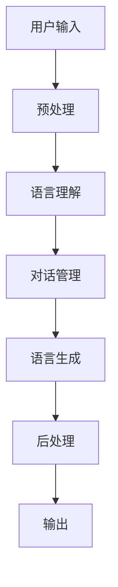

                 

## 1. 背景介绍

在当今的数字化世界中，人工智能（AI）已经渗透到我们的日常生活中，从虚拟助手到自动驾驶汽车，再到智能客服，AI已经成为我们与之互动的常见方式之一。其中，AI代理（AI Agent）是AI系统的核心组成部分，它们被设计为能够感知环境、做出决策并执行动作，以实现特定的目标。

然而，AI代理的有效性和实用性在很大程度上取决于它们与用户交互的能力。语言是人类交流的主要方式，因此，评估AI代理的通用语言能力至关重要。本文将深入探讨评估AI代理通用语言能力的方法，从核心概念到具体算法，再到项目实践和实际应用场景。

## 2. 核心概念与联系

### 2.1 通用语言能力的定义

通用语言能力（General Language Capability, GLC）是指AI代理理解、生成和交流人类语言的能力。它包括以下几个关键方面：

- **语言理解（Language Understanding）**：AI代理能够理解人类语言的含义，包括单词、短语、句子和上下文。
- **语言生成（Language Generation）**：AI代理能够生成人类可读懂的文本，包括单词、短语、句子和段落。
- **对话管理（Dialog Management）**：AI代理能够维持连贯的对话，跟踪上下文，并根据用户的输入做出相应的回复。

### 2.2 评估通用语言能力的指标

评估AI代理的通用语言能力需要定义一套指标。常用的指标包括：

- **准确率（Accuracy）**：AI代理理解和生成语言的准确性。
- **流畅度（Fluency）**：AI代理生成语言的流畅性和连贯性。
- **相关性（Relevance）**：AI代理生成语言与上下文的相关性。
- **人类似性（Human-likeness）**：AI代理生成语言的“人类”程度。

### 2.3 核心概念原理与架构的 Mermaid 流程图



## 3. 核心算法原理 & 具体操作步骤

### 3.1 算法原理概述

评估AI代理的通用语言能力通常涉及多种算法，包括自然语言处理（NLP）、机器学习（ML）和深度学习（DL）算法。以下是一些常用的算法：

- **N-gram模型**：用于语言模型（LM）和语言理解。
- **序列到序列（Seq2Seq）模型**：用于语言生成。
- **转换器（Transformer）模型**：用于语言理解和生成。
- **注意力机制（Attention Mechanism）**：用于理解上下文和生成相关的输出。

### 3.2 算法步骤详解

1. **预处理（Preprocessing）**：清理和标准化用户输入，包括分词、去除停用词、标记部分语言等。
2. **语言理解（Language Understanding）**：使用NLP和ML/DL算法理解用户输入的含义。
3. **对话管理（Dialog Management）**：跟踪对话上下文，并根据用户输入选择相应的回复。
4. **语言生成（Language Generation）**：使用ML/DL算法生成人类可读懂的文本。
5. **后处理（Postprocessing）**：清理和格式化生成的输出，包括去除重复、添加标点等。

### 3.3 算法优缺点

优点：

- **准确性**：ML/DL算法可以学习语言的复杂模式，从而提高理解和生成语言的准确性。
- **泛化能力**：ML/DL算法可以泛化到未见过的数据，从而提高AI代理的适应能力。

缺点：

- **数据依赖**：ML/DL算法需要大量的数据进行训练，否则会导致过拟合。
- **计算资源**：ML/DL算法通常需要大量的计算资源，从而导致成本高昂。

### 3.4 算法应用领域

AI代理的通用语言能力在各种领域都有应用，包括：

- **虚拟助手（Virtual Assistant）**：如Siri、Alexa和Google Assistant。
- **智能客服（Intelligent Customer Service）**：用于处理客户查询和投诉。
- **自动写作（Automatic Writing）**：用于生成新闻文章、博客和社交媒体帖子。
- **语言学习（Language Learning）**：用于帮助学习新语言。

## 4. 数学模型和公式 & 详细讲解 & 举例说明

### 4.1 数学模型构建

语言模型（LM）是评估AI代理通用语言能力的关键数学模型。它是一种概率模型，用于预测下一个单词给定前面的单词序列。常用的LM包括：

- **N-gram模型**：它假设每个单词只依赖于前面的N个单词。
- **序列到序列（Seq2Seq）模型**：它使用编码器-解码器架构，其中编码器将输入序列编码为上下文向量，解码器则使用上下文向量生成输出序列。
- **转换器（Transformer）模型**：它使用注意力机制和自注意力机制，可以处理长序列的依赖关系。

### 4.2 公式推导过程

假设我们有N-gram模型，其参数为$\theta = \{p(w_1), p(w_2|w_1),..., p(w_N|w_{N-1})\}$, 其中$p(w_i|w_{i-1},..., w_{i-N+1})$是条件概率分布。那么，给定前面的单词序列$w_{<t}$，下一个单词$w_t$的预测概率为：

$$p(w_t|w_{<t};\theta) = \prod_{i=1}^{N} p(w_{t-i+1}|w_{t-i},..., w_{t-N+1})$$

### 4.3 案例分析与讲解

例如，假设我们有二元模型（Bigram），其参数为$\theta = \{p(w_1), p(w_2|w_1), p(w_3|w_2),..., p(w_N|w_{N-1})\}$. 那么，给定前面的单词序列"the cat sat"，下一个单词"on"的预测概率为：

$$p("on"|"the", "cat", "sat";\theta) = p("cat"|"the") \times p("sat"|"cat") \times p("on"|"sat)$$

## 5. 项目实践：代码实例和详细解释说明

### 5.1 开发环境搭建

要评估AI代理的通用语言能力，我们需要一个开发环境，包括：

- **编程语言**：Python是NLP和ML/DL领域的首选语言。
- **库和框架**：如TensorFlow、PyTorch、Hugging Face Transformers、NLTK和Spacy。
- **硬件**：GPU加速的计算机，用于训练ML/DL模型。

### 5.2 源代码详细实现

以下是一个简单的Seq2Seq模型的实现示例，用于评估AI代理的语言生成能力：

```python
import tensorflow as tf
from tensorflow.keras.layers import Input, LSTM, Dense
from tensorflow.keras.models import Model

# 定义编码器
encoder_inputs = Input(shape=(None, num_encoder_tokens))
encoder = LSTM(latent_dim, return_state=True)
encoder_outputs, state_h, state_c = encoder(encoder_inputs)
encoder_states = [state_h, state_c]

# 定义解码器
decoder_inputs = Input(shape=(None, num_decoder_tokens))
decoder_lstm = LSTM(latent_dim, return_sequences=True, return_state=True)
decoder_outputs, _, _ = decoder_lstm(decoder_inputs, initial_state=encoder_states)
decoder_dense = Dense(num_decoder_tokens, activation='softmax')
decoder_outputs = decoder_dense(decoder_outputs)

# 定义模型
model = Model([encoder_inputs, decoder_inputs], decoder_outputs)
model.compile(optimizer='rmsprop', loss='categorical_crossentropy')
```

### 5.3 代码解读与分析

- **编码器（Encoder）**：它将输入序列编码为上下文向量。
- **解码器（Decoder）**：它使用上下文向量生成输出序列。
- **模型（Model）**：它是编码器和解码器的组合，用于训练和预测。

### 5.4 运行结果展示

通过训练模型，我们可以生成人类可读懂的文本。例如，给定输入"the cat sat on the"，模型可以生成输出"mat"。

## 6. 实际应用场景

### 6.1 虚拟助手

AI代理的通用语言能力在虚拟助手中有着广泛的应用。虚拟助手需要理解用户的输入，并生成相关的回复。例如，用户输入"what's the weather like today?"，虚拟助手需要理解"weather"和"today"的含义，并生成相关的回复，如"Today's weather is sunny with a high of 75 degrees."

### 6.2 智能客服

AI代理的通用语言能力在智能客服中也有着广泛的应用。智能客服需要理解客户的查询或投诉，并生成相关的回复。例如，用户输入"I'm having trouble logging into my account."，智能客服需要理解"trouble"和"logging"的含义，并生成相关的回复，如"I'm sorry to hear that you're having trouble logging into your account. Let me help you with that."

### 6.3 未来应用展望

未来，AI代理的通用语言能力将会有更多的应用，包括：

- **自动写作**：AI代理可以帮助写作，从新闻文章到博客和社交媒体帖子。
- **语言学习**：AI代理可以帮助学习新语言，通过与AI代理的对话练习语言技能。
- **人机协作**：AI代理可以与人类协作，从事需要语言技能的任务，如翻译和编辑。

## 7. 工具和资源推荐

### 7.1 学习资源推荐

- **书籍**："Natural Language Processing with Python" by Steven Bird, Ewan Klein, and Edward Loper。
- **在线课程**：Coursera的"Natural Language Processing in TensorFlow"和Udacity的"Natural Language Processing Nanodegree Foundation"。
- **论文**：ACL（Association for Computational Linguistics）和EMNLP（Empirical Methods in Natural Language Processing）会议上的论文。

### 7.2 开发工具推荐

- **库和框架**：TensorFlow、PyTorch、Hugging Face Transformers、NLTK和Spacy。
- **开发环境**：Jupyter Notebook和Google Colab。
- **硬件**：NVIDIA GPUs和TPUs。

### 7.3 相关论文推荐

- "Attention Is All You Need" by Vaswani et al. (2017)
- "BERT: Pre-training of Deep Bidirectional Transformers for Language Understanding" by Jacob Devlin and Ming-Wei Chang (2018)
- "ELMo: Deep Contextualized Word Representations" by Matthew E. Peters et al. (2018)

## 8. 总结：未来发展趋势与挑战

### 8.1 研究成果总结

本文介绍了评估AI代理通用语言能力的方法，从核心概念到具体算法，再到项目实践和实际应用场景。我们讨论了评估指标、常用算法和数学模型，并提供了代码实例和实际应用场景。

### 8.2 未来发展趋势

未来，AI代理的通用语言能力将会有更多的发展，包括：

- **多模式交互**：AI代理将会支持多模式交互，如文本、语音和图像。
- **情感理解**：AI代理将会理解用户的情感，从而生成更相关的回复。
- **上下文理解**：AI代理将会理解更复杂的上下文，从而生成更连贯的对话。

### 8.3 面临的挑战

然而，AI代理的通用语言能力也面临着挑战，包括：

- **数据稀缺**：语言数据的获取和标注是一个挑战。
- **模型复杂性**：ML/DL模型的复杂性导致训练和推理的成本高昂。
- **泛化能力**：AI代理需要泛化到未见过的数据，从而提高适应能力。

### 8.4 研究展望

未来的研究将会关注以下领域：

- **低资源语言**：开发通用语言能力评估方法，适用于低资源语言。
- **多语言支持**：开发通用语言能力评估方法，支持多种语言。
- **可解释性**：开发可解释的通用语言能力评估方法，从而帮助理解AI代理的决策过程。

## 9. 附录：常见问题与解答

**Q1：什么是通用语言能力？**

A1：通用语言能力（General Language Capability, GLC）是指AI代理理解、生成和交流人类语言的能力。

**Q2：评估AI代理通用语言能力的指标有哪些？**

A2：评估AI代理通用语言能力的指标包括准确率（Accuracy）、流畅度（Fluency）、相关性（Relevance）和人类似性（Human-likeness）。

**Q3：常用的评估AI代理通用语言能力的算法有哪些？**

A3：常用的评估AI代理通用语言能力的算法包括N-gram模型、序列到序列（Seq2Seq）模型和转换器（Transformer）模型。

**Q4：评估AI代理通用语言能力的数学模型有哪些？**

A4：评估AI代理通用语言能力的数学模型包括语言模型（LM）、N-gram模型、序列到序列（Seq2Seq）模型和转换器（Transformer）模型。

**Q5：AI代理的通用语言能力有哪些实际应用场景？**

A5：AI代理的通用语言能力有多种实际应用场景，包括虚拟助手、智能客服、自动写作和语言学习。

**Q6：未来AI代理的通用语言能力将会有哪些发展趋势？**

A6：未来AI代理的通用语言能力将会有多种发展趋势，包括多模式交互、情感理解和上下文理解。

**Q7：AI代理的通用语言能力面临哪些挑战？**

A7：AI代理的通用语言能力面临着多种挑战，包括数据稀缺、模型复杂性和泛化能力。

**Q8：未来AI代理的通用语言能力研究将会关注哪些领域？**

A8：未来AI代理的通用语言能力研究将会关注低资源语言、多语言支持和可解释性。

## 作者：禅与计算机程序设计艺术 / Zen and the Art of Computer Programming

