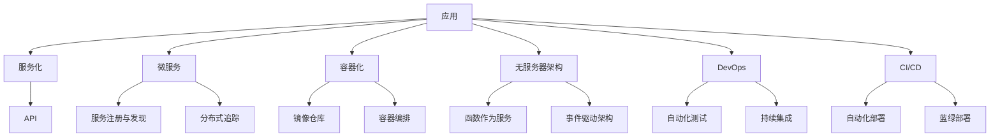

                 

**软件 2.0 的价值：提升效率、创造价值**

**作者：禅与计算机程序设计艺术 / Zen and the Art of Computer Programming**

## 1. 背景介绍

在信息技术飞速发展的今天，软件已经渗透到我们生活的方方面面，从智能手机到自动驾驶汽车，从金融系统到医疗设备，软件无处不在。然而，传统的软件开发模式已经无法满足当今快速变化的市场需求和业务需求。因此，软件 2.0 应运而生，旨在通过提高软件的可扩展性、可维护性和可适应性，从而提升软件的效率和创造价值的能力。

## 2. 核心概念与联系

软件 2.0 的核心概念包括服务化、微服务、容器化、无服务器架构、 DevOps 和持续集成/持续部署（CI/CD）。这些概念的目标是构建更灵活、更可靠、更高效的软件系统。下图是这些核心概念的 Mermaid 流程图：



## 3. 核心算法原理 & 具体操作步骤

### 3.1 算法原理概述

软件 2.0 的核心算法原理是基于事件驱动的反应式编程。这种编程范式允许系统在事件发生时做出反应，从而实现高度弹性和可扩展的系统。

### 3.2 算法步骤详解

1. 定义事件：识别系统中可能发生的事件。
2. 监听事件：使用事件总线或消息代理监听事件。
3. 处理事件：当事件发生时，触发相应的处理逻辑。
4. 发布事件：在处理事件后，发布新的事件以触发其他处理逻辑。

### 3.3 算法优缺点

优点：高度弹性、可扩展、易于维护和测试。

缺点：可能会导致系统复杂性增加，需要额外的设计和监控。

### 3.4 算法应用领域

事件驱动的反应式编程适用于需要实时处理大量数据的领域，如金融、物联网、实时分析和机器学习。

## 4. 数学模型和公式 & 详细讲解 & 举例说明

### 4.1 数学模型构建

软件 2.0 的数学模型可以使用队列理论、并发控制和分布式系统模型来构建。例如，可以使用 Little's Law 来分析系统的吞吐量和延迟：

$$W = \frac{L}{\lambda}$$

其中，$W$ 是平均等待时间，$L$ 是系统中的平均负载，$\lambda$ 是到达率。

### 4.2 公式推导过程

Little's Law 可以通过考虑系统中的流入和流出来推导：

$$L = \lambda W$$

$$L = \lambda \frac{L}{\lambda}$$

$$L = L$$

### 4.3 案例分析与讲解

假设我们有一个处理用户请求的系统，每分钟有 1000 个请求到达系统（$\lambda = 1000$ 个/分钟），平均等待时间为 0.5 分钟（$W = 0.5$ 分钟）。根据 Little's Law，系统中的平均负载为：

$$L = \lambda W = 1000 \times 0.5 = 500$$

这意味着系统中平均有 500 个请求在等待处理。

## 5. 项目实践：代码实例和详细解释说明

### 5.1 开发环境搭建

我们将使用 Node.js 和 Express.js 来构建一个简单的事件驱动系统。首先，安装 Node.js 和 npm（如果尚未安装），然后创建一个新的项目目录并初始化项目：

```bash
mkdir event-driven-system
cd event-driven-system
npm init -y
```

### 5.2 源代码详细实现

创建一个名为 `index.js` 的文件，并添加以下代码：

```javascript
const express = require('express');
const app = express();
const eventEmitter = require('events').EventEmitter;
const emitter = new eventEmitter();

app.use(express.json());

app.post('/event', (req, res) => {
  const event = req.body.event;
  emitter.emit(event, req.body.data);
  res.sendStatus(200);
});

emitter.on('event1', (data) => {
  console.log(`Received event1 with data: ${JSON.stringify(data)}`);
});

emitter.on('event2', (data) => {
  console.log(`Received event2 with data: ${JSON.stringify(data)}`);
});

app.listen(3000, () => {
  console.log('Server listening on port 3000');
});
```

### 5.3 代码解读与分析

我们使用 Express.js 创建了一个简单的 HTTP 服务器，该服务器监听 POST 请求并触发相应的事件。事件处理程序使用事件总线（`eventEmitter`）来监听和处理事件。

### 5.4 运行结果展示

运行应用程序：

```bash
node index.js
```

发送 POST 请求：

```bash
curl -X POST -H "Content-Type: application/json" -d '{"event": "event1", "data": {"message": "Hello, event1!"}}' http://localhost:3000/event
```

您应该会看到以下输出：

```
Server listening on port 3000
Received event1 with data: {"message":"Hello, event1!"}
```

## 6. 实际应用场景

### 6.1 当前应用

软件 2.0 的概念已经在各种领域得到广泛应用，如金融（事件驱动的实时分析）、物联网（设备监控和控制）、电子商务（实时推荐系统）和社交媒体（实时消息传递）。

### 6.2 未来应用展望

未来，软件 2.0 的概念将继续发展，以适应新的挑战和机遇。例如，边缘计算和 5G 技术的发展将需要更灵活和可扩展的软件系统。此外，人工智能和机器学习的发展将需要更智能和自适应的软件系统。

## 7. 工具和资源推荐

### 7.1 学习资源推荐

* "软件 2.0：下一代软件架构" - 由 Sam Newman 所著
* "事件驱动架构" - 由 Adam Bellemare 所著
* "反应式编程" - 由 Jonas Bonér 所著

### 7.2 开发工具推荐

* Node.js 和 Express.js
* Apache Kafka
* RabbitMQ
* AWS Lambda
* Google Cloud Functions

### 7.3 相关论文推荐

* "事件驱动架构：构建高度弹性和可扩展的系统" - 由 Adam Bellemare 所著
* "反应式编程：构建弹性和可扩展的系统" - 由 Jonas Bonér 所著

## 8. 总结：未来发展趋势与挑战

### 8.1 研究成果总结

软件 2.0 的概念已经取得了显著的进展，并已在各种领域得到广泛应用。然而，仍然存在许多挑战需要解决。

### 8.2 未来发展趋势

未来，软件 2.0 的发展将继续关注系统的弹性、可扩展性和自适应性。此外，软件 2.0 的概念将与人工智能和机器学习结合，以构建更智能和自适应的系统。

### 8.3 面临的挑战

软件 2.0 的一个主要挑战是系统的复杂性。随着系统变得越来越分布式和弹性，维护和调试变得越来越困难。此外，安全和隐私是软件 2.0 的另一个关键挑战，因为系统变得越来越分布式和开放。

### 8.4 研究展望

未来的研究将关注如何构建更智能和自适应的软件系统，如何处理系统的复杂性，以及如何保护系统的安全和隐私。

## 9. 附录：常见问题与解答

**Q：软件 2.0 与传统软件有何不同？**

A：软件 2.0 侧重于构建更灵活、更可靠、更高效的软件系统，以适应快速变化的市场需求和业务需求。相比之下，传统软件往往是单体应用，难以扩展和维护。

**Q：软件 2.0 的核心概念是什么？**

A：软件 2.0 的核心概念包括服务化、微服务、容器化、无服务器架构、 DevOps 和持续集成/持续部署（CI/CD）。

**Q：事件驱动的反应式编程是什么？**

A：事件驱动的反应式编程是一种编程范式，允许系统在事件发生时做出反应，从而实现高度弹性和可扩展的系统。

**Q：软件 2.0 的数学模型是什么？**

A：软件 2.0 的数学模型可以使用队列理论、并发控制和分布式系统模型来构建。例如，可以使用 Little's Law 来分析系统的吞吐量和延迟。

**Q：软件 2.0 的未来发展趋势是什么？**

A：未来，软件 2.0 的发展将继续关注系统的弹性、可扩展性和自适应性。此外，软件 2.0 的概念将与人工智能和机器学习结合，以构建更智能和自适应的系统。

**Q：软件 2.0 的面临挑战是什么？**

A：软件 2.0 的一个主要挑战是系统的复杂性。此外，安全和隐私是软件 2.0 的另一个关键挑战，因为系统变得越来越分布式和开放。

**Q：未来的研究将关注哪些领域？**

A：未来的研究将关注如何构建更智能和自适应的软件系统，如何处理系统的复杂性，以及如何保护系统的安全和隐私。

**作者：禅与计算机程序设计艺术 / Zen and the Art of Computer Programming**

