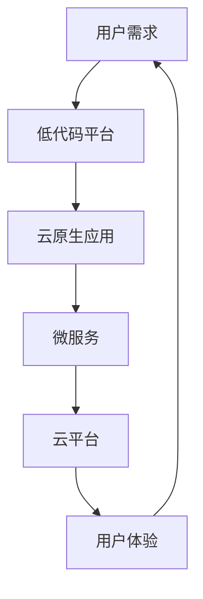

                 

**软件 2.0 的未来愿景：创造更美好的世界**

> 关键词：软件 2.0, 可持续发展, 智能系统, 云原生, 微服务, 低代码

## 1. 背景介绍

在信息技术飞速发展的今天，软件已经渗透到我们生活的方方面面，从智能手机到自动驾驶汽车，从智能家居到工业控制系统。然而，传统软件开发模式面临着诸多挑战，包括开发效率低下、可维护性差、难以适应快速变化的市场需求。因此，我们需要一种新的软件开发范式，一种能够更好地适应当今世界快速变化的需求，创造更美好世界的软件开发范式——软件 2.0。

## 2. 核心概念与联系

软件 2.0 的核心概念包括云原生、微服务、低代码等。这些概念并不是孤立存在的，而是相互关联，共同构成了软件 2.0 的架构。下面是软件 2.0 架构的 Mermaid 流程图：

## 3. 核心算法原理 & 具体操作步骤

### 3.1 算法原理概述

软件 2.0 的核心算法是基于云原生和微服务的架构原理。云原生是一种设计应用程序、服务或网络以运行在云环境中的方法。微服务是一种架构风格，它将单一应用程序分解为一组小型服务，每个服务运行在其自己的进程中，并与轻量级机制进行通信，通常是 HTTP REST。

### 3.2 算法步骤详解

1. **云原生应用开发**：使用云原生框架（如 Spring Cloud、Kubernetes）开发应用程序，确保应用程序可以在云环境中无缝运行。
2. **微服务拆分**：将应用程序拆分为一组小型、松耦合的服务，每个服务负责特定的业务逻辑。
3. **服务部署**：使用容器化技术（如 Docker）打包服务，并使用容器编排工具（如 Kubernetes）部署到云平台。
4. **服务通信**：使用轻量级机制（如 HTTP REST）进行服务间通信。
5. **自动化运维**：使用 DevOps 工具（如 Jenkins、GitOps）实现持续集成、持续部署，自动化运维流程。

### 3.3 算法优缺点

**优点**：提高了开发效率，增强了系统的可伸缩性、可靠性和可维护性；支持快速迭代和持续交付。

**缺点**：增加了系统的复杂性，需要更多的运维工作；学习成本高，需要掌握更多的技术。

### 3.4 算法应用领域

软件 2.0 的核心算法适用于各种需要快速迭代、高可伸缩性和高可靠性的场景，如电子商务平台、物联网系统、金融系统等。

## 4. 数学模型和公式 & 详细讲解 & 举例说明

### 4.1 数学模型构建

软件 2.0 的数学模型可以使用队列模型、并发模型等来描述系统的性能特性。例如，可以使用 Little's Law 来描述系统的吞吐量和响应时间：

$$ Throughput = \frac{1}{Response Time} $$

### 4.2 公式推导过程

Little's Law 可以通过以下公式推导：

$$ Throughput = \frac{Arrival Rate}{1 + \frac{Service Time}{Response Time}} $$

其中，Arrival Rate 是请求到达率，Service Time 是服务时间。

### 4.3 案例分析与讲解

假设我们有一个电子商务平台，每分钟有 1000 个用户请求（Arrival Rate = 1000/min），平均服务时间为 0.5 秒（Service Time = 0.5 s），我们想要控制响应时间在 1 秒以内（Response Time ≤ 1 s），那么系统的吞吐量（Throughput）应该不低于 500/min：

$$ Throughput = \frac{1000}{1 + \frac{0.5}{1}} = 500/min $$

## 5. 项目实践：代码实例和详细解释说明

### 5.1 开发环境搭建

我们将使用 Spring Boot、Spring Cloud、Docker 和 Kubernetes 来搭建一个简单的云原生微服务应用。首先，安装 JDK、Maven、Docker 和 Minikube。

### 5.2 源代码详细实现

**服务注册中心（Eureka）**：使用 Spring Boot 和 Spring Cloud Eureka 构建服务注册中心。

**用户服务（User Service）**：使用 Spring Boot 和 Spring Cloud Feign 实现用户服务，并注册到 Eureka。

**订单服务（Order Service）**：使用 Spring Boot 和 Spring Cloud Feign 实现订单服务，并注册到 Eureka。订单服务依赖于用户服务。

### 5.3 代码解读与分析

**服务注册中心（Eureka）**：在 application.properties 中配置 Eureka 的 IP 地址和端口号。在 Application 类中使用 @EnableEurekaServer 注解开启 Eureka 服务注册中心。

**用户服务（User Service）**：在 application.properties 中配置 Eureka 的 IP 地址和端口号。在 UserController 类中使用 @FeignClient 注解指定服务名称，实现服务调用。

**订单服务（Order Service）**：同用户服务。

### 5.4 运行结果展示

使用 Docker 打包服务镜像，并使用 Minikube 部署到 Kubernetes 集群。可以使用 Kubernetes Dashboard 查看服务运行情况。

## 6. 实际应用场景

### 6.1 当前应用

软件 2.0 的核心算法已经广泛应用于各种云原生微服务架构中，如 Netflix、Amazon、Alibaba 等。

### 6.2 未来应用展望

随着云原生和微服务技术的不断发展，软件 2.0 的核心算法将会应用于更多的场景，如边缘计算、人工智能等。

## 7. 工具和资源推荐

### 7.1 学习资源推荐

- 书籍：《云原生应用架构》作者：Brendan Burns、John Carnell
- 在线课程：[Pluralsight - Cloud Native Fundamentals](https://www.pluralsight.com/courses/cloud-native-fundamentals)

### 7.2 开发工具推荐

- 云平台：AWS、Google Cloud、Azure
- 容器编排工具：Kubernetes、Docker Swarm
- 服务网格：Istio、Linkerd

### 7.3 相关论文推荐

- [Microservices: From Design to Deployment](https://martinfowler.com/articles/microservices.html)
- [Cloud-Native Computing Foundation (CNCF) Landscape](https://landscape.cncf.io/)

## 8. 总结：未来发展趋势与挑战

### 8.1 研究成果总结

软件 2.0 的核心算法已经取得了显著的成果，提高了开发效率，增强了系统的可伸缩性、可靠性和可维护性。

### 8.2 未来发展趋势

软件 2.0 的核心算法将会朝着更加智能化、自动化的方向发展，如自动化运维、自动化部署等。

### 8.3 面临的挑战

软件 2.0 的核心算法面临的挑战包括学习成本高、运维复杂度高等。

### 8.4 研究展望

未来的研究方向包括云原生安全、云原生性能优化等。

## 9. 附录：常见问题与解答

**Q：软件 2.0 与传统软件开发有何不同？**

A：软件 2.0 更加注重云原生、微服务等新技术，更加适应当今世界快速变化的需求。

**Q：软件 2.0 的核心算法有哪些？**

A：软件 2.0 的核心算法包括云原生、微服务等。

**Q：软件 2.0 的核心算法适用于哪些场景？**

A：软件 2.0 的核心算法适用于各种需要快速迭代、高可伸缩性和高可靠性的场景。

**Q：软件 2.0 的核心算法面临哪些挑战？**

A：软件 2.0 的核心算法面临的挑战包括学习成本高、运维复杂度高等。

**Q：软件 2.0 的未来发展趋势是什么？**

A：软件 2.0 的核心算法将会朝着更加智能化、自动化的方向发展。

**作者：禅与计算机程序设计艺术 / Zen and the Art of Computer Programming**

