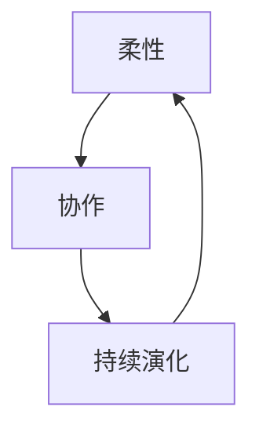

                 

**软件2.0的项目管理最佳实践**

**作者：禅与计算机程序设计艺术 / Zen and the Art of Computer Programming**

## 1. 背景介绍

随着软件行业的发展，传统的软件开发模式已经无法满足当今快速变化的市场需求。软件2.0（Software 2.0）是一种新的软件开发理念，它强调柔性、协作和持续的演化。本文将介绍软件2.0的项目管理最佳实践，帮助读者理解和应用这一新理念。

## 2. 核心概念与联系

软件2.0的核心概念包括：

- **柔性（Agility）**：适应变化，灵活应对市场需求的变化。
- **协作（Collaboration）**：跨职能团队的协作，共同创造价值。
- **持续演化（Continuous Evolution）**：持续的学习、适应和改进。

这些概念是相互联系的，如下图所示：



## 3. 核心算法原理 & 具体操作步骤

### 3.1 算法原理概述

软件2.0的项目管理算法原理基于迭代和增量开发，旨在最小化开发时间，最大化客户价值。

### 3.2 算法步骤详解

1. **需求收集与优先级排序**：收集客户需求，并根据业务价值和技术复杂度排序。
2. **迭代开发**：每个迭代周期（通常为2-4周）开发最高优先级的需求。
3. **持续集成与交付**：每个迭代结束时，集成代码并交付可用的软件。
4. **客户反馈与需求调整**：基于客户反馈调整需求优先级，并计划下一个迭代。
5. **持续改进**：不断改进开发过程，提高效率和质量。

### 3.3 算法优缺点

**优点**：快速交付价值，灵活适应变化，提高客户满意度。

**缺点**：可能导致长期计划的缺失，对团队自律和协作能力要求高。

### 3.4 算法应用领域

软件2.0适用于需要快速响应市场变化的项目，如互联网、移动应用和云服务等领域。

## 4. 数学模型和公式 & 详细讲解 & 举例说明

### 4.1 数学模型构建

软件2.0的数学模型可以基于复杂适应系统（Complex Adaptive Systems）构建。该模型假设系统中的各个组成部分（如开发团队、客户、市场）相互作用，共同创造复杂的行为模式。

### 4.2 公式推导过程

假设系统中的各个组成部分遵循一定的规则集合 $R$，则系统的行为可以表示为：

$$B = f(R, I)$$

其中，$I$ 表示系统的初始状态， $f$ 表示系统的演化函数。

### 4.3 案例分析与讲解

例如，在一个软件2.0项目中，客户、开发团队和市场都是系统的组成部分。它们根据各自的规则（如客户的需求变化、团队的开发进度、市场的竞争情况）相互作用，共同创造软件的演化过程。

## 5. 项目实践：代码实例和详细解释说明

### 5.1 开发环境搭建

使用Scrum工具（如Jira）搭建项目管理环境，使用Git进行版本控制，使用Jenkins进行持续集成。

### 5.2 源代码详细实现

以下是一个简单的Scrum任务板代码实现（使用Python和Flask框架）：

```python
from flask import Flask, render_template, request, redirect, url_for

app = Flask(__name__)

tasks = []

@app.route('/')
def index():
    return render_template('index.html', tasks=tasks)

@app.route('/add', methods=['POST'])
def add():
    task = request.form['task']
    tasks.append({'task': task,'status': 'To Do'})
    return redirect(url_for('index'))

@app.route('/update/<int:task_id>')
def update(task_id):
    tasks[task_id]['status'] = 'Done'
    return redirect(url_for('index'))

if __name__ == '__main__':
    app.run(debug=True)
```

### 5.3 代码解读与分析

该代码实现了一个简单的Scrum任务板，允许用户添加任务并标记任务状态。

### 5.4 运行结果展示

运行该代码后，用户可以在浏览器中访问任务板，添加任务并标记任务状态。

## 6. 实际应用场景

### 6.1 当前应用

软件2.0已经广泛应用于互联网、移动应用和云服务等领域，如Spotify、Google和Amazon等公司都采用了软件2.0的开发模式。

### 6.2 未来应用展望

随着数字化转型的加速，软件2.0将会应用于更多领域，如物联网、自动驾驶和人工智能等。

## 7. 工具和资源推荐

### 7.1 学习资源推荐

- 书籍：《Scrum：指南》（Scrum: The Art of Doing Twice the Work in Half the Time）作者：Jeff Sutherland
- 在线课程：[Pluralsight - Scrum Fundamentals](https://www.pluralsight.com/courses/scrum-fundamentals)

### 7.2 开发工具推荐

- Jira：项目管理工具
- Git：版本控制系统
- Jenkins：持续集成工具

### 7.3 相关论文推荐

- [Agile Software Development with Scrum](https://scrumguides.org/docs/scrumguide/v2020/2020-Scrum-Guide-US.pdf) by Ken Schwaber and Jeff Sutherland

## 8. 总结：未来发展趋势与挑战

### 8.1 研究成果总结

软件2.0的项目管理最佳实践有助于提高软件开发的柔性、协作和持续演化能力。

### 8.2 未来发展趋势

软件2.0将会与其他新兴技术（如人工智能和区块链）结合，创造新的开发模式和业务模式。

### 8.3 面临的挑战

软件2.0需要高度自律和协作的团队，如何培养这样的团队是一个挑战。

### 8.4 研究展望

未来的研究将关注软件2.0与其他新兴技术的结合，以及如何培养高效的软件2.0团队。

## 9. 附录：常见问题与解答

**Q：软件2.0与传统软件开发有何不同？**

**A**：软件2.0强调柔性、协作和持续的演化，而传统软件开发则强调计划、控制和预测。

**Q：软件2.0适用于所有项目吗？**

**A**：软件2.0适用于需要快速响应市场变化的项目，但不适用于需要长期计划的项目。

**Q：如何培养高效的软件2.0团队？**

**A**：培养高效的软件2.0团队需要提供良好的培训、鼓励协作和自律，并创造一个支持学习和改进的环境。

**作者署名：作者：禅与计算机程序设计艺术 / Zen and the Art of Computer Programming**

