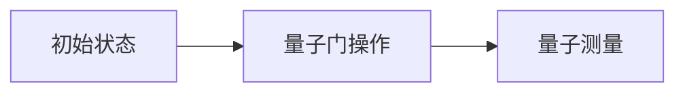

                 

**量子计算与AI:未来计算的协同发展**

**作者：禅与计算机程序设计艺术 / Zen and the Art of Computer Programming**

## 1. 背景介绍

量子计算和人工智能（AI）都是当今世界最前沿、最具前景的技术领域。量子计算利用量子物理现象，如超位-bit、量子纠缠和量子叠加，来处理信息，具有巨大的计算潜力。人工智能则旨在开发能够模拟人类智能的计算机系统，在各种领域都有着广泛的应用。本文将探讨量子计算和AI的核心概念，它们的联系，以及它们在未来计算中的协同发展。

## 2. 核心概念与联系

### 2.1 量子计算

量子计算的核心是量子比特（qubit），它是量子计算的基本单位。与经典比特不同，量子比特可以处于0、1或0和1的叠加状态。量子计算利用量子门（quantum gate）操作量子比特，实现量子逻辑运算。



### 2.2 人工智能

人工智能的核心是机器学习，它是一种使计算机系统能够从经验中学习的方法。机器学习算法从数据中学习模式，并使用这些模式来做出预测或决策。

### 2.3 量子计算与AI的联系

量子计算和AI的联系在于，量子计算可以用于优化机器学习算法，加速数据处理，并解决传统计算无法解决的问题。量子计算还可以用于开发新的AI算法，如量子神经网络。

## 3. 核心算法原理 & 具体操作步骤

### 3.1 量子优化算法原理

量子优化算法，如量子最小化算法（QAOA）和量子安排算法（QAA），利用量子计算的特性来寻找复杂问题的最优解。这些算法通常基于量子门操作和量子测量。

### 3.2 量子神经网络原理

量子神经网络（QNN）是一种将量子计算与神经网络结合的方法。QNN使用量子比特表示神经元状态，并使用量子门操作表示神经元之间的连接。

### 3.3 算法优缺点

量子优化算法和量子神经网络都具有巨大的计算潜力，但它们也面临挑战，如量子错误校验和量子比特的保真度。

### 3.4 算法应用领域

量子优化算法可以应用于物流规划、供应链管理等领域。量子神经网络则可以应用于图像识别、自然语言处理等领域。

## 4. 数学模型和公式 & 详细讲解 & 举例说明

### 4.1 量子门操作数学模型

量子门操作可以表示为单位矩阵乘积。例如，Hadamard门（H）可以表示为：

$$
H = \frac{1}{\sqrt{2}} \begin{bmatrix} 1 & 1 \\ 1 & -1 \end{bmatrix}
$$

### 4.2 量子测量公式推导

量子测量可以表示为矩阵乘积。例如，测量Z基矢量|0⟩和|1⟩的结果可以表示为：

$$
Z = \begin{bmatrix} 1 & 0 \\ 0 & -1 \end{bmatrix}
$$

### 4.3 案例分析与讲解

例如，考虑一个简单的量子门操作：将量子比特|0⟩映射到|1⟩。这可以表示为：

$$
X = \begin{bmatrix} 0 & 1 \\ 1 & 0 \end{bmatrix}
$$

应用X门操作到|0⟩，结果为|1⟩。

## 5. 项目实践：代码实例和详细解释说明

### 5.1 开发环境搭建

要实现量子计算和AI算法，需要一个支持量子计算的开发环境。推荐使用Qiskit，一个由IBM开发的开源量子计算框架。

### 5.2 源代码详细实现

以下是一个简单的Qiskit代码示例，实现量子门操作X：

```python
from qiskit import QuantumCircuit, execute, Aer

# 创建一个量子电路
qc = QuantumCircuit(1)

# 应用X门操作
qc.x(0)

# 执行量子电路
simulator = Aer.get_backend('statevector_simulator')
job = execute(qc, simulator)
result = job.result()

# 获取量子状态向量
statevector = result.get_statevector()
print(statevector)
```

### 5.3 代码解读与分析

这段代码创建一个量子电路，应用X门操作，然后使用量子状态向量模拟器执行量子电路，并打印量子状态向量。

### 5.4 运行结果展示

运行这段代码的结果应该是：

```
[0.+0.j 1.+0.j]
```

这表示量子比特处于|1⟩状态。

## 6. 实际应用场景

### 6.1 量子优化算法在物流规划中的应用

量子优化算法可以用于优化物流路线，降低成本，提高效率。

### 6.2 量子神经网络在图像识别中的应用

量子神经网络可以用于加速图像识别，提高准确性。

### 6.3 未来应用展望

未来，量子计算和AI的结合将会带来更多的创新应用，如量子通信、量子加密等。

## 7. 工具和资源推荐

### 7.1 学习资源推荐

推荐阅读Nielsen和Chuang的《量子计算及量子信息》和Goodfellow等人的《深度学习》。

### 7.2 开发工具推荐

推荐使用Qiskit、TensorFlow Quantum和PyTorch Quantum。

### 7.3 相关论文推荐

推荐阅读IBM的《量子优化算法》和Google的《量子神经网络：一项初步研究》。

## 8. 总结：未来发展趋势与挑战

### 8.1 研究成果总结

量子计算和AI的结合已经取得了显著的研究成果，如量子优化算法和量子神经网络。

### 8.2 未来发展趋势

未来，量子计算和AI的结合将会带来更多的创新应用，并推动计算技术的发展。

### 8.3 面临的挑战

量子计算和AI的结合面临的挑战包括量子错误校验、量子比特的保真度等。

### 8.4 研究展望

未来的研究将会集中在量子计算和AI的结合上，开发新的算法，提高计算效率，并推动计算技术的发展。

## 9. 附录：常见问题与解答

### 9.1 量子计算和经典计算有什么区别？

量子计算和经典计算的区别在于，量子计算利用量子物理现象，如超位-bit、量子纠缠和量子叠加，来处理信息，具有巨大的计算潜力。经典计算则使用二进制位（bit）来处理信息。

### 9.2 量子计算和AI的结合有什么优势？

量子计算和AI的结合具有巨大的计算潜力，可以用于优化机器学习算法，加速数据处理，并解决传统计算无法解决的问题。量子计算还可以用于开发新的AI算法，如量子神经网络。

**作者署名：作者：禅与计算机程序设计艺术 / Zen and the Art of Computer Programming**

