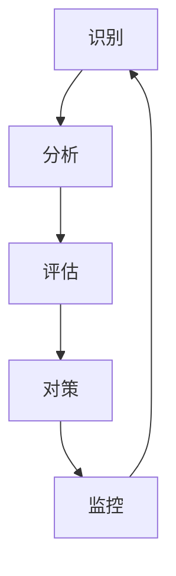

                 

**风险管理：预防和应对商业风险的技巧**

**作者：禅与计算机程序设计艺术 / Zen and the Art of Computer Programming**

## 1. 背景介绍

在当今快速变化的商业环境中，风险无处不在。从市场变化到技术故障，再到自然灾害，企业面临着各种各样的风险。有效管理这些风险是确保企业持续成功的关键。本文将深入探讨风险管理的核心概念、算法、数学模型，并提供实践项目和工具推荐，帮助读者预防和应对商业风险。

## 2. 核心概念与联系

风险管理是一个跨职能的过程，涉及识别、分析、评估、对策和监控风险。以下是风险管理的核心概念及其关系：



## 3. 核心算法原理 & 具体操作步骤

### 3.1 算法原理概述

风险管理算法的核心是帮助企业识别、评估和对策风险。这里我们介绍一种基于 Monte Carlo 模拟的风险评估算法。

### 3.2 算法步骤详解

1. **识别风险**：列出所有可能影响企业的风险。
2. **定义风险属性**：为每个风险定义其可能性和影响力。
3. **建立概率分布**：使用可能性和影响力数据建立每个风险的概率分布。
4. **Monte Carlo 模拟**：使用随机数生成器模拟每个风险的结果。
5. **评估风险**：计算每个风险的期望值和标准差，以量化其影响。
6. **对策**：根据风险评估结果，制定对策减轻风险的影响。

### 3.3 算法优缺点

**优点**：能够量化风险，帮助企业做出数据驱动的决策。

**缺点**：模拟结果可能会受到概率分布的质量和随机数生成器的影响。

### 3.4 算法应用领域

该算法适用于任何需要量化风险的领域，如金融、项目管理、供应链管理等。

## 4. 数学模型和公式 & 详细讲解 & 举例说明

### 4.1 数学模型构建

风险评估的数学模型可以表示为：

$$R = \sum_{i=1}^{n} P_i \times L_i$$

其中，$R$ 是总风险，$P_i$ 是每个风险$i$的可能性，$L_i$ 是每个风险$i$的影响力，$n$ 是风险的总数。

### 4.2 公式推导过程

总风险$R$是每个风险的可能性和影响力的加权和。可能性$P_i$和影响力$L_i$可以通过调查或专家意见获得。

### 4.3 案例分析与讲解

假设一家企业面临三个风险：市场变化（可能性0.4，影响力100万）、技术故障（可能性0.3，影响力50万）、自然灾害（可能性0.1，影响力200万）。使用上述公式，总风险为：

$$R = 0.4 \times 100 + 0.3 \times 50 + 0.1 \times 200 = 65（单位：万）$$

## 5. 项目实践：代码实例和详细解释说明

### 5.1 开发环境搭建

本项目使用 Python 和 Pandas 库。请确保您的环境中已安装这些库。

### 5.2 源代码详细实现

```python
import pandas as pd
import numpy as np

# 定义风险数据
risks = {
    'Market Change': [0.4, 100],
    'Technical Failure': [0.3, 50],
    'Natural Disaster': [0.1, 200]
}

# 创建 DataFrame
df = pd.DataFrame(list(risks.items()), columns=['Risk', 'Probability', 'Loss'])

# 计算总风险
total_risk = np.sum(df['Probability'] * df['Loss'])
print(f'Total Risk: {total_risk} million')
```

### 5.3 代码解读与分析

代码首先定义风险数据，然后创建一个 Pandas DataFrame。它使用 NumPy 计算总风险，并打印结果。

### 5.4 运行结果展示

运行代码将打印出总风险值，例如：

```
Total Risk: 65.0 million
```

## 6. 实际应用场景

风险管理在各个行业都有广泛的应用，从金融到制造业，再到政府部门。有效的风险管理可以帮助企业避免重大损失，确保业务连续性，并提高企业的信誉度。

### 6.1 当前应用

风险管理目前广泛应用于企业的各个部门，如风险管理部门、财务部门、运营部门等。

### 6.2 未来应用展望

未来，风险管理将更多地依赖于人工智能和大数据。企业将能够实时监控风险，并使用机器学习算法预测风险的发展趋势。

## 7. 工具和资源推荐

### 7.1 学习资源推荐

- "Risk Management: A Value Added Approach" by David Hillson
- "Managing Risk in Projects" by Peter Simon

### 7.2 开发工具推荐

- Python：用于风险评估算法的开发。
- R：用于统计分析和数据可视化。
- Power BI：用于风险数据的可视化。

### 7.3 相关论文推荐

- "A Framework for Risk Management in Software Projects" by M. K. K. Hung et al.
- "Risk Management in Project Management: A Systematic Literature Review" by M. A. Al-Najjar et al.

## 8. 总结：未来发展趋势与挑战

### 8.1 研究成果总结

本文介绍了风险管理的核心概念、算法、数学模型，并提供了实践项目和工具推荐。

### 8.2 未来发展趋势

未来，风险管理将更多地依赖于人工智能和大数据。企业将能够实时监控风险，并使用机器学习算法预测风险的发展趋势。

### 8.3 面临的挑战

挑战包括数据质量、模型准确性和企业文化等。

### 8.4 研究展望

未来的研究将关注风险管理的实时监控、风险的动态特性，以及风险管理在企业文化中的作用。

## 9. 附录：常见问题与解答

**Q：风险管理的目的是什么？**

**A：**风险管理的目的是识别、评估和对策风险，以帮助企业避免重大损失，确保业务连续性，并提高企业的信誉度。

**Q：什么是 Monte Carlo 模拟？**

**A：**Monte Carlo 模拟是一种数值方法，它使用随机数生成器模拟系统的结果。在风险管理中，它用于模拟风险的结果。

**Q：如何评估风险？**

**A：**风险评估涉及定义风险的可能性和影响力，并使用数学模型计算总风险。

**Q：什么是总风险？**

**A：**总风险是所有风险的可能性和影响力的加权和。它量化了企业面临的总风险水平。

**Q：如何对策风险？**

**A：**对策风险涉及制定计划以减轻风险的影响。这可以通过风险转移（如保险）、风险规避（如避免高风险活动）或风险减轻（如采取预防措施）来实现。

**Q：风险管理在哪些行业有应用？**

**A：**风险管理在各个行业都有广泛的应用，从金融到制造业，再到政府部门。

