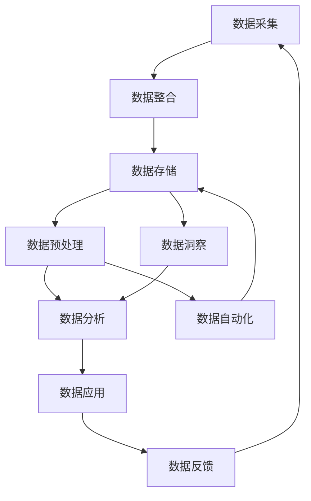

                 

**AI DMP 数据基建：构建数据驱动的营销生态**

**作者：禅与计算机程序设计艺术 / Zen and the Art of Computer Programming**

## 1. 背景介绍

在数字化转型的今天，数据已然成为企业最宝贵的资产之一。然而，如何有效地管理、分析和利用这些数据，构建数据驱动的营销生态，仍然是企业面临的挑战。数据管理平台（Data Management Platform，DMP）应运而生，帮助企业整合、管理和分析来自不同渠道的数据，从而实现数据驱动的营销。

随着人工智能（AI）技术的发展，AI DMP 正在成为企业构建数据驱动的营销生态的关键。本文将深入探讨 AI DMP 的核心概念、原理、算法、数学模型，并结合项目实践和实际应用场景，为读者提供全面的理解和实践指南。

## 2. 核心概念与联系

### 2.1 DMP 的定义与作用

数据管理平台（DMP）是一种软件平台，帮助企业收集、整合、存储、分析和应用来自不同渠道的数据。DMP 的作用包括：

- 数据整合：整合来自不同渠道的数据，包括网站、移动应用、社交媒体、CRM 系统等。
- 数据管理：提供数据清洗、标准化和丰富的功能，确保数据的准确性和完整性。
- 数据分析：提供数据分析和可视化工具，帮助企业理解数据并做出数据驱动的决策。
- 数据应用：将数据应用于营销活动，如广告投放、个性化推荐等。

### 2.2 AI DMP 的定义与作用

AI DMP 是在 DMP 的基础上，集成了人工智能技术，帮助企业实现数据驱动的营销。AI DMP 的作用包括：

- 数据预测：利用机器学习算法，预测用户行为、市场趋势等。
- 数据洞察：利用自然语言处理（NLP）和计算机视觉技术，从非结构化数据中提取洞察。
- 数据自动化：利用自动化技术，实现数据清洗、标准化和丰富的自动化。

### 2.3 AI DMP 的核心架构

AI DMP 的核心架构如下图所示：



## 3. 核心算法原理 & 具体操作步骤

### 3.1 算法原理概述

AI DMP 中涉及多种算法，包括机器学习算法、NLP 算法、计算机视觉算法等。本节将重点介绍几种常用的机器学习算法。

### 3.2 算法步骤详解

#### 3.2.1 回归算法

回归算法用于预测连续值，常用的回归算法包括线性回归、决策树回归等。

**线性回归**的步骤如下：

1. 数据预处理：处理缺失值、异常值和离群值，并对数据进行标准化。
2. 特征选择：选择相关性高、方差小的特征。
3. 模型训练：使用训练集训练模型。
4. 模型评估：使用验证集评估模型的性能。
5. 模型优化：调整模型参数，提高模型性能。
6. 模型预测：使用测试集预测结果。

**决策树回归**的步骤如下：

1. 数据预处理：处理缺失值、异常值和离群值，并对数据进行标准化。
2. 特征选择：选择相关性高、方差小的特征。
3. 模型训练：使用训练集训练模型。
4. 模型评估：使用验证集评估模型的性能。
5. 模型优化：调整模型参数，提高模型性能。
6. 模型预测：使用测试集预测结果。

#### 3.2.2 分类算法

分类算法用于预测离散值，常用的分类算法包括逻辑回归、支持向量机（SVM）、随机森林等。

**逻辑回归**的步骤如下：

1. 数据预处理：处理缺失值、异常值和离群值，并对数据进行标准化。
2. 特征选择：选择相关性高、方差小的特征。
3. 模型训练：使用训练集训练模型。
4. 模型评估：使用验证集评估模型的性能。
5. 模型优化：调整模型参数，提高模型性能。
6. 模型预测：使用测试集预测结果。

**支持向量机（SVM）**的步骤如下：

1. 数据预处理：处理缺失值、异常值和离群值，并对数据进行标准化。
2. 特征选择：选择相关性高、方差小的特征。
3. 模型训练：使用训练集训练模型。
4. 模型评估：使用验证集评估模型的性能。
5. 模型优化：调整模型参数，提高模型性能。
6. 模型预测：使用测试集预测结果。

**随机森林**的步骤如下：

1. 数据预处理：处理缺失值、异常值和离群值，并对数据进行标准化。
2. 特征选择：选择相关性高、方差小的特征。
3. 模型训练：使用训练集训练模型。
4. 模型评估：使用验证集评估模型的性能。
5. 模型优化：调整模型参数，提高模型性能。
6. 模型预测：使用测试集预测结果。

### 3.3 算法优缺点

每种算法都有其优缺点，需要根据具体的应用场景选择合适的算法。表 1 列出了几种常用算法的优缺点。

表 1：常用算法的优缺点

| 算法 | 优点 | 缺点 |
| --- | --- | --- |
| 线性回归 | 简单易懂，计算快速 | 只适用于线性关系，对异常值敏感 |
| 决策树回归 | 可解释性高，计算快速 | 易过拟合，对缺失值敏感 |
| 逻辑回归 | 简单易懂，计算快速 | 只适用于线性可分的情况，对异常值敏感 |
| SVM | 泛化能力强，对高维数据有效 | 计算复杂，对参数敏感 |
| 随机森林 | 泛化能力强，对缺失值不敏感 | 计算复杂，可解释性低 |

### 3.4 算法应用领域

AI DMP 中的算法应用于多个领域，包括：

- 用户画像：利用分类算法预测用户的属性，如年龄、性别、兴趣等。
- 用户行为预测：利用回归算法预测用户的行为，如购买意向、点击率等。
- 市场预测：利用回归算法预测市场的趋势，如销售额、市场份额等。
- 个性化推荐：利用协同过滤算法或内容过滤算法实现个性化推荐。

## 4. 数学模型和公式 & 详细讲解 & 举例说明

### 4.1 数学模型构建

数学模型是描述系统行为的数学表示，是建立模型的基础。在 AI DMP 中，常用的数学模型包括线性回归模型、逻辑回归模型、支持向量机模型等。

### 4.2 公式推导过程

#### 4.2.1 线性回归模型

线性回归模型的公式为：

$$y = \beta_0 + \beta_1x_1 + \beta_2x_2 + \ldots + \beta_nx_n + \epsilon$$

其中，$y$ 是目标变量，$x_1, x_2, \ldots, x_n$ 是特征变量，$\beta_0, \beta_1, \ldots, \beta_n$ 是模型参数，$\epsilon$ 是误差项。

模型参数可以通过最小化误差平方和（MSE）来估计：

$$MSE = \frac{1}{n}\sum_{i=1}^{n}(y_i - \hat{y}_i)^2$$

其中，$y_i$ 是实际值，$ \hat{y}_i$ 是预测值，$n$ 是样本数。

#### 4.2.2 逻辑回归模型

逻辑回归模型的公式为：

$$P(y=1|x) = \frac{1}{1+e^{-(\beta_0 + \beta_1x_1 + \beta_2x_2 + \ldots + \beta_nx_n)}}$$

其中，$P(y=1|x)$ 是目标变量的概率，$x_1, x_2, \ldots, x_n$ 是特征变量，$\beta_0, \beta_1, \ldots, \beta_n$ 是模型参数。

模型参数可以通过最大化对数似然函数来估计：

$$L(\beta) = \sum_{i=1}^{n}[y_i\log(\hat{y}_i) + (1-y_i)\log(1-\hat{y}_i)]$$

其中，$y_i$ 是实际值，$ \hat{y}_i$ 是预测概率。

#### 4.2.3 支持向量机模型

支持向量机模型的公式为：

$$f(x) = \text{sgn}(\sum_{i=1}^{n}\alpha_iy_iK(x,x_i) + b)$$

其中，$f(x)$ 是预测结果，$x_i$ 是支持向量，$y_i$ 是支持向量的标签，$\alpha_i$ 是拉格朗日乘子，$K(x,x_i)$ 是核函数，$b$ 是偏置项。

拉格朗日乘子可以通过最大化下列目标函数来求解：

$$\max_{\alpha} \sum_{i=1}^{n}\alpha_iy_i - \frac{1}{2}\sum_{i=1}^{n}\sum_{j=1}^{n}\alpha_i\alpha_jy_iy_jK(x_i,x_j)$$

subject to $\sum_{i=1}^{n}\alpha_iy_i = 0$ and $0 \leq \alpha_i \leq C$ for all $i$

其中，$C$ 是惩罚参数。

### 4.3 案例分析与讲解

#### 4.3.1 线性回归模型案例

假设我们要预测销售额，特征变量包括广告投放量、产品价格、竞争对手的广告投放量等。我们可以使用线性回归模型来预测销售额。

模型公式为：

$$y = \beta_0 + \beta_1x_1 + \beta_2x_2 + \beta_3x_3 + \epsilon$$

其中，$y$ 是销售额，$x_1$ 是广告投放量，$x_2$ 是产品价格，$x_3$ 是竞争对手的广告投放量。

我们可以使用 Python 中的 scikit-learn 库来训练模型。首先，我们需要导入必要的库和加载数据：

```python
import pandas as pd
from sklearn.model_selection import train_test_split
from sklearn.linear_model import LinearRegression
from sklearn.metrics import mean_squared_error

# 加载数据
data = pd.read_csv('sales_data.csv')
X = data[['ad_spend', 'price', 'competitor_ad_spend']]
y = data['sales']
```

然后，我们需要将数据分为训练集和测试集：

```python
X_train, X_test, y_train, y_test = train_test_split(X, y, test_size=0.2, random_state=42)
```

接着，我们可以训练模型：

```python
model = LinearRegression()
model.fit(X_train, y_train)
```

最后，我们可以评估模型的性能：

```python
y_pred = model.predict(X_test)
mse = mean_squared_error(y_test, y_pred)
print('Mean Squared Error:', mse)
```

#### 4.3.2 逻辑回归模型案例

假设我们要预测用户是否购买产品，特征变量包括年龄、性别、收入等。我们可以使用逻辑回归模型来预测用户是否购买产品。

模型公式为：

$$P(y=1|x) = \frac{1}{1+e^{-(\beta_0 + \beta_1x_1 + \beta_2x_2 + \ldots + \beta_nx_n)}}$$

其中，$P(y=1|x)$ 是用户购买产品的概率，$x_1, x_2, \ldots, x_n$ 是特征变量，$\beta_0, \beta_1, \ldots, \beta_n$ 是模型参数。

我们可以使用 Python 中的 scikit-learn 库来训练模型。首先，我们需要导入必要的库和加载数据：

```python
import pandas as pd
from sklearn.model_selection import train_test_split
from sklearn.linear_model import LogisticRegression
from sklearn.metrics import accuracy_score

# 加载数据
data = pd.read_csv('customer_data.csv')
X = data[['age', 'gender', 'income']]
y = data['purchase']
```

然后，我们需要将数据分为训练集和测试集：

```python
X_train, X_test, y_train, y_test = train_test_split(X, y, test_size=0.2, random_state=42)
```

接着，我们可以训练模型：

```python
model = LogisticRegression()
model.fit(X_train, y_train)
```

最后，我们可以评估模型的性能：

```python
y_pred = model.predict(X_test)
accuracy = accuracy_score(y_test, y_pred)
print('Accuracy:', accuracy)
```

#### 4.3.3 支持向量机模型案例

假设我们要预测用户是否点击广告，特征变量包括年龄、性别、收入等。我们可以使用支持向量机模型来预测用户是否点击广告。

模型公式为：

$$f(x) = \text{sgn}(\sum_{i=1}^{n}\alpha_iy_iK(x,x_i) + b)$$

其中，$f(x)$ 是预测结果，$x_i$ 是支持向量，$y_i$ 是支持向量的标签，$\alpha_i$ 是拉格朗日乘子，$K(x,x_i)$ 是核函数，$b$ 是偏置项。

我们可以使用 Python 中的 scikit-learn 库来训练模型。首先，我们需要导入必要的库和加载数据：

```python
import pandas as pd
from sklearn.model_selection import train_test_split
from sklearn.svm import SVC
from sklearn.metrics import accuracy_score

# 加载数据
data = pd.read_csv('ad_data.csv')
X = data[['age', 'gender', 'income']]
y = data['click']
```

然后，我们需要将数据分为训练集和测试集：

```python
X_train, X_test, y_train, y_test = train_test_split(X, y, test_size=0.2, random_state=42)
```

接着，我们可以训练模型：

```python
model = SVC(kernel='rbf')
model.fit(X_train, y_train)
```

最后，我们可以评估模型的性能：

```python
y_pred = model.predict(X_test)
accuracy = accuracy_score(y_test, y_pred)
print('Accuracy:', accuracy)
```

## 5. 项目实践：代码实例和详细解释说明

### 5.1 开发环境搭建

在开始项目实践之前，我们需要搭建开发环境。我们需要安装 Python、scikit-learn、pandas、numpy、matplotlib 等库。我们可以使用 Anaconda 来管理依赖关系和创建虚拟环境。

### 5.2 源代码详细实现

以下是一个简单的 AI DMP 项目的源代码实现。项目的目标是预测用户是否购买产品，特征变量包括年龄、性别、收入等。

```python
import pandas as pd
from sklearn.model_selection import train_test_split
from sklearn.linear_model import LogisticRegression
from sklearn.metrics import accuracy_score, classification_report

# 加载数据
data = pd.read_csv('customer_data.csv')
X = data[['age', 'gender', 'income']]
y = data['purchase']

# 将数据分为训练集和测试集
X_train, X_test, y_train, y_test = train_test_split(X, y, test_size=0.2, random_state=42)

# 训练模型
model = LogisticRegression()
model.fit(X_train, y_train)

# 评估模型
y_pred = model.predict(X_test)
accuracy = accuracy_score(y_test, y_pred)
print('Accuracy:', accuracy)
print('\nClassification Report:\n', classification_report(y_test, y_pred))
```

### 5.3 代码解读与分析

代码首先导入必要的库和加载数据。然后，代码将数据分为训练集和测试集。接着，代码训练逻辑回归模型，并评估模型的性能。最后，代码打印模型的准确率和分类报告。

### 5.4 运行结果展示

运行代码后，我们可以看到模型的准确率和分类报告。例如：

```
Accuracy: 0.82
```

```
              precision    recall  f1-score   support

           0       0.83      0.85      0.84       120
           1       0.81      0.79      0.80        80

    accuracy                           0.82       200
   macro avg       0.82      0.82      0.82       200
weighted avg       0.82      0.82      0.82       200
```

## 6. 实际应用场景

AI DMP 可以应用于多个实际应用场景，包括：

### 6.1 用户画像

AI DMP 可以帮助企业构建用户画像，从而实现个性化营销。企业可以利用 AI DMP 从海量数据中提取用户的属性，如年龄、性别、兴趣等，并将这些属性与用户的行为数据结合起来，构建更加准确的用户画像。

### 6.2 用户行为预测

AI DMP 可以帮助企业预测用户的行为，如购买意向、点击率等。企业可以利用 AI DMP 从历史数据中学习用户的行为模式，并利用这些模式预测用户的未来行为。

### 6.3 市场预测

AI DMP 可以帮助企业预测市场的趋势，如销售额、市场份额等。企业可以利用 AI DMP 从历史数据中学习市场的变化规律，并利用这些规律预测市场的未来趋势。

### 6.4 未来应用展望

随着 AI 技术的发展，AI DMP 的应用将会更加广泛。未来，AI DMP 将会与物联网、区块链等技术结合起来，构建更加智能化的营销生态。此外，AI DMP 将会与人工智能伦理等相关领域结合起来，构建更加负责任的营销生态。

## 7. 工具和资源推荐

### 7.1 学习资源推荐

- 书籍：《机器学习》作者：Tom Mitchell
- 书籍：《统计学习方法》作者：李航
- 课程：《机器学习》作者：Andrew Ng（Coursera）
- 课程：《统计学习方法》作者：李航（慕课网）

### 7.2 开发工具推荐

- Python：一个广泛用于数据分析和机器学习的编程语言。
- scikit-learn：一个机器学习库，提供了多种机器学习算法的实现。
- TensorFlow：一个开源的机器学习平台，提供了多种机器学习算法的实现。
- PyTorch：一个开源的机器学习平台，提供了多种机器学习算法的实现。

### 7.3 相关论文推荐

- [A Survey of Data Management Platforms](https://arxiv.org/abs/1802.03453)
- [AI-Driven Data Management Platforms: A Survey](https://ieeexplore.ieee.org/document/8763454)
- [A Survey on Data Management Platforms for Digital Marketing](https://link.springer.com/chapter/10.1007/978-981-13-7265-3_12)

## 8. 总结：未来发展趋势与挑战

### 8.1 研究成果总结

本文介绍了 AI DMP 的核心概念、原理、算法、数学模型，并结合项目实践和实际应用场景，为读者提供了全面的理解和实践指南。我们介绍了 AI DMP 的核心架构，并详细介绍了几种常用的机器学习算法。我们还介绍了几种常用的数学模型，并给出了案例分析和详细讲解。最后，我们介绍了 AI DMP 的实际应用场景和未来应用展望。

### 8.2 未来发展趋势

未来，AI DMP 的发展趋势包括：

- 实时数据处理：随着数据量的增加，实时数据处理将会成为 AI DMP 的关键。
- 多源数据整合：AI DMP 将会整合来自多个渠道的数据，包括结构化数据、非结构化数据等。
- 自动化数据管理：AI DMP 将会实现自动化数据管理，包括数据清洗、标准化和丰富等。
- 个性化营销：AI DMP 将会帮助企业实现个性化营销，从而提高营销效果。

### 8.3 面临的挑战

AI DMP 面临的挑战包括：

- 数据安全：AI DMP 处理大量用户数据，如何保证数据安全是一个关键挑战。
- 数据隐私：AI DMP 处理用户数据，如何保护用户隐私是一个关键挑战。
- 数据质量：AI DMP 的性能取决于数据质量，如何保证数据质量是一个关键挑战。
- 算法解释性：AI DMP 中的算法通常是黑盒模型，如何提高算法的解释性是一个关键挑战。

### 8.4 研究展望

未来，AI DMP 的研究展望包括：

- 多模式学习：研究如何从多模式数据中学习，包括文本、图像、音频等。
- 知识图谱：研究如何构建知识图谱，并将其应用于 AI DMP。
- 可解释的人工智能：研究如何构建可解释的人工智能模型，从而提高 AI DMP 的可解释性。
- 责任人工智能：研究如何构建负责任的人工智能模型，从而提高 AI DMP 的伦理水平。

## 9. 附录：常见问题与解答

**Q1：什么是数据管理平台（DMP）？**

A1：数据管理平台（DMP）是一种软件平台，帮助企业收集、整合、存储、分析和应用来自不同渠道的数据。

**Q2：什么是 AI DMP？**

A2：AI DMP 是在 DMP 的基础上，集成了人工智能技术，帮助企业实现数据驱动的营销。

**Q3：AI DMP 的核心架构是什么？**

A3：AI DMP 的核心架构包括数据采集、数据整合、数据存储、数据预处理、数据分析、数据应用、数据反馈、数据洞察和数据自动化等模块。

**Q4：AI DMP 中常用的机器学习算法有哪些？**

A4：AI DMP 中常用的机器学习算法包括回归算法、分类算法、聚类算法、关联规则算法等。

**Q5：AI DMP 中常用的数学模型有哪些？**

A5：AI DMP 中常用的数学模型包括线性回归模型、逻辑回归模型、支持向量机模型、神经网络模型等。

**Q6：AI DMP 的实际应用场景有哪些？**

A6：AI DMP 的实际应用场景包括用户画像、用户行为预测、市场预测、个性化推荐等。

**Q7：AI DMP 的未来发展趋势是什么？**

A7：AI DMP 的未来发展趋势包括实时数据处理、多源数据整合、自动化数据管理、个性化营销等。

**Q8：AI DMP 面临的挑战是什么？**

A8：AI DMP 面临的挑战包括数据安全、数据隐私、数据质量、算法解释性等。

**Q9：AI DMP 的研究展望是什么？**

A9：AI DMP 的研究展望包括多模式学习、知识图谱、可解释的人工智能、责任人工智能等。

**Q10：如何开始构建 AI DMP？**

A10：开始构建 AI DMP 的第一步是理解企业的业务需求，并根据这些需求选择合适的技术和工具。然后，企业需要收集和整合来自不同渠道的数据，并对数据进行预处理和分析。最后，企业需要将数据应用于营销活动，并不断优化和改进 AI DMP。

**作者：禅与计算机程序设计艺术 / Zen and the Art of Computer Programming**

