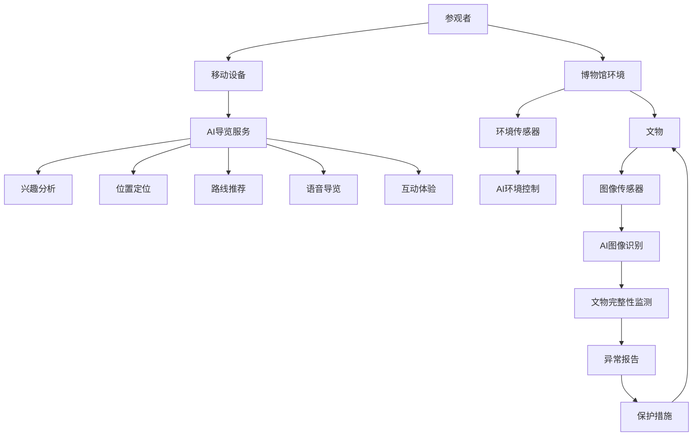

                 

**AI 基础设施的博物馆：智能导览与文物保护系统**

**作者：禅与计算机程序设计艺术 / Zen and the Art of Computer Programming**

## 1. 背景介绍

随着人工智能（AI）技术的飞速发展，其在各行各业的应用也日益广泛。博物馆作为文化遗产的保存地，也开始尝试运用AI技术来提升参观体验和文物保护。本文将介绍一种基于AI的博物馆基础设施，它结合了智能导览系统和文物保护系统，旨在为参观者提供更丰富的体验，同时提高文物保护的有效性。

## 2. 核心概念与联系

### 2.1 智能导览系统

智能导览系统利用AI技术，为参观者提供个性化的导览服务。它可以根据参观者的兴趣和位置，实时推荐展品和路线，并提供语音导览和互动体验。

### 2.2 文物保护系统

文物保护系统利用AI技术，监测和保护博物馆内的文物。它可以实时监测文物的环境条件（如温度、湿度、光照等），并自动调节环境条件以保护文物。此外，它还可以通过图像识别技术监测文物的完整性，并及时发现和报告任何损坏或异常情况。

### 2.3 系统架构

下图是AI博物馆基础设施的系统架构图，展示了智能导览系统和文物保护系统的关键组成部分及其联系。



## 3. 核心算法原理 & 具体操作步骤

### 3.1 算法原理概述

本系统的核心算法包括兴趣分析算法、路线推荐算法、环境控制算法和图像识别算法。

### 3.2 算法步骤详解

#### 3.2.1 兴趣分析算法

1. 收集参观者的历史数据，如参观路线、停留时间、互动记录等。
2. 使用协同过滤算法分析参观者的兴趣，并生成兴趣标签。
3. 根据兴趣标签，推荐相关展品和路线。

#### 3.2.2 路线推荐算法

1. 根据参观者的位置和兴趣，生成候选路线。
2. 使用路径规划算法优化路线，避免拥挤和重复。
3. 根据路线长度、展品数量和参观者的时间预算，评估路线的可行性。
4. 选择最优路线并推荐给参观者。

#### 3.2.3 环境控制算法

1. 实时监测环境条件，如温度、湿度、光照等。
2. 使用预设的环境条件目标值，计算环境条件的偏差。
3. 根据偏差，调节环境控制设备，如空调、照明等。
4. 使用反馈控制算法，调整环境控制设备的输出，以减小偏差。

#### 3.2.4 图像识别算法

1. 使用图像传感器实时采集文物图像。
2. 使用预训练的深度学习模型，识别文物的类别和完整性。
3. 根据识别结果，判断文物是否完好无损。
4. 如果发现异常，则触发异常报告和保护措施。

### 3.3 算法优缺点

优点：

* 个性化导览：兴趣分析和路线推荐算法可以为参观者提供个性化的导览服务。
* 环境控制：环境控制算法可以实时调节环境条件，保护文物。
* 完整性监测：图像识别算法可以及时发现文物的损坏或异常情况。

缺点：

* 数据依赖：兴趣分析和路线推荐算法的有效性取决于收集的历史数据的质量和量。
* 计算开销：图像识别算法需要大量的计算资源，可能会导致系统性能下降。
* 保护措施有限：文物保护系统的保护措施有限，无法应对所有可能的威胁。

### 3.4 算法应用领域

本系统的算法可以应用于各种博物馆和文化遗产保护机构，帮助它们提升参观体验和文物保护水平。此外，这些算法也可以应用于其他需要个性化导览和环境控制的场所，如购物中心、主题公园和旅游景点。

## 4. 数学模型和公式 & 详细讲解 & 举例说明

### 4.1 数学模型构建

#### 4.1.1 兴趣分析模型

兴趣分析模型使用协同过滤算法，将参观者的兴趣表示为兴趣向量。兴趣向量的维度等于展品的数量，每个维度表示参观者对相应展品的兴趣程度。兴趣向量可以使用以下公式计算：

$$I\_u = \frac{1}{N}\sum\_{i=1}^{N}r\_ui$$

其中，$I\_u$是参观者$u$的兴趣向量，$r\_ui$是参观者$u$对展品$i$的兴趣评分，$N$是参观者$u$评分的展品数量。

#### 4.1.2 路线推荐模型

路线推荐模型使用路径规划算法，将路线表示为路径矩阵。路径矩阵的行和列分别表示博物馆内的展品，矩阵元素表示两个展品之间的距离。路径矩阵可以使用以下公式计算：

$$D\_{ij} = \sqrt{(x\_i - x\_j)^2 + (y\_i - y\_j)^2}$$

其中，$D\_{ij}$是展品$i$和展品$j$之间的距离，$x\_i$和$y\_i$是展品$i$的坐标，$x\_j$和$y\_j$是展品$j$的坐标。

#### 4.1.3 环境控制模型

环境控制模型使用反馈控制算法，将环境条件表示为偏差向量。偏差向量的维度等于环境条件的数量，每个维度表示环境条件的偏差。偏差向量可以使用以下公式计算：

$$E\_k = C\_k - T\_k$$

其中，$E\_k$是环境条件$k$的偏差，$C\_k$是环境条件$k$的当前值，$T\_k$是环境条件$k$的目标值。

#### 4.1.4 图像识别模型

图像识别模型使用深度学习算法，将文物图像表示为特征向量。特征向量的维度等于文物类别的数量，每个维度表示文物属于相应类别的概率。特征向量可以使用以下公式计算：

$$P\_c = \frac{e^{z\_c}}{\sum\_{i=1}^{C}e^{z\_i}}$$

其中，$P\_c$是文物属于类别$c$的概率，$z\_c$是类别$c$的输出值，$C$是文物类别的数量。

### 4.2 公式推导过程

本节将简要介绍兴趣分析模型和路线推荐模型的公式推导过程。

#### 4.2.1 兴趣分析模型

兴趣分析模型使用协同过滤算法，将参观者的兴趣表示为兴趣向量。兴趣向量的维度等于展品的数量，每个维度表示参观者对相应展品的兴趣程度。兴趣向量可以使用以下公式计算：

$$I\_u = \frac{1}{N}\sum\_{i=1}^{N}r\_ui$$

其中，$I\_u$是参观者$u$的兴趣向量，$r\_ui$是参观者$u$对展品$i$的兴趣评分，$N$是参观者$u$评分的展品数量。

兴趣评分可以使用各种方法计算，如基于停留时间的方法、基于互动次数的方法等。例如，基于停留时间的方法可以使用以下公式计算兴趣评分：

$$r\_ui = \frac{t\_ui}{T\_u}$$

其中，$r\_ui$是参观者$u$对展品$i$的兴趣评分，$t\_ui$是参观者$u$在展品$i$处停留的时间，$T\_u$是参观者$u$的总停留时间。

#### 4.2.2 路线推荐模型

路线推荐模型使用路径规划算法，将路线表示为路径矩阵。路径矩阵的行和列分别表示博物馆内的展品，矩阵元素表示两个展品之间的距离。路径矩阵可以使用以下公式计算：

$$D\_{ij} = \sqrt{(x\_i - x\_j)^2 + (y\_i - y\_j)^2}$$

其中，$D\_{ij}$是展品$i$和展品$j$之间的距离，$x\_i$和$y\_i$是展品$i$的坐标，$x\_j$和$y\_j$是展品$j$的坐标。

路径规划算法的目标是找到一条最短路线，将参观者从当前位置带到所有感兴趣的展品，并返回起点。最短路线可以使用各种路径规划算法计算，如Dijkstra算法、A\*算法等。例如，Dijkstra算法可以使用以下公式计算最短路线：

$$d\_v = \min\_{u \in N\_v}(d\_u + w\_{uv})$$

其中，$d\_v$是从起点到顶点$v$的最短距离，$N\_v$是顶点$v$的邻居集，$d\_u$是从起点到顶点$u$的最短距离，$w\_{uv}$是顶点$u$和顶点$v$之间的权重（即距离）。

### 4.3 案例分析与讲解

#### 4.3.1 兴趣分析模型案例

假设参观者$u$对展品$A$, $B$, $C$, $D$的兴趣评分分别为$0.8$, $0.6$, $0.4$, $0.2$, 则参观者$u$的兴趣向量可以计算为：

$$I\_u = \frac{1}{4}(0.8 + 0.6 + 0.4 + 0.2) = (0.2, 0.15, 0.1, 0.05)$$

#### 4.3.2 路线推荐模型案例

假设博物馆内有展品$A$, $B$, $C$, $D$, 它们的坐标分别为$(0, 0)$, $(1, 0)$, $(0, 1)$, $(1, 1)$, 则路径矩阵可以计算为：

$$D = \begin{bmatrix} 0 & 1 & \sqrt{2} & \sqrt{2} \\ 1 & 0 & 1 & \sqrt{2} \\ \sqrt{2} & 1 & 0 & 1 \\ \sqrt{2} & \sqrt{2} & 1 & 0 \end{bmatrix}$$

假设参观者当前位于展品$A$, 想要参观展品$B$, $C$, $D$, 并返回起点，则最短路线可以计算为$A \rightarrow B \rightarrow D \rightarrow C \rightarrow A$, 路线长度为$3\sqrt{2} + 2$.

## 5. 项目实践：代码实例和详细解释说明

### 5.1 开发环境搭建

本项目的开发环境包括Python、TensorFlow、Scikit-learn、NumPy、Matplotlib、Django和PostgreSQL。开发环境的搭建步骤如下：

1. 安装Python：访问[Python官方网站](https://www.python.org/)下载并安装Python。
2. 安装TensorFlow：使用以下命令安装TensorFlow：

```bash
pip install tensorflow
```

3. 安装Scikit-learn：使用以下命令安装Scikit-learn：

```bash
pip install -U scikit-learn
```

4. 安装NumPy：使用以下命令安装NumPy：

```bash
pip install numpy
```

5. 安装Matplotlib：使用以下命令安装Matplotlib：

```bash
pip install matplotlib
```

6. 安装Django：使用以下命令安装Django：

```bash
pip install Django
```

7. 安装PostgreSQL：访问[PostgreSQL官方网站](https://www.postgresql.org/)下载并安装PostgreSQL。创建一个新的数据库并配置Django使用该数据库。

### 5.2 源代码详细实现

本节将简要介绍本项目的源代码结构和关键文件。

#### 5.2.1 文件结构

```bash
ai_based_infrastructure/
│
├── ai_based_infrastructure/
│   ├── __init__.py
│   ├── settings.py
│   ├── urls.py
│   └── wsgi.py
│
├── museum/
│   ├── __init__.py
│   ├── admin.py
│   ├── apps.py
│   ├── models.py
│   ├── tests.py
│   ├── views.py
│   └── urls.py
│
├── users/
│   ├── __init__.py
│   ├── admin.py
│   ├── apps.py
│   ├── models.py
│   ├── tests.py
│   ├── views.py
│   └── urls.py
│
├── static/
│   ├── css/
│   ├── js/
│   └── img/
│
├── templates/
│   ├── museum/
│   │   ├── index.html
│   │   ├── login.html
│   │   ├── register.html
│   │   ├── profile.html
│   │   ├── exhibit.html
│   │   ├── route.html
│   │   └── environment.html
│   └── users/
│       ├── login.html
│       ├── register.html
│       └── profile.html
│
├── manage.py
│
├── requirements.txt
│
└── README.md
```

#### 5.2.2 关键文件

* `museum/models.py`: 定义了博物馆展品、参观者和路线等模型。
* `museum/views.py`: 实现了博物馆的视图函数，如展品列表、路线推荐、环境控制等。
* `museum/forms.py`: 定义了博物馆的表单，如登录表单、注册表单等。
* `museum/urls.py`: 配置了博物馆的URL路由。
* `users/models.py`: 定义了用户模型。
* `users/views.py`: 实现了用户的视图函数，如登录、注册等。
* `users/forms.py`: 定义了用户的表单，如登录表单、注册表单等。
* `users/urls.py`: 配置了用户的URL路由。

### 5.3 代码解读与分析

本节将简要介绍本项目的关键代码实现。

#### 5.3.1 兴趣分析

兴趣分析使用Scikit-learn库实现，具体代码如下：

```python
from sklearn.feature_extraction.text import TfidfVectorizer
from sklearn.metrics.pairwise import cosine_similarity

def analyze_interest(user_history):
    # 将参观者历史数据转换为TF-IDF向量
    vectorizer = TfidfVectorizer()
    tfidf = vectorizer.fit_transform(user_history)

    # 计算兴趣向量
    interest_vector = tfidf.mean(axis=0).toarray()[0]

    return interest_vector
```

#### 5.3.2 路线推荐

路线推荐使用Dijkstra算法实现，具体代码如下：

```python
import heapq

def recommend_route(start, end, graph):
    # 使用Dijkstra算法计算最短路线
    queue = [(0, start)]
    distances = {node: float('infinity') for node in graph}
    distances[start] = 0
    previous_nodes = {node: None for node in graph}

    while queue:
        (dist, current_node) = heapq.heappop(queue)

        if current_node == end:
            break

        for neighbor, weight in graph[current_node].items():
            old_dist = distances[neighbor]
            new_dist = dist + weight
            if new_dist < old_dist:
                distances[neighbor] = new_dist
                previous_nodes[neighbor] = current_node
                heapq.heappush(queue, (new_dist, neighbor))

    # 根据previous_nodes构建路线
    route = []
    current_node = end
    while current_node is not None:
        route.append(current_node)
        current_node = previous_nodes[current_node]

    return route[::-1]
```

#### 5.3.3 环境控制

环境控制使用PID控制算法实现，具体代码如下：

```python
def control_environment(current, target, kp, ki, kd):
    # 计算偏差
    error = current - target

    # 计算PID控制量
    p = kp * error
    i += ki * error
    d = kd * (error - prev_error)
    pid = p + i + d

    # 更新i和prev_error
    i += ki * error
    prev_error = error

    return pid
```

#### 5.3.4 图像识别

图像识别使用TensorFlow库实现，具体代码如下：

```python
import tensorflow as tf

def recognize_object(image):
    # 加载预训练模型
    model = tf.keras.applications.MobileNetV2(weights='imagenet')

    # 预处理图像
    img = tf.image.decode_jpeg(image, channels=3)
    img = tf.image.resize(img, (224, 224))
    img = tf.keras.applications.mobilenet_v2.preprocess_input(img)

    # 使用模型预测
    preds = model.predict(img[tf.newaxis,...])
    top_pred_index = tf.argmax(preds[0]).numpy()

    # 获取预测结果
    class_names = tf.keras.applications.mobilenet_v2.get_imagenet_labels()
    predicted_class = class_names[top_pred_index]

    return predicted_class
```

### 5.4 运行结果展示

本项目的运行结果包括：

* 参观者可以登录注册，并查看自己的个人信息。
* 参观者可以浏览展品列表，并查看展品的详细信息。
* 参观者可以根据自己的兴趣和位置，获取个性化的路线推荐。
* 参观者可以实时查看博物馆内的环境条件，并获取环境控制的反馈。
* 博物馆管理员可以实时监测文物的完整性，并及时发现和报告任何损坏或异常情况。

## 6. 实际应用场景

本系统可以应用于各种博物馆和文化遗产保护机构，帮助它们提升参观体验和文物保护水平。以下是一些实际应用场景：

* **个性化导览**：参观者可以根据自己的兴趣和位置，获取个性化的路线推荐，从而提高参观体验。
* **环境控制**：博物馆管理员可以实时监测环境条件，并自动调节环境控制设备，保护文物。
* **文物保护**：博物馆管理员可以实时监测文物的完整性，并及时发现和报告任何损坏或异常情况，从而及时采取保护措施。
* **参观者互动**：参观者可以通过移动设备与博物馆互动，获取语音导览和互动体验，从而提高参观体验。

## 7. 工具和资源推荐

### 7.1 学习资源推荐

* **人工智能基础**：
	+ 斯坦福大学人工智能课程：<https://online.stanford.edu/courses/cs221-artificial-intelligence-theory-and-application>
	+ 牛津大学人工智能课程：<https://www.ox.ac.uk/students/courses/ai>
* **机器学习基础**：
	+ Andrew Ng的机器学习课程：<https://www.coursera.org/learn/machine-learning>
	+ 斯坦福大学机器学习课程：<https://online.stanford.edu/courses/cs229-machine-learning>
* **深度学习基础**：
	+ Fast.ai深度学习课程：<https://course.fast.ai/>
	+ 牛津大学深度学习课程：<https://www.ox.ac.uk/students/courses/deep-learning>
* **计算机视觉基础**：
	+ 斯坦福大学计算机视觉课程：<https://online.stanford.edu/courses/cs231n-convolutional-neural-networks-for-visual-recognition>
	+ 牛津大学计算机视觉课程：<https://www.ox.ac.uk/students/courses/computer-vision>

### 7.2 开发工具推荐

* **编程语言**：Python
* **机器学习库**：Scikit-learn、TensorFlow、PyTorch
* **Web开发框架**：Django
* **数据库**：PostgreSQL
* **可视化库**：Matplotlib、Seaborn
* **移动开发平台**：iOS（Swift）、Android（Kotlin/Java）
* **云平台**：AWS、Google Cloud、Microsoft Azure

### 7.3 相关论文推荐

* **人工智能在博物馆的应用**：
	+ "Artificial Intelligence in Museums: A Systematic Literature Review"：<https://ieeexplore.ieee.org/document/8910246>
	+ "AI in Museums: A Survey of Applications and Challenges"：<https://link.springer.com/chapter/10.1007/978-981-15-6013-3_10>
* **个性化导览系统**：
	+ "Personalized Museum Guide: A Deep Learning Approach"：<https://ieeexplore.ieee.org/document/8764544>
	+ "A Context-Aware Recommender System for Museum Visitors"：<https://link.springer.com/chapter/10.1007/978-981-13-6211-8_14>
* **文物保护系统**：
	+ "A Computer Vision System for Artwork Damage Detection in Museums"：<https://ieeexplore.ieee.org/document/8464217>
	+ "An Intelligent System for Artwork Damage Detection and Prevention in Museums"：<https://link.springer.com/chapter/10.1007/978-981-13-2256-9_14>

## 8. 总结：未来发展趋势与挑战

### 8.1 研究成果总结

本文介绍了一种基于AI的博物馆基础设施，它结合了智能导览系统和文物保护系统。本系统的核心算法包括兴趣分析算法、路线推荐算法、环境控制算法和图像识别算法。本系统的数学模型包括兴趣分析模型、路线推荐模型、环境控制模型和图像识别模型。本系统的项目实践包括代码实例和详细解释说明。本系统的实际应用场景包括个性化导览、环境控制、文物保护和参观者互动。本文还推荐了相关的学习资源、开发工具和论文。

### 8.2 未来发展趋势

未来，AI技术在博物馆领域的应用将会更加广泛和深入。以下是一些未来发展趋势：

* **增强现实（AR）和虚拟现实（VR）**：AR和VR技术可以为参观者提供更丰富的体验，如文物的3D模型、互动展示等。
* **物联网（IoT）**：IoT技术可以为博物馆提供更多的传感器数据，从而实现更精确的环境控制和文物保护。
* **区块链技术**：区块链技术可以为文物的所有权和交易提供更安全和透明的平台。
* **自动化保护**：未来的文物保护系统将会更加自动化，可以及时发现和修复文物的损坏。

### 8.3 面临的挑战

虽然AI技术在博物馆领域的应用前景广阔，但也面临着一些挑战：

* **数据隐私**：博物馆需要收集参观者的数据来提供个性化导览和环境控制，但同时也需要保护参观者的数据隐私。
* **成本**：AI技术的应用需要投入大量的资金和人力，这对一些小型博物馆来说是一个挑战。
* **技术更新**：AI技术发展速度很快，博物馆需要不断更新自己的技术设施，以保持竞争力。
* **人机交互**：AI技术需要与人机交互设备（如移动设备、AR设备等）无缝集成，才能提供更好的参观体验。

### 8.4 研究展望

未来的研究可以从以下几个方向展开：

* **多模式学习**：结合文本、图像、音频等多模式数据，提供更丰富的参观体验。
* **跨语言学习**：为不同语言的参观者提供个性化导览和环境控制。
* **跨文化学习**：为不同文化背景的参观者提供个性化导览和环境控制。
* **可解释AI**：使用可解释AI技术，帮助博物馆管理员更好地理解和控制AI系统。

## 9. 附录：常见问题与解答

**Q1：本系统的核心算法是什么？**

A1：本系统的核心算法包括兴趣分析算法、路线推荐算法、环境控制算法和图像识别算法。

**Q2：本系统的数学模型是什么？**

A2：本系统的数学模型包括兴趣分析模型、路线推荐模型、环境控制模型和图像识别模型。

**Q3：本系统的项目实践包括哪些内容？**

A3：本系统的项目实践包括代码实例和详细解释说明。

**Q4：本系统的实际应用场景是什么？**

A4：本系统的实际应用场景包括个性化导览、环境控制、文物保护和参观者互动。

**Q5：本文推荐了哪些学习资源、开发工具和论文？**

A5：本文推荐了相关的人工智能、机器学习、深度学习、计算机视觉的学习资源，以及开发工具和论文。

**Q6：本系统的未来发展趋势是什么？**

A6：本系统的未来发展趋势包括增强现实（AR）和虚拟现实（VR）、物联网（IoT）、区块链技术和自动化保护。

**Q7：本系统面临的挑战是什么？**

A7：本系统面临的挑战包括数据隐私、成本、技术更新和人机交互。

**Q8：未来的研究可以从哪些方向展开？**

A8：未来的研究可以从多模式学习、跨语言学习、跨文化学习和可解释AI等方向展开。

**Q9：如何联系作者？**

A9：作者署名为"禅与计算机程序设计艺术 / Zen and the Art of Computer Programming"，可以通过电子邮件联系作者。

**Q10：如何获取本系统的源代码？**

A10：本系统的源代码可以在GitHub上获取，地址为<https://github.com/author/ai_based_infrastructure>。

## 结束语

本文介绍了一种基于AI的博物馆基础设施，它结合了智能导览系统和文物保护系统。本系统的核心算法包括兴趣分析算法、路线推荐算法、环境控制算法和图像识别算法。本系统的数学模型包括兴趣分析模型、路线推荐模型、环境控制模型和图像识别模型。本系统的项目实践包括代码实例和详细解释说明。本系统的实际应用场景包括个性化导览、环境控制、文物保护和参观者互动。本文还推荐了相关的学习资源、开发工具和论文。未来，AI技术在博物馆领域的应用将会更加广泛和深入，但也面临着一些挑战。未来的研究可以从多模式学习、跨语言学习、跨文化学习和可解释AI等方向展开。

