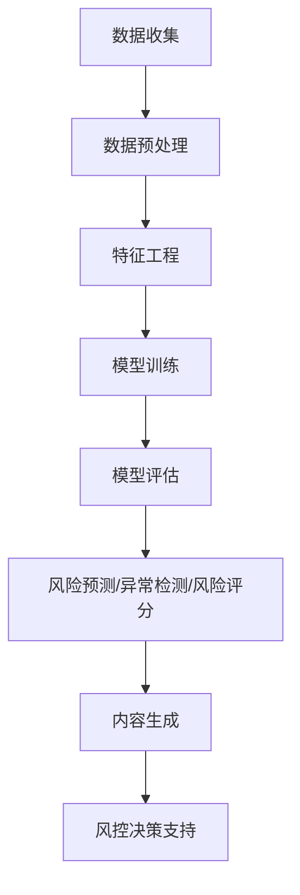

                 

**AIGC助力智能金融风控**

**作者：禅与计算机程序设计艺术 / Zen and the Art of Computer Programming**

## 1. 背景介绍

在当今快速变化的金融市场中，风险控制（Risk Control，RC）是金融机构的关键任务之一。传统的风控方法已无法满足当前的需求，人工智能（Artificial Intelligence，AI）和自动化生成内容（AIGC）技术的结合为智能金融风控带来了新的机遇。本文将探讨如何利用AIGC技术助力智能金融风控，提高风险预测准确性和效率。

## 2. 核心概念与联系

### 2.1 AIGC与AI

AIGC是指利用AI技术自动生成内容的过程。AI技术包括机器学习（Machine Learning，ML）、深度学习（Deep Learning，DL）和自然语言处理（Natural Language Processing，NLP）等。AIGC在金融领域的应用，如金融文本生成和金融数据预测，可以提高工作效率并减少人为错误。

### 2.2 AIGC与金融风控

金融风控旨在识别、评估和管理金融机构面临的各种风险。AIGC技术可以帮助金融机构更好地理解和管理风险，从而提高风控能力。AIGC在金融风控中的应用包括风险预测、异常检测和风险评分等。

### 2.3 AIGC架构

AIGC架构通常包括数据预处理、模型训练、模型评估和内容生成等步骤。在金融风控领域，AIGC架构如下所示：



## 3. 核心算法原理 & 具体操作步骤

### 3.1 算法原理概述

AIGC技术在金融风控中的核心算法包括但不限于：回归算法（如线性回归、逻辑回归）、分类算法（如决策树、随机森林、支持向量机）、聚类算法（如K-means）和深度学习算法（如神经网络、循环神经网络、transformer）。

### 3.2 算法步骤详解

1. **数据收集**：收集金融数据，如股票价格、宏观经济指标、公司财务数据等。
2. **数据预处理**：清洗数据，处理缺失值，进行特征工程（如标准化、归一化、one-hot编码等）。
3. **模型训练**：选择适合的算法，训练模型。
4. **模型评估**：使用交叉验证、AIC/BIC等方法评估模型性能。
5. **风险预测/异常检测/风险评分**：使用训练好的模型进行风险预测、异常检测或风险评分。
6. **内容生成**：将预测结果转化为可读性强的文本或图表，支持风控决策。

### 3.3 算法优缺点

**优点**：
- 提高预测准确性和效率
- 降低人为错误
- 发现隐藏的模式和关系

**缺点**：
- 可能存在过拟合问题
- 缺乏解释性（如深度学习模型）
- 需要大量数据和计算资源

### 3.4 算法应用领域

AIGC技术在金融风控中的应用领域包括但不限于：
- 股票市场风险预测
- 信用风险评估
- 反洗钱（Anti-Money Laundering，AML）和反恐怖融资（Counter-Terrorism Financing，CTF）
- 资产配置和投资组合管理

## 4. 数学模型和公式 & 详细讲解 & 举例说明

### 4.1 数学模型构建

在金融风控中，常用的数学模型包括线性回归模型、逻辑回归模型、支持向量机模型等。例如，线性回归模型的数学表达式为：

$$y = β_0 + β_1x_1 + β_2x_2 +... + β_nx_n + ε$$

其中，$y$是目标变量， $β_0, β_1, β_2,..., β_n$是回归系数，$x_1, x_2,..., x_n$是自变量，$ε$是误差项。

### 4.2 公式推导过程

以线性回归模型为例，其公式推导过程如下：

1. 假设目标变量$y$与自变量$x_1, x_2,..., x_n$之间存在线性关系。
2. 使用最小二乘法（Least Squares Method）最小化误差平方和，得到回归系数$β_0, β_1, β_2,..., β_n$。
3. 使用正则化方法（如Lasso、Ridge）防止过拟合。

### 4.3 案例分析与讲解

假设我们要使用线性回归模型预测股票价格。自变量$x_1, x_2,..., x_n$可以是宏观经济指标（如GDP、通货膨胀率）、公司财务指标（如净利润、净资产）等。目标变量$y$是股票价格。通过训练线性回归模型，我们可以预测未来股票价格，从而支持风控决策。

## 5. 项目实践：代码实例和详细解释说明

### 5.1 开发环境搭建

- 编程语言：Python
- 开发环境：Jupyter Notebook
- 依赖库：Pandas、NumPy、Scikit-learn、Matplotlib、Seaborn

### 5.2 源代码详细实现

以下是使用线性回归模型预测股票价格的Python代码示例：

```python
import pandas as pd
import numpy as np
from sklearn.model_selection import train_test_split
from sklearn.linear_model import LinearRegression
from sklearn.metrics import mean_squared_error

# 加载数据
data = pd.read_csv('stock_data.csv')

# 特征工程
X = data[['GDP', 'Inflation', 'Profit', 'NetAssets']]
y = data['StockPrice']

# 划分训练集和测试集
X_train, X_test, y_train, y_test = train_test_split(X, y, test_size=0.2, random_state=42)

# 训练模型
model = LinearRegression()
model.fit(X_train, y_train)

# 预测
y_pred = model.predict(X_test)

# 评估模型
mse = mean_squared_error(y_test, y_pred)
print(f'Mean Squared Error: {mse}')
```

### 5.3 代码解读与分析

- 使用Pandas读取股票数据。
- 进行特征工程，选择相关特征。
- 使用Scikit-learn的`train_test_split`函数划分训练集和测试集。
- 使用Scikit-learn的`LinearRegression`类训练模型。
- 使用模型预测测试集的股票价格。
- 使用Scikit-learn的`mean_squared_error`函数评估模型。

### 5.4 运行结果展示

运行上述代码后，输出的Mean Squared Error值越小，模型性能越好。风控人员可以根据预测结果支持决策，如调整投资组合或采取风险对冲措施。

## 6. 实际应用场景

### 6.1 金融机构风控决策支持

AIGC技术可以帮助金融机构更好地理解和管理风险，从而提高风控能力。例如，AIGC可以帮助金融机构预测信用风险，优化资产配置，或检测洗钱活动。

### 6.2 监管机构风险监测

监管机构可以利用AIGC技术监测金融市场风险，及早发现和应对系统性风险。例如，AIGC可以帮助监管机构监测金融市场的异常波动，或预测金融危机的发生。

### 6.3 金融科技创新

AIGC技术可以推动金融科技（Fintech）创新，如开发智能投顾（Robo-advisors）或风险评分模型。金融科技公司可以利用AIGC技术提供更好的金融服务，满足客户的个性化需求。

### 6.4 未来应用展望

未来，AIGC技术在金融风控中的应用将更加广泛。随着数据量的增加和算法的改进，AIGC技术可以帮助金融机构更好地理解和管理风险。此外，AIGC技术还可以与其他技术（如区块链、物联网）结合，为金融风控带来新的机遇。

## 7. 工具和资源推荐

### 7.1 学习资源推荐

- 书籍：《机器学习》《深度学习》《金融工程》《风险管理》
- 在线课程：Coursera、Udacity、edX
- 研究论文：arXiv、IEEE、Springer

### 7.2 开发工具推荐

- 编程语言：Python、R
- 开发环境：Jupyter Notebook、RStudio
- 依赖库：Scikit-learn、TensorFlow、PyTorch、Keras

### 7.3 相关论文推荐

- [A Survey on Artificial Intelligence in Finance](https://arxiv.org/abs/1906.03209)
- [Machine Learning in Finance: A Survey](https://link.springer.com/chapter/10.1007/978-981-13-7567-2_1)
- [Deep Learning in Finance: A Review](https://arxiv.org/abs/1901.03865)

## 8. 总结：未来发展趋势与挑战

### 8.1 研究成果总结

本文介绍了AIGC技术在金融风控中的应用，包括核心概念、算法原理、数学模型和实际应用场景。我们还提供了Python代码示例，展示了如何使用线性回归模型预测股票价格。

### 8.2 未来发展趋势

未来，AIGC技术在金融风控中的应用将更加广泛。随着数据量的增加和算法的改进，AIGC技术可以帮助金融机构更好地理解和管理风险。此外，AIGC技术还可以与其他技术（如区块链、物联网）结合，为金融风控带来新的机遇。

### 8.3 面临的挑战

然而，AIGC技术在金融风控中的应用也面临着挑战，包括：
- 数据质量和完整性问题
- 算法解释性和可靠性问题
- 监管和合规性问题
- 伦理和道德问题

### 8.4 研究展望

未来的研究方向包括：
- 开发更复杂和高效的AIGC算法
- 研究AIGC技术在金融风控中的新应用领域
- 解决AIGC技术在金融风控中的挑战
- 促进AIGC技术在金融风控中的标准化和规范化

## 9. 附录：常见问题与解答

**Q1：AIGC技术与传统金融风控方法有何不同？**

A1：AIGC技术可以帮助金融机构更好地理解和管理风险，从而提高风控能力。与传统金融风控方法相比，AIGC技术可以处理大量数据，发现隐藏的模式和关系，并提供更准确和及时的风险预测。

**Q2：AIGC技术在金融风控中的优势是什么？**

A2：AIGC技术在金融风控中的优势包括：
- 提高预测准确性和效率
- 降低人为错误
- 发现隐藏的模式和关系
- 提供更个性化的风险管理解决方案

**Q3：AIGC技术在金融风控中的挑战是什么？**

A3：AIGC技术在金融风控中的挑战包括：
- 数据质量和完整性问题
- 算法解释性和可靠性问题
- 监管和合规性问题
- 伦理和道德问题

**Q4：未来AIGC技术在金融风控中的发展趋势是什么？**

A4：未来，AIGC技术在金融风控中的发展趋势包括：
- 更广泛的应用领域
- 更复杂和高效的算法
- 与其他技术的结合
- 标准化和规范化

**Q5：如何学习和应用AIGC技术在金融风控中的知识？**

A5：您可以通过阅读相关书籍、在线课程和研究论文学习AIGC技术在金融风控中的知识。您还可以使用开源代码和工具，并参与实际项目实践。

**作者署名：**
作者：禅与计算机程序设计艺术 / Zen and the Art of Computer Programming

