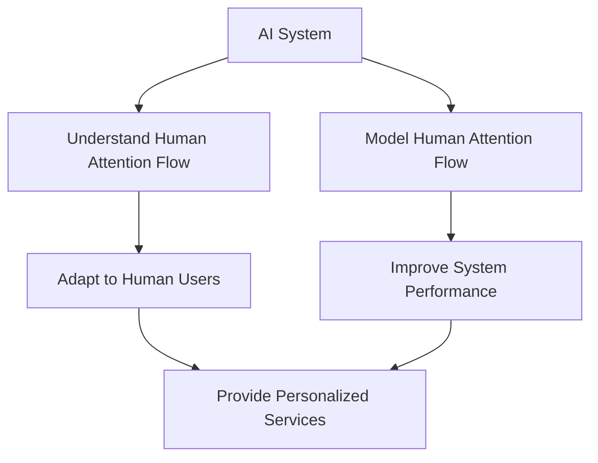

                 

**人工智能 (AI)**、**注意力流 (Attention Flow)**、**人机交互 (HCI)**、**道德考量 (Ethical Considerations)**、**人机融合 (Human-AI Fusion)**、**注意力机制 (Attention Mechanism)**、**人类注意力 (Human Attention)**

## 1. 背景介绍

在当今的数字化世界中，人工智能无处不在，从搜索引擎到自动驾驶汽车，从智能手机到医疗设备，AI已经渗透到我们生活的方方面面。然而，随着AI技术的不断发展，我们也面临着一系列的挑战和道德考量。其中之一就是如何设计AI系统，使其能够更好地理解和适应人类的注意力流，从而实现真正的人机融合。

人类的注意力是有限的，我们无法同时关注多个任务或刺激。因此，我们的大脑会根据优先级和重要性来分配注意力。理解和模拟这种注意力流对于设计出更人性化的AI系统至关重要。本文将深入探讨AI与人类注意力流的关系，并就如何打造人机融合的道德考量提出见解。

## 2. 核心概念与联系

### 2.1 注意力机制

注意力机制是深度学习领域的一个关键概念，它允许模型在处理信息时有选择地“关注”某些部分，忽略其他部分。这种机制在自然语言处理、计算机视觉等领域取得了显著的成功。然而，当前的注意力机制大多是基于数据驱动的，缺乏对人类注意力流的深入理解。

### 2.2 人类注意力流

人类注意力流指的是人类在处理信息时，注意力在不同刺激或任务之间转移的过程。这种转移受到多种因素的影响，包括任务的难度、刺激的重要性、情感因素等。理解人类注意力流对于设计更人性化的AI系统具有重要意义。

### 2.3 AI与人类注意力流的联系

AI系统如果能够理解和模拟人类注意力流，就能够更好地适应人类用户，提供更个性化、更人性化的服务。例如，一个能够理解用户注意力流的搜索引擎，可以提供更相关的搜索结果；一个能够模拟人类注意力流的自动驾驶系统，可以更好地预测路况，提高安全性。



## 3. 核心算法原理 & 具体操作步骤

### 3.1 算法原理概述

要理解和模拟人类注意力流，我们需要设计一种能够学习和预测注意力流的算法。一种可能的方法是使用循环神经网络（RNN）或其变种（如LSTM或GRU）来建模注意力流。这些模型可以学习注意力流的时间序列特征，并预测注意力在未来的转移。

### 3.2 算法步骤详解

1. **数据收集**：收集包含注意力流信息的数据。这种数据可以来自用户的行为数据（如鼠标点击、眼动数据等），也可以来自主观评分（如用户对刺激重要性的评分等）。
2. **数据预处理**：对收集到的数据进行预处理，包括清洗、标准化等。
3. **模型构建**：使用RNN等模型构建注意力流模型。模型的输入可以是注意力流的历史信息，输出可以是注意力流的未来转移。
4. **模型训练**：使用预处理后的数据训练模型。可以使用回归损失函数来优化模型。
5. **模型评估**：评估模型的性能，可以使用准确率、召回率等指标。
6. **模型部署**：将模型部署到实际应用中，用于理解和模拟人类注意力流。

### 3.3 算法优缺点

**优点**：这种方法可以学习注意力流的时间序列特征，预测注意力流的未来转移。它可以适应不同用户的注意力流，提供更个性化的服务。

**缺点**：这种方法需要大量的注意力流数据，收集和标注这种数据可能是一项艰巨的任务。此外，模型的性能可能受到数据质量的影响。

### 3.4 算法应用领域

这种算法可以应用于各种需要理解和模拟人类注意力流的场景，包括搜索引擎、自动驾驶系统、人机交互系统等。

## 4. 数学模型和公式 & 详细讲解 & 举例说明

### 4.1 数学模型构建

我们可以使用RNN来建模注意力流。设$X_t$表示时间$t$的注意力流状态，$Y_t$表示时间$t$的注意力流转移，$h_t$表示时间$t$的隐藏状态。RNN的更新公式如下：

$$
h_t = \tanh(W_{hh}h_{t-1} + W_{xh}X_t + b_h) \\
Y_t = W_{hy}h_t + b_y
$$

其中，$W_{hh}$，$W_{xh}$，$W_{hy}$，$b_h$，$b_y$都是学习参数。

### 4.2 公式推导过程

上述公式是RNN的标准更新公式。在训练过程中，我们可以使用梯度下降等优化算法来更新学习参数，以最小化损失函数。损失函数可以是均方误差（MSE）等。

### 4.3 案例分析与讲解

例如，我们可以使用这种模型来预测用户在网页浏览中的注意力流转移。输入$X_t$可以是用户当前浏览的网页特征，输出$Y_t$可以是用户下一步可能点击的链接。通过学习用户的注意力流，我们可以提供更相关的搜索结果或广告推荐。

## 5. 项目实践：代码实例和详细解释说明

### 5.1 开发环境搭建

我们可以使用Python和TensorFlow等深度学习框架来实现这种模型。我们需要安装相关的库，并设置开发环境。

### 5.2 源代码详细实现

以下是使用TensorFlow实现注意力流模型的示例代码：

```python
import tensorflow as tf
from tensorflow.keras.layers import SimpleRNN, Dense

# 定义模型
model = tf.keras.Sequential([
    SimpleRNN(64, input_shape=(None, 10)),
    Dense(10, activation='softmax')
])

# 编译模型
model.compile(optimizer='adam', loss='categorical_crossentropy', metrics=['accuracy'])

# 训练模型
model.fit(X_train, y_train, epochs=10, batch_size=32)
```

### 5.3 代码解读与分析

这种模型使用SimpleRNN层来建模注意力流的时间序列特征，使用Dense层来预测注意力流的未来转移。模型使用Adam优化器和交叉熵损失函数进行训练。

### 5.4 运行结果展示

通过训练这种模型，我们可以预测注意力流的未来转移。例如，我们可以预测用户在网页浏览中的注意力流转移，从而提供更相关的搜索结果或广告推荐。

## 6. 实际应用场景

### 6.1 当前应用

当前，这种模型可以应用于搜索引擎、自动驾驶系统、人机交互系统等领域。例如，Google使用注意力机制来改进其搜索算法，以提供更相关的搜索结果。

### 6.2 未来应用展望

未来，这种模型可以应用于更多需要理解和模拟人类注意力流的场景。例如，它可以应用于虚拟现实（VR）或增强现实（AR）系统，提供更个性化的用户体验。它也可以应用于教育领域，帮助教师更好地理解学生的注意力流，从而提供更有效的教学。

## 7. 工具和资源推荐

### 7.1 学习资源推荐

- **书籍**：《注意力机制：从基础到应用》作者：Yoshua Bengio
- **在线课程**：Coursera上的“注意力机制”课程

### 7.2 开发工具推荐

- **深度学习框架**：TensorFlow、PyTorch
- **数据分析库**：Pandas、NumPy

### 7.3 相关论文推荐

- **Attention Is All You Need**作者：Vaswani et al.
- **A Survey of Attention Mechanisms in Deep Learning**作者：Luong et al.

## 8. 总结：未来发展趋势与挑战

### 8.1 研究成果总结

本文介绍了如何使用RNN等模型来理解和模拟人类注意力流。这种方法可以学习注意力流的时间序列特征，预测注意力流的未来转移。它可以适应不同用户的注意力流，提供更个性化的服务。

### 8.2 未来发展趋势

未来，AI与人类注意力流的研究将会继续深入。我们可能会看到更复杂的注意力机制，能够更好地模拟人类注意力流。我们也可能会看到更多的应用场景，需要理解和模拟人类注意力流。

### 8.3 面临的挑战

然而，这种方法也面临着一些挑战。首先，收集和标注注意力流数据可能是一项艰巨的任务。其次，模型的性能可能受到数据质量的影响。最后，如何在保护用户隐私的同时收集和使用注意力流数据，也是一个需要解决的道德问题。

### 8.4 研究展望

未来的研究可以从以下几个方向展开：

- **数据收集**：开发新的方法来收集和标注注意力流数据。
- **模型改进**：开发新的模型来更好地理解和模拟人类注意力流。
- **道德考量**：研究如何在保护用户隐私的同时收集和使用注意力流数据。

## 9. 附录：常见问题与解答

**Q1：如何收集注意力流数据？**

**A1：收集注意力流数据的方法有很多种，包括用户的行为数据（如鼠标点击、眼动数据等）和主观评分（如用户对刺激重要性的评分等）。**

**Q2：如何评估注意力流模型的性能？**

**A2：可以使用准确率、召回率等指标来评估注意力流模型的性能。**

**Q3：如何在保护用户隐私的同时收集和使用注意力流数据？**

**A3：这是一个需要解决的道德问题。一种方法是匿名化数据，另一种方法是使用差分隐私技术来保护用户隐私。**

## 作者：禅与计算机程序设计艺术 / Zen and the Art of Computer Programming

