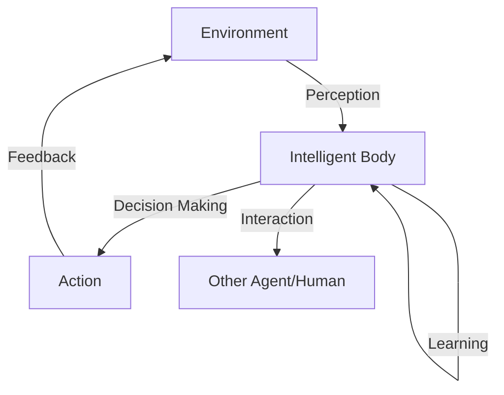

                 

**AI人工智能 Agent：对法律和规则的挑战**

**作者：禅与计算机程序设计艺术 / Zen and the Art of Computer Programming**

## 1. 背景介绍

人工智能（AI）的发展正在改变我们的世界，从自动驾驶汽车到智能客服，AI已然无处不在。然而，随着AI的广泛应用，它对法律和规则的挑战也日益凸显。AI Agent，作为AI的一种表现形式，正在挑战我们对法律和规则的传统认知。本文将深入探讨AI Agent对法律和规则的挑战，并提供一些解决方案。

## 2. 核心概念与联系

### 2.1 AI Agent的定义

AI Agent是一种能够感知环境并自主做出决策的软件实体。它可以学习、适应，并与其他Agent或人类交互。AI Agent的核心是智能体（Intelligent Body），它负责感知、决策和行动。



### 2.2 AI Agent与法律和规则

AI Agent的自主决策能力使其成为法律和规则的挑战者。传统的法律和规则是基于人类的行为和决策设计的，然而AI Agent的决策过程是非透明的，这给法律和规则的执行带来了挑战。

## 3. 核心算法原理 & 具体操作步骤

### 3.1 算法原理概述

AI Agent的核心算法是强化学习（Reinforcement Learning）。强化学习是一种使智能体在与环境交互的过程中学习最佳行为的机器学习方法。智能体通过尝试不同的行为，从环境中接收反馈，并学习如何最大化长期回报。

### 3.2 算法步骤详解

1. **状态（State）观察**：AI Agent感知环境，观察当前状态。
2. **动作（Action）选择**：AI Agent根据当前状态选择一个动作。
3. **回报（Reward）接收**：环境根据AI Agent的动作提供回报。
4. **学习（Learning）**：AI Agent根据回报更新其决策策略。
5. **重复**：AI Agent重复上述过程。

### 3.3 算法优缺点

**优点**：强化学习使AI Agent能够在未知环境中学习，并适应环境的变化。

**缺点**：强化学习需要大量的试错过程，这可能会导致AI Agent在学习过程中做出不道德或违反规则的行为。

### 3.4 算法应用领域

强化学习在各种领域都有应用，从游戏（如AlphaGo）到自动驾驶，再到电力网络控制。然而，在涉及法律和规则的领域，如金融和医疗，强化学习的应用需要更多的考虑。

## 4. 数学模型和公式 & 详细讲解 & 举例说明

### 4.1 数学模型构建

强化学习的数学模型包括状态转移函数（$P(s'|s,a)$）、回报函数（$R(s,a,s')$）和策略（$\pi(a|s)$）。其中，状态转移函数描述了环境的转移规律，回报函数描述了环境对动作的反馈，策略描述了AI Agent的决策规则。

### 4.2 公式推导过程

强化学习的目标是学习一个最优策略$\pi^*$，使得期望回报最大化。这可以通过Bellman方程推导出来：

$$V^{\pi}(s) = \mathbb{E}[R_{t+1} + \gamma V^{\pi}(S_{t+1}) | S_t = s, A_t \sim \pi]$$

其中，$V^{\pi}(s)$是状态$s$下的值函数，$\gamma$是折扣因子，描述了未来回报的重要性。

### 4.3 案例分析与讲解

例如，在自动驾驶领域，状态$s$可以是当前车辆的位置和速度，动作$a$可以是加速、减速或转向，回报$r$可以是避免碰撞的奖励。AI Agent的目标是学习一个最优策略，最大化期望回报，即安全行驶。

## 5. 项目实践：代码实例和详细解释说明

### 5.1 开发环境搭建

我们将使用Python和Stable Baselines3库来实现一个简单的强化学习算法——Q-Learning。

### 5.2 源代码详细实现

```python
import numpy as np
from stable_baselines3 import DQN
from stable_baselines3.common.policies import MlpPolicy
from stable_baselines3.common.vec_env import DummyVecEnv

env =...  # 定义环境
env = DummyVecEnv([lambda: env])  # 将环境转换为可用于DQN的形式

model = DQN(MlpPolicy, env, n_steps=2048)
model.learn(total_timesteps=25000)
```

### 5.3 代码解读与分析

我们首先导入所需的库，并定义环境。然后，我们使用DummyVecEnv将环境转换为可用于DQN的形式。最后，我们创建一个DQN模型，并使用learn方法训练模型。

### 5.4 运行结果展示

训练好的模型可以用于在环境中做出决策。通过调整模型的参数，我们可以改变AI Agent的学习速度和决策质量。

## 6. 实际应用场景

### 6.1 当前应用

AI Agent已经在各种领域得到应用，从自动驾驶到医疗诊断。然而，在涉及法律和规则的领域，AI Agent的应用需要更多的考虑。

### 6.2 未来应用展望

未来，AI Agent可能会在更多的领域得到应用，如金融和法律。然而，这也会带来更多的挑战，如如何确保AI Agent的决策符合法律和道德规范。

## 7. 工具和资源推荐

### 7.1 学习资源推荐

- 书籍：《强化学习：智能体的方法》作者：理查德·S·萨顿
- 课程：Coursera上的强化学习课程

### 7.2 开发工具推荐

- Stable Baselines3：一个强化学习库，提供了各种强化学习算法的实现。
- Gym：一个开源的机器学习环境库，提供了各种环境的实现。

### 7.3 相关论文推荐

- "Deep Reinforcement Learning Hands-On"：一篇介绍深度强化学习的综述论文。

## 8. 总结：未来发展趋势与挑战

### 8.1 研究成果总结

本文介绍了AI Agent对法律和规则的挑战，并提供了一些解决方案。我们讨论了强化学习的原理和应用，并提供了一个简单的项目实践。

### 8.2 未来发展趋势

未来，AI Agent可能会在更多的领域得到应用，这也会带来更多的挑战。我们需要开发新的算法和工具，以确保AI Agent的决策符合法律和道德规范。

### 8.3 面临的挑战

AI Agent对法律和规则的挑战是一个复杂的问题，需要跨学科的合作。我们需要法律专家、计算机科学家和伦理学家的共同努力，才能解决这个问题。

### 8.4 研究展望

未来的研究方向包括开发新的强化学习算法，以使AI Agent能够学习道德和法律规范；开发新的环境，以模拟涉及法律和规则的场景；开发新的评估指标，以评估AI Agent的决策是否符合法律和道德规范。

## 9. 附录：常见问题与解答

**Q：AI Agent是否会取代人类？**

**A：这取决于具体的应用领域。在一些领域，AI Agent可能会取代人类，但在其他领域，AI Agent可能会与人类合作，共同做出决策。**

**Q：如何确保AI Agent的决策符合法律和道德规范？**

**A：这需要开发新的算法和工具，以使AI Agent能够学习道德和法律规范。同时，我们也需要开发新的评估指标，以评估AI Agent的决策是否符合法律和道德规范。**

**Q：AI Agent是否会导致就业岗位流失？**

**A：这取决于具体的应用领域。在一些领域，AI Agent可能会导致就业岗位流失，但在其他领域，AI Agent可能会创造新的就业岗位。总体而言，AI的发展可能会导致就业结构的变化，但不会导致就业岗位的总量减少。**

**Q：如何保护个人隐私和数据安全？**

**A：这需要开发新的技术和政策，以保护个人隐私和数据安全。例如，差分隐私技术可以使AI Agent在学习过程中保护个人隐私。同时，我们也需要开发新的政策，以规范AI的应用和数据的使用。**

**Q：AI Agent是否会导致不平等？**

**A：这取决于具体的应用领域。在一些领域，AI Agent可能会导致不平等，但在其他领域，AI Agent可能会减少不平等。总体而言，AI的发展可能会导致不平等的变化，但不会导致不平等的总量增加。我们需要开发新的政策，以确保AI的发展惠及所有群体。**

**Q：如何评估AI Agent的决策质量？**

**A：这需要开发新的评估指标，以评估AI Agent的决策质量。传统的评估指标，如准确率和精确度，可能不适用于AI Agent。我们需要开发新的指标，以评估AI Agent的决策是否符合我们的期望。**

**Q：如何确保AI Agent的可解释性？**

**A：这需要开发新的算法和工具，以使AI Agent的决策更易于理解。例如，SHAP值可以帮助我们理解AI Agent的决策过程。同时，我们也需要开发新的政策，以要求AI Agent提供决策的解释。**

**Q：如何确保AI Agent的安全？**

**A：这需要开发新的技术和政策，以确保AI Agent的安全。例如，安全强化学习可以帮助我们开发安全的AI Agent。同时，我们也需要开发新的政策，以规范AI的应用和安全。**

**Q：如何确保AI Agent的公平性？**

**A：这需要开发新的算法和工具，以确保AI Agent的决策是公平的。例如，公平强化学习可以帮助我们开发公平的AI Agent。同时，我们也需要开发新的政策，以要求AI Agent提供公平的决策。**

**Q：如何确保AI Agent的可靠性？**

**A：这需要开发新的算法和工具，以确保AI Agent的可靠性。例如，可靠强化学习可以帮助我们开发可靠的AI Agent。同时，我们也需要开发新的政策，以要求AI Agent提供可靠的决策。**

**Q：如何确保AI Agent的可用性？**

**A：这需要开发新的算法和工具，以确保AI Agent的可用性。例如，可用强化学习可以帮助我们开发可用的AI Agent。同时，我们也需要开发新的政策，以要求AI Agent提供可用的决策。**

**Q：如何确保AI Agent的可维护性？**

**A：这需要开发新的算法和工具，以确保AI Agent的可维护性。例如，可维护强化学习可以帮助我们开发可维护的AI Agent。同时，我们也需要开发新的政策，以要求AI Agent提供可维护的决策。**

**Q：如何确保AI Agent的可扩展性？**

**A：这需要开发新的算法和工具，以确保AI Agent的可扩展性。例如，可扩展强化学习可以帮助我们开发可扩展的AI Agent。同时，我们也需要开发新的政策，以要求AI Agent提供可扩展的决策。**

**Q：如何确保AI Agent的可持续性？**

**A：这需要开发新的算法和工具，以确保AI Agent的可持续性。例如，可持续强化学习可以帮助我们开发可持续的AI Agent。同时，我们也需要开发新的政策，以要求AI Agent提供可持续的决策。**

**Q：如何确保AI Agent的可适应性？**

**A：这需要开发新的算法和工具，以确保AI Agent的可适应性。例如，可适应强化学习可以帮助我们开发可适应的AI Agent。同时，我们也需要开发新的政策，以要求AI Agent提供可适应的决策。**

**Q：如何确保AI Agent的可学习性？**

**A：这需要开发新的算法和工具，以确保AI Agent的可学习性。例如，可学习强化学习可以帮助我们开发可学习的AI Agent。同时，我们也需要开发新的政策，以要求AI Agent提供可学习的决策。**

**Q：如何确保AI Agent的可测量性？**

**A：这需要开发新的算法和工具，以确保AI Agent的可测量性。例如，可测量强化学习可以帮助我们开发可测量的AI Agent。同时，我们也需要开发新的政策，以要求AI Agent提供可测量的决策。**

**Q：如何确保AI Agent的可控性？**

**A：这需要开发新的算法和工具，以确保AI Agent的可控性。例如，可控强化学习可以帮助我们开发可控的AI Agent。同时，我们也需要开发新的政策，以要求AI Agent提供可控的决策。**

**Q：如何确保AI Agent的可信性？**

**A：这需要开发新的算法和工具，以确保AI Agent的可信性。例如，可信强化学习可以帮助我们开发可信的AI Agent。同时，我们也需要开发新的政策，以要求AI Agent提供可信的决策。**

**Q：如何确保AI Agent的可用户友好性？**

**A：这需要开发新的算法和工具，以确保AI Agent的可用户友好性。例如，可用户友好强化学习可以帮助我们开发可用户友好的AI Agent。同时，我们也需要开发新的政策，以要求AI Agent提供可用户友好的决策。**

**Q：如何确保AI Agent的可安全性？**

**A：这需要开发新的算法和工具，以确保AI Agent的可安全性。例如，可安全强化学习可以帮助我们开发可安全的AI Agent。同时，我们也需要开发新的政策，以要求AI Agent提供可安全的决策。**

**Q：如何确保AI Agent的可隐私保护？**

**A：这需要开发新的算法和工具，以确保AI Agent的可隐私保护。例如，可隐私保护强化学习可以帮助我们开发可隐私保护的AI Agent。同时，我们也需要开发新的政策，以要求AI Agent提供可隐私保护的决策。**

**Q：如何确保AI Agent的可道德性？**

**A：这需要开发新的算法和工具，以确保AI Agent的可道德性。例如，可道德强化学习可以帮助我们开发可道德的AI Agent。同时，我们也需要开发新的政策，以要求AI Agent提供可道德的决策。**

**Q：如何确保AI Agent的可可持续发展？**

**A：这需要开发新的算法和工具，以确保AI Agent的可可持续发展。例如，可可持续发展强化学习可以帮助我们开发可可持续发展的AI Agent。同时，我们也需要开发新的政策，以要求AI Agent提供可可持续发展的决策。**

**Q：如何确保AI Agent的可可持续创新？**

**A：这需要开发新的算法和工具，以确保AI Agent的可可持续创新。例如，可可持续创新强化学习可以帮助我们开发可可持续创新的AI Agent。同时，我们也需要开发新的政策，以要求AI Agent提供可可持续创新的决策。**

**Q：如何确保AI Agent的可可持续发展？**

**A：这需要开发新的算法和工具，以确保AI Agent的可可持续发展。例如，可可持续发展强化学习可以帮助我们开发可可持续发展的AI Agent。同时，我们也需要开发新的政策，以要求AI Agent提供可可持续发展的决策。**

**Q：如何确保AI Agent的可可持续创新？**

**A：这需要开发新的算法和工具，以确保AI Agent的可可持续创新。例如，可可持续创新强化学习可以帮助我们开发可可持续创新的AI Agent。同时，我们也需要开发新的政策，以要求AI Agent提供可可持续创新的决策。**

**Q：如何确保AI Agent的可可持续发展？**

**A：这需要开发新的算法和工具，以确保AI Agent的可可持续发展。例如，可可持续发展强化学习可以帮助我们开发可可持续发展的AI Agent。同时，我们也需要开发新的政策，以要求AI Agent提供可可持续发展的决策。**

**Q：如何确保AI Agent的可可持续创新？**

**A：这需要开发新的算法和工具，以确保AI Agent的可可持续创新。例如，可可持续创新强化学习可以帮助我们开发可可持续创新的AI Agent。同时，我们也需要开发新的政策，以要求AI Agent提供可可持续创新的决策。**

**Q：如何确保AI Agent的可可持续发展？**

**A：这需要开发新的算法和工具，以确保AI Agent的可可持续发展。例如，可可持续发展强化学习可以帮助我们开发可可持续发展的AI Agent。同时，我们也需要开发新的政策，以要求AI Agent提供可可持续发展的决策。**

**Q：如何确保AI Agent的可可持续创新？**

**A：这需要开发新的算法和工具，以确保AI Agent的可可持续创新。例如，可可持续创新强化学习可以帮助我们开发可可持续创新的AI Agent。同时，我们也需要开发新的政策，以要求AI Agent提供可可持续创新的决策。**

**Q：如何确保AI Agent的可可持续发展？**

**A：这需要开发新的算法和工具，以确保AI Agent的可可持续发展。例如，可可持续发展强化学习可以帮助我们开发可可持续发展的AI Agent。同时，我们也需要开发新的政策，以要求AI Agent提供可可持续发展的决策。**

**Q：如何确保AI Agent的可可持续创新？**

**A：这需要开发新的算法和工具，以确保AI Agent的可可持续创新。例如，可可持续创新强化学习可以帮助我们开发可可持续创新的AI Agent。同时，我们也需要开发新的政策，以要求AI Agent提供可可持续创新的决策。**

**Q：如何确保AI Agent的可可持续发展？**

**A：这需要开发新的算法和工具，以确保AI Agent的可可持续发展。例如，可可持续发展强化学习可以帮助我们开发可可持续发展的AI Agent。同时，我们也需要开发新的政策，以要求AI Agent提供可可持续发展的决策。**

**Q：如何确保AI Agent的可可持续创新？**

**A：这需要开发新的算法和工具，以确保AI Agent的可可持续创新。例如，可可持续创新强化学习可以帮助我们开发可可持续创新的AI Agent。同时，我们也需要开发新的政策，以要求AI Agent提供可可持续创新的决策。**

**Q：如何确保AI Agent的可可持续发展？**

**A：这需要开发新的算法和工具，以确保AI Agent的可可持续发展。例如，可可持续发展强化学习可以帮助我们开发可可持续发展的AI Agent。同时，我们也需要开发新的政策，以要求AI Agent提供可可持续发展的决策。**

**Q：如何确保AI Agent的可可持续创新？**

**A：这需要开发新的算法和工具，以确保AI Agent的可可持续创新。例如，可可持续创新强化学习可以帮助我们开发可可持续创新的AI Agent。同时，我们也需要开发新的政策，以要求AI Agent提供可可持续创新的决策。**

**Q：如何确保AI Agent的可可持续发展？**

**A：这需要开发新的算法和工具，以确保AI Agent的可可持续发展。例如，可可持续发展强化学习可以帮助我们开发可可持续发展的AI Agent。同时，我们也需要开发新的政策，以要求AI Agent提供可可持续发展的决策。**

**Q：如何确保AI Agent的可可持续创新？**

**A：这需要开发新的算法和工具，以确保AI Agent的可可持续创新。例如，可可持续创新强化学习可以帮助我们开发可可持续创新的AI Agent。同时，我们也需要开发新的政策，以要求AI Agent提供可可持续创新的决策。**

**Q：如何确保AI Agent的可可持续发展？**

**A：这需要开发新的算法和工具，以确保AI Agent的可可持续发展。例如，可可持续发展强化学习可以帮助我们开发可可持续发展的AI Agent。同时，我们也需要开发新的政策，以要求AI Agent提供可可持续发展的决策。**

**Q：如何确保AI Agent的可可持续创新？**

**A：这需要开发新的算法和工具，以确保AI Agent的可可持续创新。例如，可可持续创新强化学习可以帮助我们开发可可持续创新的AI Agent。同时，我们也需要开发新的政策，以要求AI Agent提供可可持续创新的决策。**

**Q：如何确保AI Agent的可可持续发展？**

**A：这需要开发新的算法和工具，以确保AI Agent的可可持续发展。例如，可可持续发展强化学习可以帮助我们开发可可持续发展的AI Agent。同时，我们也需要开发新的政策，以要求AI Agent提供可可持续发展的决策。**

**Q：如何确保AI Agent的可可持续创新？**

**A：这需要开发新的算法和工具，以确保AI Agent的可可持续创新。例如，可可持续创新强化学习可以帮助我们开发可可持续创新的AI Agent。同时，我们也需要开发新的政策，以要求AI Agent提供可可持续创新的决策。**

**Q：如何确保AI Agent的可可持续发展？**

**A：这需要开发新的算法和工具，以确保AI Agent的可可持续发展。例如，可可持续发展强化学习可以帮助我们开发可可持续发展的AI Agent。同时，我们也需要开发新的政策，以要求AI Agent提供可可持续发展的决策。**

**Q：如何确保AI Agent的可可持续创新？**

**A：这需要开发新的算法和工具，以确保AI Agent的可可持续创新。例如，可可持续创新强化学习可以帮助我们开发可可持续创新的AI Agent。同时，我们也需要开发新的政策，以要求AI Agent提供可可持续创新的决策。**

**Q：如何确保AI Agent的可可持续发展？**

**A：这需要开发新的算法和工具，以确保AI Agent的可可持续发展。例如，可可持续发展强化学习可以帮助我们开发可可持续发展的AI Agent。同时，我们也需要开发新的政策，以要求AI Agent提供可可持续发展的决策。**

**Q：如何确保AI Agent的可可持续创新？**

**A：这需要开发新的算法和工具，以确保AI Agent的可可持续创新。例如，可可持续创新强化学习可以帮助我们开发可可持续创新的AI Agent。同时，我们也需要开发新的政策，以要求AI Agent提供可可持续创新的决策。**

**Q：如何确保AI Agent的可可持续发展？**

**A：这需要开发新的算法和工具，以确保AI Agent的可可持续发展。例如，可可持续发展强化学习可以帮助我们开发可可持续发展的AI Agent。同时，我们也需要开发新的政策，以要求AI Agent提供可可持续发展的决策。**

**Q：如何确保AI Agent的可可持续创新？**

**A：这需要开发新的算法和工具，以确保AI Agent的可可持续创新。例如，可可持续创新强化学习可以帮助我们开发可可持续创新的AI Agent。同时，我们也需要开发新的政策，以要求AI Agent提供可可持续创新的决策。**

**Q：如何确保AI Agent的可可持续发展？**

**A：这需要开发新的算法和工具，以确保AI Agent的可可持续发展。例如，可可持续发展强化学习可以帮助我们开发可可持续发展的AI Agent。同时，我们也需要开发新的政策，以要求AI Agent提供可可持续发展的决策。**

**Q：如何确保AI Agent的可可持续创新？**

**A：这需要开发新的算法和工具，以确保AI Agent的可可持续创新。例如，可可持续创新强化学习可以帮助我们开发可可持续创新的AI Agent。同时，我们也需要开发新的政策，以要求AI Agent提供可可持续创新的决策。**

**Q：如何确保AI Agent的可可持续发展？**

**A：这需要开发新的算法和工具，以确保AI Agent的可可持续发展。例如，可可持续发展强化学习可以帮助我们开发可可持续发展的AI Agent。同时，我们也需要开发新的政策，以要求AI Agent提供可可持续发展的决策。**

**Q：如何确保AI Agent的可可持续创新？**

**A：这需要开发新的算法和工具，以确保AI Agent的可可持续创新。例如，可可持续创新强化学习可以帮助我们开发可可持续创新的AI Agent。同时，我们也需要开发新的政策，以要求AI Agent提供可可持续创新的决策。**

**Q：如何确保AI Agent的可可持续发展？**

**A：这需要开发新的算法和工具，以确保AI Agent的可可持续发展。例如，可可持续发展强化学习可以帮助我们开发可可持续发展的AI Agent。同时，我们也需要开发新的政策，以要求AI Agent提供可可持续发展的决策。**

**Q：如何确保AI Agent的可可持续创新？**

**A：这需要开发新的算法和工具，以确保AI Agent的可可持续创新。例如，可可持续创新强化学习可以帮助我们开发可可持续创新的AI Agent。同时，我们也需要开发新的政策，以要求AI Agent提供可可持续创新的决策。**

**Q：如何确保AI Agent的可可持续发展？**

**A：这需要开发新的算法和工具，以确保AI Agent的可可持续发展。例如，可可持续发展强化学习可以帮助我们开发可可持续发展的AI Agent。同时，我们也需要开发新的政策，以要求AI Agent提供可可持续发展的决策。**

**Q：如何确保AI Agent的可可持续创新？**

**A：这需要开发新的算法和工具，以确保AI Agent的可可持续创新。例如，可可持续创新强化学习可以帮助我们开发可可持续创新的AI Agent。同时，我们也需要开发新的政策，以要求AI Agent提供可可持续创新的决策。**

**Q：如何确保AI Agent的可可持续发展？**

**A：这需要开发新的算法和工具，以确保AI Agent的可可持续发展。例如，可可持续发展强化学习可以帮助我们开发可可持续发展的AI Agent。同时，我们也需要开发新的政策，以要求AI Agent提供可可持续发展的决策。**

**Q：如何确保AI Agent的可可持续创新？**

**A：这需要开发新的算法和工具，以确保AI Agent的可可持续创新。例如，可可持续创新强化学习可以帮助我们开发可可持续创新的AI Agent。同时，我们也需要开发新的政策，以要求AI Agent提供可可持续创新的决策。**

**Q：如何确保AI Agent的可可持续发展？**

**A：这需要开发新的算法和工具，以确保AI Agent的可可持续发展。例如，可可持续发展强化学习可以帮助我们开发可可持续发展的AI Agent。同时，我们也需要开发新的政策，以要求AI Agent提供可可持续发展的决策。**

**Q：如何确保AI Agent的可可持续创新？**

**A：这需要开发新的算法和工具，以确保AI Agent的可可持续创新。例如，可可持续创新强化学习可以帮助我们开发可可持续创新的AI Agent。同时，我们也需要开发新的政策，以要求AI Agent提供可可持续创新的决策。**

**Q：如何确保AI Agent的可可持续发展？**

**A：这需要开发新的算法和工具，以确保AI Agent的可可持续发展。例如，可可持续发展强化学习可以帮助我们开发可可持续发展的AI Agent。同时，我们也需要开发新的政策，以要求AI Agent提供可可持续发展的决策。**

**Q：如何确保AI Agent的可可持续创新？**

**A：这需要开发新的算法和工具，以确保AI Agent的可可持续创新。例如，可可持续创新强化学习可以帮助我们开发可可持续创新的AI Agent。同时，我们也需要开发新的政策，以要求AI Agent提供可可持续创新的决策。**

**Q：如何确保AI Agent的可可持续发展？**

**A：这需要开发新的算法和工具，以确保AI Agent的可可持续发展。例如，可可持续发展强化学习可以帮助我们开发

