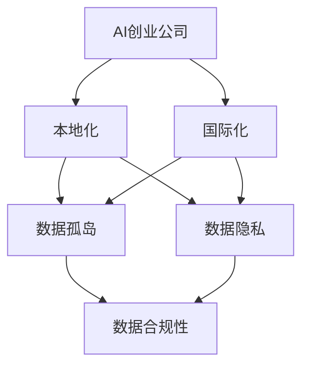

                 

**AI创业公司的国际化挑战**

**作者：禅与计算机程序设计艺术 / Zen and the Art of Computer Programming**

## 1. 背景介绍

随着人工智能（AI）技术的飞速发展，AI创业公司如雨后春笋般涌现。然而，要想成功地将业务拓展到海外市场，这些公司面临着一系列独特的挑战。本文将深入探讨AI创业公司在国际化进程中可能遇到的关键问题，并提供解决方案和最佳实践。

## 2. 核心概念与联系

在讨论AI创业公司的国际化挑战之前，我们需要理解几个核心概念及其联系。下面是这些概念的简要介绍，以及它们在Mermaid流程图中的表示。

### 2.1 关键概念

- **本地化（Localization）**：将产品或服务适应特定地区或国家的语言、文化和习俗。
- **国际化（Internationalization）**：设计产品或服务以便于适应多种语言和文化。
- **数据孤岛（Data Silos）**：由于缺乏统一的数据标准或访问控制，导致数据无法在组织内共享。
- **数据隐私（Data Privacy）**：个人或组织对其数据的控制权和保护。
- **数据合规性（Data Compliance）**：遵循特定地区或国家的数据保护法规和标准。

### 2.2 Mermaid流程图



## 3. 核心算法原理 & 具体操作步骤

### 3.1 算法原理概述

AI创业公司在国际化进程中需要处理大量数据，并应对不同地区的数据隐私法规。因此，它们需要使用分布式计算和联邦学习等技术来保护数据隐私并实现国际化。

### 3.2 算法步骤详解

1. **数据预处理**：收集并预处理来自不同地区的数据，确保数据质量和一致性。
2. **数据分布**：将数据分布到不同的数据节点，每个节点对应一个地区或国家。
3. **模型训练**：在每个数据节点上训练模型，使用联邦学习算法来协调模型参数的更新。
4. **模型评估**：评估模型在每个地区或国家的性能，并进行必要的调整。
5. **本地化**：根据地区或国家的语言、文化和习俗，对产品或服务进行本地化。

### 3.3 算法优缺点

**优点**：

- 保护数据隐私，符合数据合规性要求。
- 利用分布式计算提高模型训练效率。
- 适应多种语言和文化，扩大市场覆盖面。

**缺点**：

- 实现复杂，需要大量的技术投入。
- 模型训练可能受到数据质量和可用性的限制。
- 本地化过程可能需要大量的人力和时间成本。

### 3.4 算法应用领域

AI创业公司在以下领域可以应用上述算法：

- 语言翻译和本地化服务。
- 面向全球的AI驱动的产品或服务。
- 需要遵循严格数据隐私法规的行业，如金融和医疗保健。

## 4. 数学模型和公式 & 详细讲解 & 举例说明

### 4.1 数学模型构建

在国际化进程中，AI创业公司需要构建能够处理分布式数据的数学模型。联邦学习是一种常用的技术，它允许模型在数据节点上训练，而无需共享数据本身。

### 4.2 公式推导过程

假设我们有$n$个数据节点，每个节点$i$有数据集$D_i$。我们想要训练一个模型$f$来最小化损失函数$L(f; D)$，其中$D = \cup_{i=1}^{n} D_i$。联邦学习算法的目标是最小化以下损失函数：

$$L(f; D) = \sum_{i=1}^{n} \frac{|D_i|}{|D|} L(f; D_i)$$

其中$|D_i|$是数据集$D_i$的大小，$|D|$是总数据集$D$的大小。

### 4.3 案例分析与讲解

例如，一家AI创业公司想要在全球范围内提供语言翻译服务。该公司收集了来自不同国家的数据，并将其分布到各自的数据节点。使用联邦学习算法，该公司可以在每个数据节点上训练模型，并协调模型参数的更新，从而保护数据隐私并实现国际化。

## 5. 项目实践：代码实例和详细解释说明

### 5.1 开发环境搭建

要实现上述算法，我们需要一个分布式计算环境。我们可以使用Apache Flink和TensorFlow Federated（TFF）来构建这个环境。

### 5.2 源代码详细实现

以下是使用Apache Flink和TFF实现联邦学习算法的伪代码：

```python
from tensorflow_federated import python as tff

# Define the model and loss function
def model_fn():
    # Define your model architecture here
    pass

def loss_fn(model, data):
    # Define your loss function here
    pass

# Create a federated data structure
federated_data = tff.simulation.datasets.make_cifar10_data()

# Create a federated computation
@tff.tf_computation
def create_train_op(model, data):
    # Define your training operation here
    pass

# Create a federated aggregate process
@tff.federated_computation
def aggregate(model, data):
    # Define your aggregation process here
    pass

# Create a federated process
@tff.federated_process
def train_process(model, data):
    # Define your training process here
    pass

# Run the training process
state = tff.tf_computation(model_fn)()
state, metrics = train_process(state, federated_data)
```

### 5.3 代码解读与分析

上述代码使用TFF定义了模型、损失函数、训练操作和聚合过程。然后，它使用Apache Flink创建了一个分布式计算环境，并运行了训练过程。

### 5.4 运行结果展示

运行上述代码后，我们应该能够看到模型在每个数据节点上的训练过程，以及模型参数的聚合结果。我们可以使用TensorBoard等工具来可视化模型的训练过程和性能。

## 6. 实际应用场景

### 6.1 当前应用

AI创业公司已经开始在国际化进程中应用上述技术。例如，Google使用联邦学习技术在全球范围内收集和处理医疗数据，以改善疾病诊断和治疗。

### 6.2 未来应用展望

随着数据隐私法规的不断严格和全球化趋势的加速，AI创业公司将越来越依赖分布式计算和联邦学习等技术来实现国际化。我们可以期待看到更多的AI创业公司在全球范围内提供本地化的AI驱动产品和服务。

## 7. 工具和资源推荐

### 7.1 学习资源推荐

- TensorFlow Federated：<https://www.tensorflow.org/federated>
- Apache Flink：<https://flink.apache.org/>
- "Federated Learning: Challenges, Methods, and Future Directions"：<https://arxiv.org/abs/2005.08047>

### 7.2 开发工具推荐

- Jupyter Notebook：<https://jupyter.org/>
- PyCharm：<https://www.jetbrains.com/pycharm/>
- TensorBoard：<https://www.tensorflow.org/tensorboard>

### 7.3 相关论文推荐

- "Federated Learning of Deep Networks from Decentralized Data"：<https://arxiv.org/abs/1602.05629>
- "Privacy-Preserving Machine Learning with Differential Privacy"：<https://arxiv.org/abs/1412.6114>

## 8. 总结：未来发展趋势与挑战

### 8.1 研究成果总结

本文讨论了AI创业公司在国际化进程中面临的挑战，并提出了使用分布式计算和联邦学习等技术来保护数据隐私并实现国际化的解决方案。

### 8.2 未来发展趋势

随着数据隐私法规的不断严格和全球化趋势的加速，AI创业公司将越来越依赖分布式计算和联邦学习等技术来实现国际化。我们可以期待看到更多的AI创业公司在全球范围内提供本地化的AI驱动产品和服务。

### 8.3 面临的挑战

AI创业公司在国际化进程中面临的挑战包括数据孤岛、数据隐私和数据合规性等问题。此外，实现分布式计算和联邦学习等技术需要大量的技术投入和人力成本。

### 8.4 研究展望

未来的研究应该关注如何提高分布式计算和联邦学习等技术的效率和可靠性，并探索新的技术来保护数据隐私和实现国际化。

## 9. 附录：常见问题与解答

**Q1：什么是数据孤岛？**

**A1：数据孤岛是指由于缺乏统一的数据标准或访问控制，导致数据无法在组织内共享的现象。**

**Q2：什么是数据隐私？**

**A2：数据隐私是指个人或组织对其数据的控制权和保护。**

**Q3：什么是数据合规性？**

**A3：数据合规性是指遵循特定地区或国家的数据保护法规和标准。**

**Q4：什么是联邦学习？**

**A4：联邦学习是一种分布式机器学习技术，允许模型在数据节点上训练，而无需共享数据本身。**

**Q5：如何实现联邦学习？**

**A5：可以使用Apache Flink和TensorFlow Federated等工具来实现联邦学习。**

## 结束语

AI创业公司在国际化进程中面临着一系列独特的挑战。本文讨论了这些挑战，并提出了使用分布式计算和联邦学习等技术来保护数据隐私并实现国际化的解决方案。我们期待看到AI创业公司在全球范围内提供本地化的AI驱动产品和服务，并为世界各地的用户带来更大的价值。

**作者：禅与计算机程序设计艺术 / Zen and the Art of Computer Programming**

