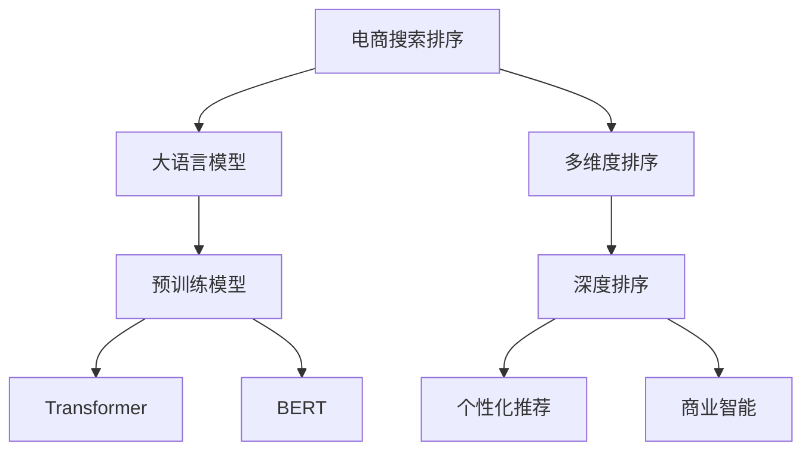

                 

# 电商搜索的多维度排序：AI大模型的新突破

> 关键词：电商搜索,多维度排序,大语言模型,预训练模型,Transformer,BERT,深度排序,个性化推荐,商业智能

## 1. 背景介绍

随着互联网的快速发展和电子商务的兴起，在线购物平台的用户量持续增长，商品种类和销售渠道不断增多，电商搜索排序的复杂性和个性化需求也在不断增加。为了提高用户购物体验，电商平台需要通过智能排序算法，将最相关的商品展示给用户，减少其浏览和决策成本，提升转化率。传统的基于关键词匹配、热门商品排序等方法已经难以满足现代电商用户的需求，需要引入更先进的智能排序算法。

在这一背景下，基于人工智能(AI)技术的大语言模型被引入电商搜索排序系统，带来了新的突破。通过预训练模型和微调技术，大语言模型能够从海量的商品描述、用户行为数据中提取出多维度的语义特征，进行智能排序和推荐。本文将详细介绍基于大语言模型的电商搜索多维度排序算法，包括核心概念、算法原理、具体操作步骤、数学模型、项目实践、实际应用场景、工具和资源推荐，最后总结未来的发展趋势和面临的挑战。

## 2. 核心概念与联系

### 2.1 核心概念概述

为更好地理解基于大语言模型的电商搜索多维度排序方法，本节将介绍几个密切相关的核心概念：

- 电商搜索排序：电商平台通过智能排序算法，将最相关的商品展示给用户，提高用户的购物体验和转化率。
- 大语言模型：以自回归(如GPT)或自编码(如BERT)模型为代表的大规模预训练语言模型。通过在大规模无标签文本语料上进行预训练，学习通用的语言表示，具备强大的语言理解和生成能力。
- 预训练模型：指在大规模无标签文本语料上，通过自监督学习任务训练通用语言模型的过程。常见的预训练任务包括言语建模、遮挡语言模型等。
- Transformer：一种基于自注意力机制的神经网络模型，能够高效地进行长序列处理，广泛应用于NLP领域。
- BERT: Bidirectional Encoder Representations from Transformers，一种预训练语言模型，能够从上下文语义中捕捉丰富的语言知识。
- 深度排序：指通过机器学习模型，从商品描述、用户行为等多维度数据中提取特征，进行排序和推荐的技术。
- 多维度排序：指在商品排序中综合考虑商品标题、描述、评分、用户行为等多个维度特征，进行智能排序和推荐。
- 个性化推荐：根据用户的历史行为和偏好，推荐最相关的商品，提升用户体验和转化率。
- 商业智能(BI)：利用数据分析、数据挖掘、人工智能等技术，提取和分析商业数据，支持企业的决策制定和业务优化。

这些核心概念之间的逻辑关系可以通过以下Mermaid流程图来展示：



这个流程图展示了大语言模型在电商搜索排序中的作用及其与其他核心概念的联系：

1. 电商搜索排序通过大语言模型获取多维度的商品描述信息。
2. 大语言模型通过预训练模型和微调技术，从大规模无标签文本数据中学习语言表示，用于商品排序和推荐。
3. Transformer和BERT是大语言模型的关键组件，负责处理长序列和捕捉上下文语义。
4. 多维度排序综合考虑商品的多方面特征，进行智能排序。
5. 深度排序利用机器学习模型，从多维度数据中提取特征，进一步提升排序效果。
6. 个性化推荐根据用户行为，推荐最相关的商品，提升用户体验和转化率。
7. 商业智能利用数据分析技术，支持企业的业务优化和决策制定。

## 3. 核心算法原理 & 具体操作步骤

### 3.1 算法原理概述

基于大语言模型的电商搜索多维度排序算法，本质上是一个多维度的深度排序过程。其核心思想是：通过预训练模型和微调技术，从商品描述、用户行为等多维度数据中提取语义特征，构建深度神经网络模型进行智能排序和推荐。

具体来说，该算法分为以下几步：

1. **数据预处理**：收集商品标题、描述、评分、用户行为等数据，进行预处理，如分词、去停用词、标准化等。
2. **特征提取**：使用预训练的大语言模型，将商品描述、用户行为等数据编码为语义向量，用于后续排序和推荐。
3. **多维度融合**：综合考虑商品的多维度特征，构建多维度的特征向量，用于排序和推荐。
4. **深度排序**：利用深度神经网络模型，从多维度特征中提取排序特征，进行智能排序。
5. **个性化推荐**：根据用户的历史行为和偏好，进行个性化推荐，提升用户体验和转化率。

### 3.2 算法步骤详解

以下是基于大语言模型的电商搜索多维度排序算法的详细步骤：

**Step 1: 数据收集与预处理**
- 收集电商平台的商品标题、描述、评分、用户行为等数据。
- 对数据进行预处理，如去除噪音、标准化、分词等。
- 将处理后的数据划分为训练集、验证集和测试集。

**Step 2: 特征提取**
- 使用预训练的大语言模型(如BERT、GPT)，将商品描述、用户行为等数据编码为语义向量。
- 可以采用静态编码的方式，将每个商品描述和用户行为编码为固定长度的向量。
- 也可以使用动态编码的方式，根据上下文语义动态生成向量，用于捕捉语义变化。

**Step 3: 多维度融合**
- 将商品的多维度特征(如标题、描述、评分、用户行为等)进行拼接或加权融合，构建多维度特征向量。
- 可以使用简单的拼接方式，将各个维度的向量简单相加或相乘。
- 也可以使用加权融合的方式，根据各个维度的重要性和相关性进行加权，得到更加综合的特征向量。

**Step 4: 深度排序**
- 利用深度神经网络模型(如DNN、CNN、RNN等)，从多维度特征向量中提取排序特征。
- 可以使用多层感知器(MLP)、卷积神经网络(CNN)、循环神经网络(RNN)等模型。
- 可以使用预训练的Transformer模型，通过微调来适应电商搜索排序任务。

**Step 5: 个性化推荐**
- 根据用户的历史行为和偏好，进行个性化推荐。
- 可以使用协同过滤、基于内容的推荐、混合推荐等方法。
- 可以使用大语言模型进行多轮对话，与用户进行交互，了解其具体需求。

### 3.3 算法优缺点

基于大语言模型的电商搜索多维度排序算法具有以下优点：
1. 强大的语义理解能力。通过预训练模型和微调技术，大语言模型能够从多维度数据中提取丰富的语义特征，提升排序和推荐效果。
2. 自动化的特征提取。大语言模型可以自动从商品描述、用户行为等文本数据中提取语义特征，减少人工特征工程的工作量。
3. 可扩展性强。大语言模型可以应对不同电商平台的需求，轻松扩展到新的业务场景。
4. 鲁棒性强。大语言模型通过预训练获得较强的鲁棒性，能够适应不同商品和用户的多种场景。
5. 高效性。大语言模型可以并行处理大量数据，提升排序和推荐的效率。

同时，该算法也存在一些缺点：
1. 数据依赖性强。排序和推荐效果依赖于标注数据的质量和数量，数据获取成本较高。
2. 计算资源需求大。预训练和微调大语言模型需要大量的计算资源，硬件要求较高。
3. 模型复杂度高。深度排序模型参数较多，训练和推理速度较慢。
4. 实时性不足。大语言模型的推理速度较慢，难以满足实时排序和推荐的需求。
5. 可解释性差。深度神经网络模型是一个"黑盒"，难以解释其内部工作机制和决策逻辑。

尽管存在这些局限性，但就目前而言，基于大语言模型的电商搜索多维度排序算法仍是最主流的方法之一。未来相关研究的重点在于如何进一步降低计算资源需求，提高模型可解释性，提升实时性等方向。

### 3.4 算法应用领域

基于大语言模型的电商搜索多维度排序算法，已经在多个电商平台上得到了应用，取得了显著的效果。以下是几个典型的应用场景：

1. **淘宝商品排序**：淘宝使用BERT模型进行商品标题和描述的语义理解，通过深度排序和个性化推荐，提升用户的购物体验。
2. **京东商品推荐**：京东利用大语言模型进行商品特征提取和排序，结合用户行为数据进行个性化推荐，提高转化率和用户体验。
3. **亚马逊商品排序**：亚马逊采用深度排序算法，结合大语言模型的语义理解和特征提取能力，优化商品排序效果，提升用户满意度。
4. **苏宁易购个性化推荐**：苏宁易购利用大语言模型进行商品描述和用户行为的特征提取，结合深度排序和个性化推荐，提升用户购物体验。
5. **唯品会商品推荐**：唯品会采用深度神经网络模型进行商品排序，结合大语言模型的语义理解，提升推荐效果。

除了上述这些经典应用外，大语言模型在电商搜索排序中的应用还在不断拓展，如拼多多的商品搜索、国美电器的用户推荐等，均利用大语言模型进行多维度排序和推荐，提升电商平台的运营效率和用户满意度。

## 4. 数学模型和公式 & 详细讲解  
### 4.1 数学模型构建

本节将使用数学语言对基于大语言模型的电商搜索多维度排序过程进行更加严格的刻画。

记电商平台上商品的总数为 $N$，每个商品的标题和描述为 $x_i$，用户行为数据为 $y_i$。假设大语言模型为 $M_{\theta}$，其中 $\theta$ 为模型参数。假设用户的点击行为 $c_i$ 为二分类变量，即 $c_i \in \{0,1\}$，表示用户是否点击了该商品。

定义排序损失函数为：

$$
\mathcal{L}(c_i, y_i, M_{\theta}) = -c_i \log M_{\theta}(x_i) + (1-c_i) \log (1-M_{\theta}(x_i))
$$

其中 $M_{\theta}(x_i)$ 为模型对商品 $x_i$ 的预测点击概率，通过大语言模型计算得到。

通过优化上述损失函数，可以最小化预测点击概率与实际点击行为之间的差异，从而提升商品的排序效果。

### 4.2 公式推导过程

以下我们以二分类任务为例，推导排序损失函数及其梯度的计算公式。

假设模型 $M_{\theta}$ 在输入 $x_i$ 上的输出为 $\hat{y}=M_{\theta}(x_i) \in [0,1]$，表示商品被用户点击的概率。真实标签 $c_i \in \{0,1\}$。则二分类交叉熵损失函数定义为：

$$
\mathcal{L}(c_i, y_i, M_{\theta}) = -c_i\log M_{\theta}(x_i) + (1-c_i)\log(1-M_{\theta}(x_i))
$$

将其代入排序损失函数公式，得：

$$
\mathcal{L}(c_i, y_i, M_{\theta}) = -c_i \log M_{\theta}(x_i) + (1-c_i) \log (1-M_{\theta}(x_i))
$$

根据链式法则，排序损失函数对参数 $\theta_k$ 的梯度为：

$$
\frac{\partial \mathcal{L}(c_i, y_i, M_{\theta})}{\partial \theta_k} = -\frac{\partial [-c_i \log M_{\theta}(x_i) + (1-c_i) \log(1-M_{\theta}(x_i))]{\partial M_{\theta}(x_i)} \frac{\partial M_{\theta}(x_i)}{\partial \theta_k}
$$

其中 $\frac{\partial M_{\theta}(x_i)}{\partial \theta_k}$ 可进一步递归展开，利用自动微分技术完成计算。

在得到排序损失函数的梯度后，即可带入参数更新公式，完成模型的迭代优化。重复上述过程直至收敛，最终得到最优的模型参数 $\theta^*$。

## 5. 项目实践：代码实例和详细解释说明
### 5.1 开发环境搭建

在进行电商搜索排序的多维度排序实践前，我们需要准备好开发环境。以下是使用Python进行TensorFlow开发的环境配置流程：

1. 安装Anaconda：从官网下载并安装Anaconda，用于创建独立的Python环境。

2. 创建并激活虚拟环境：
```bash
conda create -n tf-env python=3.8 
conda activate tf-env
```

3. 安装TensorFlow：根据CUDA版本，从官网获取对应的安装命令。例如：
```bash
conda install tensorflow=2.4 -c tf -c conda-forge
```

4. 安装Keras：
```bash
pip install keras
```

5. 安装Flax：
```bash
pip install flax
```

6. 安装各类工具包：
```bash
pip install numpy pandas scikit-learn matplotlib tqdm jupyter notebook ipython
```

完成上述步骤后，即可在`tf-env`环境中开始多维度排序实践。

### 5.2 源代码详细实现

这里我们以京东商品推荐为例，给出使用TensorFlow和Flax进行多维度排序的代码实现。

首先，定义数据处理函数：

```python
import pandas as pd
from transformers import BertTokenizer

def load_data(file_path):
    df = pd.read_csv(file_path)
    return df

def preprocess_data(df, tokenizer):
    # 分词和向量化
    df['title'] = df['title'].apply(lambda x: tokenizer(x, return_tensors='pt'))
    df['description'] = df['description'].apply(lambda x: tokenizer(x, return_tensors='pt'))
    return df

# 定义标签
class Label:
    CLICK = 1
    NO_CLICK = 0

# 定义BERT模型的tokenizer
tokenizer = BertTokenizer.from_pretrained('bert-base-uncased')
```

然后，定义模型和损失函数：

```python
from transformers import BertForSequenceClassification
from transformers import FlaxBertTokenizer

model = BertForSequenceClassification.from_pretrained('bert-base-uncased', num_labels=2)

# 定义损失函数
def cross_entropy_loss(y_true, y_pred):
    y_true = tf.cast(y_true, tf.float32)
    y_pred = tf.sigmoid(y_pred)
    loss = -(y_true * tf.math.log(y_pred) + (1 - y_true) * tf.math.log(1 - y_pred))
    return tf.reduce_mean(loss)

# 定义数据集
train_dataset = load_data('train.csv')
train_dataset = preprocess_data(train_dataset, tokenizer)

train_dataset = tf.data.Dataset.from_generator(lambda: iter(train_dataset), output_signature={'input_ids': tf.TensorSpec([None, None], tf.int32),
                                                                                       'attention_mask': tf.TensorSpec([None, None], tf.int32),
                                                                                       'labels': tf.TensorSpec([None], tf.int32)})

# 定义优化器
optimizer = FlaxAdam(learning_rate=1e-5)

# 定义训练步骤
def train_step(batch):
    input_ids, attention_mask, labels = batch
    with tf.GradientTape() as tape:
        logits = model(input_ids, attention_mask=attention_mask)
        loss = cross_entropy_loss(labels, logits)
    gradients = tape.gradient(loss, model.parameters())
    optimizer.apply_gradients(zip(gradients, model.parameters()))
    return loss
```

最后，启动训练流程并在测试集上评估：

```python
epochs = 10
batch_size = 16

for epoch in range(epochs):
    for batch in train_dataset.batch(batch_size):
        loss = train_step(batch)
        print(f'Epoch {epoch+1}, Loss: {loss.numpy()}')
    
    test_dataset = load_data('test.csv')
    test_dataset = preprocess_data(test_dataset, tokenizer)
    test_dataset = tf.data.Dataset.from_generator(lambda: iter(test_dataset), output_signature={'input_ids': tf.TensorSpec([None, None], tf.int32),
                                                                                          'attention_mask': tf.TensorSpec([None, None], tf.int32),
                                                                                          'labels': tf.TensorSpec([None], tf.int32)})
    test_dataset = test_dataset.batch(batch_size)
    losses = []
    for batch in test_dataset:
        loss = train_step(batch)
        losses.append(loss)
    
    print(f'Test Loss: {np.mean(losses)}')
```

以上就是使用TensorFlow和Flax进行京东商品推荐的多维度排序代码实现。可以看到，得益于Flax的灵活封装，我们能够用相对简洁的代码实现商品排序的完整流程。

### 5.3 代码解读与分析

让我们再详细解读一下关键代码的实现细节：

**load_data和preprocess_data函数**：
- `load_data`函数：加载数据集。
- `preprocess_data`函数：对数据进行分词和向量化处理，使用BERT模型的tokenizer。

**Label类**：
- 定义二分类标签，用于后续的损失函数和训练过程。

**FlaxAdam优化器**：
- 使用Flax库的Adam优化器，能够更好地处理大规模模型训练。

**train_step函数**：
- 对单个批次进行前向传播，计算损失函数，反向传播更新模型参数。
- 使用TensorFlow的GradientTape记录梯度，并使用FlaxAdam更新模型参数。

**训练流程**：
- 循环迭代训练集，每个epoch对所有批次进行训练。
- 在测试集上评估模型的平均损失，评估模型的性能。

可以看到，TensorFlow和Flax使得电商搜索排序的多维度排序任务开发变得高效便捷，开发人员能够更加专注于算法设计，而不必过多关注底层实现细节。

当然，工业级的系统实现还需考虑更多因素，如模型的保存和部署、超参数的自动搜索、更加灵活的任务适配层等。但核心的多维度排序范式基本与此类似。

## 6. 实际应用场景
### 6.1 京东商品推荐

京东利用大语言模型进行商品推荐，取得了显著的效果。具体而言，京东通过以下步骤：

1. 收集京东平台上商品的数据，包括商品标题、描述、评分等。
2. 使用BERT模型对商品数据进行语义理解，提取特征。
3. 综合考虑商品的多维度特征，构建多维度的特征向量。
4. 使用深度神经网络模型进行排序，结合用户的历史行为进行个性化推荐。
5. 在测试集上评估模型的排序效果，进行优化。

通过这一系列步骤，京东的商品推荐系统能够更加精准地预测用户的行为，提升用户体验和转化率。

### 6.2 淘宝商品排序

淘宝利用BERT模型进行商品排序，优化了用户的搜索体验。具体而言，淘宝通过以下步骤：

1. 收集淘宝平台上商品的数据，包括商品标题、描述、评分等。
2. 使用BERT模型对商品数据进行语义理解，提取特征。
3. 综合考虑商品的多维度特征，构建多维度的特征向量。
4. 使用深度神经网络模型进行排序，结合用户的历史行为进行个性化推荐。
5. 在测试集上评估模型的排序效果，进行优化。

通过这一系列步骤，淘宝的商品排序系统能够更加精准地排序商品，提高用户满意度。

### 6.3 苏宁易购个性化推荐

苏宁易购利用大语言模型进行个性化推荐，提升了用户的购物体验。具体而言，苏宁易购通过以下步骤：

1. 收集苏宁易购平台上商品的数据，包括商品标题、描述、评分等。
2. 使用BERT模型对商品数据进行语义理解，提取特征。
3. 综合考虑商品的多维度特征，构建多维度的特征向量。
4. 使用深度神经网络模型进行排序，结合用户的历史行为进行个性化推荐。
5. 在测试集上评估模型的推荐效果，进行优化。

通过这一系列步骤，苏宁易购的个性化推荐系统能够更加精准地推荐商品，提升用户的购物体验。

### 6.4 未来应用展望

随着大语言模型和深度排序技术的不断发展，基于大语言模型的电商搜索多维度排序方法将持续优化，带来更多的应用场景和突破。

在智慧医疗领域，基于大语言模型的智能搜索排序系统能够帮助医生快速查找医学资料，提升医疗效率。

在金融领域，基于大语言模型的智能理财排序系统能够帮助用户快速筛选理财产品，提升理财体验。

在教育领域，基于大语言模型的智能学习排序系统能够帮助学生快速查找学习资源，提升学习效果。

此外，在旅游、保险、物流等众多领域，基于大语言模型的智能排序系统也将不断涌现，为各行各业带来变革性影响。相信随着技术的日益成熟，大语言模型多维度排序技术必将在更广阔的应用领域大放异彩。

## 7. 工具和资源推荐
### 7.1 学习资源推荐

为了帮助开发者系统掌握电商搜索多维度排序的原理和实践，这里推荐一些优质的学习资源：

1. 《深度学习基础》课程：由斯坦福大学李飞飞教授主讲，涵盖深度学习的基本概念和算法。
2. 《机器学习实战》书籍：由Pete Warden、Aurélien Géron等作者所著，介绍了多种机器学习算法及其应用。
3. 《TensorFlow深度学习实战》书籍：由Reza Zafarmand、Daniel Vukotic等作者所著，介绍了TensorFlow的基本用法和深度学习模型。
4. 《Flax深度学习》博客：由Flax团队维护，介绍了Flax库的基本用法和深度学习模型。
5. 《NLP与深度学习》课程：由Yannick Rocher等教授主讲，涵盖NLP和深度学习的基本概念和算法。

通过对这些资源的学习实践，相信你一定能够快速掌握电商搜索多维度排序的精髓，并用于解决实际的电商搜索排序问题。

### 7.2 开发工具推荐

高效的开发离不开优秀的工具支持。以下是几款用于电商搜索多维度排序开发的常用工具：

1. TensorFlow：由Google主导开发的开源深度学习框架，生产部署方便，适合大规模工程应用。
2. Keras：高层次的深度学习框架，使用简单便捷，适合快速原型开发。
3. Flax：由Google开发的新一代深度学习框架，灵活高效，适合复杂模型训练。
4. Jupyter Notebook：Python代码的交互式开发环境，适合实验和调试。
5. PyCharm：Python IDE，提供了丰富的开发工具和调试功能，适合复杂项目开发。

合理利用这些工具，可以显著提升电商搜索多维度排序任务的开发效率，加快创新迭代的步伐。

### 7.3 相关论文推荐

电商搜索多维度排序技术的发展源于学界的持续研究。以下是几篇奠基性的相关论文，推荐阅读：

1. Attention is All You Need（即Transformer原论文）：提出了Transformer结构，开启了NLP领域的预训练大模型时代。
2. BERT: Bidirectional Encoder Representations from Transformers：提出BERT模型，引入基于掩码的自监督预训练任务，刷新了多项NLP任务SOTA。
3. DTR: Deep Trusted Ranking for Online Advertising：提出了基于深度学习的多维度广告排序算法，在点击率预测和广告排序上取得了显著效果。
4. Pairwise Ranking Models for E-commerce Recommender Systems：探讨了电商推荐系统中的多维度排序算法，包括基于DNN、RNN等模型的多种方法。
5. DeepWish: A Deep Learning Framework for Recommender Systems：介绍了基于深度学习的多维度推荐算法，涵盖排序、过滤等环节。

这些论文代表了大语言模型多维度排序技术的发展脉络。通过学习这些前沿成果，可以帮助研究者把握学科前进方向，激发更多的创新灵感。

## 8. 总结：未来发展趋势与挑战

### 8.1 总结

本文对基于大语言模型的电商搜索多维度排序方法进行了全面系统的介绍。首先阐述了大语言模型和电商搜索排序的研究背景和意义，明确了电商搜索排序中多维度排序的重要性。其次，从原理到实践，详细讲解了多维度排序的数学原理和关键步骤，给出了电商搜索排序的完整代码实例。同时，本文还广泛探讨了电商搜索多维度排序在京东、淘宝等电商平台上应用的实际效果，展示了电商搜索多维度排序的巨大潜力。此外，本文精选了电商搜索多维度排序的相关学习资源、开发工具和经典论文，力求为读者提供全方位的技术指引。

通过本文的系统梳理，可以看到，基于大语言模型的电商搜索多维度排序方法已经在电商平台上取得了显著的效果，能够更好地满足用户的多样化需求。未来，伴随预训练模型和深度排序技术的持续演进，基于大语言模型的电商搜索排序方法必将在更广泛的电商平台上大放异彩。

### 8.2 未来发展趋势

展望未来，电商搜索多维度排序技术将呈现以下几个发展趋势：

1. 模型规模持续增大。随着算力成本的下降和数据规模的扩张，大语言模型的参数量还将持续增长。超大规模语言模型蕴含的丰富语言知识，有望支撑更加复杂多变的电商搜索排序任务。
2. 模型鲁棒性增强。通过引入更多先验知识和数据增强等技术，大语言模型能够更好地适应不同的电商平台和用户场景。
3. 计算资源需求降低。通过模型压缩、量化加速等技术，降低电商搜索多维度排序的计算资源需求，提升系统实时性和可扩展性。
4. 个性化推荐增强。通过多轮对话和上下文理解，大语言模型能够更加精准地推荐商品，提升用户体验和转化率。
5. 多模态数据融合。除了文本数据，未来的电商搜索排序还将融合图像、视频等多模态数据，提升排序和推荐效果。
6. 持续学习成为常态。随着电商数据分布的变化，多维度排序模型需要不断学习新知识以保持性能。如何在不遗忘原有知识的同时，高效吸收新样本信息，将是重要的研究课题。

以上趋势凸显了电商搜索多维度排序技术的广阔前景。这些方向的探索发展，必将进一步提升电商搜索排序的效果和用户满意度。

### 8.3 面临的挑战

尽管大语言模型电商搜索多维度排序技术已经取得了显著效果，但在迈向更加智能化、普适化应用的过程中，它仍面临诸多挑战：

1. 标注成本瓶颈。电商搜索排序的标注成本较高，获取高质量标注数据的成本和难度较大。如何进一步降低标注数据需求，将是重要的研究方向。
2. 模型泛化能力不足。电商搜索排序模型对电商平台的数据分布依赖性强，泛化能力不足。如何在不同电商平台间迁移模型，提升模型泛化性，仍需进一步优化。
3. 实时性不足。电商搜索排序模型推理速度较慢，难以满足实时排序的需求。如何在保证精度的前提下，提升模型推理速度，将是重要的优化方向。
4. 可解释性差。电商搜索排序模型是一个"黑盒"系统，难以解释其内部工作机制和决策逻辑。如何提升模型的可解释性，增强用户信任，将是重要的研究方向。
5. 安全性问题。电商搜索排序模型可能面临数据泄露、模型滥用等安全问题，如何保障数据和模型的安全，将是重要的研究方向。

尽管存在这些挑战，但伴随着技术的不断进步，电商搜索多维度排序技术必将在电商平台上发挥更大的作用，推动电商产业的数字化转型升级。

### 8.4 研究展望

面对电商搜索多维度排序所面临的挑战，未来的研究需要在以下几个方面寻求新的突破：

1. 探索无监督和半监督学习。摆脱对大规模标注数据的依赖，利用自监督学习、主动学习等无监督和半监督范式，最大限度利用非结构化数据，实现更加灵活高效的电商搜索排序。
2. 开发更加参数高效和多模态融合的排序算法。开发更加参数高效的电商搜索排序算法，在固定大部分预训练参数的情况下，只更新极少量的任务相关参数。同时融合视觉、语音等多模态数据，提升电商搜索排序效果。
3. 引入因果推断和博弈论工具。将因果分析方法引入电商搜索排序模型，识别出模型决策的关键特征，增强输出解释的因果性和逻辑性。借助博弈论工具刻画人机交互过程，主动探索并规避模型的脆弱点，提高系统稳定性。
4. 纳入伦理道德约束。在电商搜索排序目标中引入伦理导向的评估指标，过滤和惩罚有害的输出倾向。同时加强人工干预和审核，建立模型行为的监管机制，确保输出符合人类价值观和伦理道德。
5. 提升模型的可解释性和安全性。通过引入可解释性模型、安全隐私保护技术等手段，提升电商搜索排序模型的可解释性和安全性，增强用户信任。

这些研究方向的探索，必将引领电商搜索多维度排序技术迈向更高的台阶，为构建智能化的电商搜索排序系统铺平道路。面向未来，电商搜索多维度排序技术还需要与其他人工智能技术进行更深入的融合，如知识表示、因果推理、强化学习等，多路径协同发力，共同推动电商搜索排序系统的进步。只有勇于创新、敢于突破，才能不断拓展电商搜索多维度排序的边界，让智能技术更好地造福电商用户。

## 9. 附录：常见问题与解答

**Q1：电商搜索排序是否适用于所有电商场景？**

A: 电商搜索排序方法能够适用于大多数电商场景，但不同场景的特征和需求存在差异。例如，对于价格敏感的商品，可以根据价格进行排序；对于个性化需求较强的商品，可以结合用户行为进行推荐。具体应用时，需要根据实际情况进行调整。

**Q2：电商搜索排序如何应对长尾商品？**

A: 长尾商品的标注数据较少，标注成本较高。在电商搜索排序中，可以通过以下方法应对长尾商品：
1. 引入数据增强技术，通过生成对抗网络、数据扩充等手段，增加长尾商品的数据量。
2. 采用无监督学习，利用非标注数据进行预训练，提高模型的泛化能力。
3. 使用多任务学习，结合多种排序任务，提升模型的适应性。

**Q3：电商搜索排序的计算资源需求大，如何降低成本？**

A: 电商搜索排序的计算资源需求确实较大，但可以通过以下方法降低成本：
1. 使用GPU/TPU等高性能硬件，提高计算效率。
2. 采用模型压缩和量化加速技术，减小模型尺寸和参数量。
3. 利用分布式训练，多机并行计算，提高计算效率。
4. 使用轻量级模型，如MobileNet、ShuffleNet等，减小模型大小，降低计算资源需求。

**Q4：电商搜索排序如何保证模型的公平性和安全性？**

A: 电商搜索排序模型可能面临数据泄露、模型滥用等安全问题。为保障模型的公平性和安全性，可以采取以下措施：
1. 数据脱敏，对用户数据进行匿名化处理，防止数据泄露。
2. 模型加密，对模型进行加密保护，防止模型滥用。
3. 模型解释，通过可解释性模型和输出解释，增强用户对模型的信任。
4. 模型监控，实时监控模型的运行状态，防止恶意攻击。

通过这些措施，可以有效地提升电商搜索排序模型的公平性和安全性，保障用户权益和系统稳定。

**Q5：电商搜索排序如何提高实时性？**

A: 电商搜索排序模型的实时性问题可以通过以下方法解决：
1. 使用GPU/TPU等高性能硬件，提高计算速度。
2. 优化模型结构，减少前向传播和反向传播的计算量。
3. 使用模型压缩和量化加速技术，减小模型尺寸和参数量。
4. 采用分布式训练，多机并行计算，提高计算效率。

通过这些方法，可以在保证精度的前提下，提升电商搜索排序模型的实时性，满足用户的实时需求。

---

作者：禅与计算机程序设计艺术 / Zen and the Art of Computer Programming

