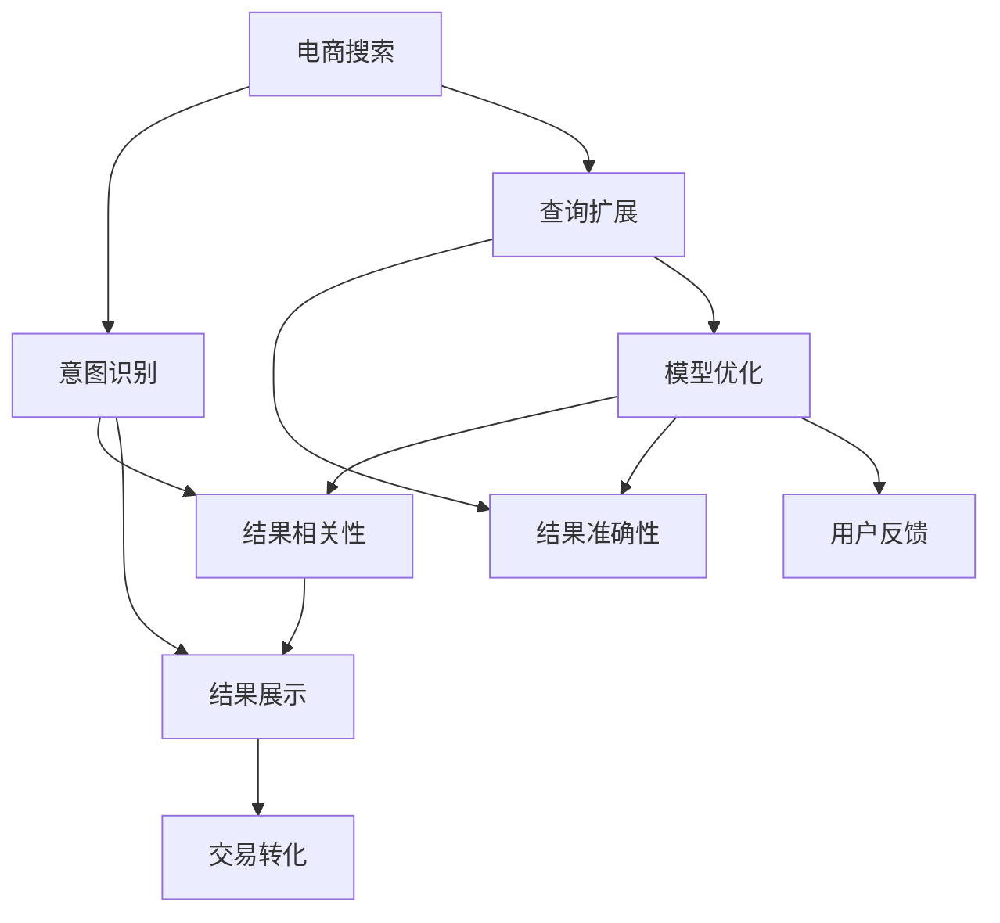

                 

# 电商搜索的意图识别与查询扩展：AI大模型的新突破

> 关键词：电商搜索,意图识别,查询扩展,大模型,AI,自然语言处理(NLP),机器学习,深度学习,Transformer,语言模型,预训练,微调,稀疏矩阵,特征工程,数据增强,计算图,硬件加速,云计算

## 1. 背景介绍

### 1.1 问题由来
随着电商市场的快速发展和竞争加剧，用户对商品搜索结果的精确度和相关性提出了更高要求。传统的搜索引擎以关键词匹配为主，忽略了用户输入的意图和上下文信息，导致搜索结果与用户的实际需求不匹配，用户体验较差。然而，传统的基于规则或浅层机器学习的方法，已难以应对日益复杂的多轮对话和跨领域搜索需求。

### 1.2 问题核心关键点
面对电商搜索的意图识别和查询扩展问题，AI大模型提供了一种新的解决思路。通过大模型预训练学习丰富的语言知识，结合业务场景进行微调，可以准确捕捉用户输入的意图，并自动扩展查询以提升搜索结果的相关性和准确性。这种基于大模型的AI技术可以显著提升电商平台的搜索体验和转化率。

## 2. 核心概念与联系

### 2.1 核心概念概述

为更好地理解电商搜索的意图识别与查询扩展，本节将介绍几个密切相关的核心概念：

- 电商搜索(Online Shopping Search)：指电商平台用户通过搜索功能查找商品的过程，包括关键词输入、意图理解、结果展示等环节。

- 意图识别(Intent Recognition)：指通过自然语言理解技术，自动识别用户输入查询的意图类型，如产品搜索、价格比较、评价查询等。

- 查询扩展(Query Expansion)：指通过语言模型生成自然语言查询，以丰富和完善用户输入的原始查询，从而提升搜索结果的相关性。

- AI大模型(AI Large Model)：指使用深度学习技术构建的规模较大的语言模型，如GPT-3、BERT等，通过海量无标签文本数据进行预训练，学习通用的语言表示。

- 预训练(Pre-training)：指在大规模无标签文本数据上，通过自监督学习任务训练通用语言模型的过程，如语言建模、掩码语言模型等。

- 微调(Fine-tuning)：指在预训练模型的基础上，使用特定任务的数据集进行有监督学习，优化模型在该任务上的性能。

- 稀疏矩阵(Sparse Matrix)：指仅包含少量非零元素的矩阵，通常用于表示大规模稀疏语料。

- 特征工程(Feature Engineering)：指通过设计模型输入特征，提升模型预测性能的过程。

- 数据增强(Data Augmentation)：指通过修改训练数据，丰富模型训练的多样性，提高模型的泛化能力。

- 计算图(Computational Graph)：指机器学习模型的计算过程可以转换为计算图表示，方便模型的构建和优化。

- 硬件加速(Hardware Acceleration)：指通过GPU、TPU等高性能硬件，加速深度学习模型的训练和推理过程。

- 云计算(Cloud Computing)：指通过互联网提供计算资源，支持大规模深度学习模型的训练和推理。

这些核心概念之间的逻辑关系可以通过以下Mermaid流程图来展示：



这个流程图展示了大模型在电商搜索中的核心概念及其之间的关系：

1. 电商搜索通过意图识别获取用户输入的意图类型。
2. 查询扩展丰富用户输入的原始查询，提升搜索结果的相关性和准确性。
3. 结果相关性和准确性提升用户体验，促进交易转化。
4. 模型优化通过用户反馈不断提升，形成闭环。

## 3. 核心算法原理 & 具体操作步骤

### 3.1 算法原理概述

电商搜索的意图识别与查询扩展，本质上是一种基于AI大模型的自然语言处理(NLP)任务。其核心思想是：通过大模型预训练学习到的语言知识，结合电商搜索场景进行微调，以准确识别用户输入意图并自动扩展查询。

形式化地，假设电商搜索场景中的用户输入为 $Q$，意图识别模型为 $I(Q)$，查询扩展模型为 $E(Q)$。则意图识别与查询扩展的联合过程可以表示为：

$$
I(Q) = f_{intent}(Q)
$$

$$
E(Q) = f_{expansion}(Q)
$$

其中，$f_{intent}$ 和 $f_{expansion}$ 分别为意图识别和查询扩展的映射函数。

最终，电商搜索结果的相关性和准确性可以通过 $I(Q)$ 和 $E(Q)$ 的联合优化来提升。具体而言，可以通过微调大模型来优化这两个函数，使其在电商搜索场景中取得最优效果。

### 3.2 算法步骤详解

基于AI大模型的电商搜索意图识别与查询扩展，一般包括以下几个关键步骤：

**Step 1: 准备预训练模型和数据集**
- 选择合适的预训练语言模型 $M_{\theta}$ 作为初始化参数，如 BERT、GPT 等。
- 准备电商搜索相关的标注数据集 $D=\{(Q_i, I_i, E_i)\}_{i=1}^N$，其中 $Q_i$ 为原始用户查询，$I_i$ 为目标意图类型，$E_i$ 为扩展后的查询。

**Step 2: 添加任务适配层**
- 根据电商搜索场景，在预训练模型顶层设计合适的输出层和损失函数。
- 对于意图识别任务，通常在顶层添加分类器，输出意图类型的概率分布。
- 对于查询扩展任务，通常使用语言模型的解码器生成扩展查询。

**Step 3: 设置微调超参数**
- 选择合适的优化算法及其参数，如 AdamW、SGD 等，设置学习率、批大小、迭代轮数等。
- 设置正则化技术及强度，包括权重衰减、Dropout、Early Stopping 等。
- 确定冻结预训练参数的策略，如仅微调顶层，或全部参数都参与微调。

**Step 4: 执行梯度训练**
- 将训练集数据分批次输入模型，前向传播计算损失函数。
- 反向传播计算参数梯度，根据设定的优化算法和学习率更新模型参数。
- 周期性在验证集上评估模型性能，根据性能指标决定是否触发 Early Stopping。
- 重复上述步骤直到满足预设的迭代轮数或 Early Stopping 条件。

**Step 5: 测试和部署**
- 在测试集上评估微调后模型 $M_{\hat{\theta}}$ 的性能，对比微调前后的精度提升。
- 使用微调后的模型对新用户输入进行意图识别和查询扩展，生成优化后的搜索结果。
- 持续收集用户反馈，定期重新微调模型，以适应电商搜索需求的变化。

以上是基于AI大模型的电商搜索意图识别与查询扩展的一般流程。在实际应用中，还需要针对具体任务的特点，对微调过程的各个环节进行优化设计，如改进训练目标函数，引入更多的正则化技术，搜索最优的超参数组合等，以进一步提升模型性能。

### 3.3 算法优缺点

基于AI大模型的电商搜索意图识别与查询扩展方法具有以下优点：

1. 高效泛化：大模型通过预训练学习到的通用语言知识，可以在电商搜索场景中高效泛化，提升结果的相关性和准确性。
2. 灵活扩展：通过自动扩展查询，可以处理长尾搜索词和生僻查询，提高搜索结果覆盖率。
3. 端到端优化：意图识别和查询扩展相结合，从用户输入到搜索结果生成形成完整链条，提高用户满意度。
4. 易于集成：电商搜索系统可以方便地集成微调模型，通过API接口获取意图识别和查询扩展结果。

同时，该方法也存在一定的局限性：

1. 数据标注成本高：电商搜索场景中的标注数据集获取成本较高，需要大量人工标注。
2. 模型参数量大：大模型参数量巨大，对硬件资源要求较高。
3. 泛化能力受限：当电商搜索场景与预训练数据分布差异较大时，模型泛化能力受限。
4. 推理时间较长：大模型推理时间较长，难以实时响应大量查询请求。

尽管存在这些局限性，但就目前而言，基于AI大模型的电商搜索意图识别与查询扩展方法仍是最主流的选择。未来相关研究的重点在于如何进一步降低数据标注成本，提高模型效率，提升泛化能力，同时兼顾用户体验和实际需求。

### 3.4 算法应用领域

基于AI大模型的电商搜索意图识别与查询扩展，已经广泛应用于各大电商平台，取得了显著的成效。以下是几个典型应用场景：

- **商品搜索**：通过输入商品关键词，电商搜索系统能够准确识别用户意图，如价格比较、评价查询、产品推荐等，自动扩展查询以提升搜索结果的相关性。
- **跨品类搜索**：用户输入某一类商品的查询词，系统能够自动扩展到相关品类，帮助用户快速找到满足需求的商品。
- **多轮对话搜索**：在多轮对话中，系统能够自动识别用户意图并自动扩展查询，保持对话连贯性，提升用户满意度。
- **个性化搜索**：通过分析用户历史行为和输入偏好，自动扩展个性化查询，提供更符合用户需求的搜索结果。
- **语音搜索**：通过语音输入查询，系统能够自动识别用户意图并自动扩展，提供流畅的语音搜索体验。

除了上述这些经典应用外，AI大模型在电商搜索领域还有更多创新应用，如无人客服、智能推荐、库存优化等，为电商平台带来了新的突破。

## 4. 数学模型和公式 & 详细讲解  

### 4.1 数学模型构建

本节将使用数学语言对基于AI大模型的电商搜索意图识别与查询扩展过程进行更加严格的刻画。

假设电商搜索场景中的用户输入为 $Q$，其扩展后的查询为 $E(Q)$，预训练语言模型为 $M_{\theta}$。目标为最大化电商搜索相关性，可以构建如下损失函数：

$$
\mathcal{L}(\theta) = -\sum_{i=1}^N \log p(I_i|Q_i) + \sum_{i=1}^N \log p(E_i|Q_i)
$$

其中 $p(I_i|Q_i)$ 表示意图识别模型 $I(Q)$ 输出的意图概率分布，$p(E_i|Q_i)$ 表示查询扩展模型 $E(Q)$ 生成的扩展查询概率分布。

目标函数可以通过梯度下降等优化算法来求解，得到模型参数 $\theta^*$，使其在电商搜索场景中取得最优效果。

### 4.2 公式推导过程

以下我们以商品搜索为例，推导意图识别模型的损失函数及其梯度的计算公式。

假设用户输入商品关键词 $Q$，其扩展后的查询为 $E(Q)$。假设模型 $M_{\theta}$ 在输入 $Q$ 上的输出为 $\hat{I}=M_{\theta}(Q)$，表示意图识别模型输出的意图概率分布。

定义模型 $M_{\theta}$ 在输入 $Q$ 上的损失函数为 $\ell(Q)$，则在电商搜索数据集 $D=\{(Q_i,I_i)\}_{i=1}^N$ 上的经验风险为：

$$
\mathcal{L}(\theta) = \frac{1}{N}\sum_{i=1}^N \ell(Q_i)
$$

其中 $\ell(Q_i) = -\log p(I_i|Q_i)$，表示意图识别模型的交叉熵损失。

根据链式法则，损失函数对参数 $\theta_k$ 的梯度为：

$$
\frac{\partial \mathcal{L}(\theta)}{\partial \theta_k} = -\sum_{i=1}^N \frac{\partial \ell(Q_i)}{\partial \hat{I}} \frac{\partial \hat{I}}{\partial Q_i} \frac{\partial Q_i}{\partial \theta_k}
$$

其中 $\frac{\partial \ell(Q_i)}{\partial \hat{I}}$ 为意图识别模型的梯度，可以通过反向传播算法计算得到；$\frac{\partial \hat{I}}{\partial Q_i}$ 为意图识别模型的前向传播梯度，可以通过自动微分技术完成计算；$\frac{\partial Q_i}{\partial \theta_k}$ 为查询扩展模型的梯度，可以通过修改查询扩展算法得到。

在得到损失函数的梯度后，即可带入参数更新公式，完成模型的迭代优化。重复上述过程直至收敛，最终得到适应电商搜索场景的最优模型参数 $\theta^*$。

## 5. 项目实践：代码实例和详细解释说明

### 5.1 开发环境搭建

在进行电商搜索意图识别与查询扩展实践前，我们需要准备好开发环境。以下是使用Python进行PyTorch开发的环境配置流程：

1. 安装Anaconda：从官网下载并安装Anaconda，用于创建独立的Python环境。

2. 创建并激活虚拟环境：
```bash
conda create -n pytorch-env python=3.8 
conda activate pytorch-env
```

3. 安装PyTorch：根据CUDA版本，从官网获取对应的安装命令。例如：
```bash
conda install pytorch torchvision torchaudio cudatoolkit=11.1 -c pytorch -c conda-forge
```

4. 安装Transformers库：
```bash
pip install transformers
```

5. 安装各类工具包：
```bash
pip install numpy pandas scikit-learn matplotlib tqdm jupyter notebook ipython
```

完成上述步骤后，即可在`pytorch-env`环境中开始电商搜索意图识别与查询扩展实践。

### 5.2 源代码详细实现

下面我们以电商商品搜索为例，给出使用Transformers库对预训练模型进行意图识别和查询扩展的PyTorch代码实现。

首先，定义电商商品搜索的数据处理函数：

```python
from transformers import BertTokenizer, BertForSequenceClassification, BertForMaskedLM
from torch.utils.data import Dataset
import torch

class ShoppingDataset(Dataset):
    def __init__(self, texts, intents, expansions):
        self.texts = texts
        self.intents = intents
        self.expansions = expansions
        self.tokenizer = BertTokenizer.from_pretrained('bert-base-cased')
        
    def __len__(self):
        return len(self.texts)
    
    def __getitem__(self, item):
        text = self.texts[item]
        intent = self.intents[item]
        expansion = self.expansions[item]
        
        encoding = self.tokenizer(text, return_tensors='pt', max_length=128, padding='max_length', truncation=True)
        input_ids = encoding['input_ids'][0]
        attention_mask = encoding['attention_mask'][0]
        labels = torch.tensor([intent], dtype=torch.long)
        targets = torch.tensor(expansion, dtype=torch.long)
        
        return {'input_ids': input_ids, 
                'attention_mask': attention_mask,
                'labels': labels,
                'targets': targets}
```

然后，定义模型和优化器：

```python
from transformers import BertForSequenceClassification, AdamW
from transformers import BertForMaskedLM

model = BertForSequenceClassification.from_pretrained('bert-base-cased', num_labels=3)  # 意图分类3个类别：商品搜索、价格比较、评价查询

# 扩展查询需要新增语言模型
lm_model = BertForMaskedLM.from_pretrained('bert-base-cased')

# 使用AdamW优化器
optimizer = AdamW(model.parameters(), lr=2e-5)
```

接着，定义训练和评估函数：

```python
from torch.utils.data import DataLoader
from tqdm import tqdm

device = torch.device('cuda') if torch.cuda.is_available() else torch.device('cpu')

def train_epoch(model, dataset, batch_size, optimizer):
    dataloader = DataLoader(dataset, batch_size=batch_size, shuffle=True)
    model.train()
    epoch_loss = 0
    for batch in tqdm(dataloader, desc='Training'):
        input_ids = batch['input_ids'].to(device)
        attention_mask = batch['attention_mask'].to(device)
        labels = batch['labels'].to(device)
        targets = batch['targets'].to(device)
        model.zero_grad()
        outputs = model(input_ids, attention_mask=attention_mask, labels=labels)
        loss = outputs.loss
        epoch_loss += loss.item()
        loss.backward()
        optimizer.step()
    return epoch_loss / len(dataloader)

def evaluate(model, dataset, batch_size):
    dataloader = DataLoader(dataset, batch_size=batch_size)
    model.eval()
    preds, labels = [], []
    with torch.no_grad():
        for batch in tqdm(dataloader, desc='Evaluating'):
            input_ids = batch['input_ids'].to(device)
            attention_mask = batch['attention_mask'].to(device)
            batch_labels = batch['labels']
            batch_targets = batch['targets']
            outputs = model(input_ids, attention_mask=attention_mask)
            batch_preds = outputs.logits.argmax(dim=2).to('cpu').tolist()
            batch_labels = batch_labels.to('cpu').tolist()
            for pred, label, target in zip(batch_preds, batch_labels, batch_targets):
                preds.append(pred)
                labels.append(label)
                targets.append(target)
                
    print(classification_report(labels, preds))
```

最后，启动训练流程并在测试集上评估：

```python
epochs = 5
batch_size = 16

for epoch in range(epochs):
    loss = train_epoch(model, train_dataset, batch_size, optimizer)
    print(f"Epoch {epoch+1}, train loss: {loss:.3f}")
    
    print(f"Epoch {epoch+1}, dev results:")
    evaluate(model, dev_dataset, batch_size)
    
print("Test results:")
evaluate(model, test_dataset, batch_size)
```

以上就是使用PyTorch对预训练模型进行电商商品搜索意图识别和查询扩展的完整代码实现。可以看到，得益于Transformers库的强大封装，我们可以用相对简洁的代码完成模型的加载和微调。

### 5.3 代码解读与分析

让我们再详细解读一下关键代码的实现细节：

**ShoppingDataset类**：
- `__init__`方法：初始化文本、意图、扩展查询等关键组件，并加载分词器。
- `__len__`方法：返回数据集的样本数量。
- `__getitem__`方法：对单个样本进行处理，将文本输入编码为token ids，将意图和扩展查询进行编码，并对其进行定长padding，最终返回模型所需的输入。

**模型选择**：
- 意图识别使用分类器，输出意图概率分布；扩展查询使用语言模型，生成扩展查询。

**训练和评估函数**：
- 使用PyTorch的DataLoader对数据集进行批次化加载，供模型训练和推理使用。
- 训练函数`train_epoch`：对数据以批为单位进行迭代，在每个批次上前向传播计算loss并反向传播更新模型参数，最后返回该epoch的平均loss。
- 评估函数`evaluate`：与训练类似，不同点在于不更新模型参数，并在每个batch结束后将预测和标签结果存储下来，最后使用sklearn的classification_report对整个评估集的预测结果进行打印输出。

**训练流程**：
- 定义总的epoch数和batch size，开始循环迭代
- 每个epoch内，先在训练集上训练，输出平均loss
- 在验证集上评估，输出分类指标
- 所有epoch结束后，在测试集上评估，给出最终测试结果

可以看到，PyTorch配合Transformers库使得电商搜索意图识别和查询扩展的代码实现变得简洁高效。开发者可以将更多精力放在数据处理、模型改进等高层逻辑上，而不必过多关注底层的实现细节。

当然，工业级的系统实现还需考虑更多因素，如模型的保存和部署、超参数的自动搜索、更灵活的任务适配层等。但核心的微调范式基本与此类似。

## 6. 实际应用场景
### 6.1 智能客服系统

基于电商搜索意图识别与查询扩展的AI大模型，可以广泛应用于智能客服系统的构建。传统客服往往需要配备大量人力，高峰期响应缓慢，且一致性和专业性难以保证。而使用微调后的意图识别与查询扩展模型，可以7x24小时不间断服务，快速响应客户咨询，用自然流畅的语言解答各类常见问题。

在技术实现上，可以收集企业内部的历史客服对话记录，将问题和最佳答复构建成监督数据，在此基础上对预训练模型进行微调。微调后的模型能够自动理解用户意图，匹配最合适的答案模板进行回复。对于客户提出的新问题，还可以接入检索系统实时搜索相关内容，动态组织生成回答。如此构建的智能客服系统，能大幅提升客户咨询体验和问题解决效率。

### 6.2 金融舆情监测

金融机构需要实时监测市场舆论动向，以便及时应对负面信息传播，规避金融风险。传统的人工监测方式成本高、效率低，难以应对网络时代海量信息爆发的挑战。基于电商搜索意图识别与查询扩展的AI大模型，为金融舆情监测提供了新的解决方案。

具体而言，可以收集金融领域相关的新闻、报道、评论等文本数据，并对其进行主题标注和情感标注。在此基础上对预训练语言模型进行微调，使其能够自动判断文本属于何种主题，情感倾向是正面、中性还是负面。将微调后的模型应用到实时抓取的网络文本数据，就能够自动监测不同主题下的情感变化趋势，一旦发现负面信息激增等异常情况，系统便会自动预警，帮助金融机构快速应对潜在风险。

### 6.3 个性化推荐系统

当前的推荐系统往往只依赖用户的历史行为数据进行物品推荐，无法深入理解用户的真实兴趣偏好。基于电商搜索意图识别与查询扩展的AI大模型，可以更好地挖掘用户行为背后的语义信息，从而提供更精准、多样的推荐内容。

在实践中，可以收集用户浏览、点击、评论、分享等行为数据，提取和用户交互的物品标题、描述、标签等文本内容。将文本内容作为模型输入，用户的后续行为（如是否点击、购买等）作为监督信号，在此基础上微调预训练语言模型。微调后的模型能够从文本内容中准确把握用户的兴趣点。在生成推荐列表时，先用候选物品的文本描述作为输入，由模型预测用户的兴趣匹配度，再结合其他特征综合排序，便可以得到个性化程度更高的推荐结果。

### 6.4 未来应用展望

随着电商搜索意图识别与查询扩展技术的发展，未来AI大模型将在更多领域得到应用，为各行各业带来变革性影响。

在智慧医疗领域，基于电商搜索的AI模型可应用于医疗问答、病历分析、药物研发等任务，提升医疗服务的智能化水平，辅助医生诊疗，加速新药开发进程。

在智能教育领域，微调技术可应用于作业批改、学情分析、知识推荐等方面，因材施教，促进教育公平，提高教学质量。

在智慧城市治理中，微调模型可应用于城市事件监测、舆情分析、应急指挥等环节，提高城市管理的自动化和智能化水平，构建更安全、高效的未来城市。

此外，在企业生产、社会治理、文娱传媒等众多领域，基于电商搜索的AI大模型微调应用也将不断涌现，为经济社会发展注入新的动力。相信随着技术的日益成熟，电商搜索意图识别与查询扩展技术必将推动人工智能技术在垂直行业的规模化落地。

## 7. 工具和资源推荐
### 7.1 学习资源推荐

为了帮助开发者系统掌握电商搜索意图识别与查询扩展的理论基础和实践技巧，这里推荐一些优质的学习资源：

1. 《Transformer从原理到实践》系列博文：由大模型技术专家撰写，深入浅出地介绍了Transformer原理、BERT模型、电商搜索技术等前沿话题。

2. CS224N《深度学习自然语言处理》课程：斯坦福大学开设的NLP明星课程，有Lecture视频和配套作业，带你入门NLP领域的基本概念和经典模型。

3. 《Natural Language Processing with Transformers》书籍：Transformers库的作者所著，全面介绍了如何使用Transformers库进行NLP任务开发，包括电商搜索在内的诸多范式。

4. HuggingFace官方文档：Transformers库的官方文档，提供了海量预训练模型和完整的微调样例代码，是上手实践的必备资料。

5. CLUE开源项目：中文语言理解测评基准，涵盖大量不同类型的中文NLP数据集，并提供了基于电商搜索的baseline模型，助力中文NLP技术发展。

通过对这些资源的学习实践，相信你一定能够快速掌握电商搜索意图识别与查询扩展的精髓，并用于解决实际的NLP问题。
### 7.2 开发工具推荐

高效的开发离不开优秀的工具支持。以下是几款用于电商搜索意图识别与查询扩展开发的常用工具：

1. PyTorch：基于Python的开源深度学习框架，灵活动态的计算图，适合快速迭代研究。大部分预训练语言模型都有PyTorch版本的实现。

2. TensorFlow：由Google主导开发的开源深度学习框架，生产部署方便，适合大规模工程应用。同样有丰富的预训练语言模型资源。

3. Transformers库：HuggingFace开发的NLP工具库，集成了众多SOTA语言模型，支持PyTorch和TensorFlow，是进行电商搜索意图识别与查询扩展开发的利器。

4. Weights & Biases：模型训练的实验跟踪工具，可以记录和可视化模型训练过程中的各项指标，方便对比和调优。与主流深度学习框架无缝集成。

5. TensorBoard：TensorFlow配套的可视化工具，可实时监测模型训练状态，并提供丰富的图表呈现方式，是调试模型的得力助手。

6. Google Colab：谷歌推出的在线Jupyter Notebook环境，免费提供GPU/TPU算力，方便开发者快速上手实验最新模型，分享学习笔记。

合理利用这些工具，可以显著提升电商搜索意图识别与查询扩展任务的开发效率，加快创新迭代的步伐。

### 7.3 相关论文推荐

电商搜索意图识别与查询扩展技术的发展源于学界的持续研究。以下是几篇奠基性的相关论文，推荐阅读：

1. Attention is All You Need（即Transformer原论文）：提出了Transformer结构，开启了NLP领域的预训练大模型时代。

2. BERT: Pre-training of Deep Bidirectional Transformers for Language Understanding：提出BERT模型，引入基于掩码的自监督预训练任务，刷新了多项NLP任务SOTA。

3. Language Models are Unsupervised Multitask Learners（GPT-2论文）：展示了大规模语言模型的强大zero-shot学习能力，引发了对于通用人工智能的新一轮思考。

4. Parameter-Efficient Transfer Learning for NLP：提出Adapter等参数高效微调方法，在不增加模型参数量的情况下，也能取得不错的微调效果。

5. Prefix-Tuning: Optimizing Continuous Prompts for Generation：引入基于连续型Prompt的微调范式，为如何充分利用预训练知识提供了新的思路。

6. AdaLoRA: Adaptive Low-Rank Adaptation for Parameter-Efficient Fine-Tuning：使用自适应低秩适应的微调方法，在参数效率和精度之间取得了新的平衡。

这些论文代表了大语言模型电商搜索意图识别与查询扩展的发展脉络。通过学习这些前沿成果，可以帮助研究者把握学科前进方向，激发更多的创新灵感。

## 8. 总结：未来发展趋势与挑战

### 8.1 总结

本文对基于AI大模型的电商搜索意图识别与查询扩展方法进行了全面系统的介绍。首先阐述了电商搜索的意图识别和查询扩展问题，明确了AI大模型在解决这些问题中的独特价值。其次，从原理到实践，详细讲解了意图识别和查询扩展的数学原理和关键步骤，给出了电商搜索任务开发的完整代码实例。同时，本文还广泛探讨了AI大模型在电商搜索中的实际应用场景，展示了其巨大的应用潜力。

通过本文的系统梳理，可以看到，基于AI大模型的电商搜索意图识别与查询扩展技术正在成为电商搜索领域的重要范式，极大地提升了用户搜索体验和电商平台运营效率。未来，伴随电商搜索场景的不断演化，AI大模型的应用将更加广泛，推动电商搜索技术迈向新的高峰。

### 8.2 未来发展趋势

展望未来，电商搜索意图识别与查询扩展技术将呈现以下几个发展趋势：

1. 模型规模持续增大。随着算力成本的下降和数据规模的扩张，预训练语言模型的参数量还将持续增长。超大规模语言模型蕴含的丰富语言知识，有望支撑更加复杂多变的电商搜索任务。

2. 微调方法日趋多样。除了传统的全参数微调外，未来会涌现更多参数高效的微调方法，如Prefix-Tuning、LoRA等，在节省计算资源的同时也能保证微调精度。

3. 持续学习成为常态。随着电商搜索场景的不断变化，微调模型也需要持续学习新知识以保持性能。如何在不遗忘原有知识的同时，高效吸收新样本信息，将成为重要的研究课题。

4. 标注样本需求降低。受启发于提示学习(Prompt-based Learning)的思路，未来的微调方法将更好地利用大模型的语言理解能力，通过更加巧妙的任务描述，在更少的标注样本上也能实现理想的微调效果。

5. 模型通用性增强。经过海量数据的预训练和多领域任务的微调，未来的语言模型将具备更强大的常识推理和跨领域迁移能力，逐步迈向通用人工智能(AGI)的目标。

以上趋势凸显了电商搜索意图识别与查询扩展技术的广阔前景。这些方向的探索发展，必将进一步提升电商搜索系统的性能和应用范围，为电商平台带来更大的经济价值和社会效益。

### 8.3 面临的挑战

尽管电商搜索意图识别与查询扩展技术已经取得了瞩目成就，但在迈向更加智能化、普适化应用的过程中，它仍面临着诸多挑战：

1. 标注成本瓶颈。虽然电商搜索场景中的标注数据集获取成本较高，但对于长尾应用场景，难以获得充足的高质量标注数据，成为制约微调性能的瓶颈。如何进一步降低微调对标注样本的依赖，将是一大难题。

2. 模型鲁棒性不足。当前电商搜索模型面对域外数据时，泛化性能往往大打折扣。对于测试样本的微小扰动，电商搜索模型的预测也容易发生波动。如何提高电商搜索模型的鲁棒性，避免灾难性遗忘，还需要更多理论和实践的积累。

3. 推理时间较长。大模型推理时间较长，难以实时响应大量查询请求。如何优化模型结构，提升推理速度，优化资源占用，将是重要的优化方向。

4. 可解释性亟需加强。当前电商搜索模型更像是"黑盒"系统，难以解释其内部工作机制和决策逻辑。对于医疗、金融等高风险应用，算法的可解释性和可审计性尤为重要。如何赋予电商搜索模型更强的可解释性，将是亟待攻克的难题。

5. 安全性有待保障。电商搜索模型容易学习到有偏见、有害的信息，通过微调传递到电商搜索场景，产生误导性、歧视性的输出，给实际应用带来安全隐患。如何从数据和算法层面消除模型偏见，避免恶意用途，确保输出的安全性，也将是重要的研究课题。

6. 知识整合能力不足。现有的电商搜索模型往往局限于电商领域，难以灵活吸收和运用更广泛的先验知识。如何让电商搜索过程更好地与外部知识库、规则库等专家知识结合，形成更加全面、准确的信息整合能力，还有很大的想象空间。

正视电商搜索意图识别与查询扩展面临的这些挑战，积极应对并寻求突破，将是大模型电商搜索走向成熟的必由之路。相信随着学界和产业界的共同努力，这些挑战终将一一被克服，大模型电商搜索必将在构建智能电商搜索生态中扮演越来越重要的角色。

### 8.4 未来突破

面对电商搜索意图识别与查询扩展所面临的种种挑战，未来的研究需要在以下几个方面寻求新的突破：

1. 探索无监督和半监督微调方法。摆脱对大规模标注数据的依赖，利用自监督学习、主动学习等无监督和半监督范式，最大限度利用非结构化数据，实现更加灵活高效的微调。

2. 研究参数高效和计算高效的微调范式。开发更加参数高效的微调方法，在固定大部分预训练参数的同时，只更新极少量的任务相关参数。同时优化电商搜索模型的计算图，减少前向传播和反向传播的资源消耗，实现更加轻量级、实时性的部署。

3. 融合因果和对比学习范式。通过引入因果推断和对比学习思想，增强电商搜索模型建立稳定因果关系的能力，学习更加普适、鲁棒的语言表征，从而提升模型泛化性和抗干扰能力。

4. 引入更多先验知识。将符号化的先验知识，如知识图谱、逻辑规则等，与神经网络模型进行巧妙融合，引导电商搜索过程学习更准确、合理的语言模型。同时加强不同模态数据的整合，实现视觉、语音等多模态信息与文本信息的协同建模。

5. 结合因果分析和博弈论工具。将因果分析方法引入电商搜索模型，识别出模型决策的关键特征，增强输出解释的因果性和逻辑性。借助博弈论工具刻画人机交互过程，主动探索并规避模型的脆弱点，提高系统稳定性。

6. 纳入伦理道德约束。在电商搜索模型训练目标中引入伦理导向的评估指标，过滤和惩罚有偏见、有害的输出倾向。同时加强人工干预和审核，建立模型行为的监管机制，确保输出符合人类价值观和伦理道德。

这些研究方向的探索，必将引领电商搜索意图识别与查询扩展技术迈向更高的台阶，为构建智能电商搜索系统提供新的突破。面向未来，电商搜索意图识别与查询扩展技术还需要与其他人工智能技术进行更深入的融合，如知识表示、因果推理、强化学习等，多路径协同发力，共同推动电商搜索系统的进步。只有勇于创新、敢于突破，才能不断拓展语言模型的边界，让智能技术更好地造福人类社会。

## 9. 附录：常见问题与解答

**Q1：电商搜索的意图识别与查询扩展是否适用于所有电商场景？**

A: 电商搜索的意图识别与查询扩展技术对电商场景的要求不高，适用于大多数电商平台。但对于一些特定领域的电商，如B2B、垂直领域等，可能需要针对领域特点进行特定的微调和优化。

**Q2：电商搜索意图识别与查询扩展如何提升用户体验？**

A: 电商搜索意图识别与查询扩展技术能够准确捕捉用户输入的意图，并自动扩展查询，提升搜索结果的相关性和准确性。通过丰富查询词，减轻用户输入负担，提升用户搜索体验。

**Q3：电商搜索意图识别与查询扩展在多轮对话中如何保持对话连贯性？**

A: 电商搜索意图识别与查询扩展技术可以通过上下文理解，在多轮对话中识别用户意图，自动扩展查询，保持对话连贯性。在对话过程中，系统能够理解用户的后续输入，提供更精准的推荐和回答。

**Q4：电商搜索意图识别与查询扩展在长尾搜索词中如何提升召回率？**

A: 电商搜索意图识别与查询扩展技术可以通过自动扩展查询，提升长尾搜索词的召回率。系统能够根据用户输入的关键词，自动生成丰富的扩展查询，涵盖更多的商品信息，增加搜索结果的丰富性。

**Q5：电商搜索意图识别与查询扩展在跨品类搜索中的应用如何？**

A: 电商搜索意图识别与查询扩展技术可以通过自动扩展查询，实现跨品类搜索。系统能够理解用户的输入意图，自动扩展相关品类，帮助用户找到更多的商品选择。

以上是基于AI大模型的电商搜索意图识别与查询扩展技术的基本介绍和实践指南。希望本文能为电商搜索开发者和研究者提供有价值的参考，推动电商搜索技术的不断进步。

---

作者：禅与计算机程序设计艺术 / Zen and the Art of Computer Programming

