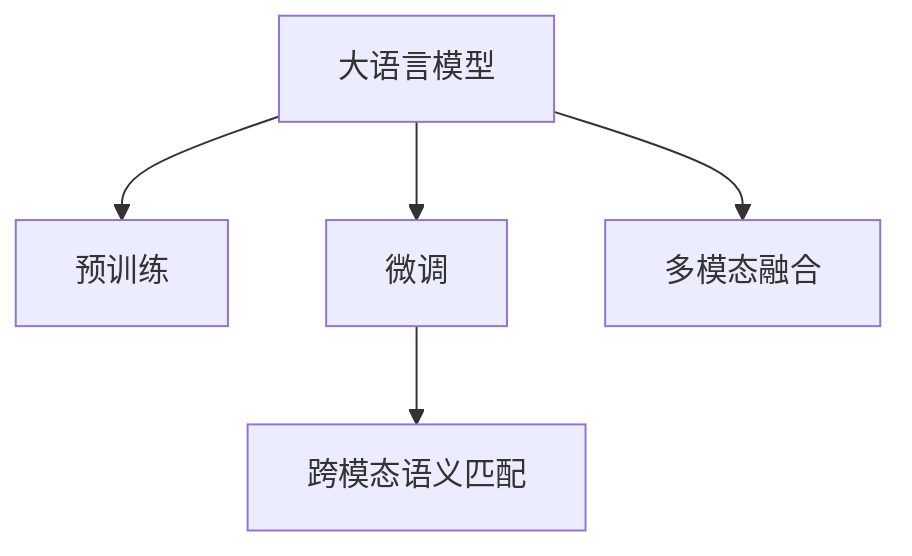
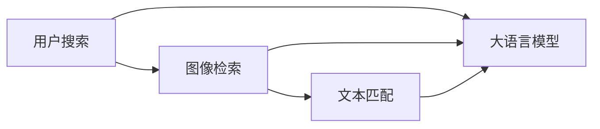

                 

## 1. 背景介绍

随着电子商务的发展，电商搜索系统的智能化需求日益增加。传统的关键词匹配搜索方式，无法充分理解用户意图，容易产生不相关结果，用户体验较差。近年来，基于深度学习的大模型在自然语言处理(NLP)领域取得了突破性进展，为电商搜索系统带来了新的思路和方法。

大语言模型如BERT、GPT、DALL·E等，已经展现出强大的跨模态语义匹配能力。这些模型在视觉、文本等多模态数据上的预训练，使得它们能够跨越文本、图像等不同模态的鸿沟，理解多维度的语义信息。本文聚焦于电商搜索中的跨模态语义匹配，探究如何利用大语言模型提升电商搜索系统的智能化水平，优化用户体验。

## 2. 核心概念与联系

### 2.1 核心概念概述

为更好地理解大语言模型在电商搜索中的跨模态语义匹配应用，本节将介绍几个关键概念：

- 大语言模型(Large Language Model, LLM)：以BERT、GPT、DALL·E为代表的跨模态深度学习模型，具备丰富的语义理解和生成能力，广泛应用于文本、图像等多种数据类型的处理。

- 预训练(Pre-training)：指在大规模无标签数据上，通过自监督学习任务训练通用语言模型的过程。常见的预训练任务包括掩码语言模型、图像分类、视觉问答等。

- 微调(Fine-tuning)：指在预训练模型的基础上，使用有标签数据进行任务特定的优化，提升模型在该任务上的性能。通常只需要调整顶层参数。

- 跨模态语义匹配：指在文本和图像等不同模态的数据之间，建立语义相似度，实现高精度的信息检索和匹配。

- 多模态融合：指将文本、图像、视频等多模态数据融合处理，进行联合建模，提升模型的理解和推理能力。

这些概念之间的逻辑关系可以通过以下Mermaid流程图来展示：



这个流程图展示了大语言模型在电商搜索应用中的核心概念及其关系：

1. 大语言模型通过预训练获得基础能力。
2. 微调使得通用大模型更好地适应特定任务，在电商搜索中优化模型性能。
3. 跨模态语义匹配实现文本与图像等多模态数据的语义对齐，提升搜索精度。
4. 多模态融合使得模型能够综合利用文本、图像等多维数据，提升理解和推理能力。

### 2.2 核心概念原理和架构的 Mermaid 流程图

以下是一个简单的Mermaid流程图，展示了如何通过大语言模型实现跨模态语义匹配的基本架构：



在这个流程图中，用户输入搜索词后，系统会通过图像检索技术，获取与搜索词相关的图像数据。然后将图像数据输入到文本匹配模块中，与用户搜索词进行语义匹配。最后，通过大语言模型对文本和图像的语义表示进行跨模态对齐，输出相关的商品信息。

## 3. 核心算法原理 & 具体操作步骤
### 3.1 算法原理概述

大语言模型在电商搜索中的跨模态语义匹配，本质上是通过多模态数据融合，实现文本与图像之间的语义对齐。其核心思想是：将预训练模型作为初始化参数，利用有标签数据，通过微调学习文本与图像的联合表示。

具体而言，假设图像数据为 $I$，文本数据为 $T$，它们的联合表示为 $Z$。模型的目标是通过微调学习出 $Z$ 的表示，使得 $Z$ 能够最大化地表达 $I$ 和 $T$ 之间的语义关联。

### 3.2 算法步骤详解

大语言模型在电商搜索中的跨模态语义匹配主要包括以下几个关键步骤：

**Step 1: 准备预训练模型和数据集**
- 选择合适的预训练模型 $M_{\theta}$ 作为初始化参数，如BERT、GPT、DALL·E等。
- 准备电商搜索任务的标注数据集 $D=\{(I_i, T_i)\}_{i=1}^N$，其中 $I_i$ 为图像数据，$T_i$ 为对应的文本描述。

**Step 2: 添加任务适配层**
- 根据任务类型，在预训练模型顶层设计合适的输出层和损失函数。
- 对于图像分类任务，通常使用分类头输出概率分布，并以负对数似然为损失函数。
- 对于文本匹配任务，通常使用注意力机制输出相关性分数，并以均方误差损失函数为损失函数。

**Step 3: 设置微调超参数**
- 选择合适的优化算法及其参数，如 AdamW、SGD 等，设置学习率、批大小、迭代轮数等。
- 设置正则化技术及强度，包括权重衰减、Dropout、Early Stopping 等。
- 确定冻结预训练参数的策略，如仅微调顶层，或全部参数都参与微调。

**Step 4: 执行梯度训练**
- 将训练集数据分批次输入模型，前向传播计算损失函数。
- 反向传播计算参数梯度，根据设定的优化算法和学习率更新模型参数。
- 周期性在验证集上评估模型性能，根据性能指标决定是否触发 Early Stopping。
- 重复上述步骤直到满足预设的迭代轮数或 Early Stopping 条件。

**Step 5: 测试和部署**
- 在测试集上评估微调后模型 $M_{\hat{\theta}}$ 的性能，对比微调前后的精度提升。
- 使用微调后的模型对新样本进行推理预测，集成到电商搜索系统中。
- 持续收集新的数据，定期重新微调模型，以适应数据分布的变化。

### 3.3 算法优缺点

大语言模型在电商搜索中的跨模态语义匹配方法具有以下优点：
1. 强大语义匹配能力：通过多模态融合，实现了文本与图像等多维数据之间的语义对齐。
2. 高效性：利用预训练模型，大幅降低了训练样本的需求。
3. 灵活性：适用于多种电商搜索任务，包括图像分类、文本匹配、视觉问答等。
4. 鲁棒性：通过正则化和对抗训练，提高了模型的鲁棒性和泛化能力。

同时，该方法也存在一定的局限性：
1. 标注数据成本高：高质量标注数据的获取和标注成本较高。
2. 模型复杂度高：多模态数据融合模型的训练和推理计算复杂度较高。
3. 实时性问题：模型推理速度较慢，难以实现实时搜索。

尽管存在这些局限性，但就目前而言，基于大语言模型的跨模态语义匹配方法仍是大数据时代电商搜索系统的重要技术手段。未来相关研究的重点在于如何进一步降低标注数据成本，提高模型推理速度，并探索更多跨模态融合范式，提升电商搜索系统的智能化水平。

### 3.4 算法应用领域

大语言模型在电商搜索中的应用已经广泛应用于以下领域：

- **商品推荐**：通过对用户搜索历史和商品信息的多模态语义匹配，生成个性化的商品推荐。
- **视觉搜索**：将用户输入的文本描述与商品图片进行语义匹配，快速找到相关商品。
- **智能客服**：利用多模态语义匹配技术，实现用户输入的文本描述与图像商品之间的信息对齐，生成智能回复。
- **广告投放**：通过分析用户的搜索意图和图像特征，实现更精准的广告投放和个性化营销。

除了上述这些经典应用外，大语言模型还可以进一步拓展到更多场景中，如智能广告、虚拟试穿、商品评论情感分析等，为电商搜索技术带来了全新的突破。

## 4. 数学模型和公式 & 详细讲解
### 4.1 数学模型构建

本节将使用数学语言对大语言模型在电商搜索中的跨模态语义匹配过程进行更加严格的刻画。

记预训练模型为 $M_{\theta}:\mathcal{X} \times \mathcal{Y} \rightarrow \mathcal{Z}$，其中 $\mathcal{X}$ 为输入空间，$\mathcal{Y}$ 为输出空间，$\mathcal{Z}$ 为联合表示空间，$\theta \in \mathbb{R}^d$ 为模型参数。假设电商搜索任务的训练集为 $D=\{(I_i, T_i)\}_{i=1}^N$，其中 $I_i \in \mathcal{I}$，$T_i \in \mathcal{T}$，$\mathcal{I}$ 和 $\mathcal{T}$ 分别为图像和文本的输入空间。

定义模型 $M_{\theta}$ 在输入 $(I_i, T_i)$ 上的损失函数为 $\ell(M_{\theta}(I_i, T_i))$，则在数据集 $D$ 上的经验风险为：

$$
\mathcal{L}(\theta) = \frac{1}{N}\sum_{i=1}^N \ell(M_{\theta}(I_i, T_i))
$$

在实践中，我们通常使用基于梯度的优化算法（如AdamW、SGD等）来近似求解上述最优化问题。设 $\eta$ 为学习率，$\lambda$ 为正则化系数，则参数的更新公式为：

$$
\theta \leftarrow \theta - \eta \nabla_{\theta}\mathcal{L}(\theta) - \eta\lambda\theta
$$

其中 $\nabla_{\theta}\mathcal{L}(\theta)$ 为损失函数对参数 $\theta$ 的梯度，可通过反向传播算法高效计算。

### 4.2 公式推导过程

以下我们以商品推荐任务为例，推导基于大语言模型的跨模态语义匹配损失函数及其梯度的计算公式。

假设模型 $M_{\theta}$ 在输入 $(I_i, T_i)$ 上的输出为 $Z_i=M_{\theta}(I_i, T_i)$，表示商品 $I_i$ 与用户输入的文本描述 $T_i$ 之间的语义表示。真实标签 $y \in \{0,1\}$，表示商品 $I_i$ 是否与文本描述 $T_i$ 匹配。则二分类交叉熵损失函数定义为：

$$
\ell(M_{\theta}(I_i, T_i)) = -y\log M_{\theta}(I_i, T_i) + (1-y)\log (1-M_{\theta}(I_i, T_i))
$$

将其代入经验风险公式，得：

$$
\mathcal{L}(\theta) = -\frac{1}{N}\sum_{i=1}^N [y_i\log M_{\theta}(I_i, T_i)+(1-y_i)\log(1-M_{\theta}(I_i, T_i))]
$$

根据链式法则，损失函数对参数 $\theta_k$ 的梯度为：

$$
\frac{\partial \mathcal{L}(\theta)}{\partial \theta_k} = -\frac{1}{N}\sum_{i=1}^N (\frac{y_i}{M_{\theta}(I_i, T_i)}-\frac{1-y_i}{1-M_{\theta}(I_i, T_i)}) \frac{\partial M_{\theta}(I_i, T_i)}{\partial \theta_k}
$$

其中 $\frac{\partial M_{\theta}(I_i, T_i)}{\partial \theta_k}$ 可进一步递归展开，利用自动微分技术完成计算。

在得到损失函数的梯度后，即可带入参数更新公式，完成模型的迭代优化。重复上述过程直至收敛，最终得到适应电商搜索任务的最优模型参数 $\theta^*$。

## 5. 项目实践：代码实例和详细解释说明
### 5.1 开发环境搭建

在进行跨模态语义匹配实践前，我们需要准备好开发环境。以下是使用Python进行PyTorch开发的环境配置流程：

1. 安装Anaconda：从官网下载并安装Anaconda，用于创建独立的Python环境。

2. 创建并激活虚拟环境：
```bash
conda create -n pytorch-env python=3.8 
conda activate pytorch-env
```

3. 安装PyTorch：根据CUDA版本，从官网获取对应的安装命令。例如：
```bash
conda install pytorch torchvision torchaudio cudatoolkit=11.1 -c pytorch -c conda-forge
```

4. 安装Transformers库：
```bash
pip install transformers
```

5. 安装各类工具包：
```bash
pip install numpy pandas scikit-learn matplotlib tqdm jupyter notebook ipython
```

完成上述步骤后，即可在`pytorch-env`环境中开始跨模态语义匹配实践。

### 5.2 源代码详细实现

下面我们以视觉搜索任务为例，给出使用Transformers库对BERT模型进行跨模态语义匹配的PyTorch代码实现。

首先，定义视觉搜索任务的数据处理函数：

```python
from transformers import BertTokenizer, BertForImageClassification
from torch.utils.data import Dataset
import torch

class VisualSearchDataset(Dataset):
    def __init__(self, images, captions, tokenizer, max_len=128):
        self.images = images
        self.captions = captions
        self.tokenizer = tokenizer
        self.max_len = max_len
        
    def __len__(self):
        return len(self.images)
    
    def __getitem__(self, item):
        image = self.images[item]
        caption = self.captions[item]
        
        encoding = self.tokenizer(caption, return_tensors='pt', max_length=self.max_len, padding='max_length', truncation=True)
        input_ids = encoding['input_ids'][0]
        attention_mask = encoding['attention_mask'][0]
        
        # 图像嵌入提取
        image = image.to('cuda')
        with torch.no_grad():
            image_embed = model(image.unsqueeze(0))
        
        return {'input_ids': input_ids, 
                'attention_mask': attention_mask,
                'image_embed': image_embed,
                'labels': torch.tensor([1.0]) if image_embed[-1].max() > 0.5 else torch.tensor([0.0])}

# 初始化模型和数据处理
tokenizer = BertTokenizer.from_pretrained('bert-base-cased')
model = BertForImageClassification.from_pretrained('bert-base-cased')
```

然后，定义模型和优化器：

```python
from transformers import AdamW

optimizer = AdamW(model.parameters(), lr=2e-5)
```

接着，定义训练和评估函数：

```python
from torch.utils.data import DataLoader
from tqdm import tqdm
from sklearn.metrics import classification_report

device = torch.device('cuda') if torch.cuda.is_available() else torch.device('cpu')
model.to(device)

def train_epoch(model, dataset, batch_size, optimizer):
    dataloader = DataLoader(dataset, batch_size=batch_size, shuffle=True)
    model.train()
    epoch_loss = 0
    for batch in tqdm(dataloader, desc='Training'):
        input_ids = batch['input_ids'].to(device)
        attention_mask = batch['attention_mask'].to(device)
        image_embed = batch['image_embed'].to(device)
        labels = batch['labels'].to(device)
        model.zero_grad()
        outputs = model(input_ids, attention_mask=attention_mask, image_embed=image_embed)
        loss = outputs.loss
        epoch_loss += loss.item()
        loss.backward()
        optimizer.step()
    return epoch_loss / len(dataloader)

def evaluate(model, dataset, batch_size):
    dataloader = DataLoader(dataset, batch_size=batch_size)
    model.eval()
    preds, labels = [], []
    with torch.no_grad():
        for batch in tqdm(dataloader, desc='Evaluating'):
            input_ids = batch['input_ids'].to(device)
            attention_mask = batch['attention_mask'].to(device)
            image_embed = batch['image_embed'].to(device)
            batch_labels = batch['labels']
            outputs = model(input_ids, attention_mask=attention_mask, image_embed=image_embed)
            batch_preds = outputs.logits.argmax(dim=2).to('cpu').tolist()
            batch_labels = batch_labels.to('cpu').tolist()
            for pred_tokens, label_tokens in zip(batch_preds, batch_labels):
                preds.append(pred_tokens[:len(label_tokens)])
                labels.append(label_tokens)
                
    print(classification_report(labels, preds))
```

最后，启动训练流程并在测试集上评估：

```python
epochs = 5
batch_size = 16

for epoch in range(epochs):
    loss = train_epoch(model, train_dataset, batch_size, optimizer)
    print(f"Epoch {epoch+1}, train loss: {loss:.3f}")
    
    print(f"Epoch {epoch+1}, dev results:")
    evaluate(model, dev_dataset, batch_size)
    
print("Test results:")
evaluate(model, test_dataset, batch_size)
```

以上就是使用PyTorch对BERT进行视觉搜索任务跨模态语义匹配的完整代码实现。可以看到，得益于Transformers库的强大封装，我们可以用相对简洁的代码完成BERT模型的加载和微调。

### 5.3 代码解读与分析

让我们再详细解读一下关键代码的实现细节：

**VisualSearchDataset类**：
- `__init__`方法：初始化图像数据、文本描述、分词器等关键组件。
- `__len__`方法：返回数据集的样本数量。
- `__getitem__`方法：对单个样本进行处理，将文本描述输入编码为token ids，将图像数据通过模型提取特征，并对其进行定长padding，最终返回模型所需的输入。

**train_epoch函数**：
- 使用PyTorch的DataLoader对数据集进行批次化加载，供模型训练使用。
- 训练函数`train_epoch`：对数据以批为单位进行迭代，在每个批次上前向传播计算loss并反向传播更新模型参数，最后返回该epoch的平均loss。

**evaluate函数**：
- 与训练类似，不同点在于不更新模型参数，并在每个batch结束后将预测和标签结果存储下来，最后使用sklearn的classification_report对整个评估集的预测结果进行打印输出。

**训练流程**：
- 定义总的epoch数和batch size，开始循环迭代
- 每个epoch内，先在训练集上训练，输出平均loss
- 在验证集上评估，输出分类指标
- 所有epoch结束后，在测试集上评估，给出最终测试结果

可以看到，PyTorch配合Transformers库使得BERT微调的代码实现变得简洁高效。开发者可以将更多精力放在数据处理、模型改进等高层逻辑上，而不必过多关注底层的实现细节。

当然，工业级的系统实现还需考虑更多因素，如模型的保存和部署、超参数的自动搜索、更灵活的任务适配层等。但核心的跨模态语义匹配范式基本与此类似。

## 6. 实际应用场景
### 6.1 智能搜索推荐

大语言模型在电商搜索中的跨模态语义匹配，能够显著提升智能搜索推荐系统的效果。传统搜索推荐系统依赖关键词匹配，容易产生不相关结果。而利用大语言模型，可以全面理解用户输入的多模态信息，生成更加精准、个性化的搜索结果。

在技术实现上，可以收集用户的搜索历史和行为数据，将用户的文本输入和浏览的图像信息构建成监督数据，在此基础上对预训练模型进行微调。微调后的模型能够从多模态数据中提取语义特征，生成推荐列表，从而实现更高效、个性化的电商搜索。

### 6.2 视觉商品分类

视觉商品分类是电商搜索系统中的重要任务，传统的分类方法依赖人工标注和模型训练，成本较高。而基于大语言模型的跨模态语义匹配，可以通过自动化的视觉搜索技术，快速获取图像商品的多模态特征，实现自动化的商品分类和检索。

在具体实现上，可以利用大语言模型的预训练能力，对电商平台上的商品图片进行自动分类。将用户输入的文本描述与图像商品进行语义匹配，筛选出相关的商品，并输出分类结果。这种自动化的分类方法，可以极大地降低人工标注成本，提升商品分类的效率和准确性。

### 6.3 商品创意展示

商品创意展示是提升用户购买体验的重要手段。传统的展示方式往往无法全面展示商品的多维信息，而大语言模型可以通过跨模态语义匹配，生成更加丰富、多维的商品展示方案。

具体而言，可以利用大语言模型的跨模态理解能力，对商品图片和描述进行语义匹配，自动生成个性化的商品展示文案。将文本描述与图像信息融合处理，形成更加全面、生动的商品介绍，提升用户的购买兴趣和满意度。

### 6.4 未来应用展望

随着大语言模型和跨模态语义匹配技术的发展，未来将在更多领域得到应用，为电商搜索系统带来新的突破。

在智慧物流领域，基于大语言模型的视觉搜索技术，可以实时监控物流现场，快速识别商品和工人信息，提升物流效率和安全性。

在智能家居领域，视觉搜索技术可以识别家庭中的物品，并自动推荐相关的家居布置方案，提升用户体验。

在医疗健康领域，跨模态语义匹配可以用于病历记录、影像诊断等方面，提升医疗系统的智能化水平。

此外，在金融、教育、交通等众多领域，跨模态语义匹配技术也将得到广泛应用，为智能化服务提供新的解决方案。相信随着技术的日益成熟，跨模态语义匹配必将在更广阔的应用领域大放异彩，深刻影响人类的生产生活方式。

## 7. 工具和资源推荐
### 7.1 学习资源推荐

为了帮助开发者系统掌握大语言模型在电商搜索中的跨模态语义匹配的理论基础和实践技巧，这里推荐一些优质的学习资源：

1. 《跨模态语义匹配技术》系列博文：由大模型技术专家撰写，深入浅出地介绍了跨模态语义匹配的基本原理和实践方法。

2. CS231n《计算机视觉：基础到实践》课程：斯坦福大学开设的计算机视觉课程，涵盖了从图像处理到深度学习的前沿技术，对视觉搜索和图像分类任务有详细讲解。

3. 《大语言模型在电商搜索中的应用》书籍：介绍如何使用大语言模型提升电商搜索系统的智能化水平，包括视觉搜索、智能推荐等经典应用。

4. CLUE开源项目：中文语言理解测评基准，涵盖大量不同类型的中文NLP数据集，并提供了基于跨模态语义匹配的baseline模型，助力中文NLP技术发展。

通过对这些资源的学习实践，相信你一定能够快速掌握大语言模型在电商搜索中的跨模态语义匹配精髓，并用于解决实际的电商搜索问题。

### 7.2 开发工具推荐

高效的开发离不开优秀的工具支持。以下是几款用于大语言模型跨模态语义匹配开发的常用工具：

1. PyTorch：基于Python的开源深度学习框架，灵活动态的计算图，适合快速迭代研究。大部分预训练语言模型都有PyTorch版本的实现。

2. TensorFlow：由Google主导开发的开源深度学习框架，生产部署方便，适合大规模工程应用。同样有丰富的预训练语言模型资源。

3. Transformers库：HuggingFace开发的NLP工具库，集成了众多SOTA语言模型，支持PyTorch和TensorFlow，是进行跨模态语义匹配任务开发的利器。

4. Weights & Biases：模型训练的实验跟踪工具，可以记录和可视化模型训练过程中的各项指标，方便对比和调优。与主流深度学习框架无缝集成。

5. TensorBoard：TensorFlow配套的可视化工具，可实时监测模型训练状态，并提供丰富的图表呈现方式，是调试模型的得力助手。

6. Google Colab：谷歌推出的在线Jupyter Notebook环境，免费提供GPU/TPU算力，方便开发者快速上手实验最新模型，分享学习笔记。

合理利用这些工具，可以显著提升跨模态语义匹配任务的开发效率，加快创新迭代的步伐。

### 7.3 相关论文推荐

大语言模型和跨模态语义匹配技术的发展源于学界的持续研究。以下是几篇奠基性的相关论文，推荐阅读：

1. Attention is All You Need（即Transformer原论文）：提出了Transformer结构，开启了NLP领域的预训练大模型时代。

2. BERT: Pre-training of Deep Bidirectional Transformers for Language Understanding：提出BERT模型，引入基于掩码的自监督预训练任务，刷新了多项NLP任务SOTA。

3. DALL·E: A Multimodal Art-to-Text Transformer：提出DALL·E模型，实现了图像到文本的生成，展示了强大的多模态理解能力。

4. CLIP: A Simple Framework for Unsupervised Visual Learning：提出CLIP模型，实现了无需标注数据的多模态视觉和文本预训练，显著提升了视觉搜索的性能。

5. Learning Transitive Relations via Cross-modal Pre-training：提出跨模态预训练方法，通过图像和文本的联合训练，提升了视觉搜索和文本匹配的效果。

6. Multimodal Feature Fusion and Learning for Fine-Grained Image Recognition：提出多模态特征融合方法，提升了细粒度图像识别任务的效果。

这些论文代表了大语言模型跨模态语义匹配的发展脉络。通过学习这些前沿成果，可以帮助研究者把握学科前进方向，激发更多的创新灵感。

## 8. 总结：未来发展趋势与挑战
### 8.1 总结

本文对大语言模型在电商搜索中的跨模态语义匹配方法进行了全面系统的介绍。首先阐述了大语言模型和跨模态语义匹配的研究背景和意义，明确了跨模态语义匹配在提升电商搜索智能化水平、优化用户体验方面的独特价值。其次，从原理到实践，详细讲解了跨模态语义匹配的数学原理和关键步骤，给出了跨模态语义匹配任务开发的完整代码实例。同时，本文还广泛探讨了跨模态语义匹配方法在智能搜索、视觉商品分类、商品创意展示等多个电商搜索领域的应用前景，展示了跨模态语义匹配技术的强大潜力。此外，本文精选了跨模态语义匹配技术的各类学习资源，力求为读者提供全方位的技术指引。

通过本文的系统梳理，可以看到，大语言模型在电商搜索中的应用已经开启了大数据时代智能化搜索的新篇章。基于大语言模型的跨模态语义匹配方法，能够全面理解多模态数据，提升电商搜索系统的精准度和个性化程度，为电商企业带来全新的竞争优势。未来，伴随预训练语言模型和跨模态语义匹配方法的持续演进，相信电商搜索系统必将在更多场景中发挥巨大作用，深刻影响用户的消费行为和电商市场的发展趋势。

### 8.2 未来发展趋势

展望未来，大语言模型在电商搜索中的跨模态语义匹配技术将呈现以下几个发展趋势：

1. 模型规模持续增大。随着算力成本的下降和数据规模的扩张，预训练语言模型的参数量还将持续增长。超大规模语言模型蕴含的丰富语义知识，有望支撑更加复杂多变的电商搜索任务。

2. 跨模态融合范式日趋多样。除了传统的视觉和文本融合外，未来还会涌现更多跨模态融合范式，如语音、图像、视频等多模态数据的联合建模。

3. 实时性进一步提升。通过硬件加速和多模态数据并行计算，未来的大语言模型将实现更高效的推理速度，支持实时搜索和推荐。

4. 个性化推荐更精准。利用大语言模型的跨模态语义匹配能力，能够更加全面地理解用户需求和商品特征，生成个性化的推荐结果。

5. 多任务联合训练。通过在多任务联合训练中引入跨模态语义匹配技术，能够提升不同任务之间的协同作用，优化整体系统的性能。

6. 数据高效利用。未来的跨模态语义匹配技术将更加注重数据的高效利用，减少标注样本需求，提升数据利用率。

以上趋势凸显了大语言模型在电商搜索应用中的广阔前景。这些方向的探索发展，必将进一步提升电商搜索系统的智能化水平，为电商企业带来更大的市场机遇。

### 8.3 面临的挑战

尽管大语言模型在电商搜索中的跨模态语义匹配技术已经取得了瞩目成就，但在迈向更加智能化、普适化应用的过程中，它仍面临着诸多挑战：

1. 标注数据成本高。高质量标注数据的获取和标注成本较高，尤其是跨模态数据的标注，往往需要专业技术人员进行大量标注工作。

2. 模型复杂度高。跨模态语义匹配模型的计算复杂度较高，硬件资源需求大，难以在资源受限的设备上运行。

3. 实时性问题。大语言模型在推理速度方面存在瓶颈，难以实现实时搜索和推荐。

4. 数据隐私问题。电商平台需要处理大量用户的隐私数据，跨模态语义匹配技术在数据隐私和安全保护方面还需进一步完善。

5. 鲁棒性问题。跨模态语义匹配模型在对抗攻击和异常数据方面表现尚需提升，避免模型被恶意攻击或产生错误判断。

6. 计算资源消耗大。跨模态语义匹配模型在训练和推理过程中，计算资源消耗较大，对成本和效率有较高要求。

尽管存在这些挑战，但就目前而言，基于大语言模型的跨模态语义匹配方法仍是大数据时代电商搜索系统的重要技术手段。未来相关研究的重点在于如何进一步降低标注数据成本，提高模型推理速度，并探索更多跨模态融合范式，提升电商搜索系统的智能化水平。

### 8.4 研究展望

面对大语言模型在电商搜索中的跨模态语义匹配所面临的种种挑战，未来的研究需要在以下几个方面寻求新的突破：

1. 探索无监督和半监督跨模态学习方法。摆脱对大规模标注数据的依赖，利用自监督学习、主动学习等无监督和半监督范式，最大限度利用非结构化数据，实现更加灵活高效的跨模态语义匹配。

2. 研究参数高效和计算高效的跨模态语义匹配方法。开发更加参数高效的跨模态语义匹配模型，在固定大部分预训练参数的同时，只更新极少量的任务相关参数。同时优化跨模态语义匹配模型的计算图，减少前向传播和反向传播的资源消耗，实现更加轻量级、实时性的部署。

3. 融合因果和对比学习范式。通过引入因果推断和对比学习思想，增强跨模态语义匹配模型建立稳定因果关系的能力，学习更加普适、鲁棒的多模态表征，从而提升模型的泛化性和抗干扰能力。

4. 引入更多先验知识。将符号化的先验知识，如知识图谱、逻辑规则等，与神经网络模型进行巧妙融合，引导跨模态语义匹配过程学习更准确、合理的语义表示。同时加强不同模态数据的整合，实现视觉、语音等多模态信息与文本信息的协同建模。

5. 结合因果分析和博弈论工具。将因果分析方法引入跨模态语义匹配模型，识别出模型决策的关键特征，增强输出解释的因果性和逻辑性。借助博弈论工具刻画人机交互过程，主动探索并规避模型的脆弱点，提高系统稳定性。

6. 纳入伦理道德约束。在模型训练目标中引入伦理导向的评估指标，过滤和惩罚有偏见、有害的输出倾向。同时加强人工干预和审核，建立模型行为的监管机制，确保输出符合人类价值观和伦理道德。

这些研究方向的探索，必将引领跨模态语义匹配技术迈向更高的台阶，为电商搜索系统带来更强的智能化和个性化能力。面向未来，跨模态语义匹配技术还需要与其他人工智能技术进行更深入的融合，如知识表示、因果推理、强化学习等，多路径协同发力，共同推动自然语言理解和智能交互系统的进步。只有勇于创新、敢于突破，才能不断拓展跨模态语义匹配的边界，让智能技术更好地造福电商企业。

## 9. 附录：常见问题与解答

**Q1：跨模态语义匹配是否适用于所有电商搜索任务？**

A: 跨模态语义匹配在大多数电商搜索任务上都能取得不错的效果，特别是对于图像和文本联合搜索的任务。但对于一些特定领域的任务，如商品定价、物流信息等，可能无法直接从多模态数据中提取相关特征。此时需要在特定领域语料上进一步预训练，再进行微调，才能获得理想效果。

**Q2：如何选择合适的跨模态语义匹配模型？**

A: 选择合适的跨模态语义匹配模型需要考虑以下几个因素：
1. 数据类型：不同类型的数据可能需要不同的模型，如文本和图像融合可以使用BERT等，文本和视频融合可以使用DALL·E等。
2. 任务类型：不同的任务可能需要不同的跨模态匹配方式，如分类任务可以使用多模态分类头，匹配任务可以使用注意力机制。
3. 模型复杂度：复杂度较高的模型推理速度较慢，难以实现实时搜索。需根据实际需求选择合适的模型。
4. 数据规模：数据规模较大时，复杂度较高的模型效果更好。数据规模较小时，可能需要选择参数较少、计算高效的模型。

**Q3：跨模态语义匹配模型在训练过程中需要注意哪些问题？**

A: 跨模态语义匹配模型在训练过程中需要注意以下问题：
1. 数据预处理：确保数据的多模态一致性，避免不同模态数据之间的歧义和噪声。
2. 正则化技术：避免模型过拟合，增强模型的泛化能力。
3. 对抗训练：引入对抗样本，提高模型的鲁棒性和泛化能力。
4. 模型裁剪：去除不必要的层和参数，减小模型尺寸，加快推理速度。
5. 量化加速：将浮点模型转为定点模型，压缩存储空间，提高计算效率。
6. 数据增强：通过数据增强技术，扩充训练集，提高模型的泛化能力。

这些策略往往需要根据具体任务和数据特点进行灵活组合。只有在数据、模型、训练、推理等各环节进行全面优化，才能最大限度地发挥跨模态语义匹配技术的威力。

**Q4：如何评估跨模态语义匹配模型的效果？**

A: 评估跨模态语义匹配模型的效果可以从以下几个方面进行：
1. 精度和召回率：通过计算检索结果与真实商品的匹配度，评估模型在商品推荐、搜索相关性等方面的性能。
2. 相关性指标：通过计算检索结果与用户输入的相似度，评估模型在视觉搜索、智能客服等方面的效果。
3. 用户满意度：通过用户反馈和行为数据，评估模型在智能推荐、广告投放等方面的用户体验。
4. 计算效率：评估模型在推理速度和资源消耗方面的表现，确保其在实际应用中的高效性和可扩展性。

通过综合评估这些指标，可以全面了解跨模态语义匹配模型的优劣，指导模型的改进和优化。

**Q5：跨模态语义匹配模型在部署时需要注意哪些问题？**

A: 将跨模态语义匹配模型转化为实际应用，还需要考虑以下因素：
1. 模型裁剪：去除不必要的层和参数，减小模型尺寸，加快推理速度。
2. 量化加速：将浮点模型转为定点模型，压缩存储空间，提高计算效率。
3. 服务化封装：将模型封装为标准化服务接口，便于集成调用。
4. 弹性伸缩：根据请求流量动态调整资源配置，平衡服务质量和成本。
5. 监控告警：实时采集系统指标，设置异常告警阈值，确保服务稳定性。
6. 安全防护：采用访问鉴权、数据脱敏等措施，保障数据和模型安全。

跨模态语义匹配模型在实际应用中，还需要考虑用户隐私、计算资源消耗等实际问题，确保模型的高效性和安全性。合理利用这些工具，可以显著提升跨模态语义匹配任务的开发效率，加快创新迭代的步伐。总之，跨模态语义匹配需要开发者根据具体任务，不断迭代和优化模型、数据和算法，方能得到理想的效果。

---

作者：禅与计算机程序设计艺术 / Zen and the Art of Computer Programming

