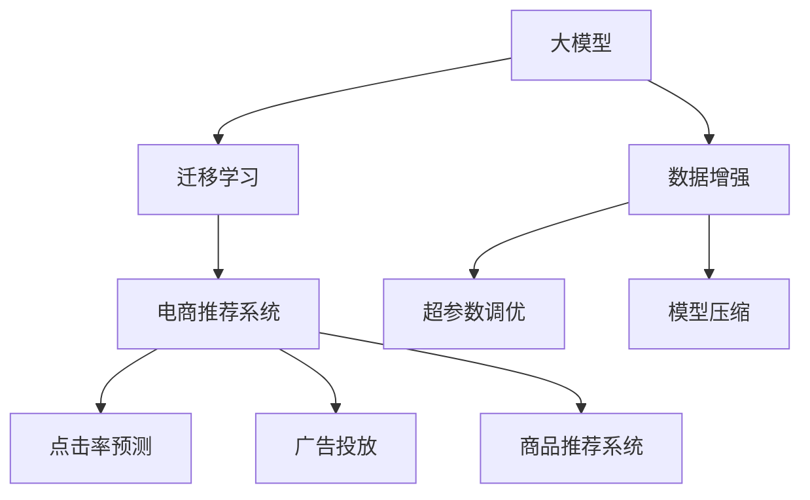

                 

# 电商行业中的迁移学习：大模型的实践与挑战

> 关键词：大模型,迁移学习,电商推荐,点击率预测,广告投放,商品推荐系统,数据增强,超参数调优,模型压缩

## 1. 背景介绍

### 1.1 问题由来
在快速发展的电商行业，如何准确预测用户行为，高效推荐商品，一直是各大电商平台面临的重大挑战。传统的基于特征工程的推荐算法，需要大量手工提取特征，且对数据分布的假设较强，难以应对数据的多样性和实时性变化。

随着深度学习和大规模预训练模型的兴起，电商推荐系统的研究范式也逐渐从传统的特征工程转向利用大模型进行迁移学习，利用预训练模型的强大语义理解能力，在有限的标注数据上快速构建高性能推荐系统。本文将重点介绍大模型在电商行业中的迁移学习实践与挑战，为电商推荐系统的开发提供理论和实践上的参考。

### 1.2 问题核心关键点
大模型在电商推荐系统中的应用，本质上是将大模型的通用知识与电商行业具体任务相结合，通过迁移学习提升模型在特定场景中的性能。大模型作为"知识库"，可以显著提升电商推荐系统的准确率和召回率。

然而，大模型的迁移学习也面临诸多挑战，如模型适配性、泛化能力、计算效率等。本文将探讨这些问题，并提出相应的解决策略，以期在电商推荐系统中充分发挥大模型的优势，提升用户体验。

## 2. 核心概念与联系

### 2.1 核心概念概述

为更好地理解大模型在电商推荐系统中的应用，本节将介绍几个密切相关的核心概念：

- 大模型（Large Model）：如BERT、GPT等大规模预训练语言模型，通过在大规模无标签文本数据上进行自监督学习，学习通用的语言表示。
- 迁移学习（Transfer Learning）：将一个领域学到的知识，迁移到另一个不同但相关的领域中。
- 电商推荐系统（E-commerce Recommendation System）：通过分析用户行为数据，推荐用户可能感兴趣的商品或内容。
- 点击率预测（Click-through Rate Prediction）：预测用户点击某个商品或广告的概率，以指导推荐和广告投放。
- 广告投放（Ad Placement）：根据用户特征和行为，优化广告位置和形式，以最大化广告效果。
- 商品推荐系统（Product Recommendation System）：通过分析用户历史行为，推荐相关商品，提升用户体验和销售额。
- 数据增强（Data Augmentation）：通过对训练数据进行变化，丰富数据分布，提高模型的泛化能力。
- 超参数调优（Hyperparameter Tuning）：通过调整学习率、批大小等超参数，优化模型性能。
- 模型压缩（Model Compression）：通过剪枝、量化等技术，减少模型规模，提高计算效率。

这些核心概念之间的逻辑关系可以通过以下Mermaid流程图来展示：



这个流程图展示了大模型在电商推荐系统中的应用框架，以及其中的关键技术和概念。

## 3. 核心算法原理 & 具体操作步骤
### 3.1 算法原理概述

电商推荐系统中的大模型迁移学习，通常包括以下几个步骤：

1. 预训练：在大规模无标签电商数据上，通过自监督学习任务训练预训练模型。
2. 微调：在电商推荐任务的数据集上进行有监督微调，学习特定任务的领域知识。
3. 数据增强：通过生成式和增强式方法扩充训练数据集，增加模型泛化能力。
4. 超参数调优：根据实际任务需求，调整模型架构和学习率等超参数，优化模型性能。
5. 模型压缩：对微调后的模型进行剪枝、量化等压缩，提高模型计算效率，便于实际部署。

这些步骤共同构成大模型在电商推荐系统中的应用流程，通过迁移学习提升模型的性能。

### 3.2 算法步骤详解

#### 3.2.1 预训练

电商推荐系统的预训练通常使用大模型作为初始化参数。通过在大规模无标签电商数据上进行的自监督学习，学习到通用的语言表示和语义理解能力。

具体而言，可以选择如BERT、GPT等预训练语言模型作为初始化参数。以BERT为例，预训练过程通常包括以下步骤：

1. 数据准备：收集大规模无标签电商数据，如商品描述、用户评论、商品标签等。
2. 编码器设计：选择BERT等自注意力机制的编码器结构。
3. 预训练任务设计：设计如语言建模、掩码语言建模等自监督学习任务。
4. 模型训练：在预训练数据集上进行训练，优化模型参数，学习到通用的语言表示能力。

#### 3.2.2 微调

微调是大模型在电商推荐系统中的核心步骤，通过有监督学习，学习特定任务的领域知识。

具体而言，微调过程包括以下步骤：

1. 任务定义：确定电商推荐系统的具体任务，如点击率预测、广告投放、商品推荐等。
2. 任务适配层设计：设计适合特定任务的输出层和损失函数，如交叉熵损失、对数似然损失等。
3. 数据集准备：收集和标注电商推荐任务的数据集，如用户点击记录、用户行为数据等。
4. 模型微调：在标注数据集上对预训练模型进行微调，更新模型参数，学习特定任务的领域知识。
5. 评估和优化：在验证集上评估微调后的模型性能，调整超参数和学习率等，优化模型效果。

#### 3.2.3 数据增强

电商推荐系统中的数据增强，主要通过生成式和增强式方法扩充训练数据集，增加模型泛化能力。

具体而言，数据增强过程包括以下步骤：

1. 生成式增强：通过数据生成技术，如回译、近义替换、数据填充等，增加训练数据的数量和多样性。
2. 增强式增强：通过多样化的数据变换，如时间戳变化、广告形式变换、商品描述变换等，增加模型对不同数据分布的适应能力。
3. 数据混合：将增强后的数据与原始数据进行混合，构成新的训练集。

#### 3.2.4 超参数调优

电商推荐系统中的超参数调优，主要通过调整学习率、批大小、正则化参数等超参数，优化模型性能。

具体而言，超参数调优过程包括以下步骤：

1. 初始化超参数：根据预训练模型的架构和电商推荐任务的特点，选择初始化超参数。
2. 网格搜索：通过网格搜索等方法，寻找最优的超参数组合。
3. 随机搜索：通过随机搜索等方法，快速探索超参数空间。
4. 模型评估：在验证集上评估超参数优化后的模型性能，选择最优的超参数组合。

#### 3.2.5 模型压缩

电商推荐系统中的模型压缩，主要通过剪枝、量化等技术，减少模型规模，提高模型计算效率，便于实际部署。

具体而言，模型压缩过程包括以下步骤：

1. 剪枝：通过删除模型中不必要的参数，减小模型规模。
2. 量化：将浮点模型转为定点模型，减少存储空间和计算量。
3. 混合精度训练：采用混合精度训练技术，提高模型训练和推理效率。
4. 分布式训练：通过分布式训练等技术，加速模型训练过程。

### 3.3 算法优缺点

电商推荐系统中的大模型迁移学习，具有以下优点：

1. 泛化能力强：利用大模型的通用知识，可以在有限的标注数据上快速构建高性能推荐系统。
2. 结构灵活：可以灵活调整任务适配层和输出层，适用于多种电商推荐任务。
3. 计算效率高：利用大模型的预训练知识，可以减少微调的计算量和时间。
4. 效果显著：在电商推荐任务上，大模型可以显著提升推荐效果和用户体验。

同时，该方法也存在一定的局限性：

1. 依赖标注数据：微调过程需要大量的标注数据，对标注成本较高。
2. 参数量大：大模型的参数量通常较大，对计算资源和存储资源要求较高。
3. 过拟合风险：在大规模数据上预训练后，微调过程中可能出现过拟合问题。
4. 难以解释：大模型通常被视为"黑盒"系统，难以解释其内部工作机制。
5. 需要持续优化：电商数据不断变化，需要定期重新微调模型，以保持其性能和适应性。

尽管存在这些局限性，但大模型在电商推荐系统中的应用前景仍然广阔。未来相关研究的重点在于如何进一步降低微调对标注数据的依赖，提高模型的泛化能力和鲁棒性，同时兼顾模型的可解释性和计算效率。

### 3.4 算法应用领域

电商推荐系统中的大模型迁移学习，已经广泛应用于多种电商任务，包括：

1. 点击率预测（CTR Prediction）：预测用户点击商品或广告的概率，优化广告投放策略。
2. 广告投放（Ad Placement）：通过用户行为和商品属性，优化广告位置和形式，提高广告效果。
3. 商品推荐系统（Product Recommendation）：分析用户历史行为，推荐相关商品，提升用户体验。
4. 个性化推荐系统（Personalized Recommendation）：根据用户特征和行为，个性化推荐商品或内容。
5. 内容推荐系统（Content Recommendation）：推荐用户可能感兴趣的内容，如视频、音乐等。

此外，大模型的迁移学习也逐渐被应用于其他电商相关任务，如库存管理、供应链优化、智能客服等，为电商行业带来新的技术突破。

## 4. 数学模型和公式 & 详细讲解  
### 4.1 数学模型构建

在电商推荐系统中，大模型的迁移学习通常采用二分类任务进行建模，目标函数为：

$$
\min_{\theta} \frac{1}{N} \sum_{i=1}^{N} \ell(y_i, M_{\theta}(x_i))
$$

其中 $y_i$ 为标注样本的标签（0或1），$x_i$ 为样本的特征表示，$M_{\theta}$ 为预训练模型，$\theta$ 为模型参数，$\ell$ 为损失函数。

具体而言，电商推荐系统中的损失函数通常包括交叉熵损失、对数似然损失等。以交叉熵损失为例：

$$
\ell(y_i, M_{\theta}(x_i)) = -y_i \log M_{\theta}(x_i) - (1-y_i) \log (1-M_{\theta}(x_i))
$$

在微调过程中，通过梯度下降等优化算法，最小化上述损失函数，更新模型参数，使其在电商推荐任务上表现更好。

### 4.2 公式推导过程

在电商推荐系统中，大模型的迁移学习过程可以通过以下步骤进行数学推导：

1. 数据准备：收集电商推荐任务的数据集 $D=\{(x_i, y_i)\}_{i=1}^{N}$，其中 $x_i$ 为样本的特征表示，$y_i$ 为标注样本的标签（0或1）。
2. 模型定义：定义大模型 $M_{\theta}$，其中 $\theta$ 为模型参数。
3. 损失函数定义：定义损失函数 $\ell$，如交叉熵损失，将标注样本和模型输出进行对比。
4. 模型训练：通过梯度下降等优化算法，最小化损失函数，更新模型参数 $\theta$。
5. 模型评估：在验证集上评估模型性能，调整超参数和学习率，优化模型效果。

具体而言，假设大模型为 $M_{\theta}$，其对样本 $x_i$ 的输出为 $\hat{y}_i=M_{\theta}(x_i)$。则二分类任务的目标函数为：

$$
\min_{\theta} \frac{1}{N} \sum_{i=1}^{N} \ell(y_i, \hat{y}_i) = \frac{1}{N} \sum_{i=1}^{N} -y_i \log \hat{y}_i - (1-y_i) \log (1-\hat{y}_i)
$$

在实际应用中，可以将上述目标函数优化器进行分解，如AdamW等，并通过超参数调优等方法优化模型性能。

### 4.3 案例分析与讲解

以电商推荐系统中的点击率预测为例，介绍大模型迁移学习的数学推导过程。

假设大模型 $M_{\theta}$ 对样本 $x_i$ 的输出为 $\hat{y}_i$，则目标函数为：

$$
\min_{\theta} \frac{1}{N} \sum_{i=1}^{N} -y_i \log \hat{y}_i - (1-y_i) \log (1-\hat{y}_i)
$$

将上述目标函数代入梯度下降等优化算法，得到模型参数 $\theta$ 的更新公式：

$$
\theta \leftarrow \theta - \eta \nabla_{\theta}\mathcal{L}(\theta)
$$

其中 $\eta$ 为学习率，$\nabla_{\theta}\mathcal{L}(\theta)$ 为损失函数对模型参数 $\theta$ 的梯度。在实际应用中，可以通过反向传播算法高效计算梯度。

## 5. 项目实践：代码实例和详细解释说明
### 5.1 开发环境搭建

在进行电商推荐系统的微调实践前，我们需要准备好开发环境。以下是使用Python进行PyTorch开发的环境配置流程：

1. 安装Anaconda：从官网下载并安装Anaconda，用于创建独立的Python环境。

2. 创建并激活虚拟环境：
```bash
conda create -n pytorch-env python=3.8 
conda activate pytorch-env
```

3. 安装PyTorch：根据CUDA版本，从官网获取对应的安装命令。例如：
```bash
conda install pytorch torchvision torchaudio cudatoolkit=11.1 -c pytorch -c conda-forge
```

4. 安装Transformers库：
```bash
pip install transformers
```

5. 安装各类工具包：
```bash
pip install numpy pandas scikit-learn matplotlib tqdm jupyter notebook ipython
```

完成上述步骤后，即可在`pytorch-env`环境中开始微调实践。

### 5.2 源代码详细实现

这里以电商推荐系统中的点击率预测任务为例，给出使用Transformers库对BERT模型进行微调的PyTorch代码实现。

首先，定义点击率预测任务的数据处理函数：

```python
from transformers import BertTokenizer
from torch.utils.data import Dataset
import torch

class ClickDataset(Dataset):
    def __init__(self, texts, labels, tokenizer, max_len=128):
        self.texts = texts
        self.labels = labels
        self.tokenizer = tokenizer
        self.max_len = max_len
        
    def __len__(self):
        return len(self.texts)
    
    def __getitem__(self, item):
        text = self.texts[item]
        label = self.labels[item]
        
        encoding = self.tokenizer(text, return_tensors='pt', max_length=self.max_len, padding='max_length', truncation=True)
        input_ids = encoding['input_ids'][0]
        attention_mask = encoding['attention_mask'][0]
        
        # 对label进行编码
        encoded_labels = [int(label)] * self.max_len
        labels = torch.tensor(encoded_labels, dtype=torch.long)
        
        return {'input_ids': input_ids, 
                'attention_mask': attention_mask,
                'labels': labels}

# 初始化tokenizer和data
tokenizer = BertTokenizer.from_pretrained('bert-base-cased')

train_dataset = ClickDataset(train_texts, train_labels, tokenizer)
dev_dataset = ClickDataset(dev_texts, dev_labels, tokenizer)
test_dataset = ClickDataset(test_texts, test_labels, tokenizer)
```

然后，定义模型和优化器：

```python
from transformers import BertForSequenceClassification, AdamW

model = BertForSequenceClassification.from_pretrained('bert-base-cased', num_labels=2)

optimizer = AdamW(model.parameters(), lr=2e-5)
```

接着，定义训练和评估函数：

```python
from torch.utils.data import DataLoader
from tqdm import tqdm
from sklearn.metrics import roc_auc_score

device = torch.device('cuda') if torch.cuda.is_available() else torch.device('cpu')
model.to(device)

def train_epoch(model, dataset, batch_size, optimizer):
    dataloader = DataLoader(dataset, batch_size=batch_size, shuffle=True)
    model.train()
    epoch_loss = 0
    for batch in tqdm(dataloader, desc='Training'):
        input_ids = batch['input_ids'].to(device)
        attention_mask = batch['attention_mask'].to(device)
        labels = batch['labels'].to(device)
        model.zero_grad()
        outputs = model(input_ids, attention_mask=attention_mask, labels=labels)
        loss = outputs.loss
        epoch_loss += loss.item()
        loss.backward()
        optimizer.step()
    return epoch_loss / len(dataloader)

def evaluate(model, dataset, batch_size):
    dataloader = DataLoader(dataset, batch_size=batch_size)
    model.eval()
    preds, labels = [], []
    with torch.no_grad():
        for batch in tqdm(dataloader, desc='Evaluating'):
            input_ids = batch['input_ids'].to(device)
            attention_mask = batch['attention_mask'].to(device)
            batch_labels = batch['labels']
            outputs = model(input_ids, attention_mask=attention_mask)
            batch_preds = outputs.logits.argmax(dim=1).to('cpu').tolist()
            batch_labels = batch_labels.to('cpu').tolist()
            for pred, label in zip(batch_preds, batch_labels):
                preds.append(pred)
                labels.append(label)
                
    print("ROC-AUC Score:", roc_auc_score(labels, preds))
```

最后，启动训练流程并在测试集上评估：

```python
epochs = 5
batch_size = 16

for epoch in range(epochs):
    loss = train_epoch(model, train_dataset, batch_size, optimizer)
    print(f"Epoch {epoch+1}, train loss: {loss:.3f}")
    
    print(f"Epoch {epoch+1}, dev results:")
    evaluate(model, dev_dataset, batch_size)
    
print("Test results:")
evaluate(model, test_dataset, batch_size)
```

以上就是使用PyTorch对BERT进行点击率预测任务微调的完整代码实现。可以看到，得益于Transformers库的强大封装，我们可以用相对简洁的代码完成BERT模型的加载和微调。

### 5.3 代码解读与分析

让我们再详细解读一下关键代码的实现细节：

**ClickDataset类**：
- `__init__`方法：初始化文本、标签、分词器等关键组件。
- `__len__`方法：返回数据集的样本数量。
- `__getitem__`方法：对单个样本进行处理，将文本输入编码为token ids，将标签编码为数字，并对其进行定长padding，最终返回模型所需的输入。

**模型和优化器**：
- 使用BERT模型进行序列分类任务，num_labels设置为2（点击/不点击）。
- 使用AdamW优化器，设置学习率为2e-5。

**训练和评估函数**：
- 使用PyTorch的DataLoader对数据集进行批次化加载，供模型训练和推理使用。
- 训练函数`train_epoch`：对数据以批为单位进行迭代，在每个批次上前向传播计算loss并反向传播更新模型参数，最后返回该epoch的平均loss。
- 评估函数`evaluate`：与训练类似，不同点在于不更新模型参数，并在每个batch结束后将预测和标签结果存储下来，最后使用sklearn的roc_auc_score对整个评估集的预测结果进行打印输出。

**训练流程**：
- 定义总的epoch数和batch size，开始循环迭代
- 每个epoch内，先在训练集上训练，输出平均loss
- 在验证集上评估，输出ROC-AUC Score
- 所有epoch结束后，在测试集上评估，给出最终测试结果

可以看到，PyTorch配合Transformers库使得BERT微调的代码实现变得简洁高效。开发者可以将更多精力放在数据处理、模型改进等高层逻辑上，而不必过多关注底层的实现细节。

当然，工业级的系统实现还需考虑更多因素，如模型的保存和部署、超参数的自动搜索、更灵活的任务适配层等。但核心的微调范式基本与此类似。

## 6. 实际应用场景
### 6.1 智能推荐引擎

电商推荐系统中的大模型迁移学习，最核心的应用场景是智能推荐引擎。利用大模型的预训练知识，可以在有限的标注数据上快速构建高性能推荐系统，提升推荐效果和用户体验。

在技术实现上，可以收集用户的历史行为数据、商品特征数据等，构建标注数据集。在此基础上对预训练模型进行微调，使其能够学习到电商推荐任务的领域知识。微调后的模型可以作为智能推荐引擎的核心部分，利用用户行为数据实时推荐相关商品，满足用户的个性化需求。

### 6.2 广告投放优化

电商推荐系统中的大模型迁移学习，也可以应用于广告投放优化。通过分析用户行为和商品特征，预测用户点击商品的概率，优化广告投放策略，提高广告效果。

具体而言，可以将用户点击数据作为标注数据，对预训练模型进行微调，学习到用户行为和商品特征的关联。微调后的模型可以作为广告投放决策的依据，根据用户特征和商品属性，推荐合适的广告形式和位置，最大化广告投放效果。

### 6.3 用户行为分析

电商推荐系统中的大模型迁移学习，还可以应用于用户行为分析。通过分析用户历史行为数据，学习用户的兴趣和偏好，优化推荐系统的个性化推荐。

具体而言，可以收集用户浏览、点击、购买等行为数据，构建标注数据集。在此基础上对预训练模型进行微调，学习用户的兴趣特征。微调后的模型可以作为用户行为分析的工具，帮助企业深入了解用户需求，提升用户体验和满意度。

### 6.4 未来应用展望

随着大模型和微调方法的不断发展，电商推荐系统的研究范式也将进一步提升。

在智慧电商领域，利用大模型进行实时推荐、广告投放、用户行为分析等，将带来全新的用户交互方式。通过分析用户反馈数据，及时调整推荐策略，提升推荐系统的精准度和用户满意度。

在智能客服领域，利用大模型进行智能问答、对话生成等，将显著提升客服系统的智能化水平，降低人工成本，提高用户服务体验。

在供应链优化领域，利用大模型进行库存管理、供应链预测等，将提高供应链的效率和准确性，降低运营成本。

此外，在金融风控、智能医疗等更多领域，电商推荐系统中的大模型迁移学习也将发挥重要作用，推动人工智能技术在各行各业的深度应用。

## 7. 工具和资源推荐
### 7.1 学习资源推荐

为了帮助开发者系统掌握大模型在电商推荐系统中的应用，这里推荐一些优质的学习资源：

1. 《深度学习在电商推荐中的应用》系列博文：由大模型技术专家撰写，深入浅出地介绍了深度学习在电商推荐系统中的应用，涵盖模型构建、数据增强、超参数调优等多个方面。

2. 《Transformers大模型与电商推荐》课程：在线学习平台上的课程，详细讲解了Transformer大模型在电商推荐系统中的应用，包括模型构建、微调、评估等。

3. 《电商推荐系统实战》书籍：详细介绍了电商推荐系统的实践经验，涵盖数据准备、模型构建、超参数调优等多个方面，适合动手实践。

4. Kaggle电商推荐竞赛：参加Kaggle上的电商推荐竞赛，了解最新电商推荐算法和数据处理方法，提升实战能力。

通过对这些资源的学习实践，相信你一定能够快速掌握大模型在电商推荐系统中的应用，并用于解决实际的电商推荐问题。
###  7.2 开发工具推荐

高效的开发离不开优秀的工具支持。以下是几款用于电商推荐系统开发的常用工具：

1. PyTorch：基于Python的开源深度学习框架，灵活动态的计算图，适合快速迭代研究。大部分预训练语言模型都有PyTorch版本的实现。

2. TensorFlow：由Google主导开发的开源深度学习框架，生产部署方便，适合大规模工程应用。同样有丰富的预训练语言模型资源。

3. Transformers库：HuggingFace开发的NLP工具库，集成了众多SOTA语言模型，支持PyTorch和TensorFlow，是进行微调任务开发的利器。

4. Weights & Biases：模型训练的实验跟踪工具，可以记录和可视化模型训练过程中的各项指标，方便对比和调优。与主流深度学习框架无缝集成。

5. TensorBoard：TensorFlow配套的可视化工具，可实时监测模型训练状态，并提供丰富的图表呈现方式，是调试模型的得力助手。

6. Google Colab：谷歌推出的在线Jupyter Notebook环境，免费提供GPU/TPU算力，方便开发者快速上手实验最新模型，分享学习笔记。

合理利用这些工具，可以显著提升电商推荐系统的开发效率，加快创新迭代的步伐。

### 7.3 相关论文推荐

大模型在电商推荐系统中的应用源于学界的持续研究。以下是几篇奠基性的相关论文，推荐阅读：

1. Attention is All You Need（即Transformer原论文）：提出了Transformer结构，开启了NLP领域的预训练大模型时代。

2. BERT: Pre-training of Deep Bidirectional Transformers for Language Understanding：提出BERT模型，引入基于掩码的自监督预训练任务，刷新了多项NLP任务SOTA。

3. Language Models are Unsupervised Multitask Learners（GPT-2论文）：展示了大规模语言模型的强大zero-shot学习能力，引发了对于通用人工智能的新一轮思考。

4. Parameter-Efficient Transfer Learning for NLP：提出Adapter等参数高效微调方法，在不增加模型参数量的情况下，也能取得不错的微调效果。

5. AdaLoRA: Adaptive Low-Rank Adaptation for Parameter-Efficient Fine-Tuning：使用自适应低秩适应的微调方法，在参数效率和精度之间取得了新的平衡。

这些论文代表了大模型在电商推荐系统中的应用方向。通过学习这些前沿成果，可以帮助研究者把握学科前进方向，激发更多的创新灵感。

## 8. 总结：未来发展趋势与挑战

### 8.1 总结

本文对大模型在电商推荐系统中的应用进行了全面系统的介绍。首先阐述了大模型和微调技术的研究背景和意义，明确了电商推荐系统中大模型的独特优势。其次，从原理到实践，详细讲解了电商推荐系统中的大模型迁移学习过程，给出了微调任务开发的完整代码实例。同时，本文还广泛探讨了电商推荐系统中大模型迁移学习的实际应用场景，展示了其巨大的应用潜力。此外，本文精选了电商推荐系统中大模型迁移学习的学习资源，力求为开发者提供全方位的技术指引。

通过本文的系统梳理，可以看到，大模型在电商推荐系统中的应用前景广阔，不仅能够提升推荐效果和用户体验，还能应用于广告投放优化、用户行为分析等多个电商相关任务。大模型的迁移学习范式，具有泛化能力强、结构灵活、计算效率高等优点，成为电商推荐系统中不可或缺的利器。未来，伴随大模型和微调方法的持续演进，电商推荐系统必将迎来更多的技术突破，推动人工智能技术在电商行业的深度应用。

### 8.2 未来发展趋势

展望未来，大模型在电商推荐系统中的应用前景将更加广阔，主要趋势包括：

1. 模型规模持续增大：随着算力成本的下降和数据规模的扩张，大模型的参数量还将持续增长。超大规模语言模型蕴含的丰富语言知识，有望支撑更加复杂多变的电商推荐任务。

2. 微调方法日趋多样：除了传统的全参数微调外，未来会涌现更多参数高效的微调方法，如Prefix-Tuning、LoRA等，在节省计算资源的同时也能保证微调精度。

3. 持续学习成为常态：随着电商数据不断变化，微调模型也需要持续学习新知识以保持性能。如何在不遗忘原有知识的同时，高效吸收新样本信息，将成为重要的研究课题。

4. 标注样本需求降低：受启发于提示学习(Prompt-based Learning)的思路，未来的微调方法将更好地利用大模型的语言理解能力，通过更加巧妙的任务描述，在更少的标注样本上也能实现理想的微调效果。

5. 少样本学习和跨领域迁移能力增强：大模型在电商推荐系统中的应用，需要提升少样本学习和跨领域迁移能力，以应对实际电商场景中的多样性和复杂性。

6. 多模态融合：大模型的迁移学习可以进一步拓展到图像、视频、语音等多模态数据微调，提升对用户行为的全面理解。

以上趋势凸显了大模型在电商推荐系统中的巨大潜力。这些方向的探索发展，必将进一步提升电商推荐系统的性能和应用范围，为电商行业带来新的技术突破。

### 8.3 面临的挑战

尽管大模型在电商推荐系统中的应用前景广阔，但在迈向更加智能化、普适化应用的过程中，它仍面临诸多挑战：

1. 标注成本瓶颈：电商推荐系统中的数据标注通常需要大量人工参与，成本较高。如何降低标注成本，提高标注效率，将是未来的一大挑战。

2. 模型鲁棒性不足：大模型在电商推荐系统中的泛化能力仍有待提升。面对电商数据的多样性和复杂性，大模型可能出现过拟合等问题。

3. 计算资源需求高：大模型通常参数量较大，计算资源需求较高，特别是在高性能计算和存储方面。如何在保证模型效果的同时，优化资源利用率，降低成本，仍是重要问题。

4. 可解释性不足：大模型通常被视为"黑盒"系统，难以解释其内部工作机制和决策逻辑。对于电商推荐系统，尤其是涉及金融、医疗等高风险应用，可解释性和可控性至关重要。

5. 数据隐私与安全问题：电商推荐系统中的数据隐私和安全问题不容忽视。如何保护用户数据隐私，防止数据泄露，将是未来电商推荐系统开发中的重要课题。

6. 对抗样本攻击：电商推荐系统中的模型可能面临对抗样本攻击，导致模型性能下降。如何提高模型的鲁棒性和安全性，将是未来重要研究方向。

尽管存在这些挑战，但大模型在电商推荐系统中的应用前景仍然广阔。未来相关研究的重点在于如何进一步降低微调对标注数据的依赖，提高模型的泛化能力和鲁棒性，同时兼顾模型的可解释性和计算效率。

### 8.4 研究展望

面对大模型在电商推荐系统中面临的诸多挑战，未来的研究需要在以下几个方面寻求新的突破：

1. 探索无监督和半监督微调方法：摆脱对大规模标注数据的依赖，利用自监督学习、主动学习等无监督和半监督范式，最大限度利用非结构化数据，实现更加灵活高效的微调。

2. 研究参数高效和计算高效的微调范式：开发更加参数高效的微调方法，在固定大部分预训练参数的同时，只更新极少量的任务相关参数。同时优化微调模型的计算图，减少前向传播和反向传播的资源消耗，实现更加轻量级、实时性的部署。

3. 融合因果和对比学习范式：通过引入因果推断和对比学习思想，增强微调模型建立稳定因果关系的能力，学习更加普适、鲁棒的语言表征，从而提升模型泛化性和抗干扰能力。

4. 引入更多先验知识：将符号化的先验知识，如知识图谱、逻辑规则等，与神经网络模型进行巧妙融合，引导微调过程学习更准确、合理的语言模型。同时加强不同模态数据的整合，实现视觉、语音等多模态信息与文本信息的协同建模。

5. 结合因果分析和博弈论工具：将因果分析方法引入微调模型，识别出模型决策的关键特征，增强输出解释的因果性和逻辑性。借助博弈论工具刻画人机交互过程，主动探索并规避模型的脆弱点，提高系统稳定性。

6. 纳入伦理道德约束：在模型训练目标中引入伦理导向的评估指标，过滤和惩罚有偏见、有害的输出倾向。同时加强人工干预和审核，建立模型行为的监管机制，确保输出符合人类价值观和伦理道德。

这些研究方向的探索，必将引领大模型在电商推荐系统中的应用迈向更高的台阶，为电商推荐系统的智能化、普适化、可控化带来新的突破。面向未来，大模型在电商推荐系统中的应用需要与其他人工智能技术进行更深入的融合，如知识表示、因果推理、强化学习等，多路径协同发力，共同推动电商推荐系统的进步。只有勇于创新、敢于突破，才能不断拓展大模型在电商推荐系统中的边界，让智能技术更好地服务于电商行业。

## 9. 附录：常见问题与解答
**Q1：大模型在电商推荐系统中的泛化能力如何？**

A: 大模型在电商推荐系统中的泛化能力通常较强。由于大模型在大规模无标签数据上进行预训练，学习到通用的语言表示和语义理解能力，因此可以在有限的标注数据上快速适应不同的电商场景，提升推荐效果和用户体验。然而，面对电商数据的多样性和复杂性，大模型仍需通过微调过程进行特定任务适配，以进一步提升模型的泛化能力。

**Q2：电商推荐系统中的数据标注成本较高，如何降低标注成本？**

A: 电商推荐系统中的数据标注成本较高，主要由于标注过程需要大量人工参与。为降低标注成本，可以考虑以下方法：
1. 数据增强：通过对原始数据进行变换，如回译、近义替换、数据填充等，增加数据多样性，提高模型的泛化能力。
2. 无监督学习：利用无监督学习算法，如自编码器、变分自编码器等，从原始数据中学习到先验知识，减少标注样本的需求。
3. 半监督学习：结合少量标注数据和大量未标注数据，利用半监督学习算法，提高模型性能。
4. 主动学习：在标注过程中，通过模型对未标注数据进行预测，选择最难区分的样本进行标注，提高标注效率。

这些方法可以结合使用，进一步降低电商推荐系统的标注成本。

**Q3：电商推荐系统中的大模型如何避免过拟合？**

A: 电商推荐系统中的大模型在微调过程中可能出现过拟合问题，主要由于标注数据量较少。为避免过拟合，可以考虑以下方法：
1. 数据增强：通过对原始数据进行变换，如回译、近义替换、数据填充等，增加数据多样性，提高模型的泛化能力。
2. 正则化：使用L2正则、Dropout等正则化技术，防止模型过度适应训练数据。
3. 对抗样本攻击：在训练过程中加入对抗样本，增强模型的鲁棒性。
4. 参数高效微调：仅调整少数参数，保留大部分预训练参数不变，减小过拟合风险。

这些方法可以结合使用，进一步提升电商推荐系统中大模型的泛化能力和鲁棒性。

**Q4：电商推荐系统中的大模型如何优化计算效率？**

A: 电商推荐系统中的大模型通常参数量较大，计算资源需求较高。为优化计算效率，可以考虑以下方法：
1. 模型压缩：通过剪枝、量化等技术，减少模型规模，提高计算效率。
2. 混合精度训练：采用混合精度训练技术，提高模型训练和推理效率。
3. 分布式训练：通过分布式训练等技术，加速模型训练过程。
4. 模型融合：将多个模型进行融合，提升计算效率和模型效果。

这些方法可以结合使用，进一步优化电商推荐系统中大模型的计算效率。

**Q5：电商推荐系统中的大模型如何实现少样本学习？**

A: 电商推荐系统中的大模型可以实现少样本学习，主要通过以下方法：
1. 数据增强：通过对原始数据进行变换，如回译、近义替换、数据填充等，增加数据多样性，提高模型的泛化能力。
2. 提示学习：通过在输入文本中添加提示模板，引导模型按期望方式输出，减少微调参数。
3. 小样本学习：通过在少量标注样本上进行微调，学习到模型的泛化能力。

这些方法可以结合使用，进一步提升电商推荐系统中大模型的少样本学习能力。

---

作者：禅与计算机程序设计艺术 / Zen and the Art of Computer Programming

