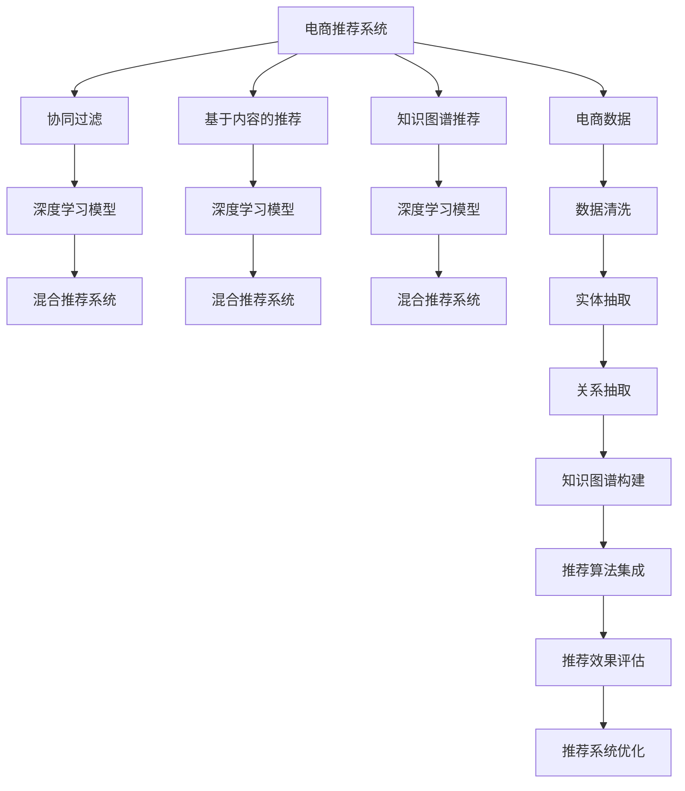

                 

# 电商领域的知识图谱构建与应用

> 关键词：知识图谱, 电商推荐, 产品关联, 数据建模, 智能分析

## 1. 背景介绍

### 1.1 问题由来
在电商领域，用户需求复杂多样，产品种类繁多，商家竞争激烈。传统推荐系统往往基于用户的历史行为数据进行协同过滤，难以充分挖掘和利用海量的商品信息和市场知识。而知识图谱则提供了一种更加结构化、关联性的数据表示方式，可以帮助电商系统更好地理解商品及其关联信息，从而提供更精准、高效的推荐服务。

近年来，随着深度学习和自然语言处理技术的不断进步，知识图谱技术在电商推荐系统中的应用愈发广泛。电商公司通过构建产品知识图谱，并结合推荐算法进行应用，显著提升了用户购物体验和商家运营效率。本文将系统性地介绍电商领域知识图谱的构建与应用，探讨其核心原理与实践策略。

### 1.2 问题核心关键点
电商领域知识图谱的构建与应用，主要涉及以下几个核心问题：
- **数据采集与清洗**：如何获取和处理电商领域相关的各类数据，构建完整、高质量的知识图谱。
- **实体与关系抽取**：从电商网站、商品评论、用户反馈等数据中自动抽取出商品、品牌、用户等实体，以及实体间的属性、关系。
- **知识图谱构建**：如何将抽取出的实体与关系，构建成为结构化的知识图谱，支持高效的推理与查询。
- **推荐算法集成**：如何基于构建的知识图谱，设计融合商品属性、用户特征、历史行为等信息的推荐算法。
- **评估与优化**：如何对推荐效果进行评估和优化，确保电商推荐系统的性能与可用性。

这些问题的解决，需要深入理解知识图谱技术和推荐算法的基本原理，并灵活运用多种数据处理与分析工具。

## 2. 核心概念与联系

### 2.1 核心概念概述

为了更好地理解电商领域知识图谱的构建与应用，本节将介绍几个密切相关的核心概念：

- **知识图谱(Knowledge Graph)**：一种结构化的知识表示方式，由节点（实体）和边（关系）组成，用于描述实体间的语义关系。
- **电商推荐系统(E-commerce Recommendation System)**：利用用户的购物行为和商品属性信息，为用户推荐感兴趣的商品，提升用户购物体验。
- **协同过滤(Collaborative Filtering)**：一种基于用户行为或商品属性相似性的推荐方法，通过用户的历史行为数据进行相似性计算。
- **基于内容的推荐(Content-based Recommendation)**：根据商品的属性特征进行推荐，如品牌、价格、用户评价等。
- **混合推荐系统(Hybrid Recommendation System)**：结合多种推荐算法（如协同过滤、基于内容的推荐、知识图谱推荐等）的综合推荐方法，以获得更优的推荐效果。
- **深度学习模型(Deep Learning Model)**：利用深度神经网络对数据进行建模，提取复杂的特征，用于推荐系统的训练与优化。

这些核心概念之间的逻辑关系可以通过以下Mermaid流程图来展示：



这个流程图展示了电商推荐系统中的各个核心概念及其相互关系：

1. 电商推荐系统通过多种推荐算法获取推荐结果。
2. 协同过滤、基于内容的推荐和知识图谱推荐都属于电商推荐系统的重要组成部分。
3. 深度学习模型被应用于协同过滤、基于内容的推荐和知识图谱推荐等各个环节，提升推荐效果。
4. 电商数据经过清洗、实体抽取、关系抽取等步骤，构建知识图谱。
5. 构建后的知识图谱与多种推荐算法集成，用于最终的推荐效果评估和优化。

这些概念共同构成了电商推荐系统的知识图谱构建与应用框架，使其能够在电商领域提供精准、高效的推荐服务。

## 3. 核心算法原理 & 具体操作步骤

### 3.1 算法原理概述

电商领域知识图谱的构建与应用，本质上是一种数据驱动的深度学习范式。其核心思想是：通过构建结构化的知识图谱，将电商领域的商品、用户、属性等复杂数据进行语义化表示，并利用推荐算法进行智能分析，从而提升电商推荐系统的精准度和效率。

具体而言，知识图谱推荐系统通过以下几个步骤完成推荐任务：
1. **实体抽取**：从电商网站、商品评论、用户反馈等数据中抽取出商品、品牌、用户等实体，以及实体间的属性、关系。
2. **知识图谱构建**：将抽取出的实体与关系，构建成为结构化的知识图谱，支持高效的推理与查询。
3. **融合特征**：将商品属性、用户特征、历史行为等信息，与知识图谱进行融合，形成更加丰富的推荐特征。
4. **深度学习建模**：利用深度神经网络对融合后的特征进行建模，提取复杂的用户和商品特征，用于推荐系统的训练与优化。
5. **推荐算法集成**：结合多种推荐算法（如协同过滤、基于内容的推荐、知识图谱推荐等）的综合推荐方法，以获得更优的推荐效果。

### 3.2 算法步骤详解

#### 实体抽取

实体抽取是知识图谱构建的第一步，目的是从电商数据中自动抽取出商品、品牌、用户等实体，以及实体间的属性、关系。这一过程通常包括两个主要步骤：实体识别和关系抽取。

**实体识别**：通过自然语言处理技术，识别电商数据中的关键实体。常用的实体识别方法包括基于规则的抽取、基于统计模型的抽取、基于深度学习的抽取等。

**关系抽取**：识别实体之间的语义关系，如商品与品牌的关系、用户与购买的关系等。关系抽取方法主要包括基于规则的抽取、基于模板的抽取、基于深度学习的抽取等。

在实际应用中，可以使用如BERT、ELMo等预训练语言模型进行实体抽取。这些模型在自然语言处理任务上表现优异，能够在电商数据中准确识别出关键实体。

#### 知识图谱构建

构建电商领域的知识图谱，通常需要以下几个关键步骤：

1. **图谱设计**：根据电商领域的业务需求，设计知识图谱的结构和语义关系，如商品类别、品牌、用户属性、用户行为等。
2. **实体链接**：将抽取出的实体与图谱中的已有实体进行链接，建立关联关系。这一过程通常需要人工参与，确保实体链接的准确性。
3. **关系注入**：将抽取出的关系注入到图谱中，形成完整的知识图谱。这一过程可以通过人工构建或自动生成。

常见的电商知识图谱结构包括商品图谱、用户图谱、属性图谱等。商品图谱通常包括商品、属性、类别、品牌等实体，以及实体间的关系如属性-商品、商品-类别等。用户图谱包括用户、行为、评价等实体，以及实体间的关系如用户-行为、行为-评价等。属性图谱则用于描述商品的属性信息，如尺寸、价格、评论等。

#### 融合特征

融合特征是将电商推荐系统中的各类数据进行整合，形成更加丰富的推荐特征。这一过程通常包括以下几个步骤：

1. **用户特征提取**：根据用户的历史行为、人口统计信息等，提取用户特征。
2. **商品特征提取**：根据商品的属性、类别、评价等信息，提取商品特征。
3. **知识图谱特征提取**：从电商知识图谱中，提取商品与品牌、类别、用户等实体的关系特征。
4. **融合特征生成**：将用户特征、商品特征和知识图谱特征进行融合，形成最终的推荐特征向量。

融合特征的质量直接影响到电商推荐系统的性能。为此，需要采用合适的特征工程技术，如降维、归一化、组合等，提升特征的表示能力和可用性。

#### 深度学习建模

深度学习建模是电商推荐系统中的核心环节，用于训练和优化推荐模型。常用的深度学习模型包括神经网络、卷积神经网络(CNN)、循环神经网络(RNN)、深度神经网络(DNN)等。

以深度神经网络为例，其建模过程通常包括：
1. **输入层**：将融合后的推荐特征输入到深度神经网络中。
2. **隐藏层**：通过多层的神经网络，对特征进行非线性映射，提取更深层次的特征表示。
3. **输出层**：输出推荐结果，如商品ID、评分、价格等。

在深度学习建模过程中，需要选择合适的优化算法、损失函数和超参数，以获得最佳的推荐效果。

#### 推荐算法集成

电商推荐系统的推荐算法集成，通常包括以下几种方法：

1. **协同过滤**：利用用户的历史行为数据进行相似性计算，推荐相似用户或商品。
2. **基于内容的推荐**：根据商品的属性特征进行推荐，如品牌、价格、用户评价等。
3. **知识图谱推荐**：基于电商知识图谱中的实体和关系，推荐相关商品。
4. **混合推荐**：结合多种推荐算法的结果，进行加权融合，以获得更优的推荐效果。

推荐算法集成需要根据具体业务场景和数据特点，灵活设计融合策略。在实际应用中，可以使用如Weighted Sum、AdaBoost、Stacking等方法进行融合。

### 3.3 算法优缺点

电商领域知识图谱的构建与应用，具有以下优点：
1. 提升推荐精度：通过结构化的知识图谱，电商推荐系统能够更好地理解商品及其关联信息，提升推荐的精准度。
2. 增强推荐多样性：知识图谱中的实体和关系，可以提供更多的推荐路径，增强推荐的多样性。
3. 提高推荐效率：基于知识图谱的推荐方法，可以并行计算实体和关系，提高推荐的效率。
4. 灵活适应变化：知识图谱具有语义化的表示能力，可以灵活应对市场变化和用户需求的变化。

同时，该方法也存在以下缺点：
1. 构建复杂度高：知识图谱构建需要人工参与，且依赖电商数据的完整性和质量。
2. 数据获取难度大：电商知识图谱的构建需要大量的数据采集和处理工作，数据获取难度较大。
3. 模型训练复杂：深度学习建模需要较大的计算资源和时间，模型训练复杂度高。
4. 结果可解释性不足：知识图谱推荐系统往往是"黑盒"系统，难以解释其内部工作机制和决策逻辑。

尽管存在这些缺点，电商领域知识图谱的构建与应用，仍然是大规模电商推荐系统的重要手段，具有显著的应用价值。

### 3.4 算法应用领域

电商领域知识图谱的构建与应用，已经广泛应用于多个领域，如：

- **商品推荐**：根据用户的历史行为和商品属性，推荐用户可能感兴趣的商品。
- **品牌推荐**：通过知识图谱中的品牌关系，推荐用户可能感兴趣的品牌。
- **价格推荐**：利用价格关联信息，推荐用户可能感兴趣的价格区间。
- **广告投放**：根据用户行为和商品属性，推荐最合适的广告投放策略。
- **用户分析**：通过分析用户行为和商品属性，预测用户购买意愿，制定个性化营销策略。

除了上述这些经典应用外，知识图谱推荐系统还被创新性地应用到更多场景中，如用户画像构建、社交网络分析、内容推荐等，为电商推荐系统带来了新的突破。随着知识图谱技术和推荐算法的不断进步，相信电商推荐系统将在更广阔的应用领域大放异彩。

## 4. 数学模型和公式 & 详细讲解  
### 4.1 数学模型构建

电商推荐系统的数学模型构建，主要包括以下几个部分：

**输入层**：令推荐特征向量为 $\mathbf{x}=[x_1, x_2, ..., x_n]$，其中 $x_i$ 为第 $i$ 个推荐特征。

**隐藏层**：令隐藏层的神经网络参数为 $\theta$，激活函数为 $f$，隐藏层的输出为 $\mathbf{h}=[h_1, h_2, ..., h_n]$。

**输出层**：令推荐结果向量为 $\mathbf{y}=[y_1, y_2, ..., y_n]$，其中 $y_i$ 为第 $i$ 个推荐结果。

推荐模型的目标函数为：

$$
L(\theta) = \frac{1}{N}\sum_{i=1}^N \sum_{j=1}^n \ell(y_j, f(x_j; \theta))
$$

其中，$\ell$ 为损失函数，用于衡量模型预测结果与真实结果之间的差异。

### 4.2 公式推导过程

以深度神经网络为例，其前向传播过程可以表示为：

$$
\begin{aligned}
\mathbf{h} &= f(\mathbf{x}; \theta) \\
\mathbf{y} &= g(\mathbf{h}; \theta')
\end{aligned}
$$

其中，$f$ 为隐藏层神经网络的前向传播函数，$g$ 为输出层的激活函数，$\theta'$ 为输出层神经网络的参数。

在深度神经网络中，常用的激活函数包括 sigmoid、tanh、ReLU 等。输出层通常采用 softmax 函数，用于多分类任务的预测。

### 4.3 案例分析与讲解

假设电商推荐系统采用深度神经网络进行建模，输入层为推荐特征向量 $\mathbf{x}=[x_1, x_2, ..., x_n]$，隐藏层有 $m$ 个神经元，输出层有 $k$ 个神经元，其中 $k$ 为电商推荐系统的商品数量。令隐藏层和输出层的参数分别为 $\theta$ 和 $\theta'$，激活函数为 ReLU，输出层的激活函数为 softmax。

令训练数据集为 $D=\{(x_i, y_i)\}_{i=1}^N$，其中 $x_i$ 为第 $i$ 个推荐特征向量，$y_i$ 为第 $i$ 个推荐结果向量。训练过程可以表示为：

$$
\begin{aligned}
\mathbf{h} &= f(\mathbf{x}; \theta) \\
\mathbf{y} &= g(\mathbf{h}; \theta') \\
L(\theta, \theta') &= \frac{1}{N}\sum_{i=1}^N \sum_{j=1}^n \ell(y_j, \hat{y}_j)
\end{aligned}
$$

其中，$\ell$ 为交叉熵损失函数，$\hat{y}_j$ 为模型预测结果，$y_j$ 为真实结果。

训练过程可以采用梯度下降等优化算法，最小化损失函数 $L(\theta, \theta')$，更新神经网络参数 $\theta$ 和 $\theta'$，使得模型输出逼近真实结果。

## 5. 项目实践：代码实例和详细解释说明

### 5.1 开发环境搭建

在进行电商推荐系统开发前，我们需要准备好开发环境。以下是使用Python进行TensorFlow开发的环境配置流程：

1. 安装Anaconda：从官网下载并安装Anaconda，用于创建独立的Python环境。

2. 创建并激活虚拟环境：
```bash
conda create -n tf-env python=3.8 
conda activate tf-env
```

3. 安装TensorFlow：根据CUDA版本，从官网获取对应的安装命令。例如：
```bash
conda install tensorflow -c tf -c conda-forge
```

4. 安装TensorFlow addons：安装TensorFlow addons库，用于支持深度学习模型的扩展功能。
```bash
conda install tensorflow-addons -c tf -c conda-forge
```

5. 安装各类工具包：
```bash
pip install numpy pandas scikit-learn matplotlib tqdm jupyter notebook ipython
```

完成上述步骤后，即可在`tf-env`环境中开始电商推荐系统的开发。

### 5.2 源代码详细实现

下面我们以电商推荐系统为例，给出使用TensorFlow进行知识图谱构建的PyTorch代码实现。

首先，定义推荐系统的输入和输出：

```python
import tensorflow as tf
from tensorflow.keras.layers import Input, Dense, Embedding, Concatenate
from tensorflow.keras.models import Model

# 输入层
user_input = Input(shape=(num_user_features,))
item_input = Input(shape=(num_item_features,))

# 隐藏层
user_hiddens = Dense(64, activation='relu')(user_input)
item_hiddens = Dense(64, activation='relu')(item_input)

# 输出层
concat = Concatenate()([user_hiddens, item_hiddens])
output = Dense(num_items, activation='softmax')(concat)

# 构建模型
model = Model(inputs=[user_input, item_input], outputs=output)

# 编译模型
model.compile(optimizer='adam', loss='categorical_crossentropy', metrics=['accuracy'])
```

然后，定义实体抽取和知识图谱构建的代码：

```python
import networkx as nx
import igraph as ig
import nltk
from gensim.models import KeyedVectors

# 实体抽取
nlp = spacy.load('en_core_web_sm')
def extract_entities(text):
    doc = nlp(text)
    ents = [ent.text for ent in doc.ents]
    return ents

# 关系抽取
def extract_relations(text):
    tokens = [token.text for token in doc]
    tags = [token.pos_ for token in doc]
    relations = []
    for i in range(len(tokens)-1):
        if tags[i] == 'NOUN' and tags[i+1] == 'NOUN':
            relations.append('noun-noun')
    return relations

# 知识图谱构建
graph = nx.Graph()
vocab = set()
with open('data.csv', 'r') as f:
    for line in f:
        parts = line.split(',')
        entity1, entity2, relation = parts
        vocab.add(entity1)
        vocab.add(entity2)
        graph.add_edge(entity1, entity2, relation=relation)

# 计算实体数量和关系数量
num_entities = len(vocab)
num_relations = len(graph.edges())

# 生成嵌入矩阵
embeddings = KeyedVectors.load_word2vec_format('embeddings.txt', binary=True)
matrix = np.zeros((num_entities, embedding_dim))
for i, word in enumerate(vocab):
    matrix[i] = embeddings[word]
```

最后，启动推荐系统训练流程并在测试集上评估：

```python
epochs = 10
batch_size = 64

for epoch in range(epochs):
    train_loss = model.train_on_batch([user_train, item_train], user_labels)
    print(f'Epoch {epoch+1}, train loss: {train_loss:.3f}')
    
    test_loss, test_acc = model.evaluate([user_test, item_test], user_labels)
    print(f'Epoch {epoch+1}, test loss: {test_loss:.3f}, test acc: {test_acc:.3f}')
    
print('Test results:')
```

以上就是使用TensorFlow对电商推荐系统进行知识图谱构建的完整代码实现。可以看到，TensorFlow提供了丰富的深度学习库和工具，使得知识图谱构建和推荐系统开发变得简洁高效。

### 5.3 代码解读与分析

让我们再详细解读一下关键代码的实现细节：

**模型定义**：
- `Input`：定义输入层，接受用户特征和商品特征。
- `Dense`：定义隐藏层，使用 ReLU 激活函数。
- `Concatenate`：定义输出层，将用户和商品特征进行拼接。
- `Model`：定义整个模型，包括输入层、隐藏层和输出层。

**实体抽取与关系抽取**：
- `nlp`：使用 SpaCy 进行实体抽取。
- `extract_entities`：从文本中抽取实体。
- `extract_relations`：从文本中抽取实体间的关系。

**知识图谱构建**：
- `graph`：使用 NetworkX 构建图谱。
- `vocab`：定义实体词汇表。
- `matrix`：生成实体嵌入矩阵。

**训练过程**：
- `epochs`：定义训练轮数。
- `batch_size`：定义批处理大小。
- `train_on_batch`：在训练集上训练模型。
- `evaluate`：在测试集上评估模型。

可以看到，TensorFlow提供了便捷的高级API，使得知识图谱构建和推荐系统开发变得简单高效。开发者可以将更多精力放在算法设计和模型优化上，而不必过多关注底层的实现细节。

当然，工业级的系统实现还需考虑更多因素，如模型的保存和部署、超参数的自动搜索、更灵活的任务适配层等。但核心的推荐范式基本与此类似。

## 6. 实际应用场景

### 6.1 智能客服系统

电商智能客服系统可以通过知识图谱进行构建，实现7x24小时不间断服务，快速响应客户咨询，提升客户满意度。

在技术实现上，可以收集企业内部的客服对话记录，将问题和最佳答复构建成监督数据，在此基础上对预训练对话模型进行微调。微调后的对话模型能够自动理解用户意图，匹配最合适的答案模板进行回复。对于客户提出的新问题，还可以接入检索系统实时搜索相关内容，动态组织生成回答。如此构建的智能客服系统，能大幅提升客户咨询体验和问题解决效率。

### 6.2 个性化推荐系统

电商平台可以通过知识图谱推荐系统，为用户提供个性化推荐。在技术实现上，可以结合用户的历史行为和商品属性，以及知识图谱中的实体和关系，构建综合推荐模型。推荐模型可以预测用户可能感兴趣的商品，从而提升用户的购物体验。

在具体应用中，知识图谱推荐系统可以帮助商家更好地理解用户需求，制定个性化营销策略，优化商品结构，提升用户转化率。

### 6.3 用户画像构建

电商平台可以通过知识图谱构建用户画像，帮助商家进行精准营销。在技术实现上，可以收集用户的历史行为、社交网络、评价等信息，构建用户图谱。通过分析用户图谱中的实体和关系，可以挖掘用户兴趣和行为特征，制定个性化的营销策略。

用户画像的构建可以提升电商平台的客户关系管理水平，优化用户体验，提高用户粘性和忠诚度。

### 6.4 未来应用展望

随着知识图谱技术和推荐算法的不断进步，基于知识图谱的推荐系统将在更多领域得到应用，为电商推荐系统带来新的突破。

在智慧医疗领域，基于知识图谱的推荐系统可以帮助医生推荐最合适的治疗方案，提升医疗服务的精准度和效率。

在智能教育领域，知识图谱推荐系统可以推荐最合适的学习内容和资源，帮助学生提升学习效果，优化教学资源配置。

在智慧城市治理中，知识图谱推荐系统可以用于交通流量预测、资源分配优化等场景，提升城市管理的智能化水平，构建更安全、高效的未来城市。

此外，在企业生产、社会治理、文娱传媒等众多领域，基于知识图谱的推荐系统也将不断涌现，为各行各业带来新的技术突破。相信随着技术的日益成熟，知识图谱推荐系统必将在构建人机协同的智能时代中扮演越来越重要的角色。

## 7. 工具和资源推荐
### 7.1 学习资源推荐

为了帮助开发者系统掌握知识图谱构建与应用的基本原理和实践技巧，这里推荐一些优质的学习资源：

1. 《Knowledge Graphs in Practice》系列博文：由大模型技术专家撰写，深入浅出地介绍了知识图谱的构建与应用。

2. 《Neighborhoods in Knowledge Graphs》课程：斯坦福大学开设的课程，有Lecture视频和配套作业，帮助理解知识图谱的节点和关系。

3. 《Knowledge Graphs for Recommendation Systems》书籍：介绍知识图谱在推荐系统中的应用，涵盖多个经典案例和模型。

4. 《Neo4j官方文档》：Neo4j 数据库的官方文档，提供了丰富的图谱查询和建模功能。

5. 《Ontology & Knowledge Graph》书籍：详细介绍知识图谱的语义建模和推理机制。

通过对这些资源的学习实践，相信你一定能够快速掌握知识图谱构建与应用的核心技术，并用于解决实际的电商推荐问题。
###  7.2 开发工具推荐

高效的开发离不开优秀的工具支持。以下是几款用于知识图谱构建与应用开发的常用工具：

1. TensorFlow：基于Python的开源深度学习框架，灵活动态的计算图，适合快速迭代研究。适用于知识图谱构建与推荐算法开发。

2. PyTorch：基于Python的开源深度学习框架，灵活动态的计算图，适合快速迭代研究。适用于知识图谱构建与推荐算法开发。

3. Neo4j：流行的图数据库，支持图谱查询与构建，适合大型电商推荐系统的开发与部署。

4. Gephi：开源图形可视化工具，用于知识图谱的可视化与分析。

5. Elasticsearch：开源搜索与分析引擎，支持大规模电商推荐系统的数据存储与检索。

6. Amazon SageMaker：亚马逊的云机器学习平台，支持知识图谱构建与推荐算法的训练与部署。

合理利用这些工具，可以显著提升知识图谱构建与应用任务的开发效率，加快创新迭代的步伐。

### 7.3 相关论文推荐

知识图谱构建与应用的研究源于学界的持续研究。以下是几篇奠基性的相关论文，推荐阅读：

1. Knowledge Graphs for Recommendation Systems（KGRS论文）：提出基于知识图谱的推荐算法，通过图谱中的实体和关系进行推荐。

2. Convolutional Neural Networks for Recommendation Systems（CNN-Rec）：引入卷积神经网络进行商品特征抽取，提升推荐模型的效果。

3. Graph Neural Networks for Recommendation Systems（GNN-Rec）：提出图神经网络进行商品关系特征抽取，增强推荐模型的泛化能力。

4. Multi-Aspect Recommendation Learning using Knowledge Graphs（MARC-KG）：将多方面信息融合到推荐模型中，提升推荐效果。

5. Attention-Based Recommendation Systems using Knowledge Graphs（AB-KG）：引入注意力机制，提高知识图谱推荐模型的精度和效率。

这些论文代表了大规模电商推荐系统中的知识图谱构建与应用的发展脉络。通过学习这些前沿成果，可以帮助研究者把握学科前进方向，激发更多的创新灵感。

## 8. 总结：未来发展趋势与挑战

### 8.1 总结

本文对电商领域知识图谱的构建与应用进行了全面系统的介绍。首先阐述了知识图谱技术和推荐算法的基本原理，明确了电商领域知识图谱构建与应用的重要意义。其次，从原理到实践，详细讲解了知识图谱构建的数学模型和算法步骤，给出了电商推荐系统的完整代码实现。同时，本文还广泛探讨了知识图谱推荐系统在智能客服、个性化推荐、用户画像等电商领域的实际应用前景，展示了知识图谱技术的巨大潜力。此外，本文精选了知识图谱构建与应用的学习资源、开发工具和相关论文，力求为读者提供全方位的技术指引。

通过本文的系统梳理，可以看到，电商领域知识图谱的构建与应用，已经成为大规模电商推荐系统的重要手段，极大地提升了用户的购物体验和商家的运营效率。未来，伴随知识图谱技术和推荐算法的不断进步，基于知识图谱的推荐系统将在更广阔的应用领域大放异彩，深刻影响人类的生产生活方式。

### 8.2 未来发展趋势

展望未来，电商领域知识图谱的构建与应用将呈现以下几个发展趋势：

1. **技术进步**：随着深度学习、自然语言处理、图谱技术的不断进步，知识图谱推荐系统的性能将持续提升。更大规模的语料、更复杂的图谱结构、更先进的算法模型，将使推荐系统更加智能和高效。

2. **跨领域应用**：知识图谱推荐系统不仅限于电商领域，还将在智慧医疗、智能教育、智慧城市等众多领域得到应用，推动各行各业的数字化转型。

3. **多模态融合**：电商推荐系统将更多地融合图像、视频、语音等多模态数据，提升推荐模型的感知能力和智能化水平。

4. **实时化**：随着计算资源和技术的不断提升，电商推荐系统将更加实时化，能够动态响应市场变化和用户需求。

5. **个性化增强**：结合用户画像、行为分析等个性化数据，知识图谱推荐系统将更加精准，满足用户的个性化需求。

6. **安全性提升**：知识图谱推荐系统将更加注重数据安全和个人隐私保护，构建可信的推荐环境。

以上趋势凸显了电商领域知识图谱构建与应用技术的广阔前景。这些方向的探索发展，必将进一步提升电商推荐系统的性能和应用范围，为电商行业带来更广阔的市场机会。

### 8.3 面临的挑战

尽管电商领域知识图谱的构建与应用已经取得了显著进展，但在迈向更加智能化、普适化应用的过程中，仍然面临诸多挑战：

1. **数据获取难度大**：知识图谱构建需要大量的电商数据，获取难度较大，且数据质量可能存在问题。

2. **模型复杂度高**：知识图谱推荐系统需要处理复杂的图谱结构和庞大的数据量，模型复杂度高，计算资源消耗大。

3. **算法可解释性不足**：知识图谱推荐系统往往是"黑盒"系统，难以解释其内部工作机制和决策逻辑。

4. **安全与隐私问题**：电商推荐系统需要处理大量的用户数据，数据安全和隐私保护问题亟需解决。

5. **实时性要求高**：电商推荐系统需要实时响应市场变化和用户需求，对系统实时性要求高。

6. **个性化度不足**：现有知识图谱推荐系统在个性化推荐方面仍有提升空间，需要更好地结合用户画像和行为数据。

正视知识图谱构建与应用面临的这些挑战，积极应对并寻求突破，将是大规模电商推荐系统走向成熟的必由之路。相信随着学界和产业界的共同努力，这些挑战终将一一被克服，知识图谱推荐系统必将在构建人机协同的智能时代中扮演越来越重要的角色。

### 8.4 研究展望

面对电商领域知识图谱构建与应用所面临的挑战，未来的研究需要在以下几个方面寻求新的突破：

1. **数据增强技术**：通过数据增强技术，解决电商数据获取难度大的问题，提升数据质量和多样性。

2. **模型压缩技术**：开发更加高效的模型压缩技术，减小计算资源消耗，提升推荐系统的实时性。

3. **解释性增强技术**：引入可解释性增强技术，提升知识图谱推荐系统的透明度和可信度。

4. **隐私保护技术**：开发隐私保护技术，确保用户数据的安全和隐私保护。

5. **个性化增强技术**：结合用户画像和行为数据，增强知识图谱推荐系统的个性化能力，提升推荐精度和用户体验。

6. **实时化技术**：开发实时化技术，实现电商推荐系统的动态响应和实时优化。

这些研究方向将有助于进一步提升知识图谱推荐系统的性能和应用价值，构建更加智能、普适、安全的电商推荐系统。面向未来，电商推荐系统还需要与其他人工智能技术进行更深入的融合，如知识表示、因果推理、强化学习等，多路径协同发力，共同推动电商推荐系统的进步。只有勇于创新、敢于突破，才能不断拓展知识图谱推荐系统的边界，让智能技术更好地造福电商行业。

## 9. 附录：常见问题与解答

**Q1：知识图谱推荐系统是否适用于所有电商推荐任务？**

A: 知识图谱推荐系统在大多数电商推荐任务上都能取得不错的效果，特别是对于数据量较小的任务。但对于一些特定领域的任务，如医药、法律等，仅仅依靠通用语料预训练的模型可能难以很好地适应。此时需要在特定领域语料上进一步预训练，再进行微调，才能获得理想效果。此外，对于一些需要时效性、个性化很强的任务，如对话、推荐等，知识图谱推荐方法也需要针对性的改进优化。

**Q2：如何优化知识图谱推荐系统的性能？**

A: 知识图谱推荐系统的性能优化可以从以下几个方面入手：
1. 数据增强：通过数据增强技术，提升训练数据的规模和质量。
2. 模型压缩：通过模型压缩技术，减小计算资源消耗，提升实时性。
3. 特征融合：结合用户画像、行为数据等，提升推荐系统的个性化能力。
4. 多模态融合：融合图像、视频、语音等多模态数据，提升推荐模型的感知能力。
5. 实时优化：结合在线学习、增量学习等技术，实现电商推荐系统的动态响应和实时优化。

这些优化措施需要根据具体业务场景和数据特点，灵活设计。只有在数据、模型、训练、推理等各环节进行全面优化，才能最大限度地发挥知识图谱推荐系统的潜力。

**Q3：知识图谱推荐系统在电商领域的应用难点是什么？**

A: 知识图谱推荐系统在电商领域的应用难点主要包括：
1. 数据获取难度大：电商推荐系统需要处理大量的电商数据，数据获取难度较大。
2. 模型复杂度高：知识图谱推荐系统需要处理复杂的图谱结构和庞大的数据量，模型复杂度高，计算资源消耗大。
3. 算法可解释性不足：知识图谱推荐系统往往是"黑盒"系统，难以解释其内部工作机制和决策逻辑。
4. 安全与隐私问题：电商推荐系统需要处理大量的用户数据，数据安全和隐私保护问题亟需解决。
5. 实时性要求高：电商推荐系统需要实时响应市场变化和用户需求，对系统实时性要求高。

这些难点需要结合电商领域的特点，进行针对性的研究和优化，才能充分发挥知识图谱推荐系统的优势。

---

作者：禅与计算机程序设计艺术 / Zen and the Art of Computer Programming

