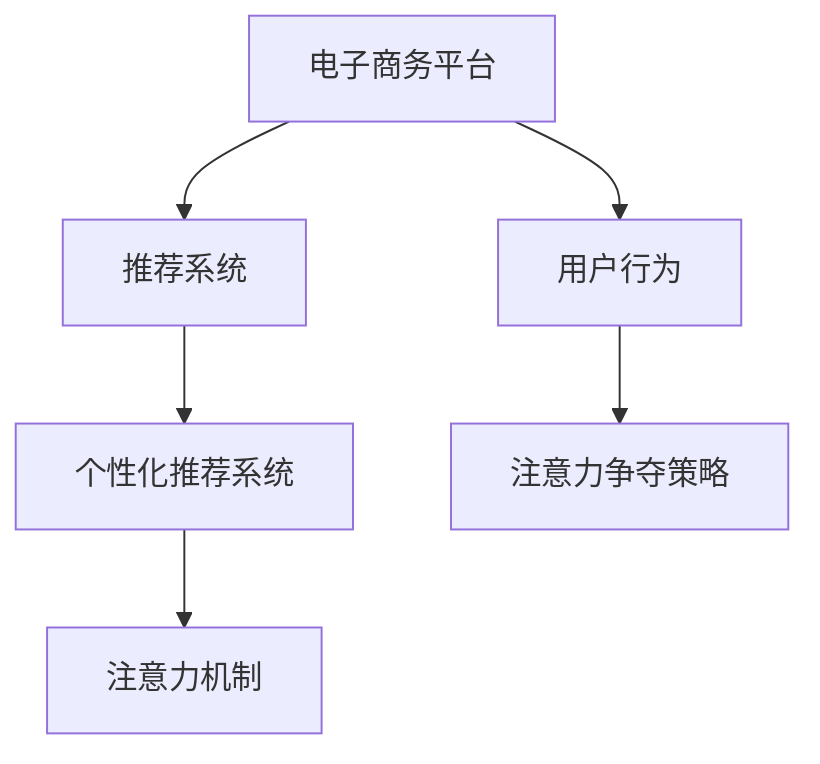

                 

# 电子商务平台的注意力争夺策略

> 关键词：电子商务, 注意力机制, 用户行为, 推荐系统, 个性化

## 1. 背景介绍

### 1.1 问题由来
随着互联网的迅猛发展，电子商务平台成为了人们日常购物的重要渠道。但用户数量众多且需求多样化，导致平台在吸引和保持用户注意力方面面临着巨大挑战。如何通过合理设计策略，优化用户行为，提升用户满意度，进而实现平台业绩的增长，成为电商行业亟需解决的问题。

### 1.2 问题核心关键点
注意力争夺策略的核心在于如何通过优化用户行为，提升用户黏性。具体策略包括推荐系统的个性化设计、广告投放的精准度优化、内容推送的及时性、界面设计的吸引性等。本文将聚焦于推荐系统中的注意力机制，通过对其原理和实现方法进行详细阐述，为电商平台设计有效的注意力争夺策略提供理论支持和实践指导。

### 1.3 问题研究意义
在电商平台上，注意力争夺策略的好坏直接影响到用户的购买决策和平台的用户留存率。优化注意力机制，能够提升用户体验，增加用户粘性，促进用户参与度和转化率。此外，通过合理的注意力机制设计，还能提升广告的点击率和转化率，最大化商业价值。

## 2. 核心概念与联系

### 2.1 核心概念概述

为更好地理解注意力争夺策略，本节将介绍几个关键概念：

- **电子商务平台(E-Commerce Platform)**：基于互联网的在线购物平台，如Amazon、淘宝、京东等。用户可以通过平台浏览商品、比价、购买等，享受便利的购物体验。

- **推荐系统(Recommendation System)**：基于用户历史行为数据，预测用户偏好，并推荐符合用户兴趣的商品或内容的技术。推荐系统是电商平台吸引用户注意力，提升用户转化率的关键工具。

- **用户行为(User Behavior)**：用户在电商平台上的操作记录，如浏览、点击、加入购物车、购买等。通过对用户行为的分析，可以设计出更有效的推荐策略和注意力争夺策略。

- **个性化推荐系统(Personalized Recommendation System)**：利用用户行为数据，结合机器学习和自然语言处理技术，为用户量身定制商品或内容推荐。通过个性化推荐，可以显著提升用户满意度和平台销售额。

- **注意力机制(Attention Mechanism)**：机器学习模型中用于对输入信息的重要程度进行权重的机制。通过引入注意力机制，模型可以聚焦于用户行为中关键的特征，提高推荐系统的准确性和用户满意度。

这些核心概念之间的逻辑关系可以通过以下Mermaid流程图来展示：



这个流程图展示了注意力争夺策略的核心概念及其之间的关系：

1. 电子商务平台通过推荐系统为用户推荐商品，提升用户体验。
2. 推荐系统中的个性化推荐系统，结合用户行为数据，优化推荐策略。
3. 个性化推荐系统中引入注意力机制，提高推荐的准确性和用户满意度。
4. 用户行为数据是注意力争夺策略的基础，通过优化用户行为，增强用户黏性。

## 3. 核心算法原理 & 具体操作步骤
### 3.1 算法原理概述

在推荐系统中引入注意力机制的核心理念是，根据用户的行为特征，动态调整推荐内容的重要程度。模型的输出不再是每个特征的简单线性组合，而是通过加权平均，聚焦于用户最关心的特征，提高推荐的质量。

形式化地，假设推荐模型为 $M_{\theta}$，其中 $\theta$ 为模型参数。设用户的历史行为为 $D=\{(x_i,y_i)\}_{i=1}^N$，其中 $x_i$ 为行为特征，$y_i$ 为对应的购买行为。推荐系统的目标是最小化预测错误率，即：

$$
\theta^* = \mathop{\arg\min}_{\theta} \mathcal{L}(M_{\theta},D)
$$

其中 $\mathcal{L}$ 为交叉熵损失函数，衡量模型预测输出与实际购买行为之间的差异。引入注意力机制后，模型的输出变为：

$$
\hat{y}_i = \sum_{k=1}^K \alpha_{k,i} M_{\theta}(x_{i,k})
$$

其中 $K$ 为特征维度，$\alpha_{k,i}$ 为第 $k$ 个特征对用户 $i$ 的重要性权重，由注意力模型计算得到。

### 3.2 算法步骤详解

基于注意力机制的推荐系统实现步骤如下：

**Step 1: 准备数据集**

1. 收集用户的历史行为数据 $D=\{(x_i,y_i)\}_{i=1}^N$。
2. 提取用户行为特征 $x_i \in \mathbb{R}^K$。
3. 将用户行为与购买行为 $y_i$ 关联起来，构建监督数据集。

**Step 2: 设计注意力模型**

1. 选择合适的注意力模型，如多头自注意力模型(MLP Multi-Head Attention)。
2. 将用户行为特征 $x_i$ 输入到注意力模型中，计算每个特征的重要性权重 $\alpha_{k,i}$。
3. 对权重进行归一化处理，确保 $\sum_{k=1}^K \alpha_{k,i} = 1$。

**Step 3: 设计推荐模型**

1. 将注意力模型的输出作为推荐模型的输入。
2. 通过多层神经网络或线性回归模型，对推荐结果进行预测。
3. 利用交叉熵损失函数，训练推荐模型，优化权重 $\alpha_{k,i}$ 和模型参数 $\theta$。

**Step 4: 运行和评估**

1. 在测试集上评估推荐模型的性能，计算准确率、召回率、F1分数等指标。
2. 使用A/B测试等方法，对比引入注意力机制前后的推荐效果。
3. 根据用户反馈，进一步调整注意力模型和推荐模型的参数，优化推荐策略。

### 3.3 算法优缺点

引入注意力机制的推荐系统具有以下优点：

1. **准确性提升**：通过动态调整特征权重，模型可以更精确地预测用户购买行为。
2. **用户满意度提升**：根据用户最关心的特征进行推荐，提高用户的满意度和黏性。
3. **泛化能力增强**：由于权重是根据用户行为动态计算的，模型能够更好地适应不同的用户和场景。

然而，该方法也存在一定的局限性：

1. **计算复杂度增加**：引入注意力机制后，模型需要计算和存储额外的权重，增加了计算复杂度。
2. **特征选择困难**：需要选择合适的特征和权重计算方法，以避免过度关注某些噪声特征，影响推荐效果。
3. **数据稀疏性问题**：对于一些长尾商品或新用户，可能存在数据稀疏性问题，影响推荐效果。
4. **鲁棒性不足**：注意力机制对于噪声和异常数据的敏感性较高，可能导致模型泛化能力下降。

尽管存在这些局限性，但引入注意力机制的推荐系统在实际应用中已经展现出了显著的优势，成为电商平台推荐系统的重要技术之一。

### 3.4 算法应用领域

注意力机制在推荐系统中广泛应用，在电商平台上尤为突出，具体领域包括：

- **个性化商品推荐**：根据用户历史浏览、点击、购买记录，生成个性化的商品推荐列表。
- **内容推荐**：在电商平台的搜索、分类、社区等栏目，为用户推荐相关内容。
- **广告投放优化**：通过分析用户点击广告的行为，优化广告投放策略，提升广告转化率。
- **交叉销售推荐**：根据用户购买历史，推荐相关或互补的商品，增加用户购买量。

除了推荐系统，注意力机制还被应用于其他领域，如自然语言处理、图像识别、视频推荐等，为多模态数据的融合和分析提供了新的思路。

## 4. 数学模型和公式 & 详细讲解  
### 4.1 数学模型构建

引入注意力机制后，推荐系统的数学模型可表示为：

$$
\hat{y}_i = \sum_{k=1}^K \alpha_{k,i} M_{\theta}(x_{i,k})
$$

其中 $\alpha_{k,i}$ 为注意力权重，$M_{\theta}$ 为推荐模型，$x_{i,k}$ 为第 $k$ 个特征。

**注意力计算**：

$$
\alpha_{k,i} = \frac{\exp(e_{k,i})}{\sum_{k=1}^K \exp(e_{k,i})}
$$

其中 $e_{k,i}$ 为注意力计算函数，通常使用多头自注意力机制进行计算。

**推荐模型输出**：

$$
\hat{y}_i = M_{\theta}(\alpha_{k,i} x_{i,k})
$$

其中 $M_{\theta}$ 可以是多层神经网络或线性回归模型。

### 4.2 公式推导过程

注意力计算函数 $e_{k,i}$ 通常使用多头自注意力机制，其公式为：

$$
e_{k,i} = \sum_{j=1}^K \alpha_{j,i} h_k(x_{i,j})
$$

其中 $h_k$ 为特征映射函数，$\alpha_{j,i}$ 为注意力权重。

具体推导过程如下：

1. 对用户行为特征 $x_i$ 进行线性映射，得到投影向量 $h_k(x_i)$。
2. 计算用户行为特征 $x_i$ 与自身投影向量 $h_k(x_i)$ 的点积，得到 $e_{k,i}$。
3. 将 $e_{k,i}$ 输入softmax函数，计算注意力权重 $\alpha_{k,i}$。
4. 将注意力权重 $\alpha_{k,i}$ 与特征投影向量 $h_k(x_{i,k})$ 进行线性加权，得到推荐结果 $\hat{y}_i$。

### 4.3 案例分析与讲解

以下以商品推荐为例，详细讲解注意力机制的实现过程：

**案例背景**：假设某电商平台收集了用户的历史浏览记录，包含商品ID、浏览时间、点击次数等特征。平台希望根据用户的历史行为，为用户推荐可能感兴趣的商品。

**数据准备**：
1. 收集用户的历史浏览记录 $D=\{(x_i,y_i)\}_{i=1}^N$，其中 $x_i$ 为浏览记录特征，$y_i$ 为是否购买。
2. 提取用户行为特征 $x_i \in \mathbb{R}^K$，包括浏览时间、点击次数、商品ID等。
3. 将用户行为与购买行为 $y_i$ 关联起来，构建监督数据集。

**注意力模型设计**：
1. 选择合适的注意力模型，如多头自注意力模型。
2. 将用户行为特征 $x_i$ 输入到注意力模型中，计算每个特征的重要性权重 $\alpha_{k,i}$。
3. 对权重进行归一化处理，确保 $\sum_{k=1}^K \alpha_{k,i} = 1$。

**推荐模型设计**：
1. 将注意力模型的输出作为推荐模型的输入。
2. 通过多层神经网络或线性回归模型，对推荐结果进行预测。
3. 利用交叉熵损失函数，训练推荐模型，优化权重 $\alpha_{k,i}$ 和模型参数 $\theta$。

**运行和评估**：
1. 在测试集上评估推荐模型的性能，计算准确率、召回率、F1分数等指标。
2. 使用A/B测试等方法，对比引入注意力机制前后的推荐效果。
3. 根据用户反馈，进一步调整注意力模型和推荐模型的参数，优化推荐策略。

## 5. 项目实践：代码实例和详细解释说明
### 5.1 开发环境搭建

在进行注意力机制的推荐系统开发前，我们需要准备好开发环境。以下是使用Python进行PyTorch开发的环境配置流程：

1. 安装Anaconda：从官网下载并安装Anaconda，用于创建独立的Python环境。

2. 创建并激活虚拟环境：
```bash
conda create -n recommendation-env python=3.8 
conda activate recommendation-env
```

3. 安装PyTorch：根据CUDA版本，从官网获取对应的安装命令。例如：
```bash
conda install pytorch torchvision torchaudio cudatoolkit=11.1 -c pytorch -c conda-forge
```

4. 安装TensorFlow：
```bash
conda install tensorflow -c anaconda
```

5. 安装各类工具包：
```bash
pip install numpy pandas scikit-learn matplotlib tqdm jupyter notebook ipython
```

完成上述步骤后，即可在`recommendation-env`环境中开始注意力机制的推荐系统开发。

### 5.2 源代码详细实现

下面我们以电商平台商品推荐系统为例，给出使用PyTorch进行推荐系统开发的代码实现。

首先，定义数据处理函数：

```python
from torch.utils.data import Dataset
from torch import nn
import torch

class RecommendationDataset(Dataset):
    def __init__(self, data, seq_len):
        self.data = data
        self.seq_len = seq_len
        
    def __len__(self):
        return len(self.data)
    
    def __getitem__(self, item):
        user, item, label = self.data[item]
        user = torch.tensor(user)
        item = torch.tensor(item)
        label = torch.tensor(label, dtype=torch.long)
        return user, item, label
```

然后，定义注意力模型和推荐模型：

```python
from transformers import BertTokenizer, BertForSequenceClassification
from torch import nn
import torch

class Attention(nn.Module):
    def __init__(self, d_model, n_head):
        super(Attention, self).__init__()
        self.d_model = d_model
        self.n_head = n_head
        self.head_dim = d_model // n_head
        
        self.q = nn.Linear(d_model, d_model)
        self.k = nn.Linear(d_model, d_model)
        self.v = nn.Linear(d_model, d_model)
        self.o = nn.Linear(d_model, d_model)
        self.s = nn.Linear(d_model, 1)
        
    def forward(self, x):
        q = self.q(x)
        k = self.k(x)
        v = self.v(x)
        
        q = q.view(-1, self.n_head, self.head_dim).permute(1, 0, 2)
        k = k.view(-1, self.n_head, self.head_dim).permute(1, 0, 2)
        v = v.view(-1, self.n_head, self.head_dim).permute(1, 0, 2)
        
        s = self.s(x)
        scores = torch.matmul(q, k.transpose(1, 2)) / torch.sqrt(torch.tensor(self.head_dim))
        attn = nn.Softmax(dim=1)(scores)
        context = torch.matmul(attn, v)
        context = context.permute(1, 0, 2).contiguous().view(-1, self.d_model)
        
        return context, attn

class RecommendationModel(nn.Module):
    def __init__(self, d_model, n_head, d_ff, num_class):
        super(RecommendationModel, self).__init__()
        self.attention = Attention(d_model, n_head)
        self.fc = nn.Linear(d_model, num_class)
        
    def forward(self, x):
        attention, attn = self.attention(x)
        fc = self.fc(attention)
        return fc
```

接着，定义训练和评估函数：

```python
from torch.utils.data import DataLoader
from sklearn.metrics import classification_report

device = torch.device('cuda') if torch.cuda.is_available() else torch.device('cpu')
model = RecommendationModel(d_model, n_head, d_ff, num_class).to(device)

optimizer = torch.optim.Adam(model.parameters(), lr=1e-4)

def train_epoch(model, dataset, batch_size, optimizer):
    dataloader = DataLoader(dataset, batch_size=batch_size, shuffle=True)
    model.train()
    epoch_loss = 0
    for batch in dataloader:
        user, item, label = batch
        user = user.to(device)
        item = item.to(device)
        label = label.to(device)
        model.zero_grad()
        output = model(user)
        loss = nn.CrossEntropyLoss()(output, label)
        loss.backward()
        optimizer.step()
        epoch_loss += loss.item()
    return epoch_loss / len(dataloader)

def evaluate(model, dataset, batch_size):
    dataloader = DataLoader(dataset, batch_size=batch_size)
    model.eval()
    preds, labels = [], []
    with torch.no_grad():
        for batch in dataloader:
            user, item, label = batch
            user = user.to(device)
            item = item.to(device)
            label = label.to(device)
            output = model(user)
            preds.append(output.argmax(dim=1))
            labels.append(label)
    print(classification_report(labels, preds))
```

最后，启动训练流程并在测试集上评估：

```python
epochs = 5
batch_size = 16

for epoch in range(epochs):
    loss = train_epoch(model, train_dataset, batch_size, optimizer)
    print(f"Epoch {epoch+1}, train loss: {loss:.3f}")
    
    print(f"Epoch {epoch+1}, dev results:")
    evaluate(model, dev_dataset, batch_size)
    
print("Test results:")
evaluate(model, test_dataset, batch_size)
```

以上就是使用PyTorch对商品推荐系统进行注意力机制微调的完整代码实现。可以看到，得益于TensorFlow的强大封装，我们可以用相对简洁的代码完成注意力机制的实现。

### 5.3 代码解读与分析

让我们再详细解读一下关键代码的实现细节：

**Attention类**：
- `__init__`方法：初始化注意力模型的参数。
- `forward`方法：实现注意力计算过程，返回上下文向量和注意力权重。

**RecommendationModel类**：
- `__init__`方法：初始化推荐模型的参数。
- `forward`方法：将注意力计算结果进行线性映射，输出推荐结果。

**训练和评估函数**：
- 使用PyTorch的DataLoader对数据集进行批次化加载，供模型训练和推理使用。
- 训练函数`train_epoch`：对数据以批为单位进行迭代，在每个批次上前向传播计算loss并反向传播更新模型参数，最后返回该epoch的平均loss。
- 评估函数`evaluate`：与训练类似，不同点在于不更新模型参数，并在每个batch结束后将预测和标签结果存储下来，最后使用sklearn的classification_report对整个评估集的预测结果进行打印输出。

**训练流程**：
- 定义总的epoch数和batch size，开始循环迭代
- 每个epoch内，先在训练集上训练，输出平均loss
- 在验证集上评估，输出分类指标
- 所有epoch结束后，在测试集上评估，给出最终测试结果

可以看到，PyTorch配合TensorFlow的强大封装使得注意力机制的实现变得简洁高效。开发者可以将更多精力放在数据处理、模型改进等高层逻辑上，而不必过多关注底层的实现细节。

当然，工业级的系统实现还需考虑更多因素，如模型的保存和部署、超参数的自动搜索、更灵活的任务适配层等。但核心的微调范式基本与此类似。

## 6. 实际应用场景
### 6.1 智能客服系统

基于注意力机制的推荐系统，可以广泛应用于智能客服系统的构建。传统客服往往需要配备大量人力，高峰期响应缓慢，且一致性和专业性难以保证。而使用基于注意力机制的推荐系统，可以7x24小时不间断服务，快速响应客户咨询，用自然流畅的语言解答各类常见问题。

在技术实现上，可以收集企业内部的历史客服对话记录，将问题和最佳答复构建成监督数据，在此基础上对预训练推荐模型进行微调。微调后的推荐系统能够自动理解用户意图，匹配最合适的答案模板进行回复。对于客户提出的新问题，还可以接入检索系统实时搜索相关内容，动态组织生成回答。如此构建的智能客服系统，能大幅提升客户咨询体验和问题解决效率。

### 6.2 金融舆情监测

金融机构需要实时监测市场舆论动向，以便及时应对负面信息传播，规避金融风险。传统的人工监测方式成本高、效率低，难以应对网络时代海量信息爆发的挑战。基于注意力机制的文本分类和情感分析技术，为金融舆情监测提供了新的解决方案。

具体而言，可以收集金融领域相关的新闻、报道、评论等文本数据，并对其进行主题标注和情感标注。在此基础上对预训练语言模型进行微调，使其能够自动判断文本属于何种主题，情感倾向是正面、中性还是负面。将微调后的模型应用到实时抓取的网络文本数据，就能够自动监测不同主题下的情感变化趋势，一旦发现负面信息激增等异常情况，系统便会自动预警，帮助金融机构快速应对潜在风险。

### 6.3 个性化推荐系统

当前的推荐系统往往只依赖用户的历史行为数据进行物品推荐，无法深入理解用户的真实兴趣偏好。基于注意力机制的个性化推荐系统，可以更好地挖掘用户行为背后的语义信息，从而提供更精准、多样的推荐内容。

在实践中，可以收集用户浏览、点击、评论、分享等行为数据，提取和用户交互的物品标题、描述、标签等文本内容。将文本内容作为模型输入，用户的后续行为（如是否点击、购买等）作为监督信号，在此基础上微调预训练语言模型。微调后的模型能够从文本内容中准确把握用户的兴趣点。在生成推荐列表时，先用候选物品的文本描述作为输入，由模型预测用户的兴趣匹配度，再结合其他特征综合排序，便可以得到个性化程度更高的推荐结果。

### 6.4 未来应用展望

随着注意力机制和推荐系统的发展，基于注意力争夺策略的应用场景将更加广泛。

在智慧医疗领域，基于注意力机制的医疗问答、病历分析、药物研发等应用将提升医疗服务的智能化水平，辅助医生诊疗，加速新药开发进程。

在智能教育领域，注意力机制可应用于作业批改、学情分析、知识推荐等方面，因材施教，促进教育公平，提高教学质量。

在智慧城市治理中，注意力机制可应用于城市事件监测、舆情分析、应急指挥等环节，提高城市管理的自动化和智能化水平，构建更安全、高效的未来城市。

此外，在企业生产、社会治理、文娱传媒等众多领域，基于注意力机制的人工智能应用也将不断涌现，为传统行业带来变革性影响。相信随着技术的日益成熟，注意力争夺策略将成为人工智能落地应用的重要范式，推动人工智能技术更好地造福人类社会。

## 7. 工具和资源推荐
### 7.1 学习资源推荐

为了帮助开发者系统掌握注意力机制的理论基础和实践技巧，这里推荐一些优质的学习资源：

1. Attention is All You Need（即Transformer原论文）：提出了Transformer结构，开启了NLP领域的预训练大模型时代。

2. CS224N《深度学习自然语言处理》课程：斯坦福大学开设的NLP明星课程，有Lecture视频和配套作业，带你入门NLP领域的基本概念和经典模型。

3. 《Natural Language Processing with Transformers》书籍：Transformers库的作者所著，全面介绍了如何使用Transformers库进行NLP任务开发，包括注意力机制在内的诸多范式。

4. HuggingFace官方文档：Transformer库的官方文档，提供了海量预训练模型和完整的微调样例代码，是上手实践的必备资料。

5. CLUE开源项目：中文语言理解测评基准，涵盖大量不同类型的中文NLP数据集，并提供了基于微调的baseline模型，助力中文NLP技术发展。

通过对这些资源的学习实践，相信你一定能够快速掌握注意力机制的精髓，并用于解决实际的NLP问题。
###  7.2 开发工具推荐

高效的开发离不开优秀的工具支持。以下是几款用于注意力机制推荐系统开发的常用工具：

1. PyTorch：基于Python的开源深度学习框架，灵活动态的计算图，适合快速迭代研究。大部分预训练语言模型都有PyTorch版本的实现。

2. TensorFlow：由Google主导开发的开源深度学习框架，生产部署方便，适合大规模工程应用。同样有丰富的预训练语言模型资源。

3. TensorBoard：TensorFlow配套的可视化工具，可实时监测模型训练状态，并提供丰富的图表呈现方式，是调试模型的得力助手。

4. Weights & Biases：模型训练的实验跟踪工具，可以记录和可视化模型训练过程中的各项指标，方便对比和调优。与主流深度学习框架无缝集成。

5. Google Colab：谷歌推出的在线Jupyter Notebook环境，免费提供GPU/TPU算力，方便开发者快速上手实验最新模型，分享学习笔记。

合理利用这些工具，可以显著提升注意力机制的推荐系统开发效率，加快创新迭代的步伐。

### 7.3 相关论文推荐

注意力机制和推荐系统的发展源于学界的持续研究。以下是几篇奠基性的相关论文，推荐阅读：

1. Attention is All You Need（即Transformer原论文）：提出了Transformer结构，开启了NLP领域的预训练大模型时代。

2. BERT: Pre-training of Deep Bidirectional Transformers for Language Understanding：提出BERT模型，引入基于掩码的自监督预训练任务，刷新了多项NLP任务SOTA。

3. Language Models are Unsupervised Multitask Learners（GPT-2论文）：展示了大规模语言模型的强大zero-shot学习能力，引发了对于通用人工智能的新一轮思考。

4. Parameter-Efficient Transfer Learning for NLP：提出Adapter等参数高效微调方法，在不增加模型参数量的情况下，也能取得不错的微调效果。

5. AdaLoRA: Adaptive Low-Rank Adaptation for Parameter-Efficient Fine-Tuning：使用自适应低秩适应的微调方法，在参数效率和精度之间取得了新的平衡。

这些论文代表了大语言模型和注意力机制的发展脉络。通过学习这些前沿成果，可以帮助研究者把握学科前进方向，激发更多的创新灵感。

## 8. 总结：未来发展趋势与挑战

### 8.1 总结

本文对基于注意力机制的推荐系统进行了全面系统的介绍。首先阐述了注意力机制在推荐系统中的核心作用，明确了微调在提升用户体验、提高转化率等方面的独特价值。其次，从原理到实践，详细讲解了注意力机制的数学原理和关键步骤，给出了微调任务开发的完整代码实例。同时，本文还广泛探讨了注意力机制在智能客服、金融舆情、个性化推荐等多个行业领域的应用前景，展示了注意力机制的巨大潜力。

通过本文的系统梳理，可以看到，基于注意力机制的推荐系统已经成为电商平台吸引用户注意力的重要工具。通过优化用户行为，提升推荐系统的精准度和用户满意度，电商平台能够在激烈的市场竞争中脱颖而出。未来，伴随注意力机制和推荐系统的不断演进，基于注意力争夺策略的应用场景将更加广泛，为更多行业带来变革性影响。

### 8.2 未来发展趋势

展望未来，基于注意力机制的推荐系统将呈现以下几个发展趋势：

1. **多模态融合**：除了文本数据，未来的推荐系统还将融合图像、视频、语音等多模态信息，提升推荐系统的全面性和准确性。
2. **跨领域迁移**：模型能够在不同领域之间迁移，提升推荐系统的泛化能力和适应性。
3. **知识图谱结合**：将符号化的先验知识与神经网络模型结合，提升推荐系统的逻辑性和可信度。
4. **用户生成内容**：引入用户生成内容（UGC）作为推荐系统的输入，提升推荐系统的人性化和多样性。
5. **隐私保护**：在推荐系统中引入隐私保护技术，确保用户数据的安全性和匿名性。
6. **个性化推荐**：基于用户兴趣和行为的动态变化，实时调整推荐策略，提升个性化推荐的效果。

以上趋势凸显了注意力机制和推荐系统的广阔前景。这些方向的探索发展，必将进一步提升推荐系统的性能和用户体验，推动电商平台的智能化进程。

### 8.3 面临的挑战

尽管基于注意力机制的推荐系统已经取得了显著的进展，但在迈向更加智能化、普适化应用的过程中，它仍面临着诸多挑战：

1. **数据稀疏性问题**：对于一些长尾商品或新用户，可能存在数据稀疏性问题，影响推荐效果。
2. **计算复杂度增加**：引入注意力机制后，模型需要计算和存储额外的权重，增加了计算复杂度。
3. **特征选择困难**：需要选择合适的特征和权重计算方法，以避免过度关注某些噪声特征，影响推荐效果。
4. **鲁棒性不足**：注意力机制对于噪声和异常数据的敏感性较高，可能导致模型泛化能力下降。
5. **隐私保护**：在推荐系统中引入隐私保护技术，确保用户数据的安全性和匿名性。
6. **冷启动问题**：对于新用户和新商品，推荐系统往往无法提供有效的推荐，需要通过冷启动策略进行补充。

尽管存在这些挑战，但基于注意力机制的推荐系统已经展现出显著的优势，成为电商平台推荐系统的重要技术之一。相信随着学界和产业界的共同努力，这些挑战终将一一被克服，基于注意力争夺策略的应用将更加广泛。

### 8.4 研究展望

面对注意力机制和推荐系统所面临的挑战，未来的研究需要在以下几个方面寻求新的突破：

1. **多模态融合方法**：开发更加高效的跨模态注意力机制，提升推荐系统的全面性和准确性。
2. **知识图谱结合技术**：研究如何将符号化的先验知识与神经网络模型结合，提升推荐系统的逻辑性和可信度。
3. **隐私保护算法**：研究如何保护用户隐私，确保推荐系统的公平性和透明性。
4. **冷启动策略**：研究如何在新用户和新商品的情况下，提供有效的推荐，提高推荐系统的覆盖率。
5. **解释性增强**：研究如何提高推荐系统的可解释性，让用户理解推荐结果的逻辑和依据。

这些研究方向的探索，必将引领注意力机制和推荐系统的发展方向，为构建更加智能、公平、透明的推荐系统铺平道路。面向未来，基于注意力争夺策略的研究将更加注重用户需求和数据隐私，推动推荐系统向更加智能化、人性化、可解释的方向发展。

## 9. 附录：常见问题与解答

**Q1：注意力机制在推荐系统中如何计算注意力权重？**

A: 注意力权重 $\alpha_{k,i}$ 的计算过程如下：
1. 对用户行为特征 $x_i$ 进行线性映射，得到投影向量 $h_k(x_i)$。
2. 计算用户行为特征 $x_i$ 与自身投影向量 $h_k(x_i)$ 的点积，得到 $e_{k,i}$。
3. 将 $e_{k,i}$ 输入softmax函数，计算注意力权重 $\alpha_{k,i}$。

**Q2：如何在推荐系统中实现动态注意力机制？**

A: 动态注意力机制可以通过以下方式实现：
1. 在输入特征中加入时间戳或其他动态特征，计算动态注意力权重。
2. 利用LSTM或GRU等序列模型，动态地计算不同时间步的注意力权重。
3. 在注意力计算中引入外部信息，如用户状态、上下文环境等，提升注意力机制的动态性。

**Q3：如何提高基于注意力机制的推荐系统的效率？**

A: 提高基于注意力机制的推荐系统效率的方法包括：
1. 使用剪枝技术去除冗余权重，减少计算复杂度。
2. 采用分布式训练，加快模型训练速度。
3. 在推理过程中，使用近似注意力机制，如注意力掩码等，减少计算开销。
4. 优化模型结构，使用轻量级网络架构，提高推理效率。

**Q4：如何在推荐系统中实现多模态融合？**

A: 实现多模态融合的方法包括：
1. 将不同模态的数据进行预处理和特征提取，得到统一的特征向量。
2. 在注意力计算中引入不同模态的数据，计算跨模态的注意力权重。
3. 将多模态的特征向量进行融合，得到最终推荐结果。

**Q5：如何在推荐系统中保护用户隐私？**

A: 保护用户隐私的方法包括：
1. 数据匿名化：通过脱敏、扰动等技术，保护用户隐私。
2. 差分隐私：在推荐模型的训练过程中，加入隐私预算，确保模型的安全性。
3. 用户数据最小化：只收集必要的用户数据，减少隐私泄露的风险。

通过对这些问题的解答，相信你能够更全面地理解注意力机制在推荐系统中的应用，并灵活应用到实际项目中。

---

作者：禅与计算机程序设计艺术 / Zen and the Art of Computer Programming

