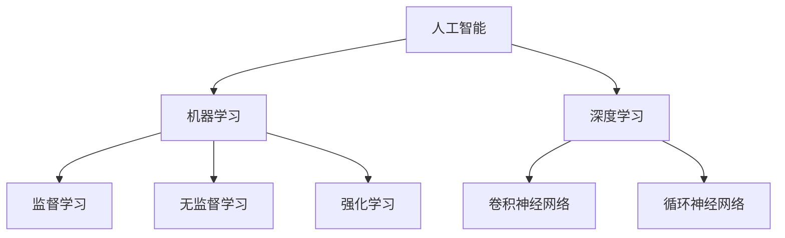

                 

**AI创业：不断改进产品的技巧**

**作者：禅与计算机程序设计艺术 / Zen and the Art of Computer Programming**

## 1. 背景介绍

在当今快速变化的商业环境中，创业公司面临着前所未有的挑战。其中之一就是如何不断改进产品，满足用户的需求，并保持竞争优势。人工智能（AI）的发展为创业公司提供了新的机遇，帮助它们更好地理解用户，优化产品，并实现增长。本文将深入探讨AI在创业中的应用，重点介绍如何使用AI不断改进产品。

## 2. 核心概念与联系

在讨论AI在创业中的应用之前，有必要先了解一些核心概念。AI是一套计算机系统和软件，能够执行通常需要人类智慧的任务。机器学习（ML）是AI的一个分支，它涉及开发计算机算法，使其能够从数据中学习，而无需被明确编程。深度学习（DL）是ML的一个子集，它使用神经网络模型来模拟人类大脑的功能。

下面是这些概念的关系图：



## 3. 核心算法原理 & 具体操作步骤

### 3.1 算法原理概述

在创业中，AI的核心算法之一是推荐系统。推荐系统使用ML算法，根据用户的历史行为和偏好，为用户提供个性化的产品或内容推荐。另一个重要的算法是预测分析，它使用时间序列数据预测未来的趋势。

### 3.2 算法步骤详解

#### 3.2.1 推荐系统

1. **数据收集**：收集用户的历史行为数据，如点击、购买、评分等。
2. **特征工程**：从数据中提取特征，如用户的兴趣、偏好等。
3. **模型训练**：使用ML算法，如协同过滤或神经网络，训练推荐模型。
4. **推荐生成**：使用训练好的模型，为用户生成个性化推荐。

#### 3.2.2 预测分析

1. **数据收集**：收集时间序列数据，如销售额、用户活跃度等。
2. **数据预处理**：对数据进行清洗、缺失值填充等预处理。
3. **模型训练**：使用时间序列预测算法，如ARIMA或LSTM，训练预测模型。
4. **预测生成**：使用训练好的模型，预测未来的趋势。

### 3.3 算法优缺点

**优点**：AI算法可以提供个性化的产品推荐，提高用户参与度，并帮助创业公司更好地理解用户。预测分析可以帮助创业公司更好地规划资源，并及早发现趋势。

**缺点**：AI算法需要大量的数据，对数据的质量和完整性有很高的要求。此外，AI算法的解释性较差，很难理解其决策的原因。

### 3.4 算法应用领域

推荐系统广泛应用于电子商务、内容平台、社交媒体等领域。预测分析则广泛应用于金融、零售、交通等领域。

## 4. 数学模型和公式 & 详细讲解 & 举例说明

### 4.1 数学模型构建

在构建推荐系统时，常用的数学模型之一是矩阵分解。假设我们有用户-项目矩阵 $R$：

$$
R = \begin{bmatrix}
r_{11} & r_{12} & \cdots & r_{1m} \\
r_{21} & r_{22} & \cdots & r_{2m} \\
\vdots & \vdots & \ddots & \vdots \\
r_{n1} & r_{n2} & \cdots & r_{nm} \\
\end{bmatrix}
$$

其中，$r_{ij}$ 表示用户 $i$ 对项目 $j$ 的评分。我们可以将其分解为用户特征矩阵 $U$ 和项目特征矩阵 $V$：

$$
R \approx UV^T
$$

### 4.2 公式推导过程

在预测分析中，常用的数学模型之一是ARIMA。ARIMA模型是自回归移动平均模型（ARMA）的扩展，它包括自回归（AR）部分、移动平均（MA）部分，以及差分（I）部分。ARIMA模型的公式为：

$$
\Phi(B)(1-B)^dY_t = \theta(B)Z_t
$$

其中，$Y_t$ 是时间序列，$Z_t$ 是白噪声，$B$ 是后移运算符，$\Phi(B)$ 和 $\theta(B)$ 是自回归和移动平均部分的多项式，$d$ 是差分阶数。

### 4.3 案例分析与讲解

例如，假设我们要构建一个电影推荐系统。我们可以使用矩阵分解模型，将用户-电影评分矩阵分解为用户特征矩阵和电影特征矩阵。然后，我们可以使用余弦相似度或其他相似度度量，为每个用户推荐最相似的电影。

在预测分析中，假设我们要预测未来一周的销售额。我们可以使用ARIMA模型，首先对数据进行差分，然后拟合AR和MA部分，最后使用模型预测未来的销售额。

## 5. 项目实践：代码实例和详细解释说明

### 5.1 开发环境搭建

在开始项目实践之前，我们需要搭建开发环境。推荐使用Python作为开发语言，并安装必要的库，如NumPy、Pandas、Scikit-learn、TensorFlow等。

### 5.2 源代码详细实现

以下是使用Python实现矩阵分解推荐系统的示例代码：

```python
import numpy as np
from scipy.sparse.linalg import svds

# 示例用户-项目评分矩阵
R = np.array([[5, 3, 0, 0],
              [4, 0, 6, 1],
              [1, 5, 0, 4],
              [0, 7, 5, 3]])

# 使用SVD分解矩阵
U, sigma, VT = svds(R, k=2)

# 重构矩阵
R_hat = np.dot(np.dot(U, np.diag(sigma)), VT)
```

以下是使用Python实现ARIMA预测分析的示例代码：

```python
import pandas as pd
from statsmodels.tsa.arima_model import ARIMA

# 示例销售额时间序列数据
data = {'date': ['2022-01-01', '2022-01-02', '2022-01-03', '2022-01-04', '2022-01-05'],
       'sales': [100, 120, 110, 130, 140]}
df = pd.DataFrame(data)
df['date'] = pd.to_datetime(df['date'])
df.set_index('date', inplace=True)

# 拟合ARIMA模型
model = ARIMA(df['sales'], order=(1, 1, 1))
model_fit = model.fit(disp=0)

# 预测未来一周的销售额
forecast = model_fit.forecast(steps=7)
```

### 5.3 代码解读与分析

在矩阵分解推荐系统中，我们首先导入必要的库，然后定义示例用户-项目评分矩阵。我们使用SVD分解矩阵，并重构矩阵以生成推荐。

在ARIMA预测分析中，我们首先导入必要的库，然后定义示例销售额时间序列数据。我们使用ARIMA模型拟合数据，并预测未来一周的销售额。

### 5.4 运行结果展示

运行矩阵分解推荐系统代码后，我们可以得到重构的矩阵 $R\_hat$。运行ARIMA预测分析代码后，我们可以得到未来一周的销售额预测结果。

## 6. 实际应用场景

AI在创业中的应用场景非常广泛。例如，在电子商务领域，AI可以帮助创业公司更好地理解用户，提供个性化的产品推荐，并优化物流和供应链。在内容平台领域，AI可以帮助创业公司更好地理解用户的兴趣，提供个性化的内容推荐，并优化内容创作。

### 6.1 当前应用

当前，AI已经广泛应用于各种创业公司。例如，Netflix使用AI推荐系统为用户提供个性化的电影和电视节目推荐。Amazon使用AI预测分析优化物流和供应链，并为用户提供个性化的产品推荐。Spotify使用AI推荐系统为用户提供个性化的音乐推荐。

### 6.2 未来应用展望

未来，AI在创业中的应用将更加广泛和深入。例如，AI可以帮助创业公司更好地理解用户的情感，提供个性化的情感支持。AI可以帮助创业公司更好地理解用户的行为，提供个性化的行为改进建议。AI还可以帮助创业公司更好地理解用户的需求，提供个性化的产品设计。

## 7. 工具和资源推荐

### 7.1 学习资源推荐

以下是一些推荐的学习资源：

* 书籍：《机器学习》作者：Tom Mitchell，《深度学习》作者：Ian Goodfellow，Yoshua Bengio，Aaron Courville
* 在线课程：Coursera上的“机器学习”课程，Udacity上的“深度学习”课程
* 博客：KDnuggets，Towards Data Science

### 7.2 开发工具推荐

以下是一些推荐的开发工具：

* 编程语言：Python
* 开发环境：Jupyter Notebook，PyCharm
* AI库：TensorFlow，PyTorch，Scikit-learn

### 7.3 相关论文推荐

以下是一些推荐的相关论文：

* “The Bellman-Ford algorithm in two variables”作者：Richard E. Bellman
* “An efficient algorithm for global optimization of arbitrary continuous functions”作者：Corinna Cortes，Vladimir Vapnik
* “Gradient-based learning applied to document recognition”作者：Yann LeCun，Lecun，Yann

## 8. 总结：未来发展趋势与挑战

### 8.1 研究成果总结

本文介绍了AI在创业中的应用，重点介绍了如何使用AI不断改进产品。我们讨论了核心概念、算法原理、数学模型，并提供了项目实践示例。我们还讨论了AI在创业中的实际应用场景，并推荐了学习资源、开发工具和相关论文。

### 8.2 未来发展趋势

未来，AI在创业中的应用将更加广泛和深入。AI将帮助创业公司更好地理解用户，提供个性化的产品和服务。AI还将帮助创业公司更好地理解市场趋势，并及早发现机遇和挑战。

### 8.3 面临的挑战

然而，AI在创业中的应用也面临着挑战。其中之一就是数据的质量和完整性。创业公司需要收集大量的高质量数据，才能训练有效的AI模型。此外，AI算法的解释性较差，很难理解其决策的原因。创业公司需要开发新的方法，帮助用户理解和信任AI决策。

### 8.4 研究展望

未来的研究将关注如何提高AI算法的解释性，如何处理数据质量和完整性问题，如何帮助创业公司更好地理解用户和市场。此外，研究还将关注如何将AI与其他技术结合，如物联网、区块链等，以提供更好的产品和服务。

## 9. 附录：常见问题与解答

**Q1：AI在创业中的优势是什么？**

**A1：AI在创业中的优势包括帮助创业公司更好地理解用户，提供个性化的产品和服务，优化物流和供应链，及早发现市场趋势等。**

**Q2：AI在创业中的挑战是什么？**

**A2：AI在创业中的挑战包括数据的质量和完整性，AI算法的解释性较差，如何帮助用户理解和信任AI决策等。**

**Q3：如何开始使用AI改进创业产品？**

**A3：开始使用AI改进创业产品的第一步是收集大量的高质量数据。然后，选择合适的AI算法，如推荐系统或预测分析，并训练模型。最后，使用模型为用户提供个性化的产品和服务，并不断改进模型。**

**Q4：AI在创业中的未来发展趋势是什么？**

**A4：AI在创业中的未来发展趋势包括帮助创业公司更好地理解用户和市场，将AI与其他技术结合，提供更好的产品和服务等。**

**Q5：如何学习AI技术？**

**A5：学习AI技术的方法包括阅读相关书籍，参加在线课程，阅读相关博客和论文等。此外，实践是学习AI技术的最好方法，创业公司可以尝试使用AI改进产品，并不断改进模型。**

## 结束语

AI在创业中的应用为创业公司提供了新的机遇，帮助它们更好地理解用户，优化产品，并实现增长。然而，AI在创业中的应用也面临着挑战，需要创业公司不断改进模型，并帮助用户理解和信任AI决策。未来，AI在创业中的应用将更加广泛和深入，为创业公司带来更多的机遇和挑战。

**作者：禅与计算机程序设计艺术 / Zen and the Art of Computer Programming**

