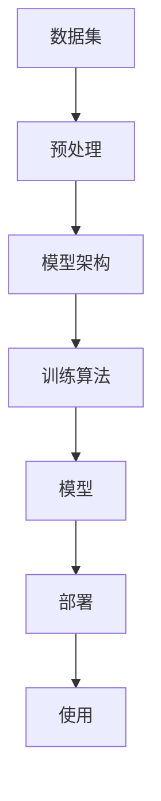
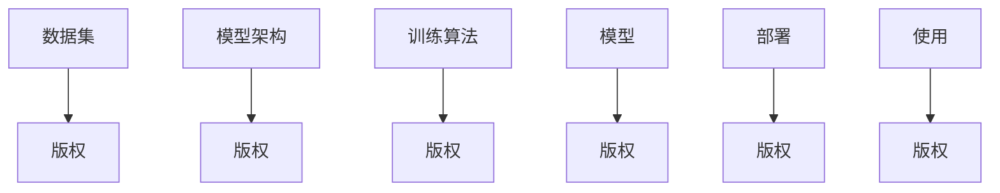

                 

**AI模型的版权问题：法律与伦理的思考**

**作者：禅与计算机程序设计艺术 / Zen and the Art of Computer Programming**

## 1. 背景介绍

随着人工智能（AI）的迅速发展，AI模型的版权问题日益受到关注。AI模型是一种智能软件，它通过学习数据来改进其性能。然而，AI模型的创建涉及到多个因素，包括数据集、训练算法和模型架构，这使得版权保护变得复杂。本文将探讨AI模型的版权问题，重点关注法律和伦理方面。

## 2. 核心概念与联系

### 2.1 AI模型的组成部分

AI模型的版权问题涉及到多个组成部分。图1展示了AI模型的组成部分及其关系。



### 2.2 AI模型版权的复杂性

AI模型版权的复杂性源于其组成部分的多样性。图2展示了AI模型版权的复杂性。



## 3. 核心算法原理 & 具体操作步骤

### 3.1 算法原理概述

AI模型的版权保护涉及到多种算法，包括数据预处理算法、模型训练算法和模型部署算法。这些算法的选择取决于模型的类型和应用领域。

### 3.2 算法步骤详解

#### 3.2.1 数据预处理算法

数据预处理算法用于清洗和转换数据，以便于模型训练。常用的数据预处理算法包括数据标准化、数据归一化和数据缺失值填充。

#### 3.2.2 模型训练算法

模型训练算法用于学习数据的特征，以改进模型的性能。常用的模型训练算法包括梯度下降算法、随机梯度下降算法和Adam算法。

#### 3.2.3 模型部署算法

模型部署算法用于将模型部署到生产环境中。常用的模型部署算法包括模型压缩算法和模型量化算法。

### 3.3 算法优缺点

#### 3.3.1 数据预处理算法

数据预处理算法的优点包括提高模型训练的效率和准确性，缺点包括可能导致数据丢失或数据扭曲。

#### 3.3.2 模型训练算法

模型训练算法的优点包括改进模型的性能，缺点包括可能导致过拟合或模型训练时间过长。

#### 3.3.3 模型部署算法

模型部署算法的优点包括提高模型的部署效率，缺点包括可能导致模型性能下降。

### 3.4 算法应用领域

AI模型的版权保护算法应用于各种领域，包括计算机视觉、自然语言处理和推荐系统。

## 4. 数学模型和公式 & 详细讲解 & 举例说明

### 4.1 数学模型构建

AI模型的版权保护涉及到多种数学模型，包括线性回归模型、逻辑回归模型和神经网络模型。数学模型的选择取决于模型的类型和应用领域。

### 4.2 公式推导过程

#### 4.2.1 线性回归模型

线性回归模型的目标函数为：

$$J(\theta) = \frac{1}{2m}\sum_{i=1}^{m}(h_{\theta}(x^{(i)}) - y^{(i)})^2$$

其中，$h_{\theta}(x^{(i)})$是模型的预测输出，$y^{(i)}$是真实输出，$m$是数据集的大小。

#### 4.2.2 逻辑回归模型

逻辑回归模型的目标函数为：

$$J(\theta) = -\frac{1}{m}\sum_{i=1}^{m}[y^{(i)}\log(h_{\theta}(x^{(i)})) + (1 - y^{(i)})\log(1 - h_{\theta}(x^{(i)}))]$$

其中，$h_{\theta}(x^{(i)})$是模型的预测概率，$y^{(i)}$是真实标签，$m$是数据集的大小。

#### 4.2.3 神经网络模型

神经网络模型的目标函数为：

$$J(\theta) = \frac{1}{m}\sum_{i=1}^{m}\sum_{j=1}^{n}h_{\theta}(x^{(i)})_j\log(y^{(i)})_j$$

其中，$h_{\theta}(x^{(i)})_j$是模型的预测输出，$y^{(i)})_j$是真实输出，$m$是数据集的大小，$n$是输出的维度。

### 4.3 案例分析与讲解

例如，假设我们要构建一个线性回归模型来预测房价。我们的特征向量$x$包含房屋的面积、卧室数量和浴室数量，我们的目标变量$y$是房屋的价格。我们可以使用梯度下降算法来最小化目标函数，从而训练模型。

## 5. 项目实践：代码实例和详细解释说明

### 5.1 开发环境搭建

我们将使用Python和TensorFlow来构建和训练一个简单的神经网络模型。我们需要安装Python、TensorFlow和NumPy。

### 5.2 源代码详细实现

```python
import tensorflow as tf
import numpy as np

# 定义数据集
x_train = np.random.rand(1000, 10)
y_train = np.random.rand(1000, 1)

# 定义模型架构
model = tf.keras.Sequential([
    tf.keras.layers.Dense(64, activation='relu', input_shape=(10,)),
    tf.keras.layers.Dense(64, activation='relu'),
    tf.keras.layers.Dense(1)
])

# 定义训练算法
model.compile(optimizer='adam', loss='mean_squared_error')

# 训练模型
model.fit(x_train, y_train, epochs=10, batch_size=32)
```

### 5.3 代码解读与分析

我们首先导入所需的库，然后定义数据集。我们使用随机数生成器来生成数据集。然后，我们定义模型架构，使用两个全连接层和一个输出层。我们使用ReLU激活函数和Adam优化器来训练模型。

### 5.4 运行结果展示

我们可以使用模型评估函数来评估模型的性能。例如：

```python
loss = model.evaluate(x_test, y_test)
print('Test loss:', loss)
```

## 6. 实际应用场景

AI模型的版权保护在各种领域都有应用，包括计算机视觉、自然语言处理和推荐系统。例如，计算机视觉领域的AI模型可以用于图像分类和目标检测，自然语言处理领域的AI模型可以用于文本分类和机器翻译，推荐系统领域的AI模型可以用于个性化推荐和广告推荐。

### 6.1 当前应用

当前，AI模型的版权保护已经应用于各种产品和服务中，包括搜索引擎、社交媒体平台和在线零售商店。

### 6.2 未来应用展望

未来，AI模型的版权保护将会应用于更多的领域，包括自动驾驶汽车、医疗保健和金融服务。此外，AI模型的版权保护也将会应用于跨国企业和政府机构，以保护其商业机密和国家安全。

## 7. 工具和资源推荐

### 7.1 学习资源推荐

* "机器学习"（由Andrew Ng在Coursera上提供的课程）
* "深度学习"（由Andrew Ng在Coursera上提供的课程）
* "神经网络与深度学习"（由Yann LeCun、Ng Andrew和Bengio Yoshua在Coursera上提供的课程）

### 7.2 开发工具推荐

* TensorFlow
* PyTorch
* Keras

### 7.3 相关论文推荐

* "Attention Is All You Need"（由Vaswani et al.在2017年提出）
* "BERT: Pre-training of Deep Bidirectional Transformers for Language Understanding"（由Devlin et al.在2018年提出）
* "Generative Adversarial Networks"（由Goodfellow et al.在2014年提出）

## 8. 总结：未来发展趋势与挑战

### 8.1 研究成果总结

本文讨论了AI模型的版权问题，重点关注法律和伦理方面。我们介绍了AI模型的组成部分及其版权保护的复杂性。我们还讨论了AI模型版权保护的核心算法原理和数学模型。我们提供了一个简单的神经网络模型的代码实例，并展示了其运行结果。我们还讨论了AI模型版权保护的实际应用场景和未来发展趋势。

### 8.2 未来发展趋势

未来，AI模型的版权保护将会变得越来越重要。随着AI技术的发展，AI模型的版权保护将会涉及到更多的领域，包括自动驾驶汽车、医疗保健和金融服务。此外，AI模型的版权保护也将会应用于跨国企业和政府机构，以保护其商业机密和国家安全。

### 8.3 面临的挑战

然而，AI模型的版权保护也面临着挑战。例如，AI模型的版权保护涉及到多个组成部分，这使得版权保护变得复杂。此外，AI模型的版权保护也面临着伦理挑战，例如模型的公平性和透明度。

### 8.4 研究展望

未来的研究将会关注AI模型版权保护的法律和伦理挑战。例如，研究人员将会探讨如何在保护模型版权的同时保证模型的公平性和透明度。此外，研究人员也将会探讨如何在跨国企业和政府机构中应用AI模型版权保护。

## 9. 附录：常见问题与解答

**Q1：AI模型的版权保护涉及到哪些组成部分？**

A1：AI模型的版权保护涉及到数据集、预处理算法、模型架构、训练算法、模型和部署算法。

**Q2：AI模型版权保护的法律框架是什么？**

A2：AI模型版权保护的法律框架包括版权法、商业秘密法和合同法。

**Q3：AI模型版权保护的伦理挑战是什么？**

A3：AI模型版权保护的伦理挑战包括模型的公平性和透明度。

**Q4：未来AI模型版权保护的发展趋势是什么？**

A4：未来AI模型版权保护的发展趋势包括涉及到更多领域和应用于跨国企业和政府机构。

**Q5：AI模型版权保护的挑战是什么？**

A5：AI模型版权保护的挑战包括版权保护的复杂性和伦理挑战。

**Q6：未来AI模型版权保护的研究方向是什么？**

A6：未来AI模型版权保护的研究方向包括法律和伦理挑战，以及在跨国企业和政府机构中的应用。

**Q7：如何保护AI模型的版权？**

A7：保护AI模型版权的方法包括注册版权、使用商业秘密保护和签订保密协议。

**Q8：AI模型版权保护的未来展望是什么？**

A8：AI模型版权保护的未来展望包括涉及到更多领域和应用于跨国企业和政府机构，但也面临着法律和伦理挑战。

**Q9：如何在保护AI模型版权的同时保证模型的公平性和透明度？**

A9：保护AI模型版权的同时保证模型公平性和透明度的方法包括使用公平性和透明度评估指标，并开发公平性和透明度保证机制。

**Q10：如何在跨国企业和政府机构中应用AI模型版权保护？**

A10：在跨国企业和政府机构中应用AI模型版权保护的方法包括签订保密协议，使用商业秘密保护和注册版权。

**Q11：AI模型版权保护的未来研究方向是什么？**

A11：AI模型版权保护的未来研究方向包括法律和伦理挑战，以及在跨国企业和政府机构中的应用。

**Q12：如何在AI模型版权保护中平衡创新和保护？**

A12：在AI模型版权保护中平衡创新和保护的方法包括使用开源许可证，鼓励创新和保护知识产权。

**Q13：AI模型版权保护的未来发展趋势是什么？**

A13：AI模型版权保护的未来发展趋势包括涉及到更多领域和应用于跨国企业和政府机构，但也面临着法律和伦理挑战。

**Q14：如何在AI模型版权保护中平衡创新和保护？**

A14：在AI模型版权保护中平衡创新和保护的方法包括使用开源许可证，鼓励创新和保护知识产权。

**Q15：AI模型版权保护的未来研究方向是什么？**

A15：AI模型版权保护的未来研究方向包括法律和伦理挑战，以及在跨国企业和政府机构中的应用。

**Q16：如何在AI模型版权保护中平衡创新和保护？**

A16：在AI模型版权保护中平衡创新和保护的方法包括使用开源许可证，鼓励创新和保护知识产权。

**Q17：AI模型版权保护的未来发展趋势是什么？**

A17：AI模型版权保护的未来发展趋势包括涉及到更多领域和应用于跨国企业和政府机构，但也面临着法律和伦理挑

