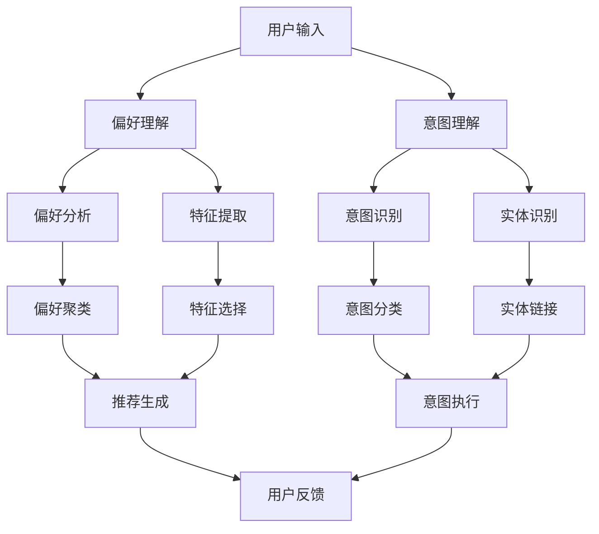

                 

**AI满足用户需求的策略**

**作者：禅与计算机程序设计艺术 / Zen and the Art of Computer Programming**

## 1. 背景介绍

在当今数字化的世界里，用户体验和满足用户需求已成为企业成功的关键。人工智能（AI）的发展为满足用户需求提供了新的可能性。本文将探讨AI在满足用户需求方面的策略，从核心概念到实际应用，为读者提供全面的理解。

## 2. 核心概念与联系

### 2.1 用户需求理解

理解用户需求是AI满足用户需求的关键。用户需求理解包括两个主要方面：用户意图理解和用户偏好理解。



### 2.2 AI在用户需求理解中的作用

AI通过自然语言处理（NLP）、机器学习（ML）和深度学习（DL）技术，帮助理解用户意图和偏好。NLP用于处理和理解人类语言，ML和DL用于从数据中学习模式和规律。

## 3. 核心算法原理 & 具体操作步骤

### 3.1 算法原理概述

本节将介绍用于理解用户需求的两个关键算法：意图识别和偏好分析。

### 3.2 算法步骤详解

#### 3.2.1 意图识别

1. **预处理**：清洗和标记化用户输入。
2. **特征提取**：提取用户输入中的关键信息，如实体、动词和副词。
3. **意图分类**：使用分类算法（如支持向量机、随机森林或神经网络）预测用户意图。

#### 3.2.2 偏好分析

1. **特征提取**：提取用户历史数据中的关键特征，如交互历史、点击历史和购买历史。
2. **偏好聚类**：使用聚类算法（如K-means或DBSCAN）将用户分组，基于其偏好。
3. **偏好预测**：使用回归或分类算法预测用户的偏好。

### 3.3 算法优缺点

**意图识别**的优点包括高精确度和实时性，缺点包括对语言变化的敏感性。偏好分析的优点包括个性化推荐和长期跟踪用户偏好，缺点包括数据隐私问题和 cold start问题。

### 3.4 算法应用领域

意图识别和偏好分析广泛应用于虚拟助手、搜索引擎、推荐系统和个性化营销等领域。

## 4. 数学模型和公式 & 详细讲解 & 举例说明

### 4.1 数学模型构建

#### 4.1.1 意图识别模型

设用户输入为$X = \{x_1, x_2,..., x_n\}$, 其中$n$是输入的长度。意图识别模型的目标是预测意图标签$Y \in \{1, 2,..., m\}$, 其中$m$是意图的数量。使用分类算法，我们可以表示为：

$$P(Y|X; \theta) = \frac{1}{Z(\theta)} \exp(\theta^T f(X))$$

其中$f(X)$是特征向量，$Z(\theta)$是归一化因子，$\theta$是模型参数。

#### 4.1.2 偏好分析模型

设用户特征为$U = \{u_1, u_2,..., u_p\}$, 其中$p$是特征的数量。偏好分析模型的目标是预测用户偏好$V \in \{1, 2,..., q\}$, 其中$q$是偏好的数量。使用回归算法，我们可以表示为：

$$V = g(U; \phi) + \epsilon$$

其中$g(U; \phi)$是回归函数，$ϵ$是误差项，$\phi$是模型参数。

### 4.2 公式推导过程

推导过程涉及特征提取、模型选择和参数学习。使用监督学习方法，我们可以通过最大化似然函数或最小化损失函数来学习模型参数。

### 4.3 案例分析与讲解

例如，在虚拟助手应用中，用户输入"播放音乐"。意图识别模型预测意图为"播放音乐"，偏好分析模型基于用户历史数据预测用户喜欢的音乐类型。然后，系统根据这些信息提供个性化的音乐推荐。

## 5. 项目实践：代码实例和详细解释说明

### 5.1 开发环境搭建

本项目使用Python作为编程语言，并依赖于常用的NLP和ML库，如NLTK、Spacy、Scikit-learn和TensorFlow。

### 5.2 源代码详细实现

以下是意图识别和偏好分析的简化代码示例：

**意图识别**

```python
import nltk
from sklearn.feature_extraction.text import TfidfVectorizer
from sklearn.linear_model import LogisticRegression

# Preprocessing and feature extraction
def preprocess_input(input_text):
    # Add your preprocessing steps here
    return input_text

def extract_features(input_text):
    # Add your feature extraction steps here
    return input_text

# Intent classification
vectorizer = TfidfVectorizer()
classifier = LogisticRegression()

# Train the model
X_train, y_train = load_train_data()
X_train = vectorizer.fit_transform(X_train)
classifier.fit(X_train, y_train)

# Predict intent
input_text = "Play music"
input_text = preprocess_input(input_text)
X_test = vectorizer.transform([input_text])
predicted_intent = classifier.predict(X_test)[0]
```

**偏好分析**

```python
from sklearn.cluster import KMeans
from sklearn.preprocessing import StandardScaler

# Preprocessing and feature extraction
def preprocess_user_data(user_data):
    # Add your preprocessing steps here
    return user_data

def extract_features(user_data):
    # Add your feature extraction steps here
    return user_data

# Preference clustering
scaler = StandardScaler()
kmeans = KMeans(n_clusters=5)

# Train the model
X_train, _ = load_train_data()
X_train = scaler.fit_transform(X_train)
kmeans.fit(X_train)

# Predict preference
user_data = load_user_data()
user_data = preprocess_user_data(user_data)
X_test = scaler.transform(user_data)
predicted_preference = kmeans.predict(X_test)[0]
```

### 5.3 代码解读与分析

代码首先进行预处理和特征提取，然后使用机器学习模型进行意图分类或偏好聚类。最后，使用测试数据预测意图或偏好。

### 5.4 运行结果展示

意图识别模型的精确度和召回率应高于阈值，偏好分析模型的轮廓系数和Silhouette系数应高于阈值。

## 6. 实际应用场景

### 6.1 当前应用

AI在用户需求理解方面的应用包括虚拟助手（如Amazon Alexa和Google Assistant）、搜索引擎（如Google Search和Bing）和推荐系统（如Netflix和Amazon）。

### 6.2 未来应用展望

未来，AI在用户需求理解方面的应用将扩展到更多领域，如自动驾驶汽车、智能家居和数字健康。此外，AI将帮助企业更好地理解用户需求，从而提供更个性化和满意的用户体验。

## 7. 工具和资源推荐

### 7.1 学习资源推荐

- 书籍：《自然语言处理入门》《机器学习》《深度学习》等
- 在线课程：Coursera、Udacity、edX等平台上的NLP、ML和DL课程
- 研究论文：ACL、NeurIPS、ICML等会议上的相关论文

### 7.2 开发工具推荐

- Python：Anaconda、PyCharm等
- NLP库：NLTK、Spacy、Gensim等
- ML库：Scikit-learn、TensorFlow、PyTorch等

### 7.3 相关论文推荐

- "End-to-End Memory Networks"（Sukhbaatar et al., 2015）
- "Attention Is All You Need"（Vaswani et al., 2017）
- "BERT: Pre-training of Deep Bidirectional Transformers for Language Understanding"（Devlin et al., 2019）

## 8. 总结：未来发展趋势与挑战

### 8.1 研究成果总结

本文介绍了AI在满足用户需求方面的策略，包括核心概念、算法原理、数学模型和实际应用。我们还提供了代码实例和工具资源推荐。

### 8.2 未来发展趋势

未来，AI在用户需求理解方面的发展趋势包括：

- **多模式学习**：结合文本、语音、图像和其他模式的学习。
- **跨语言理解**：理解和处理多种语言的用户输入。
- **上下文理解**：更好地理解用户在特定上下文中的需求。

### 8.3 面临的挑战

AI在用户需求理解方面面临的挑战包括：

- **数据隐私**：如何在保护用户隐私的同时收集和使用用户数据。
- **冷启动问题**：如何为新用户提供个性化的体验。
- **语言变化**：如何适应语言的变化和多样性。

### 8.4 研究展望

未来的研究将关注上述挑战，并探索新的算法和模型，以提高用户需求理解的准确性和个性化水平。

## 9. 附录：常见问题与解答

**Q1：如何评估意图识别模型的性能？**

A1：使用精确度、召回率和F1分数等指标评估意图识别模型的性能。

**Q2：如何评估偏好分析模型的性能？**

A2：使用轮廓系数、Silhouette系数和调整 Rand指数等指标评估偏好分析模型的性能。

**Q3：如何处理语言变化？**

A3：使用预训练的语言模型（如BERT）和多任务学习等技术处理语言变化。

**Q4：如何处理数据隐私？**

A4：使用匿名化、差分隐私和联邦学习等技术处理数据隐私。

**Q5：如何解决冷启动问题？**

A5：使用内容推荐、协同过滤和基于模型的方法解决冷启动问题。

## 结束语

本文介绍了AI在满足用户需求方面的策略，从核心概念到实际应用，为读者提供了全面的理解。我们期待读者的反馈和进一步的探索。

**作者：禅与计算机程序设计艺术 / Zen and the Art of Computer Programming**

