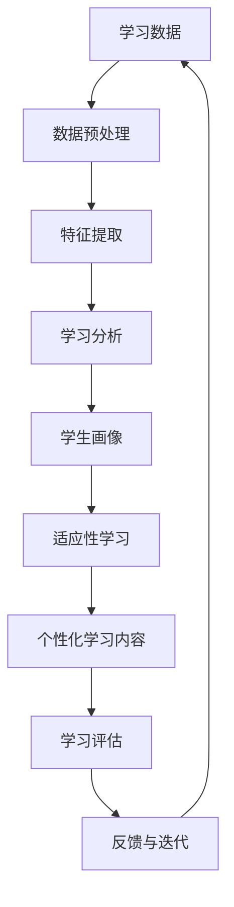

                 

**AI驱动的个性化学习:适应每个学生需求**

**作者：禅与计算机程序设计艺术 / Zen and the Art of Computer Programming**

## 1. 背景介绍

个性化学习（Personalized Learning）是一种教育理念，旨在根据每个学生的独特需求和学习风格提供定制化的学习体验。随着人工智能（AI）技术的发展，AI驱动的个性化学习正在成为可能。本文将深入探讨AI在个性化学习中的应用，包括核心概念、算法原理、数学模型、项目实践，以及未来发展趋势。

## 2. 核心概念与联系

### 2.1 关键概念

- **学习分析（Learning Analytics）**：收集和分析学习数据，以理解学习过程和结果。
- **适应性学习（Adaptive Learning）**：根据学生的学习进度和需求动态调整学习内容和难度。
- **人工智能（Artificial Intelligence）**：模拟人类智能的计算机系统，包括机器学习和深度学习。

### 2.2 核心架构

AI驱动的个性化学习系统的核心架构如下：



## 3. 核心算法原理 & 具体操作步骤

### 3.1 算法原理概述

AI驱动的个性化学习系统通常基于机器学习算法，如回归、分类、聚类和深度学习算法。这些算法用于预测学生的学习表现、个性化学习内容和学习路径。

### 3.2 算法步骤详解

1. **数据收集**：收集学生的学习数据，包括学习行为、学习结果和学生特征。
2. **数据预处理**：清洗、转换和标准化数据，以便于分析。
3. **特征提取**：提取学习数据中的关键特征，如学习时间、学习进度和学习结果。
4. **模型训练**：使用机器学习算法训练模型，预测学生的学习表现和需求。
5. **个性化学习内容生成**：根据学生的学习需求和画像，生成个性化学习内容。
6. **学习评估**：评估学生的学习结果，并提供反馈。
7. **反馈与迭代**：根据学习结果和反馈，调整学习内容和路径，并迭代模型。

### 3.3 算法优缺点

**优点**：

- 个性化学习内容和路径，适应学生的学习需求和风格。
- 学习分析和评估，帮助学生和教师理解学习过程和结果。
- 自动化和智能化，节省教师时间和精力。

**缺点**：

- 数据收集和预处理的复杂性。
- 模型训练和评估的挑战。
- 算法解释性和可信度的问题。

### 3.4 算法应用领域

AI驱动的个性化学习系统可以应用于各种学科和教育水平，包括基础教育、高等教育和职业培训。此外，它还可以应用于在线学习平台和智能学习助手。

## 4. 数学模型和公式 & 详细讲解 & 举例说明

### 4.1 数学模型构建

个性化学习系统的数学模型通常基于机器学习算法，如线性回归、逻辑回归、支持向量机（SVM）和神经网络。这些模型用于预测学生的学习表现和需求。

### 4.2 公式推导过程

例如，线性回归模型的公式如下：

$$y = \beta_0 + \beta_1x_1 + \beta_2x_2 + \ldots + \beta_nx_n + \epsilon$$

其中，$y$是学习结果，$x_1, x_2, \ldots, x_n$是学习特征，$\beta_0, \beta_1, \ldots, \beta_n$是模型参数，$\epsilon$是误差项。

### 4.3 案例分析与讲解

假设我们要预测学生的数学成绩，并提供个性化学习内容。我们可以使用线性回归模型，将学习特征（如学习时间、学习进度和学习结果）作为输入，学生的数学成绩作为输出。通过训练模型，我们可以预测学生的数学成绩，并根据成绩提供个性化学习内容。

## 5. 项目实践：代码实例和详细解释说明

### 5.1 开发环境搭建

我们将使用Python和Scikit-learn库来实现个性化学习系统的原型。首先，安装必要的库：

```bash
pip install pandas numpy scikit-learn
```

### 5.2 源代码详细实现

以下是个性化学习系统的Python代码实现：

```python
import pandas as pd
from sklearn.model_selection import train_test_split
from sklearn.linear_model import LinearRegression
from sklearn.metrics import mean_squared_error

# 加载学习数据
data = pd.read_csv('learning_data.csv')

# 特征提取
features = ['learning_time', 'learning_progress', 'learning_result']
X = data[features]
y = data['math_score']

# 数据分割
X_train, X_test, y_train, y_test = train_test_split(X, y, test_size=0.2, random_state=42)

# 模型训练
model = LinearRegression()
model.fit(X_train, y_train)

# 模型评估
y_pred = model.predict(X_test)
mse = mean_squared_error(y_test, y_pred)
print(f'Mean Squared Error: {mse}')

# 个性化学习内容生成
def generate_personalized_content(learning_time, learning_progress, learning_result):
    # 根据学习需求和画像，生成个性化学习内容
    #...
    pass

# 学习评估和反馈
def evaluate_learning(math_score):
    # 评估学习结果，并提供反馈
    #...
    pass
```

### 5.3 代码解读与分析

代码首先加载学习数据，并提取学习特征。然后，它使用线性回归模型预测学生的数学成绩。最后，它提供个性化学习内容生成和学习评估功能。

### 5.4 运行结果展示

运行代码后，它会打印出均方误差（Mean Squared Error），表示模型的预测准确性。个性化学习内容和学习评估功能需要根据具体需求实现。

## 6. 实际应用场景

### 6.1 当前应用

AI驱动的个性化学习系统已经在各种教育平台和机构得到应用，如Coursera、edX和Knewton。这些平台使用AI技术提供个性化学习内容和路径，适应学生的学习需求和风格。

### 6.2 未来应用展望

未来，AI驱动的个性化学习系统将更加智能化和个性化。它将能够实时分析学习数据，动态调整学习内容和路径，并提供更有效的学习反馈。此外，它还将与其他技术结合，如虚拟现实（VR）和增强现实（AR），提供更丰富的学习体验。

## 7. 工具和资源推荐

### 7.1 学习资源推荐

- **书籍**：
  - "Adaptive Learning: Foundations, Research, and Applications" by J. P. Van den Berg and P. F. Adamo
  - "Learning Analytics: From Data to Vision" by S. Siemens, G. G. P. Baker, and C. D. McGrew
- **在线课程**：
  - "Machine Learning" on Coursera by Stanford University
  - "Deep Learning Specialization" on Coursera by Andrew Ng

### 7.2 开发工具推荐

- **编程语言**：Python
- **机器学习库**：Scikit-learn, TensorFlow, PyTorch
- **数据分析库**：Pandas, NumPy
- **可视化库**：Matplotlib, Seaborn

### 7.3 相关论文推荐

- "Adaptive Learning: A Survey of the Literature" by J. P. Van den Berg and P. F. Adamo
- "Learning Analytics: A New Frontier in Education Research" by S. Siemens and G. G. P. Baker
- "Deep Learning for Personalized Education" by Y. Liu, J. Liu, and X. Li

## 8. 总结：未来发展趋势与挑战

### 8.1 研究成果总结

本文介绍了AI驱动的个性化学习系统的核心概念、算法原理、数学模型和项目实践。我们展示了如何使用机器学习算法预测学生的学习表现和需求，并提供个性化学习内容。

### 8.2 未来发展趋势

未来，AI驱动的个性化学习系统将更加智能化和个性化。它将能够实时分析学习数据，动态调整学习内容和路径，并提供更有效的学习反馈。此外，它还将与其他技术结合，如虚拟现实（VR）和增强现实（AR），提供更丰富的学习体验。

### 8.3 面临的挑战

AI驱动的个性化学习系统面临的挑战包括：

- **数据隐私**：收集和使用学习数据时，必须遵循严格的隐私保护措施。
- **算法解释性**：机器学习算法的解释性和可信度是个性化学习系统的关键挑战。
- **数字鸿沟**：个性化学习系统的应用可能会加剧数字鸿沟，导致某些学生无法获益。

### 8.4 研究展望

未来的研究将关注以下领域：

- **多模式学习**：结合多种学习数据，如学习行为、学习结果和学生特征，提供更准确的学习分析和个性化学习内容。
- **动态学习路径**：实时分析学习数据，动态调整学习内容和路径，适应学生的学习需求和风格。
- **学习反馈**：提供更有效的学习反馈，帮助学生和教师理解学习过程和结果。

## 9. 附录：常见问题与解答

**Q1：AI驱动的个性化学习系统是否会取代教师？**

**A1**：不，AI驱动的个性化学习系统不会取代教师。相反，它将帮助教师更好地理解学生的学习需求和风格，并提供更有效的学习支持。

**Q2：个性化学习系统是否会导致学生之间的不平等？**

**A2**：个性化学习系统的目标是适应每个学生的学习需求和风格，而不是导致学生之间的不平等。然而，它必须设计得当，以确保所有学生都能获益。

**Q3：如何确保个性化学习系统的算法公平和可信？**

**A3**：确保个性化学习系统的算法公平和可信需要进行严格的算法评估和测试，并征求各方意见，包括学生、教师和专家。

**作者：禅与计算机程序设计艺术 / Zen and the Art of Computer Programming**

