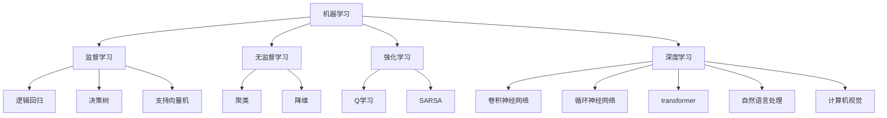

                 

**人工智能的未来发展目标**

**作者：禅与计算机程序设计艺术 / Zen and the Art of Computer Programming**

## 1. 背景介绍

人工智能（AI）自诞生以来，已经从一项学术实验发展成为各行各业的关键技术。从搜索引擎到自动驾驶汽车，再到语音助手，AI无处不在。然而，我们仍处于AI发展的初期阶段，未来的发展前景令人兴奋。本文将探讨人工智能的未来发展目标，包括核心概念、算法原理、数学模型，并提供项目实践和工具推荐。

## 2. 核心概念与联系

人工智能的核心概念包括机器学习、深度学习、自然语言处理、计算机视觉等。这些概念相互关联，共同构成了AI的基础。下图是这些概念的关系图：



## 3. 核心算法原理 & 具体操作步骤

### 3.1 算法原理概述

人工智能的核心是机器学习算法。这些算法学习自数据中提取的模式，并用于预测或决策。其中最著名的是神经网络，它模仿人脑的结构和功能。

### 3.2 算法步骤详解

神经网络的训练过程包括以下步骤：

1. **前向传播**：输入数据通过网络的各层，生成输出。
2. **计算误差**：比较网络输出和真实值，计算误差。
3. **反向传播**：误差反向传播，更新网络权重。
4. **重复**：重复步骤1-3，直到误差足够小。

### 3.3 算法优缺点

神经网络的优点包括高度非线性、适应能力强，缺点包括训练时间长、易于过拟合。

### 3.4 算法应用领域

神经网络广泛应用于图像和语音识别，自然语言处理，推荐系统等领域。

## 4. 数学模型和公式 & 详细讲解 & 举例说明

### 4.1 数学模型构建

神经网络的数学模型是多层感知机（MLP）。每层包含多个神经元，每个神经元接受输入，进行加权求和，加上偏置，通过激活函数生成输出。

### 4.2 公式推导过程

设输入向量为$x$, 权重矩阵为$W$, 偏置向量为$b$, 激活函数为$f$, 则输出为$y = f(Wx + b)$.

### 4.3 案例分析与讲解

例如，一个简单的二层神经网络可以表示为：

$$y = f(W_2f(W_1x + b_1) + b_2)$$

其中，$W_1$和$W_2$是权重矩阵，$b_1$和$b_2$是偏置向量，$f$是激活函数。

## 5. 项目实践：代码实例和详细解释说明

### 5.1 开发环境搭建

我们将使用Python和TensorFlow构建一个简单的神经网络。

### 5.2 源代码详细实现

```python
import tensorflow as tf

# 定义输入和输出
x = tf.placeholder(tf.float32, [None, 2])
y = tf.placeholder(tf.float32, [None, 1])

# 定义权重和偏置
W = tf.Variable(tf.zeros([2, 1]))
b = tf.Variable(tf.zeros([1]))

# 定义模型
y_pred = tf.nn.sigmoid(tf.matmul(x, W) + b)

# 定义损失函数
loss = tf.reduce_mean(tf.nn.sigmoid_cross_entropy_with_logits(labels=y, logits=y_pred))

# 定义优化器
optimizer = tf.train.GradientDescentOptimizer(0.01).minimize(loss)

# 训练模型
with tf.Session() as sess:
    sess.run(tf.global_variables_initializer())
    for i in range(1000):
        sess.run(optimizer, feed_dict={x: X, y: y})
```

### 5.3 代码解读与分析

这段代码定义了一个简单的二层神经网络，使用sigmoid激活函数，并使用梯度下降优化器训练模型。

### 5.4 运行结果展示

运行这段代码后，模型的损失函数值会逐渐减小，直到收敛。

## 6. 实际应用场景

### 6.1 当前应用

神经网络广泛应用于各种领域，包括图像和语音识别，自然语言处理，推荐系统等。

### 6.2 未来应用展望

未来，神经网络将继续发展，可能会出现更复杂的架构，如生成式对抗网络（GAN）和变分自编码器（VAE），并可能会出现新的应用领域，如自动驾驶和医疗诊断。

## 7. 工具和资源推荐

### 7.1 学习资源推荐

- "深度学习"（Goodfellow, Bengio, & Courville, 2016）
- "神经网络与深度学习"（Hinton & Salakhutdinov, 2006）
- 斯坦福大学的机器学习课程（Coursera）

### 7.2 开发工具推荐

- TensorFlow
- PyTorch
- Keras

### 7.3 相关论文推荐

- "ImageNet Classification with Deep Convolutional Neural Networks"（Krizhevsky et al., 2012）
- "Generative Adversarial Networks"（Goodfellow et al., 2014）
- "Variational Autoencoders"（Kingma & Welling, 2013）

## 8. 总结：未来发展趋势与挑战

### 8.1 研究成果总结

本文介绍了神经网络的原理、数学模型、算法实现，并提供了项目实践和工具推荐。

### 8.2 未来发展趋势

未来，神经网络将继续发展，可能会出现更复杂的架构，并可能会出现新的应用领域。

### 8.3 面临的挑战

未来的挑战包括如何处理大规模数据，如何避免过拟合，如何提高模型的解释性等。

### 8.4 研究展望

未来的研究方向包括自监督学习、对抗学习、生成式模型等。

## 9. 附录：常见问题与解答

**Q：神经网络如何避免过拟合？**

**A：常用的方法包括正则化、 dropout、数据增强等。**

**Q：如何评估模型的好坏？**

**A：常用的指标包括准确率、精确度、召回率、F1分数等。**

**Q：神经网络如何处理大规模数据？**

**A：常用的方法包括数据并行、模型并行、分布式训练等。**

**作者：禅与计算机程序设计艺术 / Zen and the Art of Computer Programming**

