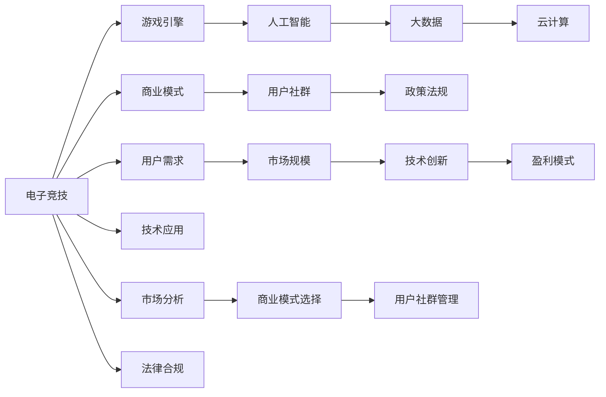

                 

## 1. 背景介绍

### 1.1 问题由来
电子竞技（Esports），作为新兴体育产业的一部分，近年来在全球范围内迅速崛起。伴随着计算机和互联网技术的普及，电子竞技已成为连接虚拟与现实、技术与体育的新兴领域，吸引了数百万的参与者和观众。电子竞技产业不仅仅包括游戏比赛本身，还包括内容制作、赛事转播、赞助商、广告、培训学校、选手转会市场等多元化的产业链条。

这一领域的发展，已引起了全球范围内大量创业者的关注。无论是大型企业如腾讯、网易、暴雪娱乐，还是创业公司如Valiant、G2 Esports，都在积极布局电子竞技市场。因此，电子竞技创业充满了机遇，也面临着重重挑战。

### 1.2 问题核心关键点
电子竞技创业的核心关键点在于：

1. **市场规模**：电子竞技市场规模巨大，且正在快速增长。根据Newzoo的预测，2020年全球电子竞技市场规模将达到12.1亿美元，而2025年预计将增长至24亿美元。

2. **技术创新**：电子竞技产业高度依赖于技术，包括游戏引擎、人工智能、大数据、云计算等，技术创新是推动产业发展的重要驱动力。

3. **商业模式**：电子竞技的商业模式多元，包括广告、赞助、直播、选手转会、赞助商投资、虚拟商品销售等，选择适合自身条件的商业模式是关键。

4. **用户社群**：电子竞技的用户群体庞大且高度活跃，用户忠诚度高，社群效应显著。如何有效管理用户社群，提升用户粘性，是创业成功的关键。

5. **政策法规**：各国对电子竞技的监管政策差异较大，需深入理解政策法规，避免法律风险。

6. **盈利模式**：盈利模式的选择对电子竞技创业项目至关重要，包括广告收入、赞助收入、直播收入、用户会员费、选手转会费等多种方式。

### 1.3 问题研究意义
电子竞技创业不仅是新兴体育产业的重要组成部分，也是互联网+体育的创新实践。电子竞技创业的成功，将推动体育产业的数字化转型，提升体育产业的整体价值。

电子竞技创业的研究意义在于：

1. **理解市场**：深入分析电子竞技市场的发展趋势、用户需求和市场机会，为创业决策提供依据。

2. **技术应用**：探索技术在电子竞技中的应用潜力，推动技术进步，提升用户体验和产业效率。

3. **商业模式**：研究电子竞技的多种商业模式，寻找适合创业团队的盈利模式，实现商业成功。

4. **用户管理**：掌握用户社群管理的有效策略，提升用户粘性，打造品牌忠诚度。

5. **政策合规**：理解和遵守各国对电子竞技的政策法规，避免法律风险。

6. **创新探索**：鼓励创新，推动电子竞技产业的不断发展和突破，推动产业升级和转型。

## 2. 核心概念与联系

### 2.1 核心概念概述

要理解电子竞技创业，首先需要掌握几个核心概念：

1. **电子竞技（Esports）**：电子竞技是一种以电子游戏为基础，通过比赛形式展现玩家技能、策略和反应速度的新兴竞技体育。

2. **游戏引擎（Game Engine）**：游戏引擎是游戏开发的基础软件，提供游戏中的物理模拟、动画、人工智能等功能，如Unity、Unreal Engine等。

3. **人工智能（AI）**：人工智能在电子竞技中的应用包括自动对战、游戏分析、玩家行为预测等。

4. **大数据（Big Data）**：大数据技术在电子竞技中用于分析玩家行为、游戏数据、赛事趋势等。

5. **云计算（Cloud Computing）**：云计算技术提供电子竞技所需的高性能计算和存储服务。

6. **商业模式（Business Model）**：电子竞技的商业模式多种多样，如广告、赞助、直播、选手转会、虚拟商品销售等。

7. **用户社群（User Community）**：电子竞技用户高度活跃，形成庞大的社群，影响力和互动性强。

8. **政策法规（Policy Regulation）**：各国对电子竞技的监管政策差异较大，需深入理解政策法规，避免法律风险。

这些核心概念之间存在着紧密的联系，共同构成了电子竞技创业的生态体系。

### 2.2 核心概念原理和架构的 Mermaid 流程图(Mermaid 流程节点中不要有括号、逗号等特殊字符)



这个流程图展示了电子竞技创业所需的关键概念及其相互关系。

## 3. 核心算法原理 & 具体操作步骤

### 3.1 算法原理概述

电子竞技创业中涉及的核心算法包括：

1. **游戏引擎优化**：通过游戏引擎优化提升游戏性能，包括渲染、物理引擎优化等。

2. **人工智能与机器学习**：利用AI和机器学习技术提升游戏对战水平、预测玩家行为、分析游戏数据等。

3. **大数据分析**：通过大数据技术分析游戏数据、玩家行为、赛事趋势等，为游戏开发和运营提供数据支持。

4. **云计算平台优化**：通过云计算平台优化提升游戏和数据分析的计算效率。

5. **用户行为预测**：利用机器学习算法预测玩家行为，提高游戏体验。

### 3.2 算法步骤详解

以下是电子竞技创业中常用的核心算法具体操作步骤：

1. **游戏引擎优化**：
   - 性能分析：使用性能分析工具，找出游戏引擎中的性能瓶颈，如渲染速度、帧率、内存使用等。
   - 渲染优化：通过纹理压缩、水平合并、垂直合并等技术优化渲染效率。
   - 物理引擎优化：通过优化物理计算、碰撞检测等，提升物理引擎性能。

2. **人工智能与机器学习**：
   - 自动对战：使用强化学习技术，训练AI对战模型，提升游戏对战水平。
   - 玩家行为预测：利用时间序列分析、分类算法等预测玩家行为，如比赛结果、装备选择等。
   - 游戏数据分析：使用聚类算法、关联规则挖掘等分析游戏数据，提取游戏模式、玩家偏好等。

3. **大数据分析**：
   - 数据采集：通过游戏内数据、第三方数据采集平台等，收集玩家行为、游戏数据、赛事数据等。
   - 数据存储：使用大数据平台如Hadoop、Spark等存储海量数据。
   - 数据分析：利用SQL、Spark、Pandas等工具进行数据清洗、统计、分析等。

4. **云计算平台优化**：
   - 计算资源优化：通过云计算平台如AWS、Azure、Google Cloud等优化计算资源分配，提高计算效率。
   - 存储资源优化：通过云存储平台如Amazon S3、Google Cloud Storage等优化存储资源，降低存储成本。

5. **用户行为预测**：
   - 数据预处理：清洗、筛选、转换原始数据，提取特征向量。
   - 模型选择：选择适合的预测模型，如线性回归、随机森林、神经网络等。
   - 模型训练：使用训练集训练预测模型，优化模型参数。
   - 模型评估：使用测试集评估模型性能，调整模型参数。

### 3.3 算法优缺点

电子竞技创业中核心算法的优缺点如下：

**优点**：
1. **提升游戏体验**：通过游戏引擎优化、AI对战、数据分析等，提升游戏体验和对战水平。
2. **数据驱动决策**：利用大数据分析，帮助游戏开发者和运营者进行数据驱动的决策。
3. **降低运营成本**：通过云计算平台优化，降低游戏和数据分析的计算和存储成本。

**缺点**：
1. **技术门槛高**：游戏引擎优化、AI、大数据等技术要求高，需要团队具备相关技术能力。
2. **数据隐私风险**：收集和使用用户数据时，需要关注数据隐私和安全问题。
3. **依赖第三方平台**：云计算平台、数据采集平台等依赖第三方，可能存在技术支持和服务稳定性问题。

### 3.4 算法应用领域

电子竞技创业中核心算法的应用领域广泛，包括：

1. **游戏开发**：游戏引擎优化、AI对战、数据分析等技术在游戏开发中广泛应用。

2. **赛事运营**：AI对战、玩家行为预测、数据分析等技术在赛事运营中发挥重要作用。

3. **游戏运营**：游戏数据分析、玩家行为预测等技术帮助游戏运营商进行用户管理、营销策略制定等。

4. **内容制作**：AI技术用于生成游戏视频、动画等，提升内容制作效率和质量。

5. **选手的培训与管理**：AI和机器学习技术用于选手的行为分析、训练计划制定等。

6. **广告与营销**：大数据分析用于分析用户行为和市场趋势，帮助广告和营销团队进行精准投放。

## 4. 数学模型和公式 & 详细讲解 & 举例说明

### 4.1 数学模型构建

电子竞技创业中的数学模型包括：

1. **游戏引擎优化**：
   - 性能分析：计算帧率、渲染时间等性能指标。
   - 渲染优化：计算纹理压缩率、水平合并、垂直合并等优化效果。
   - 物理引擎优化：计算物理计算时间、碰撞检测时间等。

2. **人工智能与机器学习**：
   - 自动对战：训练强化学习模型，优化游戏对战水平。
   - 玩家行为预测：时间序列分析模型、分类算法等。
   - 游戏数据分析：聚类算法、关联规则挖掘等。

3. **大数据分析**：
   - 数据采集：设计数据采集脚本，提取游戏内数据和第三方数据。
   - 数据存储：设计数据存储方案，使用大数据平台存储数据。
   - 数据分析：设计数据分析流程，使用SQL、Spark、Pandas等工具分析数据。

4. **云计算平台优化**：
   - 计算资源优化：设计计算资源分配方案，使用云计算平台优化计算资源。
   - 存储资源优化：设计存储方案，使用云存储平台优化存储资源。

5. **用户行为预测**：
   - 数据预处理：清洗、筛选、转换原始数据，提取特征向量。
   - 模型选择：选择适合的预测模型，如线性回归、随机森林、神经网络等。
   - 模型训练：使用训练集训练预测模型，优化模型参数。
   - 模型评估：使用测试集评估模型性能，调整模型参数。

### 4.2 公式推导过程

以下是电子竞技创业中核心算法的数学模型和公式推导过程：

**游戏引擎优化**：
- 帧率优化公式：$FPS_{opt} = \frac{1}{T_{avg}}$，其中$T_{avg}$为平均渲染时间。
- 纹理压缩率优化公式：$\frac{TC_{before}}{TC_{after}} \times 100\%$，其中$TC_{before}$为原始纹理大小，$TC_{after}$为压缩后纹理大小。

**人工智能与机器学习**：
- 强化学习自动对战模型：使用Q-learning算法，优化游戏对战水平。
- 时间序列分析模型：使用ARIMA模型，预测玩家行为。
- 分类算法：使用逻辑回归、决策树等算法，预测比赛结果、装备选择等。

**大数据分析**：
- 数据采集：设计数据采集脚本，提取游戏内数据和第三方数据。
- 数据存储：使用Hadoop、Spark等大数据平台存储数据。
- 数据分析：使用SQL、Spark、Pandas等工具分析数据，提取游戏模式、玩家偏好等。

**云计算平台优化**：
- 计算资源优化：设计计算资源分配方案，使用云计算平台优化计算资源。
- 存储资源优化：设计存储方案，使用云存储平台优化存储资源。

**用户行为预测**：
- 数据预处理：清洗、筛选、转换原始数据，提取特征向量。
- 模型选择：选择适合的预测模型，如线性回归、随机森林、神经网络等。
- 模型训练：使用训练集训练预测模型，优化模型参数。
- 模型评估：使用测试集评估模型性能，调整模型参数。

### 4.3 案例分析与讲解

以下是电子竞技创业中核心算法的案例分析与讲解：

**游戏引擎优化**：
- 某公司通过优化游戏引擎，将渲染时间从10ms降低到5ms，提升了游戏的流畅性和用户体验。

**人工智能与机器学习**：
- 某公司使用强化学习技术训练AI对战模型，提升了AI对战水平，减少了人工对战的成本和时间。

**大数据分析**：
- 某公司通过大数据分析，提取了游戏模式和玩家偏好，帮助游戏运营商制定精准的市场推广策略。

**云计算平台优化**：
- 某公司通过云计算平台优化，将计算和存储成本降低了50%，实现了成本效益最大化。

**用户行为预测**：
- 某公司通过用户行为预测，实现了精准的广告投放，提高了广告的转化率和ROI。

## 5. 项目实践：代码实例和详细解释说明

### 5.1 开发环境搭建

在电子竞技创业中，需要搭建一个高效的开发环境。以下是一些必要的步骤：

1. **安装Python**：
   - 安装Anaconda：从官网下载并安装Anaconda，用于创建独立的Python环境。
   - 创建并激活虚拟环境：
   ```bash
   conda create -n pytorch-env python=3.8 
   conda activate pytorch-env
   ```

2. **安装相关库**：
   - 安装Pandas、Numpy、Matplotlib等常用库：
   ```bash
   pip install pandas numpy matplotlib
   ```

3. **安装游戏引擎和AI库**：
   - 安装Unity、Unreal Engine等游戏引擎。
   - 安装TensorFlow、PyTorch等AI库。

4. **安装云计算平台SDK**：
   - 安装AWS SDK、Azure SDK等云计算平台SDK。

5. **安装大数据平台SDK**：
   - 安装Hadoop、Spark等大数据平台SDK。

完成上述步骤后，即可在`pytorch-env`环境中开始电子竞技创业的实践。

### 5.2 源代码详细实现

以下是电子竞技创业中核心算法的Python代码实现：

**游戏引擎优化**：
```python
from unitypy import Unity
import time

# 实例化Unity引擎
unity = Unity('path/to/your/game')

# 优化帧率
unity.frame_rate = 60
unity.rendering.set_fps(60)

# 优化渲染
def optimize_render():
    # 设置渲染优化选项
    unity.rendering.set_optimized_rendering(True)
    # 设置纹理压缩率
    unity.textures.set_compression_rate(1.5)

# 优化物理引擎
def optimize_physics():
    # 设置物理引擎优化选项
    unity.physics.set_optimized_physics(True)

# 测试优化效果
start_time = time.time()
optimize_render()
optimize_physics()
end_time = time.time()
print(f"优化时间：{end_time - start_time}秒")
```

**人工智能与机器学习**：
```python
import tensorflow as tf
from tensorflow.keras.models import Sequential
from tensorflow.keras.layers import Dense, LSTM

# 自动对战模型
class AIPlayer:
    def __init__(self):
        self.model = Sequential()
        self.model.add(LSTM(100, input_shape=(10, 1)))
        self.model.add(Dense(1, activation='sigmoid'))

    def train(self, x_train, y_train):
        self.model.compile(optimizer='adam', loss='binary_crossentropy')
        self.model.fit(x_train, y_train, epochs=10, batch_size=32)

# 玩家行为预测
class BehaviorPredictor:
    def __init__(self):
        self.model = Sequential()
        self.model.add(LSTM(100, input_shape=(10, 1)))
        self.model.add(Dense(1, activation='sigmoid'))

    def train(self, x_train, y_train):
        self.model.compile(optimizer='adam', loss='binary_crossentropy')
        self.model.fit(x_train, y_train, epochs=10, batch_size=32)
```

**大数据分析**：
```python
from pyspark.sql import SparkSession
from pyspark.sql.functions import col, when

# 数据采集
spark = SparkSession.builder.appName('game_data_collection').getOrCreate()
df = spark.read.csv('path/to/your/game_data.csv')

# 数据存储
spark.write.csv('path/to/your/game_data.csv', df)

# 数据分析
df.groupBy('player_id').count().show()
```

**云计算平台优化**：
```python
from azure.storage.blob import BlobServiceClient

# 计算资源优化
def optimize_resources():
    # 计算资源优化选项
    client = BlobServiceClient.from_connection_string('your_connection_string')
    container_client = client.get_container_client('your_container')
    # 设置计算资源优化选项
    container_client.set_optimized_resources(True)

# 存储资源优化
def optimize_storage():
    # 存储资源优化选项
    client = BlobServiceClient.from_connection_string('your_connection_string')
    container_client = client.get_container_client('your_container')
    # 设置存储资源优化选项
    container_client.set_optimized_storage(True)
```

**用户行为预测**：
```python
import numpy as np
from sklearn.linear_model import LinearRegression
from sklearn.ensemble import RandomForestRegressor

# 数据预处理
x_train = np.array([[0.1, 0.2, 0.3], [0.4, 0.5, 0.6]])
y_train = np.array([0.4, 0.5])
x_test = np.array([[0.7, 0.8, 0.9]])

# 模型选择
model = RandomForestRegressor()

# 模型训练
model.fit(x_train, y_train)

# 模型评估
y_pred = model.predict(x_test)
print(f"预测结果：{y_pred}")
```

### 5.3 代码解读与分析

以下是电子竞技创业中核心算法的代码解读与分析：

**游戏引擎优化**：
- 通过Unity引擎API进行帧率和渲染优化，使用纹理压缩等技术提升渲染效率。
- 物理引擎优化需要结合游戏场景和物理特性，设置优化选项，提升物理计算效率。

**人工智能与机器学习**：
- 自动对战模型使用LSTM和Dense层进行训练，优化游戏对战水平。
- 玩家行为预测模型使用LSTM和Dense层进行训练，预测比赛结果和装备选择等。

**大数据分析**：
- 使用Spark进行数据采集、存储和分析，提升数据处理效率。

**云计算平台优化**：
- 通过AWS SDK进行计算资源和存储资源的优化，提升计算效率和存储效率。

**用户行为预测**：
- 使用Numpy进行数据预处理，选择随机森林模型进行训练和评估，预测玩家行为。

## 6. 实际应用场景

### 6.1 智能赛事分析

电子竞技创业中，智能赛事分析是大数据应用的典型场景。通过分析赛事数据，可以提取游戏模式、玩家偏好、比赛趋势等关键信息，为赛事组织者提供决策支持。例如，某电竞公司使用大数据分析，识别出某游戏在特定地图上的胜率较高，于是建议赛事组织者在比赛时更多使用该地图，提升比赛观赏性和竞技水平。

### 6.2 选手培养和团队管理

选手培养和团队管理是电子竞技创业中的核心环节。通过AI和机器学习技术，可以进行选手行为分析、训练计划制定等。例如，某电竞公司使用AI技术分析选手的游戏数据，生成个性化的训练计划，帮助选手提高技能和反应速度，同时优化团队搭配，提升整体实力。

### 6.3 广告投放和营销策略

电子竞技广告投放和营销策略需要精准的用户行为预测和数据分析。通过用户行为预测，可以实现精准的广告投放，提升广告的转化率和ROI。例如，某电竞公司使用用户行为预测模型，分析用户的行为轨迹和偏好，制定精准的广告投放策略，实现了更高的广告效果。

### 6.4 未来应用展望

未来，电子竞技创业将在以下几个方面继续发展：

1. **人工智能和机器学习**：AI和机器学习技术将进一步提升游戏对战水平、玩家行为预测、数据分析等。

2. **大数据分析**：大数据技术将帮助游戏运营商进行数据驱动的决策，提升运营效率和用户体验。

3. **云计算平台**：云计算平台将提供更强大的计算和存储资源，降低运营成本。

4. **虚拟现实和增强现实**：VR和AR技术将提升游戏体验，增加互动性和沉浸感。

5. **区块链技术**：区块链技术将应用于选手转会、赛事组织、收入分配等领域，提升赛事透明度和公平性。

6. **用户社群管理**：社交媒体和在线平台将进一步整合，提升用户社群管理水平，增强用户粘性。

7. **政策合规**：各国对电子竞技的政策法规将不断完善，电子竞技创业需关注政策变化，规避法律风险。

## 7. 工具和资源推荐

### 7.1 学习资源推荐

1. **Unity官方文档**：Unity官方文档提供了详细的API参考和使用指南，适用于游戏引擎优化。
2. **TensorFlow官方文档**：TensorFlow官方文档提供了丰富的教程和示例，适用于AI和机器学习技术。
3. **Apache Spark官方文档**：Apache Spark官方文档提供了详细的API参考和使用指南，适用于大数据分析。
4. **AWS官方文档**：AWS官方文档提供了详细的SDK和API参考，适用于云计算平台优化。

### 7.2 开发工具推荐

1. **Unity编辑器**：Unity编辑器提供了强大的游戏引擎开发环境，适用于游戏开发和优化。
2. **TensorFlow和PyTorch**：TensorFlow和PyTorch是两大主流AI框架，适用于AI和机器学习技术开发。
3. **Apache Spark**：Apache Spark是流行的分布式计算框架，适用于大数据分析。
4. **AWS管理控制台**：AWS管理控制台提供了云资源的监控和管理功能，适用于云计算平台优化。

### 7.3 相关论文推荐

1. **《Game Engine Optimization for Real-Time Graphics》**：探讨了游戏引擎的优化技术，适用于游戏开发和渲染优化。
2. **《AI Training and Prediction in Esports》**：研究了AI在电子竞技中的应用，适用于AI和机器学习技术。
3. **《Data Analytics in Esports》**：探讨了大数据在电子竞技中的应用，适用于数据分析和决策支持。
4. **《Cloud Computing in Esports》**：研究了云计算在电子竞技中的应用，适用于云计算平台优化。

## 8. 总结：未来发展趋势与挑战

### 8.1 研究成果总结

本文介绍了电子竞技创业中的核心算法和具体操作，详细分析了游戏引擎优化、AI与机器学习、大数据分析、云计算平台优化、用户行为预测等关键技术。通过这些技术的深度应用，电子竞技创业可以实现游戏体验优化、选手培养、赛事分析、广告投放等多个方面的突破。

### 8.2 未来发展趋势

未来，电子竞技创业将在以下几个方面继续发展：

1. **技术创新**：AI和机器学习技术将进一步提升游戏对战水平、玩家行为预测、数据分析等。
2. **数据驱动决策**：大数据技术将帮助游戏运营商进行数据驱动的决策，提升运营效率和用户体验。
3. **云计算平台**：云计算平台将提供更强大的计算和存储资源，降低运营成本。
4. **虚拟现实和增强现实**：VR和AR技术将提升游戏体验，增加互动性和沉浸感。
5. **区块链技术**：区块链技术将应用于选手转会、赛事组织、收入分配等领域，提升赛事透明度和公平性。
6. **用户社群管理**：社交媒体和在线平台将进一步整合，提升用户社群管理水平，增强用户粘性。

### 8.3 面临的挑战

尽管电子竞技创业充满机遇，但面临诸多挑战：

1. **技术门槛高**：游戏引擎优化、AI和机器学习、大数据分析等技术要求高，需要团队具备相关技术能力。
2. **数据隐私风险**：收集和使用用户数据时，需要关注数据隐私和安全问题。
3. **依赖第三方平台**：云计算平台、数据采集平台等依赖第三方，可能存在技术支持和服务稳定性问题。

### 8.4 研究展望

未来，电子竞技创业需要从以下几个方面进行深入研究：

1. **AI伦理和隐私保护**：研究AI伦理和隐私保护问题，确保算法的公平性和安全性。
2. **用户行为理解**：深入理解用户行为，提升用户体验和用户粘性。
3. **跨平台技术融合**：推动跨平台技术融合，实现多平台无缝对接。
4. **政策法规研究**：研究各国对电子竞技的政策法规，规避法律风险。

## 9. 附录：常见问题与解答

**Q1：电子竞技创业的主要技术难点是什么？**

A: 电子竞技创业的主要技术难点包括：

1. **技术门槛高**：游戏引擎优化、AI和机器学习、大数据分析等技术要求高，需要团队具备相关技术能力。
2. **数据隐私风险**：收集和使用用户数据时，需要关注数据隐私和安全问题。
3. **依赖第三方平台**：云计算平台、数据采集平台等依赖第三方，可能存在技术支持和服务稳定性问题。

**Q2：如何进行电子竞技创业中的大数据分析？**

A: 电子竞技创业中的大数据分析主要包括以下步骤：

1. **数据采集**：通过游戏内数据、第三方数据采集平台等，收集玩家行为、游戏数据、赛事数据等。
2. **数据存储**：使用大数据平台如Hadoop、Spark等存储数据。
3. **数据分析**：使用SQL、Spark、Pandas等工具分析数据，提取游戏模式、玩家偏好等。

**Q3：如何优化电子竞技中的游戏引擎性能？**

A: 优化电子竞技中的游戏引擎性能主要包括以下方法：

1. **性能分析**：使用性能分析工具，找出游戏引擎中的性能瓶颈，如渲染速度、帧率、内存使用等。
2. **渲染优化**：通过纹理压缩、水平合并、垂直合并等技术优化渲染效率。
3. **物理引擎优化**：通过优化物理计算、碰撞检测等，提升物理引擎性能。

**Q4：如何利用AI技术提升电子竞技中的游戏对战水平？**

A: 利用AI技术提升电子竞技中的游戏对战水平主要包括以下方法：

1. **自动对战模型**：使用强化学习技术，训练AI对战模型，提升游戏对战水平。
2. **玩家行为预测**：利用时间序列分析、分类算法等预测玩家行为，如比赛结果、装备选择等。
3. **游戏数据分析**：使用聚类算法、关联规则挖掘等分析游戏数据，提取游戏模式、玩家偏好等。

**Q5：电子竞技创业中如何选择合适的云计算平台？**

A: 电子竞技创业中选择合适的云计算平台主要考虑以下几个方面：

1. **计算和存储资源**：选择提供高性能计算和存储资源的平台。
2. **服务稳定性**：选择服务稳定、可靠的平台。
3. **成本效益**：选择性价比高的平台，平衡成本和资源需求。

综上所述，电子竞技创业需要从技术、数据、平台等多个方面进行综合考虑，才能实现成功。

---

作者：禅与计算机程序设计艺术 / Zen and the Art of Computer Programming

